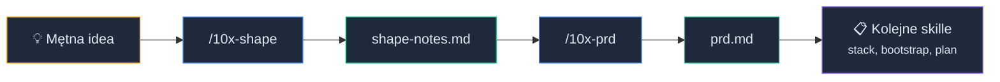
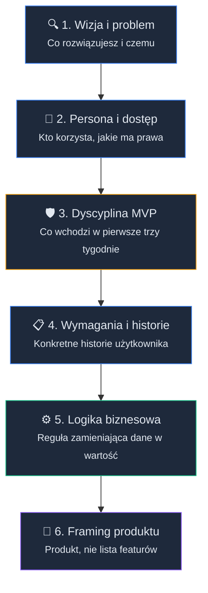

# Od pomysłu do PRD: Metoda Sokratejska z Agentem

<div style="padding:56.25% 0 0 0;position:relative;"><iframe src="https://player.vimeo.com/video/1192850361?title=0&amp;byline=0&amp;portrait=0&amp;badge=0&amp;autopause=0&amp;player_id=0&amp;app_id=58479" frameborder="0" allow="autoplay; fullscreen; picture-in-picture; clipboard-write; encrypted-media; web-share" referrerpolicy="strict-origin-when-cross-origin" style="position:absolute;top:0;left:0;width:100%;height:100%;" title="M1 L1 - Welcome"></iframe></div><script src="https://player.vimeo.com/api/player.js"></script>

Pierwsza pułapka w projekcie kursowym pojawia się zanim napiszesz pierwszą linię kodu.

Masz pomysł. Czasem nawet całkiem sensowny: aplikacja do fiszek z AI, system notatek, dashboard dla freelancerów, wewnętrzne narzędzie do firmy. Brzmi dobrze, bo na tym etapie pomysł nie musiał jeszcze odpowiedzieć na żadne niewygodne pytanie.

A potem wchodzisz w kod, dokładasz logowanie, dashboard, kilka tabel, widok statystyk... i po dwóch tygodniach okazuje się, że nadal nie wiadomo, co to właściwie za aplikacja.

Kto będzie jej używał? Jaki jest pierwszy wartościowy przepływ? Co wypada z MVP? Co robimy, kiedy użytkownik nie wróci po tygodniu?

No właśnie.

Dlatego pierwszym ruchem w 10xDevs nie jest implementacja. Pierwszym ruchem jest sesja **/10x-shape**, rozmowa, w której Agent wymusza precyzję. Po niej **/10x-prd**, który zapisuje ustalenia jako kontrakt.

Dwa osobne skille, dwa osobne artefakty: **shape-notes.md** jako zapis sesji planistycznej i **prd.md** jako kontrakt wejściowy do dalszej pracy.

Dobrze poprowadzona sesja wymusza decyzje, które samodzielnie bardzo łatwo ominąć. Zapisany kontrakt sprawia, że twoje kolejne prompty już ich nie podważą.

W preworku zebrałeś trzy elementy tej układanki: [kryteria dobrego projektu kursowego](https://platforma.przeprogramowani.pl/external/10xdevs-3-prework/pl/15) (prework 4.2), [pojęcie Agenta jako systemu działającego w kontrolowanym środowisku](https://platforma.przeprogramowani.pl/external/10xdevs-3-prework/pl/02) (prework 1.2) i [intuicję, że prompt do Agenta to kontrakt](https://platforma.przeprogramowani.pl/external/10xdevs-3-prework/pl/10) (prework 3.2).

Teraz łączymy te trzy rzeczy w pierwszy realny workflow.

Zanim Agent dostanie repozytorium, dostaje twój pomysł. I podda go odpowiedniej weryfikacji i ustrukturyzowaniu.


### Dlaczego Agent powinien pytać

Wymagania produktowe zaczynają się od języka naturalnego. Człowiek opisuje problem, pomija oczywistości, miesza życzenia z decyzjami i zakłada, że druga strona "wie, o co chodzi".

Jeśli od razu poprosisz model o dokument, uzupełni braki najbardziej prawdopodobnymi założeniami. Dostaniesz tekst, który wygląda kompletnie, ale może zawierać decyzje, których nigdy nie podjąłeś.

W pracy agentowej to szczególnie niebezpieczne. Agent potrafi potem bardzo konsekwentnie implementować błędne założenie. Dlatego wybieramy kolejność: najpierw pytania, potem dokument.

### PRD jako kontrakt dla kolejnych kroków

W preworku mówiliśmy o prompcie agenta jako kontrakcie. Dokument PRD (Product Requirements Document) działa podobnie, ale na wyższym poziomie.

Prompt zadaniowy mówi: "zrób teraz tę konkretną rzecz."

PRD mówi: "to są kluczowe ramy dla projektu, w którym ta rzecz ma sens."

Bez PRD kolejne prompty zaczną dryfować. Raz poprosisz o logowanie, raz o dashboard, raz o przypomnienia, raz o statystyki.

Każdy prompt osobno może brzmieć poprawnie, ale całość zacznie przypominać produkt złożony z przypadkowych zachcianek.

PRD daje Agentowi stabilniejszy punkt odniesienia:

- użytkownik i problem ograniczają fantazję,
- zakres ogranicza rozrost funkcji,
- non-goals chronią przed "przy okazji doróbmy jeszcze...",
- kryteria sukcesu pomagają później pisać plan i akceptację,
- otwarte pytania przypominają, gdzie nadal nie mamy pewności.

W kolejnej lekcji (M1L2) zajrzymy pod maskę skilli i wykorzystamy PRD do wyboru tech stacku pod konkretny problem, a nie pod modę.

W lekcji trzeciej (M1L3), PRD wraz z wybranym stackiem trafiają do bootstrapu projektu. To lekcja, w której zamienimy kontrakty w konkretne pliki.

Workflow **/10x-shape → /10x-prd → wybór stacku → bootstrap** rozkłada się na trzy lekcje, ale to jeden ciąg. Jeśli pierwszy kontrakt jest pusty, reszta będzie tylko szybszym sposobem dowożenia złych decyzji.

Szybciej nie zawsze znaczy lepiej. Czasem znaczy po prostu... szybciej w złym kierunku.


### Dwa skille, jeden cel

Workflow składa się z dwóch osobnych skilli. Warto od razu rozdzielić ich role.

**/10x-shape** prowadzi sesję sokratejską. Pyta, drąży, łapie luki. Nie wymyśla za ciebie, co budujesz. Wymusza, żebyś jasno to opisał.

Wynik to **shape-notes.md**: zapis decyzji, które podjąłeś.

**/10x-prd** to drugi krok. Bierze **shape-notes.md** i przepisuje go do PRD o ustalonej strukturze, wiernie, bez domyślania się i dopowiadania. Jeśli czegoś brakuje w notatkach, wpisuje to wprost w sekcji **## Open Questions**, tak abyś mógł uzupełnić wykryte luki.

Wynik to **prd.md**: kontrakt, na podstawie którego Agent będzie rozumiał co chcemy osiągnąć w tym projekcie.


<!-- rendered: ../../assets/diagrams/lessons-m1-l1-lesson-draft-1.png | cdn: https://images.przeprogramowani.pl/diagrams/lessons-m1-l1-lesson-draft-1.png -->
<!-- cdn-10x: https://images.przeprogramowani.pl/diagrams/lessons-m1-l1-lesson-draft-1-10x.png -->

Oba skille potrafią też pracować w trybie brownfield. Jeśli uruchomisz **/10x-shape** w katalogu istniejącego projektu (tam, gdzie leży **package.json**, **Cargo.toml** czy inny marker), skill wykryje ten kontekst i zaproponuje przełączenie na sesję brownfield. Zamiast pytać "co budujesz od zera", pyta "co chciałbyś dodać/poprawić w systemie?". Więcej o tym trybie działania w dalszej części lekcji.

### Sesja /10x-shape w praktyce

Weźmy 10xCards, przykładową aplikację do tworzenia i powtarzania fiszek z AI.

Pierwsza wersja pomysłu brzmi tak:

```text
## 10xCards - MVP

### Główny problem
Manualne tworzenie wysokiej jakości fiszek edukacyjnych jest czasochłonne, co zniechęca do korzystania z efektywnej metody nauki jaką jest spaced repetition.

### Najmniejszy zestaw funkcjonalności
- Generowanie fiszek przez AI na podstawie wprowadzonego tekstu (kopiuj-wklej)
- Manualne tworzenie fiszek
- Przeglądanie, edycja i usuwanie fiszek
- Prosty system kont użytkowników do przechowywania fiszek
- Integracja fiszek z gotowym algorytmem powtórek

### Co NIE wchodzi w zakres MVP
- Własny, zaawansowany algorytm powtórek (jak SuperMemo, Anki)
- Import wielu formatów (PDF, DOCX, itp.)
- Współdzielenie zestawów fiszek między użytkownikami
- Integracje z innymi platformami edukacyjnymi
- Aplikacje mobilne (na początek tylko web)

### Kryteria sukcesu
- 75% fiszek wygenerowanych przez AI jest akceptowane przez użytkownika
- Użytkownicy tworzą 75% fiszek z wykorzystaniem AI
```

To nie jest zły start, żeby myśleć o MVP. Ale to jeszcze za mało, żeby zaczynać implementację.

Kto jest użytkownikiem? Co znaczy "powtarzanie"? Który moment w aplikacji daje realną wartość? Czy pod spodem jest jakakolwiek logika biznesowa, czy to kolejny CRUD z ładnym opisem?

Mając taki opis, pokusa jest prosta, żeby napisać do agenta: "przygotuj PRD dla aplikacji do fiszek z AI". Model odpowie składnie, często nawet profesjonalnie. Tyle że taki dokument tylko elegancko opakuje brak istotnych konkretów.

Sesja **/10x-shape** wymusza inną drogę.

Agent przejmuje prowadzenie. Przeprowadza cię przez sześć faz w stałej kolejności:


<!-- rendered: ../../assets/diagrams/lessons-m1-l1-lesson-draft-2.png | cdn: https://images.przeprogramowani.pl/diagrams/lessons-m1-l1-lesson-draft-2.png -->
<!-- cdn-10x: https://images.przeprogramowani.pl/diagrams/lessons-m1-l1-lesson-draft-2-10x.png -->

W fazie **Vision & problem** Agent pyta: co dokładnie chcesz rozwiązać i czemu. W naszym przykładzie to moment, kiedy "aplikacja do fiszek z AI" musi się zmienić w konkretny problem konkretnej osoby.

W fazie **Persona & access control** pyta: kto z tego korzysta i jakie ma prawa. "Użytkownik" to za mało. Agent dociśnie cię do "dorosły learner, który sam dobiera materiały i po sesji nauki chce zamienić przeczytany tekst w fiszki, którym ufa."

W fazie **MVP discipline** przychodzi weryfikacja zakresu. Jeśli twój pierwszy przepływ wymaga więcej niż trzech tygodni pracy po godzinach, Agent nie zabroni. Ale wyłoży na stół koszt i poprosi o świadome potwierdzenie, że bierzesz dłuższy timeline na siebie.

W fazach **Functional Requirements (FRs) + user stories** i **Business logic + data** wymagania rozpisują się na konkretne decyzje. Agent uruchamia tu dwa mechanizmy, które łatwo ominąć w samodzielnym myśleniu:

- **Wyzwanie sokratejskie dla każdego FRa** — przy każdym wymaganiu pyta: "co musiałoby być prawdą, żeby ten FR był błędny?". To test, czy umiesz obronić własną decyzję i czy przemyślałeś jej implikacje.
- **Wykrywanie pustego CRUDa** — jeśli twoja logika biznesowa to "user dodaje fiszki i przegląda je", Agent powie ci wprost, że budujesz pusty CRUD. Wymusi konkretną regułę domenową: generacja fiszek z wklejonego tekstu, bramka akceptacji/odrzucenia przed zapisem, algorytm powtórek. Coś, co naprawdę zamienia dane w wartość.

Na koniec sesji Agent przechodzi przez **closing soft-gate**, weryfikując nagromadzone decyzje sześcioma pytaniami kontrolnymi:

1. Access control — czy wiesz, kto ma do czego dostęp?
2. Data model — czy wiesz, jakie dane potrzebujesz?
3. Business logic — czy masz jednozdaniową regułę biznesową?
4. Project artifacts — czy masz zdefiniowane artefakty pracy?
5. MVP-in-three-weeks — czy pierwszy przepływ zmieści się w trzy tygodnie pracy po godzinach?
6. Non-goals — czy wiesz, czego *nie* budujesz?

Jeżeli gdziekolwiek będą luki, AI wskaże gdzie brakuje ci jeszcze odpowiedzi.

Twoja rola w całej sesji to odpowiadać konkretnie, także wtedy, gdy uczciwa odpowiedź brzmi "nie wiem".

Zobaczmy jak to wygląda w praktyce:

<div style="padding:56.25% 0 0 0;position:relative;"><iframe src="https://player.vimeo.com/video/1192850360?title=0&amp;byline=0&amp;portrait=0&amp;badge=0&amp;autopause=0&amp;player_id=0&amp;app_id=58479" frameborder="0" allow="autoplay; fullscreen; picture-in-picture; clipboard-write; encrypted-media; web-share" referrerpolicy="strict-origin-when-cross-origin" style="position:absolute;top:0;left:0;width:100%;height:100%;" title="M1 L1 Shaping"></iframe></div><script src="https://player.vimeo.com/api/player.js"></script>

#### Po sesji planistycznej

Wynik naszej pracy to **shape-notes.md**: zapis decyzji, nie zapis rozmowy.

To już jest materiał, z którym **/10x-prd** może pracować. Nie gotowa aplikacja, ale wystarczająca baza do kontraktu.

Czy to wolniejsze niż wejście prosto w kod? Przez pierwszą godzinę, tak. Ale dzięki temu zaoszczędzisz ogrom czasu, który zmarnowałbyś na kodowanie rzeczy, których nie potrafiłeś konkretnie opisać.

### Generacja PRD: /10x-prd

Drugi krok to wygenerowanie PRD z notatek:

```text
/10x-prd @context/foundation/shape-notes.md
```

**/10x-prd** domyślnie czyta **context/foundation/shape-notes.md** i tworzy plik **context/foundation/prd.md**. Robi jedną rzecz: zapisuje twoje decyzje w stałej strukturze, żeby kolejne agentowe kroki miały skąd je czytać.

PRD opisuje produkt i biznes, nie technologię. W środku znajdziesz wizję, personę, kryteria sukcesu, user stories, wymagania funkcjonalne, regułę biznesową, model danych, kontrolę dostępu, jawne non-goals i listę otwartych pytań.

Tech stack, plan testów i deployment celowo nie są w PRD. Wpadną do dalszych skilli, które konsumują PRD jako wejście.

### Ostrzeżenie przed PRD widmo

Jest jedna sytuacja, w której **/10x-prd** da Ci wyraźny sygnał, że coś jest nie w porządku - gdy **shape-notes.md** ma za mało konkretów.

Skill sprawdza notatki pod kątem czterech sygnałów: checkpoint, wymagania w formacie FR-NNN, user stories ze strukturą Given/When/Then, reguła biznesowa.

Jeśli zabraknie zbyt wielu, dostajesz ostrzeżenie z konkretnymi brakami i propozycją powrotu do **/10x-shape**. Jeżeli sumiennie przejdziesz przez sesję planistyczną z `/10x-shape`, nie powinno to mieć miejsca.

### Kontrola po wygenerowaniu PRD

Otwórz **prd.md** i odpowiedz sobie:

- Czy widzisz jednego konkretnego użytkownika, nie "developera ogółem"?
- Czy pierwszy przepływ da się przejść od początku do końca w trzech tygodniach pracy po godzinach (realia pracy nad projektem kursowym)?
- Czy logika biznesowa to konkretna reguła, a nie "user dodaje rekordy"?
- Czy są jawne non-goals, czy tylko "zostawiamy na potem"?
- Czy **## Open Questions** jest pusta albo zawiera tylko naprawdę otwarte rzeczy?

Jeśli któraś odpowiedź cię niepokoi, edytujesz dokument lub wracasz do **/10x-shape**. To ważne, aby ten fundament był solidny - będziemy na nim rozwijali cały projekt.

### Nie tylko na start projektu

Ten workflow to nie rytuał inicjacyjny (no może trochę!). Powinien stać się nowym nawykiem przy rozpoczynaniu większych inicjatyw.

Często ludzie odpalają skille w stylu **/10x-shape** raz, na starcie projektu, i potem wracają do starego trybu: prosto do kodu. Tydzień później dodają nowy moduł, integrację albo poważną zmianę przepływu, a Agent nie ma żadnego kontraktu do tych zmian.

Kiedy za dwa tygodnie będziesz dodawać nowy moduł, zrób miniwersję tej samej sesji. Czasem wystarczy krótki shape pod konkretną funkcję zamiast pełnego PRD.

Zasada zostaje: zanim Agent zacznie edytować pliki, musi wiedzieć, jaki problem rozwiązujemy i po czym poznamy, że praca jest skończona.

### Brownfield: sesja na istniejącym projekcie

Nie każdy kursant startuje od zera. Jeśli twój projekt kursowy to zmiana w istniejącym systemie (nowy moduł w side-projectcie, rozbudowa narzędzia z pracy, refaktor kluczowego przepływu), workflow shape/prd działa tak samo, ale **/10x-shape** przełącza się na tryb brownfield.

W praktyce: uruchamiasz **/10x-shape** w katalogu istniejącego projektu. Skill wykrywa markery (**package.json**, **tsconfig.json**, **Cargo.toml**, **go.mod** itp.), proponuje tryb brownfield i czeka na twoje potwierdzenie. Możesz też ręcznie przełączyć tryb, jeśli auto-detekcja nie trafiła.

Te same sześć faz, ale pytania przesuwają się z "co budujesz od zera" na "co zmieniasz w tym, co już masz":

- **Vision & problem** — co jest dzisiaj, co boli i dlaczego teraz (zamiast "kto ma problem z niczego").
- **Persona & access control** — jak wygląda obecne uwierzytelnianie i kto ma jakie role (zamiast projektowania auth od zera).
- **MVP discipline** — jaka jest najmniejsza zmiana, która udowodni poprawę, i jaki jest jej blast radius. Zamiast "MVP-in-three-weeks" od pustego projektu: delta, którą da się dowieźć i zweryfikować.
- **FRs & user stories** — wymagania kategoryzowane jako nowe, zmodyfikowane lub zachowane (zamiast traktowania wszystkiego jako nowe).
- **Business logic & data** — czy ta zmiana dodaje nową regułę domenową, modyfikuje istniejącą, czy to zmiana infrastrukturalna.
- **Product framing** — czy zmienia się typ produktu, skala, ograniczenia (bramki tak/nie zamiast pełnej klasyfikacji od zera).

Na koniec sesji **shape-notes.md** zawiera dwie sekcje, których greenfield nie ma: **## Current System** (opis tego, co istnieje) i **## Constraints & Preserved Behavior** (co musi zostać nienaruszone).

#### Brownfield PRD

Kluczowa różnica: greenfield PRD opisuje cały produkt od zera. Brownfield PRD opisuje deltę: co jest dzisiaj, co się zmienia, co musi zostać.

Rozwijając istniejący projekt, w kolejnych lekcjach będziesz oceniać swój stack (zamiast wybierać nowy), a w lekcji o bootstrapie robić health-check projektu (zamiast go stawiać od zera). Brownfield PRD będzie kontraktem wejściowym dla tych kroków, tak jak greenfield PRD jest kontraktem wejściowym dla wyboru stacku technoliczinego i bootstrapu.

### Jak korzystać z 10x-cli?

Zanim przejdziesz do praktyki i odpalisz **/10x-shape**, potrzebujesz kursowego [10x-cli](https://github.com/przeprogramowani/10x-cli): narzędzia, które dostarcza skille i materiały do twojego projektu.

Zapraszamy do filmu instraktużowego z tego jak korzystać z narzędzia, poniżej znajdziesz również tekstowy poradnik. Aktualne informacje o wspieranych komendach znajdziesz zawsze w [README.md](https://github.com/przeprogramowani/10x-cli) projektu:
<div style="padding:56.25% 0 0 0;position:relative;"><iframe src="https://player.vimeo.com/video/1192952264?title=0&amp;byline=0&amp;portrait=0&amp;badge=0&amp;autopause=0&amp;player_id=0&amp;app_id=58479" frameborder="0" allow="autoplay; fullscreen; picture-in-picture; clipboard-write; encrypted-media; web-share" referrerpolicy="strict-origin-when-cross-origin" style="position:absolute;top:0;left:0;width:100%;height:100%;" title="m1l1-cli"></iframe></div><script src="https://player.vimeo.com/api/player.js"></script>


Nie musisz go instalować globalnie. Uruchamiasz je przez **npx** z tagiem **@latest**, żeby zawsze mieć najnowszą wersję:

```bash
npx @przeprogramowani/10x-cli@latest auth
```

**auth** zapyta Cię o adres email, który jest przypisany do Twojego konta na platformie Circle. Następnie wyśle magic link na ten adres. Klikasz link, CLI zapisuje token lokalnie i od tego momentu masz dostęp do materiałów. To jednorazowy krok, nie musisz go powtarzać przy każdej lekcji.

Drugi krok to pobranie paczki skilli dla tej lekcji:

```bash
npx @przeprogramowani/10x-cli@latest get m1l1
```

CLI pobiera skille z serwera i zapisuje je w twoim projekcie. Dla Claude Code lądują w **.claude/skills/**, dla Cursora w **.cursor/skills/**, dla Copilota w **.github/skills/**.

Każda lekcja ma swoją paczkę a `m1l1` to znacznik pierwszej lekcji w pierwszym module. W kolejnej lekcji będzie to `m1l2` itd.

W paczce do tej lekcji dostaniesz **/10x-init**, **/10x-shape** i **/10x-prd**, których za chwilę użyjemy.

Ponowne uruchomienie tej samej komendy **get m1l1** jest bezpieczne: CLI sprawdza, co już masz, i aktualizuje tylko to, co się zmieniło.

CLI dostarcza też [helper skille](https://github.com/przeprogramowani/10x-cli/tree/master/skills), które uczą twojego agenta, jak pracować z tym narzędziem. Na starcie najważniejszy jest **10x-cli-setup**, skill, który przeprowadzi cię (a właściwie twojego agenta) przez instalację, autentykację i konfigurację CLI pod wybrane narzędzie AI. Jeśli coś nie zadziała przy **auth** albo **get**, agent z tym skillem potrafi zdiagnozować problem i poprowadzić cię do rozwiązania.

Zainstaluj go przez **npx skills**:

```bash
npx skills add przeprogramowani/10x-cli
```

Jeśli chcesz, żeby helper skille były dostępne we wszystkich twoich projektach, dodaj flagę **-g**:

```bash
npx skills add przeprogramowani/10x-cli -g
```

Alternatywnie, jeśli nie używasz **npx skills**, możesz pobrać **SKILL.md** bezpośrednio z [repozytorium na GitHubie](https://github.com/przeprogramowani/10x-cli/tree/master/skills/10x-cli-setup) i umieścić go ręcznie w katalogu skilli swojego agenta (np. **.claude/skills/10x-cli-setup/SKILL.md**).

W paczce jest też **10x-cli-guide** - skill do codziennego użycia, który uczy agenta jak korzystać z 10xCLI: pobieranie paczek, listowanie modułów, przełączanie profili narzędzi, diagnostyka błędów

## 🧑🏻‍💻 Zadania praktyczne

Zanim przejdziesz do drugiej lekcji, przejdź pełny cykl na własnym pomyśle lub projekcie. Zacznij od pobrania materiałów do lekcji:

```
npx @przeprogramowani/10x-cli@latest auth
npx @przeprogramowani/10x-cli@latest get m1l1
```

👉 Zacznij od inicjalizacji folderu `/context` w Twoim projekcie za pomocą skilla `/10x-init`.

Następnie:

- **Greenfield** (działasz na nowym projekcie) - Wywołaj`/10x-shape` przekazując Twój mętny pomysł na aplikację jako wejście (kopiuj-wklej lub referencja do pliku). Przejdź sesję planistyczną z agentem, tak aby powstało `shape-notes.md`. Następnie wywołaj `/10x-prd` i sprawdź, czy PRD ma określonego użytkownika, rozwiązywany problem, pierwszy przepływ do zrealizowania, opis logiki biznesowej, granice MVP, jawne non-goals i kryteria sukcesu.
- **Brownfield** (zmieniasz istniejący projekt) - Wywołaj `/10x-shape` w roocie projektu i przekaż mętny pomysł na wprowadzenie zmian w projekcie.  Skill zaproponuje tryb brownfield; potwierdź i przejdź sesję skupioną na bólu obecnego systemu i najmniejszej wartościowej zmianie. `/10x-prd` wygeneruje brownfield PRD z opisem obecnego systemu, zakresem zmiany i ograniczeniami kompatybilności.

Po zakończeniu pracy powinieneś mieć dwa pliki w **context/foundation/**: **shape-notes.md** z sesji **/10x-shape** i **prd.md** wygenerowany przez **/10x-prd**.

## Odbierz swoją odznakę

Po ukończeniu tej lekcji odbierz odznakę w sekcji [10xDevs Mission Log](https://platforma.przeprogramowani.pl/10xdevs-3/mission-log) a następnie pochwal się swoim osiągnięciem!

## 🔎 Deep Dive

Ta sekcja zawiera dodatkowe pogłębienie wiedzy na temat wybranych zagadnień związanych z lekcją. W tym Deep Dive znajdziesz:

- **Jakie modele i narzędzia wybrać** — konkretne rekomendacje modeli, subskrypcji i narzędzi do pracy z agentem w Module 1

Ta sekcja lekcji nie jest obowiązkowa, ale warto się z nią zapoznać jeżeli chcesz zostać ekspertem.

### Jakie modele i narzędzia wybrać

Żeby uruchomić **/10x-shape**, potrzebujesz agenta AI z dostępem do modelu językowego. Na rynku jest ponad sto modeli i kilkanaście narzędzi. Poniżej konkretne rekomendacje zamiast przeglądu całego rynku.

**Najprostsza ścieżka: subskrypcja**

Kup subskrypcję u Anthropic albo OpenAI i zacznij pracę.

Za **$20/mies.** dostajesz solidne modele do codziennej pracy: **Claude Pro** (Sonnet 4.6) po stronie Anthropic, **ChatGPT Plus** po stronie OpenAI. Wystarczy do sesji **/10x-shape**, generowania PRD i większości zadań z Modułu 1.

Za **$100/mies.** dostajesz topowe modele z wyższymi limitami: **Claude Max** (z Opusem) po stronie Anthropic, **ChatGPT Pro** po stronie OpenAI. Ma sens, jeśli chcesz dużo pracować z tymi narzędziami i zależy ci na jakości rozumowania bez martwienia się o rachunki API i limity.

Jest jeszcze jeden argument za subskrypcją, który nie jest oczywisty na starcie: **przy aktywnym kodowaniu z AI koszty przez API kumulują się szybko.** Jedna sesja **/10x-shape** to kilkadziesiąt tysięcy tokenów. Pełny dzień pracy z agentem to miliony tokenów.

Nawet przy tanich chińskich modelach miesięczny rachunek potrafi przekroczyć $20–50 szybciej, niż myślisz. A przy modelach premium wystarczy kilka intensywnych dni, żeby subskrypcja za $100 okazała się tańsza niż płacenie za tokeny.

Przewidywalny koszt i brak liczenia tokenów to wartość sama w sobie, gdy chcesz się skupić na pracy.

**Z czego my korzystamy?**

Przez cały kurs pracujemy na **Claude Max 5x** ($100/mies.) z modelem **Opus 4.6** w wariancie z milionowym oknem kontekstowym. To mój codzienny wybór i rekomendacja dla osób, które chcą jednego narzędzia do wszystkiego.

Dlaczego 4.6, a nie nowszy Opus 4.7? W praktyce 4.7 zjada znacząco więcej tokenów przy porównywalnej jakości w zadaniach analitycznych: planowanie, sesje shape, przegląd kodu. Po co przepłacać?

**Architekci i implementatorzy**

Nie wszystkie modele nadają się do tych samych zadań.

Przetestowaliśmy 22 modele na benchmarku kodowania: pełna implementacja feature'u z bazą danych, frontendem i testami. Wyniki? Budżetowy **DeepSeek V4 Flash** (82.5 pkt, koszt $0.02 za zadanie) pobił premium **Opus 4.7** (76.8 pkt, koszt $8.69). 180 razy taniej, wyższy wynik.

Ale to benchmark *implementacyjny*. W zadaniach analitycznych, takich jak prowadzenie sesji planistycznej czy rozumowanie o architekturze, topowe modele mają przewagę, której benchmark kodowania nie uchwyci.

Stąd podział, który będzie motywem przewodnim kursu:

- **Architekci / myśliciele** — Opus, Sonnet, Gemini Pro, GPT. Analiza, planowanie, rozumowanie wielokrokowe. Droższe, ale w zadaniach wymagających myślenia nie mają sensownych zamienników.
- **Implementatorzy** — DeepSeek V4 Flash, Qwen 3.6 Plus, Qwen3 Coder, MiniMax M2.7. Doskonały stosunek ceny do jakości kodu. Kilka z nich ma darmowe tiery na [OpenRouter](https://openrouter.ai).

Orientacyjne ceny na [OpenRouter](https://openrouter.ai/models) (maj 2026, za milion tokenów):

| Model | Rola | Input / Output | Kontekst | Uwagi |
|---|---|---|---|---|
| [Claude Opus 4.6 / 4.7](https://openrouter.ai/anthropic/claude-opus-4.6) | Architekt | $5.00 / $25.00 | 1M / 200K | topowe rozumowanie, mój wybór (4.6) |
| [Claude Sonnet 4.6](https://openrouter.ai/anthropic/claude-sonnet-4.6) | Architekt | $3.00 / $15.00 | 200K | najlepsza wartość wśród architektów |
| [Gemini 3.1 Pro](https://openrouter.ai/google/gemini-3.1-pro) | Architekt | $2.00 / $12.00 | 1M | tańsza alternatywa z dużym kontekstem |
| [GPT-5.5](https://openrouter.ai/openai/gpt-5.5) | Architekt | $5.00 / $30.00 | 922K | flagowy model OpenAI |
| [GPT-5.3 Codex](https://openrouter.ai/openai/gpt-5.3-codex) | Architekt | $1.75 / $14.00 | 400K | model kodujący OpenAI, duży output (128K) |
| [DeepSeek V4 Flash](https://openrouter.ai/deepseek/deepseek-v4-flash) | Implementator | $0.11 / $0.22 | 1M | **lider naszego benchmarku, jest [free tier](https://openrouter.ai/deepseek/deepseek-v4-flash:free)** |
| [Qwen3 Coder 480B](https://openrouter.ai/qwen/qwen3-coder) | Implementator | $0.22 / $1.80 | 262K | **model pod kodowanie, jest [free tier](https://openrouter.ai/qwen/qwen3-coder:free)** |
| [Qwen 3.6 Plus](https://openrouter.ai/qwen/qwen3.6-plus) | Implementator | $0.33 / $1.95 | 1M | wszechstronny, duży kontekst |
| [MiniMax M2.7](https://openrouter.ai/minimax/minimax-m2.7) | Implementator | $0.28 / $1.20 | 197K | open-source, stabilny |
| [DeepSeek V4 Pro](https://openrouter.ai/deepseek/deepseek-v4-pro) | Oba | $0.44 / $0.87 | 1M | mocniejszy brat V4 Flash |

Ceny zmieniają się dynamicznie, traktuj tabelę jako punkt orientacyjny. Aktualny cennik sprawdzaj na [openrouter.ai/models](https://openrouter.ai/models).

Trzy modele mają darmowe tiery na OpenRouter (z ograniczeniami liczby zapytań): [DeepSeek V4 Flash](https://openrouter.ai/deepseek/deepseek-v4-flash:free), [Qwen3 Coder](https://openrouter.ai/qwen/qwen3-coder:free) i [Hy3 Preview](https://openrouter.ai/tencent/hy3-preview) (Tencent, 72.9 pkt w naszym benchmarku). Możesz zacząć eksperymentować za $0.

**W Module 1 potrzebujesz architektów.** Sesje **/10x-shape**, generowanie PRD, analiza stacku, planowanie. To zadania, w których liczy się jakość rozumowania.

**W Module 2 pokażemy pętlę z implementatorami.** Architekt planuje, implementator koduje. Delegowanie implementacji do tańszych modeli to osobny temat. Na razie zapamiętaj, że istnieją modele kodujące na poziomie premium za ułamek ceny.

**Alternatywa: OpenRouter + OpenCode**

Nie musisz kupować subskrypcji. [**OpenRouter**](https://openrouter.ai) daje dostęp do ponad stu modeli z jednego klucza API. Płacisz za zużycie, nie za miesiąc. Rejestrujesz się, doładowujesz kredyty (albo korzystasz z darmowych tierów) i masz dostęp do wszystkich modeli z tabelki wyżej.

[**OpenCode**](https://opencode.ai) to otwartoźródłowy agent CLI z ponad 160 tysiącami gwiazdek na GitHubie. Działa z dowolnym dostawcą modeli: OpenRouter, Anthropic, OpenAI, lokalne modele przez Ollama.

Nasz benchmark kodowania (22 modele) był przeprowadzony właśnie na OpenCode z modelami przez OpenRouter. Te wyniki nie są teoretyczne.

Ta ścieżka wymaga więcej konfiguracji na start, ale daje pełną kontrolę nad kosztami i dostęp do chińskich modeli, które zdominowały nasz benchmark. Jeśli twój budżet jest ograniczony, chcesz eksperymentować albo zależy ci na prywatności (OpenCode nie przechowuje twojego kodu), warto rozważyć ten wariant.

**Testuj na swoich zadaniach**

Nasze dane to jeden benchmark, jedno zadanie. Twój projekt i twoje preferencje mogą dać inne wyniki.

Wypróbuj 2–3 modele na własnym projekcie, zanim zdecydujesz na stałe. Sprawdź, jak model radzi sobie z **/10x-shape** na twoim konkretnym pomyśle. To najlepszy test, jaki możesz przeprowadzić.

## 📚 Materiały dodatkowe

- [What is a Product Requirements Document?](https://www.atlassian.com/agile/product-management/requirements) — Atlassian
- [Towards a question-answering model for requirements elicitation](https://link.springer.com/article/10.1007/s10515-023-00386-w) — QUARE
- [Building effective agents](https://www.anthropic.com/engineering/building-effective-agents) — Anthropic
- [Prompting fundamentals](https://openai.com/academy/prompting/) — OpenAI Academy
- [About GitHub Copilot cloud agent](https://docs.github.com/en/copilot/concepts/agents/cloud-agent/about-cloud-agent) — GitHub Docs
- [OpenRouter](https://openrouter.ai) — brama do 100+ modeli AI z jednego klucza API
- [OpenCode](https://opencode.ai) — otwartoźródłowy agent CLI do kodowania z AI
- [OpenRouter + OpenCode quickstart guide](https://openrouter.ai/docs/cookbook/coding-agents/opencode-integration) — integracja OpenRouter z OpenCode
