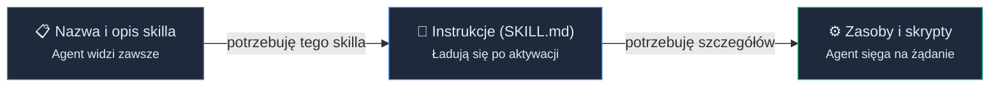
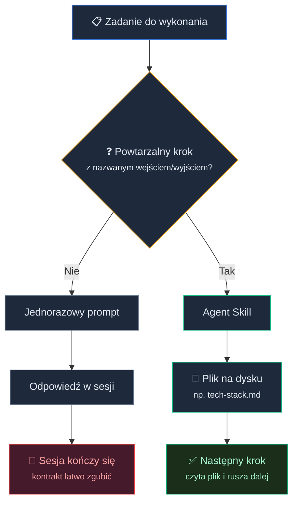
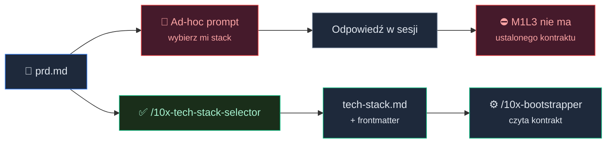
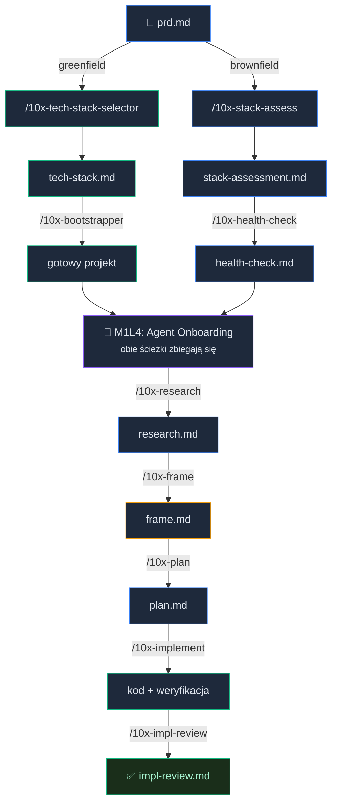

# Od Chatbota do Agenta: tech stack, skille i metaprompting

W poprzedniej lekcji twój pomysł na projekt przeszedł sesję sokratejską i wylądował na dysku jako **prd.md**: kontrakt opisujący *co* budujesz, dla kogo i po czym poznasz, że działa.

Naturalny odruch: otworzyć nową sesję, wkleić PRD i napisać "ok, wybierz mi stack do tego projektu". Model odpowie. Pewnie nawet sensownie.

Ale ta odpowiedź żyje głównie w tej jednej sesji. Możesz dopisać "zapisz to do pliku", jasne. Tylko wtedy za tydzień znowu musisz pamiętać, jaki plik, w jakim formacie i według jakich reguł.

W preworku [3.2] *Wzorce i antywzorce promptowania* "skille" były jedną z pozycji w hierarchii instrukcji: system prompt → reguły projektowe → pamięć → **skille** → prompt. Teraz ta pozycja awansuje do pełnoprawnego mechanizmu pracy.

Pod koniec tej lekcji uruchomisz **/10x-tech-stack-selector** na własnym PRD i dostaniesz **tech-stack.md**, plik, który lekcja AI-Powered Bootstrap (M1L3) przeczyta i zamieni w gotowy szkielet projektu. Masz istniejący projekt zamiast nowego? Czeka na ciebie **/10x-stack-assess**, który oceni twój stack pod kątem pracy z agentem. Zaczynamy.

### Czym jest Agent Skill

Agent Skill to folder na dysku z jednym wymaganym plikiem: **SKILL.md**.

W środku znajdziesz:

- **SKILL.md** — instrukcje, które agent czyta po aktywacji. Zalecany limit to ~500 linii. Przekraczasz? Dodajesz kolejne pliki zamiast rozbudowywać główny dokument.
- **references/** — dodatkowa dokumentacja, schematy, rejestry, przykłady. Agent ładuje je dopiero wtedy, kiedy potrzebuje.
- **scripts/** — kod wykonywalny (walidator, generator, skrypt migracyjny). Agent uruchamia go przez bash; sam kod nie trafia w okno kontekstowe, tylko wynik wykonania.
- **assets/** — szablony, ikony, fonty używane w plikach wyjściowych.

Folder z markdownem i opcjonalnymi zasobami. Nic więcej.

Struktura to dopiero początek. Ważniejsze jest to, *jak* agent z tych plików korzysta. W skrócie, agent odkrywa skille zgodnie z zasadą progresywnego ujawniania w trzech etapach:

1. **Metadane** (~100 tokenów) — nazwa i opis. Agent widzi je od startu sesji i na tej podstawie *decyduje*, czy skill jest potrzebny.
2. **Instrukcje** (do ~5000 tokenów) — treść **SKILL.md**. Ładują się dopiero po aktywacji. Jeśli skill się nie uruchomi, te tokeny nie istnieją w oknie kontekstowym.
3. **Zasoby** (bez limitu) — pliki z **references/**, **scripts/**, **assets/**. Agent sięga po nie w trakcie pracy, kiedy potrzebuje konkretnej informacji.

Okno kontekstowe to budżet (wiesz to z preworku [3.1] i [3.3]). Progresywne ujawnianie to sposób, w jaki skille ten budżet szanują.

Dwadzieścia zainstalowanych skilli kosztuje cię ~2000 tokenów metadanych, nie ~100 000 tokenów pełnych instrukcji. Agent wie *o* nich wszystkich, ale *czyta* tylko te, które uruchamia.


<!-- rendered: ../../assets/diagrams/lessons-m1-l2-lesson-draft-1.png | cdn: https://images.przeprogramowani.pl/diagrams/lessons-m1-l2-lesson-draft-1.png -->
<!-- cdn-10x: https://images.przeprogramowani.pl/diagrams/lessons-m1-l2-lesson-draft-1-10x.png -->

### Skill vs jednorazowy prompt

Kiedy wpisujesz prompt w czat, tworzysz jednorazową instrukcję. Działa tu i teraz, w kontekście tej konkretnej sesji. Możesz poprosić agenta o zapisanie pliku, możesz wymusić JSON, możesz opisać wejście i wyjście.

Różnica nie polega więc na tym, że prompt *nie potrafi* wytworzyć artefaktu. Polega na tym, że sam prompt nie daje trwałego, wersjonowanego mechanizmu, do którego możesz wrócić w kolejnej sesji.

Skill daje pięć gwarancji, których jednorazowy prompt zwykle nie daje sam z siebie:

1. **Istnieje na dysku.** Plik(i) w repozytorium, nie tekst w historii czatu. Możesz go otworzyć, audytować, zmienić i wersjonować.
2. **Ładuje się progresywnie.** Agent widzi opis (~100 tokenów) zawsze, ale pełne instrukcje czyta dopiero po aktywacji. Prompt wchodzi w kontekst natychmiast i w całości.
3. **Ma kontrakt wejścia/wyjścia zapisany w procedurze.** Czyta plik z dysku (np. **prd.md**), zapisuje wynik jako plik (np. **tech-stack.md**) i robi to według powtarzalnego schematu. Prompt też może poprosić o plik, ale za każdym razem musisz odtworzyć reguły.
4. **Uruchamia się po nazwie.** Piszesz **/10x-tech-stack-selector** i wiesz, co dostaniesz. Nie odtwarzasz pełnej instrukcji z głowy ani nie kopiujesz z notatnika za każdym razem.
5. **Jest powtarzalny między sesjami.** Zamykasz sesję, otwierasz nową za tydzień i wracasz do tej samej procedury. Wynik modelu nadal może się różnić (brak determinizmu), ale kontrakt pracy zostaje ten sam.


<!-- rendered: ../../assets/diagrams/lessons-m1-l2-lesson-draft-2.png | cdn: https://images.przeprogramowani.pl/diagrams/lessons-m1-l2-lesson-draft-2.png -->
<!-- cdn-10x: https://images.przeprogramowani.pl/diagrams/lessons-m1-l2-lesson-draft-2-10x.png -->

Reguła decyzyjna jest prosta: **powtarzalny proces** - sięgaj po skill. **Jednorazowa eksploracja, wyjaśnienie albo edycja** - napisz prompt i ruszaj dalej.

Heurystyka na co dzień: łapiesz się na pisaniu *trzeciego* podobnego promptu? To znak, że warto stworzyć skilla.

Sprawdź się na pięciu scenariuszach:

| Sytuacja | Skill czy prompt? |
|----------|------------------|
| "Popraw literówkę w README" | Prompt — jednorazowa edycja. |
| "Wytłumacz mi, co robi ta funkcja" | Prompt — jednorazowe wyjaśnienie. |
| "Wybierz mi stack do tego PRD" | Skill — powtarzalny krok z nazwanym wejściem (**prd.md**) i wyjściem (**tech-stack.md**). |
| "Wygeneruj plan implementacji logowania" | Skill — powtarzalny krok z nazwanym kontraktem (**/10x-plan**). |
| "Podsumuj mi tę długą sesję czatu" | Prompt — jednorazowa analiza bieżącego kontekstu. |

Istnieją też inne warstwy konfiguracji agenta, np. reguły projektowe (**AGENTS.md**/**CLAUDE.md**). Tu zostajemy przy kontraście skill vs jednorazowy prompt, bo prompt to warstwa, którą aktywnie używasz od pierwszego dnia pracy z agentem.

### Skąd brać skille

Wiesz już, czym skill jest i kiedy po niego sięgnąć. Pozostaje pytanie: skąd go wziąć?

Nie musisz pisać wszystkiego od zera. Ekosystem ma gotowe rejestry:

- **[anthropics/skills](https://github.com/anthropics/skills)** — oficjalne skille Anthropica, w tym **skill-creator** (meta-skill do tworzenia nowych skilli).
- **[skills.sh](https://skills.sh/)** — publiczny rejestr z tysiącami skilli i dziesiątkami tysięcy instalacji. Obsługuje wiele agentów: Claude Code, Cursor, Codex, Gemini CLI i inne.
- **Skille producentów narzędzi** — np. **[supabase/agent-skills](https://github.com/supabase/agent-skills)** (best practices Postgresa, 8 kategorii reguł) czy **[vercel-labs/agent-skills](https://github.com/vercel-labs/agent-skills)** (skill **react-best-practices**, 40+ reguł React/Next.js).

**Audyt przed instalacją.** Skille mogą zawierać kod wykonywalny w **scripts/**. Anthropic mówi wprost: traktuj instalację skilla jak instalację oprogramowania.

Zanim dodasz skill:

- Otwórz **SKILL.md** — przeczytaj cel, zakres i **allowed-tools**.
- Sprawdź **scripts/** — co wykonuje? Czego dotyka?
- Sprawdź autora i źródło — znany producent, zweryfikowane repo, czy losowy fork?

Nie instaluj niczego, czego nie przeczytałeś. Brzmi jak truizm, ale wiele osób traktuje skille jak zwykłe pliki tekstowe, a w połączeniu z agentem skill może wykonać niechciane operacje.

## Dwa typy skilli

Są dwa typy skilli, które warto rozróżnić:

- **Procesowy** (np. **/10x-tech-stack-selector**) — uruchamiasz go jawnie, czyta plik, produkuje plik. Ogniwo łańcucha.
- **Doradczy** (np. **react-best-practices**) — ładuje się automatycznie, kiedy pracujesz w danej domenie, bo jego **description** nazywa konteksty aktywacji. Nie produkuje artefaktu, ale wpływa na każdą decyzję agenta w sesji.

Oba mają tę samą specyfikację. Różni się to, jak skill opisuje swoją pracę i jak go uruchamiasz.

### Aktywacja: jawna vs automatyczna

Skille doradcze obiecują automatyczną aktywację: agent czyta **description**, rozpoznaje kontekst i sam ładuje instrukcje. Brzmi świetnie, ale nie zawsze działa tak pewnie, jak sugeruje opis.

Problem jest prosty: model nie wie, czego nie wie. Jeśli uważa, że zna odpowiedź, może nie poczuć potrzeby załadowania skilla, nawet gdy ten skill zawiera dokładnie te instrukcje, które byłyby potrzebne.

To nie przekreśla skilli. To tylko przypomina, że automatyczna aktywacja zakłada trudną rzecz: model musi rozpoznać własną lukę w wiedzy. Szczegóły jednego z evali Vercela zostawiamy w Deep Dive.

**Co z tego wynika w praktyce?**

- **Skille procesowe** (**/10x-tech-stack-selector**, **/10x-plan**) — wywołujesz jawnie po nazwie. Decyzję podejmujesz ty, więc agent nie musi zgadywać, czy skill jest potrzebny.
- **Skille doradcze** (**react-best-practices**, **supabase-postgres-best-practices**) — traktuj automatyczną aktywację jako pomoc, nie gwarancję. Jeśli wynik ma znaczenie, nazwij skill wprost albo wróć do niego w regułach projektowych, które omówimy w lekcji czwartej.

Automatyczna aktywacja będzie się poprawiać razem z modelami i harnessami. Na dziś planuj workflow tak, żeby ważne kroki były jawne, a automatyczną aktywację traktuj jako bonus.

### PRD → tech-stack.md w praktyce

Teoria za nami. Czas zobaczyć, jak skill pracuje na prawdziwym projekcie.

Wróćmy do PRD z lekcji Od pomysłu do PRD (M1L1). Mamy **prd.md** projektu 10xCards, aplikacji do fiszek z AI.


<!-- rendered: ../../assets/diagrams/lessons-m1-l2-lesson-draft-3.png | cdn: https://images.przeprogramowani.pl/diagrams/lessons-m1-l2-lesson-draft-3.png -->
<!-- cdn-10x: https://images.przeprogramowani.pl/diagrams/lessons-m1-l2-lesson-draft-3-10x.png -->

**Najpierw: ad-hoc prompt.**

Otwierasz nową sesję, dodajesz refrencję do @prd.md i piszesz: "ok, wybierz mi stack do tego projektu". Agent coś zaproponuje, pewnie nawet trafnie.

Ale co właściwie dostajesz?

- Odpowiedź w sesji, zwykle bez pliku na dysku.
- Najpewniej nie dostaniesz żadnych pytań o swoje preferencje, tylko gotową propozycję.
- Brak informacji, czy starter powiązany z tech stackiem jest przetestowany i wspierany.

Wynik mógłby być sensowny, ale **/10x-bootstrapper** w kolejnej lekcji AI-Powered Bootstrap (M1L3) nie będzie w stanie wygenerować szkieletu projektu na podstawie tych mętnych propozycji.

**Teraz: ten sam PRD przez skill.**

```
/10x-tech-stack-selector @context/foundation/prd.md
```

Skill czyta przesłanki z PRD (typ projektu, timeline, wymagania funkcjonalne) i da Ci rekomendację opartą na wbudowanym rejestrze starterów. Jeśli PRD jest jednoznaczny, standardowa ścieżka zamyka się szybko.

Wynikiem procesu będzie **context/foundation/tech-stack.md** z następującą strukturą:

```yaml
starter_id: 10x-astro-starter
bootstrapper_confidence: first-class
path_taken: standard
has_auth: true
has_ai: true
has_payments: false
has_realtime: false
has_background_jobs: false
```

W dokumencie będzie również sekcja "Why this stack" wiążąca wymagania z PRD z możliwościami wybranego stacku technologicznego.

To jest kontrakt. **/10x-bootstrapper** w lekcji AI-Powered Bootstrap (M1L3) przeczyta ten plik, zobaczy **starter_id**, **bootstrapper_confidence: first-class** i będzie wiedział, co robić dalej.

Agent nie będzie musiał zgadywać ani improwizować.

#### Dlaczego skill zrobi to przewidywalnie?

Zajrzyjmy do **SKILL.md** w `/10x-tech-stack-selector`:

- **description** — agent wie, kiedy po skill sięgnąć ("what stack should I use", "co wybrać do projektu").
- **allowed-tools** — lista narzędzi, z których agent może korzystać w ramach tego skilla. Jawny kontrakt uprawnień.
- **references/starter-registry.yaml** — rejestr sprawdzonych starterów z bramkami jakości. Ładuje się na żądanie, nie zajmuje okna z góry.
- **references/handoff-schema.md** — schemat pliku wyjściowego, który **/10x-bootstrapper** umie odczytać. Kontrakt jest jawny.
- **references/agent-friendly-criteria.md** — kryteria oceny, czy stack jest przyjazny agentowi. Ad-hoc prompt tego nie sprawdzi, jeśli nie podasz mu takich reguł.

Skill robi z PRD-a powtarzalny krok procesu i zostawia na dysku artefakt, który następne ogniwo łańcucha umie przeczytać.

<div style="padding:56.25% 0 0 0;position:relative;"><iframe src="https://player.vimeo.com/video/1192850362?title=0&amp;byline=0&amp;portrait=0&amp;badge=0&amp;autopause=0&amp;player_id=0&amp;app_id=58479" frameborder="0" allow="autoplay; fullscreen; picture-in-picture; clipboard-write; encrypted-media; web-share" referrerpolicy="strict-origin-when-cross-origin" style="position:absolute;top:0;left:0;width:100%;height:100%;" title="M1 L2 Techstack"></iframe></div><script src="https://player.vimeo.com/api/player.js"></script>

### Ocena istniejącego stacku

Jeśli będziesz pracował na projekcie typu brownfield (istniejący codebase), nie wybierasz stacku od zera. Oceniasz ten, z którym pracujesz.

**/10x-stack-assess** robi dokładnie to: wchodzi do katalogu projektu, wykrywa komponenty stacku (język, framework, build tool, test runner, package manager) i ocenia każdy przez cztery bramki jakości, te same, których **/10x-tech-stack-selector** używa do wyboru stacku greenfield:

1. **Typed** — czy język/framework ma system typów, który agent potrafi czytać?
2. **Convention-based** — czy są konwencje katalogowe i nazewnicze, z którymi agent się orientuje?
3. **Popular in training data** — czy narzędzie jest wystarczająco popularne, żeby agent miał o nim wiedzę?
4. **Well-documented** — czy dokumentacja jest dostępna i aktualna?

Różnica jest w zastosowaniu. **/10x-tech-stack-selector** stosuje bramki jako *filtr wyboru*: odrzuca startery, które ich nie spełniają. **/10x-stack-assess** stosuje je jako *narzędzie diagnostyczne*. Nie odrzuca twojego stacku, tylko wskazuje, gdzie agent będzie miał tarcia, i daje plan kompensacji.

Wynik: **context/foundation/stack-assessment.md** z oceną każdego komponentu osobno, zidentyfikowanymi lukami i planem kompensacji.

Trzy możliwe werdykty:
- **ready** — stack spełnia bramki, agent pracuje sprawnie.
- **ready-with-compensation** — stack ma luki, ale plan kompensacji je łata. Większość istniejących projektów ląduje tutaj.
- **significant-friction** — luki są poważne; rozważ migrację kluczowych komponentów (np. dodanie TypeScripta).

Przykład: twój projekt używa Express.js bez TypeScripta.

```yaml
verdict: ready-with-compensation
components_assessed:
  - name: express
    typed: fail
    convention_based: fail
    popular_in_training: pass
    well_documented: pass
  - name: node
    typed: fail
    convention_based: pass
    popular_in_training: pass
    well_documented: pass
compensation:
  - "Opisz konwencje nazewnicze i strukturę katalogów w regułach agenta"
  - "Zdefiniuj wzorce middleware i error-handling w pliku konfiguracyjnym"
  - "Wymuś JSDoc na publicznych interfejsach"
```

Express przechodzi bramki "popular" i "documented", ale nie "typed" (brak systemu typów) ani "convention-based" (brak narzuconej struktury katalogów). Bez kompensacji agent będzie generował kod, który *działa*, ale może łamać konwencje twojego projektu.

Plan kompensacji to propozycje wpisów do plików konfiguracyjnych agenta (**CLAUDE.md**, **AGENTS.md**). Jak te pliki tworzyć, edytować i utrzymywać - to temat lekcji Agent Onboarding (M1L4).

Obie ścieżki (greenfield i brownfield) zbiegną właśnie w tej lekcji, z równoważnym kontekstem. Różni się punkt wejścia, nie sposób pracy.

### Skille jako budulec 10xWorkflow

**/10x-tech-stack-selector** to pierwszy widoczny konsument PRD. Ale to dopiero pierwsze ogniwo; reszta kursu to kolejne ogniwa tego samego formatu.

Cały moduł 1 przygotowuje środowisko do pracy z agentem: PRD jako kontrakt (M1L1), skille i wybór stacku (ta lekcja), bootstrap projektu (M1L3), konfiguracja agenta (M1L4) i od localhosta po produkcję (M1L5). Kiedy środowisko jest gotowe, moduł 2 wprowadza workflow implementacyjny, i tam te skille stają się codziennymi narzędziami.

Łańcuch, który zobaczysz w działaniu od modułu 2:

**/10x-research** — eksploracja kodu równoległymi sub-agentami. Rozkładasz pytanie badawcze na obszary, skill odpala 2–4 agenty przeszukujące repozytorium jednocześnie, a potem scala ich wyniki w jeden dokument z referencjami **plik:linia**. Wejście: pytanie → Wyjście: **research.md**.

**/10x-frame** — kwestionowanie założeń problemu, zanim zaplanujesz rozwiązanie. Rozdziela obserwację od domniemanej przyczyny, buduje mapę wymiarów problemu, testuje hipotezy równoległymi agentami i zadaje pytania sokratejskie: nie o rozwiązanie, tylko o to, *gdzie w mapie leży prawdziwy problem*. Wejście: opis problemu lub ticket → Wyjście: **frame.md** z przeramowanym (lub potwierdzonym) sformułowaniem problemu.

**/10x-plan** — plan implementacji ze skalowanym pytaniem. Im więcej artefaktów dostaje na wejściu (research + frame), tym mniej pytań zadaje. Ocenia złożoność zadania, dopasowuje głębokość pytań (od 4 do 15), a każda opcja ma rekomendację z analizą kompromisów. Wejście: problem + research + frame → Wyjście: **plan.md** z fazami + **plan-brief.md** (krótkie podsumowanie).

**/10x-implement** — egzekucja planu faza po fazie z pełnym rytuałem weryfikacji. Śledzi dotknięte pliki, uruchamia testy, zatrzymuje się na bramce ręcznej weryfikacji, commituje wskazane pliki (nigdy **git add -A**), a po zamknięciu fazy wpisuje SHA commita do sekcji Progress. Wejście: **plan.md** → Wyjście: zaimplementowany kod z historią commitów.

**/10x-impl-review** — przegląd implementacji kontra plan. Dwa równoległe agenty: jeden szuka dryfu między planem a kodem (MATCH / DRIFT / MISSING / EXTRA), drugi skanuje bezpieczeństwo, wydajność i zgodność z wzorcami projektu. Sześć wymiarów oceny i interaktywna pętla decyzyjna: napraw, zaakceptuj ryzyko albo zapisz jako regułę na przyszłość. Wejście: **plan.md** + kod → Wyjście: **impl-review.md** z listą ustaleń i podjętych decyzji.

Każdy z tych skilli ma ten sam format: **SKILL.md** + **references/** + opcjonalnie **scripts/**. Każdy czyta plik wyprodukowany przez wcześniejszy krok i zapisuje wynik jako wejście dla następnego.


<!-- rendered: ../../assets/diagrams/lessons-m1-l2-lesson-draft-4.png | cdn: https://images.przeprogramowani.pl/diagrams/lessons-m1-l2-lesson-draft-4.png -->
<!-- cdn-10x: https://images.przeprogramowani.pl/diagrams/lessons-m1-l2-lesson-draft-4-10x.png -->

Nie uczysz się nowej abstrakcji w każdym module. Uczysz się kolejnego ogniwa bazującego na tym samym fundamencie specyfikacji Agent Skills.

Ten sposób pracy opanujesz raz, w module 1. W module 2, kiedy środowisko będzie przygotowane (projekt postawiony, agent skonfigurowany, deployment ustawiony), uruchomisz nowe skille na realnych zadaniach w swoim projekcie. Zobaczysz, że każdy z nich działa dokładnie tak samo jak **/10x-tech-stack-selector**: czyta plik, produkuje plik, następne ogniwo rusza dalej.

To jest nasza definicja "AI-native software engineering": nie pojedyncze prompty, ale elastyczny zestaw skilli, który rośnie razem z tobą.

## 🧑🏻‍💻 Zadania praktyczne

Teraz twoja kolej. Pobierz paczkę lekcyjną:

```bash
npx @przeprogramowani/10x-cli@latest get m1l2
```

Kiedy masz paczkę:

- **Greenfield:** Uruchom **/10x-tech-stack-selector** na swoim **prd.md** z lekcji Od pomysłu do PRD (M1L1). Przejdź przez proces wyboru stacku technologicznego. Sprawdź, czy dostałeś **tech-stack.md** z frontmatter; będziesz go potrzebować w lekcji AI-Powered Bootstrap (M1L3).
- **Brownfield:** Uruchom **/10x-stack-assess** w katalogu istniejącego projektu. Przejrzyj **stack-assessment.md**: które quality gates twój stack spełnia, gdzie są luki, co skill proponuje jako kompensację. Ten plik będzie punktem wejścia dla **/10x-health-check** w lekcji AI-Powered Bootstrap (M1L3).

## Odbierz swoją odznakę

Po ukończeniu tej lekcji odbierz odznakę w sekcji [10xDevs Mission Log](https://platforma.przeprogramowani.pl/10xdevs-3/mission-log) a następnie pochwal się swoim osiągnięciem!

## 🔎 Deep Dive

Ta sekcja zawiera dodatkowe pogłębienie wiedzy na temat wybranych zagadnień związanych z lekcją. W tym Deep Dive znajdziesz:

- **Tworzenie własnych skilli** — dwie ścieżki budowania skilli: rozmowa z modelem vs skill-creator z evalami
- **Gdy skill sam się nie aktywuje** — co evale Vercela mówią o automatycznej aktywacji skilli i dlaczego ważne kroki warto wywoływać jawnie

Ta sekcja lekcji nie jest obowiązkowa, ale warto się z nią zapoznać jeżeli chcesz zostać ekspertem.

### Tworzenie własnych skilli

Konsumowanie gotowych skilli to punkt wejścia. Ale prawdziwa zmiana w pracy z agentem zaczyna się wtedy, kiedy tworzysz własne, dopasowane do twojego stacku, twojej domeny, twoich powtarzalnych zadań.

To jest prostsze, niż się wydaje. Są dwie ścieżki. Różnią się kosztem, formalnością i przewidywalnością wyników.

#### Ścieżka 1: rozmowa z modelem

Najprostsza droga: otwierasz sesję z modelem typu architekt i opisujesz, co skill ma robić.

Nie potrzebujesz do tego żadnego specjalnego narzędzia. Wystarczy agent (Claude Code, Cursor, Codex) i twój opis kontraktu:

- Co skill dostaje na wejściu? (np. plik **prd.md**)
- Co ma wyprodukować? (np. plik **tech-stack.md** z określonym frontmatter)
- Jakie kroki ma przejść?
- Czego *nie* powinien robić?

Agent pisze **SKILL.md**. Ty go czytasz, uruchamiasz, widzisz co działa a co nie, wracasz do rozmowy i poprawiasz. Trzy-cztery iteracje i masz działający skill.

Ta ścieżka jest szybka i tania. Nie wymaga żadnej infrastruktury, tylko twojej zdolności do oceny, czy wynik jest dobry. Dla większości skilli, które piszesz pod siebie, to wystarczy.

#### Ścieżka 2: **skill-creator** z evalami

Anthropic publikuje meta-skill **[skill-creator](https://github.com/anthropics/skills/tree/main/skills/skill-creator)**. Opisujesz kontrakt wejścia i wyjścia, a **skill-creator** generuje szkielet **SKILL.md** i opcjonalnie zestaw ewaluacji, które automatycznie sprawdzają, czy nowa wersja skilla produkuje poprawne wyniki.

Evale automatyzują weryfikację: zamiast ręcznie testować każdą zmianę, uruchamiasz zestaw przypadków testowych i dostajesz raport. To daje bardziej przewidywalne wyniki, zwłaszcza kiedy skill ma wielu użytkowników albo jest częścią dłuższego łańcucha.

Ale jest tradeoff.

Evale kosztują czas i pieniądze: każdy eval to wywołanie modelu. A zaprojektowanie *dobrego* evalu wymaga zrozumienia, co właściwie weryfikujesz. Domyślne evale mogą być **zbyt korzystne dla nowej wersji skilla**: testują to, co nowa wersja robi dobrze, zamiast to, co powinna robić dobrze. Żeby eval naprawdę chronił jakość, musisz go zaprojektować pod *granice* i *edge case'y* twojego kontraktu, nie pod happy path.

To nie jest wada **skill-creator**. To fundamentalna trudność automatycznej weryfikacji. Dobry eval jest trudniejszy od dobrego skilla.

#### Którą ścieżkę wybrać?

- **Skill pod siebie, do własnego workflow** — ścieżka 1. Rozmowa, iteracja, ręczne testy. Próg wejścia: zero.
- **Skill współdzielony z zespołem lub częścią łańcucha** — ścieżka 2, kiedy zależy ci na powtarzalności i weryfikacji bez ręcznego testowania każdej zmiany.
- **Najpierw 1, potem 2** — naturalna progresja. Zaczynasz od rozmowy, skill działa. Kiedy zaczynasz go zmieniać częściej albo przekazujesz innym, dorzucasz evale.

Łapiesz się na pisaniu *trzeciego* promptu robiącego to samo? Otwórz sesję z agentem i powiedz mu, co wchodzi i co wychodzi. Nie potrzebujesz niczego więcej na start.

### Problemy z automatyczną aktywacją

W lekcji zostawiliśmy praktyczny wniosek: ważne skille wywołuj jawnie, a automatyczną aktywację traktuj jak pomoc, nie gwarancję.

Skąd ta ostrożność?

Vercel zweryfikował [skuteczność automatycznej aktywacji skilli](https://vercel.com/blog/agents-md-outperforms-skills-in-our-agent-evals) podczas ewaluacji zadań związanych z Next.js 16. Test dotyczył nowych API, takich jak **connection()**, **'use cache'** i **forbidden()**, czyli obszarów, w których model nie mógł wygrać samą wiedzą z treningu. Musiał sięgnąć po właściwą dokumentację.

Wyniki były takie:

| Konfiguracja | Skuteczność |
|---|---|
| Baseline (brak dokumentacji) | 53% |
| Skill (domyślne zachowanie) | 53% |
| Skill z jawnymi instrukcjami aktywacji | 79% |
| **AGENTS.md** z indeksowaną dokumentacją | 100% |

Najważniejszy wniosek: skill z domyślnym zachowaniem dał taki sam wynik jak brak dokumentacji. W 56% przypadków agent w ogóle po niego nie sięgnął, mimo że miał do niego dostęp.

To nie znaczy, że skille są wadliwe. Vercel sam pisze, że dobrze pasują do pionowych, konkretnych workflowów, zwłaszcza takich, które użytkownik wywołuje świadomie. To jest dokładnie to czego uczymy w 10xDevs, skilli procesowych które wywołujemy manualnie: **/10x-tech-stack-selector**, **/10x-plan**, **/10x-implement**.


## 📚 Materiały dodatkowe

- [Agent Skills — overview](https://platform.claude.com/docs/en/agents-and-tools/agent-skills/overview) — oficjalna dokumentacja Anthropica: anatomia, progresywne ujawnianie, model bezpieczeństwa.
- [Equipping agents for the real world with Agent Skills](https://www.anthropic.com/engineering/equipping-agents-for-the-real-world-with-agent-skills) — post Anthropic Engineering o pozycjonowaniu skilli w ekosystemie agentów.
- [anthropics/skills](https://github.com/anthropics/skills) — oficjalne repozytorium skilli Anthropica (skille dokumentowe, testowe i inne).
- [skills.sh](https://skills.sh/) — publiczny rejestr skilli dla wielu agentów (Claude Code, Cursor, Codex, Gemini CLI i inne).
- [AGENTS.md outperforms skills in our agent evals](https://vercel.com/blog/agents-md-outperforms-skills-in-our-agent-evals) — analiza Vercela pokazująca, kiedy automatyczna aktywacja skilla bywa mniej niezawodna niż pasywny kontekst projektowy.
- [supabase/agent-skills](https://github.com/supabase/agent-skills) — skill Postgres best-practices: 8 kategorii reguł, od wydajności zapytań po bezpieczeństwo.
- [vercel-labs/agent-skills](https://github.com/vercel-labs/agent-skills) — skill **react-best-practices**: 40+ reguł React/Next.js.
- Prework [3.2] *Wzorce i antywzorce promptowania* — hierarchia instrukcji jako kontekst dla tej lekcji.
- Prework [3.3] *Cykl życia wątku i zarządzanie kontekstem* — budżetowanie okna kontekstowego, które uzasadnia progresywne ujawnianie.
