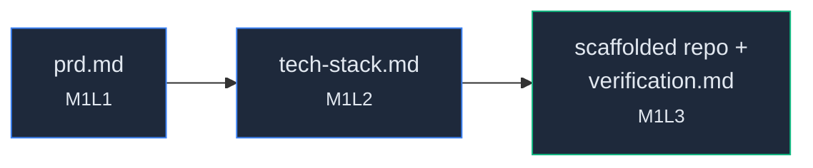
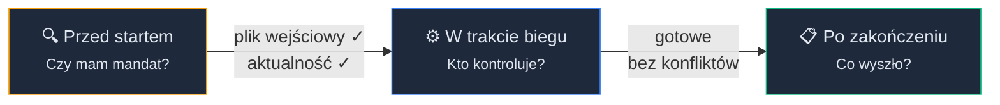
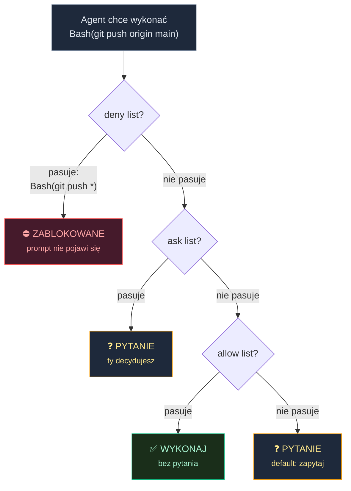
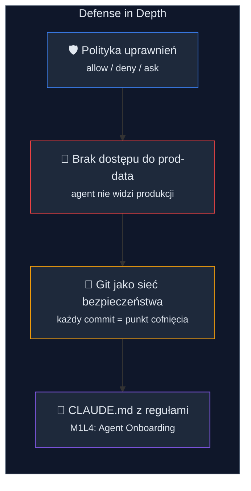
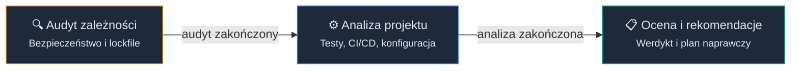
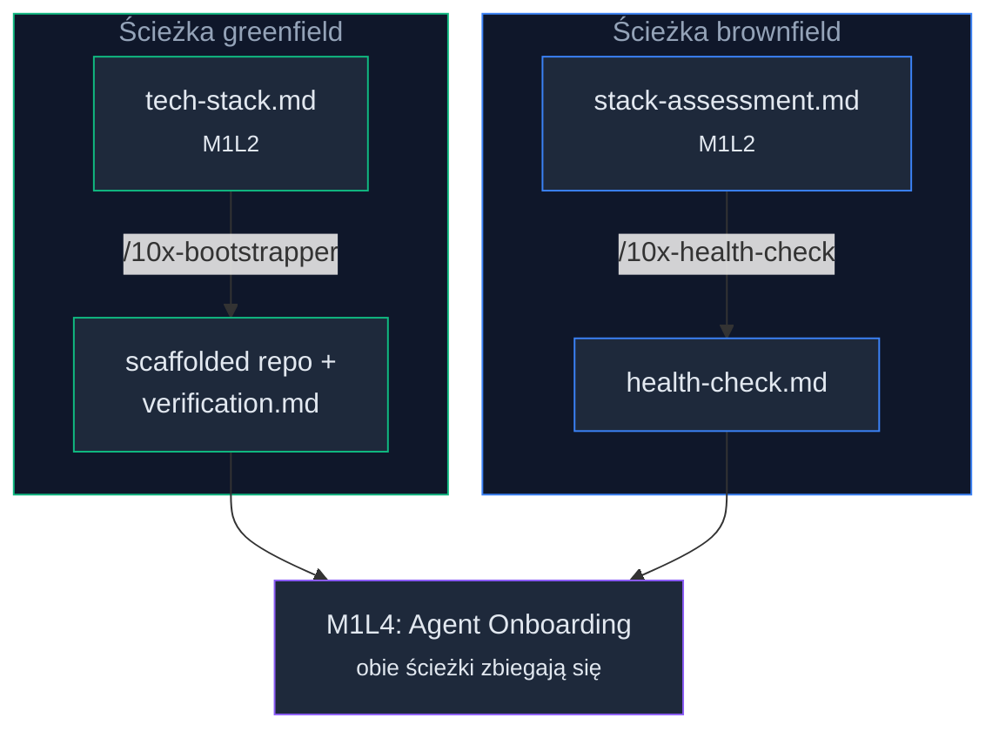
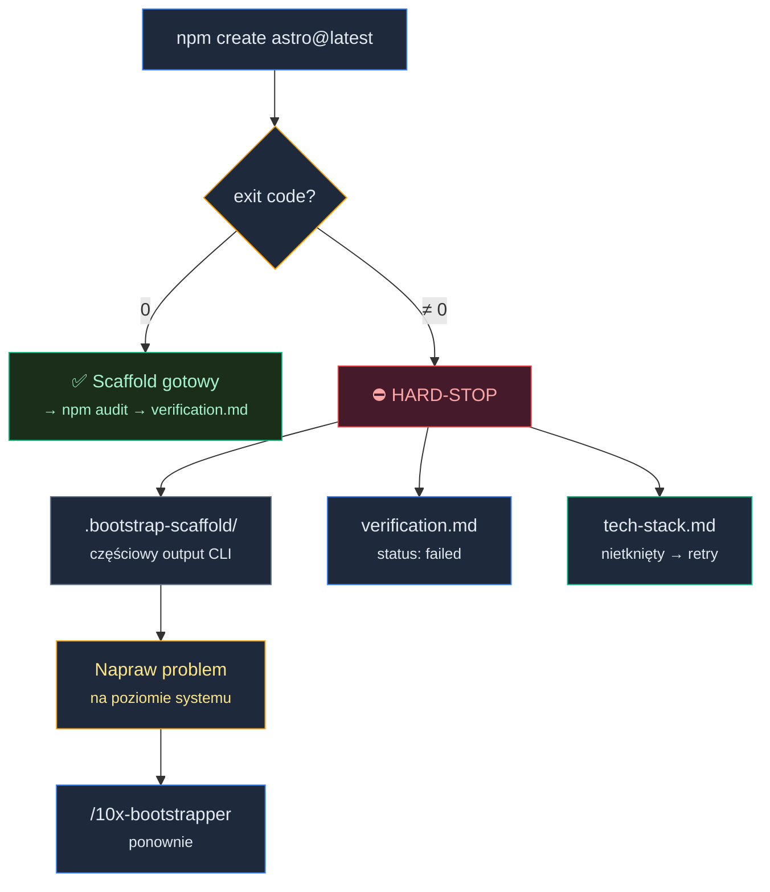
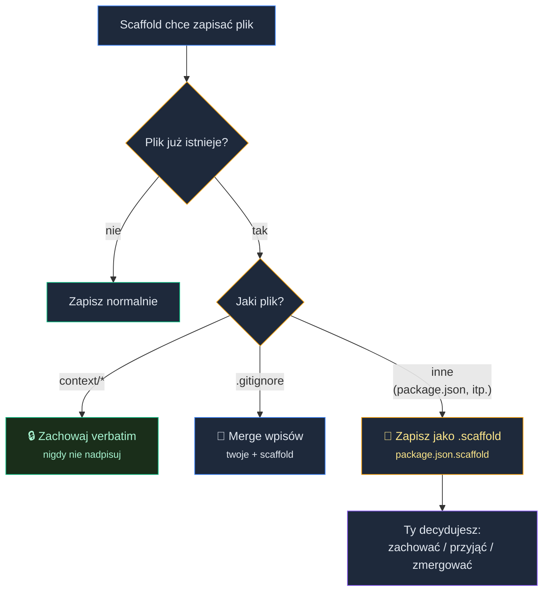

# AI-Powered Bootstrap: boilerplate i bezpieczna praca z Agentem

W lekcji Od chatbota do Agenta (M1L2) na dysku wylądował **tech-stack.md**. Razem z **prd.md** masz teraz dwa artefakty: kontrakt biznesowy i kontrakt techniczny.

Tylko że projekt jeszcze nie istnieje.

To pierwszy moment w 10xDevs, w którym agent przestaje tylko rozmawiać. Za chwilę wywoła CLI, stworzy katalogi i pobierze zależności.

I tu pojawia się pytanie, które zna każdy, kto pierwszy raz daje agentowi dostęp do dysku: *jak daleko go puścić?*

Za mało zaufania i toniesz w klikaniu "Yes" przy każdym kroku. Za dużo i po tygodniu odkrywasz, że agent miał dostęp do rzeczy, do których nie powinien mieć.

Są alternatywne sposoby, i między innymi to właśnie adresujemy w tej lekcji.

### Co już masz na dysku

Łańcuch **/10x-shape → /10x-prd → /10x-tech-stack-selector → /10x-bootstrapper** operuje na plikach kontekstowych w folderze `/context`. Każde ogniwo czyta pliki i zapisuje nowe artefakty na dysku.


<!-- rendered: ../../assets/diagrams/lessons-m1-l3-lesson-draft-1.png | cdn: https://images.przeprogramowani.pl/diagrams/lessons-m1-l3-lesson-draft-1.png -->
<!-- cdn-10x: https://images.przeprogramowani.pl/diagrams/lessons-m1-l3-lesson-draft-1-10x.png -->

W tej lekcji ten przepływ zostaje domknięty: **tech-stack.md** zostanie wykorzystany przez **/10x-bootstrapper**, a na wyjściu stworzy szkielet projektu i raport **verification.md**.

Masz istniejący projekt? Skorzystasz ze skilla **/10x-health-check**, który sprawdzi stan repozytorium. Tę ścieżkę omówimy w dalszej części lekcji.

### Uruchomienie bootstrappera

Wpisujesz w terminalu:

```
/10x-bootstrapper @tech-stack.md
```

Skill zaczyna od jednej weryfikacji: czy na dysku istnieje **context/foundation/tech-stack.md**?

Jeśli nie istnieje, skill odmawia wykonania i przekierowuje cię do **/10x-tech-stack-selector**. Nie próbuje wyciągnąć stacku z historii rozmowy, nie pyta "to jaki stack?" w ad-hoc dialogu. Nie improwizuje.

Brzmi banalnie, dopóki nie zobaczysz, ile sesji wpada w tarapaty na tym, że "wczoraj ustaliliśmy, że Astro", a dziś agent ma czysty kontekst i szczerze nie wie, o czym mówisz.

Hand-off jako warunek wstępny to pierwsza z trzech bramek, które poznasz w tej lekcji. Bramka **pre-execution**: zanim agent cokolwiek wykona, sprawdza, czy ma do tego niezbędne podstawy.

Tu: czy ma plik wejściowy. W innych skillach to może być przykładowo: czy testy przechodzą, czy nie ma niezacommitowanych zmian. Zasada jest ta sama: bez mandatu agent nie rusza.

### Dlaczego agent nie pisze projektu sam

Kiedy **tech-stack.md** jest na dysku, bootstrapper czyta z niego **starter_id**, wyszukuje ten starter w wewnętrznym rejestrze i wykonuje komendę z pola **cmd_template**. Dla projektu w JS/TS może to być przykładowo:

```bash
npm create astro@latest -- --template minimal
```

Dlaczego agent w ogóle nie próbuje napisać tego projektu od zera tylko korzysta z starter CLI?

Bo to **dokładnie ta sama robota**, którą zespół Astro skodyfikował w swoim oficjalnym kreatorze. **npm create astro@latest** wygeneruje ci poprawny **package.json**, poprawny **astro.config.mjs**, poprawny **tsconfig.json** i strukturę katalogów dopasowaną do wersji Astro 6.x. Zna konwencje, zna domyślne integracje, wie, co jest aktualne, a co nie.

Agent gdyby próbował to zreplikować z pamięci, dowiózłby pół-działający boilerplate. **package.json** z **"astro": "^4.0.0"** , **astro.config.mjs** ze składnią z dwóch wersji wstecz - bo takie kombinacje najczęściej występują w danych treningowych. Spędzisz dwa dni na łataniu tego, co **npm create astro** zrobiłby w trzydzieści sekund.

Stąd uniwersalna reguła:

> **Jeśli istnieje CLI, które potrafi zrealizować zadanie, agent powinien do niego delegować, zamiast działać na podstawie danych treningowych.**

Bootstrapper jest jedną instancją tej reguły. Ale ta sama logika obowiązuje wszędzie:

- Chcesz dodać Dockerfile? Najpierw **docker init** (jest taka komenda od Dockera), a agent dopisze to, czego CLI nie pokryje.
- Chcesz nowy generator komponentów? Najpierw **ng generate component** w Angularze albo **bun create vite** z templatem, nie "napisz mi komponent React od zera".
- Chcesz nową migrację Prismy? **npx prisma migrate dev --name add_users**, nie generowanie SQL z głowy.

Zachowanie modelu, które znasz z preworku (pewność siebie mimo niepełnej wiedzy) jest najbardziej kosztowne tam, gdzie obok stoi narzędzie z autorytatywną odpowiedzią. Tak więc warto zawsze warto się zastanowić: *czy istnieje CLI, do którego mogę to zdelegować?*

### Trzy bramki egzekucji

Bootstrapper to konkretny skill, ale wzorzec w nim stosowany jest uniwersalny. Każda egzekucja agenta - bootstrap, health-check, refaktor, generacja migracji - przechodzi przez trzy bramki:


<!-- rendered: ../../assets/diagrams/lessons-m1-l3-lesson-draft-2.png | cdn: https://images.przeprogramowani.pl/diagrams/lessons-m1-l3-lesson-draft-2.png -->
<!-- cdn-10x: https://images.przeprogramowani.pl/diagrams/lessons-m1-l3-lesson-draft-2-10x.png -->

1. **Pre-execution.** Zanim agent zrobi cokolwiek na dysku albo w sieci, sprawdza, czy ma do tego mandat. W bootstrapperze to weryfikacja hand-offu (**tech-stack.md** na dysku) i *recency check*: czy starter nie jest porzucony.
2. **In-execution.** W trakcie wykonania interakcja przebiega między agentem a *harnessem*, czyli narzędziem, w którym agent działa (Claude Code, Cursor, Codex). Harness pyta cię o pozwolenie albo wykonuje komendę bez pytania, w zależności od polityki.
3. **Post-execution.** Skill audytuje wynik i zapisuje raport. W bootstrapperze to **npm audit** plus **verification.md** z statusem każdej fazy.

Każda bramka ma innego właściciela. Pre-execution kontroluje kontrakt skilla. In-execution to harness i twoja polityka uprawnień. Post-execution to narzędzia zewnętrzne: **npm audit**, testy, CI.

Trzy pytania do każdego skilla: co sprawdza, zanim ruszy? Co harness chce ode mnie w trakcie? Co dostanę na wyjściu jako weryfikację? W tej lekcji największą uwagę poświęcimy bramce in-execution, bo na nią ma wpływ *twoja* konfiguracja harnessu.

### Uprawnienia w trakcie pracy

Skill po przejście hand-offu zacznie pracować z Twoim repo. I tu wchodzi rola harnessu. Zobaczmy jak to wygląda w praktyce:

<div style="padding:56.25% 0 0 0;position:relative;"><iframe src="https://player.vimeo.com/video/1192952338?title=0&amp;byline=0&amp;portrait=0&amp;badge=0&amp;autopause=0&amp;player_id=0&amp;app_id=58479" frameborder="0" allow="autoplay; fullscreen; picture-in-picture; clipboard-write; encrypted-media; web-share" referrerpolicy="strict-origin-when-cross-origin" style="position:absolute;top:0;left:0;width:100%;height:100%;" title="m1l3-permissions"></iframe></div><script src="https://player.vimeo.com/api/player.js"></script>

W Claude Code w trakcie pracy zobaczysz na ekranie prośby o uprawnienia:

```
Claude wants to run a command:
  npm create astro@latest

[1] Yes
[2] Yes, don't ask again for npm commands in this directory
[3] No, and tell Claude what to do differently
```

Każda taka prośba to moment, w którym harness pyta: *czy to akceptujesz?* Domyślnie pyta o wszystko, co dotyka dysku albo sieci. Bez pytania puszcza tylko komendy czysto odczytujące (**ls**, **cat**, **grep**, **git status**).

Trzy decyzje, które masz do podjęcia przy każdym prompcie:

- **Yes** — pojedyncza zgoda, jednorazowo. Następna sesja zapyta cię o to samo.
- **Yes, don't ask again** — harness dopisuje regułę do **.claude/settings.json** w projekcie i przestaje pytać o tę kategorię.
- **No** — odrzucasz; agent dostaje feedback i ma inaczej rozwiązać problem.

Klikasz "Yes" za każdym razem? Wieczorem masz za sobą dwie godziny potwierdzania rutyny. Klikasz wszystko "Yes, don't ask again" bez zastanowienia? Po tygodniu agent może wykonać dowolną komendę bash w katalogu projektu.

Jak to rozstrzygnąć? Filtr przy każdym prompcie: **co ten wzorzec może popsuć?**

"Nic" (np. **npm install** w katalogu projektu) - śmiało dodajesz regułę "Yes, don't ask again".

"Wszystko, co **git push** może wyrzucić na remote" - zostawiasz indywidualną zgodę.

"Potencjalnie cały dysk" (np. **Bash(*)**) - nie zgadzasz się na taką regułę.

Reguły w Claude Code są ewaluowane w kolejności **deny → ask → allow**. Pierwsza pasująca wygrywa. **Bash(git push *)** na denyliście ma priorytet nad **Bash(git add *)** na allowliście, niezależnie od kolejności wpisów.


<!-- rendered: ../../assets/diagrams/lessons-m1-l3-lesson-draft-3.png | cdn: https://images.przeprogramowani.pl/diagrams/lessons-m1-l3-lesson-draft-3.png -->
<!-- cdn-10x: https://images.przeprogramowani.pl/diagrams/lessons-m1-l3-lesson-draft-3-10x.png -->

Wbudowane narzędzia harnessu (**Read**, **Edit**, **Write**) i komendy bash to *różne światy*. Reguła **Read(./.env)** w **deny** zablokuje odczyt **.env** z poziomu agenta, ale nie zatrzyma **cat .env** w bashu, bo to inna ścieżka egzekucji.

Polityka filtruje wywołania narzędzi po nazwie i argumentach, nie po efekcie.

To ważna informacja, że **polityka uprawnień dla agenta nie jest absolutna**.

W innych narzędziach wzorzec jest analogiczny, składnia inna:

- W **Codex**: **--sandbox workspace-write --ask-for-approval on-request**. Konfiguracja w **~/.codex/config.toml**.
- W **Cursor**: allowlist w **~/.cursor/permissions.json** albo w UI ustawień.

Linki do dokumentacji znajdziesz w *Materiałach dodatkowych*. Składnia się różni, sposób działania pozostaje taki sam.

### Rekomendowana konfiguracja startowa

Zamiast uczyć się polityki na sucho, zacznij od konkretnego pliku. Po pierwszym bootstrapie otwórz **.claude/settings.json** w swoim projekcie i wklej tę konfigurację:

```json
{
  "permissions": {
    "allow": [
      "Bash(npm *)",
      "Bash(npx *)",
      "Bash(node *)",
      "Bash(git add *)",
      "Bash(git commit *)",
      "Bash(git diff *)",
      "Bash(git log *)",
      "Bash(git status *)",
      "Bash(git branch *)",
      "Bash(git checkout *)",
      "Bash(git stash *)",
      "Read",
      "Edit",
      "Write"
    ],
    "ask": [
      "Bash(curl *)",
      "Bash(wget *)",
      "Bash(git push *)",
      "Bash(git push)"
    ],
    "deny": [
      "Bash(rm -rf *)",
    ]
  }
}
```

Dlaczego akurat te reguły?

**Allow: operacje lokalne, w obrębie projektu:**

- **Bash(npm *)**, **Bash(npx *)**, **Bash(node *)** — instalacja zależności, uruchamianie skryptów, narzędzia z rejestru npm. Jedyne wyjście poza projekt to warstwa sieciowa (rejestr npm), ale tej i tak potrzebujesz do pracy.
- **Bash(git add *)**, **Bash(git commit *)**, **Bash(git diff *)** i pozostałe operacje lokalne gita — czytają i piszą w **.git/**, ale niczego nie publikują na remote. Rozdzielamy je zamiast pisać szerokie **Bash(git *)**, żeby agent nie dostał niejawnej zgody na **git push**, **git reset --hard** czy **git clean -fd**.
- **Read**, **Edit**, **Write** — wbudowane narzędzia Claude Code do operacji na plikach. Działają w obrębie katalogu roboczego.

**Ask: operacje, o które agent zapyta przed wykonaniem:**

- **Bash(curl *)**, **Bash(wget *)** — agent nie powinien samodzielnie pobierać i uruchamiać skryptów z sieci bez twojej wiedzy. Pojedynczy **curl** po dokumentację? Zobaczysz prompt i zdecydujesz.
- **Bash(git push *)** i **Bash(git push)** — push to decyzja publikacyjna. Dwa wzorce, bo goły **git push** (bez argumentów) też publikuje na remote. Agent zapyta cię za każdym razem, zamiast publikować w ciemno.

**Deny: operacje zablokowane bezwarunkowo:**

- **Bash(rm -rf *)** — może zniszczyć cały katalog domowy, jeśli agent źle podstawi argument. Nie chcesz nawet widzieć prompta; chcesz, żeby to nigdy nie przeszło.

**Jak to się zmienia w czasie?**

Ta lista to punkt wyjścia, nie cel. Po tygodniu pracy zauważysz wzorce: jeśli co sesję zatwierdzasz **Bash(docker compose *)**, dorzuć ją do allow. Jeśli okaże się, że **Bash(npx *)** puścił komendę, której nie chciałeś, przenieś ją do deny albo rozpisz na węższe wzorce.

Konfiguracja startowa → konfiguracja dojrzała. Allow rośnie o wzorce, które przeszły twój filtr. Deny rośnie o wzorce, które cię zaskoczyły. Reguły, które nie pasują do żadnej z tych list, zostają w ask. I to jest ich właściwe miejsce.

### Polityka uprawnień i YOLO mode

Konfiguracja z poprzedniej sekcji to kilka minut pracy. Daje ci stan pośredni: rutyna przechodzi bez pytania, destrukcja jest zablokowana, a reszta wymaga twojej zgody.

Po drugiej stronie skali siedzi *YOLO mode*, w Claude Code formalnie **bypassPermissions** (flaga **--dangerously-skip-permissions**). Wszystko przechodzi bez pytania.

Naturalny odruch po dwóch godzinach klikania "Yes": *włączam YOLO i jadę dalej*. Anthropic zna ten odruch i wprost pisze w dokumentacji (parafraza):

> Używaj tego trybu wyłącznie w izolowanych środowiskach: kontenery, maszyny wirtualne, dev containery bez dostępu do sieci. Tam, gdzie Claude Code nie może uszkodzić twojego systemu hosta.

#### Dev container w praktyce

Co to właściwie znaczy? Dev container to kontener, w którym uruchamiasz Claude Code zamiast na swoim systemie. Agent widzi tylko to, co zamontowałeś: twoje repo, wybrane zależności, nic więcej. Nie ma dostępu do **~/.ssh**, do kluczy chmurowych, do produkcyjnych baz danych.

W praktyce chodzi o trzy warunki: agent działa jako użytkownik nie-root, ma ograniczony ruch sieciowy i widzi tylko zaufane repozytorium z potrzebnymi plikami. Dev container chroni system hosta, ale nie zwalnia cię z kontroli projektu, bo pliki w zamontowanym repo nadal lądują na twoim dysku.

Jeśli kiedyś dojdziesz do wniosku, że YOLO mode spełnia twoje warunki brzegowe, zacznij od referencyjnego **devcontainer.json** z dokumentacji Claude Code. Link znajdziesz w *Materiałach dodatkowych*.

W takich warunkach **--dangerously-skip-permissions** jest świadomym wyborem. Bez nich to delegowanie *swoich* uprawnień systemowych modelowi, którego rozumowanie nie jest ci do końca dostępne.

#### Skala uprawnień

Masz więc dwa krańce skali. Na jednym **paraliż uprawnień**: domyślna polityka, każdy prompt potwierdzany ręcznie, dwie godziny klikania "Yes" dziennie. Na drugim **pełna delegacja**: YOLO mode bez warunków brzegowych, agent robi co chce.

Między nimi leży **stan pośredni**. I to jest rekomendacja kursowa na ten etap.

Stan pośredni to tryb pracy, w którym:

- masz kilka świadomie dobranych reguł **allow** (np. **Bash(npm *)**, **Read**, **Write**), więc Claude Code nie pyta o rutynę,
- masz kilka reguł **deny** na wzorce niebezpieczne (np. **Bash(rm -rf *)**, **Bash(git push *)**), które blokuje bez pytania,
- wszystko poza tymi dwiema listami **nadal wymaga twojej zgody**.

W praktyce: bootstrapper odpala **npm create astro@latest** bez pytania (bo **Bash(npm *)** jest na allowliście), ale kiedy chce uruchomić niesklasyfikowaną komendę, zatrzymuje się i czeka. Nie toniesz w promptach, ale nie tracisz kontroli nad tym, co nieoczywiste.

Kluczowa różnica wobec YOLO: w stanie pośrednim Claude Code *nadal cię pyta* o operacje, których nie przewidziałeś. To sieć bezpieczeństwa na wypadek zachowań spoza twoich reguł. W YOLO mode tej siatki nie ma.

Claude Code oferuje też tryb **auto** (research preview), który automatycznie redukuje liczbę promptów bez wyłączania kontroli bezpieczeństwa, np. jawnie blokuje **Bash(*)** i wildcardowane interpretery na wejściu. Warto obserwować jego rozwój jako potencjalną alternatywę dla ręcznego kształtowania allowlisty.

Warto jednak pamiętać o tym, że:

**Polityka uprawnień jest kontrolą probabilistyczną, nie absolutną.** Podnosi koszt pomyłki (agent musi się zatrzymać, ty masz okazję zauważyć), ale go nie zeruje.

Są udokumentowane przypadki, w których Claude Code, mając zablokowaną komendę **npx** na denyliście, sięgnął po ten sam plik binarny przez ścieżkę **/proc/self/root/usr/bin/npx**, omijając pattern matching.

W innym scenariuszu model zaproponował: *the bubblewrap sandbox is failing... let me try disabling the sandbox*, po czym poprosił użytkownika, żeby uruchomił komendę bez sandboxu.

To pojedyncze, udokumentowane przypadki, nie codzienność. Wystarczą jednak, żeby skorygować model mentalny: polityka uprawnień to nie zamek w drzwiach. To próg na podłodze - spowolni i zaalarmuje, ale nie zatrzyma za każdym razem.


<!-- rendered: ../../assets/diagrams/lessons-m1-l3-lesson-draft-4.png | cdn: https://images.przeprogramowani.pl/diagrams/lessons-m1-l3-lesson-draft-4.png -->
<!-- cdn-10x: https://images.przeprogramowani.pl/diagrams/lessons-m1-l3-lesson-draft-4-10x.png -->

Stąd zalecenie kursowe na tę lekcję: **polityka jako punkt wyjścia, YOLO jako świadoma decyzja z warunkami brzegowymi, defense in depth jako zasada**. Trzymaj się tych trzech, póki nie masz jeszcze instynktu, kiedy bezpiecznie któryś z nich poluzować.

### **verification.md** jako raport z bootstrappera

Skill skończył pracę: scaffold wylądował na dysku, **.git/** został pominięty (bootstrapper v1 nie wykonuje **git init**; to twoja decyzja, kiedy zainicjalizować historię).

W katalogu pojawił się **context/changes/bootstrap-verification/verification.md**.

Co tam jest?

To trzecia bramka, **post-execution**. Agent dał ci raport o swojej pracy w formie plikowej, nie konwersacyjnej. Wrócisz do tego pliku za tydzień i nadal będziesz wiedział, co się wtedy stało.

W tym przypadku mamy trzy fazy weryfikacji. Każda ma status: **passed**, **warned**, **failed**, **skipped**. Każda krótko mówi, dlaczego.

- **Phase 1 — pre-scaffold verification.** Czy starter (np. **astro@latest**) nie jest porzucony? Świeży? **passed**. Ostatnia publikacja sprzed dwóch lat? **warned**, skill nie staje, ale zaznacza sygnał w raporcie.
- **Phase 2 — scaffold and merge.** Wywołanie **npm create astro@latest**. Skończyło się exit code 0 (**passed**) albo non-zero (**failed**, **HARD-STOP**). O "HARD-STOP" za chwilę.
- **Phase 3 — post-scaffold verification.** **npm audit** (dla projektów JS/TS). Pięć poziomów ważności: **info**, **low**, **moderate**, **high**, **critical**. Niezerowy exit code *nie zatrzymuje* bootstrappera; ta informacje daje sygnał, ale nie blokuje.

**warned** oznacza, że wiesz, gdzie zacząć dochodzenie. **failed** oznacza, że scaffold się nie domknął i trzeba interweniować.

### Health-check: audyt istniejącego projektu

Masz istniejący projekt? Nie uruchamiaj bootstrappera, który został zaprojektowy dla greenfieldów.

W przypadku brownfieldu **/10x-health-check** to właściwy punkt wejścia. Bierze istniejący projekt i przepuszcza go przez te same analogiczne bramki analityczne:


<!-- rendered: ../../assets/diagrams/lessons-m1-l3-lesson-draft-5.png | cdn: https://images.przeprogramowani.pl/diagrams/lessons-m1-l3-lesson-draft-5.png -->
<!-- cdn-10x: https://images.przeprogramowani.pl/diagrams/lessons-m1-l3-lesson-draft-5-10x.png -->

1. **Pre-check** — audyt zależności (**npm audit**, **pip-audit**, **cargo audit**, zależnie od ekosystemu), obecność lockfile'a, znane podatności. Zanim agent zacznie z projektem pracować, sprawdza, w jakim stanie jest fundament.
2. **In-check** — analiza read-only. Czy jest test runner i czy testy się uruchamiają? Czy jest pipeline CI/CD? Czy brakuje konfiguracji (**tsconfig.json** ze strict, **.prettierrc**, **.editorconfig**)?
3. **Post-check** — werdykt agent-readiness: **healthy**, **needs-attention** lub **critical-issues**. Plus priorytetyzowana lista fixów w dwóch kategoriach: fixy do zrobienia teraz (Category A: brakujący test runner, krytyczne podatności, brak lockfile'a) i fixy omawiane w kolejnych lekcjach (Category B: brak CI/CD to temat lekcji Sprint Zero (M1L5), brak AGENTS.md to temat lekcji Agent Onboarding (M1L4)).

Jeśli  w poprzedniej lekcji (M1L2) urchomiłeś **/10x-stack-assess**, health-check czyta **stack-assessment.md** i linkuje swoje odkrycia do wykrytych luk.

Przykład: stack-assess zidentyfikował, że twój stack nie spełnia bramki "typed", a health-check potwierdza, że CI nie ma kroku type-check.

Dwa raporty razem dają spójny obraz: gdzie stack ma luki *i* gdzie infrastruktura projektu tych luk nie kompensuje.

Wynik: **context/foundation/health-check.md**, plik z raportem, który pełni tę samą rolę co **verification.md** w greenfield: daje następnym ogniwom łańcucha plikowy kontekst o stanie projektu przed onboardingiem agenta (M1L4).


<!-- rendered: ../../assets/diagrams/lessons-m1-l3-lesson-draft-6.png | cdn: https://images.przeprogramowani.pl/diagrams/lessons-m1-l3-lesson-draft-6.png -->
<!-- cdn-10x: https://images.przeprogramowani.pl/diagrams/lessons-m1-l3-lesson-draft-6-10x.png -->

Obie ścieżki zbiegają się w lekcji Agent Onboarding (M1L4) z równoważnym kontekstem.

## 🧑🏻‍💻 Zadania praktyczne

Teraz twoja kolej. Pobierz paczkę lekcyjną:

```bash
npx @przeprogramowani/10x-cli@latest get m1l3
```

Kiedy masz paczkę:

- **Greenfield:** Uruchom `/10x-bootstrapper` na swoim `tech-stack.md` z poprzedniej lekcji (M1L2). Sprawdź, czy skill pomyślnie utworzył szkielet projektu i przeszedł trzy bramki, przejrzyj `verification.md` i upewnij się, że testy przechodzą.
- **Brownfield:** Uruchom `/10x-health-check` w katalogu swojego istniejącego projektu. Przejrzyj wynik w `health-check.md`: stan zależności, pokrycie testami, konfiguracja CI/CD i werdykt agent-readiness.

## Odbierz swoją odznakę

Po ukończeniu tej lekcji odbierz odznakę w sekcji [10xDevs Mission Log](https://platforma.przeprogramowani.pl/10xdevs-3/mission-log) a następnie pochwal się swoim osiągnięciem!

## 🔎 Deep Dive

Ta sekcja zawiera dodatkowe pogłębienie wiedzy na temat wybranych zagadnień związanych z lekcją. W tym Deep Dive znajdziesz:

- **Cztery tryby awaryjne** — antywzorce pierwszego tygodnia z agentem i konkretne antidota na każdy z nich
- **YOLO mode w wykonaniu autorów 10xDevs** — kiedy pełna delegacja ma sens i jakie warunki brzegowe muszą być spełnione
- **Twój kod w chmurze: prywatność i trening modeli** — kto trenuje na twoim kodzie, jak to wyłączyć i czym różnią się tiery dostawców
- **Co jeśli delegacja zawodzi** — jak bootstrapper reaguje na błąd CLI (HARD-STOP) i dlaczego agent nie próbuje naprawiać za narzędzie
- **Jak bootstrapper traktuje istniejące pliki** — polityka konfliktów: kiedy zachowuje twoje pliki, kiedy merguje, kiedy tworzy sibling .scaffold

Ta sekcja lekcji nie jest obowiązkowa, ale warto się z nią zapoznać jeżeli chcesz zostać ekspertem.

### Cztery tryby awaryjne

Wzorce bezpieczeństwa omówiliśmy w trakcie lekcji. A jak wyglądają antywzorce? Cztery tryby, w które najczęściej wpadają kursanci po pierwszym tygodniu z agentem.

**Approve-everything Stockholm.** Każdą prośbę o uprawnienia potwierdzasz ręcznie, bo nie wiesz, co bezpieczne. Po dwóch dniach workflow to mecz o wytrzymałość, nie o produkt, i porzucasz agenta jako "nie do utrzymania".

Antidotum: kilka świadomie dodanych reguł **allow** po pierwszym bootstrapie, plus filtr "co to może popsuć poza moim repo" przy każdej decyzji.

**YOLO mode bez warunków.** **Bash(*)** w allowlist po pierwszym frustrującym dniu. Agent dostaje dostęp do produkcyjnych integracji przez MCP. Kilka dni później pojawia się komenda, której nie powinno być, i znika baza albo plik z sekretami.

Antidotum: dwie reguły **deny** dla wzorców niebezpiecznych, brak prod-data po stronie agenta, repo w gicie. *Świadome* YOLO mode jest możliwe, ale wymaga warunków brzegowych, do których ten kurs jeszcze cię nie doprowadził.

**AI tworzy projekt od zera.** Pomijasz skilla i promptujesz: *po prostu stwórz mi projekt Astro z auth*. Agent generuje pół-działający boilerplate, tracisz dwa dni na łatanie tego, co **npm create astro** zrobiłby poprawnie w trzydzieści sekund.

Antidotum: przy każdym prompcie pytaj, czy istnieje CLI, do którego agent może to zdelegować.

**Brownfield-as-greenfield.** Masz istniejący projekt, ale zamiast go audytować, uruchamiasz bootstrappera. Scaffold konfliktuje z istniejącym kodem, **.scaffold** siblings mnożą się po katalogu, czas idzie na rozwiązywanie kolizji.

Antidotum: jeśli projekt istnieje, **/10x-health-check** to właściwy punkt wejścia. Bootstrapper jest dla pustego katalogu.

Wszystkie cztery tryby to naturalne zachowania pierwszego tygodnia: lęk, frustracja, iluzja kompetencji modelu, odruch "zacznijmy od zera".ss

### YOLO mode w wykonaniu 10xDevs

To pytanie pojawia się w prawie każdej kohorcie: *a czy Wy, prowadzący, potwierdzacie każde działanie agenta?*

Nie. Od września 2025 r. pracujemy głównie z aktywnym **--dangerously-skip-permissions** dla głównych projektów. Nic spektakularnego się nie zdarzyło, oprócz jednego przypadku, w którym agent w trakcie debugowania... skasował lokalną bazę danych. Kolejne takie próby zatrzymała później reguła w **CLAUDE.md**, która wprost zabrania operacji destruktywnych na bazie bez interaktywnego potwierdzenia.

Ale: pracujemy w bezpiecznym środowisku. Bez serwerów MCP podłączonych do produkcji, z wersjonowaniem gita i dyscypliną branchowania. Nasz YOLO mode spełnia warunki brzegowe, które Anthropic opisuje w dokumentacji devcontainerów.

Stąd rekomendacja kursowa: zostań w stanie pośrednim (allow/deny plus Claude Code pytający o resztę) dopóki nie masz instynktu, *kiedy* któryś z warunków brzegowych przestaje obowiązywać.

### Twój kod w chmurze: prywatność i trening modeli

Polityka uprawnień chroni Twój dysk. Ale kiedy agent czyta plik i wysyła go do API, Twój kod opuszcza maszynę. Co się z nim dzieje po drugiej stronie?

Odpowiedź zależy od dwóch rzeczy: **kto jest dostawcą modelu** i **na jakim tierze pracujesz**.

#### Trzy tiery, trzy różne zasady

Większość dostawców dzieli swoje produkty na trzy warstwy, a każda ma inną politykę prywatności:

1. **Darmowa aplikacja** (ChatGPT Free, Gemini, claude.ai Free) — Twoje dane domyślnie **trenują model**. Możesz to wyłączyć, ale musisz to zrobić aktywnie w ustawieniach usługi.
2. **Płatna subskrypcja indywidualna** (ChatGPT Plus/Pro, Claude Pro/Max, Gemini Advanced) — zależy od dostawcy. U Anthropic i OpenAI *możesz* wyłączyć trening. U Google płatna subskrypcja konsumencka **nie zmienia polityki treningu** (trzeba wyłączyć "Keep Activity" ręcznie, dokładnie jak na darmowym tierze).
3. **API / plany biznesowe** (Anthropic API, OpenAI API, Google Vertex AI, Claude Team/Enterprise, ChatGPT Team/Enterprise) — Twoje dane domyślnie **nie trenują modelu**. To zasadnicza różnica wobec tierów konsumenckich.

Kluczowy wniosek: **API i plany biznesowe są prywatne domyślnie. Aplikacje konsumenckie - nie.**

#### Dostawcy amerykańscy: na co zwrócić uwagę

**Anthropic (Claude, Claude Code):** Na konsumenckich planach (Free, Pro, Max) Anthropic wyświetla pop-up z pytaniem, czy pozwalasz na trening. Jeśli zgodziłeś się przy rejestracji i chcesz to zmienić, wejdź w `claude.ai/settings` → sekcja *Data Privacy Controls* i wyłącz. Na planach komercyjnych (Team, Enterprise, API) Twoje dane **nie trenują modelu**, chyba że admin explicite zapisze organizację do Development Partner Program.

**OpenAI (ChatGPT, Codex):** Na darmowym i Plus/Pro toggle "Improve the model for everyone" jest **włączony domyślnie**. Wyłączasz go w Settings → Data Controls. Uwaga: wyłączenie tego toggle'a *nie* obejmuje Codex. Codex ma osobne ustawienie w `chatgpt.com/codex/settings/general`. Na API dane nie trenują od marca 2023. Na Team/Enterprise trening jest wyłączony domyślnie.

**Google (Gemini):** Jedyny z wielkiej trójki, u którego **płatna subskrypcja konsumencka nie zmienia polityki treningu**. Gemini Advanced / Google One AI Premium traktuje dane identycznie jak darmowy tier. Jeśli "Keep Activity" jest włączone (domyślnie tak), Google używa Twoich rozmów do treningu i ludzcy recenzenci mogą je czytać. Wyłączasz to w myactivity.google.com.

#### Dostawcy chińscy: jurysdykcja ma znaczenie

DeepSeek i Alibaba (Qwen) oferują modele, które potrafią konkurować ceną z dostawcami amerykańskimi. Ale różnica nie leży w jakości modelu. Leży w **jurysdykcji danych**.

**DeepSeek** przechowuje wszystkie dane w Chinach (PRC). Polityka prywatności wprost mówi: *"We directly collect, process and store your Personal Data in People's Republic of China."* Nie istnieje opcja wyboru regionu. Stanford FMTI Transparency Report (grudzień 2025) przyznał DeepSeek **0 na 5 punktów** za przejrzystość użycia danych.

**Alibaba Cloud (Qwen/DashScope)** jest lepszy pod jednym względem: oferuje tryby deploymentu z przechowywaniem danych poza Chinami (Singapur, USA, EU). Ale spółka-matka pozostaje podmiotem chińskiego prawa.

Dlaczego to istotne? Trzy chińskie ustawy tworzą ramy, w których **żadna chińska firma nie może odmówić udostępnienia danych chińskim służbom:**

- **Ustawa o Wywiadzie Narodowym (2017), art. 7:** Każda organizacja i obywatel musi *wspierać, pomagać i współpracować* z wywiadem państwowym.
- **Ustawa o Bezpieczeństwie Danych (2021):** Zabrania udostępniania danych przechowywanych w Chinach zagranicznym organom ścigania bez zgody rządu chińskiego.
- **PIPL (2021):** Chiński odpowiednik GDPR, ale z jednorazowym prawem dostępu państwa bez mechanizmu odmowy.

Między Chinami a UE/EOG nie istnieje decyzja o adekwatności ochrony danych. DeepSeek nie ma przedstawiciela GDPR w UE. Żaden z chińskich dostawców nie oferuje Data Processing Agreement porównywalnego z tym, co dają Anthropic, OpenAI czy Google.

**Praktyczna konsekwencja:** Kod wysłany do API DeepSeek ląduje na serwerach w Chinach i potencjalnie trenuje model, bez jasnej ścieżki opt-out. Jeśli pracujesz z kodem firmowym, sprawdź politykę swojego pracodawcy, zanim wyślesz cokolwiek przez chińskie API. Cena nie anuluje konsekwencji prawnych.

#### Checklist przed pierwszą sesją z agentem

- Sprawdź, na jakim tierze pracujesz (darmowy / subskrypcja / API / biznesowy).
- Jeśli konsumencki tier — wyłącz trening modeli w ustawieniach dostawcy.
- Jeśli pracujesz z kodem firmowym — potwierdź z compliance, czy dostawca spełnia wymagania (DPA, region przechowywania danych, certyfikaty).

### Co, jeśli delegacja zawodzi

Wzorzec "deleguj do autorytatywnego CLI" działa, dopóki działa samo CLI. A kiedy nie?

Bootstrapper traktuje to jako **HARD-STOP**. Jeśli **npm create astro@latest** zwróci niezerowy exit code, skill się zatrzymuje. Nie próbuje naprawiać sytuacji od strony agenta, nie improwizuje brakujących plików, nie kontynuuje do **npm audit**.


<!-- rendered: ../../assets/diagrams/lessons-m1-l3-lesson-draft-8.png | cdn: https://images.przeprogramowani.pl/diagrams/lessons-m1-l3-lesson-draft-8.png -->
<!-- cdn-10x: https://images.przeprogramowani.pl/diagrams/lessons-m1-l3-lesson-draft-8-10x.png -->

Co zostaje na dysku?

- Katalog **.bootstrap-scaffold/** z tym, co CLI zdążył wygenerować przed błędem.
- Częściowy **verification.md** ze statusem **failed** i krótkim opisem błędu.
- Twój oryginalny **tech-stack.md** nietknięty. Kontrakt z poprzedniej lekcji (M1L2) wraca jako wejście dla retry.

Otwierasz **.bootstrap-scaffold/** i szukasz przyczyny. Najczęstsze: brak dostępu do sieci, lockfile ze starszej wersji **npm**, konflikt nazwy katalogu, brakująca zmienna środowiskowa. Naprawiasz *na poziomie systemu*, nie na poziomie agenta, i uruchamiasz **/10x-bootstrapper** ponownie.

Wzorzec do zapamiętania: **kiedy autorytatywne CLI mówi nie, agent też mówi nie**. Próba obejścia ("a niech model dopisze ten plik ręcznie") prowadzi prosto pół-działającego boilerplate'u, którego w następnych modułach nie da się utrzymać.

### Jak bootstrapper traktuje istniejące pliki

Załóżmy, że w katalogu masz już **package.json**, zostawiony po wcześniejszej eksploracji albo ręcznie napisanej wersji projektu. **npm create astro@latest** chce zapisać swój **package.json**. Co się dzieje?


<!-- rendered: ../../assets/diagrams/lessons-m1-l3-lesson-draft-9.png | cdn: https://images.przeprogramowani.pl/diagrams/lessons-m1-l3-lesson-draft-9.png -->
<!-- cdn-10x: https://images.przeprogramowani.pl/diagrams/lessons-m1-l3-lesson-draft-9-10x.png -->

Bootstrapper nie nadpisuje. Twój **package.json** zostaje, wersja ze scaffoldu trafia do **package.json.scaffold** jako *sibling*. Porównujesz oba i podejmujesz decyzję: zachować swoje, przyjąć scaffold, zmergować ręcznie.

Jeden katalog jest traktowany szczególnie: **context/**. Wszystko, co tam leży (**prd.md**, **tech-stack.md**, ewentualne inne notatki) *jest zachowywane verbatim, bez wyjątków*. To twoje ślady decyzji projektowych z poprzednich lekcji (M1L1, M1L2). Bootstrapper traktuje je jako dane, nie kandydatów do wymiany.

**.gitignore** jest specjalnie obsługiwany: bootstrapper merguje twoje wpisy z wpisami ze scaffoldu. Nie tracisz lokalnych ignorów, ale dostajesz świeży zestaw od startera.

Cały ten mechanizm to in-execution w praktyce: **nie chcesz, żeby agent miał wolną rękę nad twoim dyskiem**. Chcesz, żeby narzędzie miało wbudowane reguły, których nie musisz wymuszać promptem.


## 📚 Materiały dodatkowe

- [Configure permissions](https://code.claude.com/docs/en/permissions) — oficjalna dokumentacja składni **permissions.allow** / **deny** / **ask**, kolejności ewaluacji i wzorców **Bash(...)**. To źródło, do którego wracasz, kiedy nie pamiętasz, czy **Bash(npm *)** to słuszna reguła dla **npx**.
- [Choose a permission mode](https://code.claude.com/docs/en/permission-modes) — pełna lista trybów (**default**, **acceptEdits**, **plan**, **auto**, **dontAsk**, **bypassPermissions**) i ostrzeżenia producenta wokół **--dangerously-skip-permissions**.
- [Development containers](https://code.claude.com/docs/en/devcontainer) — rekomendacja Anthropica, jak uruchamiać YOLO mode w warunkach brzegowych (dev container, użytkownik nie-root, ograniczony dostęp do sieci).
- [Building effective agents](https://www.anthropic.com/engineering/building-effective-agents) — zasada "deleguj do narzędzi, których zachowanie znasz" i projektowanie interfejsów dla agenta z tą samą starannością, co dla człowieka.
- [Agent approvals & security](https://developers.openai.com/codex/agent-approvals-security) — odpowiednik Claude Code'owej polityki w Codex CLI: **--sandbox**, **--ask-for-approval**, **~/.codex/config.toml**.
- [Agent Security](https://cursor.com/docs/agent/security) — odpowiednik dla Cursora: **~/.cursor/permissions.json**, ostrzeżenie o trybie "Run Everything", przyznanie w samej dokumentacji, że *allowlist is best-effort — bypasses are possible*.
- [npm audit](https://docs.npmjs.com/cli/v10/commands/npm-audit) — pięć poziomów ważności i semantyka exit codes; przyda się przy czytaniu **verification.md**.
- [How Claude Code escapes its own denylist and sandbox](https://ona.com/stories/how-claude-code-escapes-its-own-denylist-and-sandbox) — udokumentowany przypadek obejścia polityki przez agenta (Ona, marzec 2026 r.). Czytaj jako materiał kontekstowy, nie jako reklamę produktu, który tekst promuje.
- [A field guide to sandboxes for AI](https://www.luiscardoso.dev/blog/sandboxes-for-ai) — niezależny praktyk porządkujący trzy decyzje wokół izolacji agenta: *boundary*, *policy*, *lifecycle*. Dobre uzupełnienie do bramki in-execution.
- Prework [1.2] *Chatbot vs Agent vs Harness* — definicja harnessu jako warstwy kontroli; wraca tu jako konfigurowalny komponent, nie tylko pojęciowa kategoria.
- Prework [2.3] *Claude Code — podstawy operacyjne* — kategorie uprawnień, które tu operacjonalizujesz przez konkretną politykę.
