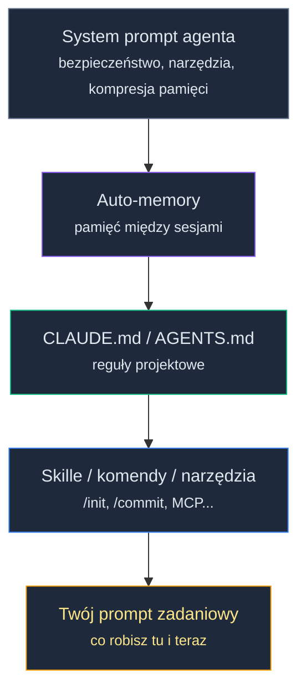
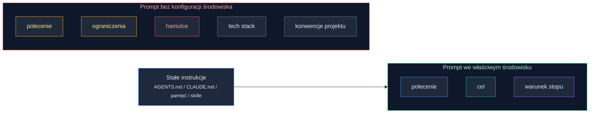

# Agent Onboarding: Reguły dla AI

Przejście przez proces bootstrapowania powinno poskutkować pierwszą wersją projektu możliwego do uruchomienia. Repozytorium zawiera już połączone ze sobą pliki i moduły, mogą się pojawić ogólne akapity dokumentacji, a do tego agent potrafi już określić w jakim stacku będziemy rozwijać kolejne funkcjonalności.

Jesteśmy już o krok od wydania magicznego polecenia "zbuduj ten projekt od początku do końca" i... tutaj sprawy zaczynają się komplikować.

Wpisujesz polecenie, agent pracuje, a po kilku chwilach oceniasz jego rezultat. Coś tu nie gra. Kod wygląda sensownie, ale my w zespole pracujemy inaczej. Obsługa błędów powinna być bardziej rozbudowana. Brakuje walidacji na API. Nawet nazewnictwo plików nie wszystkim odpowiada a do tego brakuje spójności. No dobra - tu poprawiam, tam poprawiam, znowu prompt i... znowu to samo. Poprawki. Agent pracuje tobą.

Po kilku takich iteracjach zaczynasz pracować jako korektor agenta, a nie jako osoba prowadząca projekt.

To wszystko nie musi oznaczać słabego modelu ani źle napisanego polecenia. Każda nowa sesja ma na tym etapie te same braki, a konkretnie jeden najważniejszy - agent nie zna konwencji twojego projektu. Nie wie, które reguły są oczywiste, które wynikają z frameworka, a które są waszą lokalną umową. Czas to zmienić.

W tej lekcji wykonamy skuteczny onboarding agenta do projektu: określimy reguły pracy, nauczymy się oceniać wartość poszczególnych instrukcji i skonfigurujemy szkielet lokalnej pętli feedbacku, która poprawia jego pracę bez twoich przypomnień. Ten ostatni aspekt będziemy pogłębiać niemal do końca 10xDevs.

Na dobry początek pobierz paczkę dla tej lekcji:

```bash
npx @przeprogramowani/10x-cli@latest get m1l4
```

Albo powiedz agentowi: *"pobierz paczkę z lekcji m1l4"* — działa tak samo.

### Co agent widzi i czego nie widzi na starcie

Każda nowa sesja programowania z agentem zaczyna się od wstępnie wypełnionej pamięci roboczej (okna kontekstowego) modelu AI. To przestrzeń, w której znajdują się instrukcje systemowe, reguły projektu, pamięć między sesjami, dostępne komendy i może tam również trafić twój bieżący prompt. To pierwsza ważna obserwacja - nawet w pustym repo Agent nie startuje od zera. Nadal brakuje mu jednak istotnych informacji kontekstowych.

W preworku [3.2] po raz pierwszy pojawiła się hierarchia instrukcji wczytywana do okna kontekstowego. Teraz wracamy do niej od strony praktycznej. Najpierw ogólna struktura:


<!-- rendered: ../../assets/diagrams/lessons-m1-l4-lesson-draft-1.png | cdn: https://images.przeprogramowani.pl/diagrams/lessons-m1-l4-lesson-draft-1.png -->
<!-- cdn-10x: https://images.przeprogramowani.pl/diagrams/lessons-m1-l4-lesson-draft-1-10x.png -->

Dobrze wizualizuje to polecenie `/context` w Claude Code - zwróć uwagę, że przy pierwszym uruchomieniu tego polecenia mamy już zajęte 22 tys. tokenów!


<!-- cdn: https://images.przeprogramowani.pl/lessons/m1-l4/assets/context.png -->

Każda składowa, która trafia do okna kontekstowego modelu, ma innego właściciela:

- **System prompt** definiuje producent narzędzia. To są zasady bezpieczeństwa, obsługa narzędzi, izolacja środowiska, kompresja kontekstu i ogólne reguły pracy. Tej warstwy nie edytujesz.
- **Auto-memory** pamięć o projekcie, którą agent buduje w trakcie każdej sesji. To wygodne, ale warte regularnego przeglądania.
- **CLAUDE.md / AGENTS.md** stałe reguły rozwijane przez ciebie i twój zespół. Tu trafiają konwencje projektu, nieoczywiste ograniczenia i reguły, których agent nie wywnioskuje z samego kodu.
- **Skille i komendy** standaryzują powtarzalne zadania, na przykład `/init`, `/commit`, `/review` albo wasze własne procedury pracy.
- **Prompt zadaniowy / Messages** Seria wiadomości wymienianych z agentem w kontekście danego zadania.

Cały ten układ instrukcji powinien prowadzić do praktycznego wniosku: twój prompt to tylko wierzchołek góry lodowej, która wpływa na kierunek pracy agenta.

Wszystkie inne warstwy wpływają na to, co dzieje się po napisaniu prompta i naciśnięciu "ENTER" - jak agent go zinterpretuje, co zrobi najpierw, co w innym kroku, które pliki wczyta, a które zignoruje.

Oczywiście zawsze możesz przerwać proces działania, odrzucić diff, wycofać kroki albo dopisać korektę, ale to będzie marnotrawstwo czasu i tokenów. W praktyce, bez instrukcji, dajesz agentowi duże pole do błądzenia.

Jeśli agent źle odczyta intencję albo nie zna lokalnych reguł, błąd nie musi skończyć się jedną złą odpowiedzią. Może uruchomić kaskadę: zły plik, zły wzorzec, zła komenda, poprawka do własnej błędnej poprawki.

Dlatego instrukcje projektowe nie służą tylko temu, żeby nie powtarzać w każdym prompcie konwencji projektu, formatu odpowiedzi, komend testowych i zakazanych wzorców. One przesuwają część kontroli przed start sesji. Zanim agent zacznie działać, dostaje ramy, które ograniczają pole zgadywania.

Da się pracować bez tej warstwy, ale wtedy prompt zadaniowy staje się jednocześnie poleceniem, pamięcią projektu i awaryjnym hamulcem. Szybko robi się z tego rytuał, a przy agentach także źródło kosztownych rozjazdów.


<!-- rendered: ../../assets/diagrams/lessons-m1-l4-lesson-draft-2.png | cdn: https://images.przeprogramowani.pl/diagrams/lessons-m1-l4-lesson-draft-2.png -->
<!-- cdn-10x: https://images.przeprogramowani.pl/diagrams/lessons-m1-l4-lesson-draft-2-10x.png -->

### Od /init do pierwszego szkicu

Jak wdrożyć konkretny zestaw reguł i instrukcji onboardingowych dla agenta? Dobrze jest rozpocząć od komend wbudowanych - to starter, który da nam `safe defaults`.

W Claude Code będzie to komenda `/init` - po jej wykonaniu agent analizuje repozytorium i generuje startowy `CLAUDE.md`: w środku możesz znaleźć komendy budowania, uruchamiania testów i formatterów (jeśli są), strukturę projektu i wstępne konwencje. Jeśli plik już istnieje, `/init` powinien zaproponować ulepszenia zamiast nadpisywać wszystko od zera.

Codex na skutek tej samej komendy utworzy `AGENTS.md` - założenia są identyczne.

W paczce do tej lekcji dostajesz też eksperymentalny skill `/10x-agents-md`. Traktuj go jako alternatywę dla wbudowanej komendy `/init` albo jako ścieżkę awaryjną, jeśli twoje IDE lub agent nie ma własnego generatora pliku projektowego. Skill ma pomóc przygotować pierwszy szkic `AGENTS.md`, ale nie zwalnia z ręcznego przeglądu: nadal sprawdzasz, czy plik opisuje wasze lokalne konwencje, a nie streszcza dokumentację, którą agent i tak może przeczytać.

GitHub Copilot nie ma lokalnego odpowiednika `/init` w CLI. Jego główna konwencja projektowa to `.github/copilot-instructions.md`. Copilot wspiera też AGENTS.md, więc w zespole warto jasno zdecydować, który plik jest źródłem prawdy.

Porównajmy teraz różne podejścia do takiej inicjalizacji reguł:

<div style="padding:56.25% 0 0 0;position:relative;"><iframe src="https://player.vimeo.com/video/1191889943?badge=0&amp;autopause=0&amp;player_id=0&amp;app_id=58479" frameborder="0" allow="autoplay; fullscreen; picture-in-picture; clipboard-write; encrypted-media; web-share" referrerpolicy="strict-origin-when-cross-origin" style="position:absolute;top:0;left:0;width:100%;height:100%;" title="M1 L4 init"></iframe></div><script src="https://player.vimeo.com/api/player.js"></script>

#### Eksperymentalny `/init` w Claude Code

W nowszych buildach Claude Code pojawia się też eksperymentalny wariant `/init`, przełączany flagą `CLAUDE_CODE_NEW_INIT`. Nie chodzi tu o drugi opis tego samego generatora `CLAUDE.md`, tylko o rozszerzenie komendy w stronę krótkiego onboardingu projektu.

Po włączeniu flagi `/init` może zapytać, czy ma przygotować zespołowy `CLAUDE.md`, prywatny `CLAUDE.local.md`, czy oba pliki. Może też zaproponować skille i hooki.

Skille mają pasować do powtarzalnych, ale niekoniecznie automatycznych workflowów: głębsza weryfikacja projektu, raport po sesji, deploy na sandbox, release checklist albo procedura naprawiania konkretnego typu problemu. Hooki są przeznaczone raczej do mechanicznych kontroli, których agent nie powinien pomijać: formatter po edycji pliku, szybki lint albo test dla zmienionego pliku, komenda uruchamiana na końcu tury. Prompt rozróżnia te poziomy dość sensownie: hook ma być deterministycznym sygnałem z narzędzia, skill ma być procedurą wywoływaną wtedy, gdy faktycznie jej potrzebujesz.

Ważna różnica jest proceduralna: agent najpierw bada repozytorium, potem dopytuje tylko o luki, których nie da się wyczytać z kodu, a dopiero na końcu proponuje konkretne artefakty.

Uruchomienie wygląda tak:

```bash
CLAUDE_CODE_NEW_INIT=true claude
```

A potem w sesji:

```text
/init
```

To nadal funkcja eksperymentalna i zależna od buildu Claude Code, więc traktuj ją jako wygodny skrót do pracy konfiguracyjnej, nie jako stabilny standard zespołowy. Efekt końcowy oceniaj tym samym filtrem co zwykły szkic: czy dana instrukcja, skill albo hook usuwa realny, powtarzalny błąd agenta.

### Jak oczyścić szkic

Mamy plik onboardingowy - zadbajmy teraz o jego zawartość.

Pierwszy odruch? Więcej szczegółów projektu, więcej o architekturze, obszerny opis stacku technologicznego, najważniejsze konwencje frameworka, przepisanie komend z README i klasyk - "pisz czytelny kod".

Plik rośnie do kilkuset linii i wygląda profesjonalnie.

Niestety, taka zawartość może paradoksalnie pogorszyć jakość pracy agenta. Z jednej strony, przez obszerne reguły w oknie kontekstowym zostaje mniej miejsca na twoje polecenia. Im bardziej zajęte okno, tym gorsza jakość interpretacji kolejnych wiadomości. Po drugie - redundancja. Jeśli przepisujesz rzeczy, które agent może znaleźć w README albo co gorsza widział je już na etapie treningu (np. opis wzorca projektowego `Observer` albo fragment dokumentacji `FastAPI`), zajmujesz jego okno kontekstowe szumem.

Twórcy Claude Code sugerują praktyczną granicę: CLAUDE.md powinien zwykle trzymać się **ok. 200 linii** na plik — nie dlatego, że linia 201 nagle psuje model, ale dlatego, że większy plik coraz częściej oznacza, że płacisz kontekstem za rzeczy, których agent nie potrzebuje w każdej sesji.

Cursor w dokumentacji reguł formułuje to bardziej operacyjnie: dobra reguła jest **skupiona, wykonywalna i ograniczona zakresem**. Nie opisuje całego projektu. Mówi agentowi, co ma zrobić inaczej w konkretnym miejscu pracy.

To daje prosty filtr czyszczenia szkicu:

- jeśli reguła dotyczy całego repo i naprawdę ma obowiązywać zawsze, zostaw ją w głównym `AGENTS.md` albo `CLAUDE.md`,
- jeśli dotyczy tylko części kodu, przenieś ją bliżej tego kodu: do zagnieżdżonego `AGENTS.md`, lokalnego `CLAUDE.md` albo narzędziowego odpowiednika typu `.cursor/rules` z globem,
- jeśli reguła powtarza README, style guide, dokumentację frameworka albo konfigurację lintera, usuń ją i zostaw referencję do kanonicznego pliku,
- jeśli reguła brzmi jak intencja ("pisz czytelny kod", "dbaj o jakość"), zamień ją na sprawdzalne zachowanie (np. `unikaj typu "any"`) albo usuń,
- jeśli reguła nie wynika z powtarzalnego błędu agenta, nie dodawaj jej "na zapas".

Zamiast kopiować przykładowy komponent, endpoint albo migrację do pliku instrukcji, wskaż agentowi plik wzorcowy: `@src/features/users/user.service.ts`, `@docs/api-errors.md`, `@migration-template.sql`. Reguła zostaje krótka, a przykład nie starzeje się w dwóch miejscach naraz.

Wpływ różnego rodzaju reguł na pracę z Agentami opisują dwa badania, które umieszczamy na końcu lekcji, w sekcji **Deep Dive / Materiały dodatkowe**.

Na teraz potrzebujesz z nich jednego wniosku: nie chodzi o "krótki plik dobry, długi plik zły" — chodzi o praktyczną intuicję wynikającą z tego, jak budowany jest sam model, z którym pracujemy. Cursor dopowiada praktyczny mechanizm: zacznij prosto, rozbijaj duże reguły na mniejsze, referencjonuj pliki zamiast kopiować ich treść i aktualizuj instrukcje dopiero wtedy, gdy widzisz powtarzalny błąd agenta.

### Jak oceniać jakość reguł i instrukcji dla Agenta?

**Test inkluzji:** zanim dopiszesz regułę, zapytaj:

> Czy agent mógłby to wiedzieć bez tego pliku? Czy publicznie dostępne dane treningowe (książki, artykuły, blogi, repozytoria w twoim stacku) mogły go na to przygotować?

Jeśli tak, zwykle nie dopisuj. Jeśli nie, dopisz.

Do AGENTS.md albo CLAUDE.md mogą należeć:

- nieoczywiste konwencje projektu, na przykład format odpowiedzi błędów,
- nietypowe nazewnictwo plików i modułów,
- zasady importów, których nie da się bezpiecznie wywnioskować,
- pułapki charakterystyczne dla projektu,
- "wstydliwe" obejścia, które trzeba utrzymać, bo wynikają z historii kodu albo błędu zależności.

Nie należą tam:

- ogólna dokumentacja mainstreamowego frameworka,
- komendy szczegółowo opisane w README, jeśli agent i tak ma je czytać (wystarczy referencja przez `@README.md`),
- popularne zasady typu "używaj TypeScript strict mode" które i tak masz skonfigurowane w `tsconfig.json`,
- ogólne zdania typu: "pisz czysty kod", "dbaj o jakość", "stosuj dobre praktyki".

Pamiętaj - AGENTS.md (i ogólnie pliki z regułami) to nie jest dokumentacja dla człowieka, który pierwszy raz widzi choćby TypeScript. To onboarding dla agenta, który zna TypeScript, ale nie zna waszych lokalnych konwencji.

Jest jeszcze jeden ważny efekt: narzędzia wymienione w AGENTS.md są przez agentów używane znacznie częściej. W jednym z badań ten wzrost wynosił 1,6-2,5x. Ten plik realnie kieruje zachowaniem agenta.

Po utworzeniu pierwszego szkicu - przez `/init`, `/10x-agents-md` albo ręcznie - użyj drugiego narzędzia z paczki tej lekcji do szybkiego przeglądu reguł:

```text
/10x-rule-review <rule_file>
```

Na przykład:

```text
/10x-rule-review AGENTS.md
/10x-rule-review .cursor/rules/api.mdc
/10x-rule-review src/api/AGENTS.md
```

Skill ocenia wskazany plik w pięciu wymiarach: długość, obecność wklejonych fragmentów kodu lub konfiguracji, precyzję języka, redundancję względem wiedzy, którą agent i tak ma, oraz kolejność reguł w pliku.

Wynikiem jest tabela oceny z werdyktami `OK`, `WARN` albo `FAIL` i konkretnymi poprawkami. Domyślnie skill nie edytuje pliku - daje diagnozę, a decyzja o zmianach zostaje po twojej stronie.

Traktuj `/10x-rule-review` jak statyczny przegląd jakości reguły przed albo po eksperymencie. Jeśli dopisałeś nową zasadę w `AGENTS.md`, możesz od razu sprawdzić, czy jest krótka, konkretna, nieredundantna i dobrze ustawiona w pliku.

Potem i tak uruchom świeżą sesję z reprezentatywnym zadaniem. Dopiero wtedy zobaczysz, czy reguła faktycznie zmienia zachowanie agenta.

### Pięć wzorców do przetestowania

Najlepszy sposób na kalibrację reguł jest prosty: sprawdź, gdzie agent faktycznie łamie wasze konwencje.

Wybierz jeden wzorzec pasujący do twojego projektu:

1. **Format odpowiedzi błędów** - projekt używa `{ error: { code, message, context } }` zamiast `{ error: string }`.
2. **Nazewnictwo plików** - projekt używa `feature.handler.ts`, a nie `featureHandler.ts`.
3. **Konwencja importów** - projekt wymaga absolute imports z `@/`, a nie `../../`.
4. **Struktura modułu** - każdy moduł ma `index.ts`, `types.ts` i `__tests__/`.
5. **Obsługa dat** - projekt zawsze używa UTC i helpera `formatDate()`, a nie luźnego `new Date().toISOString()`.

Potem zrób prosty test:

1. Poproś agenta o implementację bez reguły w pliku instrukcji (najlepiej 3-5x, z każdym razem startując z tego samego stanu repozytorium)
2. Zobacz, czy i gdzie złamał konwencję. Zanotuj dostępne metadane: czas pracy agenta, uruchomione komendy oraz widoczny koszt/tokeny.
3. Dopisz minimalną regułę w 1-3 zdaniach.
4. Poproś o tę samą zmianę w świeżej sesji i porównaj wynik: konwencję, czas, liczbę eksplorowanych plików i liczbę iteracji.

Taki prosty test powinien pokazać ci, czy reguła zmniejsza błądzenie agenta i czy pomaga mu szybciej trafić w lokalną konwencję.

Jeśli agent bez reguły trafia w konwencję, nie potrzebujesz wpisu. Jeśli systematycznie wybiera nie ten wzorzec, znalazłeś dobrą instrukcję niestandardową.

### Hierarchia instrukcji - AGENTS.md oraz CLAUDE.md

A co kiedy instrukcje już istnieją i co gorsza - jest ich wiele? Które są brane pod uwagę przez agenta?

Claude Code wczytuje `CLAUDE.md` z kilku miejsc, a kolejność ma znaczenie. Na starcie sesji agent szuka pliku w katalogu użytkownika (np. na macOS będzie to `~/.claude/CLAUDE.md`), potem w głównym folderze repozytorium, a następnie w podkatalogach, w których aktualnie pracuje — im głębiej w strukturze projektu, tym reguły mogą być bardziej szczegółowe i nadpisywać lub uzupełniać te z wyższych poziomów. Jeśli edytujesz plik w `src/api/`, agent może wczytać zarówno główny `CLAUDE.md` na poziomie repo, jak i osobny `CLAUDE.md` wewnątrz `src/api/`, który zawiera reguły właściwe tylko dla tej części kodu. Reguły ogólne żyją wyżej, reguły obszarowe — bliżej kodu. W praktyce zbadamy to w lekcji o skalowaniu kontekstu, w dalszej części szkolenia 10xDevs.

Codex i GitHub Copilot działają analogicznie dla `AGENTS.md`. Codex szuka pliku `AGENTS.md` w katalogach od bieżącego w górę drzewa — najbliższy znaleziony plik ma priorytet. GitHub Copilot stosuje tę samą zasadę: wygrywa `AGENTS.md` najbliższy w drzewie katalogów. Możesz mieć globalny `AGENTS.md` w korzeniu projektu z regułami dla całego zespołu i osobne pliki w podkatalogach dla konkretnych modułów. Claude Code natywnie czyta `CLAUDE.md`, ale obsługuje import via `@AGENTS.md` — wystarczy dopisać ten marker do `CLAUDE.md`, żeby agent wczytał obie konwencje. W zespołach używających kilku narzędzi jednocześnie to naturalny punkt startu dla ujednolicenia reguł w jednym pliku.

Wczytywanie wielu plików rodzi pytanie o to, jak kolejność wczytywania wpływa na wagę poszczególnych instrukcji? Badania nad modelami językowymi opisują zjawisko `U-shaped attention`: modele poświęcają wyraźnie więcej uwagi treściom **na początku i na końcu kontekstu** niż tym w środku. Instrukcje zakopane głęboko w długim pliku — albo wczytywane jako czwarty lub piąty dokument z rzędu — mają statystycznie mniejsze szanse na spójne przestrzeganie niż te, które agent widzi zaraz po systemowym prompcie. To tłumaczy, dlaczego zalecenie "około 200 linii na plik" nie jest efektywną rekomendacją: długi monolityczny `CLAUDE.md` sprawia, że reguły z jego dolnej połowy lądują w obszarze najsłabszej uwagi modelu.

Praktyczny wniosek: najważniejsze reguły projektowe umieść na górze pliku. Jeśli narzędzie wspiera reguły obszarowe i wczytuje je selektywnie — na przykład `src/api/CLAUDE.md` tylko przy pracy w tej części kodu — każdy krótszy plik trafia do okna kontekstowego w całości i blisko początku swojej sekcji. Agent nie musi "dopłynąć" do reguły nr 47 na dole 400-liniowego dokumentu. To jest jedna z konkretnych korzyści z granularnych reguł zamiast jednego dużego pliku.

### Lekcje z incydentów agenta

Dobry dokument onboardingowy dla agenta zawiera praktyczne reguły pracy, ale dobre reguły rzadko biorą się z teorii. **Najczęściej biorą się z incydentów.**

W poprzednich lekcjach `context/foundation/` pełnił rolę miejsca na trwałe kontrakty projektu: `prd.md`, `tech-stack.md` i inne decyzje, które kolejne skille mogą czytać bez zgadywania. W m1-l4 dokładamy do tego katalogu jeszcze jeden plik: `context/foundation/lessons.md`.

To rejestr powtarzalnych lekcji dopisywany tylko na końcu pliku. Trafiają tam rzeczy, które powinny wpływać na przyszłe ustawienie problemu, research, planowanie, implementację albo review.

Nie chodzi o kronikę każdego błędu agenta. Chodzi o reguły, które będą wracać.

Do dopisywania takich lekcji służy skill z paczki m1-l4:

```text
/10x-lesson
```

Możesz też podać zalążek reguły od razu w komendzie:

```text
/10x-lesson feature flags should always have a kill date
```

Skill zada cztery pytania i dopisze jedną lekcję do `context/foundation/lessons.md`:

- **Context** — gdzie ta reguła obowiązuje: część systemu, faza pracy, wzorzec plików,
- **Problem** — co konkretnie psuje się bez tej reguły,
- **Rule** — sama reguła w trybie rozkazującym, najlepiej w 1-2 zdaniach,
- **Applies to** — które skille powinny najmocniej ją ważyć: `frame`, `research`, `plan`, `plan-review`, `implement`, `impl-review` albo `all`.

Wpis ma stały format:

```markdown
## Nie dodawaj lodash bez jawnego powodu

- **Context**: Implementacja funkcji w aplikacji TypeScript po stronie frontendu i backendu.
- **Problem**: Agent użył `_.filter()`, mimo że lodash nie jest częścią projektu. To dodałoby niepotrzebną zależność i rozjechało lokalną konwencję pracy z natywnymi API.
- **Rule**: Nie dodawaj lodash bez jasnego wskazania. Projekt preferuje natywne funkcje JS/TS w standardzie 2026+.
- **Applies to**: plan, implement, impl-review
```

Jeśli plik jeszcze nie istnieje, `/10x-lesson` utworzy go z nagłówkiem `# Lessons Learned`. Jeśli istnieje, dopisze nową sekcję na końcu.

To ważna konwencja: ten plik rośnie przez dopisywanie, nie przez porządkowanie historii. Nie sortujesz go, nie deduplikujesz przy okazji i nie przerabiasz wcześniejszych wpisów, kiedy chcesz dodać jedną obserwację.

Różnica między incydentem a lekcją jest praktyczna. Jeśli agent raz zrobił dziwną rzecz, zanotuj ją lokalnie albo popraw prompt. Jeśli widzisz klasę błędów, która zmieniłaby decyzje w poprzednich zadaniach i prawdopodobnie wróci w kolejnych — uruchom `/10x-lesson`.

Możesz też umieścić referencję do rejestru w głównych instrukcjach projektu, żeby agenci spoza 10xWorkflow wiedzieli, gdzie szukać tych reguł:

```markdown
## Lessons learned

Zobacz: `context/foundation/lessons.md`
```

Po kilku tygodniach taki plik staje się konkretną mapą waszego środowiska agentowego: gdzie model zgaduje dobrze, gdzie zgaduje źle i które reguły mają uzasadnienie w realnych powtarzalnych problemach.

Kolejne skille 10xWorkflow mogą czytać ten plik jako punkt odniesienia, więc jedna dobrze zapisana lekcja zaczyna pracować w następnych etapach projektu.

### Ustawienia zespołowe

Omówione wcześniej porady zakładają, że trzymamy się jednego wspólnego standardu instrukcji, ale nie jest to regułą. Obecnie społeczność AI kieruje się w stronę `AGENTS.md`, choć twórcy Claude Code mają inne zdanie. W takim przypadku Claude może importować AGENTS.md przez jedną linijkę wpisu w `CLAUDE.md`:

```markdown
This file provides guidance to AI Agents when working with code in this repository:
@AGENTS.md
```

Jeśli głównym narzędziem jest Claude Code, ale chcesz, żeby Codex czy Copilot korzystał z tych samych reguł, najprostszy układ wygląda tak:

- `AGENTS.md` jako wspólne źródło prawdy,
- `CLAUDE.md` jako cienka warstwa Claude Code z importem `@AGENTS.md`,
- `.github/copilot-instructions.md` tylko wtedy, gdy Copilot potrzebuje własnych doprecyzowań.

Dodatkowo, jeśli narzędzia wymagają różnych nazw plików i nie chcesz utrzymywać duplikatów, możesz użyć symlinków:

```bash
ln -s AGENTS.md CLAUDE.md
```

Najważniejsze: jedna reguła nie powinna żyć w trzech miejscach. Duplikaty instrukcji rozjeżdżają się tak samo szybko jak duplikaty kodu.

## 🧑🏻‍💻 Zadania praktyczne

- **Wygeneruj i przefiltruj pierwszy szkic reguł.** Uruchom `/init` (lub `/10x-agents-md`) w swoim projekcie, a potem `/10x-rule-review AGENTS.md`. Usuń wszystkie wpisy, które przechodzą "test inkluzji" (agent wiedziałby o nich bez pliku) i te brzmiące jak intencja ("pisz czysty kod"). Cel: wstępny szkic poniżej ~200 linii, z konwencjami, których agent nie wywnioskuje z kodu.
- **Skalibruj jedną regułę eksperymentem A/B.** Wybierz jeden z pięciu wzorców (format błędów, nazewnictwo plików, importy, struktura modułu, daty) i wykonaj test ze świeżą sesją: 3 razy bez reguły, potem 3 razy z minimalną regułą w `AGENTS.md`. Zanotuj różnicę w czasie, liczbie iteracji i trafianiu w konwencję. Jeśli wynik bez reguły jest już dobry, regułę wyrzuć.

## Odbierz swoją odznakę

Po ukończeniu tej lekcji odbierz odznakę w sekcji [10xDevs Mission Log](https://platforma.przeprogramowani.pl/10xdevs-3/mission-log) a następnie pochwal się swoim osiągnięciem!

## 🔎 Deep Dive

Ta sekcja zawiera dodatkowe pogłębienie wiedzy na temat wybranych zagadnień związanych z lekcją. W tym Deep Dive znajdziesz:

- **Systemowe prompty popularnych narzędzi** — analiza publicznie dostępnych system promptów Claude Code i Cursora — co mówią o hierarchii bezpieczeństwa, zarządzaniu pamięcią i architekturze narzędzi.
- **Ślady po sesjach** — jak agenty budują pamięć między sesjami, gdzie ją znaleźć i kiedy warto ją wyczyścić.

Ta sekcja lekcji nie jest obowiązkowa, ale warto się z nią zapoznać jeżeli chcesz zostać ekspertem.

W Core operowaliśmy wnioskami z dwóch publicznych badań na agentach kodowania: jedno mówi, że dobrze użyty AGENTS.md skraca pracę agenta, drugie - że źle użyty ją zwiększa. W Deep Dive wracamy do samych prac, żeby zobaczyć skąd biorą się te liczby, na jakich agentach mierzono i gdzie kończy się generalizacja.

W pierwszym badaniu przeprowadzonym na agencie OpenAI Codex, dla małych PR-ów do 100 linii kodu, dobrze użyty AGENTS.md skrócił medianowy czas wykonania zadania o około 28% i zmniejszył liczbę tokenów wygenerowanych przez agenta o około 16%! To nie jest dowód, że każdemu agentowi w każdym zadaniu będzie szybciej, ale pokazuje kierunek: projektowy kontekst potrafi ograniczyć błądzenie.

Drugie badanie, na Claude Code, Codexie i Qwen Code, pokazuje ciemną stronę instrukcji. Pliki kontekstowe wygenerowane przez LLM albo wypełnione zbyt obszerną dokumentacją, którą agent i tak miał pod ręką, podnosiły koszty o około 20-23% i pogarszały skuteczność. Autorzy zwracają uwagę, że szkodziła głównie redundancja z istniejącymi dokumentami, a nie sam fakt posiadania AGENTS.md.

W kolejnym filmie raz jeszcze omawiamy oba badania, a także dzielimy się naszymi wnioskami z wewnętrznych testów:

<div style="padding:56.25% 0 0 0;position:relative;"><iframe src="https://player.vimeo.com/video/1191860000?badge=0&amp;autopause=0&amp;player_id=0&amp;app_id=58479" frameborder="0" allow="autoplay; fullscreen; picture-in-picture; clipboard-write; encrypted-media; web-share" referrerpolicy="strict-origin-when-cross-origin" style="position:absolute;top:0;left:0;width:100%;height:100%;" title="M1 L4 experiments"></iframe></div><script src="https://player.vimeo.com/api/player.js"></script>

### Systemowe prompty popularnych narzędzi

W prezentowanym wcześniej stosie kontekstu, na pierwszym miejscu były instrukcje i narzędzia systemowe. Czy muszą one pozostawać dla nas czarną skrzynką? Niekoniecznie - społeczność Open Source rzuca nam koło ratunkowe.

To dostępne na GitHubie zbiory system promptów popularnych agentów kodowania. Widać w nich powtarzalny układ instrukcji: najpierw tożsamość agenta i ograniczenia bezpieczeństwa, potem operacje systemowe, dalej kontekst projektu, reguły wykonywania zadań i dokumentacja narzędzi.

Przyjrzyjmy się konkretnym przykładom. Jednym z najlepiej udokumentowanych publicznie przykładów jest [system prompt Claude Code](https://github.com/asgeirtj/system_prompts_leaks/blob/main/Anthropic/claude-code.md) (v2.1.120, ~610 linii).

**Obserwacja 1 — hierarchia bezpieczeństwa ponad wszystkim.** Pierwsza instrukcja w całym prompcie dotyczy bezpieczeństwa, a nie kodu:

```
Assist with authorized security testing, defensive security, CTF challenges,
and educational contexts. Refuse requests for destructive techniques, DoS attacks,
mass targeting, supply chain compromise, or detection evasion for malicious purposes.
```

Nie ma tu listy frameworków. Nie ma preferowanego języka. Pierwsza reguła mówi o tym, czego agent robić nie wolno. To celowy sygnał od producenta: tożsamość agenta musi bazować na bezpiecznym działaniu.

**Obserwacja 2 — "blast radius" jako zasada pracy.** Kilkanaście linii dalej pojawia się zasada, która wymaga od agenta szacowania odwracalności każdej akcji, zanim ją wykona:

```
Carefully consider the reversibility and blast radius of actions.
Generally you can freely take local, reversible actions like editing files
or running tests. But for actions that are hard to reverse, affect shared systems
beyond your local environment, or could otherwise be risky or destructive,
check with the user before proceeding.
```

Prompt dosłownie kategoryzuje typy ryzykownych działań: operacje destrukcyjne (`rm -rf`, drop tabeli w bazie), trudno odwracalne (`force push`, amend opublikowanego commita), widoczne dla innych (komentarze na GitHubie, wiadomości na Slacku). Agent ma więc nie tylko umieć pisać kod — ma umieć ważyć konsekwencje.

**Obserwacja 3 — degradacja pamięci wbudowana w prompt.** W sekcji dotyczącej mechanizmu auto-memory pojawia się rzadko spotykana klauzula epistemiczna:

```
A memory that names a specific function, file, or flag is a claim that it existed
when the memory was written. It may have been renamed, removed, or never merged.
"The memory says X exists" is not the same as "X exists now."
```

To znaczy, że sam producent narzędzia wprost wbudował w system prompt ostrzeżenie: pamięć może kłamać. Agent jest instruowany, żeby weryfikować każde wspomnienie przed użyciem, a nie traktować je jako fakt.

**Obserwacja 4 — narzędzia ładowane leniwie.** System prompt Claude Code nie zawiera pełnych schematów wszystkich dostępnych narzędzi. Część z nich — m.in. `CronCreate`, `Monitor`, `TaskCreate`, `NotebookEdit` — jest wymieniona wyłącznie po nazwie w sekcji `Deferred Tools`. Ich pełne schematy muszą być pobrane na żądanie przez osobne narzędzie `ToolSearch`. To celowy kompromis: mniejszy prompt bazowy, mniejsze zużycie kontekstu, schematy pobierane tylko wtedy, gdy są naprawdę potrzebne.

---

Dla porównania, [system prompt Cursora](https://github.com/asgeirtj/system_prompts_leaks/blob/main/Misc/cursor.md) (~18 KB) pokazuje inną filozofię architektury.

**Obserwacja z Cursora — stan terminala jako plik.** Cursor nie udostępnia agentowi dedykowanego API do sprawdzania terminala. Zamiast tego informacje o uruchomionych procesach i ostatnich komendach są wstrzykiwane pasywnie jako pliki tekstowe w katalogu `terminals/`:

```
The terminals folder contains text files representing the current state
of IDE terminals... Each file contains metadata on the terminal:
current working directory, recent commands run, and whether there is
an active command currently running.
```

To zasadnicza różnica w stosunku do Claude Code, gdzie każda akcja jest jawnym wywołaniem narzędzia. W Cursorze znaczna część IDE-kontekstu trafia do modelu jako tekst — co ułatwia integrację, ale też oznacza, że agent ma mniej kontroli nad tym, co i kiedy czyta.

---

Zestawiając oba prompty, widać spójną logikę: **miejsce dla AGENTS.md jest zawsze po warstwie producenta, a przed promptem zadaniowym**. Producent definiuje co agent może, AGENTS.md definiuje jak pracujesz w tym konkretnym projekcie. Dwie warstwy mają różne właścicieli i różne cele, a tutaj widać to jak na dłoni.

### Ślady po sesjach

Wróćmy teraz do warstwy `auto-memory` z diagramu na początku tej lekcji.

W wielu narzędziach agentowych, między sesjami będzie budowana automatyczna pamięć o projekcie i naszych akcjach. To również coś, co znajdzie się w oknie kontekstowym przyszłych zadań agenta.

Przykładowo, w Claude Code możesz ją sprawdzić i edytować przez `/memory`, a wyłączyć ustawieniem `autoMemoryEnabled` albo zmienną `CLAUDE_CODE_DISABLE_AUTO_MEMORY`.

Pamięć jest lokalna dla maszyny i projektu (na przykładzie macOS):

```text
~/.claude/projects/<nazwa-katalogu>/memory/MEMORY.md
```

`<nazwa-katalogu>` powstaje ze ścieżki repozytorium, gdzie ukośniki są zamienione na myślniki. Przykład:

```text
/Users/jan/projekty/moja-aplikacja
-> ~/.claude/projects/-Users-jan-projekty-moja-aplikacja/memory/MEMORY.md
```

Na początku sesji Claude Code ładuje indeks pamięci: pierwsze 200 linii albo 25 KB `MEMORY.md`. Bardziej szczegółowe pliki tematyczne mogą być ładowane dopiero wtedy, gdy są potrzebne.

Po ważnej sesji sprawdź, co agent zapamiętał:

```bash
cat ~/.claude/projects/<ścieżka>/memory/MEMORY.md
```

Jeśli zobaczysz błędną decyzję, usuń ją. Jeśli ważna decyzja nie trafiła do pamięci, a twoim zdaniem powinna tam być, dopisz ją ręcznie - to może być kolejna warstwa weryfikacji obok `AGENTS/CLAUDE.md`.

Reset jest prosty: usuń albo przemianuj katalog `memory/`. Przy kolejnej sesji agent zacznie odbudowywać pamięć.

W Codexie pamięć działa trochę inaczej. Wspomnienia są domyślnie wyłączone i według dokumentacji OpenAI na starcie potrzebujesz jawnej decyzji:


<!-- cdn: https://images.przeprogramowani.pl/lessons/m1-l4/assets/codex-memory.png -->

Inna opcja to zmiana konfiguracji w ustawieniach pod `~/.codex/config.toml`:

```toml
[features]
memories = true
```

Po włączeniu Codex może przenosić użyteczny kontekst z wcześniejszych wątków do kolejnych: stabilne preferencje, powtarzalne workflow, stack technologiczny, konwencje projektu i znane pułapki. W pojedynczym wątku kontrolujesz użycie pamięci komendą `/memories`.

Pliki pamięci Codex trzyma pod `CODEX_HOME`, domyślnie w `~/.codex/memories/`. Możesz je obejrzeć przy debugowaniu albo przed udostępnieniem katalogu Codex, ale nie traktuj ręcznej edycji tych plików jako głównego sposobu sterowania agentem.

Reguła jest ta sama co przy Claude Code: pamięć lokalna pomaga, ale nie jest źródłem prawdy. Zasady, które mają obowiązywać zespół, trzymaj w `AGENTS.md` albo w dokumentacji w repozytorium.

## 📚 Materiały dodatkowe

- [On the Impact of AGENTS.md Files on the Efficiency of AI Coding Agents](https://arxiv.org/abs/2601.20404) — Lulla et al. Badanie na OpenAI Codex: około 28% krótszy medianowy czas wykonania i około 16% mniej tokenów wygenerowanych przez agenta w małych PR-ach do 100 linii kodu.
- [Evaluating AGENTS.md: Are Repository-Level Context Files Helpful?](https://arxiv.org/abs/2602.11988) — Gloaguen et al., ETH Zurich + DeepMind. Badanie na Claude Code, Codexie i Qwen Code: redundantne pliki instrukcji podnoszą koszty, a minimalne reguły mają większy sens niż kopia dokumentacji.
- [Cursor Rules documentation](https://cursor.com/docs/rules.md) — praktyczne zasady tworzenia reguł: skupione, wykonywalne, ograniczone zakresem, z referencjami do plików zamiast kopiowania dokumentacji.
- [GitHub Copilot Custom Instructions and AGENTS.md Support](https://docs.github.com/en/copilot/customizing-copilot/adding-repository-custom-instructions) — GitHub Changelog. Wsparcie dla AGENTS.md i `.github/copilot-instructions.md`.
- [OpenAI Codex documentation - AGENTS.md and Memories](https://platform.openai.com/docs/guides/codex) — zasady używania AGENTS.md jako kontekstu projektu oraz `/memories` jako kontroli pamięci w aktualnym wątku.
- [Lost in the Middle: How Language Models Use Long Contexts](https://arxiv.org/abs/2307.03172) — Liu et al. Badanie pokazujące u-shaped attention: modele osiągają najlepszą skuteczność dla informacji na początku i końcu kontekstu, a najgorszą dla treści umieszczonych w jego środku — podstawa dla rekomendacji dotyczących kolejności i długości plików instrukcji.
