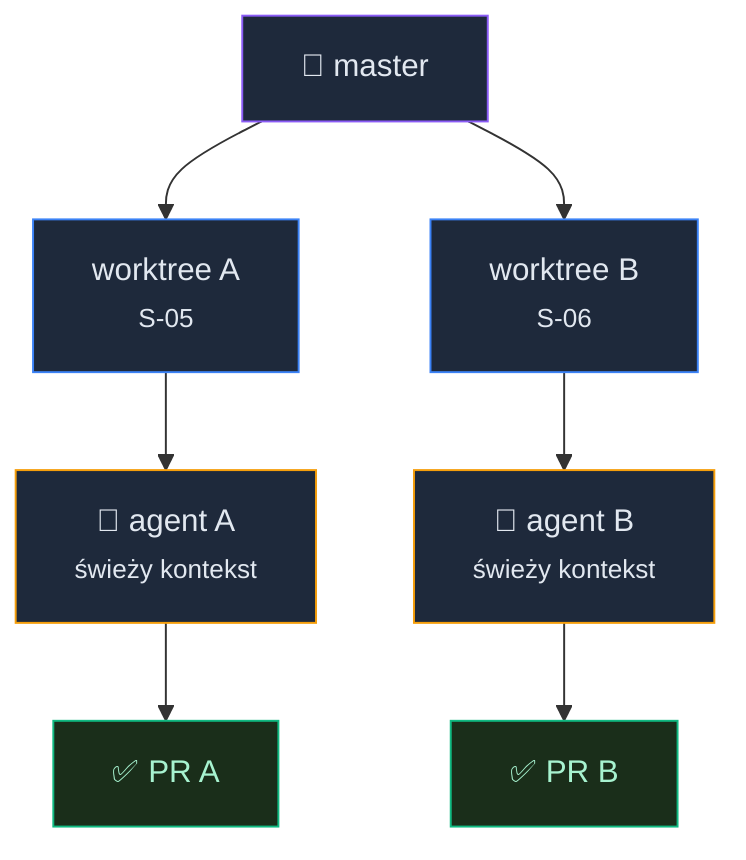

# Innovate: Więcej ficzerów, mniej czekania


<!-- cdn: https://images.przeprogramowani.pl/lessons/m2-l5/assets/cover.jpg -->

W poprzednich lekcjach przeszliśmy przez pełne cykle zmian dla prostych i złożonych slice'ów.

No i od razu pojawia się następne pytanie: co z resztą roadmapy?

Jeśli w roadmapie zostało sześć slice'ów, najprostszy odruch brzmi: "odpalmy sześciu agentów". Kuszące. Przez pierwsze pięć minut wygląda jak przyszłość programowania, a potem masz do ogarnięcia kilka sesji z agentem, kilka branchy, kilka PR-ów i jedno pytanie: kto ma to wszystko zrozumieć?

Nadal ty.

Więcej agentów bez zarządzania i kontroli to nie większa produktywność. To więcej przypadkowego kodu, za który będziesz musiał wziąć odpowiedzialność.

W tej lekcji dowiesz się jak prowadzić pracę równolegle w zorganizowany sposób. Zadbamy o osobny zakres, osobne git worktree i osobnego agenta.

W preworku poznałeś worktrees i izolowanie kontekstu jako koncepcje. Tutaj zobaczymy jak stosować te mechanizmy pracy równoległej w praktyce.

### Zacznij od niezależnych slice'ów

Jeśli dwa slice'y dotykają tych samych obszarów projektu, równoległa praca wcale nie przyspieszy postępów. Wyprodukuje konflikt, który potem ktoś musi rozplątać ręcznie.

Dlatego nie wybieraj "dowolnych dwóch zadań z roadmapy". Wybierz dwa, które mogą dojść do PR-ów bez wchodzenia sobie w drogę.

Podczas pracy nad poprzednimi slice'ami pewnie zauważyłeś drobne problemy z interfejsem, brakujące akcje, irytujące ograniczenia. Zamiast dopisywać je do istniejącego slice'a, dodaliśmy nowy wpis do roadmapy 10xCards:

| Slice | Temat | Dlaczego nadaje się do równoległości |
|---|---|---|
| S-05 | Usuwanie konta (RODO) | Logika usuwania konta i retencji danych, osobny obszar projektu |
| S-06 | Poprawki UX/UI | Akcje zbiorcze, reset sesji, osobny obszar projektu |

S-06 to właśnie taki slice, który pojawił się w trakcie pracy: drobne usprawnienia interfejsu odkryte podczas implementacji wcześniejszych zmian. Nie dotyka logiki biznesowej, więc może iść równolegle z S-05.

Jak dodawać nowe zadania do roadmapy? Poprzez rozmowę z agentem, wystarczy prosty prompt:
```
During work on S-01 through S-04 I noticed missing bulk actions on candidate review, no way to reset a review session, and poor loading states. Add a new slice S-06 "UX improvements" to the roadmap — status planned, prerequisites F-01, parallel with S-05. Keep it concise and consistent with existing slice format.
```

Nie masz pewności, czy dwa slice'y są niezależne? Zadaj agentowi pytanie przed implementacją:

```text
Check the roadmap and plans for S-05 and S-06. Assess whether they can be implemented in parallel. Pay attention to shared files, contracts, layers and other elements that may cause conflicts.
```

Taka weryfikacja pozwoli podjąć decyzję: czy nad tymi zadaniami mogę pracować równolegle, czy jednak muszę podejść do nich sekwencyjnie (jeden po drugim).

### Worktree to osobny pas ruchu

Kiedy masz dwa niezależne slice'y, potrzebujesz dwóch osobnych przestrzeni pracy. Do tego służą git worktrees.

Worktree to osobny katalog roboczy połączony z tym samym repozytorium. Każdy ma własny branch, własny `HEAD` i własny index. Agent A edytuje pliki w jednym katalogu, agent B w drugim, a główne repo nie miesza im stanu.

```bash
git worktree add ../10xcards-account-deletion -b feature/account-deletion
git worktree add ../10xcards-ux-improvements -b feature/ux-improvements
```

Po tych komendach masz trzy foldery:

- główny folder projektu, w którym czytasz roadmapę i koordynujesz pracę,
- worktree dla S-05,
- worktree dla S-06.


<!-- rendered: ../../assets/diagrams-10x/lessons-m2-l5-lesson-draft-1-10x.png | cdn: https://images.przeprogramowani.pl/diagrams/lessons-m2-l5-lesson-draft-1-10x.png -->

To jest moment, w którym preworkowa strategia `Isolate` robi się konkretna. Nie izolujesz tylko rozmowy. Izolujesz katalog, branch, sesję agenta i kontekst zadania.

Jest tu ważna granica. Worktree izoluje stan gita i pliki robocze, ale nie izoluje całego środowiska.

Dwa worktrees nadal mogą walczyć o ten sam port lokalny serwera developerskiego, tę samą lokalną bazę danych albo ten sam sandbox płatności. Tym musimy się zająć osobno.

### Dwa tryby: rozmowa albo delegowanie

Masz worktrees i niezależne slice'y. Teraz pytanie: jak uruchamiasz agenta?

Dla złożonych zmian, w których podejmujesz decyzje w trakcie, pracujesz tak jak w poprzednich lekcjach: interaktywna sesja, `/10x-implement`, ręczne pauzy, kontrola na bieżąco. To najlepszy, uniwersalny tryb pracy.

Ale jeśli plan jest konkretny, zakres zamknięty, a warunki zakończenia mierzalne, możesz delegować implementację bez interakcji. Zwłaszcza dla prostszych zadań.

W [Claude Code](https://code.claude.com/docs/en/goal) oraz [Codex](https://developers.openai.com/codex/use-cases/follow-goals) służy do tego `/goal`:

```text
/goal Use 10x-implement skill to implement all phases of context/changes/ux-improvements/plan.md. Each phase is committed separately. All phases marked done in plan progress. Stop after 20 turns if not complete.
```

Jedno polecenie i warunek. Agent zaczyna pracę natychmiast. Po każdej turze osobny mały model (ewaluator) sprawdza, czy warunek jest spełniony. Jeśli nie, kontynuuje. Jeśli tak, zamyka sesję.

Kontrola przesuwa się później: do PR-a, review i twojej decyzji. To celowe obniżenie poziomu interakcji, nie obniżenie odpowiedzialności.

W drugim worktree możesz również skorzystać z /goal lub pracować z workflow, który poznałeś w poprzednich lekcjach - decyzja zależy od Twoich preferencji, wykorzystywanego narzędzia i budżetu.

<div style="padding:56.25% 0 0 0;position:relative;"><iframe src="https://player.vimeo.com/video/1195155295?badge=0&amp;autopause=0&amp;player_id=0&amp;app_id=58479" frameborder="0" allow="autoplay; fullscreen; picture-in-picture; clipboard-write; encrypted-media; web-share" referrerpolicy="strict-origin-when-cross-origin" style="position:absolute;top:0;left:0;width:100%;height:100%;" title="M2 L5 Paralell"></iframe></div><script src="https://player.vimeo.com/api/player.js"></script>

### Wiele sesji w jednym widoku

Dwa worktrees z dwoma agentami to dobry start. Kiedy równoległa praca staje się codziennością, naturalnie szukasz narzędzia, które pokaże ci wszystkie sesje w jednym miejscu zamiast żonglować kilkoma oknami terminala/IDE.

Narzędzia takie jak Cursor Agents, Antigravity (Google), Superset, Conductor oraz Claude Code Agent View rozwiązują ten sam problem: orkiestracja wielu agentów z jednego interfejsu.

Wzorzec jest wszędzie ten sam:

1. Izoluj kontekst per zadanie.
2. Deleguj cel agentowi.
3. Recenzuj wynik w jednym miejscu.

Nie musisz wybierać jednego narzędzia na zawsze. Linki do każdego z nich znajdziesz w materiałach dodatkowych. Ważniejsze od wyboru jest zrozumienie wzorca, bo to on się nie zmieni, nawet gdy konkretne produkty będą rotować co kwartał.

Marcin przez pewien czas korzystał z Superset, ale szybko wrócił do pracy z Claude Code w terminalu Ghostty. Na kilku sesjach pracuje poprzez tworzenie nowych zakładek terminalu. Wybór narzędzi jest kwestią osobistych preferencji i tego, co jest dla Ciebie najwygodniejsze - zachęcamy do eksperymentów.

## 🧑🏻‍💻 Zadania praktyczne

### Twoja pierwsza równoległa sesja

Jeżeli chcesz równolegle wdrażać kilka zmian na swoim projekcie to nie zaczynaj od pięciu agentów. Serio, nie nie rób tego. Zacznij od dwóch slice'ów.

Twoja checklista:

1. Wybierz dwa slice'y, które nie zależą od siebie bezpośrednio.
2. Sprawdź wspólne pliki, kontrakty, migracje i usługi zewnętrzne.
3. Utwórz osobny worktree oraz branch dla każdego slice'a.
4. W każdym worktree uruchom osobną sesję agenta.
5. Użyj trybu, który pasuje do zadania i Twoich preferencji - skorzystaj z `/goal` lub interaktywnego `/10x-implement`.
6. Wykonaj Solo Code Review (M2L3) dla każdej zmiany.
7. Otwórz osobny PR dla każdej zmiany i zmerguj zgodnie z procesem pracy w projekcie.

Po tym ćwiczeniu będziesz mieć mniej romantyczny, ale dużo bardziej użyteczny obraz równoległości. Nie "AI robi wszystko naraz", raczej: "prowadzę kilka dobrze odizolowanych cykli i nie przekraczam własnej przepustowości w zakresie decyzyjności i review".

I właśnie wtedy pojawia się pytanie, które otwiera moduł trzeci.

Szybciej dowożę. Ale skąd wiem, że to naprawdę działa?

W tym module nauczyliśmy się sprawnego procesu planowania, implementowania i recenzowania zmian.

Brakuje nam jeszcze świadomie zaprojektowanych quality gates. Nie mamy testów. Nie mamy automatycznych bramek, które powiedzą "ta zmiana coś zepsuła", zanim zauważy to użytkownik.

Nie rozwiązujemy tego tutaj. To punkt startu modułu trzeciego.

## 📚 Materiały dodatkowe

Nie musisz czytać tych materiałów przed ćwiczeniem. Potraktuj je jako wsparcie, jeśli chcesz głębiej zrozumieć mechanikę narzędzi z tej lekcji.

- [Git worktree documentation](https://git-scm.com/docs/git-worktree.html) — oficjalny opis `git worktree add`, listowania worktrees i modelu wielu working trees w jednym repozytorium
- [Keep Claude working toward a goal](https://code.claude.com/docs/en/goal) — dokumentacja `/goal` w Claude Code: warunek zakończenia, ewaluator, tryb headless i porównanie z `/loop` i Stop hooks
- [Ralph Wiggum technique](https://ghuntley.com/ralph/) — Geoffrey Huntley o technice autonomicznej pętli: bashowy `while true`, iteracyjne podejście do implementacji i mechanizm wytrwałości
- [Cursor Agents](https://cursor.com/product) - orkiestrator agentów
- [Antigravity](https://developers.googleblog.com/build-with-google-antigravity-our-new-agentic-development-platform/) — IDE od Google z Manager view do orkiestracji wielu agentów
- [Superset](https://superset.sh/) — orkiestrator do równoległego uruchamiania wielu agentów CLI w izolowanych worktrees
- [Conductor](https://www.conductor.build/) — orkiestrator równoległych sesji Claude Code i Codex z jednym interfejsem review
- [Claude Code Agents View](https://code.claude.com/docs/en/agent-view) - widok do zarządzania kilkoma agentami w Claude Code
- [VS Code Agents window](https://code.visualstudio.com/docs/copilot/agents/agents-window) — panel zarządzania sesjami agentów w VS Code
