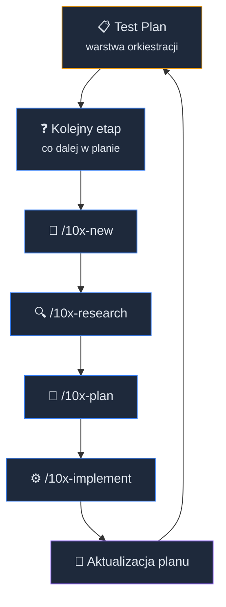
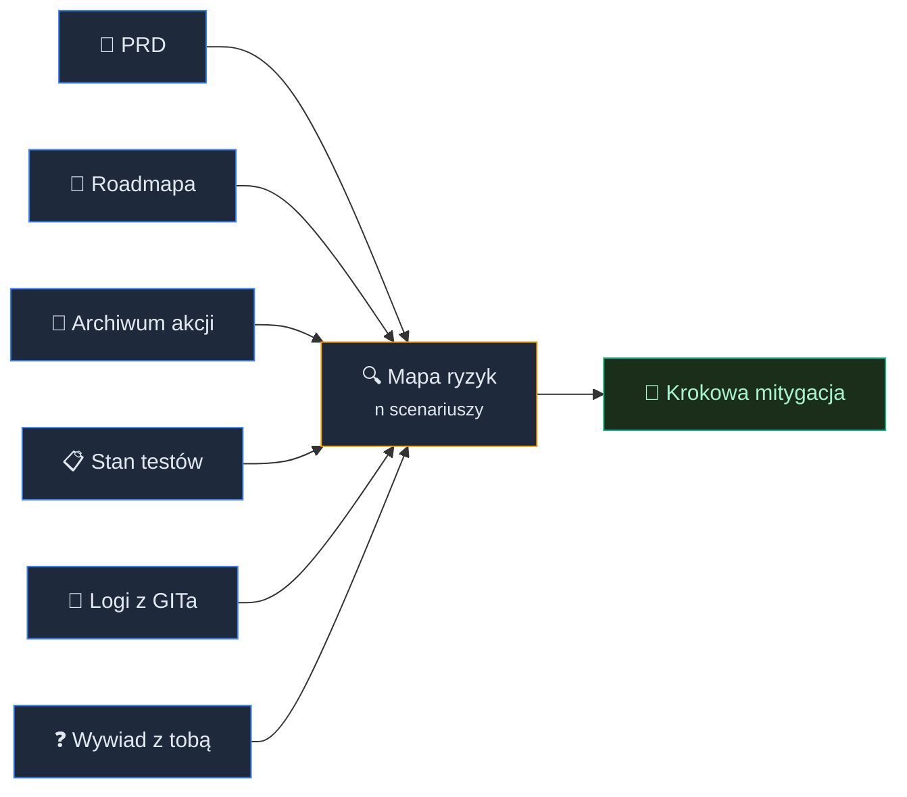

# Plan testów z AI


<!-- cdn: https://images.przeprogramowani.pl/lessons/m3-l1/assets/cover.jpg -->

W module drugim nauczyłeś się prowadzić agenta przez cały cykl zmiany: roadmapa, plan, implementacja, review i tak w kółko. Na końcu poprzedniej lekcji pojawiło się jednak niewygodne pytanie.

Dowozisz szybciej. Ale skąd wiesz, że to nadal działa?

To jest naturalny moment wejścia w moduł trzeci. Pierwszej lekcji nie zaczniemy jednak od `npx vitest`, konfiguracji testu jednostkowego ani od pierwszego `playwright test`. Najpierw potrzebujesz odpowiedzieć na pytanie, **co w twoim projekcie naprawdę musi być chronione**.

Bez tej decyzji agent bardzo chętnie napisze testy tam, gdzie jest najłatwiej. Helpery, gettery, formatery, funkcje utility. Coverage rośnie, CI świeci na zielono, a krytyczny flow użytkownika dalej nie ma żadnej ochrony.

Niby profesjonalnie, ale jednak trochę teatralnie.

W tej lekcji zbudujemy coś trwalszego niż pojedyncze testy. Zaczniemy od **test planu**, czyli klasycznej praktyki QA, która będzie strategicznym kierunkowskazem dla całego procesu zapewniania jakości w projekcie.

Ale uwaga - nie wymyślamy koła od nowa. Jeśli wiesz, co trzeba chronić i nie chcesz wprowadzać nowych wariacji w swoim workflow, znany ci z poprzedniego modułu cykl `research-plan-implement` w zupełności wystarczy.

Nowy skill wchodzi po prostu o warstwę wyżej, jakby do twojego zespołu dołączył wirtualny inżynier jakości. Pomaga ustalić **co** testować najpierw, **dlaczego** właśnie to i **w jakiej kolejności** dowieźć brakujące elementy.

## Test plan w epoce AI

Klasyczny plan testów kojarzy się z dokumentem, który powstaje obok pracy zespołu. Ktoś opisuje zakres, środowiska, typy testów, role i harmonogram. Z dobrym agentem ta sama strategiczna dokumentacja powstaje w kilka minut, w trakcie zwykłej sesji w terminalu.

Do tego służy `/10x-test-plan`.

To nowy skill, który tworzy i pielęgnuje `context/foundation/test-plan.md` - dokument, który łączy w sobie strategię testowania i bieżący stan jej wdrażania. Skill czyta go przy każdym uruchomieniu, sprawdza co już jest na dysku i podpowiada kolejny krok.

Małe zastrzeżenie na start: jeśli twój projekt to dopiero PRD i kilka notatek bez kodu, skill zatrzyma się z komunikatem, że trzeba wrócić po `/10x-shape` i `/10x-prd`. Test plan żywi się tym, co już istnieje w repo.

Teraz pobierz paczkę artefaktów dla tej lekcji:

```bash
npx @przeprogramowani/10x-cli@latest get m3l1
```

Ta paczka dostarcza workflow potrzebny w tej lekcji: `/10x-test-plan`.

### Bramki przed produkcją

W tym planie pojawi się też pojęcie **quality gates**, czyli bramek jakościowych. Koncepcyjnie to są punkty kontrolne, przez które zmiana musi przejść, zanim uznamy ją za gotową do kolejnego etapu pracy.

Taka bramka może być bardzo prosta: lint, typecheck, testy jednostkowe, test krytycznego flow, review w Pull Requeście, pre-commit albo check w CI. Chodzi o prostą zasadę - zmiana nie idzie dalej tylko dlatego, że agent skończył pisać kod i powiedział, że jest gotowe.

W programowaniu z AI to szczególnie ważne, bo agent potrafi bardzo szybko wygenerować dużo sensownie wyglądającego kodu. Szybkość jest zaletą, ale zwiększa też ryzyko, że ominiesz moment zastanowienia: czy ta zmiana pasuje do kontraktu projektu, czy nie psuje krytycznego scenariusza, czy nie przykrywa problemu ładnym diffem.

Bramki jakościowe celowo utrudniają bezpośrednią drogę z odpowiedzi agenta na produkcję. To mechanizm opóźniający zły odruch: "działa lokalnie, wygląda dobrze, shipujemy". Chcemy, żeby kod najpierw dostał sygnał z narzędzi, testów i review, a dopiero potem trafił do użytkowników.


<!-- rendered: ../../assets/diagrams-10x/lessons-m3-l1-lesson-draft-1-10x.png | cdn: https://images.przeprogramowani.pl/diagrams/lessons-m3-l1-lesson-draft-1-10x.png -->

Zwróć uwagę, że `/10x-test-plan` nie jest osobnym silnikiem do testów. To warstwa orkiestracji nad cyklem, który znasz już z modułu drugiego.

Skill można ponawiać na różnych etapach pracy. Wpisujesz `/10x-test-plan` po raz pierwszy, agent przeprowadza analizę, wywiad i generuje pierwszy plan. Sugeruje wdrożenie pierwszej zmiany przekierowując flow do klasycznego `/10x-new <change-id>`. Możesz wyczyścić sesję przez `/clear` lub wejść w nowy wątek przez UI, wrócić po dwóch dniach, ponownie wpisać `/10x-test-plan` i kontynuować. Agent znów patrzy na dysk, widzi że masz już `change.md` ale brak `research.md`, i mówi: "czas na `/10x-research`".

Nie musisz pamiętać, gdzie skończyłeś. Pliki są pamięcią rollout'u.

Praca naszego asystenta nie polega więc na jednej długiej sesji, w której agent wymyśla strategię, robi research, planuje, pisze testy i po drodze gubi połowę ustaleń. Mamy trwały dokument, małe sprawdzalne kroki i czysty kontekst przy każdym kolejnym etapie.

## Najpierw ryzyka

Najgorszy start pracy nad jakością brzmi tak:

```text
Write tests for this file.
```

Agent robi dokładnie to, o co prosisz. Szuka pliku, znajduje funkcje, dopisuje testy do widocznych ścieżek i często trafia tam, gdzie najprościej. Po godzinie masz kilkadziesiąt testów i wszystkie na zielono. Fałszywy spokój, a prawdziwe ryzyka mogą być zupełnie gdzie indziej.

Inne podejście? Zacznij od ryzyk i wrażliwych obszarów projektu z punktu widzenia wartości biznesowej.

`/10x-test-plan` zaczyna właśnie od nich, bazując na dokumentach kontekstowych:

- `context/foundation/prd.md` - użytkownik, flow, wymagania, non-goals,
- `context/foundation/roadmap.md` - stan zmian funkcjonalnych,
- `context/archive/*/plan.md` - stan archiwalnych inicjatyw,
- `context/foundation/tech-stack.md` - stack i ograniczenia,
- `AGENTS.md` albo `CLAUDE.md` - reguły pracy w repo,
- istniejącą konfigurację testów, jeśli projekt już ją ma.

Całość pokazuje pełniejszy obraz projektu i to, na co naprawdę warto uważać:


<!-- rendered: ../../assets/diagrams-10x/lessons-m3-l1-lesson-draft-2-10x.png | cdn: https://images.przeprogramowani.pl/diagrams/lessons-m3-l1-lesson-draft-2-10x.png -->

Historia GITa to jeden z mocniejszych sygnałów - zmiany koncentrują się tam, gdzie projekt nadal żyje. Zanim jednak skill ruszy ze skanem, zaproponuje ci zakres: "wykryłem `packages/api/src`, `packages/course-content/src`, wykluczyłem `dist`, `coverage`, fixtures. Akceptujesz czy dorzucić workspace, który przegapiłem?". Warto się tu zatrzymać. Skan rozciągnięty na lockfile albo snapshoty zatopi prawdziwy sygnał churnem, którego nikt nie pisze ręcznie.

Zwróć uwagę na ostatnie źródło danych.

Skill prowadzi z tobą krótki wywiad, w którym odkrywa, co naprawdę boisz się zepsuć, gdzie wcześniej się sparzyłeś, które miejsce zmieniasz bez pewności i na co nie chcesz marnować budżetu testowego. To nie jest miękki dodatek do "prawdziwej" analizy. Twoje doświadczenie często jest najlepszym sygnałem codziennego ryzyka.

Wywiad dostosuje się do twojego projektu. Pracujesz nad świeżym serwisem, gdzie nie ma jeszcze ani jednego testu? Agent pominie pytanie "co czujesz, że jest niedotestowane?" - bo odpowiedź "wszystko" niczego nie wnosi. Masz garść testów w jednej paczce, a reszta repo jest goła? Pytanie zmieni się na "gdzie jest największa dziura, która cię niepokoi?".

Ostatnie pytanie wywiadu brzmi inaczej niż reszta: "na co NIE chciałbyś, żeby poszedł budżet testowy?". Odpowiedź trafia do osobnej sekcji wykluczeń w planie. Wygląda na banał, ale za pół roku, gdy ktoś nowy w zespole zapyta "a może dorzucamy snapshoty stron marketingowych?", masz spisaną decyzję z powodem.

Efekt to mapa ryzyk - kilka scenariuszy ocenionych w dwóch wymiarach:

- **wpływ**, czyli jak bolesna jest awaria dla użytkownika i biznesu,
- **prawdopodobieństwo**, czyli jak realne jest, że ta awaria wystąpi.

Żeby ta ocena nie była loterią, warto trzymać się prostej skali. W zupełności wystarczy trójstopniowy podział - wysoki, średni, niski - z jednozdaniową definicją, do której zawsze można wrócić:

| Ocena | Wpływ | Prawdopodobieństwo |
|-------|-------|--------------------|
| **Wysoki** | użytkownik traci dostęp, dane albo pieniądze; awaria widoczna publicznie | obszar zmienia się co tydzień albo już się tu kiedyś przejechaliśmy |
| **Średni** | funkcja działa gorzej, istnieje obejście, skutek odczuwa część użytkowników | kod ruszany od czasu do czasu, bywał źródłem błędów |
| **Niski** | kosmetyka, łatwo cofnąć, brak skutku dla danych | kod stabilny, rzadko dotykany |

Priorytet to po prostu kombinacja obu osi. Najpierw chronisz scenariusze **wysoki wpływ × wysokie prawdopodobieństwo**, na końcu (albo wcale) te **niski × niski**. Najciekawsze są skrajności: awaria o ogromnym wpływie, ale znikomym prawdopodobieństwie (np. globalna awaria dostawcy chmury) zwykle nie jest wartym testem - taniej obsłużyć ją obserwowalnością i alertem niż scenariuszem testowym. Z kolei drobny, ale codzienny błąd potrafi zjeść więcej zaufania niż jedna spektakularna katastrofa raz na rok.

Skala jest celowo zgrubna. Nie chodzi o policzenie ryzyka z dokładnością do drugiego miejsca po przecinku, tylko o to, żeby dwie osoby patrzące na ten sam wiersz zgodziły się, czy to "góra" czy "dół" tabeli.

### Oś, o której łatwo zapomnieć: bezpieczeństwo

Wywiad i dokumenty świetnie wyłapują ryzyka funkcjonalne - "płacący użytkownik dostaje 403", "import gubi rekordy". Dużo trudniej samoistnie wypływają ryzyka, których nikt nie zgłasza jako funkcję, bo to scenariusze nadużycia, a nie zwykłego użycia.

Dlatego przy budowie mapy ryzyk dorzuć świadomie osobne pytanie: **co się stanie, gdy ktoś użyje tego wbrew intencji?** Kilka klas, które warto rozważyć niezależnie od tego, czy padły w wywiadzie:

- **Autoryzacja i dostęp** - czy użytkownik A dosięgnie zasobu użytkownika B przez podmianę identyfikatora w URL (IDOR)? Czy endpoint sprawdza nie tylko "czy jesteś zalogowany", ale i "czy *to* należy do ciebie"?
- **Wejście od użytkownika** - czy nieufne dane trafiają do zapytania, szablonu albo komendy bez walidacji (injection)? Czy serwer waliduje to samo co klient, czy ślepo ufa front-endowi?
- **Sekrety i dane wrażliwe** - czy klucz, token albo dane osobowe nie wyciekają do logów, treści błędu albo bundla front-endu?
- **Nadużycie zasobów** - czy ktoś może obejść rate-limit, zamówić kosztowną operację w pętli albo wysłać masowo magic-linki?

To nadal są scenariusze awarii, więc trafiają na tę samą mapę i podlegają tej samej skali wpływ × prawdopodobieństwo. Różnica jest taka, że agent rzadko zaproponuje je sam - "happy path" nie obejmuje atakującego. Jeśli twój projekt ma autoryzację, płatności albo przyjmuje cokolwiek od użytkownika, brak choćby jednego wiersza bezpieczeństwa na mapie ryzyk to zwykle nie znak, że jest bezpiecznie. To znak, że nikt o to nie zapytał.

## Sygnał, nie diagnoza

To najważniejsza granica nowego skilla.

`/10x-test-plan` czyta repozytorium dla wskazówek, a nie dla potwierdzenia konkretnego zagrożenia. Może powiedzieć: "ten obszar często się zmieniał", "PRD mówi, że ten flow jest krytyczny", "użytkownik boi się regresji w auth", "projekt ma zbyt mało testów".

Nie powinien mówić: "błąd znajduje się w `src/auth/session.ts:42`".

Co więcej - nie pozwoli (zwykle) na to nawet wtedy, gdy się prosisz. Wpisz ryzyko w stylu "brak retry w `session.ts`" i dostaniesz w odpowiedzi "to opisuje implementację, nie scenariusz awarii. Przeformułuj na to, co faktycznie poczuje użytkownik". Nazwa pliku w kolumnie źródła też zniknie - zostanie zastąpiona tym, co naprawdę podniosło ryzyko: numerem pytania z wywiadu, linią z PRD albo katalogiem z największym churnem.

Na konkrety w kodzie patrzy dopiero `/10x-research`, już w konkretnej fazie rollout'u planu. Research prześledzi realny kod, znajdzie wejścia użytkownika, granice API, walidację i najtańszą warstwę testu, która złapie daną awarię. Inaczej agent udaje wiedzę, której nie ma.

Właśnie dlatego nie musimy wymyślać nowej metody implementacji testów. Kiedy już wiesz, które ryzyko jest ważne, normalny cykl działa bardzo dobrze:

1. `/10x-research` sprawdza, gdzie ryzyko naprawdę występuje
2. `/10x-plan` zamienia research w małe fazy pracy.
3. `/10x-implement` dowozi jedną fazę naraz.
4. Ostatnia faza aktualizuje `test-plan.md`, jak od teraz dodawać podobne testy.

`/10x-test-plan` nie zastępuje researchu, planowania ani implementacji. Ustawia im kolejność i pilnuje, żeby nie zaczynały od wygodnego pliku, tylko od ważnego ryzyka.

Czasem zresztą research okazuje się mądrzejszy od planu i to też jest OK. Gdy `/10x-research` skończy analizę kodu i odkryje, że awaria mieszka w innym katalogu niż wskazywał hot-spot, przy kolejnym uruchomieniu `/10x-test-plan` zapyta cię: "research wskazał poprawkę do §2, dopisać teraz czy zostawić do następnej rewizji?". Plan może przyjąć korektę z warstwy, która zna kod lepiej.

Zobacz teraz jak wygląda cała koncepcja posługiwania się tym skillem:

<div style="padding:56.25% 0 0 0;position:relative;"><iframe src="https://player.vimeo.com/video/1195983726?badge=0&amp;autopause=0&amp;player_id=0&amp;app_id=58479" frameborder="0" allow="autoplay; fullscreen; picture-in-picture; clipboard-write; encrypted-media; web-share" referrerpolicy="strict-origin-when-cross-origin" style="position:absolute;top:0;left:0;width:100%;height:100%;" title="m3-l1"></iframe></div><script src="https://player.vimeo.com/api/player.js"></script>


## Zielony test, który niczego nie chroni

Jest jedna pułapka, w którą agent piszący testy wpada wyjątkowo łatwo, a która potrafi zniweczyć cały wysiłek włożony w mapę ryzyk. Warto ją znać, zanim zaczniesz dowozić pierwszą fazę (tym zajmiemy się w kolejnej lekcji).

Wyobraź sobie, że prosisz agenta o test do funkcji liczącej rabat. Agent czyta kod, widzi, że funkcja zwraca `0.15`, i pisze:

```text
expect(calculateDiscount(order)).toBe(0.15)
```

Test przechodzi. CI świeci na zielono. Tylko że ten test nie sprawdza, czy rabat jest *poprawny* - sprawdza, czy kod robi to, co już robi. Jeśli w funkcji siedzi błąd, test właśnie ten błąd zabetonował. Od teraz każda próba naprawy będzie "psuła test", choć to test jest zły.

To jest **problem wyroczni** (oracle problem): żeby napisać sensowny test, musisz znać oczekiwany wynik z *niezależnego* źródła - z wymagań, kontraktu, specyfikacji, zdrowego rozsądku - a nie z samej implementacji, którą testujesz. Człowiek pisząc test sięga po tę wiedzę z głowy. Agent domyślnie ma pod ręką głównie kod i bardzo chętnie uznaje go za wyrocznię.

To najważniejsze ryzyko całego pomysłu "niech AI pisze testy". Test, który odbija implementację, jest gorszy niż brak testu - daje fałszywe poczucie ochrony i utrudnia późniejsze poprawki.

Jak się przed tym bronić:

- **Daj agentowi przestrzeń do interpretacji założeń.** Zamiast "napisz testy do tej funkcji" powiedz "rabat to 10% powyżej 200 zł i 15% powyżej 500 zł - napisz testy na te progi". Oczekiwany wynik pochodzi wtedy od ciebie, a nie z kodu.
- **Czytaj asercje, nie tylko pasek pokrycia.** Przy przeglądaniu wygenerowanego testu pytaj o każdą asercję: "skąd wzięła się ta wartość?". Jeśli odpowiedź brzmi "bo tyle zwraca funkcja", to nie jest test.
- **Sprawdź, czy test potrafi zawieść.** Zepsuj na chwilę kod produkcyjny i zobacz, czy test się wywala. Jeśli dalej jest zielony, asercja niczego nie pilnuje. Tę intuicję rozwiniemy w kolejnej lekcji.
- **Uważaj na pracę pod presją zielonego.** Gdy każesz agentowi "popraw, aż testy przejdą", najprostszą drogą bywa dopasowanie testu do kodu, a nie kodu do wymagań. Pilnuj kierunku.

`/10x-test-plan` ustawia tę obronę systemowo. Mapa ryzyk opisuje *zachowanie*, które ma być chronione ("płacący użytkownik widzi swoją treść"), a nie "funkcja X zwraca Y". Dzięki temu, gdy w fazie planu i implementacji agent pisze już konkretny test, dostaje wyrocznię z poziomu wartości dla użytkownika - a nie z linijki kodu, którą akurat ogląda.

## Cookbook zamiast pamięci w głowie

`test-plan.md` ma jeszcze jedną cechę, która z czasem zaczyna się sama spłacać.

Dokument rośnie wraz z realizacją kolejnych faz. Każda zakończona faza dopisuje do niego konkretne przepisy - gdzie trzymać testy, jak je nazywać, na jakich wzorcach się oprzeć. To jak osobisty notatnik tego, czego agent uczy się po drodze.

Mowa o sekcji `## 6. Cookbook Patterns` , która na początku nie jest wypełniona żadnymi szczegółami:

```text
TBD — see §3 Phase 1.
```

Ale bez obaw - to jest celowe. Skill nie powinien udawać, że zna lokalne wzorce testów, zanim research i implementacja pokażą, jak projekt naprawdę działa.

Jeśli przejdziesz `/10x-test-plan` do końca, ostatni krok każdej fazy ma zaktualizować cookbook. Po zakończeniu pierwszej fazy nasz TBD zamienia się w coś takiego:

```text
### 6.2 Adding an integration test

- Lokalizacja: packages/api/test/integration/
- Polityka mockowania: tylko na granicy sieci (MSW), nigdy modułów wewnętrznych
- Referencyjny test: packages/api/test/integration/auth.test.ts
- Komenda lokalna: npm run test:integration
```

Następny agent - twój albo z zespołu - nie musi już zgadywać, gdzie idą testy integracyjne w tym konkretnym projekcie. Otwiera cookbook i ma wzorzec, ścieżkę i komendę.

To jest moment, w którym plan testów przestaje być abstrakcyjny. Staje się instrukcją dla kolejnych agentów i dla ciebie z przyszłości.

Bez cookbooka każda nowa zmiana zaczyna się od zgadywania lokalnej kultury testów.

## Powroty do test-planu nie bolą

Realizacja planu testów może wymagać wielokrotnego czyszczenia sesji, przechodzenia przez cykl researchu, planowania i wielofazowej implementacji. Jak nie zgubić z oczu postępów w zakresie QA?

Wpisz `/10x-test-plan --status`. Zamiast pracy dostaniesz krótką tabelę: która faza jest zamknięta, która w toku, jaka jest następna komenda do uruchomienia. Tyle, ile potrzebujesz, żeby wrócić po dwóch tygodniach i nie zaczynać od czytania historii czatu.

Plan z czasem się też zestarzeje. Stack się zmienia, narzędzia AI dostają nowe wersje, zespół orientuje się, że któreś ryzyko już nie jest problemem albo że pojawiło się nowe. Wtedy `/10x-test-plan --refresh` otworzy świeżą rundę analizy potrzeb. Zmiany przechodzą przez ten sam cykl co pierwszy rollout, więc masz audyt tego, co i kiedy się zmieniło.

## Artefakty po tej lekcji

Po tej lekcji w repo powinien istnieć `context/foundation/test-plan.md`, który odpowiada na kilka pytań (w zależności od projektu, niektóre elementy mogą być puste lub pojawić się nieco później):

1. Jakie ryzyka dotyczące projektu są najbardziej istotne?
2. Z jakich źródeł wiemy, że to są ryzyka?
3. Jaki jest profil istniejących testów?
4. Jakie fazy procesu QA zaadresują ryzyka?
5. Które typy testów będą przydatne w tym projekcie?
6. Jak praca z agentem może dodatkowo podnieść jakość?
7. Jak wygląda cookbook rozwijania istniejących testów?

To jest kontrakt wejściowy dla całego modułu trzeciego. Kolejne lekcje nie startują od "napiszmy trochę testów" - startują od konkretnej fazy rollout'u, researchu i planu.

## 🧑🏻‍💻 Zadania praktyczne

### Uruchom pierwszy test-plan

Uruchom `/10x-test-plan` w repo swojego projektu.

Po ukończeniu pierwszego przebiegu przejrzyj akcje agenta:

1. Czy źródła kontekstu zostały poprawnie sklasyfikowane?
2. Czy bazowy stan testów brzmi uczciwie (greenfield to zwykle po prostu brak testów)?
3. Czy historia GITa okazała się użyteczna?

Jeśli coś się nie zgadza, popraw to teraz, wprost wskazując agentowi co przeoczył lub nadinterpretował. Błędny zakres na starcie popsuje priorytety całego rollout'u.

### Uzyskaj mapę ryzyk

Po wstępnej analizie, skill wygeneruje mapę ryzyk. Sprawdź kilka elementów:

1. Czy te ryzyka są naprawdę istotne dla twojego projektu, a nie opisują nieprawdopodobnych scenariuszy (np. zamknięcie firmy GitHub)?
2. Które dokumenty źródłowe najmocniej przełożyły się na finalny kształt całej mapy ryzyk?
3. Czy opis ryzyk nie skupia się przesadnie na implementacji i opisywaniu kodu niskopoziomowo?
4. Czy zgadzasz się z oceną wpływu i prawdopodobieństwa? Jeśli nie - zasugeruj agentowi niezbędne korekty.
5. Czy na mapie jest choć jeden scenariusz nadużycia (dostęp, wejście użytkownika, sekrety, rate-limit), jeśli projekt ma autoryzację lub płatności?

Pamiętaj - jeśli agent pominął krytyczną ścieżkę, dopisz ją ręcznie albo poproś o ponowną ocenę. Jeśli wiersz brzmi jak "brak testów dla modułu X", przerób go na scenariusz awarii użytkownika.

Nie przechodź dalej tylko dlatego, że tabela wygląda elegancko.

### Sprawdź dopasowanie do projektu

W `context/foundation/test-plan.md` znajdź sekcje `Stack` i `Quality Gates`. Przeanalizuj, czy test plan w akceptowalny sposób opisuje realia pracy w tym projekcie:

- czy proponowane typy testów są dobrze zmapowane na ryzyka
- czy wykorzystywanie AI wpłynie pozytywnie na jakość
- czy bramki jakości (hooki, triggery) nie są nadmiarowe

To nie konkurs na największą liczbę nowoczesnych narzędzi - utworzony plan musi być dla ciebie zrozumiały i nie powodować obciążeń przy dalszej pracy. Po czasie możesz go edytować i korygować początkowe założenia.

## Odbierz swoją odznakę

Po ukończeniu tej lekcji odbierz odznakę w sekcji [10xDevs Mission Log](https://platforma.przeprogramowani.pl/10xdevs-3/mission-log) a następnie pochwal się swoim osiągnięciem!

## 🔎 Deep Dive

Ta sekcja zawiera dodatkowe pogłębienie wiedzy na temat wybranych zagadnień związanych z lekcją. W tym Deep Dive znajdziesz:

- **Testowanie oparte na ryzyku, bez AI** — skąd bierze się zasada impact × likelihood i dlaczego nie wymyśliliśmy jej na potrzeby agentów.
- **Sygnał kontra wiedza** — dlaczego `test-plan.md` nie powinien wskazywać konkretnych linii w kodzie i czemu `/10x-research` jest osobną fazą.

Ta sekcja lekcji nie jest obowiązkowa, ale warto się z nią zapoznać jeżeli chcesz zostać ekspertem.

### Testowanie oparte na ryzyku, bez AI

Priorytetyzacja oparta na ryzyku nie jest pomysłem z ery LLM-ów. W klasycznym QA od dawna istnieje pojęcie *risk-based testing*: najpierw chronisz obszary o największej kombinacji wpływu i prawdopodobieństwa awarii.

AI zmienia sposób operacjonalizacji tej reguły, a nie samą zasadę.

Wcześniej mapę ryzyk przygotowywał człowiek, tester albo zespół. Teraz agent może szybciej przeczytać PRD, roadmapę i archiwum zmian, a potem zaproponować kandydatów. Nadal jednak potrzebuje twojej korekty, bo nie zna pełnego kontekstu biznesowego.

Największa korzyść z AI nie polega więc na "wygenerowaniu listy testów". Polega na tym, że szybciej przejdziesz od artefaktów projektowych do rozmowy o realnych scenariuszach awarii.

To szczególnie ważne dla solo developera. Nie masz osobnego zespołu QA, więc musisz priorytetyzować. Mapa ryzyk jest twoim mechanizmem segregacji.

### Sygnał kontra wiedza

W starym podejściu do testowania agent bardzo łatwo mieszał dwa poziomy pracy - analizę biznesową i skupienie na konkretnych przyczynach technicznych:

- "ten obszar wygląda ryzykownie",
- "ten konkretny plik jest miejscem awarii".

Pierwsze może wynikać z PRD, roadmapy, historii gita albo twojej obawy. Drugie wymaga researchu w kodzie. Jedno wcale nie musi wynikać z drugiego.

`/10x-test-plan` celowo trzyma mapę ryzyk na poziomie sygnałów. Dzięki temu nie zamyka researchu w fałszywej hipotezie. Jeśli skan najczęściej zmienianych miejsc pokazuje `src/lib/`, to jest informacja o częstej zmianie. Nie dowód, że awaria mieszka w `src/lib/something.ts`.

To rozróżnienie oszczędza czas w kolejnych fazach. `/10x-research` może wtedy zrobić swoją robotę: prześledzić przepływ danych, sprawdzić istniejące testy, znaleźć realną granicę systemu i zaproponować najtańszy test. Jeśli odkryje, że ryzyko było źle sformułowane, plan można poprawić zamiast brnąć w testowanie fikcyjnego problemu.

Dobry test-plan nie udaje eksperta od kodu. Jest dobrym zleceniem dla researchu.

## 📚 Materiały dodatkowe

Nie musisz czytać tych materiałów przed wykonaniem ćwiczeń. Są tu po to, żeby pogłębić decyzje z planu i odświeżyć narzędzia.

- [ISTQB: Risk-Based Testing](https://glossary.istqb.org/en_US/term/risk-based-testing) — klasyczne źródło dla pojęcia testowania opartego na ryzyku; przydatne jako kotwica dla impact × likelihood.
- [Repomix](https://repomix.com/) — narzędzie do pakowania repo jako briefu dla LLM-a.
- [GitIngest](https://gitingest.com/) — lekka ścieżka do przygotowania repo jako tekstowego kontekstu.
- Prework [1.3] *Jak uczyć się i rozwijać z AI* — przypomnienie, dlaczego nie akceptujemy mapy ryzyk bez obrony decyzji.
- Prework [3.2] *Wzorce i antywzorce promptowania* — prompt jako kontrakt oraz hierarchia instrukcji, na której bazuje trwały plan jakości.
- Prework [3.3] *Cykl życia wątku i zarządzanie kontekstem* — strategia Write/Select/Compress/Isolate jako fundament pracy z handoffami i świeżymi sesjami.
