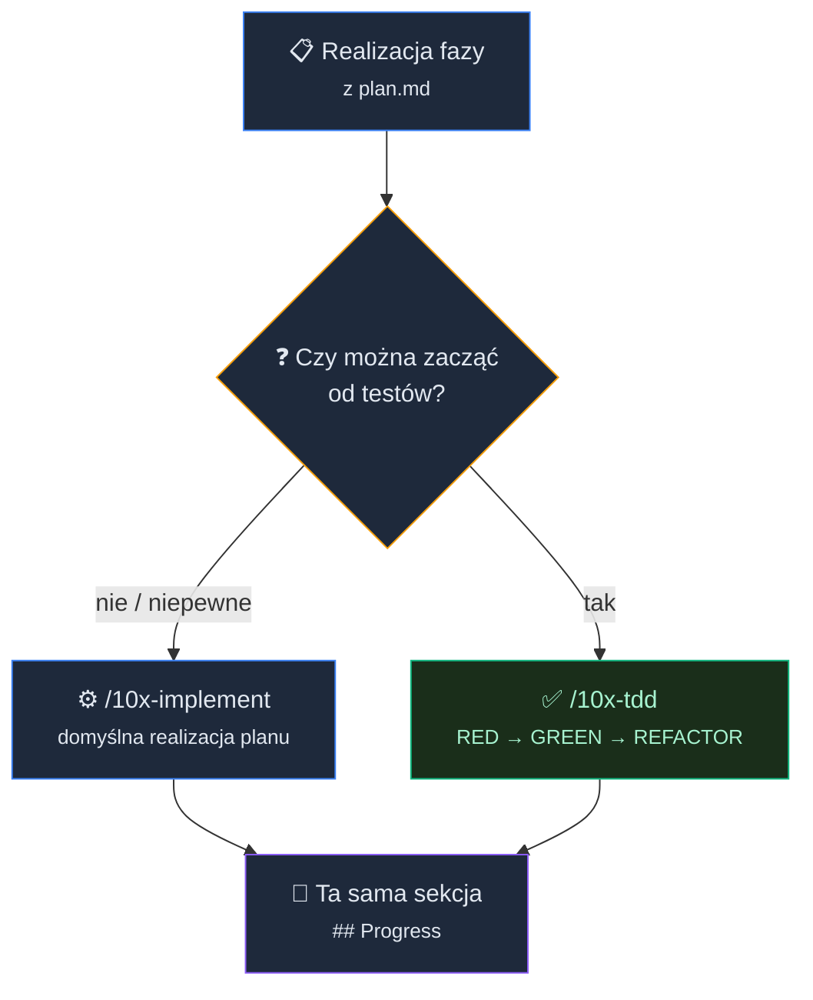
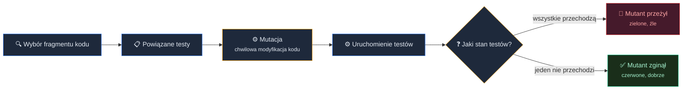

# Od planu do wdrożenia: implementacja pierwszych testów z Agentem


<!-- cdn: https://images.przeprogramowani.pl/lessons/m3-l2/assets/cover.jpg -->

Zanim napiszesz pierwszy test z agentem, warto być świadomym jednej rzeczy: pisanie testów to akurat ten obszar pracy z AI, w którym najłatwiej dać się oszukać.

Start zawsze wygląda świetnie. Prosisz model o testy do wybranych funkcji, dostajesz nową porcję kodu, zielony raport, no i coverage, który skacze w górę. Łatwo uwierzyć, że to działa.

Problem w tym, że testowanie prostych funkcji na sztucznych przykładach nie pomaga realnie zarządzać ryzykiem w projekcie. Do tego, skuteczność agentów w pisaniu testów wyraźnie się pogarsza, jeśli twoje funkcje nie są tak typowe jak te, które modele widziały w danych treningowych.

Pierwszy z brzegu przykład. W pracy *Benchmarking LLMs for Unit Test Generation from Real-World Functions* (Huang i in., *ACM TOSEM* 2026) badacze najpierw zmierzyli jakość generowanych testów na popularnym benchmarku TestEval - i wyszło świetnie. Potem podmienili proste funkcje na realne, złożone przypadki z prawdziwych projektów i powtórzyli pomiar. Pokrycie spadło mniej więcej o połowę: z ~92% do ~45% linii i z ~82% do ~30% gałęzi.

To powtarza się w wielu innych obszarach programowania z AI - wynik z benchmarku nie przenosi się automatycznie na twój projekt.

Dlaczego tak się dzieje? Bo najtrudniejsza część testu to nie wygenerowanie kodu, tylko decyzja o tym, jaki test realnie wpłynie na jakość całego projektu. To poznany w poprzedniej lekcji **problem wyroczni** (*oracle problem*) - i to w nim, a nie w składni, siedzi większość błędów w testach pisanych przez LLM-y.

W m3-l1 zobaczyłeś go na funkcji liczącej rabat, gdzie agent brał oczekiwany wynik wprost z implementacji. Teraz ta sama pułapka na realnej funkcji - takiej z aplikacji do fiszek, która wylicza odstęp do kolejnej powtórki karty:

```ts
  // grade: 0 = nie pamiętam, 1 = słabo, 2 = dobrze
function getNextInterval(prevInterval: number, grade: number): number {
  return prevInterval * grade;
}
```

Na pierwszy rzut oka widać jedno: wynik to `prevInterval * grade`. Model napisze więc asercję wprost na tym wzorze - `getNextInterval(10, 2)` ma zwrócić `20`. Test przejdzie na zielono.

Czego w kodzie nie widać? Reguły biznesowej i buga. Kiedy uczeń nie pamięta karty (`grade` równy 0), odstęp powinien zresetować się do jednego dnia - a nie spaść do zera, bo zero oznacza kartę, która już nigdy nie wróci do nauki. Funkcja ma tu błąd, ale model go nie zobaczy: zobaczy tylko, że dla `grade` równego 0 wychodzi `0`, i taką asercję zapisze.

Model odwzorował to, co kod *robi*. Tego, co kod *powinien robić*, nie dało się wyczytać z samej implementacji - a to właśnie ono jest sednem testu.

Stąd dwa wnioski, na których stoi cała ta lekcja:

- **Duży wskaźnik pokrycia testami nie jest dowodem ochrony.** Badania konsekwentnie pokazują, że pokrycie kodu słabo koreluje z realnym wykrywaniem błędów. Zielony pasek mówi tylko, że linia się wykonała - nie, że asercja miała jakikolwiek sens.
- **Naiwne promptowanie to za mało.** Testy, które faktycznie chronią kod, wynikają z analizy ryzyk, właściwego kontekstu i starannej dbałości o ich optymalną liczbę. Ani za mało, ani za dużo.

Na szczęście mamy już dobre fundamenty. W poprzedniej lekcji uzyskaliśmy Test Plan - to kontrakt jakościowy projektu, który zawiera mapę ryzyk, opisuje fazowe wdrażanie usprawnień i porządkuje cykl `/10x-new` → `/10x-research` → `/10x-plan` → `/10x-implement`, którym realizujemy zmiany. To był ważny krok, choć sama mapa to dopiero początek.

## Vibe Testing, czyli jak nie wprowadzać testów

Naiwne podejście do testowania może na początku współpracy z agentami wyglądać tak:

```text
Write tests for the auth module.
```

Problem polega na tym, że takie testy często sprawdzają kształt aktualnej implementacji, a nie zachowanie istotne dla użytkownika, które wynika choćby z dokumentacji.

Zobacz uproszczony przykład:

```ts
it("authenticates user", async () => {
  const result = await authenticate(input);

  expect(result).toEqual(await authenticate(input));
});
```

To wygląda jak test, ale nie chroni prawie niczego. Asercja pyta funkcję, co zwróciła, a potem sprawdza, czy zwróciła to, co zwróciła.

W praktyce testy generowane przez najlepsze modele AI są zwykle mniej karykaturalne, ale mechanizm pozostaje ten sam. Można to opisać na trzech klasach problemów:

| Antywzorzec | Jak wygląda | Co powinno się wydarzyć |
|---|---|---|
| Mirror implementacji | Test sprawdza wywołanie wewnętrzne, prywatny szczegół albo wynik wyliczony tą samą logiką co cały moduł. | Test opisuje obserwowalne zachowanie i oczekiwany wynik scenariusza biznesowego. |
| Happy paths | Agent tworzy łatwe testy na poprawnych danych. | Pojawia się przynajmniej jeden edge case wynikający z ryzyka. |
| Brak przypadków brzegowych | Brakuje testu z `null`em, pustymi danymi, błędem środowiska albo niezgodnością bibliotek. | Test łapie przypadek, który realnie mógłby uszkodzić doświadczenie użytkownika. |

Stąd dwa konkretne wymagania wobec całego procesu: daj agentowi **konkretne wejście (opis, dane lub scenariusz) związane z ryzykiem** (inaczej test nie dotknie groźnej ścieżki) i **osobno zweryfikuj asercję** (bo to ona jest najczęstszym słabym punktem).

## Jak Test Plan rozbraja te pułapki

Nasz `context/foundation/test-plan.md` i łańcuch `/10x-new` → `/10x-research` → `/10x-plan` → `/10x-implement`, powstał właśnie po to, żeby rozbroić każdą z tych pułapek, zanim agent napisze pierwszą asercję. Przejdźmy je po kolei.

**"Agent wygeneruje testy do każdego pliku" → ryzyko zamiast pliku.** Test Plan to nie lista plików do pokrycia, tylko mapa ryzyk. Sekcja z ryzykami mówi, jaki scenariusz biznesowy nie może się zepsuć i dlaczego - z oszacowaniem wpływu, prawdopodobieństwa i źródła. Decyzja "co testować" jest więc już podjęta, i to na podstawie tego, co realnie boli, a nie tego, co najłatwiej wygenerować.

**Problem wyroczni → research i opis oczekiwanego zachowania.** Pamiętasz, że z samej implementacji nie dało się wyczytać, co kod *powinien* robić? Plan to uzupełnia. Przy każdym ryzyku trzyma nie tylko opis zagrożenia, ale też to, jakie zachowanie udowodniłoby ochronę (to jest twoja wyrocznia) i jakie wygodne założenie agent ma zakwestionować - na przykład „udane logowanie nie znaczy od razu, że użytkownik właściwą treść strony".

**Coverage jako dowód → zasada cost × signal.** Plan stoi na jednej regule: dla każdego ryzyka szukamy najtańszego testu, który daje realny sygnał. Nie promujemy skoków do e2e, bo „tak jest bezpieczniej", i nie gonimy procentu pokrycia. Coverage przestaje być celem - celem jest sygnał dla konkretnego ryzyka. Czym ten sygnał różni się od samego pokrycia, pokażemy dalej.

**Trzy antywzorce → zabezpieczenie wbudowane w handoff.** Kiedy faza trafia do `/10x-plan`, handoff z góry sugeruje, żeby każdy testowy etap określał: jakie zachowanie asercjonuje, jaką regresję łapie, skąd bierze kontekst z `research.md`, jaki ma co najmniej jeden przypadek brzegowy i jakiego antywzorca unika.

> Zwracaj uwagę na sugerowane parametry każdego ze skilli 10x-research i 10x-plan - praca ze skillem 10x-test-plan pozwoli ci je wykorzystać w najbardziej efektywny sposób.

## Case study: od ryzyka do testów integracyjnych

Żeby to nie zostało teorią, prześledźmy jeden realny przebieg zabezpieczania istniejącego kodu na podstawie ryzyka z `context/foundation/test-plan.md`. Przykładem będzie 10xCards, czyli aplikacja do fiszek.

Kiedy użytkownik przejrzy wygenerowane karty i część z nich zaakceptuje, operacja zapisu (`save`) promuje zaakceptowane drafty do prawdziwej talii. Bierzemy więc na warsztat ryzyko, że ten zapis uszkodzi talię.

Zaczynamy od `context/foundation/test-plan.md`, a kończymy na działających testach, tym razem głównie integracyjnych. To dokładnie ta sama pętla, którą możesz wykonać w swoich zadaniach.

### Punkt startowy: jedno ryzyko, zero testów na ścieżce zapisu

Skupimy się na jednym z ryzyk dotyczących zapisów danych, które nie było pokryte żadnym testem:

- **Ryzyko #2** - zapis sesji uszkadza talię: drafty w stanie `pending`/`rejected` trafiają do talii razem z zaakceptowanymi albo częściowy zapis przy błędzie zostawia talię w niespójnym stanie. Kontrakt biznesowy jest prosty: tylko zaakceptowane karty mogą trafić do talii.

Cała ścieżka zapisu - funkcja `saveSession()` w `src/lib/save-session.ts`, endpoint zapisu oraz sąsiednie endpointy draftów i fiszek - miała na starcie **zero testów**. Projekt miał już hermetyczny zestaw testów z wcześniejszej fazy, ale ani jednego testu dotykającego prawdziwej bazy danych.

### Co odkrył research

Zanim padł pierwszy prompt o test, ruszył `/10x-research`. I znowu pojawił się najważniejszy zwrot całego przebiegu: **research zmienił cel zadania**, choć inaczej niż można by się spodziewać.

Okazało się, że jedno ryzyko ma dwie zupełnie różne twarze:

- **„pending/rejected zostają promowane”** to w praktyce ścieżka dobrze zabezpieczona. Zapis filtruje drafty przez `.eq("state","accepted")`, a dane wysyłane do bazy powstają wyłącznie z tego przefiltrowanego zbioru. Sama baza pilnuje stanów przez CHECK constraint. Żeby to popsuć, ktoś musiałby zmienić sam filtr. To nie jest ukryty bug, tylko inwariant do obrony.
- **„częściowy commit przy błędzie”** to ryzyko realne i nietestowane. Tu research odkrył rzecz kluczową: zapis jest **nieatomowy**. `saveSession()` wykonuje po kolei trzy niezależne operacje Supabase: upsert do `flashcards`, upsert do `review_states`, a potem delete z `flashcard_drafts`. Klient Supabase JS nie opakuje tego za nas w jedną transakcję. Błąd w środku sekwencji zostawia stan częściowy.

I jeszcze jeden niewygodny szczegół: te częściowe awarie *nie* są dziś naprawiane. Gdy padnie commit `review_states`, funkcja loguje `orphan_review_state` i mimo to zwraca `ok: true`. Gdy padnie delete draftów, loguje `orphan_drafts` i też zwraca `ok: true`. Nie ma rollbacku.

To zmieniło zadanie w sposób, który łatwo przeoczyć: **nie piszemy testu na rollback, którego nie ma.** Decyzja, czy uszczelnić zapis przez jedną transakcję (np. Postgres RPC), jest decyzją produktową. Research wynotował ją jako otwarte ryzyko, ale nie udawał, że w kodzie istnieje ochrona, której tam nie ma.

Zadanie fazy było więc inne: udowodnić reguły, które już są zabezpieczone, i przypiąć obecny, świadomie tolerowany kontrakt częściowych awarii. Dzięki temu przyszła zmiana nie popsuje go po cichu.

Research dobrał też strategię testów - i tu pojawił się podział na dwie warstwy, każda dobrana po najtańszym sygnale:

- **Testy integracyjne na lokalnym Supabase** - dla reguł, których uczciwie nie da się zasymulować mockiem: tylko zaakceptowane drafty trafiają do `flashcards`, powstaje dokładnie jeden wiersz `review_states` na promowaną kartę, po zapisie znikają wszystkie drafty sesji, a drugi zapis jest idempotentny (unikalny constraint nie tworzy duplikatów). To wymagało nowej infrastruktury: klienta z kluczem service-role, świeżego konta i świeżej sesji dla każdego testu. Klucz service-role omija RLS, ale w tym scenariuszu to akceptowalne, bo `saveSession` i tak filtruje po jawnym `accountId`.
- **Hermetyczne testy ze stubem klienta** - dla częściowych awarii, których prawdziwej bazy nie da się łatwo zmusić do błędu w środku sekwencji. Konfigurowalny stub klienta pozwala sprawić, że konkretna operacja zwróci błąd, a reszta przejdzie. Wtedy asercja przypina zachowanie: „padł `review_states` → log `orphan_review_state` i `ok: true`".

Na koniec research wyprodukował mapę „najtańszy test, który łapie dany kawałek ryzyka" - jeszcze przed pierwszym promptem.

### Od researchu do planu

Wdrożenie testów przeszło z fazy researchu do fazy planowania. Skill `10x-plan` rozbił pracę na cztery fazy, ułożone w świadomej kolejności - według zależności:

| Faza | Co dostarcza | Dlaczego tu |
|---|---|---|
| 2.1 Środowisko integracyjne + reguła promocji | nowy zestaw pomocników dla lokalnego Supabase + test „tylko accepted promuje” | bez tego nie da się pisać reszty testów integracyjnych |
| 2.2 Pozostałe reguły DB | parowanie `review_states`, czyszczenie draftów, idempotencja | korzysta ze środowiska z 2.1 |
| 2.3 Hermetyczne stuby + endpoint | gałęzie częściowych zapisów, wczesne zakończenia, mapowanie statusów HTTP | nie wymaga bazy, ląduje w domyślnym `npm test` |
| 2.4 Cookbook + korekta bramki | wypełnione wzorce w `test-plan.md`, bramka integracyjna oznaczona jako ad hoc | trwały transfer wiedzy do kolejnych faz |

Kolejność odpowiadała realnym zależnościom w projekcie. Najpierw trzeba było zbudować brakujące środowisko integracyjne i od razu sprawdzić nim najważniejszą regułę, żeby Faza 2.1 dawała dowód, a nie samo rusztowanie. Dopiero potem miały sens kolejne reguły bazodanowe, tanie testy hermetyczne bez bazy i utrwalenie wzorców dla następnych faz.

> Uwaga - po wprowadzeniu środowiska do testów, warto zaktualizować AGENTS.md / CLAUDE.md opisująć jak testujemy kod w tym projekcie.

### Gdzie to się zgadza z dobrymi zasadami testowania

Wdrażając testy w oparciu o mapę ryzyk, zadbaliśmy o kilka dobrych praktyk testowania:

- **Ryzyko, nie plik.** Punktem wyjścia było Ryzyko #2 z mapy, a nie „pokryjmy `save-session.ts`”. Co więcej, research rozbił to ryzyko na część już dobrze zabezpieczoną i część realnie niepokrytą. Testy poszły tam, gdzie naprawdę bolało.
- **Wyrocznia z researchu, nie z implementacji.** Tego, że zapis jest nieatomowy i że częściowe awarie kończą się `ok: true`, nie dało się zgadnąć z samego kształtu funkcji. Ocena brzmiała: pełna promocja albo policzalny, zalogowany stan częściowy - nigdy cicha korupcja talii.
- **Uczciwy kontrakt zamiast wymarzonego.** Nie napisaliśmy testu na rollback, bo rollbacku nie ma. Przypięliśmy obecne zachowanie i wynotowaliśmy odwołanie do RPC jako otwarte ryzyko produktowe. Test pilnuje tego, co kod *robi dziś*, i złapie moment, w którym ktoś zmieni to bez świadomej decyzji.
- **Cost × signal zamiast pogoni za coverage.** Integracja na lokalnym Supabase pojawiła się tylko tam, gdzie mock by skłamał: unikalny constraint, kaskady, realny SQL. Klient z kluczem serwisowym zastąpił logowanie użytkownika, bo autoryzacja przez RLS byłaby osobną fazą. Stub klienta obsłużył awarie, których prawdziwa baza nie wywoła w prosty sposób. Bramka integracyjna została ad hoc, nie na każdy commit, żeby nie zmuszać projektu do uruchamiania Supabase przy każdej drobnej zmianie.
- **Asercja behawioralna.** Reguła „tylko accepted promuje” nie sprawdza, jak zbudowano zapytanie. Test seeduje mieszany zestaw draftów (`accepted` + `pending` + `rejected`) i sprawdza obserwowalny skutek: w `flashcards` lądują wyłącznie zaakceptowane karty, a po zapisie znika *każdy* draft sesji. Taki test łapie regresję, której jeszcze nie ma: poluzowany filtr stanu albo zawężony delete.
- **Weryfikacja asercji przez celowe psucie.** Każda faza ma krok manualny w stylu „odwróć wynik jednej gałęzi `saveSession` i sprawdź, czy pada dokładnie ten jeden test endpointu” albo „zawęź delete draftów i sprawdź, czy asercja »wszystkie drafty znikają« faktycznie spada”. To uproszczona wersja testów mutacji rozwijanych w Deep Dive, tylko odpalona ręcznie: jeśli po zepsuciu kodu test nadal jest zielony, to asercja niczego nie chroni.

Zwróć uwagę, że żaden krok nie brzmiał „wygeneruj testy do `save-session.ts`”. Każdy brzmiał: ten kawałek ryzyka, ta hipoteza, ten najtańszy test - integracyjny albo hermetyczny. To jest różnica między testem od agenta a procesem zapewniania jakości.

### Opcjonalny skill dla nowych funkcjonalności: `/10x-tdd`

Skill otrzymasz pobierając paczkę artefaktów dla tej lekcji:

```bash
npx @przeprogramowani/10x-cli@latest get m3l2
```

Ta paczka dostarcza skill: `/10x-tdd`. Poniżej opisujemy jego założenia i sposób działania.

Do tej pory naszym wykonawcą wszelkiej maści planów był skill `/10x-implement`. To dobra ścieżka domyślna: mamy zatwierdzony `plan.md`, przechodzimy przez kolejne fazy i dowozimy zmianę razem z testami.

Jest jednak sytuacja, w której warto zaostrzyć proces. Jeśli faza planu zakłada napisanie nowego kodu, a później dołożenie testów, możesz uruchomić opcjonalny skill `/10x-tdd`, który odwróci ten proces.

To nie jest osobny workflow i nie jest obowiązkowa bramka jakości dla każdej zmiany. `/10x-tdd` czyta ten sam plik `context/changes/<change-id>/plan.md`, korzysta z tej samej sekcji `## Progress` i realizuje te same fazy co `/10x-implement`. Zmienia tylko kolejność pracy:

```text
RED -> GREEN -> REFACTOR
```

Najpierw agent pisze test, który musi spaść na czerwono. Potem dopisuje minimalny kod, który go zazielenia. Na końcu porządkuje rozwiązanie, ale bez zmiany zachowania (zwróć uwagę, że ta praktyka nie wymaga test-planu i możesz ją stosować do wdrażania testów na bieżąco).


<!-- rendered: ../../assets/diagrams-10x/lessons-m3-l2-lesson-draft-1-10x.png | cdn: https://images.przeprogramowani.pl/diagrams/lessons-m3-l2-lesson-draft-1-10x.png -->

W klasycznym TDD to znany cykl. W pracy z agentem ma jeszcze jedną funkcję: zatrzymuje model na asercji, zanim zacznie produkować implementację.

Zamiast pisać:

```text
Zaimplementuj promocję zaakceptowanych draftów do talii wg fazy XYZ, a potem pokryj to testami jednostkowymi.
```

wraz ze skillem `10x-tdd` idziesz ścieżką:

```text
Najpierw wprowadź test, który udowadnia, że zapis promuje wyłącznie drafty w stanie `accepted`,
a `pending`/`rejected` nigdy nie trafiają do talii. Potem przejdź do implementacji założeń fazy XYZ.
```

Agent musi najpierw ujawnić, co uważa za dowód poprawnego zachowania. Dopiero potem dostaje prawo do pisania kodu.

Właśnie dlatego `/10x-tdd` to warta uwagi alternatywa. Cały czas walczymy tu z testami, które tylko wyglądają dobrze: mają zielony raport, powodują rosnący coverage i asercję, która nie chroni ryzyka. Czerwony test na początku zmusza nas do wcześniejszego pytania o źródło prawdy:

- co dokładnie powinno się wydarzyć,
- jaki wynik widzimy z zewnątrz,
- co ma się zepsuć, jeśli ktoś naruszy ochronę,
- czy asercja opisuje zachowanie, czy tylko powtarza implementację.

No właśnie. Jeśli nie potrafisz odpowiedzieć na te pytania, to nie masz jeszcze materiału na dobry test.

Możesz więc trzymać się prostej reguły:

> Jeśli w danej fazie planu umiesz nazwać pierwszy czerwony test jednym zdaniem, rozważ `/10x-tdd`. Jeśli nie umiesz, zostań przy `/10x-implement` albo wróć do researchu.

Dobre warunki startowe brzmią na przykład tak:

- "promuje wyłącznie drafty w stanie `accepted`, a `pending`/`rejected` nigdy nie trafiają do talii",
- "zwraca `ok:true` i loguje `orphan_review_state`, gdy upsert stanu powtórek padnie w trakcie zapisu",
- "zwraca 401, gdy użytkownik nie ma dostępu do kursu",
- "resetuje interwał powtórki do jednego dnia, gdy ocena wynosi 0".

Każde z nich opisuje obserwowalny wynik. Nie mówi agentowi, jak ma nazwać funkcję, gdzie ma postawić mocka ani którą prywatną metodę wywołać. Mówi, jakie zachowanie ma zostać obronione.

`/10x-tdd` szczególnie dobrze sprawdza się przy:

- walidatorach, parserach i transformacjach danych,
- logice biznesowej z jasnym wejściem i wyjściem,
- kontraktach API: status, body odpowiedzi, auth, gating, obsługa błędu,
- reducerach, maszynach stanów i wyliczaniu flag,
- bugfixach, gdzie najpierw chcesz odtworzyć błąd,
- regression guardach dla ryzyk z `test-plan.md`.

Są też przypadki, w których nie warto go forsować:

- czysty scaffolding katalogów i plików,
- konfiguracja narzędzi, runnerów, CI/CD, deploya albo zmiennych środowiskowych,
- dokumentacja i zmiany treści,
- kosmetyka UI bez sensownej ścieżki automatycznej asercji,
- cienkie okablowanie, gdzie test tylko przepisałby implementację,
- spike, w którym dopiero szukasz właściwego kontraktu.

Jest jeszcze jeden warunek: `/10x-tdd` zakłada, że środowisko testowe już istnieje. Skill nie instaluje runnera, nie układa całej konfiguracji i nie buduje CI od zera. Jeśli repozytorium nie ma jeszcze testów, najpierw dowieź bootstrap. Dopiero potem wzorzec test-first zaczyna być użyteczny.

W praktyce możesz mieszać oba tryby w ramach jednego planu:

```text
/10x-implement <change-id> phase 1   # środowisko testowe
/10x-tdd <change-id> phase 2         # kontrakt wrappera
/10x-tdd <change-id> phase 3         # kontrakt API
/10x-implement <change-id> phase 4   # cookbook i synchronizacja planu
```

To działa, bo oba skille zapisują postęp w tym samym miejscu: `## Progress` w `plan.md`. Nie tworzysz drugiej listy zadań. Nie rozbijasz zmiany na dwa równoległe procesy. Po prostu wybierasz właściwy tryb dla konkretnej fazy.

Największa wartość `/10x-tdd` polega na tym, że agent definiuje i pozwala ocenić asercję zanim napisze kod. Ty możesz wtedy zatrzymać się na czerwonym teście i zapytać: czy to naprawdę łapie ryzyko? Czy nie odwzorowuje implementacji? Czy ma niezbędne warunki brzegowe? Czy padnie, jeśli celowo popsujemy kod?

To jest moment, w którym test przestaje być dodatkiem do implementacji. Staje się rozmową o zachowaniu, zanim implementacja w ogóle powstanie.

## A co, jeśli koniecznie chcesz testować wg plików

Cała ta lekcja namawia cię, żeby wychodzić od ryzyka, a nie od pliku. Bywają jednak sytuacje, w których naprawdę masz jeden konkretny plik i chcesz go obłożyć testami od ręki - bez całego cyklu `/10x-research` → `/10x-plan` → `/10x-implement`. To podejście nie wykorzystuje całego potencjału zgromadzonego do tej pory kontekstu i wiedzy biznesowej, ale jeśli już je wybierasz, niech przynajmniej nie zsunie się w Vibe Testing i prompty w stylu `napisz mi więcej testów`.

Poniższy surowy prompt (bez żadnego skilla) wymusza na agencie te same bezpieczniki, o których była mowa wyżej: wyrocznię ze źródeł zamiast z implementacji, asercje behawioralne, przypadki brzegowe wynikające z ryzyka i prawo do dopytania cię, gdy coś jest niejasne.

Podmień placeholdery na ścieżki do kluczowych plików (w brownfieldach zamiast PRD możesz użyć innego dokumentu kontekstowego, a zamiast TECH_STACK wskazać choćby na `package.json` czy inny spis zainstalowanych bibliotek):

```text
Napisz testy jednostkowe dla @PLIK bazując na @TECH_STACK oraz wymaganiach z @PRD.
```

A następnie w tym samym prompcie wklej fragment:

```
Przejdź przez trzy etapy:

1) Ustal oczekiwane zachowanie ze źródeł, a nie z samej implementacji: przeczytaj TECH_STACK
oraz PRD i na tej podstawie zdecyduj, które zachowania tego pliku są istotne dla
użytkownika i dla biznesu. Wypisz je przed wdrożeniem testów. Nie zakładaj, że to, co
kod aktualnie robi, jest tym, co robić powinien - jeśli z PRD lub tech-stacku nie
wynika jednoznacznie poprawne zachowanie (problem wyroczni), ZATRZYMAJ się i
zadaj mi pytania, zamiast zgadywać i kopiować wynik z implementacji.

2) Dla każdego istotnego zachowania napisz test behawioralny: asercja ma
sprawdzać obserwowalny wynik scenariusza, a nie wewnętrzne wywołania, prywatne
szczegóły czy wynik policzony tą samą logiką co testowany kod. Dołóż przynajmniej
przypadki brzegowe wynikające z ryzyka (np. `null`, puste dane, błąd zależności,
nieprawidłowe wejście). Pilnuj optymalnej liczby testów - bez kilku niemal
identycznych kopii sprawdzających to samo; każdy test ma łapać inną regresję.

3) Napisz podsumowanie zmian - opisz w formie tabeli, jaką regresję łapie każdy test i jaką
zmianę w kodzie by wykrył. Jeśli dla jakiegoś fragmentu nie umiesz tego nazwać,
oznacz go jako niepewny i dopytaj mnie o dodatkowy kontekst lub wymagania.
```

(Uwaga ten prompt zakłada, że wstępna konfiguracja środowiska testowego już istnieje - jeśli nie, zacznij od `10x-research` i wprowadź niezbędne biblioteki lub test runnery).

Jeśli po wyniku nadal nie masz pewności, czy te testy faktycznie chronią kod, przejdź do Deep Dive - to dokładnie ten moment, w którym mutation testing odpowie ci na pytanie „czy asercja cokolwiek wyłapie", którego sam zielony raport nie rozstrzygnie.

## 🧑🏻‍💻 Zadania praktyczne

### Przepuść kluczowe ryzyko przez cykl research → plan → implement

Od ryzyka z planu do działającego testu, przez `/10x-research` → `/10x-plan` → `/10x-implement`.

1. Otwórz `context/foundation/test-plan.md` i wybierz jedno z najwyższych niepokrytych ryzyk, które NIE WYMAGA testów e2e (kolejne lekcje).
2. Uruchom `/10x-research` na tym ryzyku, **zanim** poprosisz o jakikolwiek test.
3. Wyłów z researchu trzy rzeczy: gdzie ryzyko realnie przechodzi przez kod (plik / funkcja / moduł), jakie zachowanie udowodniłoby ochronę (to ma pochodzić z analizy, nie z kształtu implementacji) i jaki jest najtańszy test, który łapie to ryzyko.
4. Przepuść to przez `/10x-plan` i sprawdź, czy plan rozbija pracę na etapy w sensownej kolejności, a każdy etap mówi, jakie zachowanie asercjonuje. Sprawdź również czy plan zawiera fazę setupu niezbędnej infrastruktury - jeśli nie, skoryguj agenta.
5. Zrealizuj kolejne fazy przez `/10x-implement` i wygeneruj realny zestaw testów dla wybranego ryzyka.

Po każdym ukończonym etapie możesz odpalić `/10x-test-plan`, żeby skill podpowiedział ci kolejny krok i utrzymał cię w obrębie fazy z planu.

Pamiętaj - punktem wyjścia powinno być ryzyko i scenariusz biznesowy, a rzadko kiedy pojedynczy plik.

## Odbierz swoją odznakę

Po ukończeniu tej lekcji odbierz odznakę w sekcji [10xDevs Mission Log](https://platforma.przeprogramowani.pl/10xdevs-3/mission-log) a następnie pochwal się swoim osiągnięciem!

## 🔎 Deep Dive

Ta sekcja zawiera dodatkowe pogłębienie wiedzy na temat wybranych zagadnień związanych z lekcją. W tym Deep Dive znajdziesz:

- **Dlaczego coverage nie wystarczy jako bramka** — czym różni się informacja "kod został pokryty testem" od informacji "test złapał regresję w kodzie", i dlaczego to luka akurat przy testach od AI.
- **Mutation testing jako quality gate** — kluczowe pojęcia i ogólny przepływ pracy z tego typu testami, niezależnie od narzędzia.
- **Stryker krok po kroku** — konkretna konfiguracja dla stacku JS/TS, od instalacji po czytanie raportu i zawężanie zakresu.
- **Stryker a 10x-Workflow** — jak wpiąć mutation testing w fazy planu i rozmowę z agentem.
- **Co Stryker znalazł po dwóch sesjach z Test Planem** — realny raport z 10xCards i wnioski o nadmiarowych testach, słabych asercjach oraz świadomie zostawionych mutantach.
- **Jak Stryker zarządza mutantami** — dlaczego narzędzie nie musi odpalać całego zestawu testów dla każdego mutanta.

Ta sekcja lekcji nie jest obowiązkowa, ale warto się z nią zapoznać jeżeli chcesz zostać ekspertem.

### Dlaczego coverage nie wystarczy jako bramka

Cała ta lekcja wynika z jednego problemu - agent oddaje ci zielony raport i rosnący coverage, a ty nie wiesz, czy te testy cokolwiek chronią. Coverage tego nie rozstrzygnie, bo odpowiada na inne pytanie.

Coverage mówi: czy dana linia, gałąź albo funkcja została wykonana w trakcie testów? To użyteczny sygnał, ale bardzo ograniczony. Możesz wykonać linię kodu i nie sprawdzić niczego istotnego. Możesz też trafić we właściwą funkcję, ale asercją tak słabą, że każdy błąd przejdzie. Dokładnie taki test pisze agent, który odwzorował implementację zamiast zachowania - linia się wykonała, coverage urósł, asercja nie chroni niczego.

Potrzebujesz więc osobnej bramki, która sprawdzi nie "czy kod się wykonał", tylko "czy test by zauważył, gdyby wprowadzić zmianę". To właśnie robi mutation testing.

### Mutation testing jako quality gate

Pomysł jest prosty: skoro nie ufamy asercjom napisanym przez agenta, to celowo popsujmy kod produkcyjny i sprawdźmy, czy testy w ogóle to zauważą.

Narzędzia do testów mutacji działają według podobnego schematu - niezależnie od języka:

1. **Parsują kod produkcyjny** i dla każdego miejsca, które da się zmienić, generują *mutanta* - kopię kodu z jedną drobną, celową wadą. Typowe mutacje to zamiana `>` na `>=`, odwrócenie warunku, podmiana wartości logicznej na `true`/`false`, usunięcie fragmentu wyrażenia czy zmiana operatora arytmetycznego.
2. **Uruchamiają testy dla każdego mutanta** (w praktyce tylko te, które dotykają zmienionej linii - wrócimy do tego przy wydajności).
3. **Klasyfikują wynik.** Jeśli przy danym mutancie choć jeden test failuje - mutant został *zabity* (killed), czyli testy wykryły wadę. Jeśli wszystkie testy nadal przechodzą - mutant *przeżył* (survived), czyli masz konkretny dowód, że żadna asercja nie pilnuje tego fragmentu.
4. **Liczą wskaźnik mutacji** - szczegóły wskaźnika pokazującego stan testów poniżej.


<!-- rendered: ../../assets/diagrams-10x/lessons-m3-l2-lesson-draft-2-10x.png | cdn: https://images.przeprogramowani.pl/diagrams/lessons-m3-l2-lesson-draft-2-10x.png -->

Stany mutantów, które możesz zobaczyć w raportach:

| Stan | Co znaczy | Czy liczy się do score |
|---|---|---|
| Killed | Test nie działa przy zmianie - tego chcemy. | tak (wykryty) |
| Survived | Testy przeszły mimo zmiany - słaba albo brakująca asercja. | tak (niewykryty) |
| No coverage | Żaden test nawet nie wykonał tego kodu. | tak (niewykryty) |
| Timeout | Mutacja prawdopodobnie jest zbyt złożona; testy nie dobiegły końca. | tak (liczony jak killed) |
| Runtime/Compile error | Mutant dał niepoprawny albo wywalający się kod. | nie (wykluczony) |
| Ignored | Mutacja świadomie odfiltrowana z konfiguracji. | nie (wykluczony) |

**Mutation score** - na podstawie biblioteki Stryker - może być wyliczane w taki sposób:

```text
mutation score = (killed + timeout) / (killed + timeout + survived + no coverage) × 100%
```

Jak to czytać w praktyce? W liczniku siedzą mutanty, które twoje testy faktycznie wyłapały - `killed` (test się wywalił przy zmianie) plus `timeout` (mutacja zapętliła testy, co Stryker liczy jak wykrycie). W mianowniku jest cała pula mutantów, które w ogóle mogły zostać wykryte: te wyłapane plus te, które się prześlizgnęły - `survived` (test przeszedł mimo zmiany) i `no coverage` (żaden test nie dotknął tego kodu). Mutanty wykluczone (`compile error`, `ignored`) nie wchodzą do równania w ogóle, więc nie zaniżają ani nie zawyżają wyniku. Innymi słowy: mianownik to "ile realnie było do złapania", licznik to "ile złapaliśmy". Wynik 80% znaczy, że na pięć sensownych mutacji twoje testy przepuściłyby jedną bez mrugnięcia okiem - i to właśnie ta jedna jest sygnałem, gdzie asercja jest ślepa.

Zapamiętaj - **im wyższy mutation score**, tym mniej zmian w kodzie twoje testy przepuszczają niezauważone - czyli tym trudniej coś zepsuć, nie zapalając przy tym czerwonego raportu.

Czy ta metoda testowania sprawia, że o pokryciu kodu należy zupełnie zapomnieć? Nie - te metody odpowiadają na różne pytania - coverage znajduje martwe strefy ("tu w ogóle nie ma testu"), a mutation score znajduje słabe asercje ("tu jest test, ale ślepy"). Przy testach od AI tym ważniejszym sygnałem jest ten drugi, bo agent rzadko zostawia kod całkiem niepokryty - on zostawia kod pokryty pozornie.

### Stryker krok po kroku

W ekosystemie JS/TS standardowym narzędziem do testów mutacji jest Stryker - [pierwsze kroki pod tym linkiem](https://stryker-mutator.io/docs/stryker-js/introduction/).

**1. Instalacja i inicjalizacja.** Stryker ma interaktywny kreator, który wykryje dla ciebie test runner, doda pluginy i zapisze plik konfiguracyjny:

```bash
npx stryker init
```

Kreator dopisze zależności do `package.json` (m.in. `@stryker-mutator/core` i runner) oraz utworzy `stryker.config.json`.

**2. Konfiguracja dla Vitest.** Minimalny, ale kompletny plik wygląda tak:

```json
{
  "$schema": "./node_modules/@stryker-mutator/core/schema/stryker-schema.json",
  "testRunner": "vitest",
  "plugins": ["@stryker-mutator/vitest-runner"],
  "mutate": [
    "src/**/*.ts",
    "!src/**/*.spec.ts",
    "!src/**/*.test.ts"
  ],
  "reporters": ["progress", "clear-text", "html"],
  "concurrency": 4,
  "thresholds": { "high": 80, "low": 60, "break": null }
}
```

Co tu jest istotne:

- `testRunner` + `plugins` - Stryker uruchamia testy twoim realnym runnerem (poza Vitest wspiera m.in. Jest, Mocha, Karma).
- `mutate` - lista plików **produkcyjnych** do mutowania (nigdy plików testowych). To tu zawężasz bramkę do tego, co naprawdę chcesz chronić.
- `reporters` - `clear-text` wypisuje mutanty wprost w terminalu, `html` generuje klikalny raport z podświetleniem każdej mutacji w kodzie. Mogą się przydać dodatkowe opcje jak `json` oraz `markdown` jeśli wyniki mają interpretować agenci.
- `concurrency` - ile mutantów liczyć równolegle; mutation testing jest z natury wolny, więc to realnie wpływa na czas.
- `thresholds` - `high`/`low` sterują kolorami raportu; `break` to próg, poniżej którego build pada. Zostaw `null`, dopóki traktujesz to jako selektywną bramkę, a nie twardy gate w CI.

Ponieważ mutation testing nadal nie jest standardowym elementem większości projektów webowych, dopisz agentowi krótką instrukcję w `CLAUDE.md` albo `AGENTS.md`. Niech wie, że w tym repo istnieje dodatkowa bramka jakości i że nie powinien traktować jej jak zwykłego coverage.

Przykład:

```text
## Mutation testing

Repo uses Stryker for selective mutation testing on risk-critical modules.
Run it only for code covered by the current change or a risk from test-plan.md,
prefer narrowed scope with --mutate "path/to/file.ts:start-end", and do not chase
100% mutation score. Survived mutants should be reviewed one by one: add an
assertion only when the mutant represents a user-visible or business-relevant bug.
```

**3. Uruchomienie:**

```bash
npx stryker run
```

**4. Czytanie raportu.** Po zakończeniu pierwszej serii testów, otwórz wygenerowany raport HTML i szukaj mutantów w stanie *Survived*. Dla każdego zobaczysz dokładną linię, zastosowany mutator i diff przed/po, na przykład:

```text
Mutant survived: src/srs.ts: line 3:10
Mutator: ArithmeticOperator
-   return prevInterval * grade;
+   return prevInterval + grade;
```

Mutant, który przeżył, to dowód, że żaden test nie zauważyłby tej zmiany. To również konkretne zadanie: szukaj sposobów na to, aby przez aktualizację testów "go zabić" (np. lepsze asercje).

**5. Zawężanie zakresu.** Pierwsze pełne uruchomienie na większym projekcie jest wolne. Dwa sposoby, żeby trzymać to w ryzach:

- **Mutation range** - mutuj tylko fragment pliku, podając zakres linii: `--mutate "src/srs.ts:1-40"`. Idealne, gdy chcesz uderzyć w jeden krytyczny moduł ze swojego `context/foundation/test-plan.md`.
- **Tryb przyrostowy** - `--incremental` (albo `"incremental": true`) zapisuje wynik do `reports/stryker-incremental.json` i przy kolejnych uruchomieniach przelicza tylko zmienione pliki. Dzięki temu Stryker realnie da się odpalać przed mergem, a nie raz na kwartał.

Pętla, w której to wszystko żyje, jest krótka:

1. masz test dla ryzyka z `context/foundation/test-plan.md`,
2. uruchamiasz testy i widzisz coverage,
3. odpalasz Stryker na zawężonym, krytycznym module,
4. otwierasz raport i wybierasz żywego mutanta (zmiana kodu, której nie zauważą testy),
5. prosisz agenta o test, który zabije tę mutację bez odwzorowywania implementacji,
6. uruchamiasz Stryker ponownie i patrzysz na mutation score (potencjalnie - poprawa wyniku).

### Stryker a 10x-Workflow

Stryker nie zastępuje żadnego ze skilli. To dodatkowa pętla kontroli jakości testów pisanych z agentem.

Możesz uruchomić go na końcu całego planu, kiedy wszystkie fazy są już gotowe. Możesz też zrobić to między fazami, szczególnie wtedy, gdy dana faza miała dostarczyć ważny regression guard.

W praktyce wystarczy prosta instrukcja:

```text
Uruchom Strykera na wprowadzonych testach w ukończonej fazie.
```

Raport Strykera staje się wtedy materiałem do rozmowy z agentem. Pokazujesz żywego mutanta i pytasz, jakie zachowanie ujawnia, czy obecny test naprawdę chroni ryzyko i czy warto dopisać asercję.

```text
Jak oceniasz jakość testów względem wyników Strykera?
```

Dzięki temu nie oceniasz pracy tylko po zielonym `npm test`. Na bieżąco pogłębiasz zrozumienie testów i jakości tego, co właśnie powstaje.

Zobacz teraz, jak połączyć test plan z poznanym wcześniej cyklem implementacji, a także jak działa `/10x-tdd` oraz jak korzystać ze Strykera i prowadzić z agentem konwersację o rezultatach pracy:

<div style="padding:56.25% 0 0 0;position:relative;"><iframe src="https://player.vimeo.com/video/1197122876?badge=0&amp;autopause=0&amp;player_id=0&amp;app_id=58479" frameborder="0" allow="autoplay; fullscreen; picture-in-picture; clipboard-write; encrypted-media; web-share" referrerpolicy="strict-origin-when-cross-origin" style="position:absolute;top:0;left:0;width:100%;height:100%;" title="m3-l2-demo"></iframe></div><script src="https://player.vimeo.com/api/player.js"></script>

### Co Stryker znalazł po dwóch sesjach z Test Planem

W naszym projekcie odpaliliśmy Strykera na 10xCards po dwóch realnych sesjach z Test Planem: Fazie 1 (generowanie fiszek + prywatność) i Fazie 2 (zapis sesji z draftów). Na stole było 50 zielonych testów.

Wynik dobrze pokazuje problem z tej lekcji: **coverage uspokaja, a około 38% celowych błędów przeszłoby niezauważenie.** Kod jest *pokryty*, ale nie w pełni *obroniony* asercją.

Mutation score według pliku (zestaw testów hermetycznych):

| Plik źródłowy | Mutation score | killed / survived | Werdykt |
|---|---|---|---|
| `src/pages/api/sessions/[sessionId]/save.ts` | **87,5%** | 35 / 5 | Dobry - przeżyły mutacje równoważne (kosmetyka odpowiedzi) |
| `src/lib/save-session.ts` | 69,5% | 66 / 29 | Luki w gałęziach (patrz zastrzeżenie o integracji) |
| `src/pages/api/generate.ts` | 66,2% | 45 / 20 (+3 no-cov) | Asercje zbyt płytkie |
| `src/lib/openrouter.ts` | 53,6% | 74 / 62 | Większość przeżytych mutacji to treść promptu |

Najciekawsza nie jest tu jednak żadna liczba, tylko trzy konkretne obserwacje.

**1. Stryker pomaga oddzielić testy pracujące od pozornych.** Odkryliśmy problem w testach, które wyglądały jak dodatkowa ochrona, ale nie wykrywały żadnej mutacji. Dobry przykład to blok „Risk #7” w `generate.test.ts`: **6 niemal identycznych testów** (`timeout`, `http`, `parse`, `unexpected`, `persistence`, `happy`). Każdy kopiował setup testu głównego i dokładał jedno `assertSentinelAbsent()`.

Intencja była słuszna: strażnik prywatności ma pilnować, że nigdy nie logujemy wklejonego tekstu. Problem w tym, że żadna mutacja kodu nie powodowała wycieku sentinela, więc wszystkie 6 testów zabijało 0 mutantów. Ten sam kontrakt utrzyma **jeden** sparametryzowany test (`it.each([...])`) lub ogólne założenie, że to nie w rodzaju błędu OpenRoutera leży ryzyko wycieku danych wejściowych.

Lekcja jest prosta: test może mieć sensowną intencję a pomimo tego nadal być nadmiarowy w formie. Jeśli sześć kopii sprawdza ten sam brak wycieku i żadna nie daje dodatkowego sygnału, to jedna dobrze nazwana asercja wystarczy.

**2. Słabe asercje widać po tym, co przeżywa.** Czasem test istnieje, uruchamia właściwy fragment kodu i nadal nie broni zachowania. Raport Strykera pokazuje to bardzo konkretnie: przeżywa mutacja, która zmienia istotną decyzję w logice, a testy dalej są zielone.

W naszym przebiegu dotyczyło to trzech typów luk. Po pierwsze, test sprawdzał tylko ogólny kształt błędu, ale nie szczegóły, które odróżniają poprawną obsługę walidacji od zwykłego fallbacku. Po drugie, testy dotykały zapisu, ale za słabo dociskały warunek „utwórz stan powtórki tylko wtedy, gdy faktycznie powstała karta”. Po trzecie, idempotencja zapisu była ważnym inwariantem, ale część testów hermetycznych nie potrafiła wykryć zmiany w zachowaniu `upsert`.

To jest praktyczny sygnał dla rozmowy z agentem: nie pytasz „czemu coverage jest niski?”, tylko „jaka decyzja w logice zmieniła się tak, że test powinien spaść, a nie spadł?”. Dopiero z tego wychodzi sensowna poprawka asercji.

**3. Nie każdy przeżyty mutant zasługuje na nowy test.** Raport Strykera nie jest listą zadań do automatycznego odhaczenia. To lista pytań: czy ta zmiana naprawdę psuje zachowanie, które obchodzi użytkownika albo biznes?

W naszym przebiegu wiele mutacji dotyczyło tekstu promptu systemowego, nagłówka odpowiedzi albo drobnego kształtu obiektu technicznego. Dałoby się napisać testy, które sprawdzają dokładne brzmienie promptu albo konkretny detal odpowiedzi, ale to byłoby lustro implementacji. Taki test pęka przy każdej normalnej refaktoryzacji i niewiele mówi o jakości produktu.

Dlatego część przeżytych mutacji świadomie zostawiasz. Nie dlatego, że ignorujesz raport, tylko dlatego, że po analizie uznajesz: „ta zmiana nie reprezentuje błędu, przed którym chcemy się bronić”. Właśnie na tym polega różnica między używaniem Strykera jako narzędzia do myślenia a gonieniem mutation score do 100%.

Praktyczny wniosek z całego testu? Agent rzadko zostawia kod *niepokryty*. Częściej zostawia go *pokrytym, ale nieobronionym*. Stryker pokazuje tę różnicę liczbą i konkretnym mutantem, zamiast zielonego paska, który sam z siebie niewiele gwarantuje.

### Jak Stryker zarządza mutantami

Pierwsze spotkanie z testami mutacji może rodzić obawy o wydajność całego procesu. Skoro każdy mutant to osobna wersja kodu, to czy Stryker odpala cały zestaw testów raz na każdego mutanta? Nie - konkretna optymalizacja sprawia, że mutation testing jest wykonalny.

Zanim Stryker zacznie mutować, robi jeden *dry run* z analizą pokrycia w trybie `perTest` - mapuje, który test wykonuje które linie. Potem dla danego mutanta uruchamia **tylko te testy, które dotykają zmienionej linii**. Test, który nigdy nie wykonuje tego kodu, i tak nie ma szans go zabić. W praktyce na realnym module wychodzi rząd kilku-kilkunastu testów na mutanta, nie cały zestaw.

Wniosek jest ważny dla intuicji o koszcie: czas nie bierze się z ponownego uruchamiania wszystkiego, tylko z **liczby mutantów**. Tych potrafią być setki na plik. To dlatego głównym pokrętłem prędkości jest `concurrency` (ile mutantów liczyć równolegle) i zawężanie zakresu przez `--mutate`, a nie cięcie liczby testów.

Jedna pułapka przy zawężaniu: jeśli wskażesz `--mutate` na plik, który nie ma żadnego testu, Stryker zwróci błąd "No tests were executed". Runner Vitest szuka testów powiązanych z mutowanym plikiem - kieruj mutację na moduły, które realnie mają testy.

### Mutation score to nie cel - liczą się żywe mutanty

Najczęstszy błąd początkujących: potraktować mutation score jak coverage i gonić go do 100%. To pułapka, bo żeby zabić każdego mutanta, zaczniesz pisać testy asercjonujące przypadkowe detale - czyli dokładnie te mirrory implementacji, przed którymi ostrzega cała ta lekcja. Pogoń za wynikiem produkuje kruche testy.

Wynik jest tylko wskazówką. Prawdziwym produktem są **żywi mutanci**, a każdy z nich wymaga osobnej decyzji od strony testów. Dla każdego żywego mutanta zadaj jedno pytanie: "czy realny bug o tym kształcie zabolałby użytkownika?". Stąd trzy kategorie:

1. **Realna luka → dopisz asercję.** Mutacja zmienia zachowanie, które *powinno* coś popsuć, a nic nie psuje. To jedyny warunek, w którym faktycznie działasz - np. zamiana `>=` na `>` albo `||` na `&&` w obsłudze błędu.
2. **Mutant równoważny → zignoruj.** "Bug" nie zmienia obserwowalnego zachowania (wartość i tak nadpisana, inny komunikat w logu). Żaden test *nie jest w stanie* go zabić. Stryker tego nie wie - ty wiesz.
3. **Realna zmiana, ale niewarta przypięcia → zignoruj świadomie.** Zachowanie się zmieniło, ale asercja na nie byłaby krucha albo bezwartościowa.

### Gdzie to się opłaca

Mutation testing w dużych projektach faktycznie może być odczuwalny czasowo, dlatego nie traktuj go jak linter do odpalania po każdym commicie. To selektywna bramka, którą uruchamiasz tam, gdzie ewentualni żywi mutanci najprawdopodobniej wymagają twojej akcji. Sensowne miejsca:

- krytyczna logika domenowa,
- kod o wysokim wpływie z `context/foundation/test-plan.md`,
- moduł, który często się zmienia,
- obszar, w którym coverage wygląda dobrze, ale nadal nie ufasz testom (typowe przy testach od agenta),
- moment review przed ważnym mergem.

Odpowiedniki w innych ekosystemach to m.in. Stryker.NET (C#), Stryker4s (Scala), PIT (Java/JVM), mutmut (Python), cargo-mutants (Rust) czy mull (C/C++). Pojęcia są te same: mutant, killed/survived, mutation score.

## 📚 Materiały dodatkowe

Nie musisz czytać tych materiałów przed wykonaniem ćwiczeń. Wróć do nich, gdy chcesz pogłębić jakość testów albo odświeżyć decyzję o stacku.

- [Benchmarking LLMs for Unit Test Generation from Real-World Functions](https://arxiv.org/abs/2508.00408) — recenzowane badanie (ACM TOSEM), które pokazuje, że dotychczasowe benchmarki zawyżały skuteczność LLM-ów, a na realnym kodzie jakość testów wyraźnie spada.
- [LLMs for Unit Test Generation: Achievements, Challenges, and Opportunities](https://arxiv.org/abs/2511.21382) — przegląd badań (Chu i in., 2025) tłumaczący, dlaczego problem wyroczni i słaba korelacja coverage z wykrywaniem błędów wymuszają pętlę z feedbackiem.
- [Quality Assessment of Python Tests Generated by LLMs](https://arxiv.org/abs/2506.14297) — badanie (Alves i in., 2025) pokazujące, że błędne asercje to najczęstszy błąd w testach generowanych przez LLM-y.
- [On the Flakiness of LLM-Generated Tests for DBMS](https://arxiv.org/abs/2601.08998) — badanie (Berndt i in., 2026) o przenoszeniu niestabilnych asercji z kontekstu i dominacji błędów z nieokreśloną kolejnością wyników.
- [Large Language Models for Unit Testing: A Systematic Literature Review](https://arxiv.org/abs/2506.15227) — przegląd badań pokazujący, że generowanie testów przez LLM-y jest użyteczne, ale nadal wymaga hybrydowych pętli i review.
- [TestForge: Feedback-Driven, Agentic Test Suite Generation](https://arxiv.org/abs/2503.14713) — przykład podejścia, w którym agent poprawia testy na podstawie feedbacku z uruchomień i metryk.
- [Test vs Mutant: Adversarial LLM Agents for Robust Unit Test Generation](https://arxiv.org/abs/2602.08146) — aktualny sygnał badawczy łączący LLM-y, testy i mutacje jako feedback dla lepszych edge case'ów.
