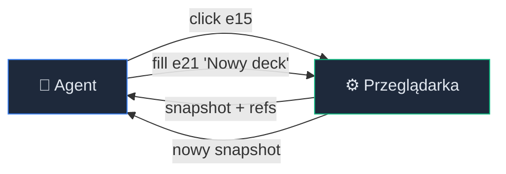
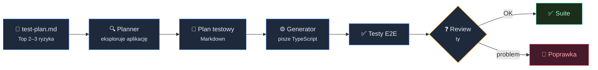
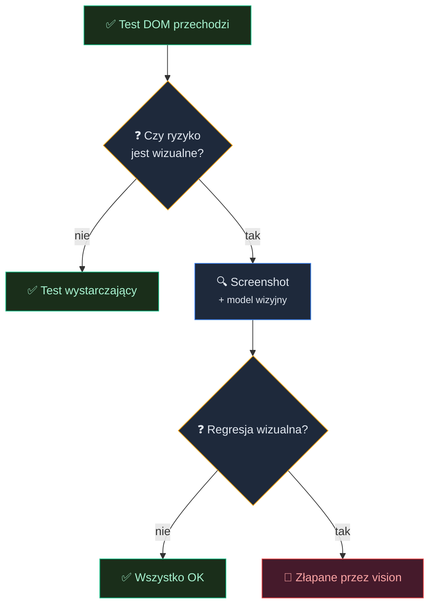
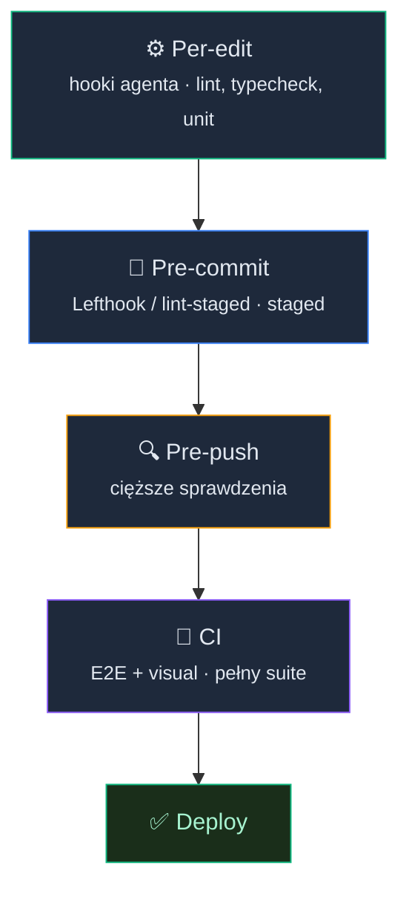

# Testy E2E: Playwright, MCP i multimodalne scenariusze


<!-- cdn: https://images.przeprogramowani.pl/lessons/m3-l4/assets/cover.jpg -->

Hook odpalił linter, typecheck przeszedł, powiązane testy się zazieleniły. Pełna automatyzacja od edycji po commit.

Tyle że użytkownik właśnie wygenerował fiszki, widzi je na ekranie, odświeża stronę — i deck jest pusty. Dane nie przetrwały, bo gdzieś na trasie auth → API → baza coś się zgubiło.

Żaden hook tego nie widział, bo hooki operują na kodzie źródłowym. Nie uruchamiają serwera, nie odpytują bazy, nie sprawdzają, czy dane przeżyją pełną ścieżkę użytkownika.

Żeby złapać problemy, które przechodzą przez wiele granic systemu, potrzebujesz testów, które uruchomią cały system end-to-end, a do tego agenta z dostępem do przeglądarki.

Ale samo narzędzie nie wystarczy. Agent potrafi wygenerować test E2E, który przechodzi. Tylko czy ten test naprawdę chroni system przed ryzykiem? Czy przetrwa jutrzejszy refaktor UI?

Oprócz narzędzi potrzebujesz dwóch mechanizmów kontroli: seed testu, który pokazuje agentowi wzorzec dobrego testu E2E, oraz reguł, które ograniczają to, co agent produkuje.

## Jak agent widzi aplikację

Żeby agent mógł testować aplikację end-to-end, musi z nią wchodzić w interakcję tak, jak użytkownik, przez przeglądarkę. Kiedy ty otwierasz stronę, widzisz piksele: kolory, fonty, przyciski, układ elementów. Agent domyślnie nie patrzy na piksele, patrzy na drzewo dostępności.

Drzewo dostępności to ustrukturyzowana mapa całej strony. Każdy element ma swoją rolę (button, textbox, heading), nazwę (to, co screen reader przeczytałby na głos) i stan (disabled, checked, expanded). Przeglądarka buduje to drzewo automatycznie z twojego HTML i ARIA.

Dla agenta ta mapa to coś lepszego niż screenshot. Jest deterministyczna, kompaktowa i nie wymaga modelu wizyjnego. Agent dostaje snapshot w formacie YAML z referencjami do elementów, na przykład `e5`, `e15`, `e21`. Potem wydaje komendy: "kliknij `e15`", "wpisz tekst w `e21`". Dostaje nowy snapshot i kontynuuje.


<!-- rendered: ../../assets/diagrams-10x/lessons-m3-l4-lesson-draft-1-10x.png | cdn: https://images.przeprogramowani.pl/diagrams/lessons-m3-l4-lesson-draft-1-10x.png -->

W tej pętli agent nie zgaduje selektorów CSS i nie próbuje rozpoznać przycisków na screenshocie. Nawiguje po strukturze semantycznej strony, tak jak screen reader.

To ma bezpośredni wpływ na testy, które agent generuje. Skoro widzi role i nazwy elementów, naturalnie powinien produkować testy oparte na `getByRole`, nie na selektorach CSS. Wrócimy do tego przy seed teście.

Skoro wiesz już, co agent widzi, pora podłączyć go do przeglądarki.

### Playwright CLI jako interfejs agenta

Playwright CLI (`@playwright/cli`) to narzędzie zoptymalizowane pod kątem agentów do programowania. Zamiast ładować ponad 30 narzędzi MCP do kontekstu agenta, CLI udostępnia komendy shell, a snapshoty zapisuje na dysku jako pliki YAML. Agent czyta tylko to, czego potrzebuje.

Instalacja i pierwsze uruchomienie:

```bash
npm install -g @playwright/cli@latest
playwright-cli open http://localhost:3000 --headed # zakładamy, że masz uruchomiony serwer developerski na porcie 3000
```


Po otwarciu strony CLI wyświetla snapshot z referencjami do elementów. Interakcja wygląda tak:

```bash
playwright-cli click e15
playwright-cli fill e21 "Mój nowy deck"
playwright-cli press Enter
playwright-cli screenshot
```

Każda komenda zwraca ścieżkę do zaktualizowanego snapshotu. Agent sam decyduje, czy go czytać, czy działać dalej.

Tutaj widać wyraźną różnicę między CLI a MCP w zużyciu tokenów: MCP potrafi zużyć nawet do 4x więcej tokenów niż Playwright CLI w tym samym scenariuszu testowym.

W preworku budżet tokenów był abstrakcyjnym ograniczeniem. Tutaj widzisz, jak przekłada się on na konkretną decyzję inżynierską, i właśnie dlatego domyślnie sięgamy po Playwright CLI zamiast MCP.

Agent dostaje dedykowaną sesję przeglądarki i może eksplorować twoją aplikację jako część pracy.

### Sesja bez logowania

Agent eksploruje twoją aplikację, ale większość ciekawych ścieżek jest za logowaniem. Bez tego każdy scenariusz zaczyna się od formularza logowania. To marnuje tokeny, dodaje kruche selektory i sprawia, że test jest zależny od UI logowania, a nie od tego, co faktycznie chcemy zweryfikować w danym teście. Oczywiście warto mieć dwa dedykowane scenariusze sprawdzające ścieżkę logowania i rejestracji, ale nie powinny one być zależnością dla pozostałych testów.

Większość frameworków E2E pozwala zapisać stan sesji (ciasteczka, tokeny) i wstrzyknąć go do kolejnych uruchomień. Playwright rozwiązuje to przez [`storageState`](https://playwright.dev/docs/auth). Logujesz się raz, zapisujesz stan sesji do pliku JSON i wstrzykujesz go do każdej kolejnej sesji. Jeśli korzystasz z innego frameworka, sprawdź aktualną dokumentację przez Context7. Wstrzykiwanie zapisanego stanu sesji to standardowy wzorzec.

```bash
# Zaloguj się raz przez CLI
playwright-cli open http://localhost:3000/login --headed
playwright-cli fill e5 "user@example.com"
playwright-cli fill e8 "password"
playwright-cli click e12
# Zapisz stan
playwright-cli state-save auth.json
```

W konfiguracji Playwright Test Runner ten sam plik wygląda tak:

```typescript
// playwright.config.ts
export default defineConfig({
  projects: [
    { name: 'setup', testMatch: /auth\.setup\.ts/ },
    {
      name: 'chromium',
      use: { storageState: 'playwright/.auth/user.json' },
      dependencies: ['setup'],
    },
  ],
});
```

Każdy test startuje od razu w stanie zalogowanym. Plik `auth.json` zawiera wrażliwe dane, więc dodaj go do `.gitignore`.

## Od ryzyk do testów E2E

Masz agenta, który potrafi uruchomić aplikację i wchodzić z nią w interakcję. Teraz pytanie: co ma testować?

Masz `context/foundation/test-plan.md` z poprzednich lekcji. Masz w nim ryzyka biznesowe, uporządkowane przez impact i likelihood. Część z nich wymaga testów E2E, bo dotyczą ścieżek użytkownika, a nie izolowanych funkcji.

Skąd wiadomo, które ryzyka to ryzyka E2E? Krótka heurystyka: jeśli ryzyko przechodzi przez wiele granic systemu (auth, routing, API, baza) albo istnieje tylko w wyrenderowanym UI, potrzebuje E2E. Jeśli można je sprawdzić na izolowanej funkcji, wystarczy test jednostkowy z lekcji na ich temat (M3L2).

E2E nie oznacza "zero mockowania". Wewnętrzne granice (auth, routing, baza) powinny być prawdziwe, bo to w nich kryją się ryzyka integracyjne. Ale drogie lub niedeterministyczne zewnętrzne API (modele LLM, bramki płatności) warto mockować na poziomie sieci. W 10xCards test E2E generowania fiszek mockuje OpenRouter na warstwie HTTP, zachowując prawdziwy auth, API i bazę. To pragmatyczny wzorzec, nie wyjątek.

Kluczowa zasada: **nie generujesz testów E2E od zera**. Otwierasz `context/foundation/test-plan.md`, wybierasz 1-3 najwyższe ryzyka, które wymagają pokrycia na poziomie przeglądarki, i dajesz je agentowi jako wejście. Jeśli twoja aplikacja nie ma frontendu, E2E może oznaczać scenariusze API: request → routing → logika → baza, bez przeglądarki. Mechanizmy kontroli jakości (seed test, reguły, review) działają tak samo. Zmienia się tylko warstwa interakcji.

Pamiętaj, aby zachowawczo podchodzić do liczby testów E2E: są one najwolniejsze i najbardziej kruche spośród wszystkich typów testów. Jednocześnie dają najlepszą informację zwrotną o stabilności całego systemu na konkretnych ścieżkach użytkownika.

### `/10x-e2e`: łączy się z `/10x-implement` i `/10x-tdd`

Masz ryzyka wybrane z `test-plan.md` i agenta, który potrafi uruchomić aplikację. Pokryciem tych ryzyk na poziomie przeglądarki zajmuje się skill `/10x-e2e`. To nie jest osobny generator testów obok procesu dla unitów. To **skill świadomy `/10x-implement` i `/10x-tdd`** z lekcji o testach jednostkowych (M3L2). Czyta ten sam `context/changes/<change-id>/plan.md`, korzysta z tej samej sekcji `## Progress`, realizuje te same fazy i kończy je tym samym rytuałem commita. Zmienia tylko wewnętrzną pętlę: zamiast pisać kod produkcyjny (`/10x-implement`) albo najpierw czerwony test jednostkowy (`/10x-tdd`), generuje i utwardza test na poziomie przeglądarki wobec działającej aplikacji.

Pętla jednej fazy wygląda tak:

```text
PLAN     → wybierz ryzyko, zmapuj ścieżkę (planner Playwrighta albo szablon promptu)
GENERATE → zamień ścieżkę w test wg seed testu i reguł E2E
REVIEW   → sprawdź wobec pięciu antywzorców; popraw przez re-prompt po nazwie
VERIFY   → uruchom na zielono, potem celowo zepsuj chronione zachowanie i potwierdź, że test pada
```

Pobierz skill paczką artefaktów dla tej lekcji:

```bash
npx @przeprogramowani/10x-cli@latest get m3l4
```

Ta paczka instaluje skill `/10x-e2e`, czyli jedno źródło całego workflow E2E (reguły jakości, pięć antywzorców, wzorzec seed testu i szablon promptu w jego referencjach), oraz cienki wskaźnik `CLAUDE-m3l4` doklejony do twojego `CLAUDE.md`: kilka twardych reguł i odwołanie do skilla, które agent czyta automatycznie przed generowaniem testów.

Jeśli chcesz nie tylko uruchamiać, ale i rozumieć: zanim odpalisz `/10x-e2e`, skieruj na niego prompt skill-explainer z lekcji Od chatbota do Agenta: tech stack, skille i metaprompting (M1L2). Rozłoży skill na mechanikę i decyzje projektowe, żebyś wiedział, co dokładnie prowadzi twój przepływ E2E. Ten sam prompt działa na każdy nowy skill w kursie.

Nie każda faza planu zasługuje na test E2E. Zanim `/10x-e2e` cokolwiek wygeneruje, sprawdza dla danej fazy trzy rzeczy: czy ryzyko jest naprawdę na poziomie przeglądarki (przechodzi przez wiele granic systemu, czyli auth, routing, API, baza, albo istnieje tylko w wyrenderowanym UI), czy testowana funkcjonalność jest już zbudowana i aplikacja się uruchamia, i czy nie istnieje już zielony test E2E dla tego ryzyka.

Jeśli ryzyko da się udowodnić izolowaną funkcją, skill przekierowuje fazę do `/10x-tdd` albo `/10x-implement`. E2E to najwolniejsza i najbardziej krucha warstwa, więc sięgasz po nią tylko tam, gdzie tańszy test by skłamał. Jeśli funkcjonalność jeszcze nie istnieje, skill się zatrzymuje: przeglądarka nie ma czego prowadzić, więc najpierw budujesz feature przez `/10x-implement`, a po E2E wracasz.

Dzięki wspólnej sekcji `## Progress` mieszasz tryby w obrębie jednego planu, dokładnie tak, jak `/10x-tdd` i `/10x-implement` w lekcji o testach jednostkowych:

```text
/10x-implement <change-id> phase 1   # zbuduj funkcjonalność
/10x-tdd <change-id> phase 2         # kontrakt API test-first
/10x-e2e <change-id> phase 6         # ścieżka użytkownika end-to-end
```

Nie tworzysz drugiej listy zadań i nie rozbijasz zmiany na równoległe procesy. Wszystkie trzy skille zapisują postęp w tym samym `## Progress`, więc po prostu wybierasz właściwy tryb dla konkretnej fazy.

W kroku PLAN masz dwie drogi do tego samego kontraktu. Pierwsza, gdy chcesz, by agent sam wyeksplorował aplikację, to przepływ planner→generator, który Playwright wprowadził w wersji 1.56 jako trzy wyspecjalizowane agenty testowe:

- **Planner** — eksploruje aplikację i generuje plan testów w Markdown. Opisuje scenariusze, kroki i oczekiwane wyniki.
- **Generator** — przekształca plan w wykonywalny kod TypeScript, walidując selektory na żywej aplikacji.
- **Healer** — analizuje stan UI spadających testów i proponuje poprawki selektorów.

Tego przepływu nie składasz ręcznie. `/10x-e2e` prowadzi go za ciebie i wie, że do eksploracji aplikacji może sięgnąć po Playwright CLI z poprzedniej sekcji. Po twojej stronie zostaje jedno: seed test (`seed.spec.ts`), który pokazuje agentowi, jak wygląda poprawny test w twoim projekcie.


<!-- rendered: ../../assets/diagrams-10x/lessons-m3-l4-lesson-draft-2-10x.png | cdn: https://images.przeprogramowani.pl/diagrams/lessons-m3-l4-lesson-draft-2-10x.png -->

Konkretny przykład z 10xCards: w `test-plan.md` najwyższe ryzyko E2E to "utrata wygenerowanych fiszek po odświeżeniu strony". Ten scenariusz przechodzi przez OpenRouter (mockowany na warstwie HTTP), API zapisu, bazę danych i renderowanie po stronie serwera, więc żaden test jednostkowy tego nie pokryje. Drugie ryzyko, "niezalogowany użytkownik widzi chronione zasoby", to z kolei pełna droga przez bramkę autoryzacji: middleware, przekazanie ciasteczka i przekierowanie. Podajesz te ryzyka skillowi, a on prowadzi resztę: Planner eksploruje aplikację przez snapshoty, generuje plan, Generator zamienia go w test. Brzmi świetnie, ale to dopiero połowa drogi.

### Seed test i reguły jakości

W kroku GENERATE `/10x-e2e` zamienia zmapowaną ścieżkę w test, ale nie z powietrza. Prowadzą go dwie dźwignie jakości: seed test i reguły E2E. W lekcji o testach jednostkowych (M3L2) nauczyłeś się dawać agentowi konkretne, powiązane z ryzykiem wejście i wymuszać asercję behawioralną. W E2E te dwie dźwignie pełnią dokładnie tę rolę.

Seed test (`seed.spec.ts`) to nie pusty rytuał. Dokumentacja Playwright mówi wprost: "Planner will also use this seed test as an example of all the generated tests." Jeśli seed używa `getByRole`, Generator też. Jeśli seed ma `page.waitForTimeout(2000)`, Generator powieli ten antywzorzec w każdym wygenerowanym teście. Co pokażesz, to dostaniesz.

Dobry seed test demonstruje agentowi cztery wzorce:

**Selektory oparte na rolach.** `getByRole('button', { name: 'Dodaj fiszkę' })` jest odporny na zmiany klas CSS, struktury DOM i refaktory komponentów. Dokumentacja Playwright rekomenduje: "Prefer user-facing attributes to XPath or CSS selectors." To dokładnie te informacje, które agent widzi w snapshotach dostępności. A seed, który używa `page.locator('.btn-primary')`? Uczy agenta powielać kruche selektory.

**Niezależność testów.** Agent chętnie generuje testy, gdzie test B zakłada, że test A utworzył deck. Problem? Playwright uruchamia testy równolegle, w losowej kolejności. Dokumentacja jest tu jednoznaczna: "Each test should be completely isolated from another test and should run independently." Seed musi to demonstrować: pełny cykl setup, akcja, asercja, cleanup w jednym teście.

**Czekanie na stan, nie na czas.** "Never wait for timeout in production. Tests that wait for time are inherently flaky." Seed powinien używać `expect(locator).toBeVisible()`, `page.waitForURL()` albo `page.waitForResponse()`. Konkretny stan aplikacji zamiast arbitralnego czasu.

**Asercje powiązane z ryzykiem.** Nazwa testu powinna jednoznacznie wiązać go z ryzykiem z `context/foundation/test-plan.md`: `test('flashcard data persists after page reload', ...)` zamiast `test('test 1', ...)`.

```typescript
// seed.spec.ts
import { test, expect } from '@playwright/test';

test('created deck persists after page reload', async ({ page }) => {
  const deckName = `Test Deck ${Date.now()}`;
  await page.goto('/');

  await page.getByRole('button', { name: 'New deck' }).click();
  await page.getByRole('textbox', { name: 'Deck name' }).fill(deckName);
  await page.getByRole('button', { name: 'Create' }).click();

  await expect(page.getByRole('heading', { name: deckName })).toBeVisible();

  await page.reload();
  await expect(page.getByRole('heading', { name: deckName })).toBeVisible();

  // Cleanup
  await page.getByRole('button', { name: 'Delete deck' }).click();
  await page.getByRole('button', { name: 'Confirm' }).click();
});
```

Zwróć uwagę na `Date.now()` w nazwie decku. To unikalne identyfikatory, o których powiemy więcej za chwilę.

Oprócz seed testu agent potrzebuje reguł testowania: hierarchii lokatorów (`getByRole` przed CSS/XPath), zakazu `page.waitForTimeout()`, niezależności testów, asercji na wynik biznesowy, cleanupu i `storageState` dla uwierzytelnienia. Pełny zestaw reguł generowania E2E i pięciu antywzorców są ładowane do skilla `/10x-e2e` przez referencje do plików: `e2e-quality-rules.md` i `e2e-anti-patterns.md`.

Jeżeli korzystasz z innego frameworka niż Playwright, dopasuj reguły do jego idiomów. Skill notuje mapowanie dla Cypress, WebdriverIO i Selenium. Reguły z dokumentacji Playwrighta i z mojego doświadczenia są punktem startowym, nie dogmatem.

Seed test i reguły to dwie najsilniejsze dźwignie jakości w E2E. Bez nich? Agent produkuje testy, które przechodzą dziś, ale łamią się przy pierwszym refaktorze albo blokują pipeline równoległego uruchamiania.

### Szablon promptu dla E2E

Przepływ planner→generator to jedna droga w kroku PLAN. Druga, prostsza, to wygenerowanie pojedynczego testu bezpośrednio z promptu, przydatne, gdy chcesz jeden test bez inicjowania agentów Playwrighta. Tego szablonu nie wypełniasz ręcznie: `/10x-e2e` trzyma go w referencji `e2e-prompt-template.md` i uzupełnia za ciebie czterema polami: ryzyko z `test-plan.md`, research anchor, scenariusz biznesowy (jedno obserwowalne zachowanie, które staje się asercją) oraz granice prawdziwe kontra mockowane. Sam plik szablonu zostaje nienaruszony, a skill tworzy nowy plik z promptem dla konkretnego ryzyka.

Kontrakt jest ten sam niezależnie od drogi. Nie powtarzasz w prompcie tego, co już jest w seed teście i regułach: seed kształtuje to, co generuje Generator, a reguły ograniczają agenta automatycznie. Prompt dodaje tylko to, czego seed i reguły nie znają: konkretne ryzyko, ścieżkę i granice.

Porównaj z testem jednostkowym z lekcji o testach jednostkowych (M3L2). Tam wskazywałeś konkretną funkcję i ryzyko, które ma chronić. Tu podajesz całą ścieżkę użytkownika i jawnie oddzielasz granice prawdziwe od mockowanych. W E2E granice systemu *są* testem. Ale „business scenario" pełni tę samą rolę co tam: wymusza asercję powiązaną z ryzykiem, nie z implementacją. Niezależnie od tego, czy idziesz przez prompt, czy przez pipeline planner→generator, obowiązuje ten sam kontrakt: ryzyko, research anchor, business scenario, granice, asercja powiązana z ryzykiem.

### Pięć antywzorców E2E od agenta

Krok REVIEW pętli to właśnie ta checklista. Masz reguły i seed test, ale co, jeśli agent mimo to wyprodukuje kruchy test? W lekcji o testach jednostkowych (M3L2) nauczyłeś się rozpoznawać trzy antywzorce: mirror implementacji, happy-path-only i brakujące edge case'y. Testy E2E mają własny zestaw problemów. `/10x-e2e` przepuszcza przez tę pięcioelementową checklistę każdy wygenerowany test (pełna wersja w jego referencji `e2e-anti-patterns.md`):

**1. Naiwna asercja.** Agent generuje test, który:

1. Tworzy deck
2. Dodaje fiszkę
3. Odświeża stronę
4. Sprawdza... że tytuł strony zawiera "Dashboard"

Test przechodzi. Ale nie sprawdza, czy fiszka przetrwała odświeżenie. Asercja jest naiwna: poprawna składniowo, ale realnie daje nam fałszywe poczucie bezpieczeństwa.

Pytanie kontrolne: **czy ta asercja padnie, jeśli ryzyko z `context/foundation/test-plan.md` się zmaterializuje?** Jeśli odpowiedź brzmi nie, asercja jest naiwna. Poprawiona wersja sprawdza konkretnie, czy po odświeżeniu fiszka nadal istnieje w decku.

**2. Kruchy selektor.** Agent generuje `page.locator('div.card-container > div:nth-child(3) > button')` zamiast `page.getByRole('button', { name: 'Delete' })`. Pierwszy selektor łamie się przy każdej zmianie layoutu. Jeśli twój seed test i reguły wymuszają `getByRole`, Generator powtórzy ten wzorzec. Jeśli nie, dostaniesz test, który prędzej czy później będzie trzeba aktualizować, nawet jeżeli ścieżka użytkownika pozostanie taka sama.

**3. Współdzielony stan między testami.** Agent generuje serię, w której test "edytuj fiszkę" zakłada, że test "dodaj fiszkę" już się wykonał. Testy z współdzielonym stanem przechodzą raz, a przy następnym przebiegu padają losowo. Klasyczny flaky test.

**4. `waitForTimeout` zamiast czekania na stan.** Agent nie wie, ile czasu potrzebuje twój backend. Zamiast poczekać na konkretną odpowiedź, wstawia `await page.waitForTimeout(3000)`. Test przechodzi na twoim laptopie, pada w CI, gdzie serwer odpowiada wolniej. Poprawka: `await page.waitForResponse('**/api/decks')` lub `await expect(element).toBeVisible()`.

**5. Brak cleanup.** Agent tworzy dane testowe (deck, fiszki), ale nie sprząta po sobie. Przy pierwszym przebiegu wszystko działa. Przy drugim, `unique constraint violation`, bo deck "TypeScript Basics" już istnieje w bazie.

Każdy z tych wzorców ma to samo źródło: agent optymalizuje na "test przechodzi teraz", nie na "test będzie stabilny jutro". To nie jest wada konkretnego narzędzia. To fundamentalna cecha generowania kodu przez LLM, z którą pracujesz przez cały kurs.

### Re-prompting: jak poprawić test E2E

Ta sama dyscyplina, którą stosowałeś przy testach jednostkowych (M3L2), działa w E2E: nie mów „popraw ten test". Wskaż antywzorzec po nazwie (z referencji `e2e-anti-patterns.md` w skillu `/10x-e2e`), wyjaśnij, dlaczego test nie chroni ryzyka (albo dlaczego produkuje fałszywe awarie), i podaj wzorzec docelowy.

Jeden przykład, dla naiwnej asercji:

```text
The final assertion checks the page title instead of verifying that
flashcard data survived the reload. This test passes even when
Risk #1 materializes (data loss after refresh).

Replace it with assertions on the actual business outcome: deck heading
and card content must be visible after page.reload(). The test must fail
if the data is lost.
```

Gotowe re-prompty dla kruchego selektora i `waitForTimeout` agent ma w referencji antywzorców, więc nie musisz ich przepisywać z pamięci, wystarczy nazwać problem. Każdy re-prompt ma te same trzy elementy: co jest źle, dlaczego to nie chroni ryzyka (albo produkuje fałszywe awarie), i jaki wzorzec go zastąpi. To ten sam rytm co w lekcji o testach jednostkowych (M3L2), przeniesiony na warstwę E2E.

### VERIFY: zielony to za mało

Ostatni krok pętli to VERIFY i nie kończy się on na zielonym wyniku, bo zielony jest też test z naiwną asercją. Pytanie kontrolne z pierwszego antywzorca („czy ta asercja padnie, jeśli ryzyko się zmaterializuje?") trzeba sprawdzić, a nie założyć. Dlatego `/10x-e2e` po uruchomieniu testu na zielono robi celowe psucie: odwraca albo osłabia w kodzie produkcyjnym dokładnie to zachowanie, którego dotyczy ryzyko, i sprawdza, czy test pada na czerwono. Jeśli mimo zepsucia chronionego zachowania test zostaje zielony, asercja niczego nie pilnuje i wraca do GENERATE.

To ta sama dyscyplina co weryfikacja asercji przez celowe psucie z lekcji o testach jednostkowych (M3L2), przeniesiona na warstwę E2E, z jedną różnicą: skill cofa zepsucie natychmiast po sprawdzeniu i nigdy go nie commituje. Czerwień celowego psucia to checkpoint, nie zapis.

Piąty antywzorzec (brak cleanup) zasługuje na osobne omówienie, bo jest źródłem najczęstszych fałszywych awarii w E2E.

Agent generuje testy, które tworzą dane w aplikacji: deck, fiszki, ustawienia. Bez strategii izolacji kolejny przebieg napotka konflikty: duplikaty, stary stan, pełne limity.

Dwa podejścia, które działają:

**Unikalne identyfikatory.** Każdy test generuje unikalny prefiks: `test-${Date.now()}-deck`. Testy nie kolidują ze sobą, bo operują na różnych danych. Działa natywnie z równoległym uruchamianiem i jest najłatwiejsze do wygenerowania dla agenta.

**Cleanup per test.** Każdy test sprząta po sobie w sekcji cleanup lub `test.afterEach`. Proste, ale kruche: jeśli test padnie przed cleanup, dane zostają. Dlatego warto dodać `test.afterAll` jako siatkę bezpieczeństwa.

Najlepsza praktyka to połączenie obu: unikalne identyfikatory zapobiegają kolizjom, cleanup per test zapobiega akumulacji.

Jeśli twoja aplikacja używa Supabase, pamiętaj o Row-Level Security: klient teardown musi być zalogowany na to samo konto, które tworzyło dane, albo użyć service role key. Więcej o teardown jako funkcji Playwright w Deep Dive.

Dlatego izolacja stanu testów powinna trafić do twoich reguł E2E. Wpisana raz, zwiększa szansę, że model uwzględni ją już przy pierwszej iteracji, zamiast czekać, aż złapiesz ją w review.

## MCP i tryb wizyjny

Do tej pory pracowaliśmy z CLI, bo jest oszczędny tokenowo i wystarczający dla większości scenariuszy. Ale czy MCP jest w ogóle potrzebny?

Tak, ale w innych sytuacjach. MCP daje dostęp do ponad 30 narzędzi: mockowanie sieci (`browser_route`), zarządzanie ciasteczkami i localStorage, nagrywanie trace'ów, kontrola tabów. CLI realizuje te same operacje jako komendy shell, ale MCP utrzymuje pełny kontekst sesji w pamięci agenta.

| | CLI | MCP |
|---|---|---|
| **Tokeny na scenariusz** | ~27K | ~114K |
| **Model interakcji** | Komendy shell, snapshoty na dysku | Narzędzia MCP w kontekście |
| **Najlepsze zastosowanie** | Agent kodujący z dużym repozytorium | Dedykowana automatyzacja przeglądarki |
| **Tryb domyślny** | Headless | Headed |

Heurystyka decyzyjna: jeśli twój agent jednocześnie edytuje kod, uruchamia testy i nawiguje po plikach, CLI jest lepszym wyborem, bo oszczędza kontekst. Jeśli masz dedykowaną sesję, której jedynym zadaniem jest eksploracja przeglądarki (np. długi scenariusz testowy, scraping, monitoring), MCP daje bogatszy zestaw narzędzi.

MCP konfiguruje tryby przez flagę `--caps`:

```bash
npx @playwright/mcp@latest --caps=vision,network,storage
```

Domyślnie MCP działa w trybie snapshot (drzewo dostępności). Flaga `vision` włącza tryb wizyjny.

### Tryb wizyjny: kiedy DOM nie wystarcza

Częsty bug frontendowy to nachodzące na siebie komponenty, który ujawnia się dopiero przy określonej rozdzielczości okna przeglądarki. Drzewo dostępności opisuje strukturę i semantykę, ale nie sam wyrenderowany interfejs użytkownika. Nachodzące na siebie elementy, zły z-index, ucięty tekst, zepsute animacje: te problemy istnieją w oknie przeglądarki, a nie w drzewku ARIA.

Playwright MCP ma tryb wizyjny (`--caps=vision`), w którym agent robi screenshot i operuje na współrzędnych zamiast na referencjach do elementów. Daje to dwa rodzaje weryfikacji:

**Interakcja po współrzędnych.** Agent klika w punkt (x, y) na screenshocie zamiast w element `e15`. Przydatne dla elementów canvas, niestandardowych widgetów i komponentów niewidocznych w drzewie dostępności.

**Weryfikacja wizualna przez model.** Agent robi screenshot, wysyła go do modelu wizyjnego i zadaje pytanie: "Czy karty fiszek nachodzą na siebie? Czy przycisk jest widoczny?" Model odpowiada ustrukturyzowanym JSON z oceną.


<!-- rendered: ../../assets/diagrams-10x/lessons-m3-l4-lesson-draft-3-10x.png | cdn: https://images.przeprogramowani.pl/diagrams/lessons-m3-l4-lesson-draft-3-10x.png -->

To jest moment, w którym multimodalność robi realną robotę: vision weryfikuje to, czego drzewo dostępności nie wyraża, czyli czy wyrenderowany układ faktycznie wygląda poprawnie, a nie tylko czy elementy istnieją w DOM.

Ale vision nie jest domyślnym trybem testowania. Kosztuje czas i pieniądze, a modele wizyjne bywają zawodne: potrafią przesunąć współrzędne w stronę środka ekranu albo zgłosić problem, którego nie ma. Dlatego traktujemy je jako uzupełnienie, nie jako pierwszy wybór.

Praktyczna reguła:

- **DOM (snapshot)** — domyślnie dla weryfikacji funkcjonalnej: czy element istnieje, czy formularz działa, czy dane się zapisały.
- **Vision** — jako suplement dla: regresji layoutu, stanów wizualnych (kolor, animacja, z-index), elementów niewidocznych w drzewie dostępności.
- **Deterministyczne narzędzia** (Playwright `toMatchSnapshot`, Argos, Lost Pixel) — dla regresji wizualnej na poziomie pikseli, bo to ich specjalizacja i robią to taniej i szybciej niż model wizyjny.

W testowaniu vision odpowiada na wąskie, weryfikowalne pytanie: czy ten konkretny element jest na miejscu i wygląda jak powinien. Szersze, otwarte pytanie „czy ten układ wygląda poprawnie?", razem z całą maszynerią doboru modelu wizyjnego, jego kosztem i kategoriami (frontier, budżetowy, open-weight), należy do debugowania, nie do testowania. Wracamy do niego w lekcji Debugowanie z AI: od stack trace'a do gotowego fixa (M3L5), gdzie vision jest sygnałem diagnostycznym przy szukaniu przyczyny buga. W testach E2E i tak najczęściej oprzesz się na deterministycznych narzędziach (`toMatchSnapshot`), bo dają stabilny, powtarzalny wynik.

## E2E w pipeline jakości

Pozostaje pytanie, kiedy je uruchamiać. W tym module zbudowaliśmy warstwowy system jakości:


<!-- rendered: ../../assets/diagrams-10x/lessons-m3-l4-lesson-draft-4-10x.png | cdn: https://images.przeprogramowani.pl/diagrams/lessons-m3-l4-lesson-draft-4-10x.png -->

Testy E2E mają inny rytm niż hooki. Hooki odpalają się co edycję, w milisekundach. E2E uruchamiasz w CI, bo jeden pełny przebieg to minuty, nie milisekundy.

Pełny pipeline CI/CD masz już z wcześniejszych modułów, więc teraz wystarczy, że dodasz przez `/10x-e2e` test E2E uruchamiany lokalnie, a w CI zwiążesz go z istniejącym pipeline'em.

Z czasem te testy będą padać i pojawia się trzeci agent z Playwright Test Agents, którego do tej pory tylko wspomnieliśmy: healer. To narzędzie lokalne. Kiedy test E2E spadnie, bo zmienił się selektor (np. po refaktorze komponentu), healer potrafi go naprawić automatycznie. Przegląda snapshot, identyfikuje nowy selektor i proponuje poprawkę.

Na czym healer się potyka? Na zmianach logiki biznesowej. Kiedy test spada, bo backend zmienił format odpowiedzi API, healer dopasowuje asercję do nowego (błędnego) zachowania. Zamiast złapać buga... maskuje go.

To jest granica między automatyczną naprawą a debugowaniem. Kiedy problem jest w selektorze, healer pomaga. Kiedy problem jest w logice, healer szkodzi. I właśnie te trudniejsze przypadki, kiedy test E2E spada z nieoczywistego powodu i trzeba dojść od stack trace'a do fixa, to temat następnej lekcji: Debugowanie z AI (M3L5).


## 🧑🏻‍💻 Zadania praktyczne

### Seed test i reguły testowania

Zanim agent zacznie generować testy E2E:

1. Napisz `seed.spec.ts`, czyli jeden wzorcowy test, który demonstruje twoje konwencje pisania testów E2E: `getByRole` jako domyślny selektor, czekanie na stan zamiast na czas, unikalne identyfikatory w danych testowych, cleanup, nazwa testu powiązana z ryzykiem z `context/foundation/test-plan.md`.
2. Pobierz skill `/10x-e2e` (`npx @przeprogramowani/10x-cli@latest get m3l4`). Wnosi on reguły E2E i pięć antywzorców jako jedno źródło, które agent czyta automatycznie.
3. Uruchom agenta z poleceniem wygenerowania jednego testu i sprawdź, czy wynik respektuje seed i reguły.

### Eksploracja aplikacji przez CLI

Zainstaluj Playwright CLI i otwórz swoją aplikację:

```bash
npm install -g @playwright/cli@latest
playwright-cli open http://localhost:3000 --headed
```

Nawiguj po aplikacji używając komend CLI. Zwróć uwagę na snapshot z referencjami do elementów. Spróbuj kliknąć kilka elementów po referencji, wypełnić formularz, przejść między stronami.

### Konfiguracja storageState

Zaloguj się do aplikacji przez CLI, zapisz stan sesji i zweryfikuj, że nowa sesja CLI startuje w stanie zalogowanym:

```bash
playwright-cli open http://localhost:3000/login --headed
# ... wypełnij formularz, zaloguj się ...
playwright-cli state-save playwright/.auth/user.json
```

Dodaj `playwright/.auth/` do `.gitignore`. Skonfiguruj `storageState` w `playwright.config.ts`.

### Scenariusze E2E z mapy ryzyk

1. Otwórz swój `context/foundation/test-plan.md` i wybierz 2 najwyższe ryzyka wymagające pokrycia E2E.
2. Uruchom `/10x-e2e` na fazie planu z tym ryzykiem (`/10x-e2e <change-id> phase N`) albo wskaż mu ryzyko wprost. Skill przejdzie pętlę PLAN→GENERATE→REVIEW→VERIFY w oparciu o twój seed test i reguły. W kroku PLAN ma dwie drogi do tego samego kontraktu: szablon promptu (gdy chcesz jeden test bez inicjowania agentów Playwrighta) albo planner→generator (gdy chcesz, by agent sam wyeksplorował aplikację). Ty podajesz ryzyko i przeglądasz wynik.
3. **Review:** przejrzyj każdy test pod kątem pięciu antywzorców. Dla każdej asercji zapytaj: „czy ta asercja padnie, jeśli ryzyko z `context/foundation/test-plan.md` się zmaterializuje?" Sprawdź selektory, niezależność testów, waity i cleanup. Jeśli znajdziesz antywzorzec, użyj re-promptu: wskaż konkretną wadę po nazwie i oczekiwany wzorzec.
4. **Celowe psucie:** odwróć albo osłab w kodzie produkcyjnym zachowanie, którego dotyczy ryzyko, i potwierdź, że test pada na czerwono. Jeśli zostaje zielony, asercja niczego nie chroni, więc wróć do GENERATE. Na koniec cofnij zepsucie i nie commituj go.

### Izolacja danych testowych

Upewnij się, że twoje testy E2E mogą uruchamiać się wielokrotnie bez konfliktów:

1. Sprawdź, czy każdy test używa unikalnych identyfikatorów (np. `Date.now()` w nazwie decku).
2. Sprawdź, czy testy sprzątają po sobie (cleanup w teście lub `afterEach`).
3. Uruchom suite dwa razy pod rząd i zweryfikuj, że wszystkie testy przechodzą za każdym razem.

### (Opcjonalne) Dostosuj `/10x-e2e` do swojego kontekstu

Skill dostajesz skrojony pod Playwrighta — potraktuj go jako punkt startowy i dostosuj jego referencje do swojej rzeczywistości:

- **Inny stack.** Na Cypress, WebdriverIO czy Selenium przepisz reguły i seed test na idiomy swojego narzędzia: jego odpowiednik `getByRole`, czekanie na stan, izolację danych. Zasady się przenoszą, zmienia się składnia.
- **Konwencje zespołu.** Wpisz swoje reguły lokatorów, nazewnictwo testów i ścieżki w repo, żeby generowane testy wyglądały jak reszta suite'u.
- **Brak UI.** Dla API bez interfejsu zmapuj ryzyka z `test-plan.md` na scenariusze HTTP, a antywzorce na warstwę requestów i danych.

Uruchom dostosowany skill na jednym realnym ryzyku i potwierdź, że wynik respektuje twoje reguły. Jak `/10x-e2e` działa w środku i kiedy taki skill się opłaca, rozkłada Deep Dive „Workflow E2E jako skill".

## Odbierz swoją odznakę

Po ukończeniu tej lekcji odbierz odznakę w sekcji [10xDevs Mission Log](https://platforma.przeprogramowani.pl/10xdevs-3/mission-log) a następnie pochwal się swoim osiągnięciem!

## 🔎 Deep Dive

Ta sekcja zawiera dodatkowe pogłębienie wiedzy na temat wybranych zagadnień związanych z lekcją. W tym Deep Dive znajdziesz:

- **browser.bind() i współdzielone sesje** — jak jedna instancja przeglądarki obsługuje CLI, MCP i test runner jednocześnie
- **Stagehand jako alternatywa** — inne podejście do automatyzacji przeglądarki z AI
- **Composable fixtures vs Page Object Model** — dlaczego wzorzec POM z drugiej edycji odchodzi do lamusa
- **Teardown jako projekt Playwright** — pełna konfiguracja czyszczenia danych z uwzględnieniem Supabase RLS
- **Workflow E2E jako skill** — kiedy spakować ten przepływ w skill, jak to się ma do reguł i seed testu, i dlaczego stack inny niż Playwright zyskuje najwięcej (powiązane z opcjonalnym zadaniem)

Ta sekcja lekcji nie jest obowiązkowa, ale warto się z nią zapoznać, jeżeli chcesz zostać ekspertem.

### browser.bind() i współdzielone sesje

Od Playwright 1.59 API `browser.bind()` pozwala uruchomić przeglądarkę, do której mogą się podłączyć różne klienty: CLI, MCP i test runner jednocześnie.

W praktyce wygląda to tak: agent kodujący uruchamia przeglądarkę przez CLI, pisze test, a potem uruchamia go przez test runner na tej samej instancji. Kiedy test spadnie, agent analizuje trace przez `npx playwright trace` bez otwierania GUI.

Dashboard (`playwright-cli show`) wyświetla wszystkie aktywne sesje z podglądem na żywo. Przydatne, kiedy masz kilka sesji równolegle, np. jedną na testy, drugą na eksplorację.

`page.screencast` (również od v1.59) nagrywa wideo sesji z adnotacjami przy akcjach. Agent może wygenerować nagranie jako dowód poprawności scenariusza.

### Stagehand jako alternatywa

Playwright CLI i MCP to nie jedyne podejścia do automatyzacji przeglądarki z AI. Stagehand (browserbase/stagehand) proponuje inny model: hybryda kodu i języka naturalnego.

Stagehand udostępnia trzy główne metody: `act()` (akcja w języku naturalnym), `extract()` (ekstrakcja danych ze strony przez schemat Zod) i `agent()` (wielokrokowe zadania). W wersji 3 przeszedł z Playwright na CDP (Chrome DevTools Protocol). Repo: [browserbase/stagehand](https://github.com/browserbase/stagehand).

Różnica w podejściu: Playwright daje deterministyczną kontrolę przez drzewo dostępności, a Stagehand stawia na naturalną interakcję z AI jako domyślny tryb. W tym kursie, gdzie zależy nam na stabilności, dokumentacji i szerokim wsparciu, Playwright ze swoim rozbudowanym ekosystemem jest naturalnym wyborem. Stagehand warto znać jako alternatywę, szczególnie przy scrapingu i automatyzacji stron, nad którymi nie masz kontroli.

### Composable fixtures vs Page Object Model

W drugiej edycji kursu uczyliśmy wzorca [Page Object Model](https://playwright.dev/docs/pom): klasy reprezentujące strony, metody reprezentujące interakcje, hierarchia dziedziczenia. W 2026 ten wzorzec ustępuje miejsca composable fixtures z Playwright.

Fixtures dają tę samą izolację i reużywalność co POM, ale bez ceremonii klas, konstruktorów i łańcuchów metod. Fixture ustawiający stronę z konkretnymi danymi testowymi jest łatwiejszy do zrozumienia niż klasa `ProductPage` z dwudziestoma metodami. Efekt: około 30% mniej kodu, bez instancjowania klas w plikach testowych.

Kiedy POM nadal ma sens? Przy dużych suites (200+ testów), gdzie kilku inżynierów potrzebuje wspólnego słownika interakcji ze stronami. Przy mniejszych projektach i przy pracy z agentem, fixtures wygrywają.

Porównanie na minimalnym przykładzie:

```typescript
// POM — klasa z metodami
class DeckPage {
  constructor(private page: Page) {}
  async createDeck(name: string) {
    await this.page.getByRole('button', { name: 'New deck' }).click();
    await this.page.getByRole('textbox', { name: 'Deck name' }).fill(name);
    await this.page.getByRole('button', { name: 'Create' }).click();
  }
}

// Fixture — funkcja z automatycznym setup/teardown
const test = base.extend<{ deckName: string }>({
  deckName: async ({ page }, use) => {
    const name = `Deck ${Date.now()}`;
    await page.getByRole('button', { name: 'New deck' }).click();
    await page.getByRole('textbox', { name: 'Deck name' }).fill(name);
    await page.getByRole('button', { name: 'Create' }).click();
    await use(name);
    await page.getByRole('button', { name: 'Delete deck' }).click();
  },
});
```

Seed test z głównej części lekcji naturalnie popycha agenta w kierunku fixtures: agent widzi wzorzec setup/teardown w jednej funkcji i powiela go w generowanych testach. (Przykład jest skrócony: pominęliśmy `import { test as base } from '@playwright/test'`, a teardown zakłada, że utworzony deck jest zaznaczony i widoczny.)

Praktyczna zasada: zacznij od fixtures. Wyciągaj page objecty dopiero wtedy, kiedy powielona logika interakcji stanie się oczywistym kosztem.

### Teardown jako projekt Playwright

W core lekcji omówiliśmy unikalne identyfikatory i cleanup per test. Dla bardziej złożonych przypadków, Playwright oferuje dedykowany mechanizm: teardown project.

Konfiguracja wymaga dwóch kroków. Najpierw setup project deklaruje swój teardown:

```typescript
// playwright.config.ts
export default defineConfig({
  projects: [
    {
      name: 'setup db',
      testMatch: /global\.setup\.ts/,
      teardown: 'cleanup db',
    },
    {
      name: 'cleanup db',
      testMatch: /global\.teardown\.ts/,
    },
    {
      name: 'chromium',
      use: { storageState: 'playwright/.auth/user.json' },
      dependencies: ['setup db'],
    },
  ],
});
```

Teardown uruchamia się po wszystkich zależnych testach. W `global.teardown.ts` możesz np. czyścić testową bazę danych.

Przy Supabase pamiętaj o Row-Level Security: klient teardown musi być zalogowany na to samo konto, które tworzyło dane, albo użyć service role key pomijającego RLS. Bez tego teardown zobaczy puste tabele mimo istniejących rekordów.

Alternatywne podejście to "teardown-before-setup". Każdy test zaczyna od usunięcia danych, które mógł utworzyć w poprzednim przebiegu. To gwarantuje czysty stan startowy nawet po crashu, bez dedykowanego teardownu.

### Workflow E2E jako skill

Skill `/10x-e2e`, który dostałeś w tej lekcji, to już taki spakowany przepływ: pętla PLAN→GENERATE→REVIEW→VERIFY, bramka kwalifikacji fazy oraz seed i reguły jako dźwignie, a wszystko za jedną komendą.

Kiedy się opłaca? Pojedynczy prompt i plik reguł wystarczają, dopóki workflow odpalasz sporadycznie. Skill wygrywa, gdy ten sam łańcuch powtarzasz wielokrotnie, w kilku projektach albo w zespole. Daje trzy rzeczy, których prompt nie ma: kontrakt na dysku, uruchamianie po nazwie i progresywne ujawnianie. Ciało `SKILL.md` ładuje się dopiero przy wywołaniu, a seed i reguły jako `references/` schodzą z dysku na żądanie, nie obciążając kontekstu między uruchomieniami.

Jak go zbudować:

1. **Zdefiniuj kontrakt.** Wejście: jedno ryzyko z `context/foundation/test-plan.md`. Wyjście: przejrzany test E2E, który pada, gdy ryzyko się materializuje. To samo zdanie trafia do `description` skilla, bo po nim agent rozpoznaje, kiedy go odpalić.
2. **Zarysuj szkielet.** Użyj `skill-creator` do wygenerowania `SKILL.md` albo napisz go ręcznie. Trzymaj się limitu około 500 linii i progresywnego ujawniania, które już znasz.
3. **Dołącz `references/`.** Wzorzec seed testu, reguły E2E (selektory oparte na rolach, czekanie na stan, niezależność, cleanup) i pola szablonu promptu, czyli zasoby ładowane na żądanie, nie ciało `SKILL.md`.
4. **Zakoduj workflow w `SKILL.md`:** bramka kwalifikacji fazy (czy ryzyko jest na poziomie przeglądarki i czy feature istnieje) → PLAN (wybierz ryzyko, zmapuj ścieżkę) → GENERATE wg seed i reguł → REVIEW wobec pięciu antywzorców z re-promptem → VERIFY przez celowe psucie. To ta sama pętla, którą prowadzi `/10x-e2e`, tylko zapięta na idiomy twojego narzędzia.
5. **Uruchom po nazwie** i zaudytuj własny `SKILL.md` tak, jak wcześniej audytowałeś cudze skille: bezpieczeństwo i progresywne ujawnianie.

Skill orkiestruje reguły i seed, nie zastępuje ich. To warstwa nad dźwigniami jakości, nie zamiast nich.

## 📚 Materiały dodatkowe

- [Playwright CLI](https://playwright.dev/agent-cli/introduction) — oficjalna dokumentacja CLI dla agentów: komendy, snapshoty, sesje, integracja ze skills
- [Playwright for Coding Agents](https://playwright.dev/docs/getting-started-cli) — getting started: setup CLI z Claude Code, Copilot, Cursor
- [Playwright MCP](https://github.com/microsoft/playwright-mcp) — repozytorium MCP servera: tryby (snapshot, vision), capabilities, konfiguracja
- [Playwright Test Agents](https://playwright.dev/docs/test-agents) — oficjalna dokumentacja planner/generator/healer: inicjalizacja, seed test, workflow
- [Playwright Best Practices](https://playwright.dev/docs/best-practices) — oficjalne rekomendacje: selektory, izolacja testów, auto-waiting, web-first assertions
- [Playwright Authentication](https://playwright.dev/docs/auth) — wzorzec storageState: zapis sesji, global setup, multi-role testing
- [Playwright Release Notes](https://playwright.dev/docs/release-notes) — browser.bind(), page.screencast, CLI debugger, aria snapshots z bounding boxes
- [How I Used AI to Fix Our E2E Test Architecture](https://dev.to/debs_obrien/how-i-used-ai-to-fix-our-e2e-test-architecture-444a) — Debbie O'Brien (Microsoft/Playwright), rules-file approach dla AI + E2E
- [WebTestBench](https://arxiv.org/html/2603.25226) — badanie nad agentami w testowaniu: F1 scores, bottleneck checklisty, "competent executors, unreliable planners"
- [VLM Visual Testing](https://zakelfassi.com/vlm-visual-testing-chrome-extension) — Zak El Fassi, praktyczny test wizualny z lokalnym modelem: 32 testy, zero dolarów
- [State of Playwright AI Ecosystem 2026](https://currents.dev/posts/state-of-playwright-ai-ecosystem-in-2026) — Currents.dev, przegląd ekosystemu: MCP vs CLI, adopcja, nierozwiązane problemy
- [browserbase/stagehand](https://github.com/browserbase/stagehand) — alternatywny framework automatyzacji przeglądarki: act/extract/agent, CDP, hybryda kodu i AI
- [Playwright Best Practices 2026](https://getautonoma.com/blog/playwright-best-practices-2026) — composable fixtures, getByRole, snapshot mode jako default
- [Why You Shouldn't Use waitForTimeout](https://www.browserstack.com/guide/playwright-waitfortimeout) — BrowserStack, before/after examples for replacing hardcoded waits
- [How to Write E2E Tests for Full Parallelization](https://www.qawolf.com/blog/how-to-write-tests-for-full-parallelization) — QA Wolf, unique identifiers and cleanup patterns
- Prework [3.1] *LLMy i ich wpływ na codzienną pracę programisty* — budżety tokenów i degradacja kontekstu, tutaj zastosowane do decyzji CLI vs MCP
- Prework [4.1] *Tech Stack Overview* — Playwright w rekomendowanym stacku, teraz operacjonalizowany jako agent-browser interface
