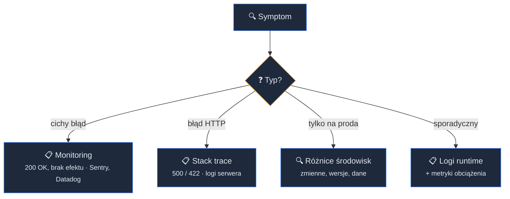
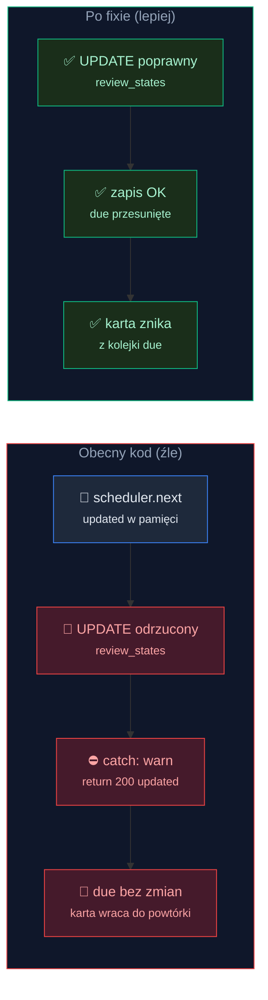
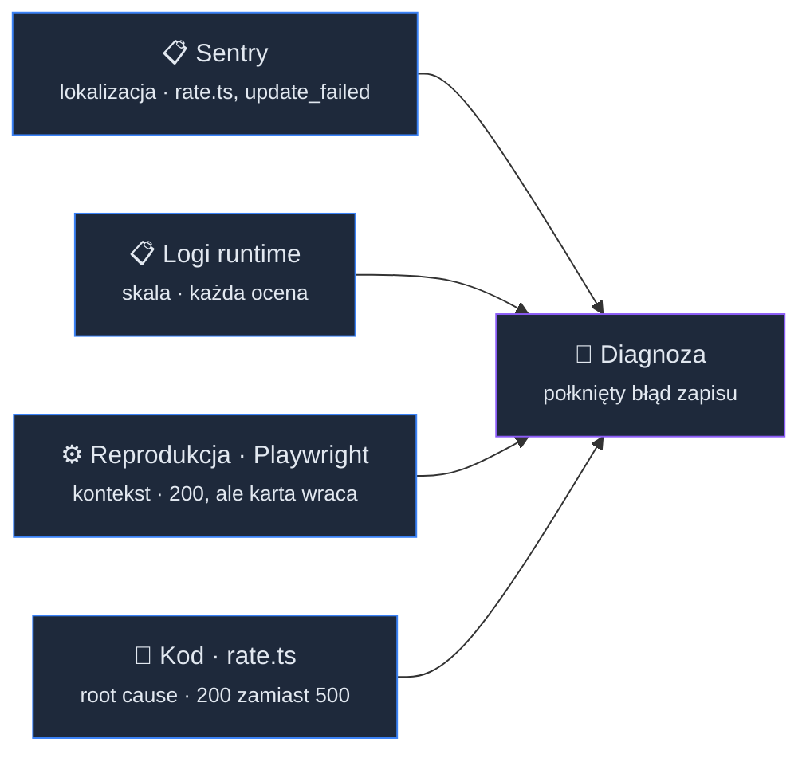
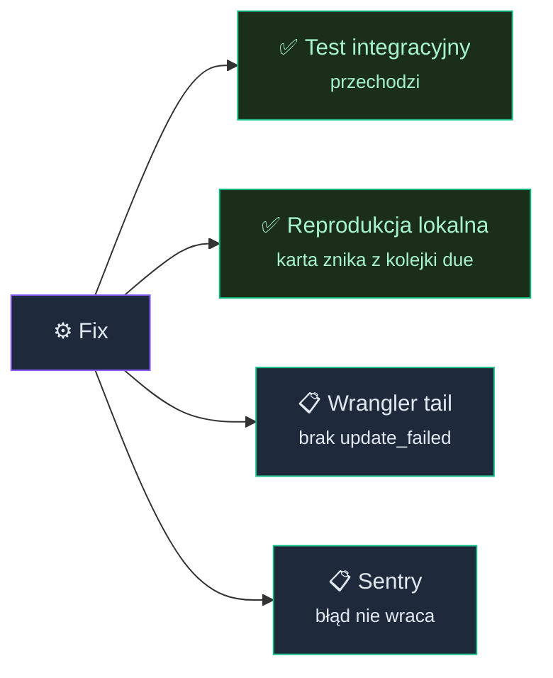
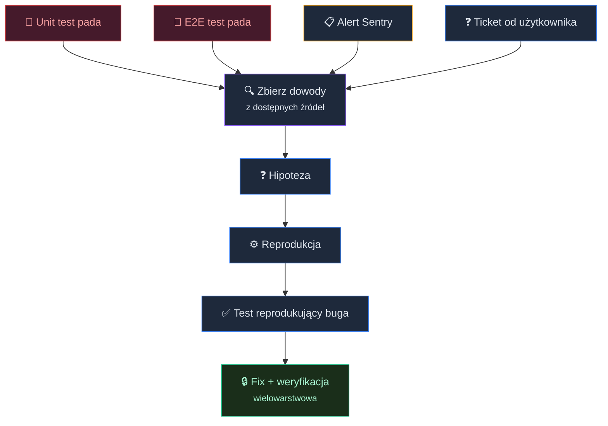

# Debugowanie z AI: od stack trace'a do gotowego fixa


<!-- cdn: https://images.przeprogramowani.pl/lessons/m3-l5/assets/cover.jpg -->

Test plan, testy jednostkowe, hooki, testy E2E. Przez cztery lekcje tego modułu zbudowałeś proaktywny pipeline jakości, który łapie znane ryzyka zanim trafią do repozytorium.

A potem przychodzi ticket od użytkownika.

"Oceniam fiszkę jako »Dobre«, ale wciąż wraca do powtórki — ciągle widzę te same karty."

Żadnego stack trace'a. Żadnego kodu błędu. Żadnego screenshota. Jedno zdanie i diagnoza do wyciągnięcia.

A pipeline z poprzednich lekcji? Tym razem mógł tego nie złapać. Akurat ta ścieżka aplikacji nie miała żadnego testu, który by ją uruchamiał. Dlaczego — rozłożymy na czynniki pierwsze pod koniec lekcji.

To nie znaczy, że pipeline jest zły. Każdy taki mechanizm ma swoje martwe punkty. Proaktywne testy łapią ryzyka, które potrafisz przewidzieć. Produkcja ujawnia te, których nie przewidziałeś.

Ta lekcja uczy reagowania. Zamiast agenta, który pisze testy "z góry" na podstawie ryzyk, poprowadzisz agenta, który zbiera dowody z wielu źródeł, formułuje hipotezę i potwierdza ją testem. Diagnostyka, która zamyka lukę po proaktywnych testach.

Bug, którego będziemy diagnozować, został celowo wprowadzony do 10xCards na potrzeby lekcji. Na tym etapie aplikacja nie miała żadnych bugów, a nie chcieliśmy zmieniać kontekstu projektu na inny.

Całe to dochodzenie prześledzimy poniżej krok po kroku, tak jak przebiegałoby przy prawdziwym tickecie: od parsowania zgłoszenia, przez dane z Sentry, logi runtime i reprodukcję lokalną, aż po test reprodukujący buga i zweryfikowany fix. Gotowe komendy i konfigurację każdego narzędzia zebraliśmy w sekcji 🔎 Deep Dive, a linki do oficjalnej dokumentacji znajdziesz w 📚 Materiałach dodatkowych. Wracaj do nich, kiedy będziesz odtwarzać ten proces u siebie.

Jedna uwaga, zanim zaczniemy. Sentry, `wrangler tail` i Playwright to konkretny zestaw narzędzi dla stacka 10xCards (Astro na Cloudflare). W twoim projekcie mogą wyglądać inaczej: Datadog zamiast Sentry, `vercel logs` albo `flyctl logs` zamiast `wrangler`, Cypress zamiast Playwright. Tym, co się nie zmienia, jest struktura dochodzenia: skąd brać dowody, w jakiej kolejności i jak złożyć je w diagnozę. Przy każdym kroku nazywamy wzorzec, żebyś mógł przełożyć go na własne narzędzia.

## Od ticketa do planu dochodzenia

### Parsowanie ticketa z agentem

Ticket od użytkownika to najtrudniejszy punkt wejścia w debugowanie. Kiedy unit test pada, masz asercję i stack trace. Kiedy Sentry łapie wyjątek, masz lokalizację w kodzie. Kiedy przychodzi ticket, masz zwykle jedno, nieprecyzyjne zdanie.

Zamiast samodzielnie zgadywać przyczynę, daj agentowi ticket i poproś o ustrukturyzowanie go. To ta sama zasada, którą znasz z lekcji Testy jednostkowe i integracyjne z agentem (M3L2): im bardziej uporządkowany kontekst dajesz agentowi, tym lepszy wynik dostajesz.

W testowaniu dawałeś agentowi konkretne, uporządkowane wejście powiązane z ryzykiem. W debugowaniu dajesz mu surowy ticket i prosisz o rozbicie go na konkretne pytania diagnostyczne.

Agent parsuje "oceniam fiszkę, ale wciąż wraca do powtórki" na:

- **Kroki reprodukcji:** otwórz powtórkę → oceń kartę jako „Dobre" → odśwież → ta sama karta nadal czeka
- **Zakres:** ocena karty zwraca sukces, ale harmonogram się nie zmienia
- **Częstotliwość:** za każdym razem
- **Możliwy obszar problemu:** trasa oceniania → zapis do `review_states` (ocena działa, ale nowy termin powtórki się nie zapisuje)

Teraz masz coś, z czym da się pracować. Agent nie zna jeszcze odpowiedzi, ale zna pytania.

### Triage — gdzie szukać najpierw

Masz teraz konkrety: kroki reprodukcji, zakres problemu, częstotliwość, możliwy obszar. Pora zdecydować, gdzie szukać.

"Ocena zwraca sukces, ale harmonogram się nie zmienia" to sygnał, że API nie zgłasza błędu, a mimo to coś po cichu nie działa. Pierwszym ruchem powinien być monitoring. Czy gdzieś w systemie pojawia się błąd, którego API nie propaguje na zewnątrz?

Nie każdy symptom prowadzi do monitoringu. Różne sygnały sugerują różne źródła:


<!-- rendered: ../../assets/diagrams-10x/lessons-m3-l5-lesson-draft-1-10x.png | cdn: https://images.przeprogramowani.pl/diagrams/lessons-m3-l5-lesson-draft-1-10x.png -->

W naszym przypadku: API zwraca 200, ale ocena nie zmienia harmonogramu. Zaczynamy od Sentry.

## Zbieranie dowodów

### Sentry MCP — dane z produkcji

Sentry to usługa do monitoringu błędów: SDK wpięty w aplikację przechwytuje wyjątki na produkcji i wysyła je razem ze stack trace'em, breadcrumbs (ślad zdarzeń poprzedzających błąd) i kontekstem requesta. Jeśli nie masz jeszcze Sentry na swoim projekcie, nie szkodzi — proces instalacji i darmowy plan opisujemy w Deep Dive tej lekcji. Tu zakładamy, że monitoring już zbiera dane z produkcji.

Mając skonfigurowane Sentry, agent odpyta je przez MCP server: przeszuka issues, pobierze stack trace i breadcrumbs bez opuszczania terminala. Dlaczego MCP, a nie `sentry-cli`? CLI Sentry obsługuje zadania wydawnicze: upload source map, tworzenie release'ów, zarządzanie plikami debug i deploye. Nie ma w nim dedykowanej komendy do przeszukiwania issues. Robi to dopiero MCP server: wystawia issues, stack trace'y i breadcrumbs jako ustrukturyzowane dane, które agent odpytuje i od razu łączy w swojej pętli. Diagnoza zostaje po stronie agenta, zgodnie z tym, czego ta lekcja uczy.

Ale skoro endpoint zwraca 200, to co właściwie Sentry ma tu zobaczyć? Decyduje jeden szczegół konfiguracji. Przy nieudanym zapisie handler wykonuje `console.warn(...)` (za chwilę zobaczymy to w kodzie), a projekt ma włączoną integrację `captureConsoleIntegration`, która przekazuje takie logi do Sentry jako zdarzenia. Dzięki temu cichy warning z produkcji trafia na listę issues, mimo że użytkownik dostał status 200. Konfigurację tej integracji pokazujemy w Deep Dive.

Agent znajduje issue `review/rate: update_failed`. Stack trace wskazuje na `rate.ts`, na obsłudze wyniku zapisu do `review_states`: UPDATE harmonogramu zwraca błąd, ale handler go nie propaguje. Breadcrumbs pokazują kontekst oceniania karty, który bezpośrednio poprzedza błąd.

To pierwsza warstwa dowodów. Wiemy teraz, że:

- Błąd istnieje — nieudany UPDATE do `review_states`
- Lokalizacja — `rate.ts`, obsługa wyniku zapisu
- Kontekst — błąd pojawia się przy ocenie karty

Bez monitoringu ta informacja byłaby zakopana gdzieś w logach serwera (o ile twój setup je przechowuje) albo najpewniej nigdzie.

Ale nadal nie wiemy, jak często to się dzieje ani dlaczego zapis nie przechodzi. Do tego potrzebujemy kolejnych źródeł.

### Runtime logs jako uzupełniający sygnał

Po Sentry agent sprawdza logi runtime. Dla Cloudflare to `wrangler pages deployment tail`:

```bash
npx wrangler pages deployment tail --project-name 10xcards-30 \
  --format json --search "update_failed"
```

Logi potwierdzają: `console.warn` z komunikatem `review/rate: update_failed` pojawia się po każdej ocenie karty. To nie problem sporadyczny. To systematyczny błąd, który dotyka każdego użytkownika.

Sentry dał lokalizację, logi dają skalę. Wystarczy, żeby przejść do reprodukcji.

Konkretne narzędzie zależy od platformy. Wrangler to przykład dla Cloudflare, Fly.io ma `flyctl logs`, Vercel ma `vercel logs`, AWS ma CloudWatch.

Wzorzec jest ten sam: odpytaj strumień logów platformy i filtruj po komunikacie powiązanym z symptomem.

### Reprodukcja lokalna

Dowody z produkcji wskazują na `rate.ts` i nieudany zapis do `review_states`. Zanim agent zacznie czytać kod, potwierdźmy, że problem reprodukuje się lokalnie.

Agent uruchamia aplikację, otwiera powtórkę, ocenia kartę jako „Dobre", odświeża. Ta sama karta nadal czeka w kolejce. Symptom potwierdzony.

Tu z pomocą przychodzi Playwright CLI (lub Playwright MCP), czyli to samo narzędzie, które poznałeś w lekcji Testy E2E (M3L4). Tym razem nie służy do testowania, ale do zbierania informacji: daje agentowi dostęp do przeglądarki, w tym do komunikatów konsoli (`browser_console_messages`) i ruchu sieciowego (`browser_network_requests`). To dwa kanały, które pokazują, co dzieje się po stronie klienta, zanim zajrzymy w kod serwera.

Konsola przeglądarki (`browser_console_messages`): brak błędów JavaScript. To wyklucza problem po stronie frontendu.

Żądania sieciowe (`browser_network_requests`): `POST` na endpoint oceniania zwraca 200 z kartą, która wygląda na zaktualizowaną. Ale kolejne `GET` na endpoint powtórki zwraca 200 z tą samą kartą w kolejce. Serwer zgłasza sukces, ale nowy termin nigdy się nie zapisuje.

Teraz wiemy: to problem po stronie serwera, w danych. Nie crash, nie błąd sieci, nie problem z renderowaniem. Zmiana harmonogramu po prostu nie trafia do `review_states`.

Trzy źródła, trzy warstwy informacji. Teraz agent ma wystarczająco danych, żeby czytać kod z celem zamiast na ślepo.

W tym miejscu można zapytać: skoro bug i tak siedzi w `rate.ts`, to czy nie szybciej było od razu otworzyć ten plik i przeczytać kod? Dla tego konkretnego buga być może. Ale czytanie kodu „w ciemno" zawodzi dokładnie tam, gdzie debugowanie boli najbardziej: przy błędach widocznych tylko na produkcji, niereprodukowalnych lokalnie, w nieznanym lub wielkim kodzie projektu albo pojawiających się losowo. Wtedy nie wiesz nawet, który plik otworzyć. Dlatego ćwiczymy metodę zbierania dowodów z wielu źródeł, a nie sztuczkę dla jednego przypadku. Zresztą i tutaj dowody zarobiły na swoje miejsce: Sentry dało lokalizację, logi pokazały skalę (każda ocena, nie pojedynczy incydent), a reprodukcja odcięła front od backendu, czego z samego `rate.ts` byś nie wyczytał.

### Sygnał wizyjny: reprodukcja problemów UI

W tym bugu konsola i sieć wystarczyły — symptom był serwerowy, w danych. Ale część bugów żyje wyłącznie w wyrenderowanym interfejsie: nachodzące na siebie komponenty, zły z-index, ucięty tekst, zepsuta animacja. Tu `browser_console_messages` jest czyste, `browser_network_requests` zwraca 200, a użytkownik i tak widzi coś zepsutego. DOM i logi milczą, bo problem istnieje w pikselach, nie w strukturze.

Wtedy reprodukcja lokalna ma jeszcze jeden kanał: screenshot podany modelowi wizyjnemu (VLM) z otwartym pytaniem diagnostycznym — „co tu jest nie tak?". Playwright MCP w trybie wizyjnym (`--caps=vision`) robi screenshot i operuje na współrzędnych zamiast na element refs, więc widzi to, czego drzewo dostępności nie wyraża. To nie to samo, co weryfikacja wizualna w lekcji Testy E2E (M3L4): tam vision potwierdzał wąską, znaną asercję (czy ten element wygląda, jak powinien); tu zadajesz pytanie otwarte, bo jeszcze nie wiesz, co się zepsuło, więc model ma ci pomóc nazwać objaw.

**Który model?** Potrzebujesz modelu z obsługą obrazów (VLM). Trzy kategorie:

- **Frontier** (np. Claude Opus, GPT z obsługą wizji) — najwyższa jakość, najwyższy koszt.
- **Budżetowy** (np. Gemini Flash) — dobra wizja, niski koszt, szybkie odpowiedzi. Rozsądny domyślny wybór do powtarzalnej diagnostyki.
- **Open-weight** (np. Qwen-VL) — zero kosztów API na własnym sprzęcie, kosztem szybkości.

Koszt jest realny, choć niewielki: jeden screenshot przez API to ułamek centa i kilka sekund, model lokalny jest darmowy, ale wolniejszy. Konkretne nazwy starzeją się szybko — trzymaj się kategorii i odświeżaj wybór co kilka miesięcy.

Vision ma ograniczenia, o których trzeba pamiętać przy diagnozie:

- **Dokładność.** Modele wizyjne przesuwają współrzędne w stronę środka ekranu; elementy przy krawędziach bywają źle lokalizowane. Pytanie musi być precyzyjne.
- **Halucynacje.** Model może zgłosić problem, którego nie ma (fałszywy alarm — frustrujący), albo przeoczyć ten, który jest (fałszywy negatyw — groźniejszy). Traktuj jego odpowiedź jako hipotezę do potwierdzenia, nie twarde dowody.

I granica względem testowania: do regresji na poziomie pikseli w *testach* używasz narzędzi deterministycznych (`toMatchSnapshot`, Argos, Lost Pixel) — to robota z lekcji Testy E2E (M3L4), tania i powtarzalna. Playwright MCP z wizją pomaga w czymś innym: w otwartym pytaniu diagnostycznym, którego deterministyczne narzędzie nie zada.

## Diagnoza i fix

### Synteza — dowody się zbiegają

Agent czyta `rate.ts`. Handler liczy nowy stan karty w pamięci (`updated`), zapisuje go do `review_states`, a potem obsługuje wynik zapisu:

```typescript
if (updateError) {
  console.warn(`review/rate: update_failed ...`);
  return jsonResponse(200, { ok: true }); // ← błąd połknięty, zwracamy „sukces"
}
```

Zestawiamy to z danymi z Sentry: błąd na UPDATE do `review_states`. Zapis pada (handler wpisuje do kolumny wartość, którą baza odrzuca przy każdej próbie), ale błąd nie leci dalej. Zamiast zwrócić 500, handler loguje `console.warn` i odpowiada `200 { ok: true }`. Frontend patrzy tylko na status odpowiedzi, więc przechodzi do następnej karty jak gdyby nigdy nic — a nowy termin nigdy nie trafił do bazy.

Stąd 200 OK i karta, która wygląda na ocenioną. A ponieważ powtórka wybiera karty po `due <= teraz`, niezmieniony termin oznacza, że ta sama karta wraca przy każdym kolejnym otwarciu powtórki.


<!-- rendered: ../../assets/diagrams-10x/lessons-m3-l5-lesson-draft-2-10x.png | cdn: https://images.przeprogramowani.pl/diagrams/lessons-m3-l5-lesson-draft-2-10x.png -->

Zwróć uwagę: żadne pojedyncze źródło nie wystarczyło do pełnej diagnozy.

- **Sentry** dał lokalizację (`rate.ts`, nieudany UPDATE) i nazwę błędu (`update_failed`)
- **Logi** dały skalę (każda ocena)
- **Reprodukcja z Playwright** dała kontekst (ocena zwraca 200, ale karta wraca)
- **Kod** dał root cause (połknięty błąd zapisu i zwrócony jako sukces)


<!-- rendered: ../../assets/diagrams-10x/lessons-m3-l5-lesson-draft-3-10x.png | cdn: https://images.przeprogramowani.pl/diagrams/lessons-m3-l5-lesson-draft-3-10x.png -->

Agent połączył te sygnały w spójną diagnozę. To jest ta umiejętność, której się tu uczysz — nie czytanie kodu i nie konfiguracja narzędzi, ale prowadzenie dochodzenia, w którym każde źródło dodaje coś, czego inne nie miały.

### Najpierw test, który reprodukuje buga

Zanim agent zacznie naprawiać, warto napisać test.

W lekcji Testy jednostkowe i integracyjne z agentem (M3L2) test zaczynał od ryzyka i pracował "do przodu": zidentyfikuj ryzyko → napisz asercję → sprawdź, czy kod je pokrywa. Tutaj pracujemy w odwrotną stronę: masz symptom → piszesz test, który go potwierdza → test pada → naprawiasz → test przechodzi.

Ta technika ma swoją nazwę: **test-driven bugfixing**. To ustalona praktyka w TDD — Kent Beck opisał ją dekady temu: kiedy znajdziesz buga, zanim go naprawisz, napisz test, który go reprodukuje, a potem doprowadź go do zielonego. Nowe jest to, że agent potrafi poprowadzić ten proces za ciebie, od symptomu do gotowej asercji.

Agent pisze test integracyjny, który sprawdza zapisany stan, a nie odpowiedź API:

```typescript
test('rating a due card advances its persisted schedule', async () => {
  // arrange: seed a review_states row that is already due
  const { flashcardId } = await seedDueCard(accountId);

  // act: rate it "Good" via the endpoint
  await rateCard(flashcardId, 'Good');

  // assert: the PERSISTED row moved into the future
  const row = await getReviewState(flashcardId);
  expect(new Date(row.due).getTime()).toBeGreaterThan(Date.now());
  expect(row.reps).toBe(1);
});
```

Jak doprowadzić agenta do takiego testu? Najpierw opisz mu objaw i zażądaj testu, który pada z właściwego powodu, czyli sprawdza trwały stan w bazie, a nie status odpowiedzi:

```text
Mamy buga: ocena fiszki zwraca 200, ale harmonogram się nie zapisuje i karta wraca do powtórki.
Napisz test integracyjny dla endpointu oceniania (`rate`), który:
- zaseeduje wiersz w `review_states` z terminem `due` w przeszłości (karta od razu „do powtórki"),
- wywoła ocenę „Dobre" przez endpoint,
- odczyta z bazy ZAPISANY wiersz (nie odpowiedź API) i sprawdzi, że `due` przesunęło się
  w przyszłość, a `reps` wzrosło.
Test ma na tym etapie padać — to reprodukcja buga, nie jego naprawa.
```

To jest pętla debug-as-test: czerwony test, zanim ruszysz fix. Po stronie skilli sięgnij po `/10x-tdd` — prowadzi cykl „najpierw padający test, potem minimalny kod" dla testów jednostkowych i integracyjnych, czyli dokładnie naszego przypadku. Gdyby reprodukcja musiała iść przez przeglądarkę (bug widoczny dopiero w wyrenderowanym UI), warstwę E2E obsługuje `/10x-e2e` z lekcji Testy E2E (M3L4).

Ten test zostaje w repozytorium jako zabezpieczenie przed regresją. Co więcej, jest to pierwszy test poprawności przejść harmonogramu SRS — dokładnie ta warstwa, której w naszym testowym pipeline jeszcze nie było.

### Fix i weryfikacja wielowarstwowa

Naprawa ma dwie części. Po pierwsze, przestajemy połykać błąd: zamiast zwracać 200 z kartą z pamięci, propagujemy awarię:

```typescript
// przed:
if (updateError) {
  console.warn(`review/rate: update_failed ...`);
  return jsonResponse(200, { ok: true });
}

// po:
if (updateError) {
  console.warn(`review/rate: update_failed ...`);
  return jsonResponse(500, { error: "rate_failed" });
}
```

Po drugie, naprawiamy sam zapis, żeby UPDATE przechodził. Dopiero połączenie obu zmian daje kartę, która faktycznie znika z kolejki: samo odsłonięcie błędu (zamiast jego połykania) zamienia ciche 200 na widoczne 500, a poprawny zapis sprawia, że harmonogram naprawdę się przesuwa. To zresztą sedno tej klasy bugów. Najpierw przestajesz ukrywać, co dzieje się w systemie, a dopiero gdy błąd jest widoczny, możesz go porządnie obsłużyć i naprawić.

Ale samo "działa lokalnie" to za mało. Każde źródło diagnostyczne, które pokazało problem, powinno teraz potwierdzić, że go nie ma:


<!-- rendered: ../../assets/diagrams-10x/lessons-m3-l5-lesson-draft-4-10x.png | cdn: https://images.przeprogramowani.pl/diagrams/lessons-m3-l5-lesson-draft-4-10x.png -->

Weryfikacja jest lustrzanym odbiciem dochodzenia. Diagnozowałeś czterema kanałami, weryfikujesz czterema. Jeśli pominiesz którąś warstwę, nie masz pewności, że fix jest kompleksowy.

## Połknięte błędy — klasa problemów widoczna tylko w monitoringu

Zróbmy krok wstecz od tego konkretnego buga i zauważmy wzorzec.

API zwraca 200 OK. Ocena karty wygląda na zapisaną. Ale efekt uboczny (zapis nowego harmonogramu do `review_states`) kończy się błędem po cichu.

Try/catch łapie wyjątek, loguje warning i idzie dalej — oddając klientowi wartość policzoną w pamięci. Użytkownik widzi sukces, bo dostał ocenioną kartę. Trwały zapis przepadł w ciszy.

**Połknięty błąd (ang. swallowed error)** to błąd, który system połyka zamiast propagować. OWASP w edycji 2025 dodał tę klasę do Top 10 jako A10: Mishandling of Exceptional Conditions. To jeden z najczęstszych wzorców prowadzących do bugów, które użytkownicy zgłaszają tygodniami, zanim ktoś je namierzy.

Dlaczego nasz pipeline, budowany od pierwszej do czwartej lekcji tego modułu, tego nie złapał?

- **Testy jednostkowe i integracyjne** (M3L2) pokrywają inną trasę: zapis sesji i jego kontrakt. Trasa oceniania i logika SRS nie mają ani jednego testu — żaden nie uruchamia `rate.ts`. Nie dlatego, że o nich zapomniano, ale dlatego, że faza testów dla tego ryzyka po prostu jeszcze nie powstała (sam bug, jak pamiętasz z początku lekcji, wprowadziliśmy tu celowo).
- **Hooki** (M3L3) sprawdzają kod źródłowy. TypeScript jest poprawny — wartość, którą wpisujemy do bazy, ma poprawny typ, a tylko jej zawartość w runtime jest odrzucana przez bazę.
- **Testy E2E** (M3L4) chodzą po przepływie generowania i zapisu fiszek, a nie po ścieżce oceniania. Sprawdzają widoczny rezultat happy-path, nie trwały zapis nowego harmonogramu w `rate`.
- **Test plan** (M3L1) tę warstwę przewidział: poprawność przejść harmonogramu SRS figuruje w nim jako osobne ryzyko. Tyle że nazwane ryzyko bez zbudowanej fazy testów nie jest jeszcze bramką. To dokładnie luka, którą domknął napisany przed chwilą test reprodukujący buga.

Automatyczne bramki, które realnie odpalają się przy każdej zmianie, nie miały szansy złapać buga w kodzie, którego żadna z nich nie dotyka — i który API aktywnie ukrywa. Stałym sygnałem jest dopiero monitoring. Diagnostyka, którą tu przećwiczyłeś, to nie "dodatkowe narzędzie", ale siatka bezpieczeństwa pod twoimi proaktywnymi testami.

## Jeden workflow, cztery punkty wejścia

Proces, który właśnie przeszedłeś, działa niezależnie od tego, skąd dostajesz pierwszy sygnał:


<!-- rendered: ../../assets/diagrams-10x/lessons-m3-l5-lesson-draft-5-10x.png | cdn: https://images.przeprogramowani.pl/diagrams/lessons-m3-l5-lesson-draft-5-10x.png -->

Co się zmienia? Punkt wejścia i ilość danych na starcie. Unit test daje ci asercję i stack trace od razu — szybciej decydujesz, gdzie szukać. Ticket od użytkownika zwykle daje ci jedno zdanie, sam musisz dotrzeć do błędu w systemie.

Co się nie zmienia? Synteza z wielu źródeł, potwierdzenie hipotezy testem, weryfikacja na każdej warstwie.

Jeśli twój stack używa innych narzędzi, proces jest ten sam: zmień źródło danych, zachowaj strukturę dochodzenia.

Na tym kończymy moduł trzeci. Przez pięć lekcji zbudowałeś pełny obraz jakości w pracy z agentem: od test planu i testów jednostkowych, przez hooki i testy E2E, aż po diagnostykę produkcyjną, która łapie to, czego proaktywne warstwy nie przewidziały. Proaktywny pipeline i reaktywne dochodzenie to dwie strony tej samej dyscypliny — jedna chroni przed znanymi ryzykami, druga domyka lukę, kiedy produkcja pokaże coś nowego.

Masz teraz wszystko, czego potrzeba, żeby pokryć swój projekt testami i zgłosić go po **odznakę Builder**. To naturalny moment, żeby to zrobić. Minimum do zgłoszenia to zrealizowana roadmapa MVP, czyli obsługa CRUD dla głównego zasobu i jedna funkcja z logiką biznesową, plus przynajmniej jeden zestaw testów dowolnego typu: jednostkowych, integracyjnych lub e2e. Szczegółowe warunki zgłoszenia znajdziesz w dedykowanym poście na kanale [Informacje i ogłoszenia [10X3]](https://bravecourses.circle.so/c/informacje-i-ogloszenia-10x3/).

## 🧑🏻‍💻 Zadania praktyczne

1. **Zidentyfikuj połknięty błąd we własnym projekcie.** Przeszukaj swój kod z agentem pod kątem wzorca try/catch, który łapie wyjątek i loguje go, ale nie propaguje do odpowiedzi API. Jeśli znajdziesz taki fragment, popraw go o poprawne propagowanie błędu i jego obsługę.

2. **(Opcjonalnie) Skonfiguruj monitoring we własnym projekcie.** Jeśli nie masz jeszcze Sentry ani innego narzędzia do monitoringu, możesz je skonfigurować korzystając ze ścieżki `/10x-new` → `/10x-plan` → `/10x-implement`, którą znasz z modułu 2. Darmowy plan Sentry wystarczy na projekt kursowy. Szczegóły konfiguracji w Deep Dive.

## Odbierz swoją odznakę

Po ukończeniu tej lekcji odbierz odznakę w sekcji [10xDevs Mission Log](https://platforma.przeprogramowani.pl/10xdevs-3/mission-log) a następnie pochwal się swoim osiągnięciem!

## 🔎 Deep Dive

Ta sekcja zawiera dodatkowe pogłębienie wiedzy na temat wybranych zagadnień związanych z lekcją. W tym Deep Dive znajdziesz:

- **Sentry — konfiguracja i darmowy plan** — jak postawić Sentry na projekcie Astro + Cloudflare i połączyć go z agentem przez MCP
- **Sentry MCP — szczegóły procesu diagnostycznego** — dokładne kroki: `search_issues` → `get_sentry_resource`, setup i konfiguracja
- **Runtime logs poza Cloudflare** — alternatywy wrangler tail na innych platformach, persistent logi
- **Playwright CLI/MCP — narzędzia diagnostyczne** — `browser_console_messages`, `browser_network_requests`, `browser_network_request` w szczegółach

Ta sekcja lekcji nie jest obowiązkowa, ale warto się z nią zapoznać jeżeli chcesz zostać ekspertem.

### Sentry — konfiguracja i darmowy plan

Darmowy plan Sentry (Developer) daje 5000 błędów miesięcznie, 30 dni retencji i pełen dostęp do API. Dla projektu kursowego to więcej niż wystarczy. Aktualne limity i ceny sprawdzisz na [stronie cennika](https://sentry.io/pricing/).

Do projektu Astro na Cloudflare potrzebujesz dwóch pakietów: `@sentry/astro` i `@sentry/cloudflare`. SDK automatycznie wykrywa adapter Cloudflare od wersji 10.40.0. W `wrangler.toml` trzeba włączyć `nodejs_compat`.

> **Uwaga — Astro 6 na Cloudflare:** Astro 6 wymaga adaptera `@astrojs/cloudflare` w wersji 13+, który integruje się z Cloudflare przez custom entry point. Od `@sentry/astro` 10.44.0 ([issue #19762](https://github.com/getsentry/sentry-javascript/issues/19762)) ta ścieżka jest wspierana — i to właśnie konfiguracja dla 10xCards (Astro 6.3.1, deploy na Workers). Zamiast domyślnego entry pointu adaptera wskazujesz w `wrangler.toml` własny plik, który owija handler Astro w Sentry:
>
> ```toml
> # wrangler.toml
> main = "./sentry.server.config.ts"  # zamiast "@astrojs/cloudflare/entrypoints/server"
> ```
>
> ```typescript
> // sentry.server.config.ts
> import * as Sentry from "@sentry/cloudflare";
> import handler from "@astrojs/cloudflare/entrypoints/server";
>
> export default Sentry.withSentry(
>   (env: Env) => ({
>     dsn: env.SENTRY_DSN,
>     // przekaż console.warn / console.error do Sentry jako zdarzenia
>     integrations: [Sentry.captureConsoleIntegration({ levels: ["warn", "error"] })],
>   }),
>   handler,
> );
> ```
>
> Czysto frontendowe Astro (bez adaptera Cloudflare) opiera się o issue [#19753](https://github.com/getsentry/sentry-javascript/issues/19753) — tam przed wdrożeniem na Astro 6 sprawdź aktualny status.

To właśnie `captureConsoleIntegration` sprawia, że połknięty `console.warn` z naszego buga w ogóle pojawia się w Sentry. Jest tu jednak haczyk kosztowy: przechwycone warningi i błędy lądują w tym samym strumieniu issues i zużywają ten sam limit błędów co nieobsłużone wyjątki (na darmowym planie 5000 zdarzeń miesięcznie). Na wczesnym etapie projektu, przy małym ruchu, łapanie wszystkich warningów i błędów jest rozsądnym domyślnym wyborem, bo zależy ci na maksymalnej widoczności. Wraz ze wzrostem ruchu to się nie skaluje: zawęź `levels` (np. do `['error']`) albo zgłaszaj wybrane przypadki ręcznie przez `Sentry.captureException`, żeby nie przepalać limitu i nie zalewać realnych awarii szumem.

Jeśli nie podasz DSN (lub podasz pusty string), SDK inicjalizuje się w trybie no-op. Zdarzenia są przechwytywane, ale nie wysyłane. Dzięki temu możesz mieć ten sam kod na środowiskach z i bez Sentry.

Nie musisz konfigurować tego ręcznie. Możesz skorzystać ze ścieżki `/10x-new` → `/10x-plan` → `/10x-implement` z modułu 2, żeby agent przeprowadził cię przez cały setup.

### Sentry MCP — szczegóły procesu diagnostycznego

Sentry MCP server (`@sentry/mcp-server`) pozwala agentowi odpytywać Sentry bez opuszczania terminala.

Konfiguracja w Claude Code:

```bash
npx @sentry/mcp-server@latest --access-token=<TWOJ_TOKEN>
```

Dwa główne narzędzia w procesie diagnostycznym:

**`search_issues`** szuka issues pasujących do zapytania. Bez klucza LLM (OpenAI/Anthropic) narzędzie działa w trybie pass-through: przekazujesz zapytanie w składni Sentry bezpośrednio, np. `message:update_failed is:unresolved`. Żaden dodatkowy klucz API nie jest potrzebny — wystarczy darmowe konto Sentry i access token.

**`get_sentry_resource`** to uniwersalne narzędzie do pobierania zasobów z dwoma trybami wywołania:

- **URL mode** — podajesz `url` (np. link do issue), typ zasobu wykrywany automatycznie
- **Explicit mode** — podajesz `resourceType` (np. `"issue"`), `resourceId` (short ID jak `PROJECT-123`) i `organizationSlug`

Przykładowy przebieg dla naszego buga:

```
search_issues(query="update_failed", organizationSlug="...", projectSlugOrId="...")
→ znajduje issue z short ID

get_sentry_resource(resourceType="issue", resourceId="PROJECT-123", organizationSlug="...")
→ pełny stack trace, tagi, breadcrumbs w formacie Markdown
```

Sentry MCP jest pre-1.0. Nazwy narzędzi mogą się zmienić. Sprawdź [repozytorium](https://github.com/getsentry/sentry-mcp) przed pierwszym użyciem.

### Runtime logs poza Cloudflare

Wcześniej w lekcji użyliśmy `wrangler pages deployment tail` do logów w czasie rzeczywistym. Kilka rzeczy warto wiedzieć o tym narzędziu:

- W wynikach widać `outcome` (ok/error/canceled), `logs[]` i `exceptions[]`, ale **nie** HTTP status ani body odpowiedzi
- Maks. 10 równoczesnych klientów tail (dashboard + CLI razem)
- Streaming zatrzymuje się powyżej 100 req/s utrzymywanych przez 5 minut

Cloudflare oferuje też persistent logi przez sekcję `[observability]` w `wrangler.toml` (200K events/dzień na darmowym planie, 3 dni retencji). Ta funkcja jest udokumentowana dla Workers. Jeśli twój projekt stoi na Cloudflare Pages, niestety nie masz do niej dostępu.

Na innych platformach wzorzec jest ten sam, zmienia się narzędzie:

- **Fly.io:** `flyctl logs --app my-app`
- **Vercel:** `vercel logs my-project --follow`
- **AWS Lambda:** CloudWatch Logs + `aws logs tail`
- **Railway:** `railway logs --follow`

### Playwright CLI/MCP — narzędzia diagnostyczne

W części głównej użyliśmy Playwright do diagnostyki przez nazwy narzędzi MCP. Tu masz ich odpowiedniki w CLI oraz trzecie narzędzie, które przydaje się, gdy chcesz zobaczyć dokładną odpowiedź serwera:

| Narzędzie (MCP) | CLI | Co daje |
|---|---|---|
| `browser_console_messages` | `console [min-level]` | komunikaty konsoli filtrowane po poziomie (error, warning, info, debug) |
| `browser_network_requests` | `requests` | lista requestów z metodą, URL i statusem |
| `browser_network_request` | `request <index>` | pełne szczegóły jednego requestu: headers, body, status, czas trwania |

Wszystkie trzy to narzędzia **core** — nie wymagają flagi `--caps`. Łatwo się tu pomylić: `--caps=network` dotyczy mockowania route'ów (nie odczytu), a `--caps=devtools` dotyczy tracingu i nagrywania (nie diagnostyki konsoli). Do samego czytania konsoli i ruchu sieciowego żadna flaga nie jest potrzebna.

W naszym przypadku `browser_network_request` przydaje się, żeby dokładnie obejrzeć odpowiedź `POST /api/review/<id>/rate` — zobaczyć, że status to 200, a body to karta wyglądająca na zaktualizowaną, mimo że baza jej nie przyjęła.

Oprócz tych narzędzi Playwright CLI daje `browser_navigate`, `browser_snapshot` i inne komendy nawigacyjne przydatne przy odtwarzaniu kroków reprodukcji.

## 📚 Materiały dodatkowe

- [Sentry MCP Server](https://github.com/getsentry/sentry-mcp) — repozytorium MCP servera Sentry: dostępne narzędzia, setup, konfiguracja z Claude Code
- [Sentry Pricing](https://sentry.io/pricing/) — aktualne plany i limity, w tym darmowy plan Developer
- [Sentry Astro + Cloudflare SDK Guide](https://docs.sentry.io/platforms/javascript/guides/cloudflare/frameworks/astro/) — oficjalny poradnik konfiguracji @sentry/astro z @sentry/cloudflare
- [Wrangler tail](https://developers.cloudflare.com/workers/wrangler/commands/#deployment-tail) — dokumentacja komendy tail: flagi, format JSON, ograniczenia
- [Playwright MCP](https://github.com/microsoft/playwright-mcp) — repozytorium MCP servera Playwright: narzędzia diagnostyczne, tryby, capabilities
- [VLM Visual Testing](https://zakelfassi.com/vlm-visual-testing-chrome-extension) — Zak El Fassi, praktyczny test wizualny z lokalnym modelem: koszt, ograniczenia (spatial bias, halucynacje), DSL do asercji
- [OWASP A10:2025 — Mishandling of Exceptional Conditions](https://owasp.org/Top10/2025/A10_2025-Mishandling_of_Exceptional_Conditions/) — klasyfikacja swallowed errors w OWASP Top 10
- [Charity Majors — "I Test in Production"](https://www.infoq.com/presentations/testing-production-2018/) — talk o komplementarności testowania i monitoringu: "tests can't catch what they don't know to look for"
- [Test-Driven Bugfixing](https://evolveum.com/test-driven-bugfixing/) — opis techniki test-driven bugfixing w praktyce TDD
- Prework [2.3] *Claude Code — Podstawy operacyjne* — MCP servers jako narzędzia agenta, tutaj zastosowane do zbierania danych diagnostycznych
- Prework [3.2] *Wzorce i antywzorce promptowania* — structured input jako kontrakt, tutaj analogicznie zastosowane do parsowania ticketa
