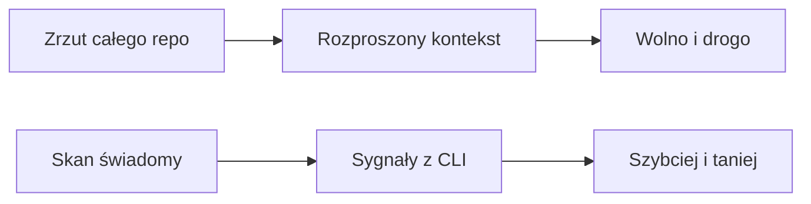
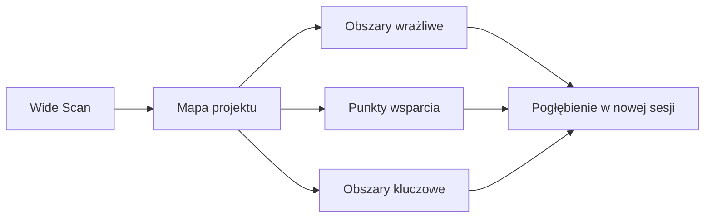
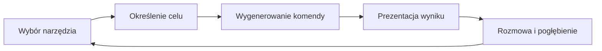
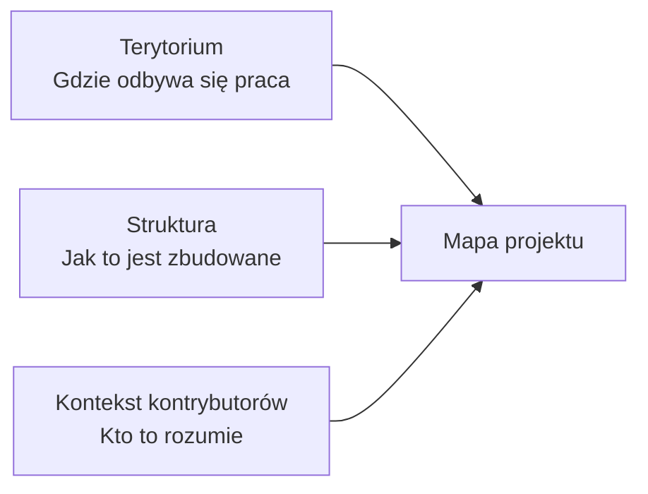
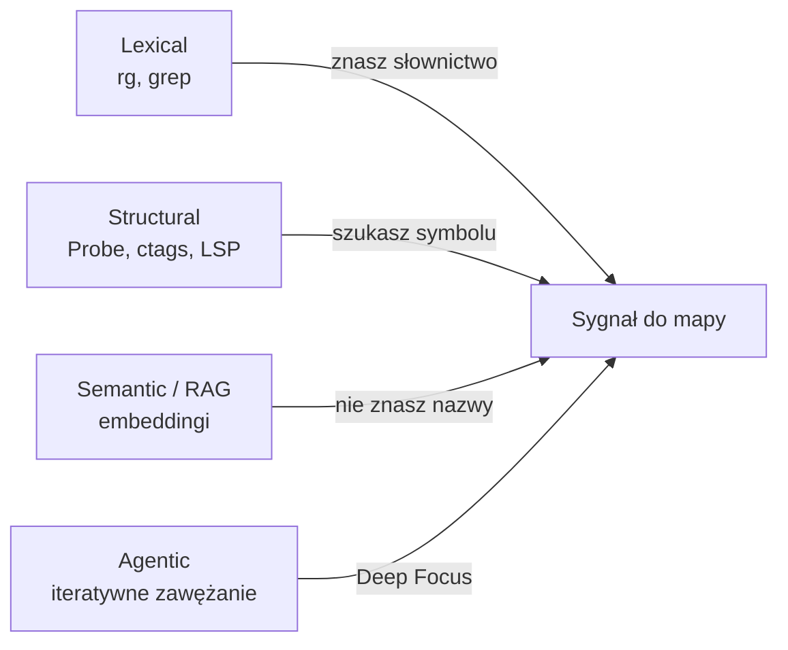
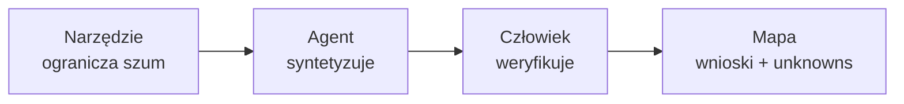

# Agent w projekcie legacy - generowanie Mapy projektu


<!-- cdn: https://images.przeprogramowani.pl/lessons/m4-l2/assets/cover.png -->

W poprzedniej lekcji ustawiliśmy fundament dla dużych projektów: jak świadomie zarządzać tym, co agent widzi w danym momencie. To była sytuacja, w której masz wpływ na projekt. Możesz poprawić `AGENTS.md`, uporządkować dokumentację, stworzyć trwały system notatek i stopniowo rozwijać procesy razem z repo.

A teraz wchodzisz w projekt, którego nie znasz.

Może to być legacy w pracy. Może to być stary moduł, do którego wracasz po roku. Może to być repo po innym zespole, z dokumentacją napisaną w czasach, kiedy ostatni deploy był jeszcze "tymczasowy".

Pierwszy odruch jest kuszący: "hej Agent, przeczytaj całe repo i wyjaśnij mi architekturę".

Brzmi rozsądnie. W końcu mamy duże okna kontekstowe, narzędzia do pakowania repo i modele, które potrafią długo rozumować.

Tyle że w naprawdę dużym projekcie taki prompt często odpada już na samym oknie kontekstowym. Duże okno rzędu 200K tokenów nie oznacza 200K tokenów na sam kod: w tym samym budżecie muszą zmieścić się instrukcje systemowe, reguły projektu, definicje narzędzi, historia rozmowy i miejsce na odpowiedź modelu.

Kod dodatkowo tokenizuje się nierówno. Prosty przelicznik "1 token ≈ 4 znaki" daje tylko intuicję, bo liczba tokenów zależy od modelu, domeny tekstu i języka. W praktyce 200K tokenów to rząd kilkudziesięciu tysięcy linii kodu w najlepszym scenariuszu, a po doliczeniu testów, konfiguracji, dokumentacji, plików generowanych i narzutu samych narzędzi twój budżet znika szybciej, niż sugeruje sama liczba.

Bez dodatkowych technik zarządzania kontekstem zadanie "zbadaj to repo" często po prostu nie mieści się w oknie modelu.

Drugi problem jest subtelniejszy. Nawet jeśli fragment projektu technicznie się zmieści, "dużo kontekstu" nie oznacza "dobre zrozumienie". Jeśli wrzucisz agentowi wszystko naraz, dostaniesz płaskie streszczenie bez priorytetów: trochę folderów, kilka trafnych nazw, parę domysłów i fałszywe poczucie, że rozumiesz system.

W tej lekcji nauczysz się procesu, który rozwiązuje oba problemy. Roboczo nazywamy go **Wide Scan -> Deep Focus**. Najpierw robisz szeroki skan repozytorium tanimi i deterministycznymi narzędziami CLI. Dzięki temu widzisz, które obszary są kluczowe, aktywne, sprzężone i wrażliwe, zanim poprosisz agenta o kosztowne czytanie kodu.

Efektem będzie artefakt o nazwie **Mapa projektu**.

> **Mapa projektu** to operacyjna mapa terytorium projektu legacy. Zbierasz tanie sygnały z CLI, prosisz agenta o syntezę i dostajesz krótki artefakt: moduły, entry pointy, kierunki zależności, cykle, wrażliwe obszary, niewiadome oraz miejsca, które trzeba zabezpieczyć przed większą zmianą.
>
> Po co nam ta mapa? Żeby nie spalać okna kontekstowego na losowe czytanie plików i nie zmieniać legacy na ślepo. Mapa mówi agentowi i człowiekowi: "tu jest rdzeń systemu, tu są ryzyka, tu zmiana może przejść przez kilka warstw, tutaj najpierw sprawdź dowody".
>
> Ważne: Prezentujemy jeden z przykładowych formatów takiej mapy. W swoich projektach te praktyki możesz dostosować do swoich potrzeb i pogłębić zakres wykonywanych zapytań.

Będziemy zapisywać ją w repo jako `context/map/repo-map.md`. To nie ma być esej dla człowieka ani zrzut z chatu. To ma być format przyjazny agentowi: krótkie sekcje, konkretne listy, ślady dowodów z komend, jawne `niewiadome` i wyraźne miejsca, w których trzeba uważać przed większą zmianą.

Po drodze powstaną trzy robocze artefakty w tym samym folderze:

```text
context/map/artifact-1-territory.md
context/map/artifact-2-structure.md
context/map/artifact-3-contributors.md
```

To są notatki robocze z kolejnych skanów (nazewnictwo to kwestia zupełnie subiektywna, możesz to zorganizować wg własnych preferencji). Finalna **Mapa projektu** powstaje dopiero po ich syntezie w `context/map/repo-map.md`.

### Dlaczego nie zaczynamy od całego repo

Zasada z poprzedniej lekcji jest prosta: agent działa lepiej, gdy dostaje właściwy kontekst we właściwym momencie. W projekcie legacy problem jest trudniejszy, bo nie masz jeszcze uporządkowanej pamięci projektu. Musisz ją zbudować od zera, bez przepalania okna kontekstowego na losowe czytanie plików.

Dwie lekcje preworku ustawiają fundament pod tę decyzję: w [3.1] mówiliśmy, że model nie ma magicznej pamięci projektu i operuje tylko na tym, co trafia do okna kontekstowego, a w [3.3] dokładaliśmy strategię `Select`, czyli wybieranie kontekstu potrzebnego do następnego kroku.

Ta lekcja jest praktycznym zastosowaniem obu zasad w legacy: nie wrzucasz wszystkiego "na wszelki wypadek", tylko najpierw ustalasz, co naprawdę warto czytać. Podobnie jak programista, który siadając do buga albo poprawki, mniej lub bardziej świadomie selekcjonuje to, który fragment projektu "załadować do pamięci".

Gdy prosisz agenta o przeczytanie całego repo, mieszasz niestety trzy różne zadania:

- przeszukiwanie struktury projektu (tool calle),
- wybranie obszarów ważnych dla architektury (reasoning + tool calle),
- głębokie zrozumienie konkretnego zachowania (reasoning).

To zbyt wiele naraz. Agent może wtedy poprawnie nazwać kilka katalogów, ale nie wie jeszcze, które zależności są krytyczne, które entry pointy są realnie używane, gdzie są cykle i gdzie warto zużyć uwagę człowieka.

Dlatego zamiast pełnego zrzutu robimy najpierw szeroki skan i wyciągamy kontekst klasycznymi narzędziami.


<!-- rendered: ../../assets/diagrams/lessons-m4-l2-lesson-draft-1-10x.png | cdn: https://images.przeprogramowani.pl/diagrams/lessons-m4-l2-lesson-draft-1-10x.png -->

Zwróć uwagę na różnicę w obu podejściach. Narzędzia CLI nie "rozumieją architektury" za ciebie. One redukują szum.

Zamiast karmić model setkami plików, dajesz mu wyniki komend: listę entry pointów, graf zależności, cykle, symbole, podejrzane importy i krótkie sygnały z historii zmian. Agent interpretuje mniejsze, lepsze dane.

To jest różnica między "czytaj wszystko" a "zinterpretuj dowody".

> Część z narzędzi, które w tej lekcji wywołujemy wprost, agent potrafi wykonać "w locie" w trakcie procesu rozumowania. Nam chodzi jednak o to, aby każdy tool call i każdy "peek" w dany obszar repo wykonywać celowo, aby pozyskać konkretną i powtarzalną porcję informacji.

### Wide Scan -> Deep Focus

Nasz dwuetapowy proces pozyskiwania kontekstu z dużego repo to bezpośrednia odpowiedź na limity okna kontekstowego i tego, jak nieprzewidywalne bywa działanie LLMów bez określonych ram.

W celu zrozumienia nowego projektu wykonamy więc dwa etapy analizy:

**Wide Scan** to szeroka, płytka analiza repozytorium, do której spokojnie wystarczy tańszy model. Szukasz sygnałów: historii modułów, entry pointów, kierunku zależności, cykli, granic, aktywnych przepływów zmian i miejsc, które wymagają ostrożności. To jeszcze nie jest pełne zrozumienie systemu, ale zawęża dalsze poszukiwania.

**Deep Focus** to głęboka analiza jednego obszaru, na którą warto już wypuścić mocniejszego agenta. Bierzesz jeden feature, jeden moduł albo jedno podejrzane zgrupowanie elementów i śledzisz realny przepływ danych, zachowanie, ryzyka oraz miejsca do modernizacji.

W tej lekcji wykonujemy **Wide Scan** i kończymy Mapą projektu. W kolejnej lekcji wybierzemy jeden z wrażliwych obszarów, żeby wejść w Deep Focus.

Mapa sama w sobie ma już odpowiedzieć na praktyczne pytanie: "gdzie w tym legacy muszę uważać?".


<!-- rendered: ../../assets/diagrams/lessons-m4-l2-lesson-draft-2-10x.png | cdn: https://images.przeprogramowani.pl/diagrams/lessons-m4-l2-lesson-draft-2-10x.png -->

Taka kolejność pracy chroni cię przed dwoma błędami.

Pierwszy błąd to losowy deep-read. Agent otwiera plik, który wygląda ważnie, potem kolejne importy, potem jeszcze trzy sąsiednie moduły, a po kilkunastu tool callach okazuje się, że to stary adapter, którego nikt już nie używa.

Technicznie "coś przeczytał", ale zapłaciłeś za to oknem kontekstowym, tokenami i szumem w rozmowie. To jest bezsensowne sito: dużo ruchu, mało decyzji.

Drugi błąd to mapa bez decyzji. Jeśli mapa nie wskazuje istotnych obszarów projektu, potencjalnych ryzyk, wrażliwych modułów i miejsc do dalszego sprawdzenia, to jest tylko obrazkiem.

Dobra mapa jest operacyjna. Ma przyspieszać wejście w kluczowe części legacy, a nie udawać, że samo narysowanie grafu oznacza zrozumienie systemu.

Dobra mapa kończy się decyzją: "te obszary są naprawdę istotne; tutaj zmiana ma największą szansę przejść przez kilka warstw; tutaj najpierw sprawdzamy dowody, testy, historię PR-ów i unknowns".

### Czego nie mówi drzewko katalogów

Kiedy wchodzisz w obce legacy, eksplorator plików daje szybkie poczucie kontroli.

Widzisz `src/`, `pages/`, `services/`, `domain/`, `components/`, `shared/`. Możesz rozwinąć drzewko, policzyć katalogi, znaleźć największe pliki i poprosić agenta: "opisz mi architekturę na podstawie struktury katalogów".

To jest dobry start, ale zły model rzeczywistości.

Foldery pokazują statyczny snapshot: gdzie coś leży dzisiaj. Nie pokazują dynamiki projektu:

- które miejsca naprawdę zmieniają się co tydzień,
- które foldery są pozostałością po starym podziale zespołu,
- które moduły zawsze pękają razem przy jednej zmianie,
- gdzie zespół najczęściej naprawia błędy,
- które ścieżki są "martwe", a które są krytyczne dla biznesu,
- kto ma ukrytą wiedzę o danym obszarze.

Klasyczny search ma ten sam problem. `search: "payments"` znajdzie pliki ze słowem `payments`, ale nie powie ci, czy płatności są sterowane przez webhooki, joby, panel admina, feature flagi, czy ręczne migracje danych. `search: "auth"` pokaże miejsca, gdzie pojawia się nazwa, ale nie odróżni rdzenia uwierzytelniania od testowego helpera, starego adaptera i komentarza w README.

Eksplorator plików odpowiada na pytanie: "co tu jest?". Mapa projektu musi odpowiedzieć na trudniejsze pytanie: "co tutaj jest ważne, powiązane, aktywne i ryzykowne?".

Na tym etapie nie musisz jeszcze oceniać jakości każdego modułu. Wystarczy, że przestajesz traktować układ katalogów jak prawdę i zaczynasz traktować go jak pierwszą hipotezę do sprawdzenia.

### Efektywna Mapa projektu

Użyteczna mapa powinna odpowiedzieć na kilka pytań:

- **kluczowe moduły i ich rola** - jakie większe części tworzą system i za co odpowiadają,
- **częstotliwość zmian** - które obszary są często dotykane w historii gita, a które wyglądają na stabilne,
- **obszary wrażliwe** - gdzie zmiana może mieć duży koszt: auth, płatności, dane, cache, integracje, migracje, runtime config,
- **coupling i blast radius** (sprzężenie i zasięg, w jaki zmiana może się rozlać) - które moduły są mocno powiązane przez importy, cykle, wspólne helpery, publiczne kontrakty albo częste współzmiany,
- **kontrybutorzy** - kto najczęściej pracował przy danym obszarze i gdzie może istnieć ukryta wiedza zespołowa.

Najważniejsze jest to, że mapa ma być użyteczna decyzyjnie. Nie musi być kompletna. Ma być wystarczająco dobra, żeby powiedzieć: "rozumiem główny układ projektu, widzę miejsca wymagające ostrożności i wiem, gdzie zmiana może mnie zaskoczyć".

### Język naturalny i przewidywalne CLI

W tym miejscu agent zaczyna mieć bardzo praktyczny sens. Nie dlatego, że "magicznie rozumie repo", ale dlatego, że dobrze łączy dwa światy: język naturalny i przewidywalne narzędzia CLI.

Ty możesz zadać pytanie po ludzku: "pokaż mi entry pointy", "sprawdź, które moduły importują auth", "znajdź miejsca, gdzie frontend sięga bezpośrednio do bazy", "pokaż pliki najczęściej zmieniane w ostatnim roku". Agent może przełożyć takie pytanie na serię konkretnych komend: `rg`, `find`, `git log`, analizę importów, narzędzie do grafu zależności albo strukturalne wyszukiwanie po AST.

Jak już wiesz, CLI aż do momentu zwrócenia wyników działa poza oknem kontekstowym modelu. Komenda może przejść przez tysiące plików, historię gita albo cały graf importów, a do rozmowy trafia dopiero skondensowany wynik: lista ścieżek, licznik zmian, kilka cykli, fragment JSON-a, tabela podejrzanych zależności.

Potem zaczyna się część, w której agent jest najbardziej użyteczny: możesz rozmawiać z wynikami.

Nie musisz od razu wiedzieć, jaka komenda będzie idealna. Możesz zapytać: "czy to wygląda na rdzeń systemu?", "które z tych wyników są szumem?", "co powinniśmy sprawdzić dalej?", "zawęź to do modułu płatności", "porównaj to z historią zmian". Agent prowadzi cię od szerokiego sygnału do kolejnego, bardziej precyzyjnego pytania.

W Wide Scan nie chodzi więc o to, żeby agent sam wymyślił architekturę. Chodzi o pętlę:


<!-- rendered: ../../assets/diagrams/lessons-m4-l2-lesson-draft-3-10x.png | cdn: https://images.przeprogramowani.pl/diagrams/lessons-m4-l2-lesson-draft-3-10x.png -->

To połączenie jest mocniejsze niż samo klikanie po eksploratorze plików i bezpieczniejsze niż wrzucanie agentowi całego repo. Najpierw każesz narzędziom zebrać dowody. Dopiero potem prosisz agenta o interpretację.

### Trzy składowe Mapy projektu

Żeby zorientować się w dużym legacy, potrzebujesz trzech różnych pytań i trzech różnych źródeł sygnałów, które razem budują jedną Mapę projektu.

**Terytorium** — gdzie naprawdę odbywa się praca, które obszary są aktywne, które zamrożone, które zmieniają się razem i gdzie częsta praca może zwiększać ryzyko przypadkowej regresji.

**Struktura** — entry pointy, warstwy systemu, kierunek importów, powiązania, kontrakty i miejsca, których nie widać z samego drzewa katalogów.

**Kontekst kontrybutorów** — kto pracował przy trudnych edge case'ach, protokołach, migracjach, uprawnieniach albo awaryjnych poprawkach.

Każda składowa odpowiada na inne pytanie. Dopiero razem dają Mapę projektu, na której warto podejmować decyzje. Ważne: nie czekasz z interpretacją do końca. Po każdej składowej zapisujesz, co już wynika dla pracy w legacy.


<!-- rendered: ../../assets/diagrams/lessons-m4-l2-lesson-draft-4-10x.png | cdn: https://images.przeprogramowani.pl/diagrams/lessons-m4-l2-lesson-draft-4-10x.png -->

W poniższych przykładach pracujemy na repozytorium **Mattermost**, czyli platformie open-source do komunikacji zespołowej (backend Go, frontend React/TypeScript). To projekt z wieloletnią historią, dziesiątkami kontrybutorów i kilkoma wyraźnymi warstwami: `server/channels` jako logika domenowa, `webapp/channels` jako produkcyjny UI, `server/public` jako publiczne modele i kontrakt API. I, co najważniejsze, ze skalą rzędu miliona linii kodu, której w całości nie wciśniesz w okno kontekstowe żadnego modelu z 2026 roku. To realne legacy, które możesz sam sprawdzić.

> Zapoznaj się z tą lekcją na przykładzie Mattermost. Ćwiczenia praktyczne wykonaj na dowolnym projekcie, który masz pod ręką — niekoniecznie tym z lekcji.

### Mapa terytorialna — gdzie projekt żyje

> W tej sesji nie zaczynamy od gotowego skilla. Na wczesnym etapie wystarczą krótkie prompty pisane ad hoc. Dopiero po kilku takich sesjach eksploracyjnych na różnych projektach zaczniesz dostrzegać powtarzalne procedury, które warto wynieść do osobnego, reużywalnego skilla dla agenta.

Zanim otworzysz jakikolwiek plik, warto wiedzieć, które obszary są aktywne, a które zamrożone. Mało co odpowiada na to pytanie szybciej niż historia Gita. Ale co tu do odkrycia? Przecież większość z nas korzysta z jakiegoś klienta, który potrafi rysować branche. Czujemy, że to za mało na pełne zrozumienie kodu odziedziczonego - bo aktywność to nie tylko zmiany i punktowe operacje, ale przekrojowa narracja o tym, co i za sprawą kogo się wydarzyło w projekcie.


<!-- cdn: https://images.przeprogramowani.pl/lessons/m4-l2/assets/kraken.png -->

Faktycznie - klienci Gita operują na tych samych modelach, co sam git - commity, branche, cherry-picki, fixy - niby widać co się dzieje, a jednak żeby **naprawdę zrozumieć co się dzieje**, to często za mało. Właśnie dlatego do nawigacji po tych skomplikowanych strukturach zapraszamy agenta, który ma dla nas rozwikłaś kilka zagadek.

Zobaczmy to na przykładzie:

<div style="padding:56.25% 0 0 0;position:relative;"><iframe src="https://player.vimeo.com/video/1199008037?badge=0&amp;autopause=0&amp;player_id=0&amp;app_id=58479" frameborder="0" allow="autoplay; fullscreen; picture-in-picture; clipboard-write; encrypted-media; web-share" referrerpolicy="strict-origin-when-cross-origin" style="position:absolute;top:0;left:0;width:100%;height:100%;" title="M4 L2 git search"></iframe></div><script src="https://player.vimeo.com/api/player.js"></script>

Pierwsze pytanie do agenta powinno od razu filtrować projekt pod kątem wrażliwości:

```text
Korzystając z historii gita, w zakresie ostatnich 12 miesięcy, pokaż TOP 10 najczęściej modyfikowanych:

a) folderów lub modułów
b) plików

Odfiltruj szum: lockfile'y, snapshoty, generowane pliki, dotenvy, configi, etc.

Możesz zejść poziom niżej jeśli pierwsza seria wyników da ogólne rezultaty jak "src/frontend" i "src/backend" - chcemy poznać realne obszary aktywności hands-on.
```

Agent przetłumaczy to na konkretne komendy, które zliczają zmiany w plikach w zadanym okresie. W odpowiedzi zobaczysz, które katalogi były najczęściej dotykane w ostatnich 12 miesiącach — już po odfiltrowaniu szumu w postaci lokalizacji, lockfile'ów i plików generowanych.

Wynik dla Mattermost:


<!-- cdn: https://images.przeprogramowani.pl/lessons/m4-l2/assets/git-annual.png -->

Konsola admina to bezsprzecznie główny obszar, w którym ostatnio odbywa się praca. Ale jeden ranking nie mówi dwóch rzeczy: czy dany obszar jest stałym centrum, czy sezonową kampanią zmian — i czy jest gorący dlatego, że przechodzi przez niego ważna funkcja, czy raczej dlatego, że ciągle coś się tam psuje i poprawia. To nie to samo, a po samej liczbie zmian łatwo pomylić jedno z drugim. Dlatego warto zapytać dalej.

Drugie pytanie może brzmieć tak:

```text
Podziel te same dane na kwartały — chcę zobaczyć, jak zmieniał się nacisk pracy w projekcie przez ostatni rok.
```

Wyniki to pogłębiony opis pierwszego raportu:

```text
Trend

  - admin_console dominuje przez cały rok, ale jego udział maleje: Q2 peak 254, Q3 233, Q4 206.
  - Backend storage był najmocniejszy w Q1 (server/channels/store/sqlstore, storetest), potem spada.
  - mmctl było wyraźnie aktywne w Q1-Q2, znika z TOP 10 w Q3-Q4.
  - Q4 przesuwa nacisk w stronę e2e: enterprise, messaging, Playwright functional/lib.
  - Q3 mocniej dotykał postów i warstwy app: server/channels/app/post.go, post_test.go, server.go.
```

Trzecie pytanie:

```text
Jakie pary lub trójki katalogów najczęściej pojawiają się w tych samych commitach? Wyszukaj sprzężenia i krótko podsumuj wnioski dla top 3 z naszego rankingu.
```

<!-- cdn: https://images.przeprogramowani.pl/lessons/m4-l2/assets/git-cochange.png -->

Te współzmiany patrzą na projekt z poziomu folderów. Zanim ruszysz dalej, dorzuć jeszcze jedno pytanie — o rzeczy, które łatwo przeoczyć:

```text
Jeszcze dwie rzeczy przy okazji tych współzmian:

- Czy jest jakiś pojedynczy plik, który zmienia się razem z wieloma różnymi obszarami naraz? Myślę o czymś wspólnym dla całego repo — plik z tłumaczeniami, config, coś generowanego. Ciekawi mnie, czy poza podziałem na foldery jest jakiś taki "wspólny mianownik".
- I sprawdź, czy pliki, które wyszły jako mocno sprzężone, na pewno nadal są w repo. To historia, więc coś mogło dużo się zmieniać, a potem zostać usunięte albo przeniesione — nie chcę później opierać analizy na pliku, którego już nie ma.
```

To jest inny sygnał niż sam ranking aktywności: pokazuje ukryte sąsiedztwa i zmiany cross-layer. Pamiętaj tylko, że współzmiany to historia — pokażą, co zmieniało się razem, ale nie powiedzą ci, czy te pliki wciąż istnieją (stąd drugie pytanie powyżej) ani czy coś, co *powinno* zmieniać się razem, przypadkiem tego nie robi. To pierwsze wyłapujesz od razu; to drugie zapisujesz jako `unknown` do sprawdzenia później.

**Zapisz teraz wyniki całej sesji do artefaktu pomocniczego:**

```text
Zapisz podsumowanie tej sesji do `context/map/artifact-1-territory.md`
```

Tak wygląda początek zapisanego artefaktu:


<!-- cdn: https://images.przeprogramowani.pl/lessons/m4-l2/assets/artifact-territory.png -->

> Jeśli potrzebujesz większej precyzji, możesz wykonać podobny raport w ramach konkretnego folderu. Poinstruuj agenta wprost, żeby rootem wyszukiwania był określony folder a nie root repozytorium.

Równie istotna jak same dane jest zajętość okna kontekstowego. Tak wykonana analiza w modelu Claude Sonnet 4.6 zostawiła okno zajęte na zaledwie 45 tys. tokenów, z czego same wiadomości to 23 tys. W Codexie zatrzymaliśmy się na 50 tys. tokenów. To wciąż mnóstwo miejsca na jakościową rozmowę z agentem.


<!-- cdn: https://images.przeprogramowani.pl/lessons/m4-l2/assets/git-context.png -->

### Mapa strukturalna — jak to jest zbudowane

Historia gita mówi "gdzie patrzeć". Następne pytanie brzmi: "jak to jest zbudowane?".

Zamiast otwierać kolejne pliki, przy pomocy agenta możemy wygenerować użyteczny graf zależności danego obszaru kodu.

Tutaj pomaga `dependency-cruiser` (`depcruise`), czyli CLI, które buduje **statyczny graf importów** całego obszaru kodu i emituje go w wielu formatach przyjaznych zarówno dla człowieka, jak i dla agenta: `DOT` (renderowany do SVG/PNG przez Graphviz), `Mermaid`, `JSON`, `Markdown`, `HTML` i `CSV`. Na rzecz tej lekcji wykorzystamy go w stacku `JS/TS`, a na końcu sekcji wymienimy alternatywy pod inne języki.

Warto wiedzieć, że z jednego narzędzia wyciągniesz **cztery różne sygnały** do Mapy projektu — i to nie tylko dla całego repo, ale dla pojedynczego, wskazanego modułu:

- **Mapa terytorium modułu** — zwijając graf do poziomu folderów (`--collapse`) zobaczysz moduły jako węzły, kierunek zależności i centralne huby, zamiast setek plików.
- **Fokus na jeden moduł** — `--focus` albo `--include-only` wycina wybrany obszar i jego sąsiadów, dzięki czemu graf pozostaje czytelny i decyzyjny.
- **Metryki sprzężenia** — `--metrics` liczy tzw. afferent coupling (`Ca`, ilu od modułu zależy), efferent coupling (`Ce`, od ilu zależy moduł) oraz `instability = Ce / (Ca + Ce)`. To zamienia „wydaje mi się, że to mocno sprzężone" w konkretną współrzędną.
- **Cykle i splątane granice** — reguła `no-circular` znajduje cykle importów, które są typowym źródłem trudnego do przewidzenia blast radius i dobrym kandydatem na cel Deep Focus.

`dependency-cruiser` instalujesz jak każde narzędzie Node.js, przez npm, yarn albo pnpm, i uruchamiasz jako CLI tam, gdzie działa twój toolchain JS. Obsługuje JavaScript, TypeScript, LiveScript i CoffeeScript oraz moduły ES6, CommonJS i AMD, więc dobrze pasuje do frontendów, backendów Node.js i monorepo JS/TS. Jeśli potrzebujesz tylko szybkiego wykrycia cykli i prostego grafu, sięgnij po **madge**: działa w ekosystemie Node.js i obsługuje preprocesory CSS, a przy TypeScript wymaga dopięcia `tsconfig` i resolverów.

#### Pierwsze kroki

`dependency-cruiser` znajdziesz na GitHubie w repozytorium `sverweij/dependency-cruiser` oraz w rejestrze npm jako pakiet `dependency-cruiser`.

Instrukcje dla agenta uzyskasz wskazując na surowe pliki `.md` z GitHuba:

```text
Zapoznaj się z https://raw.githubusercontent.com/sverweij/dependency-cruiser/refs/heads/main/doc/cli.md i skonfiguruj to narzędzie w moim projekcie.
```

Możesz też zrobić to klasycznie, instalując bibliotekę w twoim projekcie (stack JS/TS - np. 10xCards):

```bash
npm install --save-dev dependency-cruiser
```

Jeśli używasz innego package managera:

```bash
yarn add -D dependency-cruiser
pnpm add -D dependency-cruiser
```

#### Pozyskujemy informacje o strukturze

Nasze pytania do `dependency-cruiser` mogą powstawać ad hoc, ale teraz naturalnie możemy też wyjść od `context/map/artifact-1-territory.md` (w nowej sesji). Historia zmian mówi, które obszary są aktywne. Graf zależności pomaga sprawdzić, czy aktywny plik jest realnym centrum, cienkim wejściem, kontraktem między warstwami albo częścią większego korytarza zmian.

Zanim agent wygeneruje pierwszy graf, jedna uwaga praktyczna: `dependency-cruiser` analizuje kod import po imporcie, więc potrzebuje toolchainu projektu (np. zainstalowanego `typescript` lub po prostu gotowego `npm install`).

Chociaż `dependency-cruiser` generuje znakomite grafy, poniższe prompty nie zaczynają od obrazka. Na tym etapie lepszy jest **Markdown z tabelami**. Najpierw chcemy dostać krótką odpowiedź: gdzie kod jest splątany, czy warstwy projektu nadal trzymają swoje granice i które miejsca będą bolesne przy testach. Markdown łatwo przeczytać, łatwo wkleić do `context/map/artifact-2-structure.md` i łatwo potem doprecyzować w rozmowie z agentem. JSON zostaw na sytuację, w której chcesz automatycznie porównywać wyniki między uruchomieniami, a SVG na finalną prezentację (jego generowanie trwa najdłużej).

**0. Co może nam zaoferować to narzędzie?**

Jeśli korzystasz z dowolnego narzędzia po raz pierwszy, warto zapytać agenta o potencjalne kierunki działania:

```text
Daj mi top 3 pomysły na eksplorację kodu legacy z biblioteką dependency-cruiser.

Chcę zrozumieć istotne i najbardziej wrażliwe na zmiany obszary, a także potencjalny dług technologiczny.

Jakiego rodzaju raporty mogę generować?
```

Po uzyskaniu wyników możesz przejść do konkretnej analizy.

**1. Cykle w aktywnych obszarach frontendowych**

```text
Użyj dependency-cruiser dla `webapp` i sprawdź cykle zależności w najaktywniejszych obszarach z `context/map/artifact-1-territory.md`: `channels/src/components/admin_console`, `channels/src/packages`, `channels/src/utils`, `channels/src/actions`, `platform/client/src`, `platform/types/src`.

Nie interesuje mnie pełna lista wszystkiego w repo. Chcę zobaczyć tylko te cykle, które dotykają obszarów aktywnych według mapy terytorium. Dla każdego cyklu napisz prostym językiem, dlaczego może utrudnić zmianę w repo legacy.

Format odpowiedzi:
- Nie generuj Graphviz/DOT na tym etapie.
- Zwróć wynik w Markdown.
- Zacznij od 3-5 najważniejszych obserwacji.
- Potem użyj tabeli z kolumnami:
  - Obszar
  - Co znalazłeś
  - Dowód z dependency-cruiser
  - Dlaczego to ważne przy zmianie
  - Związek z `artifact-1-territory.md`
  - Co sprawdzić dalej
```

**2. Granice warstw: `channels`, `platform/client`, `platform/types`**

```text
Sprawdź, czy frontend respektuje granice warstw: `platform/types` jako fundament, `platform/client` poniżej `channels/src`, oraz brak niedozwolonych importów między tymi obszarami.

Zinterpretuj wyniki w kontekście aktywności z `context/map/artifact-1-territory.md`, szczególnie dla `admin_console`, `packages`, `client` i `types`. Chcę wiedzieć, czy często zmieniane miejsca korzystają z tych warstw w przewidywalny sposób, czy widać importy, które mogą zaskoczyć przy zmianie.

Format odpowiedzi:
- Nie generuj Graphviz/DOT na tym etapie.
- Zwróć wynik w Markdown.
- Zacznij od 3-5 najważniejszych obserwacji.
- Potem użyj tabeli z kolumnami:
  - Sprawdzana granica
  - Wynik
  - Dowód z dependency-cruiser
  - Dlaczego to ważne przy zmianie
  - Związek z `artifact-1-territory.md`
  - Co sprawdzić dalej
```

**3. Ryzyka testów wynikające z grafu zależności**

```text
Użyj dependency-cruiser dla `webapp` i przeanalizuj ryzyka testowalności w najaktywniejszych obszarach z `context/map/artifact-1-territory.md`: `admin_console`, `packages`, `utils`, `actions`, `platform/client`, `platform/types`.

Sprawdź, które miejsca mogą być trudne do testowania w izolacji, bo ciągną za sobą dużo importów, akcje, klienta API, globalny stan, wspólne utilsy albo typy z platformy. Zwróć konkretną listę ryzyk: gdzie prawdopodobnie trzeba będzie dużo mockować, gdzie lepszy będzie test integracyjny, a gdzie zmiana może naturalnie kończyć się testem e2e.

Format odpowiedzi:
- Zwróć Markdown, bez Graphviz/DOT.
- Użyj sekcji:
  - `Podsumowanie`
  - `Lista ryzyk testowych`
  - `Najbardziej podejrzane moduły`
  - `Co sprawdzić dalej`
  - `Opcjonalny kolejny krok: graf`
```

Graphviz zostawiamy jako krok po selekcji, nie jako pierwszy output. Po analizie Markdown prosisz agenta o wyrenderowanie tylko tego, co ma już sens decyzyjny: jednego cyklu, jednej granicy warstw albo jednego fragmentu z ryzykiem testowym. Wtedy prompt może brzmieć:

```text
Wybierz najważniejszy podgraf i wyrenderuj go do SVG przez Graphviz.

Nie renderuj całego `webapp`. Ogranicz zakres do wskazanych modułów, użyj `--focus`, `--include-only`, `--collapse` albo metryk fan-in/fan-out tak, aby graf odpowiadał na jedno pytanie z analizy.
```

**Zapisz teraz wyniki całej sesji do artefaktu pomocniczego:**

```text
Zapisz podsumowanie tej sesji do `context/map/artifact-2-structure.md`
```

W naszym przebiegu artefakt struktury zaczyna się tak:


<!-- cdn: https://images.przeprogramowani.pl/lessons/m4-l2/assets/artifact-structure.png -->

#### Jak ujarzmić zbyt gęsty graf

Surowy graf całego modułu prawie zawsze wychodzi jako hairball — setki krawędzi, nieczytelny, bezużyteczny decyzyjnie. `dependency-cruiser` (i sam Graphviz) dają jednak konkretne dźwignie, którymi możesz wymusić układ pod pytanie, które zadajesz. Poproś agenta o jedną z nich, zamiast godzić się na pierwszy zrzut:

| Cel | Dźwignia | Co robi |
|-----|----------|---------|
| **Widok z góry na dół** | `rankdir=TB` (w DOT przez `reporterOptions.dot.theme.graph.rankdir` albo prostym `sed 's/rankdir="LR"/rankdir="TB"/'`) | hierarchia pionowa zamiast poziomej |
| **Zwinięcie detalu do struktury** | `--collapse "^src/[^/]+"` | węzły = foldery, nie pojedyncze pliki |
| **Tylko upstream (kto zależy od X)** | `--reaches "X"` | wszystkie moduły, które prowadzą do X |
| **Tylko downstream (od czego zależy X)** | `--focus "X" --focus-depth N` | X i jego okolica do głębokości N |
| **Gotowy widok architektoniczny** | `--output-type archi` (auto high-level) | reporter zaprojektowany pod diagram architektury |
| **Tylko huby (filtr po stopniu)** | brak natywnej flagi — złóż z `--metrics` + `--include-only` | pokaż tylko węzły z dużą liczbą połączeń |
| **Bez zewnętrznych paczek (`node_modules`)** | `--exclude 'node_modules'` (a nie `doNotFollow`) | wycina `react`, `redux`, `@floating-ui` itp. z grafu |
| **Silnik układu** | `dot` (hierarchiczny) zamiast `fdp`/`sfdp` (force-directed) | hierarchiczny DAG zamiast chmury punktów |

> **Jak ignorować `node_modules` i inny szum.** Zewnętrzne paczki niemal nigdy nie należą do Mapy projektu — interesuje cię *twój* kod, nie graf `react` czy `lodash`. Uwaga na pułapkę: domyślny `doNotFollow: 'node_modules'` z konfiguracji **nie usuwa** paczek, tylko przestaje wchodzić w ich głąb — wciąż rysuje je jako węzły-liście, które zaśmiecają render. Żeby zniknęły całkowicie, użyj `exclude` (w konfiguracji albo flagą `--exclude`). Ten sam wzorzec stosuj do testów, stories, snapshotów i kodu generowanego: `--exclude 'node_modules|\.test\.|\.stories\.|__snapshots__|\.d\.ts$'`. Po ludzku wystarczy: „pomiń node_modules i pliki testowe na grafie".

Nie musisz pamiętać tych wszystkich flag. Cała ta zabawa składaniem `--collapse`, `--focus`, `--reaches`, progów stopnia czy `rankdir` to robota dla agenta — to on przekłada twoje pytanie po ludzku na konkretne wywołanie `depcruise`. Ty pracujesz na poziomie wymagania, nie składni: „graf jest zbyt szczegółowy, pokaż tylko huby", „zwiń do folderów", „odwróć na pionowy", „pokaż tylko to, co zależy od work loopu". Agent generuje, ty patrzysz na wynik i korygujesz w tę samą, naturalną stronę — aż graf odpowie na twoje pytanie. To dokładnie pętla „wybór narzędzia → cel → komenda → wynik → rozmowa" z początku lekcji, tylko zastosowana do czytelności samego diagramu.

#### Alternatywy pod inne stacki

`dependency-cruiser` celuje w JS/TS, ale sam wzorzec jest uniwersalny: **statyczny graf importów → DOT/SVG/JSON → synteza agenta**. Większość poniższych narzędzi emituje DOT (ten sam format Graphviz), więc możesz wygenerować mapy z różnych stacków i poprosić agenta o jedną wspólną syntezę. Pytanie zostaje to samo: „czy ten moduł jest realnym centrum zależności, czy tylko cienkim wejściem?".

| Stack | Narzędzia | CLI / output |
|-------|-----------|--------------|
| JS/TS | `dependency-cruiser`, `madge`, `skott` | DOT, SVG, JSON, Mermaid; `skott` lepiej radzi sobie z path aliasami |
| Python | `Tach`, `pydeps` | Tach: `tach show` → DOT, `--web` graf, JSON; pydeps: `-T png/svg`, `--show-dot`, `--show-cycles` |
| Java | `jdeps`, Maven Dependency Plugin | jdeps (w JDK): `--dot-output`; Maven: `dependency:tree -DoutputType=json/dot/graphml/tgf` |
| Go | `goda`, `go mod graph` | goda: `goda graph ./...` → DOT (Graphviz), `-cluster` grupuje powiązane pakiety; `go mod graph` → tekstowy graf modułów |
| C# / .NET | `dotnet-deptree`, `NDepend` | dotnet-deptree: `-f svg/png/pdf/dot`; NDepend: graf + dependency matrix (komercyjne) |
| Swift | `spmgraph`, `swift package show-dependencies` | spmgraph: `visualize`/`lint` (wymaga Graphviz); SwiftPM: `--format json/dot/text` |
| Kotlin / Gradle | vanniktech `gradle-dependency-graph-generator`, `modules-graph-assert` | taski Gradle → png/svg/dot; modules-graph-assert wymusza reguły zależności w buildzie |

Każde z tych narzędzi ma granice, które warto zapisać jako `unknowns` w mapie: `jdeps` nie widzi zależności przez refleksję ani `Class.forName`, `goda` nie wykrywa automatycznie granic modułów Go, narzędzia JS/TS gubią importy za źle skonfigurowanymi aliasami, a graf statyczny nigdy nie pokaże zależności wstrzykiwanych w runtime (dynamic require, build-time injection, feature flagi, codegen). Te luki są częścią mapy, nie jej wadą.

### Mapa kontrybutorów — kto wie co i o co go zapytać

To jest warstwa, którą najczęściej pomija się w analizie legacy. I jest to błąd.

Kod można przeczytać. Decyzji, kontekstu i edge case'ów często już nie. Te rzeczy żyją w głowach ludzi, którzy przez ostatni rok dotykali danego obszaru. Mapa kontrybutorów odpowiada na pytanie: "kogo zapytać, zanim wprowadzę zmianę, którą ktoś już próbował zrobić rok temu?". I tu znowu wracamy do mocy `gita` i elastyczności agentów.

```text
Zapoznaj się z context/map/artifact-1-territory.md oraz context/map/artifact-2-structure.md, a następnie zidentyfikuj top 5 obszarów, które mogą wymagać potencjalnego kontaktu z kontrybutorami.
```

A teraz prosimy o linię ewentualnego wsparcia:

```text
Dla zidentyfikowanych obszarów pokaż kluczowych kontrybutorów z ostatnich 12 miesięcy. Odfiltruj boty i automatyzacje, a także commity agentów jak Claude, Codex czy Copilot, bez wyraźnego autorstwa człowieka.

Dla każdej osoby sklasyfikuj aktywności pogrupowane tematycznie, które mogą wskazywać kto zaoferuje support w wybranym obszarze tego projektu.
```

Wynik:


<!-- cdn: https://images.przeprogramowani.pl/lessons/m4-l2/assets/git-contributors-1.png -->

To jest wiedza o kontekście, której nie daje samo zliczenie commitów. Nie mamy tutaj suchej listy pt. "kto najczęściej dotykał kodu", tylko sensowne i rzeczowe informacje z odpowiedziami na pytanie "kto pracował nad jakim typem problemu w tym sektorze" — i do kogo warto zajrzeć przed wprowadzaniem zmian.

**Zapisz teraz wyniki całej sesji do artefaktu pomocniczego:**

```text
Zapisz wyniki do context/map/artifact-3-contributors.md
```

A co z `git blame`? `git blame` odpowiada na pytanie "kto zmienił tę linię?". Mapa kontrybutorów odpowiada na inne: kto ma kontekst do tego obszaru zmian i w jakim typie problemów się specjalizuje. Tutaj filtrujesz i precyzujesz dowolnie, znacznie szerzej, niż pozwala pojedyncze narzędzie w stylu `git blame` czy GitLens.

### Mapa projektu — finalna synteza

Po trzech składowych masz dużo sygnałów, ale jeszcze nie masz mapy. Pełny graf zależności zwykle jest zbyt gęsty, żeby pomagał w decyzji. Jeśli wkleisz do raportu automatycznie wygenerowany obraz z setkami krawędzi, dostaniesz dekorację, nie narzędzie pracy.

Mapa projektu ma być **syntezą dowodów**. Bierzesz wyniki z historii gita, grafu zależności i kontekstu kontrybutorów, a potem zostawiasz tylko to, co pokazuje kluczowe i wrażliwe obszary projektu.


```text
Jesteś inżynierem wprowadzającym nowego developera do dużego repo legacy.

Twoim zadaniem jest utworzyć dokument onboardingowy `context/map/repo-map.md` z trzech już istniejących artefaktów — nie generuj danych od zera, nie powtarzaj ich tabel w całości.

Kontekst do mapy:
- `context/map/artifact-1-territory.md`
- `context/map/artifact-2-structure.md`
- `context/map/artifact-3-contributors.md`

Zasady:
1. Łącz trzy perspektywy w jeden spójny obraz: gdzie żyje system → jak jest powiązany → kogo zapytać.
2. Pokaż realne granice i te miejsca, gdzie struktura katalogów nie odpowiada realnej aktywności.
3. Dokument ma prowadzić od szerokiego obrazu do 5–8 „pierwszych plików do przeczytania”.
4. Zaznacz wprost ograniczenia: to mapa aktywności i struktury w oknie 1 roku.
5. Przy sprzężeniach dopisz, skąd je wiesz: z grafu importów, z historii gita, czy to obszar, którego narzędzie w ogóle nie objęło (np. inny język albo część stacku bez grafu). Jeśli jakaś warstwa nie ma grafu zależności, powiedz to wprost — to jest `unknown`, a nie „brak powiązań”.
6. Jeśli coś zmienia się razem, bo jest generowane albo mockowane, a nie dlatego, że ktoś edytuje to ręcznie — oznacz to. Zmiana „przez regenerację” to inny, tańszy rodzaj sprzężenia niż ręczna edycja i inaczej waży przy ocenie kosztu zmiany.

Struktura `repo-map.md`:
1. TL;DR (5–7 zdań) — czym jest repo, główne warstwy (Mermaid), gdzie skupia się praca, gdzie boli.
2. Teren — duża odpowiedzialność vs peryferia; moduły głębokie i płytkie; aktywność w czasie.
3. Realne powiązania — co naprawdę zmienia się razem (couplingi + warstwy + cykle);
4. Strefy ryzyka — 4–6 obszarów wysokiego ryzyka z jedną linijką „dlaczego”
5. Kogo zapytać — per strefa: 1–2 kandydatów dopasowanych tematycznie.
6. Pierwszy dzień — uporządkowana lista 5–8 plików/modułów wejściowych do przeczytania.
7. Ograniczenia — okno czasowe, metoda, czego mapa NIE mówi.

## Format
Markdown z Mermaid, zwięźle, tabele tylko gdy realnie pomagają.

Cel: nowy developer po 15 min czytania wie, gdzie rzeczy żyją, co jest niebezpieczne i od czego zacząć.

Zapisz do `context/map/repo-map.md`.
```

Finalna mapa dla Mattermost zaczyna się od TL;DR, który w kilku zdaniach spina wszystkie trzy artefakty:


<!-- cdn: https://images.przeprogramowani.pl/lessons/m4-l2/assets/artifact-repo-map.png -->

Użyteczny dokument powinien realnie ułatwiać onboarding. Jeśli w tym workflow widzisz coś, co zrobiłbyś inaczej, śmiało dostosuj poszczególne elementy do swoich potrzeb i przyzwyczajeń.

## 🧑🏻‍💻 Zadania praktyczne

Na start pobierz paczkę promptów dla tej lekcji:

```bash
npx @przeprogramowani/10x-cli@latest get m4l2
```

Sklonuj na dysk repozytorium, którego nie znasz dobrze. Najlepiej sprawdzają się duże projekty open source — **Mattermost**, **tldraw**, **React** albo dowolny inny projekt w stacku, który rozumiesz wystarczająco, żeby zweryfikować mapę. Celem jest sprawdzenie, jak agent radzi sobie z generowaniem mapy na kodzie, którego nikt ci nie tłumaczył.

Twoim zadaniem jest zbudować **Mapę projektu ①** — korzystając z trzech składowych, które widziałeś w lekcji na przykładzie Mattermost.

Pracujemy w jednym folderze: `context/map/`. Najpierw zapisujesz tam trzy artefakty robocze, a dopiero na końcu robisz syntezę do finalnej mapy:

```text
context/map/artifact-1-territory.md
context/map/artifact-2-structure.md
context/map/artifact-3-contributors.md
context/map/repo-map.md
```

Jeśli katalog `context/map/` nie istnieje, utwórz go na początku ćwiczenia za pomocą `/10x-init`. `artifact-*.md` to raporty robocze. `repo-map.md` to finalna **Mapa projektu**: krótka, decyzyjna, oparta na dowodach i gotowa do użycia przez agenta w kolejnej sesji.

Finalny plik ma być czytelny dla człowieka i zoptymalizowany pod pracę w legacy: krótkie sekcje, listy z dowodami, jawne `unknowns` i wyraźne miejsca, w których trzeba uważać przed większą zmianą.

### Krok 0: Przygotuj folder mapy

Poproś agenta:

```text
Utwórz katalog `context/map/`, jeśli jeszcze nie istnieje.

W tym folderze będziemy pracować na czterech plikach:
- `artifact-1-territory.md` - historia zmian i aktywne obszary,
- `artifact-2-structure.md` - zależności, entry pointy, cykle i lokalne centra,
- `artifact-3-contributors.md` - kontekst kontrybutorów dla wybranego obszaru,
- `repo-map.md` - finalna synteza Mapy projektu.

Nie twórz jeszcze finalnej mapy. Najpierw zbierz raporty robocze.
```

### Krok 1: Terytorium — gdzie projekt żyje

Zacznij od historii gita. Nie czytasz jeszcze kodu; chcesz zobaczyć, gdzie projekt był realnie dotykany i które obszary mogą być wrażliwe przed większą zmianą.

Kluczowe pytania w tym kroku:

- które katalogi albo pliki były stale aktywne w ostatnich miesiącach,
- które katalogi lub pliki często zmieniają się razem w tych samych commitach,
- gdzie aktywność przecina się z runtime, auth, danymi, publicznym API, integracjami albo buildem,
- co trzeba odfiltrować jako szum: lockfile'y, snapshoty, pliki generowane, masowe formatowanie, lokalizacje.

Zapisz wynik jako `context/map/artifact-1-territory.md`.

### Krok 2: Struktura — zależności i powiązania

Jedno pytanie prowadzi ten krok: co realnie zależy od czego? Graf ma pokazać blast radius, lokalne centra i cienkie wejścia, nie tylko listę importów.

Kluczowe pytania w tym kroku:

- gdzie widać kontrakty używane między warstwami,
- które pliki są cienkimi wejściami, a które wyglądają jak głębsze centra,
- czy graf pokazuje cykle albo podejrzane zależności,
- kto zależy od danego modułu i co może pęknąć przy zmianie.

Zanim instalujesz nowe narzędzie, poproś agenta, żeby sprawdził package manager, istniejące skrypty, konfigurację workspace, aliasy ścieżek i to, czy projekt ma już narzędzie do grafu zależności. Możesz wybrać narzędzie preferowane w twoim ekosystemie.

Zapisz wynik jako `context/map/artifact-2-structure.md`.

### Krok 3: Kontekst kontrybutorów — kto wie co

Wybierz jeden obszar, który w poprzednich krokach wyglądał na centralny lub podejrzany.

Kluczowe pytania w tym kroku:

- kto najczęściej pracował przy wybranym obszarze w ostatnich 12 miesiącach,
- jakie tematy powtarzają się u konkretnych kontrybutorów,
- które PR-y, decyzje albo edge case'y warto przeczytać przed zmianą,
- czy wiedza o tym obszarze wygląda na rozproszoną, czy skupioną wokół kilku osób.

Zapisz wynik jako `context/map/artifact-3-contributors.md`.

### Krok 4: Poproś agenta o syntezę i diagram

Zbierz wnioski z kroków 1–3 i zredaguj je jako jeden artefakt: `context/map/repo-map.md`. Mapa ma być krótka, decyzyjna i oparta na dowodach, a nie pełnym opisem repo.

## Odbierz swoją odznakę

Po ukończeniu tej lekcji odbierz odznakę w sekcji [10xDevs Mission Log](https://platforma.przeprogramowani.pl/10xdevs-3/mission-log) a następnie pochwal się swoim osiągnięciem!

## 🔎 Deep Dive

Ta sekcja zawiera dodatkowe pogłębienie wiedzy na temat wybranych zagadnień związanych z lekcją. W tym Deep Dive znajdziesz:

- **Cztery rodziny wyszukiwania repo** — jak wybrać właściwy typ narzędzia zamiast szukać jednego "najlepszego".
- **Granice każdej składowej** — co deterministyczne CLI potrafi pokazać, a czego nie wolno z niego wywnioskować.
- **Dwa znaczenia semantic search** — jak nie pomylić AST-aware wyszukiwania z embeddingowym RAG.
- **Jak klasyfikować moduły na mapie** — co realnie liczy się przy statycznej analizie legacy: rola, coupling, metryki z grafu i pytania do agenta.

Ta sekcja nie jest obowiązkowa, ale warto się z nią zapoznać jeżeli chcesz zostać ekspertem.

### Cztery rodziny wyszukiwania repo

Kiedy pracujesz z dużym repo, pytanie "jak szukać?" jest ważniejsze niż "jakiego narzędzia użyć?".

Masz cztery rodziny. Każda odpowiada na inny typ pytania.

**Lexical / pattern search** (`rg`, `grep`) to tekstowe szukanie wzorców. Szybkie i tanie, ale wymaga znajomości słownictwa projektu. `rg "handler|controller|route"` zwróci dużo, ale nie odróżni rejestracji routera od komentarza ani importu z testów.

**Structural / symbol search** szuka po strukturze kodu albo symbolach — Probe, `universal-ctags`, SCIP, LSP i podobne indeksy kodu. To właściwy krok, gdy pytasz: "gdzie definiujemy ten symbol?", "które funkcje mają taką sygnaturę?", "gdzie jest kontrakt tej warstwy?". W tej lekcji traktujemy tę rodzinę jako pomocniczą orientację; główny sygnał struktury pochodzi z grafu zależności.

**Semantic / RAG search** korzysta z embeddingów nad chunkami kodu. Może pomóc, gdy nie znasz dokładnej nazwy, ale ma własne koszty: indeks może być nieświeży, chunk może odciąć istotny kontekst, a wynik zawsze wymaga weryfikacji w kodzie.

**Agentic search** to iteracyjne zawężanie przez agenta: stawia hipotezę, odpala narzędzie, czyta wynik, zmienia kierunek. To jest właściwe w Deep Focus. W Wide Scan musi być kontrolowane, bo inaczej agent zbacza w losowy obszar i zużywa budżet kontekstowy na czytanie starego adaptera.


<!-- rendered: ../../assets/diagrams/lessons-m4-l2-lesson-draft-5-10x.png | cdn: https://images.przeprogramowani.pl/diagrams/lessons-m4-l2-lesson-draft-5-10x.png -->

Nie traktuj tych rodzin jak rankingu. Jeśli pytasz "gdzie są endpointy?", zacznij od lexical albo structural. Jeśli pytasz "kto importuje moduł płatności?", weź graf zależności. Jeśli pytasz "gdzie jest definicja tego typu?", użyj symbol search. Jeśli pytasz "który feature przepływa przez te warstwy?" — to już temat kolejnej lekcji, Analiza feature z AI (M4L3).

### Granice każdej składowej

Żadna z trzech składowych Mapy projektu nie jest wyrocznią.

**Terytorium z historii gita** pokazuje, gdzie projekt był dotykany — nie dlaczego, nie czy słusznie. Obszar z dużą liczbą zmian może być centrum produktu albo miejscem, w którym przez rok naprawiano jeden trudny bug. Kwartalne rozbicie pomaga odróżnić stałe centrum od kampanii zmian, ale wniosek nadal jest hipotezą. Jest tu też pułapka świeżości: historia to dowód *w oknie czasowym*, nie zdjęcie stanu na dziś. Plik, który przez rok mocno się zmieniał, mógł już zostać usunięty albo przepisany — zanim oprzesz na nim wniosek, sprawdź, czy nadal istnieje w repo. I ostatnie ograniczenie współzmian: pokazują, co zmienia się *razem*, ale nigdy nie pokażą kontraktu, który *powinien* być zsynchronizowany, a w historii nie jest (klasyk: model na backendzie i jego ręcznie utrzymywany odpowiednik na froncie). Takie rzeczy zostają jako `unknown` do sprawdzenia w Deep Focus.

**Struktura z grafu zależności** pokazuje importy w danym momencie. Nie pokazuje intencji: `shared/utils` używany przez osiem modułów może być przemyślanym cross-cutting concern albo workiem na wszystko, czego nikt nie umiał nazwać. Cykl między modułami może być realnym problemem architektonicznym albo artefaktem konfiguracji buildowej. Ty to rozstrzygasz.

**Kontekst kontrybutorów z historii commitów** pokazuje, kto dotykał obszaru — nie kto jest formalnym właścicielem, nie kto nadal jest w firmie, nie czy decyzje z tamtych PR-ów są nadal słuszne. To punkt wejścia do rozmowy i przeczytania PR-ów, nie lista autorytetów.

Najlepszy workflow:


<!-- rendered: ../../assets/diagrams/lessons-m4-l2-lesson-draft-6-10x.png | cdn: https://images.przeprogramowani.pl/diagrams/lessons-m4-l2-lesson-draft-6-10x.png -->

### Dwa znaczenia "semantic search"

Łatwo o jedną pomyłkę przy wyborze narzędzia.

Część narzędzi mówi o "semantic code search", ale nie zawsze oznacza to embeddingi i wyszukiwanie wektorowe.

Probe jest dobrym przykładem: reklamuje się jako "semantic code search engine", ale jego "semantic" oznacza zwracanie **kompletnych funkcji i klas** zamiast pojedynczych linii tekstu — opartych o parsowanie AST przez tree-sitter, nie o embeddingi. To jest wyszukiwanie strukturalne, nie RAG.

To rozróżnienie ma znaczenie praktyczne:

| Rodzina | Mechanizm | Ryzyko |
|---------|-----------|--------|
| Structural (Probe, ctags, LSP) | Dopasowanie do symbolu, funkcji albo struktury kodu | Wymaga dobrego wzorca albo indeksu; wynik nadal wymaga weryfikacji |
| Semantic / RAG (embeddingi) | Podobieństwo wektorowe chunków | Nieświeży indeks, złe chunkowanie, wynik probabilistyczny |

Jeśli podasz agentowi wynik z narzędzia structural search i powiesz "to jest semantic search", agent może zacząć traktować go jak przybliżone podobieństwo zamiast jak precyzyjne dopasowanie struktury. Mapa dostanie zły rodzaj pewności.

### Jak klasyfikować moduły na mapie

Sama lista modułów nie wystarczy. Dobra Mapa projektu potrzebuje etykiet, które pomagają podjąć decyzję: gdzie czytać dalej, czego nie dotykać przypadkiem, które obszary są tylko tłem i które miejsca mają wysoką wrażliwość na zmianę.

W części głównej lekcji używasz grafu zależności, historii zmian i mapy kontrybutorów, żeby zebrać sygnały. Tutaj chodzi o następny krok: odróżnić sygnał ważny od szumu i zapisać go tak, żeby agent mógł użyć mapy w kolejnej sesji.

Nie chodzi o akademicką klasyfikację architektury. Chodzi o proste robocze oznaczenia, które wynikają z dowodów:

- **core / supporting / peripheral** - czy moduł jest blisko głównej wartości produktu, wspiera ją, czy jest dodatkiem,
- **deep / shallow** - czy moduł zawiera realną logikę i wiele wewnętrznych rozgałęzień, czy jest cienką warstwą wejścia albo adapterem,
- **stable / volatile / seasonal** - czy obszar zmienia się regularnie, prawie wcale, czy tylko w kampaniach,
- **load-bearing / contained** - czy wiele części systemu zależy od tego modułu albo jego kontraktów,
- **high / medium / low sensitivity** - jak ostrożnie trzeba podchodzić do zmian w tym obszarze.

Najważniejsza zasada: **etykieta bez dowodu jest domysłem**. Jeśli agent pisze, że `billing` jest core, powinien pokazać, skąd to wie: entry pointy, importy, historię zmian, ścieżki zależności, publiczne typy, workspace package, konfigurację runtime albo powtarzające się co-change.

W praktyce najbardziej istotne są cztery pytania.

Pierwsze: **czy to jest core?** Core to nie "największy folder" ani "najładniejsza nazwa". Core to obszar, przez który przechodzi główna wartość produktu albo krytyczny przepływ operacyjny: uwierzytelnianie, płatności, dane, komunikacja, zamówienia, posty, uprawnienia, synchronizacja, rozliczenia. Dowodem może być entry point, publiczny kontrakt, endpoint, komenda, job, model domenowy, częste użycie przez inne moduły albo powiązanie z głównym user flow.

Drugie: **jaki ma coupling?** Coupling, czyli sprzężenie, oznacza stopień powiązania modułu z resztą systemu. W Mapie projektu nie chodzi o abstrakcyjny osąd "dobry/zły coupling", tylko o pytanie: co może się poruszyć, gdy dotknę tego miejsca?

Masz kilka typów sprzężenia, które warto odróżniać:

- **incoming coupling** - ile miejsc zależy od tego modułu; jeśli dużo, zmiana kontraktu może mieć szeroki blast radius,
- **outgoing coupling** - od ilu miejsc zależy ten moduł; jeśli dużo, jego zachowanie może być kruche wobec zmian w sąsiadach,
- **contract coupling** - czy moduł wystawia typy, API, eventy, schemat danych albo wspólny pakiet używany przez inne warstwy,
- **runtime coupling** - zależności niewidoczne w zwykłym imporcie: feature flagi, DI, konfiguracja, kolejki, webhooks, refleksja, dynamic import, codegen,
- **co-change coupling** - częste współzmiany w commitach; w tej lekcji traktujemy to jako sygnał do mapy, a pełną analizę zostawiamy na kolejną lekcję.

Trzecie: **co mówią metryki z narzędzia?** Narzędzia typu `dependency-cruiser` nie mówią, czy moduł jest "ważny biznesowo". One mierzą graf importów. To nadal bardzo użyteczne, ale trzeba czytać metryki jako sygnały:

| Sygnał | Co oznacza praktycznie | Jak używać w Mapie projektu |
|--------|-------------------------|------------------------------|
| `Ca` / afferent coupling | ile modułów zależy od badanego modułu | wysokie `Ca` sugeruje kontrakt albo element nośny systemu |
| `Ce` / efferent coupling | od ilu modułów zależy badany moduł | wysokie `Ce` sugeruje moduł, który składa wiele cudzych zależności |
| `instability` | relacja zależności wychodzących do sumy zależności | niska wartość przy wysokim `Ca` może wskazywać stabilny rdzeń; wysoka wartość może wskazywać cienki adapter albo orkiestrację |
| cycles | cykle importów między plikami lub modułami | kandydat na obszar ostrożności, bo granice są splątane |
| orphan / leaf modules | elementy bez widocznych zależności albo bez zależnych | możliwe peryferia, martwy kod albo osobny entry point; wymaga weryfikacji |

Nie zapisuj w mapie samej tabeli metryk. Zapisz decyzję, którą metryka wspiera:

```text
Module: server/public
role: supporting / contract layer
evidence:
- wysokie incoming coupling w grafie importów
- częste współzmiany z backendem i frontendem
inference:
- zmiana publicznych typów może przejść przez kilka warstw
caution:
- przed większą zmianą sprawdzić użycia w webapp i server/channels
unknowns:
- graf statyczny nie pokazuje zależności runtime ani zgodności API po stronie klientów
```

Czwarte: **co liczy się przy statycznej analizie legacy?** Statyczna analiza pokazuje kształt kodu bez uruchamiania systemu. W legacy liczą się przede wszystkim:

- entry pointy: endpointy, strony, komendy CLI, joby, event handlery, webhooks,
- kierunek zależności: kto importuje kogo i czy warstwy nie są odwrócone,
- kontrakty: publiczne typy, DTO, schema, shared packages, API clients,
- centra grafu: węzły z dużą liczbą krawędzi wchodzących lub wychodzących,
- cykle: miejsca, gdzie granice modułów są splątane,
- adaptery i cienkie wejścia: pliki, które wyglądają ważnie, ale tylko delegują dalej,
- luki statycznej analizy: dynamiczne importy, DI, refleksja, konfiguracja runtime, generowany kod, feature flagi.

Agent powinien dostać nie tylko wyniki, ale też pytania, które wymuszają rozróżnienie dowodu od interpretacji.

Przy statycznej analizie legacy pytaj agenta przede wszystkim o decyzje, nie o opis katalogów:

```text
Na podstawie grafu zależności wypisz tylko moduły, które realnie wpływają na ryzyko zmiany. Dla każdego pokaż: evidence, inference, caution, unknowns.
```

```text
Które moduły są prawdopodobnie core, ale dowód jest słaby? Wypisz, jaką komendą albo jakim dodatkowym źródłem można to zweryfikować.
```

```text
Które entry pointy są cienkimi wejściami, a gdzie zaczyna się realna logika? Nie wybieraj pierwszego pliku tylko dlatego, że ma dobrą nazwę.
```

```text
Gdzie graf statyczny może kłamać przez runtime coupling:
DI, dynamic import, feature flagi, konfigurację, webhooks albo codegen? Zapisz te miejsca jako unknowns w Mapie projektu.
```

Dobry prompt do klasyfikacji po zebraniu sygnałów:

```text
Na podstawie wyników Wide Scan sklasyfikuj tylko obszary istotne z perspektywy ryzyka zmiany.

Dla każdego obszaru określ:
- role: core / supporting / peripheral,
- depth: deep / shallow,
- change profile: stable / volatile / seasonal,
- blast radius: load-bearing / contained,
- sensitivity: high / medium / low,
- contract layer / implementation layer, jeśli taki podział widać.

Sensitivity oceniaj na podstawie dowodów:
- dużo zależnych modułów,
- publiczny kontrakt,
- częste zmiany,
- co-change z innymi warstwami,
- cykle,
- runtime config,
- integracje,
- auth / dane / cache / migracje / build.

Jeśli obszar jest ciekawy, ale nie wygląda na wrażliwy, zapisz go krótko albo pomiń. Jeśli etykieta jest tylko hipotezą, oznacz ją jako `unknown` albo `needs verification`. Nie diagnozuj jeszcze hotspotów i nie proponuj refaktoryzacji.
```

Możesz też rozbić to na węższe pytania, kiedy wynik agenta robi się zbyt ogólny:

```text
Które moduły wyglądają na core, supporting i peripheral? Uzasadnij to entry pointami, importami i nazwami przepływów produktowych. Nie używaj samej nazwy folderu jako dowodu.
```

```text
Które moduły są deep, a które shallow? Oznacz `deep` tylko tam, gdzie widać wiele wewnętrznych zależności, reguły domenowe, delegacje albo rozgałęzienia. Oznacz `shallow`, jeśli plik lub katalog jest głównie routerem, adapterem, wrapperem albo cienkim wejściem do innej warstwy.
```

```text
Porównaj aktywność katalogów z ostatnich 12 miesięcy z podziałem na kwartały. Oznacz moduły jako stable, volatile albo seasonal. Odfiltruj lockfile'y, lokalizacje, snapshoty i pliki generowane.
```

```text
Znajdź moduły load-bearing: importowane przez wiele obszarów, zawierające publiczne kontrakty albo dotykające auth, danych, cache, integracji, konfiguracji runtime lub migracji. Nie oceniaj jeszcze, czy to dobrze czy źle.
Dla każdego zapisz:
- evidence,
- inference,
- caution przed zmianą,
- unknowns.
```

W Mattermost takie oznaczenia zaczynają się wyłaniać już z pierwszych sygnałów. `server/channels` i `webapp/channels` wyglądają na core, bo są aktywnymi centrami pracy. `server/public` wygląda jak contract layer, bo często zmienia się razem z backendem i frontendem. `post_view.tsx` wygląda na shallow entry point, a `post_list_virtualized` i `post_list_row` są głębszym centrum lokalnego grafu.

To nadal nie jest analiza jakości. To legenda do mapy.

## 📚 Materiały dodatkowe

- Prework [3.1] *LLMy i ich wpływ na codzienną pracę programisty* — przypomnienie, dlaczego okno kontekstowe jest zasobem, a pełny zrzut repo nie gwarantuje zrozumienia.
- Prework [3.3] *Cykl życia wątku i zarządzanie kontekstem* — źródło strategii `Write`, `Select`, `Compress`, `Isolate`, z których ta lekcja rozwija praktyczne `Select`.
- [What are tokens and how to count them?](https://help.openai.com/en/articles/4936856-what-are-tokens-and-how-to-count-them) — OpenAI Help Center o tokenach, łącznym limicie wejścia i wyjścia oraz przybliżeniu 1 token ≈ 4 znaki dla angielskiego tekstu.
- [How large is the context window on paid Claude plans?](https://support.claude.com/en/articles/8606394-how-large-is-claude-pro-s-context-window) — aktualny opis okien kontekstowych Claude i praktycznych kosztów narzędzi, konektorów oraz instrukcji.
- [How Long Is a Piece of String? A Brief Empirical Analysis of Tokenizers](https://arxiv.org/abs/2601.11518) — arXiv, Roberts/Han/Albanie; pokazuje, dlaczego token count nie jest stabilną miarą między modelami i domenami tekstu.
- [dependency-cruiser](https://github.com/sverweij/dependency-cruiser) — JS/TS dependency graph, reguły architektoniczne, wykrywanie cykli i outputy przyjazne dla agenta, w tym JSON i Mermaid.
- [madge](https://github.com/pahen/madge) — szybkie narzędzie do grafu zależności, cykli, orphan modules i leaf modules w projektach JS.
- [skott](https://github.com/antoine-coulon/skott) — nowoczesny analizator zależności JS/TS, przydatny zwłaszcza tam, gdzie TypeScript path aliases utrudniają prostsze mapowanie.
- [Probe](https://github.com/probelabs/probe) — AI-friendly code search, które zwraca kompletne funkcje i klasy; pamiętaj, że jego "semantic" nie oznacza embeddingowego RAG.
- [SCIP Code Intelligence Protocol](https://github.com/sourcegraph/scip) — format indeksowania kodu dla go-to-definition i find-references; praktyczny przykład "code as data".
- [jdeps](https://docs.oracle.com/en/java/javase/13/docs/specs/man/jdeps.html) — narzędzie z JDK do analizy zależności klas i pakietów w projektach Java.
- [goda](https://github.com/loov/goda) — toolkit do analizy zależności w Go, przydatny do grafów pakietów i wariantu cross-stack.
