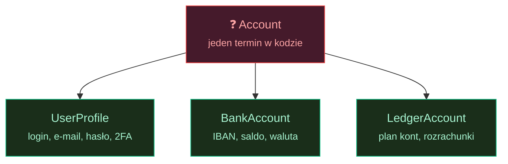
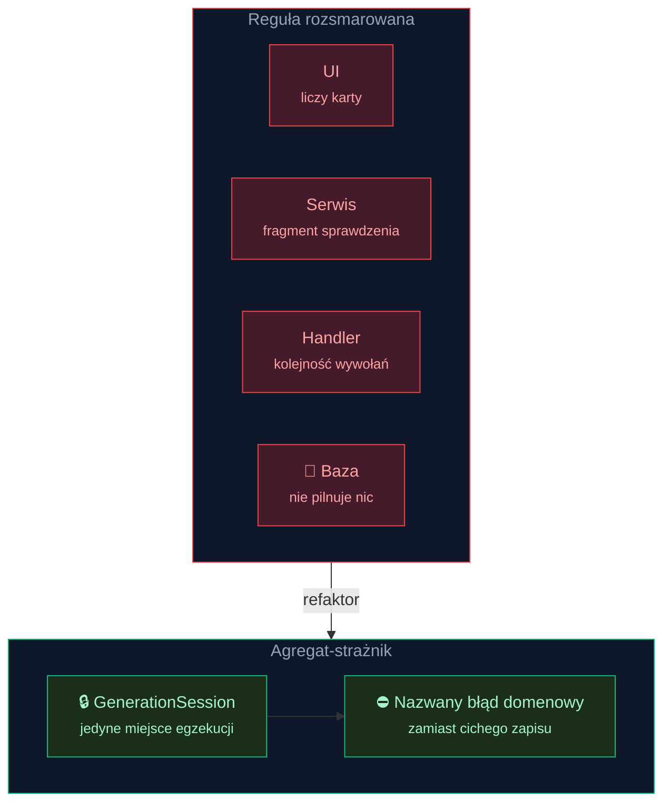
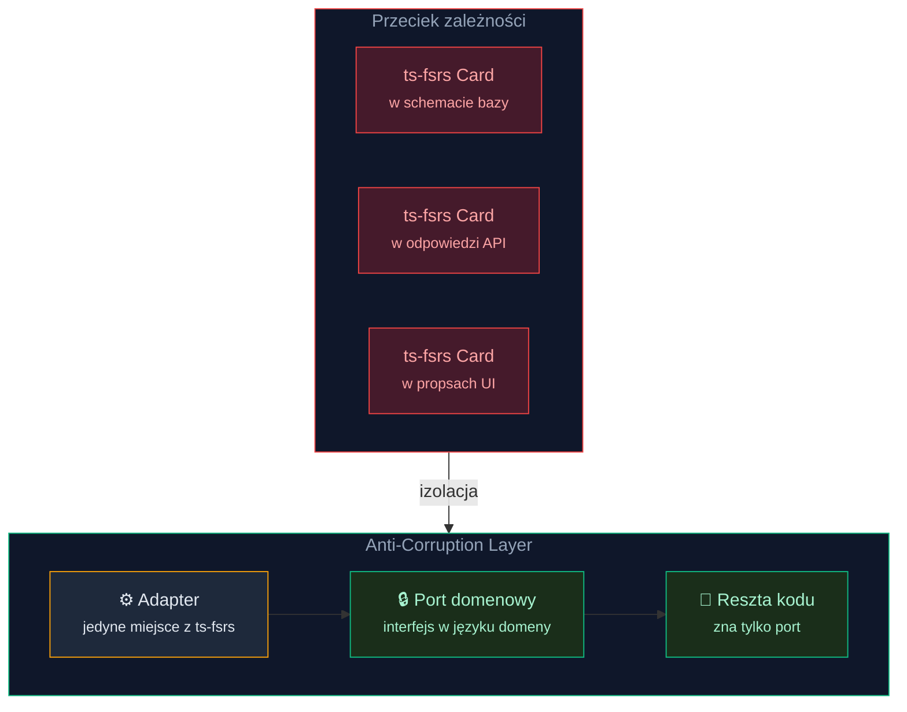
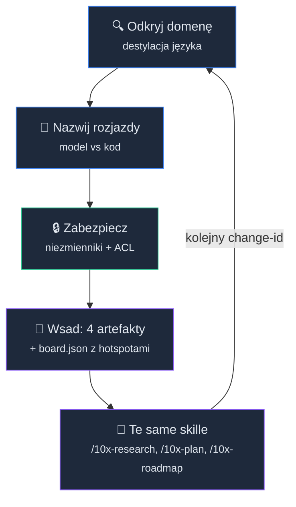

# Modernizacja legacy z DDD: wydzielaj domeny, potem deleguj Agentowi


<!-- cdn: https://images.przeprogramowani.pl/lessons/m4-l5/assets/cover.png -->

W tym module dotknęliśmy tematu AI i legacy z dwóch stron - skalowania kontekstu i skanowania projektu w poszukiwaniu kandydatów na dalsze refaktoryzacje. Poznałeś kolejne narzędzia CLI pozwalające oszczędzić cenne okno kontekstowe oraz przykłady łączenia znanych od lat narzędzi, jak Git, z ogromnym potencjałem agentów.

W tej lekcji pójdziemy w jeszcze innym kierunku.

Postaramy się znaleźć sposób na to, aby odnoszący sukces projekt, który rośnie z każdym `change-id`, dało się utrzymać za tydzień, za miesiąc, a nawet za kwartał.

W tej lekcji chcemy spojrzeć w stronę, od której właściwie wszystko się zaczyna. W stronę biznesu i świata rzeczywistego, gdzie osadzona jest nasza aplikacja.

I tu wchodzi AI działając jako **coach modelowania domeny biznesowej**, czyli odwzorowania pewnego kawałka rzeczywistości w naszym kodzie - tak spójnie i dokładnie, jak to możliwe. Czerpiąc z najlepszych praktyk podejścia Domain-Driven Design (DDD), możemy wykorzystać agenta do zbadania słownika, jakim posługują się specjaliści w danym obszarze, aby potem przenieść go na kod. Możemy badać strategiczne założenia z `prd` i sprawdzać, czy nasz kod je faktycznie wspiera i zabezpiecza przed złamaniem, czy wręcz zachęca do łamania. Możemy wyszukiwać i klasyfikować subdomeny, zastanawiając się, co faktycznie decyduje o sukcesie projektu, a co jest tematem pobocznym: możliwym do wydelegowania lub realizowania przez biblioteki.

Zanim zaczniemy: ta lekcja nie jest kursem DDD. Nie wejdziemy w agregaty na pięć warstw ani w spór o repozytoria. Bierzemy z Domain-Driven Designu dokładnie tyle, ile potrzeba, żeby z legacy wyciągnąć sensowne szanse na etap "post-MVP". Szukamy sposobów na optymalizację kodu, aby dalsze skalowanie projektu było łatwiejsze i bardziej przewidywalne.

## Od „refaktoruj kod" do „odkryj domenę"

Refaktoryzacja z poprzedniej lekcji odpowiadała na pytanie: *jak bezpiecznie zmienić ten kod?* DDD odpowiada na inne pytanie: *czy ten kod odpowiada temu, jak działa biznes?*

To nie jest kosmetyka. Jeśli pomylisz te dwa pytania, dostaniesz od Agenta wiarygodnie brzmiący plan, który utrwala bałagan, bo projektuje wokół nazw, które same w sobie są pomyłką.

Domain-Driven Design dał nam na to słownik pojęć, którymi posługujemy się od ponad dwóch dekad: **ubiquitous language**, **bounded contexts**, **niezmienniki**, **agregaty**. Klasyka, książki Evansa i Vernona. Problem z tą klasyką zawsze był ten sam: wejście jest drogie. Najlepiej rozpocząć od wywiadu z ekspertem domenowym, a tych wokół nas może nie być - w końcu nie po każdej ulicy chodzą twórcy fiszek i algorytmów SRS. Dobrze byłoby też przeprowadzić jeden czy drugi warsztat, żeby wszyscy w projekcie zaczęli korzystać z tej samej terminologii. Dobrze byłoby też zmapować nasze aktualne wyobrażenia domeny lub procesu na to, jak to faktycznie działa i gdzie kryją się niewiadome. Sporo roboty jak na refaktoryzację, której klient może w ogóle nie zauważyć.

LLM zbija koszty tego rodzaju optymalizacji architektury niemal do zera (a przynajmniej do poziomu „wystarczająco dobrego"). Największe modele językowe zgromadziły na etapie treningu setki pojęć i terminów z najróżniejszych obszarów biznesu - świata bankowości, logistyki czy ekonomii. Modele potrafią je tłumaczyć, rozróżniać i sprawdzać, czy w twoim kodzie dana nazwa oznacza to, co powinna.

Co więcej, agenci wyposażeni w narzędzia są też znakomitymi moderatorami warsztatów. Zadajesz warunki początkowe, reguły gry, udostępniasz interfejs i robisz Event Storming. Solo, z agentem, znowu na poziomie „wystarczająco dobrym".

To jest korzyść, która do tej pory była praktycznie niedostępna: **AI łączy klasykę modelowania domeny z semantycznym potencjałem modelu** i z rzeczy „dla architektów po szkoleniu" robi coś, co zrobisz solo, po godzinach, na cudzym repozytorium.

W tej lekcji przejdziemy przez kilka kroków inspirowanych DDD, które pomogą ci zaprojektować kolejny etap twojego projektu i wprowadzić jego architekturę na wyższy poziom.

## Najpierw język: dwa sposoby na ubiquitous language

Jest taka zasada z kanonu DDD, która brzmi banalnie, a jest fundamentem dalszej analizy: **granice językowe ujawniają granice kontekstów.** Tam, gdzie ten sam termin zaczyna znaczyć co innego, przebiega szew między dwoma obszarami systemu.

W projekcie fintechowym słowo **`Account`** oznacza jednocześnie:

1. **Konto użytkownika**
   `Account` jako login, e-mail, hasło, profil, 2FA.

2. **Rachunek bankowy**
   `Account` jako IBAN, saldo, waluta, historia transakcji.

3. **Konto księgowe**
   `Account` jako pozycja w planie kont, np. 201 — rozrachunki z odbiorcami.

Problem: w kodzie masz klasy typu `AccountService`, `AccountStatus`, `AccountClosed`, ale nie wiadomo, czy zamykasz profil użytkownika, rachunek bankowy, czy konto księgowe.

W rzeczywistości, to "3xAccount" powinno być rozbite na zupełnie inne terminy z różnych kontekstów:

```txt
1) UserProfile
2) BankAccount
3) LedgerAccount
```


<!-- rendered: ../../assets/diagrams/lessons-m4-l5-lesson-draft-1-10x.png | cdn: https://images.przeprogramowani.pl/diagrams/lessons-m4-l5-lesson-draft-1-10x.png -->

W takiej strukturze nikogo nie dziwi, że "obliczamy bieżący stan `BankAccount`", a "`UserProfile` ma brakujący email".

Dlatego zaczynamy od języka. To najtańszy ruch, który najczęściej od razu trafia w sedno problemu z tym, jak nasz projekt wygląda od środka.

Pokażę ci to na przykładzie, który przewinie się przez całą lekcję: **asynchronicznej generacji fiszek w 10xCards**, projekcie znanym ci z wcześniejszych modułów. Spójrz, co dzieje się z jednym pojęciem.

W dokumencie produktowym (PRD) istnieje **„sesja generacji"**, czyli byt z cyklem życia, z liczbą zamówionych kart i momentem finalizacji. W kodzie, który budowaliśmy, przygotowując się do lekcji, tego bytu *nie ma*.

Jest tylko luźny identyfikator doklejany do wierszy z propozycjami. A te propozycje? W bazie nazywają się `draft`, w interfejsie „propozycje", w odpowiedzi modelu `cards`, a w rozmowie zespołu „kandydaci". Jeden byt, cztery nazwy.

To nie jest czepialstwo. W warunkach szybkiego skalowania projektu, gdzie każdy dzień pracy jest na wagę złota, a każdy token spalony przez agenta na wagę podwójnego złota, musisz zadbać o precyzję. Co robimy, w jakim kontekście, na których elementach systemu. To właśnie istota ubiquitous language z DDD.

Jak wyciągnąć taki słownik systemu przy pomocy agenta? Na dwa sposoby.

### Tryb pierwszy: wywiad z ekspertem domenowym

Przez całe 10xDevs powtarzaliśmy: traktuj AI jak agenta, a nie chatbota. W tej jednej sekcji robimy wyjątek i zostajemy na poziomie zwykłej rozmowy.

Do poznania języka wybranej domeny nie potrzebujemy zbyt wielu narzędzi. Potrzebujemy po prostu największego dostępnego modelu językowego, który posiada wiedzę na temat domeny biznesowej, z którą związany jest nasz projekt.

> Ekspert domenowy: w DDD to osoba, która bardzo dobrze rozumie konkretny obszar biznesu, dla którego budowany jest system, i pomaga zespołowi technicznemu uchwycić prawdziwe reguły, pojęcia, procesy oraz wyjątki tej domeny. Nie musi być programistą — może być księgową, lekarzem, operatorem magazynu, analitykiem kredytowym, nauczycielem czy specjalistą od powtórek SRS.

Symulowany wywiad z ekspertem można stosować na samym początku projektu lub w momencie refaktoryzacji, kiedy chcemy uzyskać spójny słownik terminów i określeń na wszystko to, co w naszym systemie potencjalnie może się wydarzyć - kto robi akcje, jakie to są akcje, na jakich danych, w jakich warunkach, co można a czego się nie da.

Zaczynamy od prostego pytania-filtru do wybranego AI (to akurat rozmowa z ChatemGPT):

> Q: Czym są fiszki?
>
> A: Fiszki to małe karty do nauki, zwykle używane do zapamiętywania pojęć, słówek, definicji, wzorów albo faktów.
>
> Q: A czym jest SRS?
>
> A: SRS to Spaced Repetition System, czyli system powtórek w odstępach czasu. W praktyce: uczysz się czegoś na fiszce, a system decyduje, kiedy pokazać ci ją ponownie.

Widać, że model stojący za tym rozwiązaniem wie, w jakim świecie działa nasza aplikacja. Idziemy dalej.

> Q: Załóżmy, że buduję aplikację do tworzenia i zarządzania fiszkami. Jakie 3 kluczowe procesy biznesowe decydują o odbiorze takiej aplikacji przez użytkownika? Co muszę wiedzieć albo o co zadbać, żeby to narzędzie dawało realną wartość?
>
> A: W aplikacji do fiszek użytkownik rzadko ocenia wartość po samym „tworzeniu kart”. Odbiór produktu zależy głównie od tego, czy aplikacja pomaga mu regularnie wracać do właściwych rzeczy, czuć postęp i nie tonąć w chaosie materiału.
> A: W wielu aplikacjach to się zlewa. Użytkownik wrzuca fragment książki, robi notatkę, dopisuje pytanie, generuje kilka kart i potem nie wie, co właściwie jest czym. Dla systemu to też ma znaczenie: inaczej traktujesz surowy materiał, inaczej notatkę, a inaczej gotową fiszkę nadającą się do powtórek.
> A: ...

Nasz wirtualny ekspert domenowy może być znakomitym źródłem wymagań oraz konsultacji niejasnych procesów. Jako osoby techniczne skupiamy się przede wszystkim na narzędziach, językach i frameworkach, a agent doprecyzowujący dla nas "jak to działa w rzeczywistości" może podsunąć krytycznie ważne podpowiedzi.

I to na różnym poziomie abstrakcji. Nawet tym bezpośrednio mapującym się na kod.

> Q: Jakie są 3 najczęściej wybierane algorytmy do powtórek? Czym one się różnią? Przedstaw wyniki w formie tabeli i opisz trade-offs do wyboru jednego z nich.
>
> A: Leitner to bardziej mechanika organizacji kart niż model pamięci. Użytkownik może łatwo zrozumieć: „ta karta jest w pudełku 1, więc powtarzam ją często; ta jest w pudełku 5, więc rzadko”. To dobre dla prostoty, ale słabe dla precyzji.
>
> SM-2 wprowadza już pojęcie indywidualnego rytmu karty: karta ma interwał, historię odpowiedzi i współczynnik łatwości. Oryginalny SM-2 pochodzi z SuperMemo; Anki używało przez lata wariantu inspirowanego SM-2, z własnymi zmianami, m.in. inną liczbą przycisków odpowiedzi.
>
> FSRS idzie krok dalej: zamiast tylko przesuwać interwały według prostych reguł, próbuje modelować pamięć bardziej bezpośrednio. Implementacje FSRS opisują go jako model oparty na zmiennych typu Difficulty, Stability i Retrievability, czyli trudność, stabilność wspomnienia i prawdopodobieństwo przypomnienia.

Możemy odkrywać algorytmy, zasady rządzące światem oraz zakulisowe elementy procesów, które wydają się oczywiste (sprawdź chociażby jak wygląda proces podróży paczki od nadawcy do odbiorcy).

A zbliżając się już do samego kodu - ekspert może nam wreszcie zdefiniować pojęcia, które w danej domenie występują szczególnie często. To referencja do nazewnictwa klas, metod i pól w kodzie. Bazujemy tutaj na właściwości LLMów, które te często występujące pojęcia wykuwają na pamięć:

> Q: Zależy mi na spójnej terminologii, która odwzorowuje rzeczywistość. Podaj przykłady 5 nieoczywistych terminów z tej domeny, które nieświadomy programista może nazwać zupełnie inaczej, prowadząc do błędów w komunikacji zespołowej i implementacji systemu.
>
> A: 1) Review (a nie Test, Quiz, Practice, Attempt)
> A: 2) Due Card (a nie Active, Available, Pending, Next, Unfinished)
> A: ...

Tego typu rozmowę można prowadzić tak długo, aż daną domenę poznamy na akceptowalnym poziomie. Możesz to przekuć na plik kontekstowy, który będzie referencją w researchach, planach czy implementacji kolejnych funkcjonalności. Agent pozwala ci nazwać rzeczy we właściwy sposób i uniknąć problemu "3xAccount".

**Od ręcznego czatu do zautomatyzowanego wywiadu**

Jeśli chcesz łatwo sprawdzić jak dany model radzi sobie z wybraną przez ciebie domeną, możesz uruchomić rozmowę dwóch modeli między sobą: jeden gra programistę, który dopytuje o detale, drugi eksperta domenowego, który odpowiada.

Do tego służy nasze małe narzędzie [agent-forum](https://github.com/przeprogramowani/agent-forum).

Mechanika jest prosta. W pliku `index.ts` definiujesz dwóch agentów (model plus osobowość), liczbę tur i temat startowy. Opcjonalny `summarizer` na końcu destyluje całą rozmowę w gotowy brief domenowy: słownik pojęć, zasady, pułapki.

```ts
new Forum({
  threadName: "spaced-repetition-interview",
  rounds: 3,
  agents: [
    { agentId: "beginner-developer", model: orModel("openai/gpt-4o-mini"), personality: BEGINNER_DEVELOPER() },
    { agentId: "spaced-repetition-expert", model: orModel("anthropic/claude-sonnet-4.6"), personality: SPACED_REPETITION_EXPERT() },
  ],
  summarizer: { agentId: "learning-insights", model: orModel("openai/gpt-4o"), personality: LEARNING_INSIGHTS },
});
```

Uruchomienie to trzy kroki: sklonuj repozytorium (link powyżej), ustaw `OPENROUTER_API_KEY` w pliku `.env` (jeden klucz daje dostęp do modeli wielu dostawców przez OpenRouter) i odpal `npm start`. W terminalu będziesz na żywo obserwował przebieg rozmowy.

Każda wypowiedź jednej ze stron trafia do osobnego pliku markdown w katalogu `threads/`, a na końcu pojawia się `summary.md`, czyli ten sam słownik ubiquitous language, tylko zebrany automatycznie z całej rozmowy (lub dowolne inne podsumowanie - ty decydujesz).

To wciąż ten sam pomysł, co wyżej. Pytasz, model odpowiada. Różnica jest taka, że pytania zadaje drugi agent, a ty dostajesz gotowy zapis i podsumowanie, zamiast kopiować wiadomości z czatu. Przyda się jako dowolny test turowej komunikacji z modelem, w której docelowy rezultat pojawia się dopiero po 5-6 turach pytań i odpowiedzi.

### Tryb drugi: dokument kontekstowy kontra realny kod

Drugi tryb to podejście do projektów z pewną bazą - na przykład takich budowanych w 10xDevs, gdzie masz `prd`, bazę zmian w statusie `archive` czy te realizowane na `roadmapie`.

Agent może przeszukać wszystkie zorientowane na biznes dokumenty kontekstowe, wyłuskać z nich kanoniczny język domeny, a następnie sprawdzić, czy w kodzie używasz pojęć, które padły na początkowym etapie zbierania wymagań.

Użyj do tego promptu do destylacji języka:

```text
Pracujesz jako specjalista Domain-Driven Design skupiony na destylacji domeny biznesowej z istniejących dokumentów źródłowych. Twoim produktem jest MAPA domeny, nie kod. Nie zakładaj z góry żadnych nazw bytów, agregatów, ścieżek ani numerów wymagań — masz je ODKRYĆ. Pracuj w trzech krokach: odkrycie → analiza → klasyfikacja.

KROK 0 — Odkryj kontekst projektu.
- Znajdź i przeczytaj dokumenty wizji/wymagań, jeśli istnieją: poszukaj prd.md, tech-stack.md, README (typowo w katalogu z dokumentami foundation/docs lub w korzeniu repo). Jeśli istnieje rozszerzona narracja/historia zmian — przeczytaj ją też jako materiał źródłowy.
- Jeśli brak dokumentów wymagań — oprzyj się na README + kodzie i wyraźnie to odnotuj jako ograniczenie.
- Ustal stack i strukturę repo: gdzie żyje logika biznesowa (warstwy: API/ serwis/domena/UI/persystencja), jakie są katalogi źródłowe.

KROK 1 — Zbuduj Ubiquitous Language.
- Wyciągnij pojęcia domenowe z dokumentów ORAZ z kodu (nazwy encji, bytów, stanów, operacji, reguł). NIE wymyślaj — cytuj źródło.
- Dla każdego pojęcia podaj: definicję, cytat źródłowy (plik:linia), oraz gdzie termin żyje w kodzie (plik:linia) LUB wyraźną adnotację "BRAK w kodzie".

KROK 2 — Sklasyfikuj subdomeny: Core / Supporting / Generic.
- Tabela: każde pojęcie/obszar przypisz do jednej kategorii i uzasadnij odwołaniem do celów produktu (success criteria / sekcja wizji / non-goals, jeśli istnieją). Rdzeń = to, co stanowi przewagę i sens produktu.

KROK 3 — Wskaż kandydatów na agregaty i ich niezmienniki.
- Dla każdego kandydata: jaka reguła biznesowa MUSI być zawsze prawdziwa (niezmiennik), z cytatem ze źródła, oraz status: czy kod ją egzekwuje, deklaruje, czy ignoruje.

KROK 4 — Zbuduj listę rozjazdów MODEL vs KOD.
- Tabela: dokument mówi X — kod robi Y — dowód (plik:linia). To najcenniejsza część: pokazuje gdzie wiedza domenowa istnieje, a kod jej nie odwzorowuje.

KROK 5 — Ranking refaktoru.
- Uszereguj kandydatów na agregaty wg wartości (jak rdzeniowy niezmiennik) i ryzyka (jak słabo jest dziś egzekwowany). Wskaż #1 do refaktoru i dlaczego.

OGRANICZENIA:
- Nie pisz kodu produkcyjnego. Cytuj wyłącznie ścieżki/linie, które realnie zweryfikowałeś.
- Zapisz dokument do: context/domain/01-domain-distillation.md (z frontmatter: title, created, type: domain-distillation).
- Na koniec zwróć podsumowanie 5–8 zdań: co zawiera artefakt i najważniejszy wniosek.

Zapisz rezultat do context/domain/01-domain-distillation.md
```

Efektem jest **referencyjny słownik domeny** wraz z potencjalnymi obszarami do refaktoryzacji.

Dlaczego warto to robić na kodzie rozwijanym, a nie na pustym repozytorium? Pragmatyczne spojrzenie na DDD zakłada, że na starcie projektu masz jeszcze za małą wiedzę o tym, co właściwie robisz. Poznajesz domenę, która z każdym dniem okazuje się głębsza i bardziej angażująca. Podobnie z językiem - kiedy koszt początkowych błędów jest stosunkowo niski, obszerne wywiady i glosariusze nie są niezbędne. Co innego na większych projektach, kiedy nagle wszędzie zaczyna latać `Account`, a nikt nie wie, co my tak naprawdę naprawiamy - profil użytkownika, rachunek czy rejestry księgowe.

W dalszej części lekcji zobaczysz wyniki takiego prompta dla 10xCards.

----

## Niezmienniki, czyli reguły, których pilnujesz

Destylacja domeny daje ci mapę. Pokazuje, gdzie język dokumentu rozjeżdża się z językiem kodu i które byty są kandydatami na coś więcej niż luźny wiersz w bazie. Ale mapa to dopiero diagnoza. Teraz schodzimy o poziom niżej - do konkretnej reguły, która w twojej domenie **musi być zawsze prawdziwa, niezależnie od tego, kto i jak rusza system.**

Taką regułę nazywamy niezmiennikiem (ang. *invariant*). "Saldo `BankAccount` nigdy nie spada poniżej dozwolonego debetu". "Zamówienie nie może zostać wysłane, dopóki nie jest opłacone". "Fiszka trafia do powtórki dopiero wtedy, gdy minął jej termin". To nie są walidacje formularza - to reguły, na których stoi sens produktu. Jeśli któraś pęknie, dane wciąż się zapiszą, ale biznes przestaje się zgadzać.

Problem z niezmiennikami w legacy jest zawsze ten sam: **reguła jest wszędzie i nigdzie.** Kawałek sprawdzenia siedzi w komponencie UI, drugi w serwisie, trzeci jest "zagwarantowany" przez kolejność wywołań w jakimś handlerze, a w bazie nie pilnuje go nic. Najczęściej jedynym realnym strażnikiem zostaje klient - czyli ten element systemu, który najłatwiej obejść. A kiedy reguła pęka, błąd bywa po cichu połykany, zamiast zatrzymać operację.

Wróćmy do generacji fiszek w 10xCards. PRD opisuje „sesję generacji" jako byt z cyklem życia i momentem finalizacji. Naturalny niezmiennik tej sesji brzmi: **sesja finalizuje się dopiero wtedy, gdy każda wygenerowana propozycja została rozstrzygnięta - zaakceptowana albo odrzucona.** Tyle że, jak ustaliliśmy wcześniej, w kodzie tego bytu *nie ma*. Skoro nie ma `GenerationSession`, to nie ma też miejsca, które tej reguły pilnuje (serwisy lub kilka linijek w losowej funkcji to przypadek, a nie twarda zasada). UI liczy zaakceptowane karty, endpoint ufa temu, co przyjdzie w żądaniu, a w bazie leży luźny identyfikator przy wierszach z propozycjami. Reguła istnieje w głowach zespołu i w dokumencie, ale nie w kodzie.

Na to DDD ma swoją taktyczną odpowiedź: **agregat.** Agregat to granica spójności - jeden byt, który jest **jedynym** strażnikiem swojego niezmiennika. Wszystko, co chce zmienić jego stan, musi przejść przez jego metody, a metoda, która próbuje złamać regułę, rzuca nazwany błąd domenowy zamiast cicho zapisać niespójność.


<!-- rendered: ../../assets/diagrams/lessons-m4-l5-lesson-draft-2-10x.png | cdn: https://images.przeprogramowani.pl/diagrams/lessons-m4-l5-lesson-draft-2-10x.png -->

Wyciągnięcie takiego niezmiennika z legacy w agregat-strażnik to robota, którą również możesz oddać agentowi. Tym razem nie prosisz go o mapę, tylko o **plan refaktoru**, który wskaże najważniejszą regułę i zaprojektuje jej egzekwowanie w jednym miejscu:

```text
Pracujesz jako specjalista Domain-Driven Design skupiony na identyfikacji i zabezpieczaniu domenowych niezmienników. Produkt to PLAN refaktoru, nie implementacja — nie modyfikuj kodu produkcyjnego. Nie zakładaj z góry, który niezmiennik jest rdzeniowy ani jak nazywają się byty — masz to ODKRYĆ i WYBRAĆ. Pracuj w krokach: odkrycie → identyfikacja → klasyfikacja → diagnoza → projekt.

KROK 0 — Odkryj kontekst.
- Przeczytaj dokumenty wymagań, jeśli istnieją (prd.md / tech-stack.md / README; szukaj w foundation/docs/root). Zwróć uwagę na sekcje "business logic", "success criteria", reguły i wymagania funkcjonalne.
- Ustal stack i warstwy, w których żyje logika biznesowa (API / serwis / domena / UI / persystencja).

KROK 1 — IDENTYFIKUJ niezmienniki biznesowe.
- Zbuduj listę reguł, które w tej domenie MUSZĄ być zawsze prawdziwe (np. "X powstaje tylko z Y", "operacja Z jest atomowa", "dane D nigdy nie są persystowane", "przejście stanu A→B wymaga warunku C"). Wyciągaj z dokumentów ORAZ z kodu. Cytuj źródło.

KROK 2 — KLASYFIKUJ i wybierz #1.
- Dla każdego niezmiennika oceń trzy osie:
  (a) jak rdzeniowy dla sensu produktu (odwołaj się do celów/wizji),
  (b) jak bardzo rozsmarowany po warstwach (w ilu plikach/warstwach żyje),
  (c) czy jest realnie EGZEKWOWANY, tylko deklarowany, czy naruszalny.
- Wybierz niezmiennik, który jest jednocześnie najbardziej rdzeniowy I najsłabiej egzekwowany. Uzasadnij wybór.

KROK 3 — DIAGNOZA wybranego niezmiennika.
- Pokaż dokładnie, gdzie dziś żyje reguła (cytaty plik:linia we wszystkich warstwach). Wskaż: które warstwy jej nie egzekwują, gdzie jest egzekwowana niespójnie, gdzie klient (UI) jest jedynym strażnikiem, gdzie błąd jest "połykany" zamiast zatrzymywać operację.

KROK 4 — PROJEKT agregatu-strażnika.
- Zaprojektuj agregat (root) będący JEDYNYM miejscem egzekwowania niezmiennika.
- Metody domenowe z preconditions; nielegalna operacja rzuca nazwany błąd domenowy (nie cicho aktualizuje stanu). Pokaż sygnatury + pseudokod.
- Repozytorium ładujące/zapisujące agregat zamiast rozsianych zapytań; jeśli niezmiennik wymaga atomowości — pokaż, jak całość idzie w JEDNEJ transakcji.
- Cienkie API/route: parse wejścia → metoda agregatu → mapowanie błędu domenowego na odpowiedź. Egzekucja przenosi się z klienta na serwer (jeśli dziś jest na kliencie).

KROK 5 — Before/after, plan, testy.
- Before/after dla każdego dzisiejszego miejsca reguły.
- Plan faz refaktoru. Jeśli projekt ma dyscyplinę test-first / istniejący runner — zaznacz, które fazy idą test-first i wypisz przypadki testowe dla niezmiennika (legalne i nielegalne przejścia/operacje).
- Lista nowych "load-bearing" nazw do zarejestrowania, jeśli projekt prowadzi rejestr kontraktów.

OGRANICZENIA:
- Fail-fast: nielegalna operacja zatrzymuje, nie loguje-i-jedzie dalej.
- Cytuj tylko zweryfikowane plik:linia.
- Zapisz dokument do: context/domain/02-invariant-aggregate-refactor.md (frontmatter: title, created, type: refactor-plan).
- Zwróć podsumowanie 5–8 zdań na koniec.

Zapisz rezultat do context/domain/02-invariant-aggregate-refactor.md
```

Zwróć uwagę, że prompt niczego nie zakłada z góry. Nie podajemy agentowi nazwy bytu ani nie mówimy „napraw sesję generacji". To on ma **odkryć** listę niezmienników z dokumentów i kodu, ocenić każdy na trzech osiach - jak bardzo jest rdzeniowy, jak bardzo rozsmarowany i jak słabo egzekwowany - a potem wybrać ten, który jest jednocześnie najważniejszy i najgorzej pilnowany. To celowe. Często reguła, która najbardziej boli, nie jest tą, którą podejrzewasz na pierwszy rzut oka.

Dalej agent przestaje być analitykiem, a staje się projektantem. Diagnozuje, gdzie reguła dziś żyje (z cytatami `plik:linia`), wskazuje warstwy, które jej nie egzekwują, i miejsca, gdzie błąd jest połykany. Następnie projektuje agregat: metody z `preconditions`, nazwane błędy domenowe, repozytorium ładujące i zapisujące całość, a jeśli niezmiennik wymaga atomowości - całość w jednej transakcji. Na koniec dostajesz before/after dla każdego miejsca, w którym reguła była rozsmarowana, plan faz refaktoru i listę przypadków testowych dla legalnych i nielegalnych operacji.

Co nam to daje? Reguła przestaje być konwencją, którą każdy w zespole „pamięta", a staje się kodem, **którego nie da się obejść.** Egzekwowanie przenosi się z klienta na serwer, błędy zatrzymują operację zamiast ją po cichu psuć, a cała wiedza o tym, kiedy sesja może się sfinalizować, ląduje w jednym pliku, a nie w czterech. Dla projektu po MVP, który skalujesz pod presją, to różnica między bazą danych, której ufasz, a taką, którą co tydzień ratujesz skryptem migracyjnym.

## Anti-Corruption Layer, czyli przeciwko szkodnikom

Niezmiennik pilnował reguły *wewnątrz* twojej domeny. Teraz spójrzmy na granicę z tym, co jest *na zewnątrz* - na zewnętrzne biblioteki, SDK i API, na których stoi twój projekt, ale których nie kontrolujesz.

Każda taka zależność ma własny język i własny kształt danych. I dopóki siedzi w jednym miejscu, wszystko jest w porządku. Problem zaczyna się, gdy zaczyna **przeciekać** - kiedy jej typy i pojęcia rozłażą się po twoim kodzie i mieszają z twoją domeną.

Wróćmy raz jeszcze do 10xCards i powtórek. Wcześniej rozmawialiśmy z ekspertem o algorytmach SRS - Leitner, SM-2, FSRS. Załóżmy, że projekt sięgnął po gotową bibliotekę FSRS, np. `ts-fsrs`. Ta biblioteka ma własne pojęcia: `Card` ze swoimi polami `stability`, `difficulty`, `due`, `state` oraz własne enumy ocen. Wygodne na start. Ale po kilku tygodniach okazuje się, że typ `Card` z `ts-fsrs` siedzi w schemacie bazy, wraca w odpowiedzi API, ląduje w propsach komponentu Svelte, a logika konwersji „surowy obiekt biblioteki → coś, co umie wyświetlić UI" jest zduplikowana w trzech miejscach. Twoja fiszka domenowa i `Card` z biblioteki to teraz jeden i ten sam obiekt.

To jest właśnie przeciek. I ma dwa koszty. Pierwszy: kiedy zechcesz wymienić `ts-fsrs` na inny scheduler albo na własny SM-2, dotkniesz całego systemu - bazy, API i UI - bo wszędzie żyje kształt konkretnej biblioteki. Drugi, groźniejszy: biblioteka pomyślana do liczenia harmonogramu potrafi zostać wciągnięta do paczki klienta, choć nie ma prawa tam trafić.

DDD nazywa lekarstwo **Anti-Corruption Layer** (ACL). To cienka warstwa na granicy z zależnością, która tłumaczy jej język na twój i z powrotem - tak, żeby reszta kodu nigdy nie dotykała obcego kształtu bezpośrednio. W praktyce sprowadza się to do dwóch rzeczy: domenowego value objectu, który jest jedynym miejscem wiedzy o kształcie zależności, oraz **wąskiego portu** - interfejsu opisanego w języku twojej domeny - który implementuje **adapter** owijający konkretną bibliotekę. Reszta kodu zna tylko port.


<!-- rendered: ../../assets/diagrams/lessons-m4-l5-lesson-draft-3-10x.png | cdn: https://images.przeprogramowani.pl/diagrams/lessons-m4-l5-lesson-draft-3-10x.png -->

Identyfikację najgorszego przecieku i projekt ACL znów możesz oddać agentowi:

```text
Pracujesz jako specjalista Domain-Driven Design skupiony na identyfikacji przeciekających zależności i łamania granic warstw domeny. Produkt to PLAN refaktoru, nie implementacja — nie modyfikuj kodu produkcyjnego. Nie zakładaj z góry, która zależność przecieka ani jak nazywają się byty — masz to ODKRYĆ i WYBRAĆ. Kroki: odkrycie → identyfikacja → klasyfikacja → diagnoza → projekt.

KROK 0 — Odkryj kontekst.
- Przeczytaj dokumenty bazowe, jeśli istnieją (prd.md / tech-stack.md / README). Zwróć uwagę na deklaracje o wymienialności komponentów lub o tym, że jakiś byt jest celowo odseparowany "żeby dało się wymienić X".
- Ustal stack, listę zależności zewnętrznych (manifest pakietów) i warstwy kodu.

KROK 1 — IDENTYFIKUJ przeciekające zależności.
- Znajdź zależności zewnętrzne, które przeciekają przez granice warstw. Sygnały: ten sam pakiet importowany w wielu warstwach (API + UI + serwis), zduplikowana rekonstrukcja obiektów/typów biblioteki w kilku miejscach, typy biblioteki w sygnaturach domenowych lub w kontraktach wire (DTO/response), wołanie tego samego SDK po obu stronach granicy klient/serwer.
- Dla każdej: wylicz WSZYSTKIE pliki, które ją dziś "znają" (plik:linia).

KROK 2 — KLASYFIKUJ i wybierz #1.
- Oceń każdą oś: (a) liczba warstw/plików dotkniętych, (b) ryzyko/koszt wymiany biblioteki dziś, (c) czy dokumenty deklarują, że ma być wymienialna (rozjazd intencja-vs-kod jest mocnym sygnałem). Wybierz najgorszy przeciek. Uzasadnij.

KROK 3 — DIAGNOZA.
- Pokaż duplikację (cytaty plik:linia) i przecieki przez granice — zwłaszcza groźne (np. biblioteka serwerowa wciągana do bundla klienta). Jeśli dokument deklaruje wymienialność — zacytuj to (plik:linia) i pokaż, że kod jej nie dotrzymuje.

KROK 4 — PROJEKT ACL.
- Zaprojektuj domenowy value object/encję, która jest JEDYNYM miejscem wiedzy o kształcie zależności (mapowanie z/do persystencji, konwersja do/z typu biblioteki, operacje domenowe). Pokaż sygnatury + pseudokod.
- Zdefiniuj WĄSKI port (interfejs domenowy) i adapter implementujący go przez konkretną bibliotekę. Reszta kodu zna tylko port.

KROK 5 — Dowód izolacji + before/after.
- Udowodnij listą, że wymiana biblioteki dotyka tylko adaptera, nie tabel/API/UI.
- Before/after dla zduplikowanych miejsc; pokaż, że warstwa UI dostaje gotowe dane domenowe, nie surowy obiekt biblioteki.
- Jeśli istnieją otwarte pytania zależne od kontraktu tej biblioteki — rozstrzygnij je w oparciu o jej dokumentację i wskaż, gdzie zakodować decyzję (w ACL, nie w warstwie API).

KROK 6 — Weryfikacja i plan.
- Kryterium sukcesu: grep po nazwie pakietu zwraca wyłącznie pliki w katalogu ACL/ adaptera. Wypisz, które pliki dziś znają zależność, a które po refaktorze już nie.
- Plan faz zgodny z konwencją projektu.

OGRANICZENIA:
- Cytuj tylko zweryfikowane plik:linia. Nie pisz kodu produkcyjnego.
- Zapisz dokument do: context/domain/03-anti-corruption-layer.md (frontmatter: title, created, type: refactor-plan).
- Zwróć podsumowanie 5–8 zdań na koniec.

Zapisz rezultat do context/domain/03-anti-corruption-layer.md
```

Mechanika promptu jest bliźniacza do tej od niezmienników, ale szuka czego innego. Agent najpierw skanuje manifest pakietów i warstwy, żeby **odkryć** zależności, które przeciekają - sygnałem jest ten sam pakiet importowany w API, UI i serwisie naraz, typy biblioteki w kontraktach przesyłanych po sieci albo zduplikowana rekonstrukcja jej obiektów. Potem klasyfikuje i wybiera najgorszy przeciek, biorąc pod uwagę między innymi to, czy dokumenty *deklarowały* wymienialność, której kod nie dotrzymał - bo rozjazd między intencją a kodem to najmocniejszy sygnał. Dopiero wtedy projektuje value object, port i adapter oraz pokazuje before/after dla każdego zduplikowanego miejsca.

Najciekawszy jest tu sposób, w jaki prompt definiuje sukces. Nie pyta „czy wygląda ładniej", tylko podaje **sprawdzalne kryterium**: po refaktorze `grep` po nazwie pakietu ma zwracać wyłącznie pliki w katalogu adaptera. To kryterium, które sam zweryfikujesz w sekundę i pod które agent musi zaprojektować cały plan. Wymiana biblioteki przestaje być projektem na cały sprint, a staje się podmianą jednego adaptera - reszta domeny nawet się nie dowie.

Zobacz teraz, jakie wyniki otrzymałem z tych trzech sesji w 10xCards:

<div style="padding:56.25% 0 0 0;position:relative;"><iframe src="https://player.vimeo.com/video/1198893519?badge=0&amp;autopause=0&amp;player_id=0&amp;app_id=58479" frameborder="0" allow="autoplay; fullscreen; picture-in-picture; clipboard-write; encrypted-media; web-share" referrerpolicy="strict-origin-when-cross-origin" style="position:absolute;top:0;left:0;width:100%;height:100%;" title="ddd-prompts"></iframe></div><script src="https://player.vimeo.com/api/player.js"></script>

## Interaktywne warsztaty DDD z event-storming-canvas

Wszystko, co robiliśmy do tej pory - destylacja języka, niezmienniki, ACL - to praca, którą agent wykonuje na gotowym materiale: na dokumentach i na kodzie. Ale część wiedzy o domenie nigdy nie trafiła do żadnego pliku. Siedzi w głowach ludzi i wychodzi dopiero wtedy, gdy posadzisz ich przy jednej tablicy i każesz przejść proces krok po kroku. Do tego właśnie służy **Event Storming**.

Event Storming to technika warsztatowa autorstwa Alberto Brandoliniego: zespół modeluje proces biznesowy, przyklejając do ściany kolorowe karteczki - pomarańczowe to zdarzenia („Zamówienie złożone"), niebieskie to komendy, żółte to aktorzy, czerwone to hotspoty, czyli miejsca ryzyka i otwarte pytania. Karteczki układają się na osi czasu i nagle widać cały proces, jego luki i miejsca, w których nikt nie wie, „co się właściwie dzieje, gdy płatność się nie powiedzie".

Problem jest dokładnie ten sam, co z wywiadem domenowym z początku lekcji: **koszt wejścia.** Klasyczny Event Storming wymaga rezerwacji sali, ściany pełnej karteczek, eksperta domenowego, kilku programistów i moderatora, który pilnuje metody i nie pozwala grupie skleić wszystkiego w jedną wielką notatkę. To dzień pracy kilku osób - dla refaktoryzacji post-MVP, której klient może nawet nie zauważyć, rzadko da się to obronić.

I znów: agent tego eksperta **nie zastępuje.** Ale może być pierwszym podejściem na poziomie „wystarczająco dobrym" - takim, które solo, po godzinach, wyciągnie z procesu 80% wiedzy, zanim zaprosisz do stołu prawdziwych ludzi. Agent wyposażony w odpowiednie reguły potrafi wejść w rolę **moderatora Event Stormingu**: prowadzić cię przez kolejne fazy, dorzucać przykładowe zdarzenia, scalać duplikaty, zadawać ostre pytania i zamieniać twoje „nie jestem pewien, kto to zatwierdza" w czerwony hotspot na tablicy.

Żeby ten warsztat dało się prowadzić wzrokowo, a nie tylko w czacie, przygotowaliśmy małe narzędzie: **`event-storming-canvas`**.

- **Event Storming Canvas** - [https://github.com/przeprogramowani/event-storming-canvas](https://github.com/przeprogramowani/event-storming-canvas)

### Czym jest event-storming-canvas

To prosta aplikacja (czysty Node.js, bez `npm install`, bez kroku budowania), która jest praktycznym przykładem rozwiązania, gdzie **człowiek i agent pracują na tym samym stanie w czasie rzeczywistym.**

Tym wspólnym stanem jest jeden plik - `board.json` - który jest jedynym źródłem prawdy dla całej tablicy. Działa to tak:

- **Ty** prowadzisz warsztat w przeglądarce: dodajesz, przesuwasz i edytujesz karteczki, przełączasz fazy.
- **Agent** czyta i edytuje `board.json` - „myśli na tablicy": dorzuca zdarzenia, układa je na osi czasu, zaznacza hotspoty, zadaje pytania.
- **Tablica** odświeża się na żywo w każdej podłączonej przeglądarce dzięki Server-Sent Events. Zmiana w pliku jest widoczna natychmiast, bez przeładowania.

Co istotne, narzędzie nie jest zwykłą tablicą do rysowania. Ma **konkretne ramy**: zna gramatykę Brandoliniego (kolory mają znaczenie, każda rola ma swój pas), a selektor faz - od `chaotic-exploration`, przez `timeline` i `hotspots`, aż po `aggregates` - **ogranicza pasek narzędzi do ról właściwych dla danego etapu.** To sama metoda wymusza na was kolejność: najpierw burza zdarzeń, dopiero potem komendy, aktorzy i agregaty. Trudno tu pójść na skróty.

### Jak z tego korzystać

Uruchomienie jest banalne - potrzebujesz tylko Node.js:

```bash
node server.js
# otwórz http://localhost:4000
```

Drugim krokiem jest **ustawienie agenta w roli moderatora.** Repozytorium ma `CLAUDE.md` (oraz bliźniaczy `AGENTS.md`), w którym zapisany jest pełny protokół moderatora: jak wyczyścić tablicę na start, jak respektować bieżącą fazę, jak nie nadpisywać twoich karteczek i jak zamieniać niejasności w hotspoty. To te reguły zmieniają zwykłego asystenta w prowadzącego warsztat - dokładnie ten sam mechanizm „reguł projektu", który znasz z poprzednich modułów.

Dalej warsztat to już krótki dialog. Ty mówisz, czego chcesz; agent edytuje `board.json` i melduje w czacie, co zrobił. Dla procesu generacji fiszek z 10xCards mogłoby to wyglądać tak:

```text
Wyczyść tablicę i poprowadź warsztat Event Storming dla procesu asynchronicznej generacji fiszek w 10xCards. Zacznij od fazy chaotic-exploration i dorzuć 4–5 zdarzeń domenowych w czasie przeszłym.
```

```text
Przejdź do fazy hotspots i zaznacz na czerwono miejsca, w których proces może się wysypać — błąd modelu, częściowo zaakceptowana sesja, timeout generacji.
```

Agent zawsze najpierw czyta `board.json`, więc buduje na twoim aktualnym stanie i nie kasuje tego, co już dodałeś. Po kilku rundach masz przed oczami cały proces: zdarzenia na osi czasu, komendy i aktorów nad nimi, a w miejscach ryzyka czerwone hotspoty - czyli gotową listę kandydatów do dalszej analizy niezmienników i granic kontekstów. Co ważne, sesje nie mają pamięci: nie ma bazy danych ani historii, każdy warsztat zaczyna się od czystej tablicy, a jej całym stanem jest `board.json`. Jeśli chcesz zachować wynik, po prostu zapisujesz ten plik.

<div style="padding:56.25% 0 0 0;position:relative;"><iframe src="https://player.vimeo.com/video/1198877956?badge=0&amp;autopause=0&amp;player_id=0&amp;app_id=58479" frameborder="0" allow="autoplay; fullscreen; picture-in-picture; clipboard-write; encrypted-media; web-share" referrerpolicy="strict-origin-when-cross-origin" style="position:absolute;top:0;left:0;width:100%;height:100%;" title="ddd-mentor"></iframe></div><script src="https://player.vimeo.com/api/player.js"></script>

## Wsad do dalszej refaktoryzacji

Spójrz, co zostało na dysku po tej lekcji. Słownik domeny z listą rozjazdów `model-vs-kod` (`01-domain-distillation.md`). Plan przekucia niezmiennika w agregat-strażnik (`02-invariant-aggregate-refactor.md`). Projekt Anti-Corruption Layer ze sprawdzalnym kryterium sukcesu (`03-anti-corruption-layer.md`). I `board.json` z tablicy Event Stormingu, gęsto obsypany czerwonymi hotspotami. Cztery artefakty i jedna tablica - same diagnozy, plany i otwarte pytania.

To nie jest produkt końcowy. To **wsad** - i to najlepszy, jaki możesz sobie wyobrazić na start kolejnego dużego cyklu pracy nad projektem.

Przypomnij sobie pierwszy taki cykl z wcześniejszych modułów: od pomysłu, przez `prd` i `roadmapę`, plan, aż po implementację MVP. Projektowałeś wtedy w dużej mierze w ciemno - domena była płytka, język świeży, a część decyzji architektonicznych była wróżeniem z fusów. Teraz jest inaczej. Masz działający produkt, realny kod i twardo udokumentowaną wiedzę o tym, gdzie ten kod rozjeżdża się z biznesem. To moment na **drugi duży cykl** - etap "post-MVP", w którym architekturę kształtuje już domena, a nie zgadywanie.

Masz do dyspozycji niemal pełny 10x-toolkit, a te same skille, których używałeś do bootstrapu i planowania zmian, przyjmują dokumenty DDD jako **wejście**. Nie zaczynasz od zera - podajesz im wsad jako parametr:

```text
/10x-research @context/domain/01-domain-distillation.md
  → zbadaj, jak głęboko subdomena Core jest dziś rozsmarowana po warstwach

/10x-plan @context/domain/02-invariant-aggregate-refactor.md
  → zamień plan refaktoru w konkretną zmianę z własnym change-id

/10x-roadmap
  → ułóż hotspoty z Event Stormingu w kolejność zmian wg wartości i ryzyka
```

Mechanika jest tu kluczowa i znasz ją już z modułu o planowaniu: **te skille nagradzają kontekst podany z góry.** `/10x-plan` sam zmniejsza liczbę pytań, kiedy dostaje gotowy research czy frame - a `02-invariant-aggregate-refactor.md` to dokładnie taki gotowy research, z fazami, before/after i przypadkami testowymi. Im więcej pracy nad DDD wrzucisz na wejściu, tym węższy i celniejszy plan dostaniesz na wyjściu. Artefakt, który dla człowieka jest mapą, dla agenta jest skrótem do dobrej zmiany.

W praktyce każdy z tych dokumentów wpina się w inny etap drugiego cyklu:

- **`01-domain-distillation.md`** - ranking refaktoru i lista rozjazdów `model-vs-kod` to materiał dla `/10x-shape` i `/10x-roadmap`. Pokazuje, które subdomeny są rdzeniowe i które zmiany niosą największą wartość, więc roadmapa układa się wokół sedna produktu, a nie wokół tego, co akurat najłatwiej tknąć.
- **`02-invariant-aggregate-refactor.md`** i **`03-anti-corruption-layer.md`** - to już gotowe plany. Idą niemal wprost do `/10x-plan` jako wsad pod konkretne `change-id`, bo połowę roboty, którą zwykle robisz w trakcie planowania, agent wykonał już na etapie diagnozy.
- **`board.json`** - czerwone hotspoty z Event Stormingu to surowa lista kandydatów na przyszłe zmiany. Każdy hotspot to potencjalny `change-id` czekający na swój research.

Zauważ, że ani razu nie porzucasz workflow, który budowałeś przez cały kurs. DDD go nie zastępuje - **zasila go lepszym paliwem.** Wcześniej roadmapę układałeś z PRD i intuicji. Teraz układasz ją z mapy domeny, twardych niezmienników i listy hotspotów. Ta sama maszyna, tylko wejście dużo lepszej jakości.


I to jest właściwy sposób patrzenia na modernizację legacy z AI: nie jednorazowe wielkie przepisanie, tylko **powtarzalny cykl** - odkryj domenę, nazwij rozjazdy, zabezpiecz niezmienniki, a potem podaj te ustalenia z powrotem do tych samych skilli, które dowiozły ci MVP. Z każdą rundą kod jest bliżej tego, jak naprawdę działa biznes - i właśnie dlatego zostaje możliwy do utrzymania za tydzień, miesiąc i kwartał.


<!-- rendered: ../../assets/diagrams/lessons-m4-l5-lesson-draft-4-10x.png | cdn: https://images.przeprogramowani.pl/diagrams/lessons-m4-l5-lesson-draft-4-10x.png -->

## 🧑🏻‍💻 Zadania praktyczne

Wykonaj poniższe ćwiczenia na wybranym projekcie (np. kontynuując pracę z 10xCards) i sprawdź, jak pogłębi się twoje zrozumienie domeny biznesowej. Każdy z trzech promptów produkuje jeden artefakt w `context/domain/`, więc na koniec zostaje ci gotowy wsad do dalszej refaktoryzacji.

1. **Destylacja domeny.** Uruchom prompt z sekcji „dokument kontekstowy kontra realny kod" na swoim repo i pozwól agentowi zbudować `01-domain-distillation.md`. Przejrzyj wynik pod jednym kątem: ile pojęć ma adnotację „BRAK w kodzie" i które rozjazdy `model-vs-kod` cię zaskoczyły.

2. **Niezmiennik i agregat.** Uruchom prompt o niezmiennikach i agregatach. Sprawdź, czy reguła #1, którą wybrał agent, faktycznie jest tą najgroźniejszą w twoim projekcie - czy zgadzasz się z jego oceną na trzech osiach (rdzeniowość, rozsmarowanie, egzekwowanie). Wynik to będzie plik `02-invariant-aggregate-refactor.md`.

3. **Anti-Corruption Layer.** Uruchom prompt o przeciekających zależnościach. Zweryfikuj kryterium sukcesu samodzielnie: zrób `grep` lub `ast-grep` po nazwie pakietu wskazanego przez agenta i policz, w ilu warstwach dziś żyje. Wynik to trzeci artefakt - `03-anti-corruption-layer.md`.

**Opcjonalnie:** odpal `event-storming-canvas` (`node server.js`), ustaw agenta w roli moderatora i poprowadź jeden warsztat dla wybranego procesu z twojego projektu - od fazy `chaotic-exploration` po `hotspots`. Zapisz `board.json` i porównaj czerwone hotspoty z rozjazdami, które wyszły z promptu #1.

### Domknięcie modułu: raport architektoniczny

To ostatnia lekcja modułu, więc czas zebrać całą czwórkę artefaktów w jeden dokument, który dołączysz do formularza odznaki **10xArchitect**. Przez cztery lekcje powstały: mapa repozytorium (L2), research wybranego ficzera (L3), plan refaktoryzacji (L4) i notatki o domenie inspirowane DDD (L5). Jeśli pracowałeś na różnych repozytoriach, to nie problem — raport ma to po prostu jawnie opisać.

Poniższy prompt zbiera te artefakty i tworzy jeden sumaryczny **raport aktywności w module 4** (cel: dwie strony, czytelne dla człowieka). Podmień placeholdery `{...}` na realne ścieżki swoich plików — jeśli któregoś artefaktu nie masz, zostaw jawną adnotację zamiast go zmyślać:

```text
Zbuduj jeden sumaryczny raport architektoniczny z modułu 4 (ścieżka 10xArchitect).
Cel: zwięzły two-pager (~2 strony), czytelny dla człowieka, oparty wyłącznie na poniższych artefaktach. Nie wymyślaj faktów - jeśli czegoś brakuje, napisz wprost "BRAK artefaktu" i nie uzupełniaj luki domysłami.

Wejścia (artefakty z modułu 4):
- Mapa repozytorium (L2): {ścieżka-do-repo-map.md}
- Research wybranego ficzera (L3): {ścieżka-do-research.md}
- Plan refaktoryzacji (L4): {ścieżka-do-plan.md}
- Notatki o domenie / DDD (L5): {ścieżki-do-context/domain/*.md}

Uwaga: artefakty mogą pochodzić z RÓŻNYCH projektów. Dla każdego wejścia podaj, na jakim repozytorium powstało.

Struktura raportu:

1. Opisane projekty
   - Dla każdego repo użytego w module: nazwa, stack, skala (orientacyjnie), i przy którym artefakcie się pojawiło (L2/L3/L4/L5).

2. Mapa projektu (z L2)
   - 3-5 kluczowych wniosków z mapy: strefy ryzyka, lokalne centra, entry pointy, najważniejsze unknowns.

3. Analiza ficzera (z L3)
   - Który przepływ badałeś i dlaczego (link do strefy ryzyka z mapy).
   - Feature overview w 3-4 zdaniach: skąd input, gdzie zmienia się stan, co wraca.
   - Technical debt: 2-3 najważniejsze ryzyka (kruche sprzężenia, luki testowe, blast radius), z których co najmniej jedno potwierdzone ast-grepem.

4. Plan refaktoryzacji (z L4)
   - Co refaktoryzowane: wybrana opcja i jej docelowy kształt.
   - Czego świadomie NIE robimy.
   - Fazy planu w jednej linijce każda + jak weryfikowane (auto/ręcznie).

5. Domena wg DDD (z L5)
   - Ubiquitous language: 3-5 kluczowych pojęć + najważniejsze rozjazdy model-vs-kod.
   - Niezmiennik #1 i agregat, do którego należy.
   - Anti-Corruption Layer: która zależność przecieka i przez ile warstw.

6. Decyzje, które należą do mnie
   - 3-5 zdań: co AI podpowiedziało, a co rozstrzygnąłeś samodzielnie i dlaczego.

Zasady:
- Maksymalnie dwie strony. Tnij, nie streszczaj wszystkiego.
- Każde twierdzenie strukturalne (liczby, "tylko tutaj") oprzyj na artefakcie, nie na własnej pamięci o kodzie.
- Zapisz wynik jako context/architect-report.md
```

Po wygenerowaniu przeczytaj raport jak recenzent, nie jak autor: czy ten dwustronicowy dokument broni się sam, bez zaglądania do czterech plików źródłowych, i czy sekcja „Decyzje, które należą do mnie" rzeczywiście brzmi jak twoje decyzje, a nie jak streszczenie tego, co wygenerował agent. To właśnie ten dokument trafia do formularza odznaki 10xArchitect.

Ten raport przekażesz w **formularzu certyfikacyjnym**, który udostępnimy w **ostatnim tygodniu szkolenia**. Trzymaj go więc pod ręką razem z czterema artefaktami źródłowymi. Gdy formularz się pojawi, wystarczy, że wkleisz lub załączysz gotowy dokument.

## 🔎 Deep Dive

Ta sekcja zawiera dodatkowe pogłębienie wiedzy na temat wybranych zagadnień związanych z lekcją. W tym Deep Dive znajdziesz:

- **Kiedy sięgać po DDD (i czemu nie od pierwszego dnia)** — dlaczego modelowanie domeny opłaca się dopiero wtedy, gdy domena jest już dostatecznie głęboka, i po jakich sygnałach poznasz ten moment.
- **Pięć mitów o DDD** — najczęstsze nieporozumienia, przez które programiści odbijają się od Domain-Driven Designu, i jak wygląda rzeczywistość za każdym z nich.
- **Kiedy ekspert domenowy zmyśla** — gdzie symulowany ekspert z LLM jest mocny, gdzie halucynuje i jak tanio robić cross-check, zanim wpiszesz jego odpowiedź do kodu.

Ta sekcja lekcji nie jest obowiązkowa, ale warto się z nią zapoznać jeżeli chcesz zostać ekspertem.

### Kiedy sięgać po DDD (i czemu nie od pierwszego dnia)

Skoro DDD daje tak dużo, narzuca się pytanie: czemu nie zacząć od niego w dniu pierwszym, jeszcze przed pierwszą linijką kodu?

Bo to zależy - i to głównie od tego, jak dobrze znasz domenę na starcie. Jeśli wchodzisz w obszar, który masz w małym palcu, albo masz po swojej stronie dedykowanego eksperta domenowego per projekt, wczesne modelowanie ma sens - mapujesz wiedzę, którą faktycznie posiadasz.

Inaczej wygląda to przy projekcie solo czy na nowym rynku, gdzie domenę dopiero poznajesz, a najtwardszym nauczycielem będzie reakcja pierwszych klientów. Tu domena jest płytka, język świeży, a większość „twardych" decyzji o agregatach i granicach to tak naprawdę zgadywanie. Modelujesz wtedy nie rzeczywistość, tylko swoje pierwsze wyobrażenie o niej.

A wyobrażenie z dnia pierwszego prawie zawsze się myli. W takim układzie ważniejsze jest, żeby jak najszybciej wyjść na świat i sprawdzić, czy klient w ogóle tego oczekuje, niż żeby mieć od pierwszego dnia idealnie wymodelowaną domenę. Najpierw walidacja rynku, potem - kiedy już wiesz, że jest co utrzymywać - refaktoryzacja pod realną wiedzę.

Jest jeszcze drugi argument, czysto ekonomiczny. Na wczesnym etapie koszt błędnej nazwy jest niski - masz trzy pliki, zmiana zajmuje minutę. Obszerny wywiad domenowy i glosariusz na tym etapie to inwestycja w wiedzę, której połowa zdezaktualizuje się, zanim zdążysz ją wykorzystać.

To dlatego pragmatyczne podejście do DDD odwraca klasyczną kolejność. Zamiast „modeluj, potem koduj", brzmi raczej: **koduj, ucz się domeny, a modeluj dopiero wtedy, gdy domena zaczyna boleć.**

A po czym poznać, że zaczyna boleć? Po kilku dość konkretnych sygnałach:

- Ten sam termin znaczy w projekcie kilka różnych rzeczy - klasyczne `3xAccount`, gdzie nikt już nie wie, czy `AccountService` dotyka profilu, rachunku czy księgi.
- Byt z PRD nie ma odpowiednika w kodzie - reguła „sesja finalizuje się dopiero, gdy każda propozycja jest rozstrzygnięta" istnieje w głowach zespołu, ale nigdzie jej nie widać.
- Co tydzień ratujesz bazę skryptem migracyjnym, bo dane wpadają w stan, który „nie powinien się zdarzyć".
- Wymiana jednej biblioteki okazuje się projektem na cały sprint, bo jej typy rozlazły się po całym systemie.

Każdy z tych punktów to ten sam komunikat: domena jest już na tyle głęboka, że warto ją w końcu nazwać. I to jest właśnie moment z głównej części lekcji - etap „post-MVP", **drugi duży cykl**, w którym architekturę kształtuje już domena, a nie intuicja. Nie pierwszy dzień projektu, tylko pierwszy dzień, w którym projekt zaczyna stawiać opór.

### Pięć mitów o DDD

DDD ma opinię ciężkiej, „korporacyjnej" metodyki dla architektów po szkoleniach. Ta opinia odstrasza, a w dużej mierze wynika z nieporozumień. Oto pięć najczęstszych - i jak wygląda rzeczywistość.

**Mit 1: DDD to ciężka architektura - warstwy, repozytoria, agregaty na pięć poziomów.**
To, co widać na slajdach (agregaty, repozytoria, encje), to *taktyczne* DDD, czyli zaledwie jedna jego połowa. Druga, *strategiczna* - ubiquitous language, granice kontekstów, podział na subdomeny - nie wymaga ani jednej nowej klasy żeby komunikacja i zrozumienie projektu wskoczyły na wyższy poziom.

**Mit 2: DDD jest tylko dla wielkich systemów i mikroserwisów.**
DDD nie mówi „podziel system na dwadzieścia usług". Mówi „zauważ, gdzie ten sam termin zmienia znaczenie". Te granice istnieją tak samo w jednym monolicie 10xCards, jak w rozproszonym systemie bankowym - różnica jest taka, że w monolicie pilnujesz ich katalogami i nazwami, a nie siecią. Wartość pojawia się przy pierwszym `3xAccount`, a nie przy setnym mikroserwisie.

**Mit 3: bez eksperta domenowego w zespole nie ma o czym mówić.**
To był prawdziwy koszt wejścia przez dwie dekady - i dokładnie ten koszt zbija dziś LLM. Symulowany wywiad i automatyczny Event Storming nie zastąpią prawdziwego eksperta, ale dają wynik na poziomie „wystarczająco dobrym", który solo, po godzinach, wyciąga z domeny te 80% wiedzy. Brak eksperta przestał być wymówką - przynajmniej na start.

**Mit 4: DDD równa się Event Storming (albo: DDD równa się agregaty).**
Event Storming to jedna z technik *odkrywania* domeny, agregat to jeden ze wzorców jej *egzekwowania*. Żadne z nich nie jest „całym DDD". To jak mylić młotek z budową domu. W tej lekcji użyliśmy obu, ale jako narzędzi do tego samego celu - żeby kod mówił tym samym językiem co biznes.

**Mit 5: albo wdrażasz całość, albo to nie ma sensu.**
DDD to bufet, nie zestaw obiadowy. Możesz wziąć z niego sam ubiquitous language i zostawić resztę. Możesz zabezpieczyć jeden niezmiennik w jednym agregacie i nie dotykać pozostałych. Cała filozofia tej lekcji - „bierzemy dokładnie tyle, ile potrzeba" - jest właśnie taką selektywną konsumpcją. I to jest w pełni legalne użycie.

Wspólny mianownik tych pięciu mitów jest jeden: mylą **dyscyplinę** (dbaj o to, by kod odwzorowywał biznes) z **ceremonią** (rób to w ten konkretny, ciężki sposób). AI zbija koszt ceremonii niemal do zera - a dyscyplina była tania od zawsze.

### Kiedy ekspert domenowy zmyśla

Tryb „wywiadu z ekspertem domenowym" stoi na jednym założeniu: że model naprawdę zna domenę. Najczęściej zna - ale ma też swój charakterystyczny tryb porażki, czyli halucynacje. I akurat w tym zastosowaniu są one wyjątkowo podstępne.

Dlaczego podstępne? Bo pytasz o coś, czego z definicji sam dobrze nie znasz. Kiedy prosisz model o kod w znanym ci frameworku, wyłapiesz bzdurę. Kiedy pytasz „jak naprawdę działa FSRS", nie masz punktu odniesienia, więc gładka i pewna siebie odpowiedź wygląda jak wiedza - nawet jeśli model właśnie zmyślił połowę szczegółów.

Warto wiedzieć, gdzie model jest mocny, a gdzie zaczyna konfabulować.

Mocny jest tam, gdzie domena jest szeroko opisana, a pytanie ogólne: czym są fiszki, czym różni się Leitner od SM-2, jak z grubsza wygląda podróż paczki od nadawcy do odbiorcy. Te pojęcia ma „wykute na pamięć" z setek źródeł.

Zaczyna zmyślać przy szczegółach, które brzmią precyzyjnie: konkretne wzory i stałe algorytmu, dokładne progi i interwały, nazwy pól w cudzym API, świeże zmiany w narzędziu, niszowe domeny regulowane (podatki, prawo, normy branżowe). Im bardziej konkretna i „liczbowa" odpowiedź, tym ostrożniej.

Zauważ, że nawet w tej lekcji język wokół algorytmów jest celowo asekuracyjny - „Anki *używało przez lata wariantu inspirowanego* SM-2", „implementacje FSRS *opisują go jako* model oparty na...". To nie przypadek. Tak wygląda zdanie, które przeszło cross-check: zostawia margines tam, gdzie pewności nie ma.

Bo lekarstwo na halucynacje eksperta jest proste i tanie: **traktuj wywiad jak generator hipotez, nie jak źródło prawdy.** Słownik i procesy, które wyjdą z rozmowy, są świetnym punktem startu - ale każdą tezę, na której zamierzasz oprzeć kod (load-bearing claim), zweryfikuj zanim trafi do schematu czy nazwy klasy.

Cross-check robisz na trzy sposoby, od najtańszego:

- **Wyszukiwarka i dokumentacja źródłowa** - przy nazwach pól, wzorach i flagach idź wprost do oficjalnych docsów biblioteki czy specyfikacji. To jedyne miejsce, gdzie szczegół jest naprawdę pewny.
- **Dwa modele zamiast jednego** - to samo pytanie zadaj dwóm różnym modelom. Tam, gdzie się zgadzają, ryzyko jest mniejsze; tam, gdzie się rozjeżdżają, masz gotową listę rzeczy do ręcznego sprawdzenia. To zresztą jeden z powodów, dla których `agent-forum` sadza naprzeciw siebie modele dwóch różnych dostawców.
- **Konfrontacja z własnym kodem i PRD** - drugi tryb z tej lekcji, „dokument kontra realny kod", jest sam w sobie formą cross-checku. Model nie deklaruje wtedy „tak działa świat", tylko cytuje `plik:linia` z twojego repo, które możesz otworzyć i sprawdzić w sekundę.

Ekspert z LLM jest jak bardzo oczytany konsultant, który nigdy nie powie „nie wiem". Korzystaj z jego oczytania, ale ostatnie słowo zostaw źródłu, które da się otworzyć.

## 📚 Materiały dodatkowe

- [Introducing Event Storming](http://ziobrando.blogspot.com/2013/11/introducing-event-storming.html) — Alberto Brandolini, post źródłowy, w którym narodziła się nazwa techniki (2013).
- [Introducing EventStorming (książka)](https://www.eventstorming.com/book/) — Brandolini o trzech poziomach warsztatu i gramatyce karteczek; pozycja wciąż rozwijana na Leanpub.
- [Domain-Driven Design Reference](https://www.domainlanguage.com/wp-content/uploads/2016/05/DDD_Reference_2015-03.pdf) — darmowy, kanoniczny słownik pojęć DDD od Erica Evansa: bounded contexts, context mapping, subdomeny, encje i value objects.
- [Effective Aggregate Design](https://www.dddcommunity.org/library/vernon_2011/) — Vaughn Vernon o agregatach jako granicach spójności i regule „jeden agregat na transakcję"; stąd uzasadnienie spójności ostatecznej między kontekstami.
- [Bounded Context Canvas](https://github.com/ddd-crew/bounded-context-canvas) — Nick Tune i DDD Crew (z Erikiem Evansem); otwarty szablon do zapisania kontekstu w raporcie.
- [Pattern: Transactional outbox](https://microservices.io/patterns/data/transactional-outbox.html) — Chris Richardson; trwały rekord plus przetwarzanie poza żądaniem. Dla małej skali bierz ideę, nie brokera.
- [event-storming-canvas](https://github.com/przeprogramowani/event-storming-canvas) — nasze bezzależnościowe repo „Agent jako whiteboard": `board.json` jako jedyne źródło prawdy, edycja człowiek + Agent, odświeżanie tablicy na żywo.
