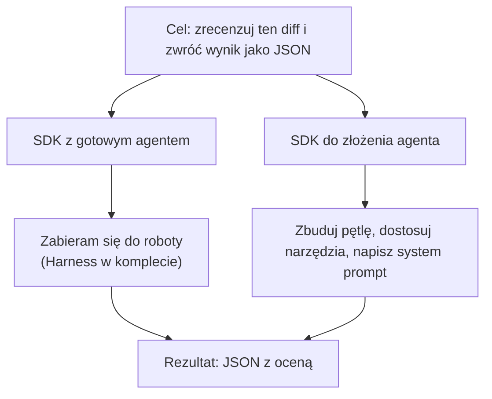
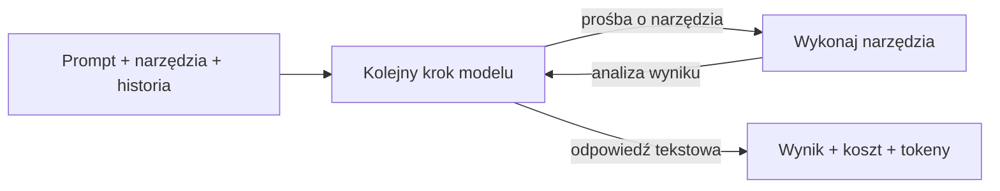

# Twój pierwszy Agent zespołowy: SDK, koszty, integracja


<!-- cdn: https://images.przeprogramowani.pl/lessons/m5-l2/assets/cover.jpg -->

W poprzedniej lekcji rozmawialiśmy o tym, jakie wewnętrzne narzędzia i automatyzacje warto wdrażać w zespole i na poziomie organizacji.

Teraz skupimy się na czysto technicznej stronie takich projektów.

Przez ostatnie cztery moduły sterowałeś agentem w IDE i terminalu. Wpisywałeś polecenia w Cursorze, delegowałeś zadania Claude Code, oglądałeś jak Codex łata testy. Za każdym razem to był jednak czyjś agent. Czyjaś pętla, czyjeś narzędzia, czyjeś domyślne ustawienia no i ręczne sterowanie, zależne od dostępności operatora.

A teraz potrzebujesz czegoś, co działa dokładnie po waszemu i w sposób bardziej autonomiczny, dopasowany do **cyklu życia zespołu** a nie pojedynczej sesji jednego z was. Agenta, który robi review w stylu twojego zespołu, którego odpalisz tam, gdzie chcesz, i który nie wymaga od reszty zespołu otwierania konkretnego edytora.

Kolejne dwie lekcje biorą na warsztat problem, który jest jednym z najczęstszych objawów „agentowego przyspieszenia". Kodu powstaje tyle, że ludzie przestają nadążać z jego przeglądaniem. Review robi się wąskim gardłem - to przy nim wytraca się cała prędkość, którą dał wam agent.

Co więc zrobić? Wynająć kolejnego wirtualnego pracownika - ale nie takiego, który generuje kod, ale który stoi na straży jego jakości, bezpośrednio na drodze na produkcję.

W tej lekcji poznamy pierwsze kroki w całym procesie budowania takiego asystenta — jak go złożyć z dostępnych SDK, jak uruchomić lokalnie, no i oszacować koszt działania. W następnej zepniemy go w prawdziwy system review z człowiekiem w pętli (human-in-the-loop) - agent przygotuje wstępną ocenę, ale ostatnie słowo będzie miał człowiek.

W tej lekcji rezygnujemy z zakupów *z półki z napisem "gotowe"*. Nasz dostosowany do potrzeb zespołu agent będzie czymś, co *złożysz* samodzielnie z dostępnych klocków.

Te klocki to właśnie SDK (Software Development Kit). I tu pojawia się pierwsza decyzja, która zaważy na wszystkim, co zrobisz dalej: czy bierzesz SDK, które daje ci wstępnie uformowanego agenta w pakiecie (np. Codex, Claude, Cursor), czy SDK, które daje ci jego składowe, gdzie narzędzia i mechanizmy kontroli dokładasz sam (np. OpenRouter SDK, Vercel AI SDK).

### Gotowy agent kontra agent do złożenia

Badając rynek można odnieść wrażenie, że wszystkie "agentowe SDK" to mniej więcej to samo, tylko z inną naklejką producenta. To założenie potrafi cię kosztować sporo czasu, bo SDK dzielą się na dwie kategorie, które rozwiązują różne problemy.

**SDK z gotowym agentem** dają ci całego agenta sterowanego programatycznie (skryptowo). Pętlę, narzędzia do plików, basha, sandboxing, czytanie repozytorium — wszystko spięte w działający harness. Podajesz cel ("zrób review tego diffa") i... to w zasadzie wszystko, żeby praca agenta się rozpoczęła. Tak działają [Claude Agent SDK](https://code.claude.com/docs/en/agent-sdk/overview), [Codex SDK](https://developers.openai.com/codex/sdk) i [Cursor SDK](https://cursor.com/blog/typescript-sdk).

Cena za wygodę: jesteś przywiązany do modeli, runtime'u i cennika danego producenta.

**SDK do złożenia agenta** dają ci składowe agenta i punkty montażu: zawołaj model, uruchom narzędzie, dołącz wynik, powtórz, zatrzymaj. Harness, który po drugiej stronie dostajesz gotowy, tutaj *składasz sam* — narzędzia dokładasz własne, a w zamian masz interfejs niezależny od modelu. Tak działają [OpenRouter Agent SDK](https://openrouter.ai/docs/agent-sdk/overview) i [Vercel AI SDK](https://ai-sdk.dev/docs/ai-sdk-core/overview).


<!-- rendered: ../../assets/diagrams-10x/lessons-m5-l2-lesson-draft-1-10x.png | cdn: https://images.przeprogramowani.pl/diagrams/lessons-m5-l2-lesson-draft-1-10x.png -->

Pytanie "które SDK jest najlepsze?" jest źle postawione. Dobre pytanie brzmi: "chcę gotowego agenta kodującego czy framework, z którego sam go złożę?". Prawie każda różnica między tymi narzędziami wynika z tego jednego podziału.

I najlepiej poczuć to na własnej skórze, zapoznając się z oboma kierunkami integracji, na które możemy się tutaj zdecydować.

### Ten sam agent na dwóch SDK

Aby poczuć różnicę między dwoma rodzajami SDK, omówimy teraz dwa podejścia do utworzenia minimalnego agenta do code review, na ten moment **działającego lokalnie i w niezależnej lokalizacji**. Poznamy podobieństwa i różnice, a na koniec tego etapu wdrożymy jedną z opcji w naszym projekcie.

Agent dostanie na wejściu diff z gita, a zwróci ustrukturyzowaną ocenę w formacie JSON: pięć kryteriów z punktacją w skali 1-10 (poprawność implementacji, idiomatyczność, złożoność, pokrycie testami, bezpieczeństwo), wiążący werdykt (pass/fail) i krótkie podsumowanie.

Wszystko lokalnie, jednym poleceniem `git diff | npx tsx review.ts`.

Scenariusz jest stały — ten sam diff na wejściu, ten sam JSON na wyjściu. Zmienną jest kategoria SDK, no i - jako efekt uboczny wybranej opcji - liczba decyzji, jakie musisz podjąć po drodze. Wykorzystamy TypeScript - to obecnie język programowania dający nam najwięcej możliwości w tej konkretnej kategorii narzędzi.

> Wszystkie snippety z tej lekcji — w pełnej, uruchamialnej wersji z importami, schematami i obsługą błędów, które tu dla zwięzłości pomijamy, przejrzysz i odpalisz, pobierając repozytorium [agent-sdk-examples](https://github.com/przeprogramowani/agent-sdk-examples). Wystarczy je sklonować, zrobić `npm install` i uruchamiać kolejne przykłady jednym poleceniem (`npm run ...`).

Zacznijmy od tego, co w obu wersjach jest **identyczne**: prompt systemowy, kalibrujący dalsze działanie agenta, no i wyjściowy schemat wyniku. Wydzielamy je raz, do osobnego modułu (w repozytorium `agent-sdk-examples` to `common/review-schema.ts`), żeby obie implementacje korzystały z jednej definicji.

Schemat wyjścia piszemy w oparciu o bibliotekę `zod` — to nasze jedno źródło prawdy, z którego wyprowadzamy też typ `Review`. Na ten moment nie skupiamy się stricte na jakości prompta do review, a raczej chcemy wszystko złożyć w jedną całość i dalej nad tym iterować.

```typescript
import { z } from "zod";

const SYSTEM_PROMPT = `Jesteś precyzyjnym, konstruktywnym recenzentem kodu oceniającym pull request.
Oceń podany diff w pięciu kryteriach w skali 1-10 (1 = poważne braki, 10 = wzorowo):
poprawność implementacji, idiomatyczność, złożoność, pokrycie testami względem ryzyka, bezpieczeństwo.
Następnie wydaj wiążący werdykt (pass/fail) dla całej zmiany i dołącz krótkie podsumowanie (2-3 zdania)
w Markdown, na podstawie którego autor PR-a będzie mógł działać.`;

// Score'y trzymamy jako zwykłe z.number(): structured output Anthropica odrzuca
// minimum/maximum na typie integer, więc zakres 1-10 wymuszamy opisem pola i promptem,
// a nie samym schematem.
const REVIEW_SCHEMA = z.object({
  implementationCorrectness: z.number().describe("Poprawność implementacji: czy kod robi to, co deklaruje (skala 1-10)"),
  idiomaticity: z.number().describe("Idiomatyczność: zgodność z konwencjami języka i projektu (skala 1-10)"),
  complexity: z.number().describe("Złożoność: prostota rozwiązania względem problemu (skala 1-10)"),
  testRiskCoverage: z.number().describe("Pokrycie testami proporcjonalne do ryzyka zmienianych ścieżek (skala 1-10)"),
  securitySafety: z.number().describe("Bezpieczeństwo: brak podatności i wycieków sekretów (skala 1-10)"),
  verdict: z.enum(["pass", "fail"]).describe("Wiążący werdykt dla całej zmiany"),
  summary: z.string().describe("Podsumowanie w Markdown, gotowe jako komentarz do PR-a"),
});

// Konfiguracja pola target zapewnia zgodność między zodem a Claude Agent SDK
const REVIEW_JSON_SCHEMA = z.toJSONSchema(REVIEW_SCHEMA, { target: "draft-07" });

type Review = z.infer<typeof REVIEW_SCHEMA>;
```

AI SDK weźmie definicję wyjścia prosto od obiektów zoda, a Claude Agent SDK dostanie JSON Schema wyprowadzony z tego samego obiektu przez `z.toJSONSchema()`.

Zwróć uwagę, że każde pole opisaliśmy przez `.describe()`. To nie kosmetyka — opis pola to **istotna dźwignia** sterowania modelem przy generowaniu oczekiwanego formatu odpowiedzi. Działa z dużą skutecznością, więc to właśnie tutaj doprecyzowujesz dwuznaczne nazwy, jednostki czy format. W naszym schemacie opis niesie nawet zakres oceny (skala 1-10) — bo, jak w komentarzu wyżej, nie wymuszamy go przez sam schemat.

Tę dźwignię można dociskać dalej. Zamiast jednozdaniowego opisu możesz wstawić całą rubrykę, która tłumaczy modelowi, jak wygląda ocena skrajna:

```typescript
const REVIEW_SCHEMA = z.object({
  implementationCorrectness: z.number().describe(
    "Poprawność implementacji: czy kod robi to, co deklaruje (skala 1-10). " +
    "1: logika jest błędna lub po cichu psuje istniejące zachowania. " +
    "10: poprawny na ścieżce głównej, w przypadkach brzegowych i w obsłudze błędów."
  ),
  // ...
});
```

Wpływ tego pola na działanie agenta można testować iteracyjnie, na podstawie instrukcji z kolejnej lekcji.

#### Wersja z gotowym agentem (Claude Agent SDK)

W tym scenariuszu instalujesz jedną paczkę agenta (plus `zod` na wspólny schemat) i... to w zasadzie tyle (przynajmniej na początek). Posługując się dokumentacją konfigurujesz core agenta (prompt lub tzw. preset, liczbę tur obsługi narzędzi, same ich definicje czy format wyjściowy), przekazujesz parametr wejściowy no i zaczyna się właściwy proces oceny.

Zanim odpalisz poniższy kod, potrzebujesz minimalnego setupu: projekt Node jako ES Module i jedna paczka runtime plus narzędzia deweloperskie do uruchomienia TypeScriptu.

```bash
npm init -y && npm pkg set type=module       # projekt jako ESM
npm install @anthropic-ai/claude-agent-sdk zod # SDK z gotowym agentem + zod na kontrakt typu danych
npm install -D tsx @types/node                # uruchamianie TS + typy Node
```

Uwierzytelnienie kluczem zostawiamy na potem — jeśli masz aktywną sesję Claude Code, skrypt podejmie twoje credentiale bez jawnego klucza (wracamy do tego w sekcji o kosztach). Jeśli rozwijasz kod w repo, w którym masz zmiany robocze, obecny diff możesz przekazać wprost do reviewera:

```bash
git diff | npx tsx review.ts
```

Alternatywnie, diff możesz też wczytywać z pliku lub z dowolnego innego źródła. Dalsza część to wykorzystanie dostępnych funkcji z pobranego SDK:

```typescript
import { query } from "@anthropic-ai/claude-agent-sdk";
import { z } from "zod"; // tylko po to, by skonwertować wspólny schemat

// Czytanie argumentów z stdin
async function readDiff(): Promise<string> {
  const chunks: Buffer[] = [];
  for await (const chunk of process.stdin) chunks.push(chunk as Buffer);
  return Buffer.concat(chunks).toString("utf8");
}

// Proces review na podstawie git diffa
async function review(diff: string): Promise<Review> {

  // Konfiguracja agenta
  const result = query({
    prompt: `Zrecenzuj ten diff:\n\n${diff}`,
    options: {
      systemPrompt: SYSTEM_PROMPT,
      model: "claude-sonnet-4-6",
      tools: [],
      maxTurns: 2,
      outputFormat: { type: "json_schema", schema: REVIEW_JSON_SCHEMA },
    },
  });

  // Procesowanie odpowiedzi i ew. obsługa błędów
  for await (const message of result) {
    if (message.type !== "result") continue;
    if (message.subtype === "success") {
      const parsed = REVIEW_SCHEMA.safeParse(message.structured_output);
      if (!parsed.success) throw new Error(`Niepoprawny structured output: ${parsed.error.message}`);
      return parsed.data;
    }
    throw new Error(`Review nie powiodło się (${message.subtype}): ${message.errors.join("; ")}`);
  }
  throw new Error("Agent nie zwrócił wyniku");
}

// Entry point całego procesu
const diff = await readDiff();
console.log(JSON.stringify(await review(diff), null, 2));
```

Zwróć uwagę, co dostałeś za darmo, a o czym musisz pamiętać:

- **Cały workflow agenta jest w `query()`.** Nie składasz tego ręcznie — podajesz cel i opcje deklaratywnie, resztę robi harness.
- **Format wyjścia.** Wystarczy podać `outputFormat`, a SDK sam waliduje wynik względem schematu. Samo `structured_output` jest jednak typowane jako `unknown`, więc na koniec przepuszczamy je jeszcze przez `REVIEW_SCHEMA.safeParse()` aby uzyskać gwarancję typu wejściowego.
- **Co najmniej dwie tury.** Ustawiamy `maxTurns: 2`, bo przebieg dzieli się na dwa kroki: w pierwszej turze model czyta diff i formułuje ocenę, a w drugiej emituje ją jako ustrukturyzowany JSON zgodny ze schematem.
- **Kilkanaście narzędzi w zapasie.** Ale tutaj *wyłączasz* je przez `tools: []`, bo chcemy ograniczyć przypadkowe wywołania.
- **Rola recenzenta.** Definiowana przez pole `systemPrompt` - jeszcze do tego wrócimy.
- **Błąd łapiesz sam.** Kiedy `subtype` to nie `success`, czytasz `errors` i kończysz po swojemu. Jak tego nie zrobisz, a pętla poleci dalej, SDK rzuci surowym wyjątkiem zamiast czytelnego komunikatu.
- **Start bez klucza.** Jeśli na twojej maszynie masz aktywną sesję Claude Code, w Claude Agent SDK nie musisz (na start) podawać klucza jawnie - skrypt wykorzysta twoje credentiale. To musi się jednak zmienić np. integrując agenta w CI/CD - do tego jeszcze wrócimy.

#### Wersja do złożenia (Vercel AI SDK 6)

Ten sam scenariusz, ten sam JSON na wyjściu. Ale instalujesz trzy oddzielne paczki - to baza (`ai`), model (`@openrouter/ai-sdk-provider`) i schemat (`zod`), działające jako trzy wymienne kawałki dające ci więcej elastyczności.

```bash
npm init -y && npm pkg set type=module
npm install ai zod @openrouter/ai-sdk-provider
npm install -D tsx @types/node
```

I od razu z tej elastyczności korzystamy: zamiast LLMa od Anthropica wskazujemy model spoza tego ekosystemu (GLM przez OpenRouter).

```typescript
import { ToolLoopAgent, Output, stepCountIs } from "ai";
import { openrouter } from "@openrouter/ai-sdk-provider";

// Czytanie argumentów z stdin
async function readDiff(): Promise<string> {
  const chunks: Buffer[] = [];
  for await (const chunk of process.stdin) chunks.push(chunk as Buffer);
  return Buffer.concat(chunks).toString("utf8");
}

// Proces review na podstawie git diffa
async function review(diff: string): Promise<Review> {

  // Wykorzystanie tzw. pętli agentowej z AI SDK
  const reviewer = new ToolLoopAgent({
    model: openrouter("z-ai/glm-5.1"),
    instructions: SYSTEM_PROMPT,
    tools: {},
    output: Output.object({ schema: REVIEW_SCHEMA }),
    stopWhen: stepCountIs(2),
  });

  const { output } = await reviewer.generate({
    prompt: `Zrecenzuj ten diff:\n\n${diff}`,
  });
  return output;
}

const diff = await readDiff();
console.log(JSON.stringify(await review(diff), null, 2));
```

Koncepcyjnie, praca z `ai-sdk` w wersji 6 przypomina deklaratywne rozwiązania w stylu Claude Agent SDK. Wszystko dzięki nowości w postaci `ToolLoopAgent`. To API trafiło do biblioteki dopiero w AI SDK 6 (stabilnym od grudnia 2025) — w AI SDK 5 ta sama klasa była eksperymentalna i nazywała się `Experimental_Agent` (z polem `system` zamiast `instructions`). O konsekwencjach tej zmiany w dalszej części lekcji.

A co uzyskujemy w tej konfiguracji?

- **Model importujesz jawnie.** Tu od razu korzystamy ze wspomnianej swobody, wskazując model z szerokiego katalogu OpenRoutera. Podmiana dostawcy to zmiana jednej linijki: zamiast `@openrouter/ai-sdk-provider` wstawiasz `@ai-sdk/anthropic` albo `@ai-sdk/openai`.
- **Workflow startuje z klasy `ToolLoopAgent`.** Sam podajesz `tools` — na ten moment nie potrzebujemy niestandardowych definicji.
- **Ten sam schemat, bez konwersji.** `Output.object` bierze nasz `REVIEW_SCHEMA` (zod) wprost, bez dodatkowej konwersji.
- **Warunek stopu ustawiasz ręcznie.** `stopWhen: stepCountIs(2)` to twój odpowiednik `maxTurns`. Sama pętla i tak stanęłaby wg ustawień domyślnych po `stepCountIs(20)` — my świadomie skracamy ją do dwóch kroków, bo recenzja nie potrzebuje więcej.
- **Klucz API musi być wczytany jawnie.** Bez `OPENROUTER_API_KEY` ten kod nie ruszy: `@openrouter/ai-sdk-provider` potrzebuje twoich credentiali.

Mając przed oczami obie implementacje, pojawia się pytanie - na którą opcję się zdecydować?

Żadne z tych SDK nie jest "lepsze". SDK z gotowym agentem to sposób na szybkie wdrożenie agenta kodującego pracującego na twoim systemie plików. Po SDK w stylu Vercela sięgasz wtedy, gdy wybór modelu, podmiana dostawcy albo pełna dowolność podmiany narzędzi znaczą dla ciebie więcej niż wbudowany config i harness.

Tu właśnie czai się najczęstszy błąd: ktoś wybiera SDK po znajomości marki ("używam Claude, to wezmę Claude SDK"), traktuje wybór jak kosmetykę i odbija się od ściany, gdy zadanie potrzebowało drugiej kategorii.

Stąd warto zacząć od pytania ile elastyczności potrzebujesz i na ile chciałbyś iterować z różnymi modelami, a dopiero potem przejść do "które rozwiązanie wybrać?". Jeśli nie liczą się koszta, masz zaufanie do dostawcy i chcesz korzystać z tego samego silnika co Codex CLI czy Claude Code, wtedy gotowe paczki z agentami (Codex SDK, Claude Agent SDK) będą dla ciebie lepszym wyjściem. Jeśli natomiast chcesz mieć kontrolę nad całym procesem lub trwać w procesie ciągłej optymalizacji każdej składowej - wtedy lepiej agenta złożyć samemu.

W 10xCards rozpoczniemy od wystawienia prostego agenta do review na podstawie `Vercel AI SDK` aby być w stanie na bieżąco żonglować modelami. Zaczniemy od wstępnej integracji agenta, a następnie zrefaktoryzujemy go pod integrację z CI:CD

Zaczynamy od dodania AI SDK do projektu:

<div style="padding:56.25% 0 0 0;position:relative;"><iframe src="https://player.vimeo.com/video/1200970790?badge=0&amp;autopause=0&amp;player_id=0&amp;app_id=58479" frameborder="0" allow="autoplay; fullscreen; picture-in-picture; clipboard-write; encrypted-media; web-share" referrerpolicy="strict-origin-when-cross-origin" style="position:absolute;top:0;left:0;width:100%;height:100%;" title="M5 L2 agent-integration"></iframe></div><script src="https://player.vimeo.com/api/player.js"></script>

A następnie sprzątamy po pierwszych krokach Agenta:

<div style="padding:56.25% 0 0 0;position:relative;"><iframe src="https://player.vimeo.com/video/1200970789?badge=0&amp;autopause=0&amp;player_id=0&amp;app_id=58479" frameborder="0" allow="autoplay; fullscreen; picture-in-picture; clipboard-write; encrypted-media; web-share" referrerpolicy="strict-origin-when-cross-origin" style="position:absolute;top:0;left:0;width:100%;height:100%;" title="M5 L2 agent-refractor"></iframe></div><script src="https://player.vimeo.com/api/player.js"></script>

> Jeśli chcesz, możesz teraz wystawić podobną wersję agenta u siebie - na razie wciąż lokalnie, bez integracji CI/CD i dodatkowych narzędzi.

### Co tak naprawdę robi pętla agenta

W obu wersjach skryptu pracę agenta umownie określaliśmy jako "workflow" - w pierwszym przypadku ukrywało go `query` a w drugim `ToolLoopAgent`. Trzeba to jednak doprecyzować wskazując, że workflow agenta to tzw. `pętla narzędziowa` albo `tool loop`. Co to oznacza? Pracując z agentami w IDE lub Terminalu widziałeś to na żywo - to wszystkie pośrednie operacje reasoningu i wywoływania zewnętrznych narzędzi, które wykonują się pomiędzy twoim zapytaniem a finalną odpowiedzią agenta.

Tutaj, w wersji skryptowej, nie jest to proces poboczny, a w zasadzie `core` tego co budujemy. Wpływa na koszta, możliwości i odporność agenta.

Anthropic opisuje to na pięciu krokach:

1. **Wejście.** Model dostaje twój prompt razem z promptem systemowym, definicjami narzędzi i dotychczasową historią rozmowy.
2. **Decyzja.** Model ocenia stan i wybiera, co dalej: odpowiada tekstem, prosi o wywołanie jednego lub kilku narzędzi, albo jedno i drugie naraz.
3. **Wykonanie narzędzi.** Uruchamiane zostają żądane narzędzia i zbierane są ich wyniki.
4. **Powrót.** Wyniki wracają do modelu jako wejście do kolejnej rundy. Kroki 2-3 powtarzają się w kółko.
5. **Wynik.** Gdy model odpowie samym tekstem, bez żądania narzędzi, pętla się kończy i oddaje wynik — razem z kosztem i zużyciem tokenów.


<!-- rendered: ../../assets/diagrams-10x/lessons-m5-l2-lesson-draft-2-10x.png | cdn: https://images.przeprogramowani.pl/diagrams/lessons-m5-l2-lesson-draft-2-10x.png -->

Jedno pełne okrążenie (decyzja modelu, wykonanie narzędzi, powrót wyniku) to jedna **tura** (stąd ustawienia typu `maxTurns`). Proste pytanie zamyka się w jednej czy dwóch turach; złożone zadanie potrafi nawiązać kilkanaście tur (czyta pliki, edytuje kod, odpala testy), aż model uzna, że skończył. W naszym review świadomie ścinamy to do 2-3 kroków, bo recenzja diffa nie potrzebuje więcej.

Cała różnica między gotowym agentem a wersją do złożenia sprowadza się do jednego pytania: **kto pisze kroki 3 i 4 całej pętli?**

**Pętla schowana za gotowymi funkcjami i klasami.** Im więcej klocków dostajesz w pakiecie, tym bardziej pętla agenta będzie samoobsługowa. W Claude Agent SDK całą tę mechanikę chowa wywołanie `query()`. Gotowy agent sam uruchamia żądane narzędzia, sam dokleja ich wyniki do rozmowy i sam zawraca do modelu — i robi to bez oddawania sterowania, dopóki agent nie skończy. W AI SDK 6 przejmuje to `ToolLoopAgent`, który również bazuje już na bardziej deklaratywnym setupie.

**Pętle pisane ręcznie, do AI SDK 5.** Zanim w Vercel AI SDK pojawił się `ToolLoopAgent`, pętlę na AI SDK pisało się z ręki — i to jest dokładnie ten kod, który decyduje o jakości agenta, a właściwie jego harnessu.

W uproszczeniu wyglądało to tak:

```typescript
const messages: ModelMessage[] = [{ role: "user", content: prompt }];
let step = 0;
while (true) {
  const result = await generateText({ model, messages, tools }); // Generuj odpowiedź modelu
  messages.push(...result.response.messages);  // Dopisz wiadomość do historii
  if (result.finishReason !== "tool-calls") break; // Brak potrzeb korzystania z narzędzi
  for (const call of result.toolCalls) {
    const output = await runTool(call); // Wyszukaj i wywołaj narzędzie
    messages.push({ // Procesuj wynik kolejnego narzędzia
      role: "tool",
      content: [{ type: "tool-result", toolCallId: call.toolCallId, toolName: call.toolName, output }],
    });
  }
  if (++step >= MAX_STEPS) break;                         // sam pilnujesz warunku stopu
}
```

Policz, ile rzeczy musisz kontrolować tu samemu: tablicę `messages` i jej dopisywanie po każdej turze, samą pętlę `while`, odczyt `finishReason`, ręczne wywołanie każdego narzędzia, sformatowanie wyniku jako wiadomości `tool` i odesłanie go z powrotem do modelu, wreszcie własny licznik kroków jako warunek stopu. Pomyłka w którymkolwiek z tych miejsc daje albo agenta, który nie reaguje na wynik narzędzia, albo pętlę, która nie chce się zatrzymać.

**Co robi teraz `ToolLoopAgent`.** AI SDK 6 zawija dokładnie ten szkielet w jedną klasę. Cały `while`, dopisywanie wiadomości, odczyt `finishReason`, uruchamianie narzędzi i odsyłanie ich wyników dzieją się pod spodem `generate()`. Ty deklarujesz już tylko części składowe: `model`, `tools`, `output` i `stopWhen` — a pętla, którą wcześniej składałeś ręcznie, jest gotowa w środku. Dlatego nasza wersja do złożenia jest tak samo krótka jak ta z gotowym agentem.

Gotowy agent (Claude Agent SDK, Codex SDK) i `ToolLoopAgent` ukrywają tę samą pętlę; różnią się tym, ile jeszcze *poza* pętlą dostajesz w pakiecie (narzędzia, sandbox, compaction w gotowym agencie) kontra ile zostaje po twojej stronie (wybór modelu, własne narzędzia, persystencja przy wersji do złożenia). Pętla jest wspólnym mianownikiem — reszta to dokładnie ta różnica kategorii, od której zaczęliśmy.

### Czy agent pamięta poprzedni przebieg sesji

Pamięć naszego recenzenta jest ulotna - odpalasz, zwraca JSON, kończy. Następne `npx tsx review.ts` startuje od zera — nie wie nic o poprzednim. Przy recenzji diffa to nawet wygodne, bo każdy przebieg jest czysty. Ale gdy tylko agent wchodzi w prawdziwy obieg pracy, wraca pytanie: review przychodzi po poprawkach, ktoś dopytuje, zmiana ewoluuje. **Czy agent pamięta, co już przeanalizował, czy za każdym razem czyta wszystko od nowa?**

To jedna z najgrubszych różnic między obiema kategoriami i biegnie dokładnie wzdłuż naszej głównej osi „gotowy kontra do złożenia". Chodzi o to, *gdzie mieszka stan*: czy trzyma go za ciebie harness, czy twój własny kod.

**Gotowy agent trzyma sesję sam.** Claude Agent SDK zapisuje stan przebiegu na dysk i pozwala go wznowić. Z pierwszej wiadomości (`init`) łapiesz `session_id`, a potem oddajesz go przy kolejnym wywołaniu — i cały kontekst (przeczytane pliki, dotychczasowa analiza, historia rozmowy) wraca na stół, bez wczytywania diffa po raz drugi:

```typescript
// pierwszy przebieg: zapamiętaj id sesji
let sessionId: string | undefined;
for await (const message of query({ prompt: `Zrecenzuj ten diff:\n\n${diff}`, options })) {
  if (message.type === "system" && message.subtype === "init") sessionId = message.session_id;
  // ...odbiór wyniku jak wcześniej
}

// kolejny przebieg (np. po poprawkach): wznów ten sam kontekst
query({
  prompt: "Autor naniósł poprawki. Sprawdź, czy adresują twoje wcześniejsze uwagi.",
  options: { ...options, resume: sessionId },   // agent pamięta, co już widział
});
```

Możesz nawet sesję *rozszczepić* (`fork`), żeby sprawdzić alternatywną ścieżkę, nie psując oryginału. Stan żyje w harnessie — ty operujesz tylko jego identyfikatorem. Tak samo działają pozostałe gotowe agenty: Codex trzyma wątki w `~/.codex/sessions` i wznawiasz je po id (`resumeThread`).

**Wersja do złożenia nie ma czego wznawiać — bo nie ma sesji.** Vercel AI SDK nie zna pojęcia „sesji" zapisanej na dysku. Każde `generate()` to osobny strzał; klasa `ToolLoopAgent` przechowuje *konfigurację* (model, narzędzia, warunek stopu), ale nie *historię*. Jeśli kolejny przebieg ma cokolwiek pamiętać, to ty wieziesz historię ze sobą — trzymasz tablicę `messages` i podajesz ją z powrotem:

```typescript
// brak sesji: historię prowadzisz sam i podajesz przy każdym wywołaniu
const messages: ModelMessage[] = [{ role: "user", content: `Zrecenzuj ten diff:\n\n${diff}` }];
const first = await reviewer.generate({ messages });
messages.push(...first.response.messages);                    // dopisz, co odpowiedział model

messages.push({ role: "user", content: "Sprawdź, czy poprawki adresują twoje uwagi." });
const second = await reviewer.generate({ messages });         // kontynuacja = ty doniosłeś kontekst
```

> **Uwaga:** `output` ustawiasz na agencie (w konstruktorze `ToolLoopAgent`), nie na pojedynczym `generate()`. Dlatego ten sam `reviewer` ze structured output wymusiłby schemat również na pytaniu uzupełniającym — jeśli druga tura ma wrócić zwykłym tekstem, użyj do niej osobnego agenta bez `output`, podając mu tę samą tablicę `messages`.

Gotowy agent robi część roboty za ciebie (persystencja, wznawianie, forkowanie sesji), a w zamian wiążesz się z jego runtime'em; wersja do złożenia nie robi nic sama, ale za to *ty* decydujesz, co przetrwa do następnego przebiegu, gdzie to zapiszesz (plik, baza, kolejka) i kiedy wczytasz. Przy jednorazowym review ta różnica nie boli. Robi się kluczowa przy agentach asynchronicznych i długo żyjących, którym poświęcona jest lekcja *Async & Remote Agents* (M5L5): cały sens polega tam na tym, że agent wraca do zadania po godzinach i musi wiedzieć, na czym skończył.

### Co twój agent dziedziczy z repo: reguły, skille, bezpieczeństwo

Skoro przez cztery moduły obkładałeś repo regułami dla agenta — `CLAUDE.md`, `AGENTS.md`, skille w `.claude/skills`, hooki, reguły uprawnień — to **czy agent, którego właśnie składasz z SDK, w ogóle to wszystko czyta?**

Odpowiedź jest dokładnie tej samej natury, co cała lekcja: zależy od kategorii. Te reguły to nie magia wbudowana w model — to pliki na dysku, które *ktoś* musi wczytać i wstrzyknąć agentowi. Gotowy agent potrafi je podnieść sam, bo to ten sam harness, który czyta je, gdy sterujesz nim ręcznie z terminala. W wersji do złożenia nie ma żadnego „samo". Jeśli chcesz, żeby twój agent znał reguły repo, **wczytujesz je własnym kodem.**

**Gotowy agent dziedziczy konfigurację repo — bo to ten sam harness.** Claude Agent SDK to dosłownie Claude Code zapakowany w bibliotekę, więc zna te same miejsca, do których zaglądasz, pracując w terminalu:

| Co | Skąd ładuje gotowy agent (Claude Agent SDK) |
|---|---|
| Pamięć projektu (instrukcje) | `CLAUDE.md` lub `.claude/CLAUDE.md` |
| Skille (auto albo `/nazwa`) | `.claude/skills/*/SKILL.md` |
| Komendy (legacy) | `.claude/commands/*.md` |
| Hooki (np. `PreToolUse`, `PostToolUse`) | konfiguracja + callbacki w opcjach |
| Uprawnienia / tryb edycji | `allowedTools`, `permissionMode` |
| Serwery MCP, pluginy | `mcpServers`, `plugins` |

Domyślnie SDK ładuje ustawienia z `.claude/` w katalogu roboczym i z `~/.claude/` (zawężasz to opcją `settingSources` — `user` / `project` / `local`). Ale jest tu jeden niuans, na którym łatwo się przejechać, i nasz `review.ts` jest tego idealnym przykładem: **żeby agent faktycznie wciągnął `CLAUDE.md`, musisz włączyć preset systemowy `claude_code`.** W naszym review podaliśmy *własny* `systemPrompt` (rola recenzenta) i `tools: []` — czyli świadomie odcięliśmy się od pamięci projektu, skilli i wbudowanych narzędzi. To było celowe: recenzja diffa ma być wąska i przewidywalna, a nie sterowana przypadkowym `CLAUDE.md`. Gdybyś chciał odwrotnie — agenta, który respektuje konwencje repo tak samo jak twój Claude Code — sięgasz po preset i ładowanie ustawień:

```typescript
// Gotowy agent dziedziczy reguły, skille i pamięć repo
const result = query({
  prompt: `Zrecenzuj ten diff:\n\n${diff}`,
  options: {
    systemPrompt: { type: "preset", preset: "claude_code" }, // wciąga CLAUDE.md + konwencje
    settingSources: ["project"],                              // .claude/ z repo: skille, ustawienia
    skills: "all",                                            // udostępnij modelowi odkryte skille
    allowedTools: ["Read", "Glob", "Grep"],                   // niech zajrzy do sąsiednich plików
  },
});
```

Dwie rzeczy decydują tu o tym, czy skill faktycznie zadziała. `skills: "all"` to w SDK jedyne miejsce, w którym udostępniasz modelowi odkryte skille (możesz też podać listę nazw, np. `["greeting"]`) — sam preset i `settingSources` udostępniają pliki, ale to ta opcja wpuszcza je do listy widzianej przez model. A `settingSources: ["project"]` ładuje `.claude/` z *katalogu roboczego* — jeśli twój `.claude/skills` leży gdzie indziej niż miejsce, z którego odpalasz skrypt, wskaż ten katalog jawnie opcją `cwd`.

Pozostałe gotowe agenty działają tak samo, każdy w swoim ekosystemie. **Codex SDK** odpala binarkę `codex` jako podproces, więc dziedziczy dokładnie to, co CLI: pliki `AGENTS.md` z repo, konfigurację z `~/.codex/config.toml` i presety sandboxa — a przez opcję `config` w SDK dorzucasz nadpisania (lecą do CLI jako flagi `--config`). **Cursor SDK** podnosi skille z `.cursor/skills/` i hooki z `.cursor/hooks.json` — ten sam config projektu, który napędza edytor Cursor. We wszystkich trzech zasada jest ta sama: *to ten sam harness*, więc reguły, które spisałeś dla ręcznej pracy, jadą z agentem za darmo.

**Agent do złożenia nie dziedziczy niczego — bo nie ma harnessu, który by to czytał.** Vercel AI SDK i OpenRouter Agent SDK nie mają pojęcia `CLAUDE.md`, `AGENTS.md`, `.claude/skills` ani `.cursor/hooks.json`. Dostają tylko to, co podasz im jawnie w `instructions` / `system`. Twoje reguły repo dla takiego agenta po prostu nie istnieją, dopóki sam ich nie wczytasz:

```typescript
// Wersja do złożenia: reguły nie wczytają się same — sam je czytasz i wstrzykujesz
import { readFileSync } from "node:fs";

const projectRules = readFileSync("CLAUDE.md", "utf8"); // konwencje repo, wczytane ręcznie
const reviewer = new ToolLoopAgent({
  model: openrouter("z-ai/glm-5.1"),
  instructions: `${SYSTEM_PROMPT}\n\nKonwencje projektu:\n${projectRules}`,
  // ...
});
```

Wersja do złożenia oddaje ci pełną kontrolę nad tym, *co* trafia do promptu, w zamian za to, że nic nie dzieje się samo. Skille jako auto-ładowane zdolności, hooki cyklu życia, pamięć projektu — w tym świecie to wzorce, które implementujesz sam (regułę dokleisz do `instructions`, „hook" zrobisz własnym `StopCondition` albo logiką wokół pętli), a nie pliki, które framework znajdzie za ciebie.

**Bezpieczeństwo idzie tym samym podziałem.** Reguły dla agenta to nie tylko „jak ma pisać kod" — to też „czego mu nie wolno". I tu gotowy agent znów daje ci gotowy mechanizm: listę dozwolonych narzędzi (`allowedTools`), tryb uprawnień (`permissionMode`), hook `PreToolUse`, który potrafi *zablokować* ryzykowne wywołanie zanim się wykona, a w Codeksie presety sandboxa ustawiane per tura (`read_only` na planowanie, `workspace_write` na zmiany). To te same zabezpieczenia, które chronią cię, gdy agent działa w terminalu — tyle że teraz konfigurujesz je z kodu. W wersji do złożenia żadnego sandboxa ani systemu uprawnień nie ma: agent może dotknąć tylko tych narzędzi, które sam mu napisałeś, a jedyną bramką jest twój własny gate zatwierdzenia (`needsApproval` w Vercelu, tryby HITL w OpenRouterze).

Praktyczny wniosek na wybór SDK: jeśli twój zespół już zainwestował w reguły, skille i config dla konkretnego narzędzia (`CLAUDE.md`, `AGENTS.md`, `.cursor/`), gotowy agent z *tego samego* ekosystemu zabierze tę robotę ze sobą bez przepisywania. Jeśli stawiasz na podmianę modeli i niezależność od dostawcy, godzisz się, że spójność reguł utrzymujesz sam — i właśnie ta praca, czyli zamiana repo-lokalnych reguł we **wspólny, zespołowy rejestr** skilli i konwencji, którym dzieli się cały zespół, to temat lekcji *Shared AI Registry: skille, komendy i reguły dla zespołu* (M5L4).

### Kto teraz widzi twój diff

Samo SDK bezpośrednio nie wpływa na polityki prywatności poszczególnych rozwiązań. To, czy twój kod może trafić do procesu treningu, jak długo jest przechowywany i gdzie fizycznie ląduje, rozstrzyga się na backendzie, a konkretniej: wynika ze **ścieżki uwierzytelnienia**, którą wybierzesz.

Claude Agent SDK ma dwa różne reżimy danych zależnie od tego, jak się zalogujesz:

- **Klucz z konsoli (komercyjny).** Warunki komercyjne mówią wprost, że Anthropic nie trenuje modeli na twojej treści, a sam producent kieruje twórców agentów właśnie na ten klucz. To bezpieczny domyślny wybór dla kodu firmowego.
- **Login subskrypcyjny (konsumencki).** Gdy nie ustawisz klucza, agent po cichu sięga po twój login Claude Code — a `claude -p` i całe Agent SDK na subskrypcji Pro/Max podpadają pod warunki konsumenckie. Tam od 28 sierpnia 2025 trening jest **domyślnie włączony** (wyłączasz go w ustawieniach prywatności Claude), a retencja sięga 5 lat, dopóki go nie zdejmiesz — wobec 30 dni i braku treningu na kluczu komercyjnym ([warunki konsumenckie Anthropic](https://www.anthropic.com/news/updates-to-our-consumer-terms)).

Reguła powtarza się u każdego dostawcy: **najtańsza i najwygodniejsza ścieżka bywa najbardziej „przeciekająca".** Login konsumencki Claude, logowanie Codeksa przez darmowy ChatGPT, darmowe modele na OpenRouterze. Każde z nich oddaje trochę ochrony danych w zamian za niższy koszt albo mniej formalności. Ścieżkę dobierasz więc pod wrażliwość danych, nie odwrotnie.

W wersji do złożenia jest jeszcze jeden zwrot akcji: biblioteka `ai` (Vercel) domyślnie **w ogóle nie stoi na drodze twoich danych**. Żądanie idzie wprost do dostawcy, którego zaimportowałeś, i obowiązują wyłącznie jego warunki. Dostawca SDK i podmiot przetwarzający twój kod to mogą być dwie zupełnie różne firmy. Dopiero włączenie opcjonalnego proxy ([Vercel AI Gateway](https://vercel.com/ai-gateway)) wpina Vercela w tę ścieżkę.

A jeśli wiążą cię wymogi rezydencji danych w UE, dobrze wiedzieć z góry, gdzie są dziury: AI Gateway Vercela działa tylko w USA, a Cursor nie ma samoobsługowej rezydencji w UE. W obu przypadkach wyjściem bywa wskazanie własnego dostawcy w regionie UE. To znów ta sama dźwignia: w wersji do złożenia kontrolę trzymasz po swojej stronie.

### Kontrola kosztów

Skoro agent ma chodzić często, dochodzą dwa pytania operacyjne: ile to kosztuje i jak ten koszt kontrolować. Ta sama ścieżka uwierzytelnienia, która przed chwilą decydowała o danych, decyduje też o rachunku. Poza nią odpowiedź znów zależy od kategorii SDK — i znów gotowy agent robi część roboty za ciebie.

**Tokeny pobierasz wprost z obiektu odpowiedzi.** W Claude Agent SDK, ta sama wiadomość `result`, z której wyjmujesz `structured_output`, niesie też pole `usage` (tokeny wejścia i wyjścia, z rozbiciem na cache):

```typescript
if (message.subtype === "success") {
  message.usage.input_tokens; // tokeny (snake_case, z rozbiciem na cache)
  message.total_cost_usd;     // gotowy koszt w USD — bez tabeli stawek
  message.modelUsage;         // rozbicie per model (camelCase: inputTokens, costUSD…)
}
```

W wersji do złożenia (AI SDK) funkcja `generate()` zwraca obok wyniku `totalUsage` — w naszym kodzie destrukturyzujemy tylko `{ output }`, ale tokeny czekają tuż obok:

```typescript
const { output, totalUsage } = await reviewer.generate({ prompt });
// totalUsage.inputTokens, totalUsage.outputTokens, totalUsage.totalTokens
```

**Zużycie na bieżąco.** Przy dłuższej pętli czasem chcesz widzieć zużycie narastająco — choćby po to, żeby wyłapać przebieg, który zaczął się zapętlać, zanim algorytm dobije do `stepCountIs`. Wersja do złożenia daje ci na to hook: `onStepFinish` odpala się po każdej turze i wręcza numer kroku, zużycie tokenów i powód zakończenia, więc telemetrię per krok składasz sam:

```typescript
await reviewer.generate({
  prompt,
  onStepFinish: ({ stepNumber, usage, finishReason }) => {
    console.log(`krok ${stepNumber}: ${usage.inputTokens} in / ${usage.outputTokens} out (${finishReason})`);
  },
});
```

**Koszt w dolarach to już inna historia.** Claude Agent SDK liczy go za ciebie — `result` ma gotowe pole `total_cost_usd`, a do tego `modelUsage` (rozbicie per model), `num_turns` i `duration_ms`. Komplet metryk operacyjnych dostajesz bez żadnej tabeli stawek.

Wersja do złożenia daje ci same tokeny, a koszt składasz sam. I tu znów to provider, nie SDK, wnosi część rozwiązania: provider OpenRoutera, którego użyliśmy, zwraca realny, rozliczony koszt w `providerMetadata.openrouter.usage.cost` — pod warunkiem, że włączysz raportowanie zużycia (`usage: { include: true }`). Z providerem, który kosztu nie raportuje, zostaje ci pomnożenie tokenów z `totalUsage` przez stawki modelu.

**Twardy limit kosztu wyłamuje się z tego podziału.** Przy tokenach i koszcie w dolarach regułą było „gotowy agent robi część roboty za ciebie". Przy twardym suficie tej reguły już nie ma: to, czy dostajesz gotowy prymityw, zależy od konkretnego SDK, a nie od tego, czy to gotowy agent, czy wersja do złożenia. Gotowy agent daje go przez opcję `maxBudgetUsd` — po przekroczeniu zatrzymuje przebieg i zwraca `error_max_budget_usd`, ten sam subtyp błędu, który łapiesz w bloku wyżej.

Po stronie do złożenia gotowy prymityw `maxCost` ma **OpenRouter Agent SDK**. I tu uważaj na nazwę: w naszym kodzie review używamy OpenRoutera jako *providera* pod Vercel AI SDK — a to zupełnie co innego niż OpenRouter Agent SDK, osobne SDK do złożenia agenta. Ta sama marka, dwie różne rzeczy:

```typescript
// gotowy agent (Claude Agent SDK):  options: { maxBudgetUsd: 0.5, ... }
stopWhen: maxCost(0.5) // OpenRouter Agent SDK: twardy sufit 50 centow na przebieg
```

Wyjątkiem jest Vercel AI SDK 6: nazwanego `maxCost` tu nie ma, a samo podłączenie OpenRoutera jako providera tego nie zmienia. Ten sam efekt nadal osiągniesz, ale musisz dopisać własny `StopCondition`, który zlicza koszt po krokach.

Jedna rzecz, o której warto wiedzieć z wyprzedzeniem: od 15 czerwca 2026 użycie programistyczne Claude na planach subskrypcyjnych (`claude -p` i Claude Agent SDK) zużywa budżet z nowego, osobnego **miesięcznego kredytu Agent SDK**, oddzielonego od limitów pracy interaktywnej — czyli agent w pętli nie zjada ci już budżetu na ręczne sesje w terminalu i odwrotnie. Mechanika i kwoty potrafią się zmieniać, więc przed wdrożeniem zerknij do [opisu kredytu Agent SDK](https://support.claude.com/en/articles/15036540-use-the-claude-agent-sdk-with-your-claude-plan) i aktualnego cennika.

Same stawki za tokeny też są ruchome. Na połowę 2026 utrzymuje się ten sam wzorzec, do którego przywykłeś z preworku: model mocniejszy (Opus) kosztuje wyraźnie więcej za tokeny niż codzienny (Sonnet) czy tani (Haiku). Dlatego w przykłądzie z gotowym agentem zostawiliśmy Sonneta jako model domyślny. To ta sama logika doboru modelu do roli, którą poznałeś w preworku [3.5].

Cały czas trzymamy się tu lokalnego uruchomienia: agent chodzi na twojej maszynie, a tokeny i koszt czytasz wprost z jego odpowiedzi.

## 🧑🏻‍💻 Zadania praktyczne

Zanim wejdziesz w zadania, jedna uwaga organizacyjna o odznace **10xChampion**: zaliczasz ją **jednym** projektem praktycznym — albo pipeline'em do review kodu (zadania z M5L2 i M5L3), albo rejestrem artefaktów AI (M5L4). Wybierz ścieżkę bliższą twojej codziennej pracy. Twój pipeline domknie się dopiero w M5L3 — tam też zbierzesz zrzuty ekranu, które są dowodem na 10xChampion (kategorie: M5L1, Krok 4).

Budujemy pierwszą wersję prostego, oskryptowanego agenta do code review, którego w kolejnej lekcji wdrożymy i rozbudujemy na CI/CD.

1. **Wybierz jedną z prezentowanych w tej lekcji opcji**
- Claude Agent SDK
- Codex SDK
- Cursor SDK
- Vercel AI SDK
- OpenRouter Agent SDK

2. **Zintegruj ją z twoim projektem jako niezależna paczka**
- W przypadku Vercel AI SDK wykorzystaj gotowy skill `npx skills add vercel/ai`
- W przypadku innych dostawców, pobierz dokumentację jako kontekst i poproś agenta o konfigurację

3. **Potwierdź udaną komunikację z wybranym modelem**
- Wykorzystaj podstawowy prompt do code review oraz symulowany diff (wygeneruj przez agenta)
- Sprawdź, czy model odpowiada poprawnie (jeśli nie, przeanalizuj z agentem logi i upewnij się, że ustawiłeś klucz do API)

## Odbierz odznakę za tę lekcję

Po ukończeniu tej lekcji odbierz odznakę za lekcję w sekcji [10xDevs Mission Log](https://platforma.przeprogramowani.pl/10xdevs-3/mission-log) a następnie pochwal się swoim osiągnięciem!

## 🔎 Deep Dive

Ta sekcja zawiera dodatkowe pogłębienie wiedzy na temat wybranych zagadnień związanych z lekcją. W tym Deep Dive znajdziesz:

- **Co można z tego zbudować** — krótkie omówienie potencjalnych zastosowań Agent SDK w twoich projektach.
- **Cheatsheet agentowych SDK** — przegląd pięciu SDK przez pryzmat kategorii, mocnej strony i pułapek, a do tego krótki przekrój język/runtime każdego z nich.
- **Ten sam model, inne efekty?** - jak harness i opakowanie modelu wpływają całościowo na wyniki realizowanego zadania
- **Agent jako samodzielna, wdrażalna jednostka** — kluczowe koncepty Cloudflare Agents SDK: co się zmienia, gdy agent nie żyje na twojej maszynie, tylko na krawędzi sieci.

Ta sekcja lekcji nie jest obowiązkowa, ale warto się z nią zapoznać jeżeli chcesz zostać ekspertem.

### Co można z tego zbudować

Recenzent diffa to tylko pierwszy przykład, bo akurat review najszybciej robi się wąskim gardłem. Ale skoro umiesz już złożyć agenta z SDK, ten sam schemat — *weź zdarzenie z cyklu wytwarzania, oddaj agentowi żmudny kawałek, zbierz ustrukturyzowany wynik* — przykłada się do większości miejsc, w których ludzie tracą czas na powtarzalną robotę. Kilka wpięć w SDLC, które realnie zdejmują obciążenie z zespołu:

- **Code review jako pierwszy przebieg.** Agent ocenia diff zanim zrobi to człowiek: wyłapuje oczywiste błędy, luki w testach i odstępstwa od konwencji, a recenzentowi zostawia decyzje, które naprawdę wymagają głowy. To dokładnie nasz agent, tylko wpięty w pull requesta — jak to zrobić z człowiekiem w pętli, pokazuje lekcja *Code Review w erze AI* (M5L3).
- **Self-heal czerwonego builda lub ticketa.** Agent dostaje log nieudanego CI albo zgłoszenie, reprodukuje problem zdalnie, proponuje poprawkę i otwiera szkic PR-a do akceptacji. Zamiast „ktoś musi to przysiąść jutro rano" dostajesz gotowy punkt startowy.
- **Triage backlogu i bug reportów.** Nowe zgłoszenia agent etykietuje, dorzuca kroki reprodukcji, wskazuje prawdopodobne duplikaty i podpina powiązany kod — żmudna segregacja, która zwykle blokuje na wejściu.
- **Migracje i codemody.** Mechaniczne przepisanie tego samego wzorca w setkach plików (zmiana API biblioteki, ujednolicenie importów, refaktor pod nową konwencję) — robota nudna dla człowieka, idealna do delegowania do agenta.
- **Uzupełnianie testów, docstringów i changelogów.** Agent okresowo dopisuje brakujące przypadki testowe, generuje opisy funkcji albo składa notki do release'u z samego diffa — drobne zaległości, które same z siebie nigdy nie trafiają na szczyt priorytetów.

Jedno zastrzeżenie, zanim wyobrazisz sobie agenta, który pilnuje repo non stop: **agent chodzący 24/7 to przepalanie budżetu.** Każdy przebieg to tokeny, a pętla, która kręci się bez przerwy „na wszelki wypadek", spala budżet na robocie, której nikt nie zamawiał. Dlatego dwie reguły zdrowego rozsądku. Po pierwsze, odpalaj agenta na *zdarzenie, które ma znaczenie* (otwarcie PR-a, czerwony build, nowe zgłoszenie). Po drugie, do każdego zadania dobieraj **najtańszy model, który zrobi je wystarczająco dobrze** — triage czy etykietowanie spokojnie pociągnie tani model, a mocny (i drogi) zostaw tam, gdzie naprawdę trzeba rozumować nad kodem. Dodatkowo, wykonuj eksperymenty i optymalizuj środowisko - szczegóły poznasz w kolejnej lekcji, na przykładzie pogłębionego Code Review.

### Cheatsheet agentowych SDK

Pokazaliśmy dwa SDK, ale w grze jest ich więcej. Decyzję najłatwiej podjąć w dwóch ruchach: najpierw kategoria (gotowy agent czy agent do złożenia?), potem ekosystem (czego potrzebujesz na przyszłość?). Poniższa ściągawka to pomoc do tego drugiego ruchu, a nie ranking.

#### Claude Agent SDK

- **Kategoria:** gotowy agent
- **Mocna strona:** topowy agent kodujący, 14+ narzędzi, natywny structured output, gotowy `total_cost_usd` i wbudowany cap `maxBudgetUsd`
- **Na co uważać:** modele Anthropic; wersja TypeScript V2 ze streamingiem jest na etapie preview

#### Codex SDK

- **Kategoria:** gotowy agent
- **Mocna strona:** opakowuje CLI `codex` (JSONL przez stdio), presety sandboxa per tura (plan w read-only, zmiany w workspace-write)
- **Na co uważać:** wymaga obecnego CLI; SDK i CLI aktualizuj razem

#### Cursor SDK

- **Kategoria:** gotowy agent
- **Mocna strona:** runtime cloud/self-host/local, indeksowanie repozytorium, kontynuacja pracy w IDE
- **Na co uważać:** publiczna beta, payloady i typy mogą się zmieniać; brak pierwszorzędnego structured output

#### OpenRouter Agent SDK

- **Kategoria:** do złożenia
- **Mocna strona:** 400+ modeli za jednym `callModel`, fallback routing, twardy `maxCost`
- **Na co uważać:** to SDK OpenRoutera (nie Anthropic); narzędzia dokładasz sam

#### Vercel AI SDK 6

- **Kategoria:** do złożenia
- **Mocna strona:** standard w świecie TS/Next.js, najlepszy streaming do UI, czysty structured output, stabilny od grudnia 2025
- **Na co uważać:** brak nazwanego `maxCost` (własny `StopCondition`); v7 już w canary

Skróty decyzyjne, które działają w praktyce:

- Chcesz agenta kodującego edytującego prawdziwy system plików? Bierzesz gotowego agenta i wybierasz po ekosystemie: Anthropic to Claude, OpenAI/Codex to Codex, a flota agentów w chmurze z auto-PR to Cursor.
- Liczy się wybór modelu plus twardy sufit kosztu? OpenRouter Agent SDK, jako jedyne SDK do złożenia z wbudowanym `maxCost`, fallback routingiem i 400+ modelami za jednym wywołaniem (`callModel`) — twardy cap ma też gotowy agent (`maxBudgetUsd`); bez gotowca zostaje tylko Vercel AI SDK.
- Budujesz w TypeScript/Next.js i chcesz standardowego frameworka do złożenia agenta? Vercel AI SDK 6.

Jeśli wybór zależy też od tego, w czym piszesz, oto cała piątka w przekroju język/runtime (stan na połowę 2026 — wersje i tak przypnij w kodzie):

- **Claude Agent SDK** — Python, TypeScript
- **Codex SDK** — TypeScript/JavaScript (Node 18+), Python (3.10+)
- **Cursor SDK** — wyłącznie TypeScript
- **OpenRouter Agent SDK** — TypeScript, Python (Go w klienckich SDK)
- **Vercel AI SDK 6** — TypeScript/JavaScript, integracje z UI są uniwersalne (Node, Next.js, React, Svelte, Vue, Expo)

### Ten sam model, inne efekty?

W wersji do złożenia podmieniliśmy dostawcę jedną linijką i poszliśmy dalej. Łatwo wyjść z tego z wnioskiem, że model to przenośny towar: przelej dowolne wagi do dowolnego harnessu, a dostaniesz ten sam efekt. To uproszczenie, o którym warto wiedzieć, zanim zacznie cię zaskakiwać w praktyce.

Bo model do kodowania nie powstaje w próżni. Duże laby trenują go z własnym harnessem w pętli: Anthropic dostraja Claude pod Claude Code, OpenAI uczy Codeksa przez reinforcement learning na realnych zadaniach w środowiskach, które odwzorowują jego produkcyjny runtime. Model nie uczy się więc samego „kodowania" w oderwaniu — uczy się też konwencji konkretnego harnessu: nazw narzędzi, kształtu schematów, protokołu „najpierw zrób plan" albo "na koniec spróbuj uruchomić testy". Te nawyki wsiąkają w wagi, a nie tylko w prompt systemowy.

Konsekwencja jest taka, że te same wagi potrafią zachować się różnie zależnie od tego, co je opakowuje — i decyduje tu w dużej mierze *konfiguracja* harnessu, nie sam model. Najczystszy dowód widać, gdy zostawić model w spokoju i ruszyć tylko ustawienia: na benchmarku Terminal-Bench 2.0 ten sam Claude Opus dostał w Claude Code **77% na domyślnej konfiguracji i 92,1% z dostrojonym `CLAUDE.md`** (społecznościowy config „Mythos") — ponad 15 punktów procentowych z samego pliku z instrukcjami, bez zmiany modelu i bez dotykania prompta.

Dla porównania ten sam Opus w Cursorze zrobił aż **93%** — i tu łatwo o mylny wniosek, że „Cursor ma lepszy model". Nie ma: to ten sam model. Twórcy Cursora również wkładają mnóstwo wysiłku w odpowiednie opakowanie modelu dodatkowymi instrukcjami i narzędziami, zanim znajdzie się on w finalnym produkcie.

Ten sam wzorzec widać gołym okiem na publicznej tablicy Terminal-Bench 2.0, gdzie kolumna „Agent" to po prostu harness, a „Model" — wagi. Te same wagi potrafią wylądować kilka–kilkanaście miejsc od siebie zależnie od tego, kto je opakował.


<!-- cdn: https://images.przeprogramowani.pl/lessons/m5-l2/assets/terminal-bench.png -->

- **Claude Opus 4.6** w harnessie Terminus 2 (zespół Terminal-Bench) dostał **62,9%**, a w „firmowym" Claude Code — **58,0%**.
- **GPT-5.3-Codex**: **75,1%** w Simple Codex kontra **64,7%** w Terminus 2 — ponad 10 punktów różnicy na tych samych wagach.
- **Gemini 3 Pro**: **69,4%** (agent Ante) kontra **56,9%** (Terminus 2).
- **GPT-5.2**: **62,9%** (Codex CLI) kontra **54,0%** (Terminus 2).

Gdyby ktoś czytał tę tabelę „po modelu", wyciągnąłby zupełnie inny ranking niż czytając ją „po agencie". Ta sama nazwa w kolumnie „Model" nie gwarantuje ani tego samego miejsca, ani tego samego wyniku — bo część roboty robi harness wokół wag. Jak widać, w zależności od modelu, czasami to twórcy, a czasami społeczność potrafią wycisnąć maksa z danego setupu.

Jest tu jeszcze jedno dno, które każe czytać takie tabele z rezerwą: część pozycji to **customowi agenci dostrojeni wprost pod benchmarki** — czyjś autorski harness, którego jedynym zadaniem było wycisnąć maksimum z konkretnego zestawu zadań. To często **nieoficjalne przebiegi** (zgłoszone przez społeczność, nie przez laby od modelu), więc wynik tym bardziej mówi o jakości i strojeniu harnessu niż o samym modelu. Innymi słowy: wysoka pozycja potrafi *zamydlać* obraz — łatwo ją wziąć za „lepszy model", gdy w rzeczywistości patrzysz na lepiej dopasowany (czasem wręcz przeoptymalizowany pod benchmark) wrapper.

Jest w tym też dobra wiadomość: skoro o wyniku decyduje strojenie, to jest to dźwignia, którą trzymasz w ręku — w wersji do złożenia domyślny config dostrajasz właśnie *ty* (twój odpowiednik dopisania własnego `CLAUDE.md`). Stąd praktyczny odruch: model i harness dobieraj jak parę, a po podmianie modelu w wersji do złożenia **zmierz wynik ponownie**, zamiast zakładać, że będzie identyczny. Czym tę jakość mierzyć systematycznie — w kolejnej lekcji, przy ewaluacjach.

### Agent jako samodzielna, wdrażalna jednostka

Przez całą lekcję agent chodził lokalnie: `npx tsx review.ts`, wypisz wynik, koniec. Wiesz już, jak go złożyć i uruchomić. Ale co, jeśli agent ma reagować na żądania HTTP, trzymać stan między wywołaniami, mieć pod ręką własną bazę danych i działać bez przerwy, bez zarządzania infrastrukturą?

**Cloudflare Agents SDK** (`npm install agents`) odpowiada na taką potrzebę. To biblioteka, która umożliwia ci tworzenie agentów opartych na tzw. Durable Objects, z własną bazą SQLite, harmonogramem wzbudzeń i adresem URL dostępnym globalnie na Cloudflare.

#### Durable Objects jako fundament

Cloudflare Workers to bezstanowe skrypty. Każde żądanie zaczyna od zera — bez pamięci poprzedniego wywołania.

**Durable Objects** działają inaczej. Każda instancja to:

- globalnie unikalny, adresowalny obiekt z trwałą tożsamością,
- pojedynczy wątek wykonania (brak race conditions),
- wbudowana baza SQLite kolokowana z instancją,
- możliwość uśpienia i obudzenia bez utraty stanu.

Cloudflare Agents SDK buduje na tym fundamencie klasę `Agent<Env, State>`. Każda klasa agenta to Durable Object class. Każda nazwana instancja (np. `user-abc123` albo `review-bot-default`) jest niezależnym bytem z własną bazą danych i stanem.

#### Klasa `Agent` — co dostajesz w pakiecie

```typescript
import { Agent, routeAgentRequest } from "agents";

export class ReviewAgent extends Agent<Env, { reviewCount: number }> {
  initialState = { reviewCount: 0 };

  async onRequest(request: Request) {
    const diff = await request.text();
    const result = await runReview(diff, this.env.AI);
    this.setState({ reviewCount: this.state.reviewCount + 1 });
    return Response.json(result);
  }
}

export default {
  fetch(request: Request, env: Env) {
    return routeAgentRequest(request, env) ?? new Response("Not found", { status: 404 });
  },
};
```

Trzy rzeczy zmieniają się w stosunku do lokalnego skryptu:

- **`this.state`** — stan persystowany w SQLite; `setState()` zapisuje, wysyła do podłączonych WebSocketów i wyzwala `onStateChanged()`.
- **`this.env`** — bindingi Cloudflare: Workers AI bez klucza, KV, R2, kolejki, inne agenty.
- **`routeAgentRequest`** — kieruje żądania HTTP do właściwej instancji agenta po URL: `https://twój-worker.dev/agents/review-agent/nazwa-instancji`.

#### Stan, który przeżywa hibernację

Instancja może zapaść w uśpienie po ok. 70–140 sekundach bezczynności i obudzić się automatycznie przy kolejnym żądaniu. Ale uwaga - nie wszystko przez to przeżywa:

W SQLite przeżywa wszystko, co przez nią przeszło. Kluczowe tutaj jest pole agenta `this.state` i zaplanowane zadania (`this.schedule`).

Przepadają natomiast zmienne in-memory klasy (np. `this.cache`) i aktywne timery (setTimeout, setInterval).

Reguła jest prosta: **co ma przeżyć, ląduje w `this.state` lub SQL. Zmienne klasowe to cache, nie źródło prawdy.**

#### WebSockety z hibernacją

Agent obsługuje połączenia WebSocket przez całe ich życie, zwalniając wątek między wiadomościami:

```typescript
async onConnect(connection: Connection) {
  connection.send(JSON.stringify({ type: "welcome" }));
}

async onMessage(connection: Connection, message: string) {
  const data = JSON.parse(message);
  this.broadcast(JSON.stringify({ from: connection.id, ...data }));
}
```

- `this.broadcast(msg, exclude?)` — wysyła do wszystkich podłączonych klientów (opcjonalnie z pominięciem wybranych ID)
- `getConnectionTags(connection)` — przypisuje tagi do połączeń; umożliwia rozgłaszanie do podgrup (maks. 9 tagów na połączenie)
- Stan per-połączenie przeżywa hibernację

Dla agenta do code review to nie jest pierwsza potrzeba — ale dla agenta streamującego status przebiegu PR-a do klienta w czasie rzeczywistym to gotowa infrastruktura.

#### Harmonogram per-instancja

Zamiast globalnych triggerów na poziomie Workera, każda instancja agenta ma własny harmonogram:

```typescript
// uruchom za 10 minut
this.schedule(600, "runReview", { prId: "123" });

// co godzinę, wyrażenie cron
this.schedule("0 * * * *", "syncStats", {});

// co 30 sekund
this.scheduleEvery(30, "heartbeat", {});
```

Zaplanowane zadania przeżywają restarty — są zapisywane w SQLite. Identyczne wywołania (`callback + wyrażenie + payload`) są idempotentne domyślnie, więc przy każdym ponownym podłączeniu nie tworzysz duplikatów.

#### Konfiguracja wdrożenia (wrangler.toml)

Agent wymaga dwóch deklaracji poza typowym Workerem:

```toml
name = "review-agent"
main = "src/server.ts"
compatibility_date = "2026-06-12"
compatibility_flags = ["nodejs_compat"]

[ai]
binding = "AI"  # Workers AI bez klucza API

[[durable_objects.bindings]]
name = "ReviewAgent"
class_name = "ReviewAgent"

[[migrations]]
tag = "v1"
new_sqlite_classes = ["ReviewAgent"]  # uruchamia kolokowaną bazę SQLite
```

- `new_sqlite_classes` — jednorazowa migracja aktywująca SQLite dla klasy; bez niej `this.state` i `this.sql` nie działają.
- `nodejs_compat` — wymagane dla większej zgodności SDK z runtime Node.
- `[ai]` binding — opcjonalny; daje `this.env.AI` do wywołania Workers AI bez zarządzania kluczami.

Po `wrangler deploy` agent jest dostępny pod automatycznie generowanym URL: `https://review-agent.nazwa.workers.dev/agents/review-agent/{nazwa-instancji}`. Nazwa instancji to dowolny string: `user-id`, `pr-123`, `default`.

#### Gdzie to ma sens

Lokalny skrypt `npx tsx review.ts` jest łatwy w konfiguracji, ale ubogi w zasoby i cykl życia. Cloudflare Agent wchodzi do gry, gdy:

- agent ma być wywoływany przez dowolnego zewnętrznego aktora (webhook, programistę, system na żądanie),
- musi przechowywać i pamiętać poprzedni stan (ile PR-ów przejrzał, jakie były wyniki),
- ma reagować asynchronicznie (przyjmij żądanie, odpowiedz „w toku", wyślij wynik, gdy gotowy),
- potrzebujesz harmonogramu per-instancja bez oddzielnej usługi cron
- nie chcesz budować dedykowanej infrastruktury pod długożyjące agenty

Cloudflare Agents SDK, Durable Objects i Workers AI to ciekawe rozwiązanie w sytuacjach, kiedy poza prostą komunikacją i kilkoma krokami pętli narzędziowej liczy się dla nas pełny cykl życia agenta i trwałość jego wiedzy. No i środowisko globalne, a nie zdalne.

## 📚 Materiały dodatkowe

- [AI SDK 6 — Building Agents](https://ai-sdk.dev/docs/agents/building-agents) — dokumentacja SDK do złożenia agenta: `ToolLoopAgent`, `tool()` z Zod, `stopWhen`.
- [AI SDK — Manual Agent Loop](https://ai-sdk.dev/cookbook/node/manual-agent-loop) — pętla pisana ręcznie (`while`, `finishReason`, wykonanie narzędzi, dopisywanie wiadomości), czyli to, co `ToolLoopAgent` zawija w AI SDK 6.
- [AI SDK — Tools i tool calling](https://ai-sdk.dev/docs/foundations/tools) — pomocnik `tool()` (`description`, `inputSchema`, `execute`) i wielokrokowa pętla narzędzi
- [Claude Agent SDK — TypeScript reference](https://platform.claude.com/docs/en/agent-sdk/typescript) — oficjalna dokumentacja SDK z gotowym agentem użytego w przykładzie (built-in tools, `query()`, structured output).
- [Claude Agent SDK — Custom tools](https://platform.claude.com/docs/en/agent-sdk/custom-tools) — własne narzędzie w gotowym agencie: `createSdkMcpServer`, `tool()`, rejestracja przez `mcpServers`, dopuszczenie w `allowedTools` i wymuszony tryb streaming input.
- [Claude Agent SDK — How the agent loop works](https://code.claude.com/docs/en/agent-sdk/agent-loop) — pięć kroków pętli, tury, co gotowy agent robi za ciebie (wykonanie narzędzi, compaction, limity tur i kosztu).
- [Claude Agent SDK — Modifying system prompts](https://code.claude.com/docs/en/agent-sdk/modifying-system-prompts) — preset `claude_code` plus `settingSources`, czyli jak gotowy agent wciąga `CLAUDE.md` i config repo (źródło do sekcji „Co twój agent dziedziczy z repo”).
- [Claude Agent SDK — Skills](https://code.claude.com/docs/en/agent-sdk/skills) — auto-ładowane skille z `.claude/skills/*/SKILL.md`, które gotowy agent dzieli z Claude Code.
- [Codex SDK — Overview](https://developers.openai.com/codex/sdk) — gotowy agent opakowujący CLI `codex` z presetami sandboxa per tura.
- [Cursor SDK — TypeScript SDK](https://cursor.com/blog/typescript-sdk) — gotowy agent jako infrastruktura: trwałe agenty i runtime cloud/self-host/local (publiczna beta).
- [OpenRouter Agent SDK — Overview](https://openrouter.ai/docs/agent-sdk/overview) — SDK do złożenia agenta z bramką na 400+ modeli, fallback routingiem i `maxCost`.
- [Cloudflare Agents SDK — Overview](https://developers.cloudflare.com/agents/) — Agent jako Durable Object: `Agent<Env, State>`, `routeAgentRequest`, stan, WebSockety, harmonogram.
- [Cloudflare Agents SDK — State Management](https://developers.cloudflare.com/agents/api-reference/store-and-sync-state/) — `setState`, `this.state`, `this.sql`, co przeżywa hibernację a co nie.
- [Cloudflare Agents SDK — Scheduling](https://developers.cloudflare.com/agents/api-reference/scheduling/) — per-instancja harmonogram: delay, absolutny czas, cron, interwał; persystencja w SQLite.
- [Which AI Coding Harness Actually Works Without You? (Paweł Józefiak)](https://thoughts.jock.pl/p/ai-coding-harness-agents-2026) — praktyczne porównanie harnessów (Claude Code, Codex CLI, Aider, OpenCode, Cursor)