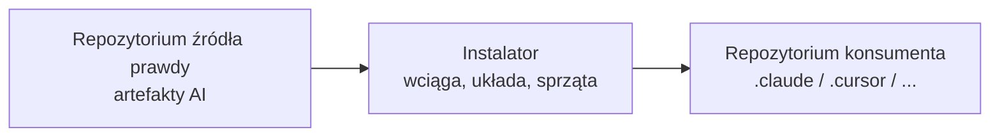
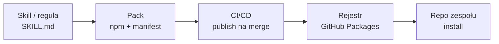
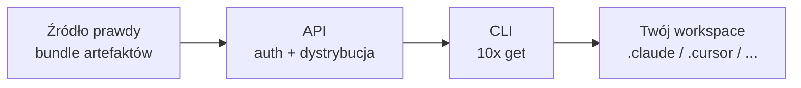
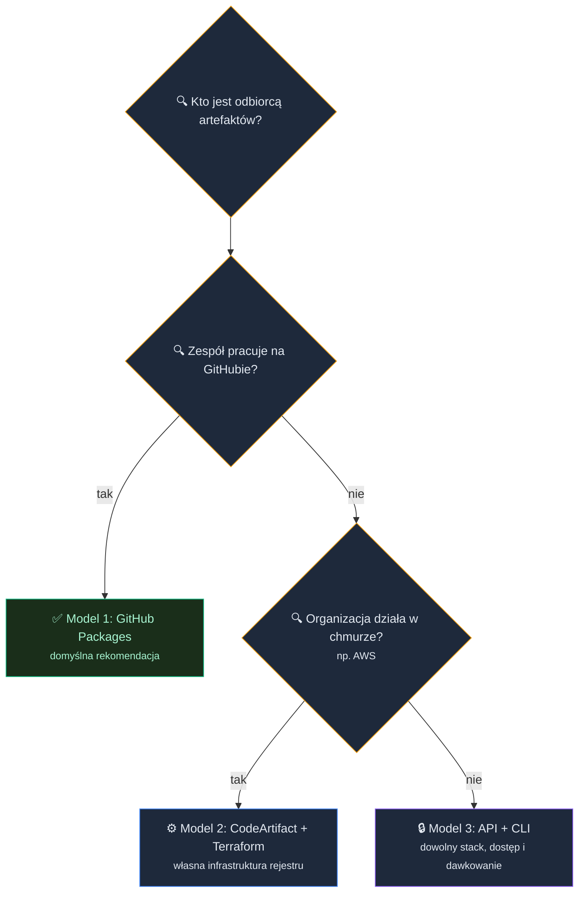

# Shared AI Registry: skille, komendy i reguły dla zespołu


<!-- cdn: https://images.przeprogramowani.pl/lessons/m5-l4/assets/cover.jpg -->

Za tobą pięć tygodni kursu. Przez ten czas zbudowałeś sobie cały warsztat pracy z AI: skille domykające powtarzalne zadania, prompty dopracowane pod twój stack, reguły, które trzymają Agenta w ryzach, własne sposoby prowadzenia go przez większą zmianę. To już nie pojedyncze interakcje z AI. To twój workflow.

Skoro to wszystko działa u ciebie, jak przenieść to na resztę zespołu?

W module czwartym ustaliliśmy, że prawdziwym problemem przy pracy z AI nie jest sama duplikacja, tylko utrzymanie i synchronizacja. Najmocniej czuć to w systemie multi-repo, gdzie każdy projekt żyje w izolacji. Po miesiącu nikt już nie wie, która wersja skilla jest tą obowiązującą.

Odpowiedzią na te wyzwania jest jedno źródło prawdy o tym, jak pracujemy z AI, plus mechanizm dystrybucji dopasowany do potrzeb twojego środowiska. Taki mechanizm da się zbudować na trzy sposoby i każdy z nich w tej lekcji prześwietlimy.

Najpierw jednak zatrzymajmy się na założeniu, które spina wszystkie trzy: artefakty AI to kod.

## Artefakty AI to kod

Skille, reguły i komendy traktujemy czasem jak notatki: coś, co trzyma się w kajecie, wkleja na Slacku albo wrzuca na firmową wiki.

Tymczasem one realnie sterują tym, jak Agent pisze kod i prowadzi review w twoim projekcie. To nie notatki na marginesie, tylko instrukcje wykonywane przy każdej zmianie.

A skoro artefakt jest wykonywany, to jego nieaktualna albo rozjechana wersja nie jest „starą notatką". Jest cichym błędem, który wsiąka prosto w system. Dlatego artefakty AI potrzebują tego samego, co każdy inny kod: wersjonowania, kontroli zmian i kontrolowanej dystrybucji.

Cofnijmy się do świata sprzed `npm`, `pip` czy `maven`. Biblioteki kopiowało się wtedy ręcznie, plik po pliku, między projektami. Działało, dopóki projekt był jeden. Dziś dokładnie w tym miejscu jesteśmy z artefaktami AI: kopiujemy je między repo i udajemy, że to działa.

Rejestry pakietów, takie jak npm, PyPI czy Maven Central, rozwiązały to lata temu: ktoś publikuje wersjonowaną paczkę, ty deklarujesz zależność, a całą żmudną robotę bierze na siebie menadżer pakietów. Znasz to z codziennej pracy jako konsument paczek. Tym razem sam staniesz po stronie wydawcy.

Dla nas liczą się dwie własności, które w tym znajomym obrazku łatwo przeoczyć. Pierwsza to kontrola dostępu: paczka może być publiczna albo prywatna, tylko dla twojej organizacji. Druga to jedno źródło prawdy z pełną historią wersji i kontrolą nad tym, kto i co zaciąga, czyli dokładnie to, czego brakowało w podejściu kopiuj-wklej.

Najważniejsze jest jednak to, że rejestrowi jest obojętne, co siedzi w paczce. Skrypt `index.js` czy `SKILL.md` z instrukcją dla Agenta? Dla rejestru to po prostu wersjonowane pliki. Skoro artefakty AI to pliki, a chcemy je współdzielić, wersjonować i aktualizować, możemy użyć do tego sprawdzonej infrastruktury pakietów.

Rozwiejmy od razu jedną wątpliwość: nie musisz żyć w świecie JavaScriptu, żeby z tego skorzystać. Pokazujemy mechanizm na npm, bo w tym stacku jest nasz toolkit, ale każdy ekosystem ma swój rejestr, czy to PyPI, Maven, czy Cargo. A sam artefakt, choćby `SKILL.md`, to zwykły plik tekstowy w otwartym standardzie, niezależny od języka czy narzędzia.

## Czego potrzebuje dystrybucja artefaktów AI

Zanim spojrzymy na jakiekolwiek rozwiązanie, ustalmy, co taki mechanizm musi zapewnić:

- **Jedno źródło prawdy** — jedno miejsce, z którego pochodzi artefakt. Bez tego za pół roku krążą trzy wersje skilla i nikt nie wie, która jest aktualna.
- **Wersjonowanie** — każda zmiana ma swoją semantyczną etykietę. Bez tego nie wiesz, czy wersja w repo, nad którym właśnie pracujesz, jest świeża, co zmieniło się po drodze i jak wymagająca będzie aktualizacja.
- **Uwierzytelnianie** — kontrola, kto może czytać i kto może publikować. Bez tego albo wszystko jest publiczne, albo nikt nie ma dostępu.
- **Instalacja, aktualizacja i deinstalacja** — artefakt da się wciągnąć, podbić i czysto usunąć. Bez kontrolowanej deinstalacji po roku masz w repo pozostałości po pięciu wersjach skilla.
- **Dostarczanie multi-tool** — ten sam artefakt trafia do Claude Code, Cursora czy Codexa. Bez tego każde narzędzie w zespole dostaje własną, rozjeżdżającą się kopię.

Te pięć punktów to nasza miara.

## Repozytorium ze źródłem prawdy

Modele różni infrastruktura, ale każdy z nich stoi na tym samym fundamencie.

Fundament to podział na dwa światy. Z jednej strony masz **repozytorium źródła prawdy**: jedno repo, w którym żyją twoje artefakty AI i z którego są publikowane. Zmianę wprowadzasz tu, w jednym miejscu. Z drugiej strony masz **repozytoria konsumentów**: wszystkie projekty zespołu, które te artefakty u siebie zaciągają i stosują.

Między tymi światami działa **instalator**: kod, który po stronie konsumenta wciąga artefakty, układa je tam, gdzie czyta je twoje narzędzie, i potrafi je później czysto zaktualizować albo usunąć. W najprostszym modelu instalatorem jest skrypt uruchamiany przez menedżer pakietów po pobraniu paczki z rejestru. W kolejnych modelach ta warstwa bierze na siebie coraz więcej.


<!-- rendered: ../../assets/diagrams-10x/lessons-m5-l4-lesson-draft-1-10x.png | cdn: https://images.przeprogramowani.pl/diagrams/lessons-m5-l4-lesson-draft-1-10x.png -->

A jak wygląda samo repozytorium źródła prawdy od środka? W praktyce to po prostu jeden pakiet, a artefakty leżą w nim poukładane według typu:

```
ai-toolkit/
├── package.json          # metadane paczki + konfiguracja publikacji
├── skills/
│   ├── 10x-plan/         # SKILL.md: planowanie zmiany
│   └── 10x-research/     # SKILL.md: research w kodzie
├── rules/
│   └── CLAUDE.md         # reguły doklejane do projektu konsumenta
├── prompts/              # gotowe prompty do konkretnych zadań
└── config-templates/     # szablony ustawień narzędzi
```

Każdy folder to jedna kategoria artefaktu. I tu możesz pójść naprawdę szeroko: to dokładnie te skille, prompty i reguły, które zbierałeś przez ostatnie pięć tygodni. Dodanie kolejnego to dorzucenie pliku i podbicie wersji, a reszta zespołu dostaje go przy najbliższym `install`.

Cała reszta lekcji sprowadza się więc do jednego pytania: jak najlepiej połączyć te dwa światy w twoim środowisku. Trzy modele to trzy odpowiedzi.

## Trzy modele dystrybucji

Te trzy sposoby różni przede wszystkim odbiorca i infrastruktura.

Pierwszy to **rejestr, który już masz**. Jeśli zespół trzyma kod na GitHubie, to łatwo skorzystać z GitHub Packages. Całe "stawianie infrastruktury" sprowadza się do jednego pola w konfiguracji paczki. To domyślna rekomendacja dla większości zespołów i od niej zaczniemy.

Drugi to **rejestr jako gotowa infrastruktura chmurowa**, na przykład AWS CodeArtifact postawiony Terraformem. To świadomy wybór dla organizacji, która potrzebuje rozbudowanego zarządzania usługą albo korzysta z własnego rejestru typu Nexus. W przypadku AWS infrastruktura jest gotowa, ale do skonfigurowania jest tu znacznie więcej niż w modelu pierwszym.

Trzeci to **API i CLI**. Jeśli nie macie wspólnego rejestru albo odbiorcy korzystają z wielu stacków technologicznych, rejestr przestaje być najprostszą odpowiedzią. Wtedy sens ma rozwiązanie w stylu `10x-cli`, z którego korzystamy w kursie: API pilnuje dostępu, a CLI zapisuje artefakty w twoim projekcie z pominięciem rejestru.

Zostają dwie rzeczy do zdjęcia z drogi przed modelem pierwszym: skąd wiemy, że to dobry kierunek, i co z gotowymi marketplace'ami. Pomysł, żeby dystrybuować skille z jednego źródła prawdy za pomocą pakietu lub CLI, nie jest egzotyką wymyśloną na potrzeby kursu. Coraz więcej programistów dochodzi do niego niezależnie. W czerwcu Matt Pocock opisał na X dokładnie ten przepis, który rozbieramy poniżej: paczka npm ze skillami plus skrypt `postinstall`, który podlinkowuje je do odpowiednich narzędzi. Podsumował go krótko jako prostą, wersjonowaną i intuicyjną dystrybucję skilli.


<!-- cdn: https://images.przeprogramowani.pl/lessons/m5-l4/assets/matt-pocock-skill-distribution.png -->

## A co z marketplace'ami?

Jedno pytanie może chodzić ci po głowie. Widziałeś marketplace'y wtyczek w Claude Code czy w Cursorze i myślisz: po co rejestr, skoro jest gotowy katalog? To prosta opcja wymagająca minimalnej pracy, więc warto ją potraktować serio.

Marketplace w Claude Code to katalog w repo gitowym, który zespół podpina przez ustawienia projektu tak, że nowe osoby dostają propozycję instalacji. Dla zespołu pracującego na jednym narzędziu to sensowna droga.

Haczyk to uzależnienie od jednego narzędzia (vendor lock-in). Marketplace jest przywiązany do konkretnego ekosystemu, a rotacja narzędzi AI jest dziś po prostu zbyt duża, żeby opierać na tym całą dystrybucję zespołu. Kiedy zmienisz domyślne narzędzie albo gdy w zespole pojawi się drugie, kanał dystrybucji zaczyna się rozjeżdżać. Sam `SKILL.md` jest przenośny, ale jego *dostarczanie* przez marketplace już nie.

Jeśli pracujecie jednym narzędziem, marketplace może być rozsądnym skrótem. Jeśli chcesz przenośnego standardu dla zespołu, wróćmy do trzech modeli i przejdźmy przez każdy z nich, zaczynając od najprostszego.

## Model 1: GitHub Packages

Jeśli twój zespół trzyma kod na GitHubie, to masz już rejestr pakietów. Nazywa się GitHub Packages i nie wymaga konfigurowania infrastruktury.

Repozytorium źródła prawdy, repozytoria konsumentów i instalator między nimi znasz już z poprzedniej sekcji.

Całe "stawianie infrastruktury" to jedno pole w `package.json`, w repozytorium źródła prawdy:

```json
{
  "name": "@twoj-zespol/ai-toolkit",
  "publishConfig": {
    "registry": "https://npm.pkg.github.com"
  }
}
```

To pole to cała konfiguracja po stronie producenta: `publishConfig` mówi tylko, *dokąd* publikować. Samo uwierzytelnianie publikacji dokłada CI osobno, bo tokena nigdy nie commitujemy do repo.

Po stronie konsumenta dochodzi drugi, równie krótki plik. To `.npmrc`, które mapuje twój scope na GitHub Packages, żeby tylko scope `@twoj-zespol/*` korzystało z prywatnego rejestru, a cała reszta dalej z publicznego npm. Ten plik jest commitowany do repo konsumenta i trzyma wyłącznie tę jedną linię, bez żadnego sekretu:

```
@twoj-zespol:registry=https://npm.pkg.github.com
```

Linii z tokenem (`//npm.pkg.github.com/:_authToken=${GH_PKG_TOKEN}`) nie wpisujesz do tego pliku w repo. Dokłada się ją dopiero przy instalacji: ze zmiennej środowiskowej w CI. W repo zostaje więc samo mapowanie, a sekret nigdy nie wchodzi do historii gita.

To wystarcza, żeby przejść z konfiguracji do zwykłego pipeline'u pakietu npm.


<!-- rendered: ../../assets/diagrams-10x/lessons-m5-l4-lesson-draft-2-10x.png | cdn: https://images.przeprogramowani.pl/diagrams/lessons-m5-l4-lesson-draft-2-10x.png -->

W repozytorium źródła prawdy pakujesz artefakty w jedną paczkę npm. CI na merge do głównej gałęzi publikuje ją do rejestru. Każde repo konsumenta instaluje ją jak zwykłą zależność. Zmieniłeś którąś regułę albo dopracowałeś skilla? Podbijasz wersję, robisz merge, a reszta zespołu dostaje nowość jednym `install`. To wciąż te same dwa konteksty: zmiana wychodzi z repo źródła prawdy, a wszystkie repa konsumentów ją zaciągają.

To jest ścieżka, którą realnie rekomenduję większości zespołów. Tak właśnie dystrybuujemy dziś nasz wewnętrzny toolkit: repozytorium źródła prawdy z poprzedniej sekcji to u nas jeden pakiet npm z `publishConfig`, który właśnie zobaczyłeś, a reszta zespołu zaciąga go jak każdą inną zależność.

Ten sam zestaw artefaktów może docierać do różnych odbiorców różnymi kanałami. Nasz zespół zaciąga toolkit prosto z rejestru, dokładnie jak w tym modelu. Ty, jako uczestnik kursu, dostajesz te same artefakty inaczej, przez CLI. Rejestr nie jest gorszy, po prostu przy innym typie odbiorcy przestaje pasować. Wyjaśnimy to w trzecim modelu.

### Gdzie chowa się jedyna realna trudność

Skoro to takie proste, gdzie jest haczyk? W jednym miejscu: w uwierzytelnianiu. I to w dość zaskakującej asymetrii między zapisem a odczytem.

**Zapis jest darmowy i tymczasowy.** Kiedy CI publikuje paczkę, używa tokena `GITHUB_TOKEN`, który GitHub Actions wstrzykuje samo, na czas jednego przebiegu. Wystarczy w pliku workflow dopisać `permissions: packages: write`. Zero sekretów do zarządzania.

**Odczyt jest bardziej problematyczny.** Żeby zaciągnąć prywatną paczkę, potrzebujesz tokena, który trzeba ręcznie umieścić wszędzie tam, gdzie ta paczka się instaluje: na maszynie dewelopera, w CI każdego repo-konsumenta, a czasem na zewnętrznej platformie buildów (np. Cloudflare). To nie jest token na jeden przebieg, tylko długożyjący sekret.

Jeżeli korzystacie z funkcji organizacji w GitHub, to repo-konsument w tej samej organizacji może czytać paczkę efemerycznym `GITHUB_TOKEN`, dokładnie jak przy zapisie. Trwały PAT staje się nieunikniony dopiero poza granicą organizacji: w repo innego właściciela albo na obcym CI, które tego tokena nie zna.

A koszty? Publiczne paczki są w pełni darmowe. Prywatne mieszczą się w limicie wliczonym w twój plan GitHuba i zaczynają kosztować dopiero po jego przekroczeniu. Liczy się wtedy składowanie i transfer, ale pobieranie w GitHub Actions przez `GITHUB_TOKEN` jest darmowe. Dla większości zespołów oznacza to zerowy koszt. Konkretne limity linkujemy na końcu lekcji, bo bywają aktualizowane.

Jak ta obsługa tokena wygląda w praktyce? Poniżej sporo kodu, ale zapamiętać masz z niego jedno: token nigdy nie wchodzi do repo, a resztę robi instalator za ciebie. Cały trik zaczyna się od jednej linii, którą instalator dokłada do `package.json` repo konsumenta jako skrypt `preinstall`:

```bash
[ -n "$GH_PKG_TOKEN" ] && echo '//npm.pkg.github.com/:_authToken=${GH_PKG_TOKEN}' >> .npmrc || true
```

Ta linia dokleja wpis z tokenem do `.npmrc` tylko wtedy, gdy zmienna `GH_PKG_TOKEN` jest ustawiona. W CI sekret jest wstrzyknięty, więc token ląduje na miejscu. Lokalnie zmiennej zwykle nie ma: deweloper loguje się raz przez `npm login`, token siedzi w jego `~/.npmrc`, warunek jest fałszywy, a `|| true` sprawia, że skrypt nie blokuje instalacji.

Trudniej jest na zewnętrznych platformach buildów, jak Cloudflare Pages czy Workers, które nie widzą sekretów GitHuba. Tam instalator dokłada krok synchronizujący token do projektu przez API platformy, od razu do środowiska produkcyjnego i preview, bo inaczej build preview padnie przez brak tokena.

W produkcyjnym toolkicie ta logika nie jest instrukcją w README, tylko kodem instalatora. Nie musisz czytać go linijka po linijce. Liczą się trzy własności: idempotencja (uruchom dwa razy, wynik ten sam), brak sekretów w repo i łagodne obejście się z istniejącym `package.json` użytkownika. W skrócie: najpierw dopisuje mapowanie rejestru do `.npmrc`, a potem dopina `preinstall` tylko wtedy, gdy go jeszcze nie ma:

```ts
const REGISTRY_LINE = "@twoj-zespol:registry=https://npm.pkg.github.com";
const PREINSTALL_SCRIPT =
  "[ -n \"$GH_PKG_TOKEN\" ] && echo '//npm.pkg.github.com/:_authToken=${GH_PKG_TOKEN}' >> .npmrc || true";

function ensureGitHubPackagesAuth(projectRoot: string) {
  ensureLine(path.join(projectRoot, ".npmrc"), REGISTRY_LINE);

  const pkg = readPackageJson(projectRoot);
  const existing = (pkg.scripts?.preinstall ?? "").trim();
  pkg.scripts ??= {};
  pkg.scripts.preinstall = existing.includes("GH_PKG_TOKEN")
    ? existing
    : existing
      ? `${existing}; ${PREINSTALL_SCRIPT}`
      : PREINSTALL_SCRIPT;
  writePackageJson(projectRoot, pkg);
}
```

To ważniejszy przykład niż sama linia w shellu: pokazuje, że dystrybucja artefaktów AI szybko staje się zwykłą inżynierią produktu.

Ten sam instalator łata też workflowy, w których widzi `actions/setup-node` i `npm ci`, dodając `registry-url`, `scope` oraz `NODE_AUTH_TOKEN`. Konsument nie musi więc pamiętać całej checklisty: paczka sama przygotowuje repo na zaciąganie swoich kolejnych wersji.

Trud nigdzie nie znika, tylko zmienia postać. W GitHub Packages nie płacisz za infrastrukturę, ale płacisz uwagą przy wstrzykiwaniu tokenów do środowisk. W modelu z własnym rejestrem zapłacisz wcześniej, konfiguracją infrastruktury.

### Wersjonowanie bez ręcznego podbijania

Skoro publikacja idzie z CI na każdy merge, ręczne podbijanie wersji szybko staje się wąskim gardłem. Da się to zautomatyzować, ale z jednym zabezpieczeniem.

Polecamy wersjonowanie z conventional commits: typ commita (`fix:`, `feat:`, `feat!:`) mówi, czy to patch, minor czy major. Działa to świetnie, dopóki typy w comittach są poprawne. W praktyce bywają błędne, niezależnie czy commitujemy samodzielnie czy z pomocą AI. Ktoś oznaczy poprawkę literówek w dokumentacji jako `feat:` i nagle wychodzi release z nową wersją, choć do paczki nie weszła żadna realna zmiana. Albo odwrotnie: realną zmianę skilla otaguje jako `chore:` i release w ogóle nie powstaje.

Dlatego warto dołożyć drugą kontrolę w CI/CD: sprawdzenie przez `git diff`, czy między ostatnim tagiem a teraz faktycznie zmieniły się pliki wchodzące do paczki. Commit potrafi skłamać o swojej intencji, `git diff` pokazuje, co realnie się zmieniło. Ta kontrola zabija fałszywe release'y z mylnie otagowanych commitów.

Całej tej logiki nie musisz pisać sam. [semantic-release](https://semantic-release.org) wylicza wersję z treści commitów i od razu publikuje. [release-please](https://github.com/googleapis/release-please) też idzie z commitów, ale zamiast publikować otwiera PR z release'em do akceptacji. Możesz też napisać własną logikę w CI/CD, aby mieć pełną kontrolę nad procesem.

### ⚠️ Model 1 — na co uważać

Garść pułapek z naszego produkcyjnego wdrożenia, które oszczędzą ci godzin debugowania:

- **Typ tokena do odczytu to ruchomy cel (stan na połowę 2026).** Wsparcie tokenów fine-grained dla rejestru npm na GitHub Packages bywa niespójne, a klasyczne PAT-y, na których wiele zespołów wciąż się opiera, są stopniowo wygaszane. Zanim oprzesz odczyt w CI na konkretnym typie tokena, sprawdź aktualny stan w dokumentacji GitHuba — to najszybciej dezaktualizujący się szczegół tej sekcji.
- **Zewnętrzne platformy buildów nie widzą sekretów GitHuba.** CF Pages/Workers zbudują się dopiero, gdy zsynchronizujesz token do projektu w ich własnym systemie sekretów. To ten krok synchronizacji opisany wyżej (na innych platformach analogiczny krok robisz sam).
- **GitHub Packages odrzuca duplikat wersji** (błąd z klasy 409). Automatyczne wersjonowanie z poprzedniej sekcji sprawia, że nigdy o tym nie myślisz; ręczne podbijanie prędzej czy później wygeneruje konflikt.

## Model 2: Rejestr jako gotowa infrastruktura

Model 2 to gotowy, zarządzany rejestr w chmurze, u nas AWS CodeArtifact. Zanim pokażę, jak działa i kiedy go wybrać, krótka historia, skąd u mnie ta ścieżka, bo to właśnie ją zbudowałem na webinarze promującym tę edycję 10xDevs.

Skąd u mnie akurat ten odruch z pakietami i CLI? Z doświadczenia. Jako platform engineer w SmartRecruiters odpowiadałem za współdzielenie metod pracy w całej organizacji: bibliotek, frameworków, design systemu. Wszystko to docierało do zespołów właśnie przez pakiety i narzędzia CLI. Kiedy spojrzałem na skille i reguły, zobaczyłem ten sam problem dystrybucji, tylko z innym ładunkiem.

Zanim wybrałem dla toolkitu GitHub Packages, zbudowałem więc wersję platformową: prywatny rejestr na AWS CodeArtifact, postawiony w całości Terraformem, z uwierzytelnianiem CI przez OIDC, czyli wymianą krótkich tokenów tożsamości zamiast długożyjącego klucza AWS.

W zamian za utrzymanie serwera rejestru, którego tu nie ma, dostajesz więcej kontroli nad uprawnieniami i zachowaniem samego rejestru niż w modelu pierwszym.

Najbardziej złożonym i niepraktycznym rozwiązaniem dla większości zespołów jest postawienie własnego rejestru od zera, na przykład Nexusa albo Verdaccio na własnym klastrze. Wtedy to ty odpowiadasz za proces, storage i dostępność. CodeArtifact leży gdzieś pośrodku, bo całą tę maszynerię bierze na siebie chmura.

Podobnie jak przy GitHub Packages, dla większości zespołów koszt wyniesie zero dzięki darmowemu limitowi AWS CA. Dla kontrastu: własne Verdaccio na ECS to już realny rachunek rzędu kilkudziesięciu dolarów miesięcznie i sporo więcej kodu do utrzymania. Szczegóły działania i rozliczania znajdziesz w [dokumentacji CodeArtifact](https://docs.aws.amazon.com/codeartifact/latest/ug/tokens-authentication.html).

Dlaczego więc ostatecznie polecamy GitHub Packages, a nie CodeArtifact? Zależy nam na tym, żebyś zaczynał od najniższego progu wejścia: rozwiązania, które zadziała dla zespołu już siedzącego na GitHubie, bez zakładania konta AWS i pisania kodu Terraform. Obydwa są poprawne, ale dobra praktyka mówi: wybieraj to, co wymaga najmniej roboty a spełnia potrzeby i pasuje do środowiska.

Pełne przejście przez ten pipeline, krok po kroku, nagrałem na webinarze: CodeArtifact postawiony Terraformem, OIDC i CI/CD od początku do końca. Potraktuj to nagranie jako historię tego, jak doszedłem do dzisiejszej rekomendacji, a nie jako ścieżkę, od której każdy musi zacząć.

<div style="padding:56.25% 0 0 0;position:relative;"><iframe src="https://www.youtube-nocookie.com/embed/hbuCLvwbMVg" frameborder="0" allow="accelerometer; autoplay; clipboard-write; encrypted-media; gyroscope; picture-in-picture; web-share" referrerpolicy="strict-origin-when-cross-origin" allowfullscreen style="position:absolute;top:0;left:0;width:100%;height:100%;" title="Od chaosu do AI-Native Infrastructure"></iframe></div>

Kiedy więc model 2 ma sens? Wtedy, gdy twoja organizacja korzysta już z AWS, albo gdy potrzebujesz zarządzania na poziomie samego rejestru, którego GitHub ci nie da. To realny, świadomy wybór dla konkretnego kontekstu, a nie domyślna rekomendacja dla każdego.

### Jak ten rejestr wygląda od środka

Zacznijmy od nazewnictwa, bo CodeArtifact używa słowa „repozytorium" inaczej, niż jesteś przyzwyczajony. Dla ciebie repozytorium to miejsce, w którym trzymasz kod, czyli repo na GitHubie. W CodeArtifact repozytorium to magazyn paczek wewnątrz rejestru. Hierarchia wygląda tak: jedna domena (u nas `devs10x`) spina pod sobą repozytoria z paczkami. W naszej konfiguracji są dwa: jedno prywatne na twoje własne paczki i drugie, które jest proxy do publicznego npm. Dzięki temu deweloper dostaje jeden endpoint na wszystko, i na paczki firmowe, i na te z publicznego rejestru.

Uważaj też na dwie nazwy, które wyglądają podobnie, a znaczą co innego. Scope paczki (`@10xdevs`) to przedrostek w nazwie paczki npm. Domena (`devs10x`) to nazwa zasobu w CodeArtifact. Przy logowaniu podajesz domenę, a scope decyduje tylko o tym, które paczki idą przez prywatny rejestr, a które dalej z publicznego npm. To dwie różne rzeczy, które łatwo skleić w jednej komendzie logowania.

Resztę konfiguracji deklarujesz w pipelinie. Same zasoby rejestru to około 70 linii Terraformu, a pełna konfiguracja z politykami uprawnień i zdalnym stanem rośnie do 250–400 linii. Uwierzytelnianie CI idzie przez OIDC, więc w repo nie ląduje żaden długożyjący klucz AWS, a tokeny dostępu wygasają po kilku godzinach. Rola IAM i provider OIDC to świadomie wydzielony, jednorazowy bootstrap, podobnie jak założenie bucketu na stan Terraforma. To nie jest „ręczna robota obok pipeline'u", tylko jawna granica między tym, czym zarządzasz za pomocą kodu Terraforma, a tym, co zakładasz raz przy starcie projektu.

Prompty i specyfikacje, których używałem podczas webinaru znajdziesz w materiałach do tej lekcji.

### ⚠️ Model 2 — na co uważać

Utrudnienia, które warto znać z góry:

- **Nazwa domeny musi zaczynać się od małej litery.** `10xdevs` zostanie odrzucone, stąd `devs10x` w naszej konfiguracji. Pamiętaj o tym, jeśli nazwa firmy albo zespołu zaczyna się od cyfry.
- **Provider AWS w wersji 5 waży około 700 MB**, więc pierwszy `terraform plan` lubi paść na timeoucie. Ustaw `TF_PLUGIN_TIMEOUT=300` przed pierwszym uruchomieniem.
- **Pipeline CI/CD musi mieć `permissions: id-token: write`.** Bez tego OIDC pada po cichu i publikacja nie ma jak się uwierzytelnić.

Każdą z tych pułapek widać na nagraniu webinaru powyżej, w kontekście realnej konfiguracji.

## Wzorce, które przeżyją każdy model

Część decyzji projektowych nie zależy od tego, gdzie stoi rejestr. Niezależnie od tego, czy wybierzesz GitHub Packages, CodeArtifact czy coś jeszcze, trzy wzorce przenoszą się między modelami.

**Sentinel markery dla reguł.** Skilla wrzucasz do osobnego folderu i nikomu nie wchodzi w drogę. Ale reguły projektu często mieszkają w pliku, który człowiek edytuje w każdym projekcie, na przykład w `CLAUDE.md` czy `AGENTS.md`. Jak wstrzyknąć do niego konwencje zespołu, nie nadpisując tego, co przygotował zespół? Tu wkracza instalator, ten sam, który przy modelu pierwszym wciągał artefakty po stronie konsumenta. Zamiast nadpisywać cały plik, dokleja swój fragment między parę znaczników:

```
<!-- BEGIN @twoj-zespol/ai-toolkit -->
... reguły zespołowe ...
<!-- END @twoj-zespol/ai-toolkit -->
```

Sekret tkwi w idempotencji. Przy każdej aktualizacji instalator odnajduje tę parę znaczników, podmienia wyłącznie blok między nimi i zostawia resztę pliku w spokoju. Twoje własne notatki w tym samym `CLAUDE.md` przetrwają każde `install`. Zobaczysz to na własnym projekcie zaliczeniowym: otwórz plik z regułami, znajdź znaczniki `10x-cli` i dopisz coś poza nimi. Przy zaciąganiu paczki na kolejną lekcję treść między znacznikami się zmieni, a twój dopisek zostanie nietknięty.

W najprostszym wariancie taka aktualizacja sprowadza się do operacji: znajdź blok, wytnij stary środek, wstaw nowy. To wystarczy, żeby instalator był przewidywalny:

```ts
const BEGIN = "<!-- BEGIN @twoj-zespol/ai-toolkit -->";
const END = "<!-- END @twoj-zespol/ai-toolkit -->";

function applyRules(existing: string, teamRules: string) {
  const block = `${BEGIN}\n${teamRules.trim()}\n${END}`;
  const start = existing.indexOf(BEGIN);
  const end = existing.indexOf(END);

  if (start !== -1 && end !== -1) {
    return existing.slice(0, start) + block + existing.slice(end + END.length);
  }

  return existing.trimEnd() + "\n\n" + block + "\n";
}
```

Jeżeli jeden znacznik istnieje, a drugi zniknął po ręcznej edycji, produkcyjny instalator nie udaje, że nic się nie stało. To przypadek uszkodzonego bloku, który trzeba obsłużyć osobno, żeby przy kolejnej instalacji nie zdublować reguł.

**Manifest instalacji.** Instalator zapisuje do małego pliku-manifestu dokładnie to, co wgrał: którą paczkę, w jakiej wersji i dla którego narzędzia, oraz pełną listę plików rozbitą na poszczególne skille. W twoim projekcie zaliczeniowym to `.claude/.10x-toolkit-manifest.json`:

```json
{
  "package": "@przeprogramowani/10x-cli",
  "version": "1.2.0",
  "lessonId": "m1l5",
  "tool": "claude-code",
  "files": {
    "skills": {
      "10x-init": { "files": ["SKILL.md"] },
      "10x-shape": { "files": ["references/prd-schema.md", "SKILL.md"] }
    },
    "configs": ["settings.json.template", "mcp.json.template"]
  }
}
```

Dzięki tej liście deinstalacja jest pewna: instalator usuwa dokładnie te pliki, które kiedyś dodał, zamiast zgadywać po zawartości katalogu. Co ważne, manifest jest samodzielny. Sprzątanie nie zależy od tego, czy `node_modules` wciąż istnieje, ani od hooków menedżera pakietów, które przy usuwaniu zależności nie zawsze się odpalają.

**`SKILL.md` jako przenośny standard.** Pamiętajmy, że ten standard nie należy do żadnego narzędzia. Powinien tak samo działać w Claude Code, Cursor i Codex. Dlatego ten sam artefakt da się dostarczyć do wielu narzędzi naraz: skoro format jest neutralny, narzędzia różni już tylko katalog docelowy. Instalator (albo, jak zobaczysz w trzecim modelu, profile narzędzi w CLI) układa ten sam plik tam, gdzie dane narzędzie go szuka.

Praktyczny skutek jest taki, że twoja praca z ostatnich pięciu tygodni nie jest przywiązana do dzisiejszego wyboru narzędzia. Zmienia się kanał dostarczania, nie treść. To ta sama granica, którą widziałeś przy marketplace'ach: przenośny jest sam `SKILL.md`, a zamknąć cię w jednym ekosystemie może dopiero mechanizm jego dystrybucji.

## Model 3: Pełny produkt z API i CLI

Trzeci model to pełnoprawny produkt z własnym API i CLI. Sięgasz po niego, gdy chcesz uniezależnić się od stacku technologicznego odbiorców. Tak działa rozwiązanie, którego używasz w tym kursie: `10x-cli`, przez które od początku kursu pobierasz materiały do lekcji.

Dlaczego materiały kursu nie leżą po prostu jako paczka na npm?

- **Odbiorcy siedzą na różnych stackach.** Rejestr, który ma obsłużyć wiele ekosystemów naraz, jest *bardziej* skomplikowany niż jedno CLI rozmawiające z jednym API. Różnorodność stacków łatwiej ogarnąć profilami narzędzi w CLI niż mnożeniem rejestrów.
- **Chcesz precyzyjnie rozsyłać artefakty.** W modelu pakietowym materiał albo jest opublikowany, albo nie. Z `10x-cli` decyduję, co i dla kogo jest dostępne oraz w jakiej kolejności i w jakich porcjach trafia do odbiorców. W rejestrze takie dawkowanie jest dużo trudniejsze.

Te dwie rzeczy przesuwają dystrybucję z konfiguracji pakietu w stronę CLI.

Architektonicznie ten produkt to trzy wymienne warstwy.


<!-- rendered: ../../assets/diagrams-10x/lessons-m5-l4-lesson-draft-3-10x.png | cdn: https://images.przeprogramowani.pl/diagrams/lessons-m5-l4-lesson-draft-3-10x.png -->

**Źródło prawdy** to miejsce, gdzie leżą zbudowane bundle artefaktów. W kursie to prywatny content zbudowany z `10x-toolkit`, ale w firmie może to być dowolne repo z artefaktami.

**API** sprawdza, kto pyta, czy ma prawo dostać dany zasób teraz, a potem dostarcza właściwy bundle przez REST. To nie jest tylko warstwa ochronna. To warstwa dystrybucji.

**CLI** zapisuje otrzymaną treść w katalogu właściwym dla narzędzia użytkownika. Tu zaczyna się bardzo praktyczny fragment: jedno API oddaje neutralny bundle, a CLI decyduje, czy skill trafi do `.claude/skills`, `.cursor/skills`, `.agents/skills` czy jeszcze gdzie indziej.

W `10x-cli` ta decyzja jest zwykłą konfiguracją profili narzędzi:

```ts
export const PROFILES = {
  "claude-code": {
    skillPath: (name) => `.claude/skills/${name}/SKILL.md`,
    promptPath: (name) => `.claude/prompts/${name}.md`,
    rulesFile: "CLAUDE.md",
    manifestDir: ".claude",
  },
  cursor: {
    skillPath: (name) => `.cursor/skills/${name}/SKILL.md`,
    promptPath: (name) => `.cursor/prompts/${name}.md`,
    rulesFile: ".cursor/rules/10x-course.mdc",
    manifestDir: ".cursor",
  },
  codex: {
    skillPath: (name) => `.agents/skills/${name}/SKILL.md`,
    promptPath: (name) => `.agents/prompts/${name}.md`,
    rulesFile: "AGENTS.md",
    manifestDir: ".agents",
  },
};
```

I to jest cały sens CLI jako "applicatora": nie musisz uczyć API konwencji każdego narzędzia. API pilnuje dostępu i zawartości, a CLI pilnuje lokalnej semantyki plików.

Żeby to nie zostało abstrakcją, przyjrzyjmy się od środka produktowi, którego używasz w tym kursie. Jedno zastrzeżenie: w tym przykładzie to **ty jesteś konsumentem** na końcu łańcucha, ale to kontekst 10xDevs, a nie firmowy, o którym mówimy w całej lekcji. W twoim zespole na końcu tego łańcucha staną koleżanki i koledzy z innych projektów.

### API: dostęp, którego rejestr nie udźwignie

Logowanie zaczyna się od magic linka, a pod spodem CLI dostaje krótko żyjący token dostępu: JWT ważny około godziny, odświeżany w tle. Kluczowa własność API: uprawnienia sprawdzane są przy każdym odświeżeniu tokenu, a nie tylko raz przy logowaniu.

Przełożone na zespół oznacza to, że dostęp odbierasz w jednym miejscu, a token traci ważność najpóźniej w godzinę — bez ręcznego czyszczenia tokenów rozsianych po repozytoriach.

Skąd API wie, czy masz prawo do treści? Źródłem prawdy o uprawnieniach jest twój system biznesowy: baza pracowników, system członkostwa, lista subskrypcji. W 10xDevs takim systemem jest Circle.so, a lokalnym magazynem jest KV w Cloudflare, bo nie chcemy odpytywać Circle przy każdym pobraniu materiału (Circle ma miesięczne limity zapytań do API).

Praktyczny wzorzec brzmi tak: *wyciągnij uprawnienia z systemu biznesowego do lokalnego magazynu i sprawdzaj je lokalnie, zamiast odpytywać ten system przy każdym żądaniu.* Lokalny lookup jest szybki i nie wywraca się, gdy system źródłowy ma chwilową awarię. Jeżeli w twojej firmie system uprawnień nie ma takich ograniczeń, co jest częste, lokalny magazyn jest zbędny.

API daje też coś, czego zwykły rejestr nie umie: **dawkowanie treści w czasie**. Dany moduł odblokowuje się dopiero wtedy, gdy ma być dostępny, a kontrolę nad tym, kto i kiedy dostaje co, trzyma API. W rejestrze paczka albo jest opublikowana dla wszystkich, albo w ogóle nie istnieje; wydawanie porcjami jest dużo bardziej skomplikowane.

### CLI jako granica bezpieczeństwa

Łatwo myśleć o CLI jak o czymś, co po prostu zapisuje pliki na dysku. Jeżeli CLI ma przyjmować treść z API i modyfikować workspace użytkownika, potrzebuje kilku zabezpieczeń. Pokażemy je na realnym kodzie `10x-cli`: to nasz kursowy klient dostawy, ale twój zespołowy odpowiednik wygląda tak samo, tylko pod inną nazwą.

**Podpisywanie paczek (Ed25519).** API podpisuje każdy bundle kluczem Ed25519, a CLI weryfikuje podpis, zanim cokolwiek zapisze na dysku. Klucz publiczny jest wkompilowany w CLI, więc samo przejęcie API nie wystarczy, żeby podsunąć ci spreparowaną treść. Weryfikacja jest twardym wymogiem (`REQUIRE_SIGNATURES = true`): paczka bez ważnego podpisu zostaje odrzucona, nic nie ląduje na dysku. To ochrona przed atakiem typu man-in-the-middle na łańcuch dostaw twoich artefaktów AI.


<!-- cdn: https://images.przeprogramowani.pl/lessons/m5-l4/assets/signing.png -->

W skróconym kodzie nie wygląda to magicznie. CLI hashuje surową odpowiedź, porównuje ją z nagłówkiem, a dopiero potem sprawdza podpis nad kanonicznym stringiem:

```ts
function verifyBundleSignature(rawBody, signature, keyId, headerHash) {
  const computedHash = sha256(rawBody);
  if (computedHash !== headerHash) {
    throw new Error("Bundle content hash mismatch");
  }

  const canonical = `v1:${keyId}:${computedHash}`;
  const valid = verifyEd25519(canonical, signature, publicKeyFor(keyId));
  if (!valid) {
    throw new Error("Bundle signature verification failed");
  }
}
```

Najpierw integralność treści, potem autentyczność nadawcy. Bez tego CLI byłoby tylko wygodnym `curl | write`.

**Allowlista hosta API.** CLI rozmawia wyłącznie ze swoim endpointem API: produkcyjnym hostem po HTTPS albo localhostem w trybie deweloperskim. Gdyby adres API dało się dowolnie podmienić zmienną środowiskową, atakujący przekierowałby logowanie na własny serwer i przechwyciłby token. Dlatego lista dozwolonych hostów jest konieczna.


<!-- cdn: https://images.przeprogramowani.pl/lessons/m5-l4/assets/api-allowlist.png -->

**Guard na sentinel-injection.** Pamiętasz znaczniki sentinel z poprzedniej sekcji? Dokleja je narzędzie, otaczając nimi blok reguł zespołowych. Jeśli sama dostarczona treść reguły *zawiera* takie znaczniki, to sygnał ostrzegawczy: przy następnym zastosowaniu CLI mogłoby wziąć podrzucony znacznik za prawdziwy i skasować twoje treści spoza bloku. Dlatego CLI odmawia zapisania reguły, która sama w sobie niesie znaczniki sentinel.

## Tabela decyzyjna i alternatywy

Zbierzmy trzy modele w jedno miejsce. Wiersze tej tabeli to wymiary decyzji, które przewijały się przez całą lekcję: od uwierzytelniania i dostarczania multi-tool z listy wymagań, po odbiorcę, odbieranie dostępu i koszt, które różnicują modele w praktyce.

| | Model 1: GitHub Packages | Model 2: CodeArtifact + Terraform | Model 3: API + CLI |
|---|---|---|---|
| Odbiorca | zespół na GitHubie | zespół na AWS | dowolny zespół |
| Uwierzytelnianie | PAT / `GITHUB_TOKEN` | IAM / OIDC | magic link + krótko żyjący token |
| Uprawnienia | członkostwo w org/repo | polityka IAM | sprawdzenie w systemie biznesowym |
| Odbieranie dostępu | usunięcie z org | odłączenie polityki | usunięcie z systemu biznesowego |
| Dawkowanie treści w czasie | nie | nie | tak |
| Dostarczanie multi-tool | zadanie instalatora | zadanie instalatora | profile narzędzi w CLI |
| Koszt uruchomienia | ~zero (jedno pole) | ~70 linii Terraform + konto AWS | pełny produkt (API, auth, CLI) |
| Koszt utrzymania | tokeny w obcym CI | rotacja tokenów, higiena IAM | utrzymanie API, auth i klienta |

Z całej tabeli najważniejszy jest pierwszy wiersz: odbiorca. To on rozstrzyga wybór modelu, a pozostałe wiersze tylko go doprecyzowują.

Ten wybór możesz potraktować jak prosty router:


<!-- rendered: ../../assets/diagrams-10x/lessons-m5-l4-lesson-draft-4-10x.png | cdn: https://images.przeprogramowani.pl/diagrams/lessons-m5-l4-lesson-draft-4-10x.png -->

### Najczęstszy błąd

Na koniec najczęstsza pułapka: dystrybucja pod CV. Zespół wybiera model najbardziej imponujący, zamiast dopasowanego do odbiorcy. Buduje API z CLI albo stawia rejestr na Terraformie, podczas gdy realnym odbiorcą jest "nasz zespół korzystający wyłącznie z GitHuba".

Żeby łatwiej przejść z decyzji do własnego startera, do tej lekcji dostarczamy przez `10x get m5l4` nie tylko opisy, ale też gotowe punkty startu: specyfikacje promptów, konwencje review, przykład `package.json`, szkic instalatora i deinstalatora, `.npmrc` dla repo konsumenta oraz workflow GitHub Actions publikujący paczkę do GitHub Packages. Traktuj je jak materiał do adaptacji.

Jeśli już wiesz, czego potrzebuje twoja firma, możesz od razu przejść przez klasyczny przepływ `/10x-new` → `/10x-research` → `/10x-plan` → `/10x-implement`. Jeśli nie jesteś pewien, jaki model dystrybucji ma sens, najpierw zbierz wymagania przez `/10x-shape`, `/10x-prd` i `/10x-roadmap`. Solidny kontekst przed budową oszczędza później głupich kompromisów. Tak, tych z kategorii "zrobiliśmy platformę, bo brzmi cool".

Na tym domyka się fundament pracy zespołowej z AI. Macie uzgodnione standardy, pipeline'y, które ich pilnują, i rejestr, z którego cały zespół zaciąga ten sam kontekst. Kiedy ta podstawa już stoi, uwaga przesuwa się z *budowania warsztatu* na *wyciśnięcie z niego maksimum*: pracę z Agentami zdalnie i asynchronicznie. Delegujesz zadanie, zajmujesz się czymś innym, a Agent pracuje w tle. I właśnie tym zajmiemy się w ostatniej lekcji 10xDevs 3.0.

## 🧑🏻‍💻 Zadania praktyczne

Zanim wejdziesz w zadania, jedna uwaga organizacyjna o odznace **10xChampion**: zaliczasz ją **jednym** projektem praktycznym. Albo zespołową paczką dystrybucyjną z tej lekcji (Zadanie 3 poniżej), albo pipeline'em do review kodu z lekcji o Agencie zespołowym (M5L2) i Code Review w pipeline (M5L3). Wybierz ścieżkę bliższą twojej codziennej pracy. Gdy paczka jest opublikowana, zrób zrzuty będące dowodem na 10xChampion: repozytorium/rejestr z przepływem, definicja paczki oraz lista wydanych wersji (te same kategorie, które zapowiadał Krok 4 lekcji o AI Internal Builders, M5L1).

1. **Przyłóż tabelę decyzyjną do swojej organizacji.** Odpowiedz na pierwszy wiersz: kto jest odbiorcą twoich artefaktów AI? Zespół na GitHubie, zespół na AWS, czy odbiorca zewnętrzny i bramkowany? Na tej podstawie wybierz model i zapisz w dwóch–trzech zdaniach uzasadnienie. Jeśli kusi cię model cięższy niż wynika z odbiorcy, zatrzymaj się i napisz, dlaczego naprawdę go potrzebujesz.

2. **Jeśli decyzja jest niepewna, doprecyzuj wymagania.** Użyj `/10x-shape`, `/10x-prd` i `/10x-roadmap`, żeby opisać odbiorców, ograniczenia dostępu, stacki, narzędzia AI w zespole, sposób odbierania uprawnień i minimalny zakres MVP. Efektem ma być krótki PRD albo roadmapa, która uzasadnia wybór modelu. Dopiero wtedy przejdź do budowy.

3. **Zbuduj minimalną zespołową paczkę z AI.** Zaciągnij przez `npx @przeprogramowani/10x-cli@latest get m5l4` zestaw specyfikacji, promptów i starterów konfiguracyjnych. Jako bazę GitHub Packages podaj Agentowi: `m5l4-shared-conventions.md`, `m5l4-shared-spec-skill.md`, `m5l4-github-packages-spec-pack.md`, `m5l4-github-packages-spec-cicd.md` oraz template'y `m5l4-github-packages-package.json.template`, `m5l4-github-packages-install.js.template`, `m5l4-github-packages-uninstall.js.template`, `m5l4-github-packages-consumer.npmrc.template` i `m5l4-github-packages-publish-ai-toolkit.yml.template`. Na tej podstawie przejdź przez `/10x-new` → `/10x-research` → `/10x-plan` → `/10x-implement`, żeby wygenerować i zweryfikować szkielet własnej paczki.

Nie chodzi o przepisanie template'ów 1:1. Chodzi o to, żeby Agent miał konkretne przykłady instalatora, deinstalatora, konfiguracji paczki i pipeline'u CI/CD, a ty kontrolujesz decyzje: nazwy, scope, zakres artefaktów i kryteria gotowości.

Minimalny starter, do którego dążysz, wygląda mniej więcej tak:

```text
ai-toolkit/
├── package.json
├── install.js
├── uninstall.js
├── skills/
│   └── code-review/
│       └── SKILL.md
├── rules/
│   └── CLAUDE.md
└── .github/
    └── workflows/
        └── publish-ai-toolkit.yml
```

> Uwaga: pliki `m5l4-codeartifact-spec-cicd.md` i `m5l4-codeartifact-spec-terraform.md` opisują wariant AWS (model 2). Potraktuj je jako dodatek dla zespołów, które świadomie wybierają CodeArtifact, a za bazę Zadania 3 weź ścieżkę GitHub Packages.
>
> Pakiet daje też trzy skille, które automatyzują tę ścieżkę zamiast przepisywać specyfikacje ręcznie: `/pack-init` (szkielet paczki npm), `/tf-registry` (Terraform pod rejestr CodeArtifact) i `/setup-cicd` (pipeline publikacji przez OIDC). Nie generują gotowca w próżni — uruchamiasz je na bazie powyższych specyfikacji, a twoim zadaniem jest wypełnić je właściwymi wartościami pod twoją konfigurację: nazwa domeny i scope, region AWS, nazwy repozytoriów, polityki uprawnień. Jeśli zostajesz przy GitHub Packages, możesz je zignorować.

## Odbierz swoją odznakę

Po ukończeniu tej lekcji odbierz odznakę w sekcji [10xDevs Mission Log](https://platforma.przeprogramowani.pl/10xdevs-3/mission-log) a następnie pochwal się swoim osiągnięciem!

## 🔎 Deep Dive

Ta sekcja zawiera dodatkowe pogłębienie wiedzy na temat wybranych zagadnień związanych z lekcją. W tym Deep Dive znajdziesz:

- **Anatomia instalatora** — tryby symlink vs copy, manifest, presety, rozwiązywanie zależności i czysta deinstalacja.
- **Kontrakt między repo prywatnym a publicznym CLI** — jak OpenAPI i generowane typy pozwalają dwóm repo ewoluować bez psucia się nawzajem.

Ta sekcja lekcji nie jest obowiązkowa, ale warto się z nią zapoznać jeżeli chcesz zostać ekspertem.

### Anatomia instalatora

Instalator z modeli 1 i 2 to skryptowa warstwa paczki: kod odpowiedzialny za instalację, aktualizację i deinstalację artefaktów. To coś więcej niż „skopiuj pliki", nawet gdy całość mieści się w jednej paczce npm. Kilka decyzji, które warto podejrzeć:

- **Dwa tryby instalacji.** Tryb symlink (`npm install`) podpina artefakty do projektowego `.claude/`, żeby wędrowały z repo. Tryb copy (`npx ... install`) fizycznie kopiuje pliki i działa w dowolnym projekcie, także bez `package.json` (Python, Go, Rust). Copy jest tu obowiązkowy, bo cache `npx` jest ulotny, więc symlinki padłyby po zakończeniu komendy.
- **Manifest zamiast zgadywania.** Instalator zapisuje tryb i dokładną listę wgranych plików do `.claude/.10x-toolkit-manifest.json`. Deinstalacja czyta manifest i usuwa dokładnie to, co dodała, bez polegania na tym, że `node_modules` wciąż istnieje. Sprzątanie musi stać na własnych nogach, bo na hooki deinstalacyjne menedżera pakietów nie ma co liczyć w każdym scenariuszu usuwania zależności.
- **Presety i zależności.** Skille deklarują `requires` we frontmatterze; instalator dociąga brakujące zależności i ostrzega, gdy czegoś brak. Preset, który pomija skilla z `requires`, po cichu by go zepsuł, dlatego filtrowanie presetem i tak musi przejść przez rozwiązywanie zależności.
- **Migracja starych wersji.** Instalator sprząta artefakty po poprzednich wersjach toolkitu, ale przy uszkodzonym manifeście woli zostawić pliki w spokoju niż ryzykować utratę danych.

### Kontrakt między repo prywatnym a publicznym CLI

W modelu 3 prywatne repo z treścią i publiczny CLI to dwa osobne repozytoria o różnej widoczności. Spotykają się na jawnym kontrakcie: API publikuje wygenerowaną specyfikację OpenAPI 3.1, z której CLI generuje swoje typy na etapie builda. Dzięki temu zmiana po stronie API, która złamałaby klienta, wychodzi na jaw już przy kompilacji CLI, a nie u użytkownika. To wzorzec na każde dwa repo, które mogą ewoluować niezależnie, ale nie mogą się rozjechać.


## 📚 Materiały dodatkowe

Nie ma tu materiałów obowiązkowych. To zestaw do pogłębienia, jeśli chcesz zbudować własny mechanizm dystrybucji.

- [Webinar: Od chaosu do AI-Native Infrastructure](https://www.youtube.com/watch?v=hbuCLvwbMVg) — pełny walkthrough modelu 2 (CodeArtifact + Terraform) jako świadomie wybranego wariantu enterprise.
- [Agent Skills — otwarty standard](https://agentskills.io) — czym jest SKILL.md i które narzędzia go wspierają.
- [Working with the npm registry — GitHub Packages](https://docs.github.com/en/packages/working-with-a-github-packages-registry/working-with-the-npm-registry) — `publishConfig`, mapowanie scope'a i ograniczenie klasycznego PAT-a.
- [About billing for GitHub Packages](https://docs.github.com/en/billing/concepts/product-billing/github-packages) — aktualne limity wliczone w plan.
- [Create and distribute a plugin marketplace — Claude Code](https://code.claude.com/docs/en/plugin-marketplaces) — marketplace jako zero-infra alternatywa dla jednego narzędzia.
- [Cursor Marketplace](https://cursor.com/marketplace) — oficjalny marketplace wtyczek w Cursorze.
- [Matt Pocock: npm-owy mechanizm dystrybucji skilli](https://x.com/mattpocockuk/status/2062129440558047545) — niezależne dojście do tego samego wzorca (paczka npm + `postinstall` symlink do `.claude/skills`), czerwiec 2026.
- [Claude Skills are awesome, maybe a bigger deal than MCP](https://simonwillison.net/2025/Oct/16/claude-skills/) — Simon Willison o tym, dlaczego dostarczanie plików bije protokół przy statycznych artefaktach.
- Prework [3.2] *Wzorce i antywzorce promptowania* — hierarchia instrukcji jako założone słownictwo tej lekcji.
