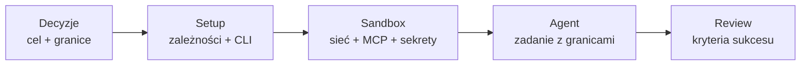
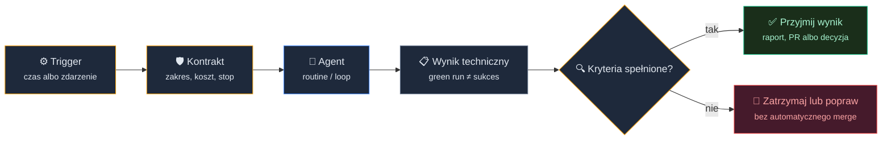
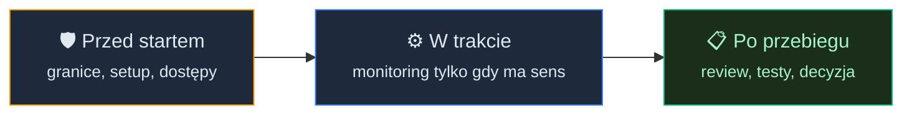

# Innovate: Async & Remote Agents - deleguj i zajmij się czymś innym


<!-- cdn: https://images.przeprogramowani.pl/lessons/m5-l5/assets/cover.jpg -->

W poprzednich lekcjach domknęliśmy zespołowy warsztat pracy z AI: standardy review, własne agenty, wspólne skille, reguły i mechanizm dystrybucji artefaktów. Agent przestaje być wtedy prywatnym pomocnikiem przy twoim biurku. Coraz częściej działa w środowisku, które ma powtarzalne zasady dla całego zespołu.

W lekcji Innovate: więcej ficzerów, mniej czekania z wieloma agentami (M2L5) skalowaliśmy pracę, gdy nadal siedzisz przy komputerze i pilnujesz kilku równoległych ścieżek. Ta lekcja robi kolejny krok: co jeśli chcesz uruchomić zadanie, odejść od laptopa, sprawdzić status z telefonu albo wrócić do wyniku dopiero po zaplanowanym przebiegu?

Brzmi jak utrata kontroli? Tylko jeśli kontrolę rozumiesz jako ciągłe patrzenie Agentowi na ręce.

W pracy z agentami zdalnymi i asynchronicznymi kontrola nie znika. Zmienia miejsce. Zamiast patrzeć Agentowi na ręce w czasie rzeczywistym, wybierasz moment kontroli: konfigurujesz środowisko przed startem, monitorujesz wybiórczo i robisz review po zakończeniu.

Prosty pomysł, ale ma kilka pułapek, o których warto wiedzieć zawczasu.

## Kiedy kontrolujesz pracę agenta?

Największy błąd przy zdalnych agentach polega na wrzuceniu wszystkiego do jednego worka: "agent w chmurze", "remote coding", "background agent", "loop". Te nazwy brzmią podobnie, ale opisują różne sytuacje operacyjne.

Zamiast zaczynać od narzędzia, zacznij od pytania: **kiedy człowiek ma kontrolować pracę?** Odpowiedź rozkłada się na trzy tryby, które różnią się momentem kontroli, miejscem wykonania i głównym ryzykiem:

| Tryb pracy | Gdzie działa agent | Co kontrolujesz | Kiedy pasuje | Główne ryzyko |
|---|---|---|---|---|
| Tryb 1: zdalna kontrola lokalnego agenta | Twoja maszyna albo własny serwer | Sesję agenta, tylko z innego miejsca | Krótka poprawka, diagnoza, kontynuacja pracy z telefonu | Sam odpowiadasz za środowisko i bezpieczeństwo maszyny |
| Tryb 2: sandbox w chmurze | Zarządzany sandbox w chmurze | Setup, dostęp do sieci, sekrety, zakres zadania | Ograniczone zadanie, które może wykonać się po zamknięciu laptopa | Źle przygotowane środowisko albo za szerokie uprawnienia |
| Tryb 3: pętle i routines | Chmura albo pętla uruchamiana według harmonogramu | Trigger, kryteria sukcesu, warunki stopu | Regularny przegląd, raport, kontrola zaległości, self-check | Zielony przebieg bez realnego sukcesu, koszt, zapętlenie |

Ta tabela jest ważniejsza niż nazwy produktów. Jeżeli wiesz, kiedy chcesz odzyskać kontrolę, dużo łatwiej dobrać narzędzie. Niezależnie od wybranego trybu i tak kończysz w tym samym miejscu: przy review wykonanej pracy.

## Tryb 1: zdalna kontrola lokalnego agenta

Najprostsza wersja zdalnej pracy nie przenosi obliczeń do chmury. Agent nadal działa na twojej maszynie albo na twoim serwerze. Zmienia się tylko interfejs kontroli.

Klasyczny wariant to SSH albo mosh do własnej maszyny developerskiej i agent uruchomiony w `tmux`. Sesja przeżywa rozłączenie, więc możesz wrócić do niej z innego urządzenia. To rozwiązanie ma jedną dużą zaletę: nie dokładasz nowego dostawcy do łańcucha zaufania.

Ma też oczywisty koszt: wszystko jest po twojej stronie. Serwer, dostęp, aktualizacje, sekrety, sieć i wygodę pracy z telefonu utrzymujesz samodzielnie.

Masz tu też realny wybór miejsca pracy: codzienna maszyna albo osobny VPS. VPS jest zwykle bezpieczniejszy, bo Agent nie siedzi wtedy na twoich prywatnych plikach, kluczach i całym katalogu domowym. Kosztem jest przygotowanie środowiska, ale z pomocą samego Agenta to zwykle kwestia godzin, nie dni.

Jeżeli pracujesz w Claude Code, masz dziś prostszą, first-party wersję tej samej idei: Remote Control. Uruchamiasz `claude remote-control` (albo `/remote-control` w trwającej sesji) i przejmujesz ją z przeglądarki na `claude.ai/code` lub z aplikacji mobilnej Claude. Mechanika jest ta sama co przy SSH: Agent cały czas działa lokalnie, a telefon i przeglądarka są tylko oknem na tę sesję.

Połączenie idzie wyłącznie ruchem wychodzącym po HTTPS, więc nie otwierasz żadnych portów, a sesja sama wraca po uśpieniu laptopa albo chwilowej utracie sieci. Całość idzie przez API Anthropic, więc do ścieżki sterowania nie dokładasz żadnego zewnętrznego pośrednika.

Funkcja jest w fazie research preview, działa na planach Pro, Max, Team i Enterprise (nie na kluczu API) i wymaga Claude Code w wersji 2.1.51 lub nowszej. Na Teamie i Enterprise administrator musi ją najpierw włączyć.

A gdzie w tym wszystkim Happy? To dobra opcja, gdy Remote Control ci nie pasuje: pracujesz na kluczu API, wolisz rozwiązanie open source albo sterujesz Codexem zamiast Claude Code. [Happy](https://github.com/slopus/happy) opakowuje lokalnego Claude Code albo Codexa i pozwala przejąć sesję z telefonu przez zaszyfrowany relay. Tak jak przy Remote Control, Agent nadal działa lokalnie, a chmura Happy jest tylko pośrednikiem przekazującym zaszyfrowane komunikaty między twoim komputerem a telefonem.

Jedno i drugie rozwiązuje praktyczny problem, którego SSH często nie rozwiązuje elegancko: telefon i laptop są w różnych sieciach, za NAT-em, bez stabilnego adresu i bez ochoty na port forwarding. Remote Control lub Happy daje wygodę, a samo wykonanie nadal zostaje u ciebie.

Przy Happy pamiętaj o jednym: to nadal trzecia strona w ścieżce sterowania. Zanim wejdzie do zespołowego workflow, sprawdź model szyfrowania, repozytorium i sposób parowania urządzeń oraz to, czy taki relay pasuje do waszej polityki bezpieczeństwa. To wciąż niski próg wejścia do sterowania lokalnym agentem z telefonu, tylko z dodatkową decyzją zaufania, której przy Remote Control od Anthropic nie musisz podejmować ponownie.

Ten tryb wybierasz wtedy, gdy chcesz mobilności, ale nie chcesz oddawać wykonania do zarządzanego sandboxa. To nadal praca "na twojej maszynie", tylko niekoniecznie "przy twoim biurku".

## Tryb 2: sandbox w chmurze

Drugi tryb jest jakościowo inny. Agent nie działa już na twojej maszynie. Dostaje świeże środowisko w chmurze, klonuje repozytorium, uruchamia setup i pracuje dalej, nawet kiedy laptop jest zamknięty.

To dobry model dla zadań typu: "weź tę małą zmianę, przygotuj PR, uruchom testy, a ja wrócę do wyniku później". Nie musisz utrzymywać własnej maszyny developerskiej. Nie musisz trzymać lokalnej sesji przy życiu. Płacisz za to konfiguracją środowiska i zaufaniem do sandboxa dostawcy.

Najważniejsza umiejętność nie polega tu na kliknięciu "start". Polega na przygotowaniu środowiska tak, żeby Agent miał wszystko, czego potrzebuje, i nie miał tego, czego mieć nie powinien.

W praktyce konfigurację sandboxa da się sprowadzić do sześciu pytań.

### Co przygotowujesz przed startem?

Skrypt setupu uruchamia się zanim Agent zacznie pracę. Tu instalujesz zależności systemowe, brakujące CLI, środowiska uruchomieniowe, menedżery pakietów albo inne elementy, których nie ma w bazowym obrazie.

Nie traktuj setupu jak miejsca na eksperymenty. To część kontraktu uruchomieniowego. Jeżeli zadanie wymaga `gh`, migracji bazy testowej albo konkretnego menedżera pakietów, zapisz to w skrypcie setupu, zamiast liczyć, że Agent "jakoś ogarnie".

### Kiedy sandbox ma dostęp do internetu?

Sieć jest jednym z najważniejszych przełączników. Niektóre środowiska pozwalają na zaufaną allowlistę, inne domyślnie wyłączają internet w fazie pracy Agenta i zostawiają go tylko na setup. Ta różnica nie jest kosmetyczna.

Jeżeli zależności mają być pobrane w setupie, a Agent później działa bez internetu, to prompt "zainstaluj brakujący pakiet podczas implementacji" skończy się frustracją albo serią nieudanych prób. To nie jest błąd Agenta. To źle ustawiona granica pracy.

### Jak przenosisz MCP i konfigurację narzędzi?

W poprzedniej lekcji mówiliśmy o wspólnych artefaktach AI jako kodzie. W sandboxie widać dlaczego: zdalne środowisko widzi tylko tę konfigurację narzędzi, którą potrafi odczytać podczas startu.

Jeżeli konfiguracja MCP żyje tylko w twoim lokalnym profilu użytkownika, chmura jej nie zobaczy. Środowisko zdalne potrzebuje konfiguracji zapisanej w repozytorium albo dostarczonej przez oficjalny mechanizm danego narzędzia.

W Claude Code on the web jednym z praktycznych wzorców jest `.mcp.json` zapisany w repozytorium, czyli dokładnie ten rodzaj artefaktu, który w lekcji Shared AI Registry (M5L4) nauczyliśmy się traktować jak część wspólnego warsztatu.

To dobry test dojrzałości zespołu: czy Agent w chmurze dostaje ten sam kontekst narzędziowy co lokalny Agent, czy każdy ma własną, ukrytą konfigurację?

### Co trafia do cache'u?

Sandboxy zwykle trzymają wynik setupu albo stan kontenera w pamięci podręcznej, żeby przyspieszyć kolejne sesje. Druga strona medalu: zmiana skryptu setupu, zmiennych, sekretów albo sieci potrafi ten cache unieważnić.

Dla ciebie ważna jest zasada, nie dokładna liczba godzin. Jeżeli setup jest powtarzalny, krótki i jawny, cache pomaga. Jeżeli setup jest zbiorem ręcznych napraw, cache tylko ukrywa problem.

### Jak ograniczasz sekrety?

Sekret w sandboxie powinien mieć minimalny zakres i sensowny czas życia. Nie dawaj zdalnemu (ani lokalnemu) agentowi sekretów produkcyjnych.

To brzmi oczywiście, dopóki nie przychodzi "szybka poprawka" i ktoś wrzuca do środowiska token z szerokim dostępem, bo inaczej testy nie przechodzą. W pracy asynchronicznej takie skróty bolą mocniej, bo Agent może działać długo bez twojego ciągłego nadzoru.

### Jakie narzędzia zakładasz jako dostępne?

Nie mieszaj list narzędzi między dostawcami. Claude Code Web, Codex Cloud i inne sandboxy mogą mieć podobny system operacyjny, ale różnią się bazowym obrazem, modelem sieci, konfiguracją MCP i cache'em.

Zamiast założyć "standardowy agent w chmurze", zapisz sobie jawnie:

- czego wymaga zadanie,
- co jest w skrypcie setupu,
- co ma być dostępne przez MCP,
- do jakich hostów Agent może się łączyć,
- jakich sekretów nie wolno mu dostać.


<!-- rendered: ../../assets/diagrams-10x/lessons-m5-l5-lesson-draft-1-10x.png | cdn: https://images.przeprogramowani.pl/diagrams/lessons-m5-l5-lesson-draft-1-10x.png -->

Ten przepływ jest mniej efektowny niż "Agent pracuje za mnie w chmurze", ale dużo bliższy prawdzie. Asynchroniczna praca zaczyna się przed uruchomieniem Agenta.

Zanim przejdziemy do trzeciego trybu, zatrzymajmy się przy pytaniu, które wraca przy każdym z nich: dlaczego te wszystkie ograniczenia w ogóle pozwalają ci spokojnie odejść od komputera?

## Dlaczego ograniczenia pozwalają odejść od biurka

Sandbox potrafi irytować. Pakiet się nie pobrał, host jest zablokowany, lokalna konfiguracja MCP nie przeniosła się do chmury, brakuje sekretu, setup trwa za długo. Pierwszy odruch? "To narzędzie mi przeszkadza".

A właśnie te same ograniczenia są powodem, dla którego w ogóle możesz bezpieczniej odejść od biurka.

Agent bez izolacji filesystemu i sieci ma znacznie większy promień rażenia. Jeżeli coś pójdzie źle, może czytać pliki spoza projektu, próbować wysyłać dane poza środowisko albo używać dostępów, których zadanie wcale nie wymaga. W pracy interaktywnej możesz częściej zatrzymać taki ruch zgodą albo ręcznym review. W pracy bez stałego nadzoru potrzebujesz granic ustawionych wcześniej.

Dlatego izolacja nie jest tylko hamulcem. Jest warunkiem autonomii.

Najprostsza reguła brzmi tak: im mniej będziesz patrzeć na przebieg w czasie rzeczywistym, tym bardziej środowisko musi wymuszać zakres pracy.

Jeżeli Agent ma tylko repozytorium zadania, allowlistę potrzebnych hostów, krótkie sekrety i jasny setup, możesz pozwolić mu działać dłużej bez ciągłego zatwierdzania. Jeżeli działa na twojej lokalnej maszynie z pełnym dostępem do katalogu domowego i sieci, zamknięcie laptopa to już nie delegacja, tylko podjęte w ciemno ryzyko operacyjne.

Zobaczmy to na małym przykładzie. Załóżmy, że delegujesz aktualizację test planu dla modułu płatności po zmianie limitów subskrypcji. To nie jest zadanie na sekret produkcyjny, dostęp do Stripe'a ani decyzję produktową. Dobry zakres: przeczytaj diff i dokumentację modułu, dopisz brakujące scenariusze testowe, nie zmieniaj kodu aplikacji.

Zanim oddasz takie zadanie, podejmij świadomie kilka decyzji: cel, granice, setup, sieć, MCP, sekrety, warunek stopu i kryteria review. To nie jest osobny plik ani format narzędzia. Część z tych decyzji ustawiasz w konfiguracji sandboxa (sieć, sekrety, setup), a resztę wpisujesz wprost w polecenie dla Agenta. Dla naszego przykładu takie polecenie mogłoby wyglądać tak:

```text
/goal Gotowe, gdy test plan modułu płatności zawiera scenariusze limitów subskrypcji.
Zakres: edytuj tylko docs/test-plans/payments.md; kod z src/modules/payments/** czytaj, nie zmieniaj.
Nie zmieniaj kodu produkcyjnego bez osobnej zgody i nie merguj.
Setup: `npm ci` w fazie przygotowania; zależności pobierają się w setupie, nie w trakcie pracy.
Sieć: wyłączona w fazie pracy, pakiety pobrane wcześniej w setupie.
MCP: tylko konfiguracja widoczna dla sandboxa (np. .mcp.json z repo), bez serwerów z lokalnego profilu.
Sekrety: brak; żadnych tokenów produkcyjnych ani z prawem zapisu.
Zatrzymaj się po aktualizacji test planu i krótkim raporcie z luk (limit ~20 tur).
Review (zielony przebieg to NIE sukces): diff dotyczy tylko test planu, raport wymienia założenia i niepewności, Agent nie wyszedł poza zakres ani nie poprosił o szersze sekrety.
```
Każda linijka to jedna decyzja, którą i tak musisz podjąć. Chodzi tylko o to, żeby podjąć ją przed startem, a nie w panice po pierwszym nieudanym przebiegu.

Teraz telefon ma bardzo konkretną rolę. Nie służy do czytania całego diffu w kolejce po kawę. Służy do szybkich kontroli:

- czy sesja przeszła setup i nie utknęła na instalacji zależności,
- czy blokada sieci, MCP albo sekretów nie zatrzymała zadania,
- czy Agent nie próbuje rozszerzyć zakresu na kod produkcyjny,
- czy warto doprecyzować polecenie, zatrzymać przebieg albo zostawić go do review.

Pełna ocena nadal dzieje się później, przy komputerze: diff, logi, testy, raport i kryteria, które ustaliłeś przed startem.

Zapomnij o obrazku "programuję z plaży". Telefon pełni tu rolę panelu kontroli: pomaga zdecydować, czy zadanie kontynuować, doprecyzować, zatrzymać albo zostawić do review.

W dobrym async workflow wracasz do Agenta w wybranych momentach, zamiast pilnować każdego jego kroku.

## Tryb 3: pętle i rutyny

Trzeci tryb zaczyna się wtedy, gdy kontrola ma wracać cyklicznie, a nie "po tej jednej sesji".

W lekcji Innovate: więcej ficzerów, mniej czekania z wieloma agentami (M2L5) poznałeś delegowanie celu i wzorce w stylu `/goal`. Tutaj nie będziemy ich uczyć od nowa.

Interesuje nas inny wariant: rutyna, zaplanowany przebieg albo narzędziowa pętla typu `/loop`, czyli tryb pracy, w którym Agent dostaje zadanie powtarzalne, uruchamiane według harmonogramu albo zdarzenia.

Przykłady:

- co godzinę sprawdź otwarte PR-y i przygotuj listę ryzyk,
- po każdym release sprawdź dokumentację zmian,
- raz dziennie przejrzyj zaległe issue z etykietą `ai-candidate`,
- cyklicznie uruchom self-check dla wybranego modułu i zapisz raport.

To nie są zadania, które wymagają siedzenia przy ekranie. Wymagają za to mocniejszego kontraktu.

Taki przebieg powinien mieć:

- **cel**: co dokładnie ma się wydarzyć,
- **warunek stopu**: kiedy Agent ma przestać,
- **limit zakresu**: jakich plików, repozytoriów albo etykiet dotyczy praca,
- **limit kosztu**: ile iteracji, czasu albo budżetu akceptujesz,
- **kryteria sukcesu**: co oznacza, że przebieg realnie dowiózł wartość,
- **kryteria porażki**: kiedy zielony status techniczny nadal jest porażką zadania.

Najbezpieczniej myśleć o routine jak o małym kontrakcie, który kończy się review, a nie automatycznym zaufaniem:


<!-- rendered: ../../assets/diagrams-10x/lessons-m5-l5-lesson-draft-2-10x.png | cdn: https://images.przeprogramowani.pl/diagrams/lessons-m5-l5-lesson-draft-2-10x.png -->

Ostatni punkt jest najważniejszy. Zielony przebieg może znaczyć tylko tyle, że sesja zakończyła się bez błędu infrastruktury. Nie znaczy, że rekomendacja ma sens, PR jest gotowy, testy pokrywają ryzyko albo koszt był uzasadniony.

W pętlach ryzyko rzadko wygląda jak spektakularna awaria. Częściej wygląda nudno: Agent przez dwie godziny próbuje pobrać paczkę z hosta zablokowanego przez politykę sieci, tworzy drugi raz podobny raport, poprawia objaw zamiast przyczyny albo zostawia branch, którego nikt nie umie bezpiecznie zmergować.

Dlatego pętla niczego nie zwalnia z review. Automatyzuje tylko moment, w którym praca się zaczyna.

## Czym właściwie delegujesz wykonanie

Trzy tryby mówią, *kiedy* odzyskujesz kontrolę. Zostaje pytanie, *co* właściwie oddajesz Agentowi do zrobienia bez nadzoru. Najczęściej nie jest to luźny prompt, tylko plan, który już masz.

W kursowym workflow taki plan powstaje przez `/10x-plan`, a do tej pory uruchamiałeś go interaktywnie przez `/10x-implement`: Agent robi fazę, ty patrzysz, zatwierdzasz, jedziesz dalej. To praca przy biurku. Asynchroniczna delegacja potrzebuje odpowiednika, który nie czeka na twoje kliknięcie.

Do tej lekcji dostarczamy właśnie taki odpowiednik. Pobierz go przez `npx @przeprogramowani/10x-cli@latest get m5l5`:

`/10x-goal-implement` wykonuje ten sam plan, ale bez człowieka w pętli. Uruchamiasz go pod `/goal` (interaktywnie albo headless przez `claude -p`), a każdą decyzję, którą normalnie podjąłbyś sam, zastępuje jawna polityka: Agent implementuje fazę, przepuszcza ją przez bramki jakości (kryteria sukcesu z planu, deliberate-break check — czyli sprawdzenie, że nowy test faktycznie coś chroni: Agent na chwilę psuje kod produkcyjny i upewnia się, że test robi się czerwony, po czym przywraca kod — oraz pełen zestaw testów), commituje na zielono w konwencji Conventional Commits i przechodzi do kolejnej fazy. Gdy trafi na niejednoznaczność albo strukturalny rozjazd z planem, zatrzymuje się blokiem STOP zamiast zgadywać.

To jest model "konfiguruj przed, review po" w wersji wykonawczej. Przed startem dajesz planem granice: zakres plików, kryteria sukcesu, warunek stopu. W trakcie nie musisz patrzeć, bo bramki pilnują, że zielony przebieg znaczy coś realnego. Po przebiegu dostajesz raport i listę ręcznych kroków (`#### Manual`) do review.

Dlatego ten skill domyka temat lekcji: w sandboxie w chmurze albo w robocie headless to jest konkretne "deleguj i zajmij się czymś innym". Plan działa jak runbook, `/goal` jest warunkiem stopu, a `/10x-goal-implement` polityką, która ten warunek spełnia bez twojej ciągłej obecności.

## Kontrola nie zniknęła

Na koniec zbierzmy trzy tryby w jeden obraz.

W lokalnej zdalnej kontroli nadal prowadzisz Agenta, tylko z innego urządzenia.

W sandboxie chmurowym kontrolujesz setup, sieć, MCP, sekrety i zakres zadania przed startem, a potem odbierasz wynik w review.

W pętlach i routines kontrolujesz trigger, warunek stopu, budżet i kryteria sukcesu.


<!-- rendered: ../../assets/diagrams-10x/lessons-m5-l5-lesson-draft-3-10x.png | cdn: https://images.przeprogramowani.pl/diagrams/lessons-m5-l5-lesson-draft-3-10x.png -->

To jest mocniejszy model niż "zaufaj agentowi". Agent może działać bez twojej ciągłej obecności, bo wcześniej przygotowałeś mu bezpieczny tor jazdy.

Na poziomie całego modułu składa się pełny obraz pracy zespołowej z AI. Najpierw ustawiliśmy standardy zespołu, potem własne agenty i pipeline'y review, później wspólne artefakty AI. Teraz dodajesz ostatni element: umiejętność uruchamiania tej pracy zdalnie, asynchronicznie i z jasnym momentem odpowiedzialności.

W praktyce sprowadza się to do prostej sekwencji: wybierz tryb kontroli, skonfiguruj środowisko, deleguj ograniczone zadanie, wróć do review.

## 🧑🏻‍💻 Zadania praktyczne

Krótka uwaga o zaliczeniu: ta lekcja jest rozszerzeniem (*Innovate*) i **nie jest osobną ścieżką na 10xChampion**. Odznakę modułową zdobywasz pipeline'em (M5L2/M5L3) albo rejestrem artefaktów (M5L4); poniższe zadanie rób dla samej praktyki pracy zdalnej i asynchronicznej (odznakę *za tę lekcję* odbierzesz niżej jak zwykle).

Twoim zadaniem jest przygotować i, jeśli masz dostęp, uruchomić jedno realne zadanie zdalne albo asynchroniczne.

1. **Wybierz zadanie o jasnych granicach.** Dobry kandydat to porządkowanie dokumentacji, aktualizacja test planu, drobna poprawka setupu, mały wycinek backlogu albo przegląd zaległych issue. Unikaj zadań wymagających decyzji produktowych na żywo, szerokiego dostępu do produkcji albo sekretów, których nie da się ograniczyć.

2. **Wybierz moment kontroli.** Jeśli wykonanie ma zostać u ciebie, wybierz Remote Control, SSH/tmux albo Happy. Jeśli chcesz uruchomić zadanie i wrócić do wyniku, wybierz zarządzany sandbox w chmurze. Jeśli zadanie ma wracać cyklicznie, wybierz routine albo pętlę narzędziową dostępną w twoim środowisku.

3. **Ustal granice przed startem.** Złóż polecenie dla Agenta i ustaw konfigurację sandboxa tak, żeby świadomie objąć:
   - cel zadania,
   - warunek stopu,
   - pliki lub obszary w zakresie,
   - wymagania setupu,
   - wymagania sieciowe,
   - wymagania MCP albo konfiguracji repo,
   - sekrety i dostępy, których Agent nie powinien dostać,
   - checklistę review.

4. **Uruchom zadanie, jeśli dostęp pozwala.** Jeśli twoje zadanie jest zaplanowaną zmianą, uruchom je bez nadzoru przez `/10x-goal-implement` pod `/goal` (interaktywnie albo headless przez `claude -p`) i pozwól bramkom jakości pilnować każdej fazy. Jeżeli dostęp do funkcji preview, plan konta albo polityka firmy blokuje wykonanie, zrób operacyjny dry run: oznacz każdy krok jako `wykonane`, `zablokowane przez dostęp` albo `do sprawdzenia przed wdrożeniem`.

5. **Monitoruj tylko wtedy, gdy to ma sens.** W trybie lokalnej kontroli możesz sterować z telefonu. W sandboxie chmurowym sprawdź status i zatrzymaj zadanie, jeśli Agent utknął na setupie, sieci albo braku dostępu. W routine albo pętli narzędziowej nie oceniaj sukcesu po samym zielonym statusie.

6. **Zrób review wyniku.** Sprawdź diff, logi, testy i kryteria review, które ustaliłeś przed startem. Na końcu zapisz jedną decyzję: co musiałoby się zmienić, żeby ten tryb był bezpieczny dla twojego zespołu?

Plan awaryjny nie jest eseistyką. Jeżeli nie masz dostępu do wybranego narzędzia, nadal rozpisz cel, granice i kryteria review tak, jakby zadanie miało trafić do zespołu jutro rano.

## Odbierz odznakę za tę lekcję

Po ukończeniu tej lekcji odbierz odznakę za lekcję w sekcji [10xDevs Mission Log](https://platforma.przeprogramowani.pl/10xdevs-3/mission-log) a następnie pochwal się swoim osiągnięciem!

## 🔎 Deep Dive

Ta sekcja zawiera dodatkowe pogłębienie wiedzy na temat wybranych zagadnień związanych z lekcją. W tym Deep Dive znajdziesz:

- **Szczegóły sandboxów w chmurze** — jak myśleć o skryptach setupu, sieci, cache'u, MCP i różnicach między Anthropic oraz Codex bez przywiązywania się do jednego interfejsu.
- **SSH, tmux, Remote Control i Happy** — kiedy lokalne wykonanie z kontrolą z telefonu jest rozsądnym kompromisem, a kiedy lepiej przejść do zarządzanego sandboxa.
- **Cloudflare Agents i Workflows** — gdzie zaczyna się budowanie własnego trwałego środowiska asynchronicznego, a gdzie kończy się zakres tej lekcji.
- **Ralph, `/goal`, `/loop` i routines** — jak odróżnić wzorzec pętli od produktu, który uruchamia ją w bezpieczniejszym środowisku.

Ta sekcja lekcji nie jest obowiązkowa, ale warto się z nią zapoznać jeżeli chcesz zostać ekspertem.

### Szczegóły sandboxów w chmurze

W głównej części lekcji celowo nie robiliśmy pełnej tabeli funkcji konkretnych produktów. W narzędziach w wersji preview takie szczegóły potrafią zmienić się szybciej niż materiał kursowy.

Trwały model jest prostszy:

- **skrypt setupu** przygotowuje środowisko przed startem Agenta,
- **polityka sieci** określa, z czym Agent może rozmawiać,
- **konfiguracja MCP** decyduje, jakie narzędzia i serwery są widoczne w zdalnym środowisku,
- **cache** przyspiesza powtarzalny setup, ale może ukryć niereprodukowalność,
- **sekrety** powinny być minimalne i ograniczone do zadania,
- **narzędzia dostępne w obrazie bazowym** są wygodne, ale nie mogą być niewidzialnym założeniem, którego nigdzie nie zapisałeś.

Claude Code Web i Codex Cloud są dobrymi przykładami tego samego modelu. Jeden może domyślnie pracować z zaufaną allowlistą sieci, drugi może rozdzielać internet w setupie i fazie pracy Agenta. W obu przypadkach mechanizm uczy tej samej rzeczy: instalacje i dostęp do zewnętrznych hostów planujesz przed startem.

Jeżeli przygotowujesz materiał produkcyjny dla zespołu, sprawdź aktualne dokumenty dostawcy, zanim podasz zespołowi konkretne limity, tiery, listy preinstalowanych narzędzi albo długości cache'a.

### SSH, tmux, Remote Control i Happy

SSH z `tmux` to nadal sensowny punkt odniesienia. Szczególnie wtedy, gdy zespół ma już własne maszyny developerskie, VPN, standardy dostępu i nie chce dokładać kolejnego dostawcy. `tmux` daje trwałość sesji, a klient SSH na telefonie pozwala wrócić do terminala z innego miejsca.

To rozwiązanie nie daje jednak automatycznej izolacji. Jeżeli agent pracuje na twoim serwerze z szerokim dostępem do katalogów i sieci, to bezpieczeństwo wynika z twojej konfiguracji, a nie z samego faktu użycia `tmux`.

Remote Control od Anthropic działa dokładnie w tej luce dla Claude Code. Wykonanie zostaje lokalnie, ale kontrolę przejmujesz z aplikacji Claude albo z `claude.ai/code`, bez wystawiania SSH na świat i bez konfiguracji port forwardingu. W odróżnieniu od Happy nie dokładasz zewnętrznego pośrednika, bo ruch idzie przez API Anthropic.

Happy idzie podobną drogą dla zespołów, którym Remote Control nie pasuje. Zostawia wykonanie lokalnie, ale ułatwia kontrolę z telefonu przez zaszyfrowany relay. To wygodniejsze niż ręczne wystawianie SSH na świat, ale w odróżnieniu od first-party Remote Control wymaga decyzji zaufania do narzędzia i jego modelu pośrednika.

W praktyce porównuj te warianty pytaniem: czy problemem jest interfejs kontroli, czy miejsce wykonania pracy? Jeśli tylko interfejs, lokalny Agent plus zdalna kontrola może wystarczyć. Jeśli chcesz odciąć lokalną maszynę i pracować w izolowanym środowisku, potrzebujesz sandboxa lub VPSa.

### Cloudflare Agents i Workflows

Cloudflare Agents i Workflows nie są czwartym wariantem "cloud coding sandboxa" do tej samej tabeli. To raczej platforma dla zespołów, które chcą zbudować własne trwałe środowisko asynchroniczne dla agentów.

Różnica jest istotna. Claude Code Web czy Codex Cloud uruchamiają zadanie w zarządzanym środowisku. Cloudflare Agents dają budulec: trwałą tożsamość agenta, stan, sesje, narzędzia, harmonogramy i integrację z Workflows dla długich procesów, ponawiania prób, oczekiwania na zdarzenia albo zatwierdzenia przez człowieka.

To ciekawa ścieżka, gdy budujesz własny system agentowy dla zespołu: bot robiący regularne audyty, agent wsparcia, proces z zatwierdzeniami albo długie zadanie w tle z checkpointami.

Najważniejsza granica: tutaj uczysz się delegować pracę do istniejących trybów zdalnych i asynchronicznych. Budowanie własnego środowiska uruchomieniowego to osobny projekt.

### Ralph, `/goal`, `/loop` i routines

Ralph to historycznie ważny wzorzec: agent działa w pętli, zapisuje stan na dysku, dostaje świeży kontekst i iteruje aż zrealizuje kryteria sukcesu. Ten wzorzec pomógł nazwać sposób myślenia o pracy "dopóki nie skończysz".

W lekcji Innovate: więcej ficzerów, mniej czekania z wieloma agentami (M2L5) widziałeś delegowanie celu i pracę równoległą. Tutaj interesuje nas to, co dzieje się, gdy pętla staje się zdalna, zaplanowana albo cykliczna.

Routines są praktyczną formą tego kierunku, a `/loop` traktuj tu jako nazwę zależnego od narzędzia trybu pętli, nie jako obietnicę jednej stabilnej składni we wszystkich środowiskach. Taki przebieg może uruchamiać prompt albo komendę co jakiś czas, reagować na trigger albo działać w sesji chmurowej bez twojego laptopa. To wygodne, ale tylko wtedy, gdy ma warunek stopu i review. W innym przypadku może wiązać się z niekontrolowanym zużyciem środków i nieoptymalnym działaniem.

## 📚 Materiały dodatkowe

Nie ma tu materiałów obowiązkowych. Te linki przydadzą się, jeśli chcesz sprawdzić aktualne zachowanie konkretnych narzędzi przed użyciem ich w zespole.

- [Claude Code on the web](https://code.claude.com/docs/en/claude-code-on-the-web) — oficjalna dokumentacja Anthropic dotycząca sandboxów w chmurze, setupu, sieci i monitorowania sesji.
- [Claude Code Remote Control](https://code.claude.com/docs/en/remote-control) — oficjalna dokumentacja sterowania lokalną sesją Claude Code z telefonu albo przeglądarki; wykonanie zostaje na twojej maszynie.
- [Claude Code routines](https://code.claude.com/docs/en/routines) — oficjalna dokumentacja routines uruchamianych według harmonogramu, przez API albo przez zdarzenia GitHub.
- [OpenAI Codex Cloud environments](https://developers.openai.com/codex/cloud/environments) — oficjalny opis środowisk Codex Cloud, setupu i bazowego obrazu.
- [OpenAI Codex Cloud internet access](https://developers.openai.com/codex/cloud/internet-access) — szczegóły o dostępie do internetu, allowlistach i różnicy między setupem a fazą pracy Agenta.
- [OpenAI Codex MCP](https://developers.openai.com/codex/mcp) — konfiguracja MCP po stronie Codexa.
- [Happy](https://github.com/slopus/happy) — repozytorium narzędzia do kontroli lokalnego Claude Code albo Codexa z telefonu.
- [How Happy works](https://happy.engineering/docs/how-it-works/) — opis architektury lokalnego agenta, zaszyfrowanego relay i parowania urządzeń.
- [Claude Code sandboxing](https://www.anthropic.com/engineering/claude-code-sandboxing) — Anthropic o izolacji filesystemu i sieci jako podstawie bezpieczniejszej autonomii.
- [Cloudflare Agents](https://developers.cloudflare.com/agents/) — dokumentacja platformy do budowania własnych trwałych agentów.
- [Cloudflare Workflows for Agents](https://developers.cloudflare.com/agents/concepts/workflows/) — kiedy Workflows uzupełniają agentów o ponawianie prób, oczekiwanie i długie procesy.
- [The Ralph technique](https://ghuntley.com/ralph/) — Geoffrey Huntley o pierwotnym wzorcu pętli; materiał referencyjny, nie instrukcja do ślepego kopiowania w istniejącym repo.
- [snarktank/ralph](https://github.com/snarktank/ralph) — przykład produkcyjniejszej implementacji pętli z plikami stanu, limitem iteracji i kryteriami ukończenia.
- Prework [1.2] *Chatbot vs Agent vs Harness* — słownictwo harnessu, narzędzi i kontroli, które ta lekcja pogłębia.
- Prework [2.1] *Agent w IDE, Terminalu czy w Chmurze?* — punkt startowy do porównania środowisk pracy.
- Prework [2.4] *Agent-Native IDE* — założenia o pracy w tle, mobilności, review, sekretach i kosztach.
- Prework [3.3] *Cykl życia wątku i zarządzanie kontekstem* — kontekst, izolacja i pamięć zewnętrzna jako fundament pętli oraz pracy asynchronicznej.
