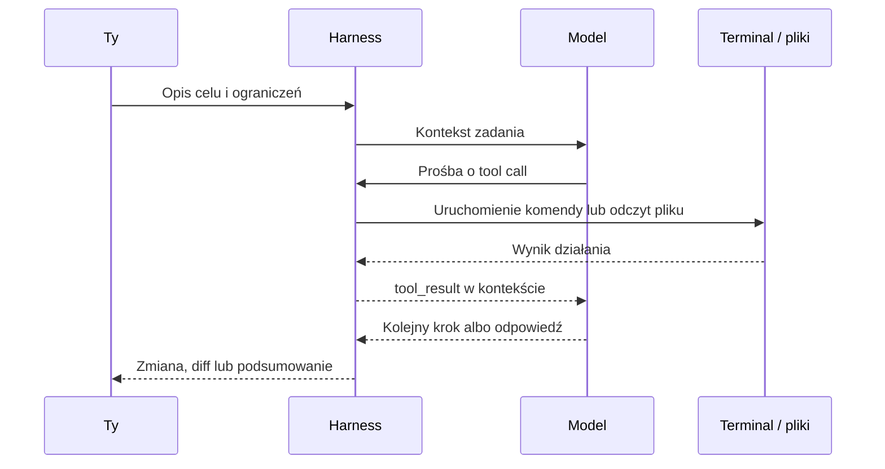
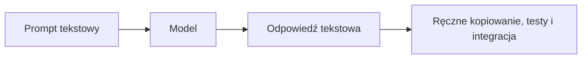
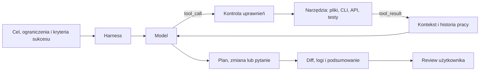

# Chatbot, agent, model i harness - o co tu chodzi?

W pierwszej lekcji naszego preworku przedstawiliśmy ci szeroki potencjał AI na miarę 2026 roku.

No właśnie - ale jak nad tym zapanować? Czym tak naprawdę jest dzisiaj "AI" w kontekście programowania i gdzie powinniśmy asystować agentowi, gdzie o sukcesie decyduje model, a gdzie prowadzi nas harness zbudowany przez producentów całego rozwiązania?

Aby w 2026 roku skutecznie pracować z narzędziami takimi jak Cursor, Codex czy Claude Code, musimy przestać traktować słowo "AI" jako marketingowy synonim inteligentniejszego chatbota.

Potrzebujesz rozróżnić trzy warstwy nowoczesnego ekosystemu: **model** jako silnik generowania kolejnych tokenów, **agenta** jako system wykonujący zadanie przez narzędzia oraz **harness** jako środowisko, które daje agentowi dostęp, ograniczenia i pamięć roboczą.

Wszystkie te zagadnienia rozpracujemy dokładniej w 10xDevs. Teraz zależy nam na lekkim, praktycznym wprowadzeniu, które pomoże ci lepiej oceniać narzędzia i własne prompty.

## Agent to coś więcej niż ChatGPT

Najpopularniejszym błędem przy przejściu na zaawansowane środowiska agentowe jest ciągła próba rozmowy z nimi jak z klasycznym interfejsem ChatGPT.

Chatbot działa w jednorazowej, statycznej pętli: dostarcza kolejną wiadomość tekstową na podstawie jednego promptu lub serii promptów (input -> LLM -> output).

Odbierasz odpowiedź i cykl życia chatbota się kończy. Cały ciężar egzekucji poleceń, ewaluacji wyników i fizycznej integracji kodu z projektem spada z powrotem na ciebie.

Oczywiście możesz kontynuować ten sam wątek, ale model zamiast pracować dla ciebie, pracuje raczej... tobą - opisując kolejne kroki do ręcznego wdrożenia.

Agent to coś znacznie bardziej sprawczego i autonomicznego - to system sterowany przez LLM, który posiada mechanizm decyzyjny i bezpośredni wpływ na twoje środowisko pracy poprzez narzędzia (tool use).

W świecie inżynierii oprogramowania agent rzadko odpowiada wyłącznie tekstem do skopiowania. Najczęściej zgłasza zamiar użycia konkretnego narzędzia, czeka na wynik, interpretuje go i podejmuje kolejną próbę zbliżenia się do celu.

Pod spodem LLM wciąż przewiduje następny token. Różnica polega na tym, że ten token może oznaczać już nie tylko fragment odpowiedzi, ale także deklarację: "chcę uruchomić test", "chcę przeczytać plik", "chcę zmienić ten komponent".

Zobacz, jak wygląda uproszczona deklaracja użycia narzędzia - typowa struktura JSON zwracana przez aplikację agentową:

```json
{
  "role": "assistant",
  "content": [
    {
      "type": "text",
      "text": "Testy w auth.spec.ts nie przechodzą. Uruchamiam walidację, żeby przeanalizować stack trace."
    },
    {
      "type": "tool_use",
      "id": "toolu_01A09q90qw90lq917835lq9",
      "name": "execute_bash",
      "input": { "command": "npm run test:unit src/auth.spec.ts" }
    }
  ]
}
```

Otrzymując taką instrukcję od LLMa, aplikacja agentowa może uruchomić wskazane polecenie w twoim terminalu. Kiedy komenda zakończy się sukcesem albo błędem, harness wstrzykuje wynik z powrotem do kontekstu modelu.

Model widzi nową sytuację, aktualizuje plan działania i podejmuje kolejną iterację. Sama operacja nadal odbywa się poza LLM - na twoim komputerze, w twoim repozytorium, z twoimi zależnościami.



To ważne rozróżnienie, bo ten sam model może dać bardzo różny efekt w zależności od miejsca uruchomienia.

GPT lub Claude w prostym pluginie edytora może świetnie wyjaśnić błąd, ale niekoniecznie dobrze przeszuka repozytorium, utrzyma kontekst, uruchomi testy i pokaże ci czytelny diff. Ten sam model w mocnym coding harnessie ma dostęp do lepszych narzędzi, lepszego przepływu informacji i bardziej przewidywalnej kontroli.

## Co naprawdę wpływa na wynik

Kiedy agent działa dobrze albo źle, łatwo przypisać wszystko "modelowi". To wygodne, ale zbyt proste.

Na wynik pracy składają się cztery warstwy:

- **Model** - rozumuje, generuje tekst, wybiera następny krok i korzysta z narzędzi dostępnych w danym środowisku.
- **Harness** - udostępnia narzędzia, zarządza kontekstem, pyta o uprawnienia, ogranicza ryzykowne akcje i pokazuje wynik pracy w czytelnej formie.
- **Środowisko lokalne** - zawiera repozytorium, zależności, testy, skrypty, zmienne środowiskowe i narzędzia takie jak `git`, `node`, `ffmpeg` czy `gh`.
- **Polityka użytkownika** - decyduje, czy agent może tylko czytać pliki, czy może też je edytować, uruchamiać komendy, instalować paczki albo pracować bez zatwierdzania każdego kroku.

Brzmi mało magicznie? Bardzo dobrze.

W 10xDevs będziemy często wracać do tej perspektywy, bo większość problemów z AI w pracy programisty nie wynika z jednego "głupiego modelu". Częściej problemem jest źle dobrany poziom autonomii, brak testów, słaby kontekst albo zbyt szerokie uprawnienia.

## Harness jako warstwa kontroli

Zdolność do autonomicznych modyfikacji plików nie działałaby bez kontrolnej obudowy chroniącej agenta przed zapętleniami, przypadkowymi zmianami i błędnym użyciem narzędzi.

Tym brakującym pojęciem jest harness - warstwa uruchomieniowa, integracyjna i konfiguracyjna dla asystenta AI. To ona w dużej mierze decyduje o jakości pracy narzędzi takich jak Claude Code, Codex czy Cursor.

Dobry harness daje agentowi nie tylko "dostęp do plików". Daje mu też sposób bezpiecznego działania.

Typowy harness obejmuje kilka mechanizmów:

- **Narzędzia i ich schematy** - opisują, co agent może zrobić: czytać pliki, wyszukiwać w repozytorium, edytować kod, uruchamiać komendy, pobierać dane z API albo korzystać z przeglądarki.
- **Uprawnienia i sandboxing** - określają, które akcje wymagają twojej zgody, gdzie agent może pisać, czy może instalować zależności i kiedy powinien zatrzymać się przed ryzykowną operacją.
- **Kontekst i pamięć robocza** - decydują, co trafia do modelu, co zostaje skompaktowane, co znika z wątku i jak narzędzie radzi sobie z długą sesją pracy.

Do tego dochodzą mniej widoczne, ale bardzo ważne elementy: harmonogram zadań, obsługa błędów narzędzi, telemetria, diff do review, przyciski zatwierdzania zmian i UI, które pozwala ci szybko zrozumieć, co agent właśnie zrobił.

Bez tej warstwy agent byłby tylko modelem, który bardzo chce pomóc, ale nie ma sprawczości, a ty - względem niego - kontroli.

Architektoniczną różnicę między klasycznym chatbotem a modelem działającym wewnątrz profesjonalnego harnessu dobrze widać na poniższym schemacie:





## Agent też może być chatbotem

Agent nie musi od razu edytować plików, uruchamiać testów i przepisywać połowy repozytorium. Czasem najlepszym użyciem agenta jest zwykła rozmowa.

Eksploracja problemu, zadawanie pytań, porządkowanie pojęć, szukanie brakujących założeń i pogłębianie wymagań nadal są bardzo rozwijające. Nie dlatego, że "chatbot wystarcza", tylko dlatego, że rozmowa jest jednym z najtańszych sposobów podniesienia jakości dalszej pracy.

Możesz poprosić agenta o wyjaśnienie błędu, porównanie kilku rozwiązań, znalezienie ryzyk w pomyśle albo zadanie ci serii pytań przed implementacją. To wciąż praca z AI, tylko na etapie myślenia, a nie wykonywania zmian.

W praktyce dojrzały workflow często zaczyna się właśnie od takiej tekstowej eksploracji. Dopiero potem przechodzisz do planu, edycji plików, testów i review diffu.

Poznasz to już w trakcie pracy nad projektowym PRD, gdzie rozmowa z AI pomaga doprecyzować problem, zakres i decyzje zanim cokolwiek trafi do kodu.

## Od rozmowy do realizacji celu

Gdy uświadomisz sobie potencjał systemów agentowych, zmienia się stary model mentalny pracy z AI.

Agent osadzony w CLI posiada dostęp do podobnego zestawu narzędzi, z którego ty korzystasz w systemie operacyjnym. Idziesz do przodu przez delegowanie zadań i kontrolowanie wyniku, a nie przez przepisywanie kolejnych instrukcji z odpowiedzi chatbota.

Pewnym antywzorcem staje się żmudne mikrozarządzanie algorytmem dojścia do celu. Zamiast podawać agentowi każdą komendę do przepisania, opisujesz pożądany stan końcowy, ograniczenia i sposób weryfikacji.

Taka perspektywa uruchamia nowe wzorce współpracy:

- **Masowe operacje na plikach:** "Przejrzyj wszystkie pliki `.svg` w folderze `/assets`, zoptymalizuj je przez SVGO, zmień nazwy na kebab-case i wygeneruj `index.ts` z eksportami".
- **Praca z lokalnymi narzędziami:** "Skompresuj `video.mp4` poniżej 5 MB przez `ffmpeg`, ale zachowaj czytelny tekst na ekranie. Sprawdź wagę pliku po każdej próbie".
- **Migracje i testy:** "Zaktualizuj zależności z prefiksem `aws-`, uruchom linter i testy, a przy problemach kompatybilności zaproponuj bezpieczną migrację".

Twój komunikat staje się bardziej deklaratywny: opisujesz cel, granice i kryteria sukcesu. Brudną robotę imperatywną zostawiasz systemowi działającemu w kontrolowanym środowisku.

To coś, do czego trzeba przyzwyczajać się stopniowo.

## Jak oceniać harness

Zanim powierzysz agentowi większe zadanie, zadaj sobie kilka prostych pytań o środowisko, w którym działa:

- Czy potrafi dobrze czytać i wyszukiwać pliki, zamiast zgadywać strukturę projektu?
- Czy potrafi bezpiecznie edytować kod, pokazać diff i zatrzymać się przed ryzykowną operacją?
- Czy potrafi uruchamiać komendy z kontrolą uprawnień i sensownie reagować na błędy narzędzi?
- Czy zarządza długim kontekstem przez notatki lub inne mechanizmy pamięci roboczej?
- Czy daje ci jasny podgląd tego, co zrobił, co pominął i czego nie potrafił?

Jeśli odpowiedź na większość pytań brzmi "nie wiem", agent może nadal pomóc, ale powinien pracować pod ścisłym nadzorem.

## Nowa epoka programowania z AI

Zestawienie trzech filarów pracy z AI - modelu, agenta i harnessu - sprawia, że przestajesz być typowym użytkownikiem ChatGPT, a zaczynasz działać jak programista nowej generacji.

Twoją rolą nie jest już tylko zadawanie pytań. Coraz częściej projektujesz środowisko pracy, dobierasz poziom autonomii, określasz granice bezpieczeństwa i zatwierdzasz decyzje wyższego poziomu.

Fizyczną modyfikację plików, żmudne przechodzenie po katalogach i powtarzalne komendy możesz delegować maszynie. Skupiasz się na intencji, ryzyku, jakości i sprawdzeniu, czy wynik faktycznie dowozi wartość.

Żeby nie było tak kolorowo, są też pewne minusy bądź konsekencje.

Autonomia potrafi zwiększyć koszt pracy - jeśli agent zapętli się w narzędziach, będzie uruchamiał testy bez sensu, zgubi decyzję po kompakcji kontekstu albo zacznie "naprawiać" problem przez ukrywanie wyjątku - ty zapłacisz tokenami.

Właśnie dlatego w 10xDevs będziemy ćwiczyć nie tylko pisanie promptów, ale też projektowanie kontroli: planów, checkpointów, review diffu, testów, branchy i momentów, w których warto powiedzieć agentowi "stop".

## Na dobry początek

Praktyczny zestaw zasad dla skutecznego programisty przechodzącego od chatbotów do agentów:

- **Decyzja:** trenuj współpracę z agentem i staraj się delegować coraz bardziej złożone zadania. Unikaj momentów, w których AI steruje tobą - to wzorzec z przeszłości.
- **Kontrola:** zanim pozwolisz agentowi zmieniać projekt, poproś o plan, zakres edycji i kryteria sukcesu. Taniej poprawić plan niż sprzątać po złej autonomii.
- **Akcja:** przygotuj środowisko pracy: reguły, działające zależności, testy, lintery, `git status` bez niespodzianek i krótki dokument z zasadami projektu dla agenta.

W pierwszym module 10xDevs przejdziemy przez każdy z tych elementów i rozpracujemy je na praktycznych przykładach.

## Materiały dodatkowe

- Building effective agents / Anthropic / 2024 — https://www.anthropic.com/engineering/building-effective-agents
- Harness engineering: leveraging Codex in an agent-first world / Ryan Lopopolo / 2026 — https://openai.com/index/harness-engineering/
- Unrolling the Codex agent loop / Michael Bolin / 2026 — https://openai.com/index/unrolling-the-codex-agent-loop/
- Claude Code overview / Anthropic Docs / 2026 — https://code.claude.com/docs
