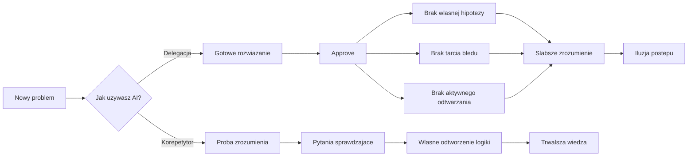

# Jak uczyć się i rozwijać z AI

W poprzedniej lekcji o [Chatbot vs Agent vs Harness](/external/10xdevs-3-prework/pl/02) ustawiliśmy sobie prosty model: pracując z AI, nie oceniasz już tylko modelu, ale cały system pracy wokół niego.

Jeśli trafiłeś tutaj z quizu i nie czytałeś tamtego materiału, wystarczy ci jedno zdanie: agent może dowieźć wynik szybciej niż ty, ale to nadal nie oznacza, że ty czegoś się nauczyłeś.

To właśnie tutaj najłatwiej się oszukać. Kod działa, diff wygląda sensownie, ticket schodzi z tablicy, a ty masz poczucie, że "wchodzisz w nowy obszar szybciej niż kiedykolwiek". Brzmi dobrze. Czasem aż za dobrze.

Potem przychodzi review albo rozmowa z kimś bardziej doświadczonym. Pada pytanie, dlaczego wybrałeś `Promise.all`, skąd bierze się zachowanie SSR albo czemu ten handler łapie wyjątek akurat w tym miejscu. I nagle wychodzi klasyk: rozwiązanie istnieje, ale nie umiesz go obronić.

To jest najważniejszy failure mode tej lekcji: **approve bez obrony**. Agent coś dowiózł, ty kliknąłeś akceptację, ale w twojej głowie nie powstał model problemu.

## Szybko nie znaczy głęboko

Na początku 2026 roku ukazało się randomizowane badanie Anthropic na 52 programistach uczących się nieznanej wcześniej biblioteki Pythona, `Trio`.

Wynik był niewygodny. Grupa z dostępem do AI wypadała wyraźnie gorzej w pytaniach sprawdzających zrozumienie, czytanie kodu i debugowanie, a średnio nie zyskiwała przy tym istotnie dużo czasu. W praktyce najczęściej cytowany wniosek z tego badania brzmi tak: szybciej dowieziony task nie oznacza szybszego budowania kompetencji.

Największa różnica pojawiła się przy debugowaniu. To ma sens. Osoba bez AI częściej musi sama wejść w błąd, przeczytać go, źle zrozumieć, poprawić i dopiero wtedy złożyć sobie mechanizm w głowie. Osoba z AI może ten cały etap ominąć. Wygodnie, ale drogo.

To nie jest argument za tym, żeby wrócić do dokumentacji i udawać, że narzędzia zniknęły. To byłby romantyzm, nie strategia.

To jest argument za tym, żeby rozdzielić dwie rzeczy: **produktywność w zadaniu** i **rozwój kompetencji**. Czasem idą razem. Czasem nie. A jeśli ich nie rozdzielisz, bardzo łatwo pomylisz jedno z drugim.

Podobny sygnał pojawia się w projekcie MIT Media Lab *Your Brain on ChatGPT*. To badanie dotyczyło pisania esejów, nie programowania, i autorzy sami zaznaczają, że to wciąż wstępny, niepeer-reviewowany etap. Mimo tego trend jest znajomy: kiedy model przejmuje zbyt dużą część pracy poznawczej, rośnie komfort, ale spada zaangażowanie i poczucie własności nad wynikiem.

Ethan Mollick opisuje ten mechanizm bardzo trafnie: problemem nie jest samo użycie AI, tylko domyślny tryb "daj mi gotową odpowiedź". Taki tryb daje ci sygnał postępu. Nie zawsze daje postęp.

## Dlaczego AI może psuć naukę

Negatywny wpływ AI na naukę nie bierze się z jakiejś "magii modelu". Mechanizm jest bardziej przyziemny.

Kiedy agent daje ci gotowe rozwiązanie zbyt wcześnie, omija kilka etapów, na których normalnie budowałbyś zrozumienie:

- **Nie formułujesz własnej hipotezy.** Bez własnej próby rozwiązania trudniej zauważyć, czego jeszcze nie rozumiesz.
- **Nie przechodzisz przez tarcie błędu.** Debugowanie jest bolesne, ale właśnie ono zmusza cię do złożenia modelu działania w głowie.
- **Nie wykonujesz aktywnego odtwarzania.** Czytanie odpowiedzi daje poczucie znajomości tematu, ale nie sprawdza, czy umiesz samodzielnie użyć tej wiedzy.
- **Za szybko dostajesz poczucie domknięcia.** Skoro kod działa, mózg łatwo uznaje temat za "załatwiony", mimo że zrozumienie jest powierzchowne.

Właśnie dlatego tryb delegacji tak często kończy się słabiej niż wygląda. AI skraca drogę do wyniku, ale przy okazji potrafi wyciąć te fragmenty procesu, które w nauce są najcenniejsze.



## Te same narzędzia, dwa różne wyniki

Najciekawsze w badaniu Anthropic nie jest nawet to, że część osób uczyła się gorzej z AI. Najciekawsze jest to, że inni uczyli się z nim bardzo dobrze.

Najmocniejszy wzorzec nazywał się *Generation-then-Comprehension*. Najpierw wygenerowanie działającego rozwiązania, potem dopytywanie o logikę, konsekwencje, alternatywy i trade-offy. Ten wzorzec był jednym z najlepszych w całym eksperymencie.

To jest różnica, którą warto zapamiętać na stałe: AI jako **generator** i AI jako **korepetytor** to nie są dwa podobne style pracy. To są dwa różne workflowy.

W pierwszym pytasz: "zrób to za mnie".

W drugim pytasz: "pomóż mi zrozumieć, co właśnie powstało i jak mam tego użyć następnym razem".

I właśnie ten drugi tryb chcemy ci tu ustawić jako domyślny. Bo za chwilę, w lekcji [Prompt agenta jako kontrakt](/external/10xdevs-3-prework/pl/10), zobaczysz jak formułować lepsze polecenia do agenta, a w [Kontekst, który się zużywa](/external/10xdevs-3-prework/pl/11) zobaczysz, co dzieje się z jakością pracy, gdy rozmowa trwa za długo. Zanim tam dojdziesz, potrzebujesz jeszcze jednej rzeczy: własnego trybu nauki.

## Trzy praktyki, które coś zmieniają

### 1. Zbuduj, potem rozłóż na części

Najgorsze, co możesz zrobić w nowym obszarze, to zatrzymać się na poziomie "działa, więc idziemy dalej".

Lepszy ruch wygląda tak:

1. Prosisz AI o pomoc w zbudowaniu czegoś działającego.
2. Potem przechodzisz w tryb analizy.
3. Nie pytasz tylko "co to robi?", ale przede wszystkim "dlaczego akurat tak?" i "co by się zepsuło, gdybym zmienił ten element?".

To jest moment, w którym wygenerowany artefakt zaczyna pracować na twój rozwój. Masz już kod, więc nie musisz walczyć jednocześnie z pustą kartką i z nowym konceptem. Możesz skupić się na zrozumieniu.

Dlaczego to działa? Bo ta praktyka przywraca dwa elementy, które tryb delegacji zwykle wycina: **elaborację** i **sprawdzanie zrozumienia**. Nie konsumujesz już tylko gotowego rozwiązania. Musisz nazwać logikę, porównać alternatywy i przewidzieć konsekwencje zmiany. To jest dokładnie ten rodzaj wysiłku poznawczego, który buduje trwały model działania.

Mini-prompt, który warto skopiować:

```text
Uczę się nowego obszaru. Wyjaśniaj to, co właśnie powstało,
krok po kroku, jeden koncept naraz.

Po każdym kroku zadaj mi krótkie pytanie sprawdzające.
Nie przechodź dalej, dopóki nie odpowiem poprawnie.

Skupiaj się na "dlaczego tak", "jakie są trade-offy"
i "kiedy to podejście byłoby złym wyborem".
```

To jedno dopisane żądanie robi ogromną różnicę. Zamiast ściany tekstu dostajesz rytm nauki, w którym musisz coś odtworzyć własnymi słowami. Właśnie o to chodzi.

Failure mode tej praktyki jest prosty: czytasz wyjaśnienie, kiwasz głową, czujesz że rozumiesz... i po dwóch dniach nic z tego nie zostaje. Jeśli nie było pytania sprawdzającego albo własnego odtworzenia logiki, bardzo możliwe, że wcale nie zrozumiałeś. Tylko przeczytałeś.

### 2. Domknij pamięć, nie tylko sesję

Nawet dobra rozmowa z AI nie zostaje w głowie sama z siebie. To nie Netflix, który "jakoś się utrwali". Niestety.

Jeśli sesja była cenna, zamień ją od razu w materiał do aktywnego odtwarzania. Najprościej: wygeneruj fiszki.

```text
Na podstawie naszej rozmowy wygeneruj fiszki Q/A.
Skup się na kluczowych konceptach, decyzjach i sygnałach błędu,
nie na detalach składni.

Każda odpowiedź: maksymalnie 2-3 zdania.
Dodaj pytania, które sprawdzają zastosowanie wiedzy,
a nie tylko definicję.
```

Potem wrzucasz to do Anki albo innego systemu powtórek i wracasz do tego przez kilka minut dziennie. Meta-analiza Adesope i współpracowników pokazuje, że samo practice testing daje bardzo mocny wzrost retencji względem biernego przeglądania notatek.

To nie jest "fajny dodatek dla ambitnych". To jest moment, w którym wiedza przestaje być jednorazową rozmową i zaczyna być twoim zasobem.

Dlaczego to działa? Bo pamięć nie wzmacnia się głównie przez ponowne czytanie, tylko przez **próbę odzyskania informacji z głowy**. Fiszki i pytania kontrolne zmuszają cię do aktywnego odtworzenia konceptu, a nie do rozpoznania go wzrokiem. To duża różnica.

### 3. Ustaw tryb nauki jako default

Dyscyplina jest zawodna. Szczególnie wtedy, gdy termin pali się pod nogami.

Dlatego warto przerzucić część odpowiedzialności z nawyku na konfigurację. Jeśli twoje narzędzie potrafi działać bardziej jak korepetytor niż generator, ustaw to z góry.

Możesz to zrobić własnym promptem systemowym albo własnymi instrukcjami, na przykład tak:

```text
Zachowuj się jak korepetytor programowania.

Wyjaśniaj krótko, ale konkretnie.
Pokazuj 2 perspektywy albo 2 sensowne alternatywy.
Po każdym ważnym kroku zadawaj pytanie sprawdzające.
Gdy odpowiem źle, wskaż błąd i zadaj prostsze pytanie.
Nie kończ na gotowej odpowiedzi, jeśli temat jest nowy.
```

Jeśli nie chcesz budować tego od zera, część narzędzi ma już wbudowane tryby bliższe nauce niż czystemu generowaniu. W Claude Code są dziś output styles `Explanatory` i `Learning`, ustawiane przez `/config`. W ChatGPT istnieje `Study Mode`, zaprojektowany właśnie pod pracę krok po kroku i pytania kontrolne.

Nie chodzi jednak o konkretną markę. Chodzi o kryteria wyboru:

- czy narzędzie prowadzi cię krokami zamiast wyrzucać gotowca,
- czy zadaje pytania sprawdzające,
- czy pomaga porównać alternatywy i trade-offy,
- czy da się łatwo przełączyć z "dowiezienia taska" na "zrozumienie tematu".

Jeśli odpowiedź brzmi "nie", to nawet bardzo dobry model będzie cię częściej wyręczał niż uczył.

Dlaczego to działa? Bo nie próbujesz już polegać wyłącznie na własnej dyscyplinie. Zmieniasz domyślne zachowanie systemu tak, żeby częściej prowadził cię w stronę pytań, wyjaśnień i sprawdzania zrozumienia, a rzadziej w stronę szybkiego gotowca. Innymi słowy: zmniejszasz szansę, że pod presją czasu automatycznie wpadniesz w najgorszy tryb pracy.

## Od jutra pracuj tak

- **Decision rule:** jeśli uczysz się nowego obszaru, nie kończ interakcji na wygenerowanym rozwiązaniu. Traktuj generację jako start, a nie finał.
- **Warto zapamiętać:** zanim uznasz temat za zamknięty, odpowiedz bez podpowiedzi na jedno pytanie sprawdzające o logikę, trade-off albo sygnał błędu.
- **Action:** ustaw jeden stały tryb nauki, który wymusza wyjaśnienia krok po kroku i pytania kontrolne. Najlepiej dziś, nie "kiedyś".

To jest konkretna zmiana w twoim codziennym workflow. Nie pytasz już tylko "jak najszybciej dowieźć wynik?". Pytasz też: "co zostanie we mnie po tej sesji?".

I właśnie po tym poznasz, czy AI pracuje dla twojego rozwoju, czy tylko dla twojej krótkoterminowej wygody.

## Źródła

- *How AI Impacts Skill Formation* / Judy Hanwen Shen, Alex Tamkin / arXiv / 2026 - https://arxiv.org/abs/2601.20245
- *How AI assistance impacts the formation of coding skills* / Anthropic / 2026 - https://www.anthropic.com/research/AI-assistance-coding-skills
- *Your Brain on ChatGPT: Accumulation of Cognitive Debt when Using an AI Assistant for Essay Writing Task* / Nataliya Kosmyna et al. / arXiv / 2025 - https://arxiv.org/abs/2506.08872
- *Your Brain on ChatGPT* / MIT Media Lab / 2025 - https://www.media.mit.edu/projects/your-brain-on-chatgpt/
- *Against "Brain Damage"* / Ethan Mollick / One Useful Thing / 2025 - https://www.oneusefulthing.org/p/against-brain-damage
- *Rethinking the Use of Tests: A Meta-Analysis of Practice Testing* / Adesope, Trevisan, Sundararajan / Review of Educational Research / 2017 - https://journals.sagepub.com/doi/10.3102/0034654316689306
- *Output styles* / Claude Code Docs / 2026 - https://code.claude.com/docs/en/output-styles
- *Introducing study mode* / OpenAI / 2025 - https://openai.com/index/chatgpt-study-mode/
