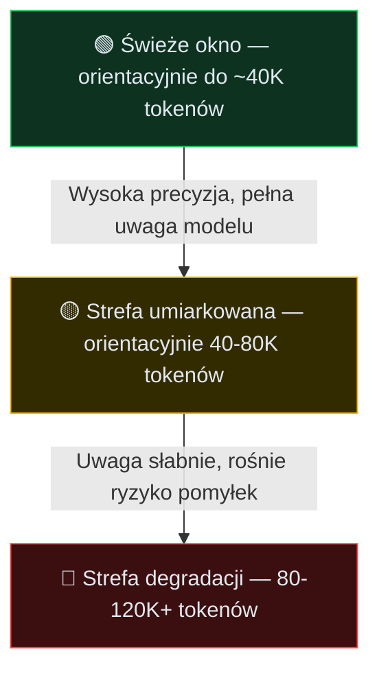

# Ogromny potencjał i niewłaściwe oczekiwania

Początki pracy z agentami AI zawsze wyglądają tak samo - wklejasz potężny zrzut logów z błędem z produkcji i prosisz o naprawę, pisząc prosty prompt "zajmij się tym".

Po kilkunastu sekundach, pewny siebie, otrzymujesz świetnie sformatowany diff, który po błyskawicznym wdrożeniu... wywala resztę aplikacji. Naprawdę sporo pracy jak na jedno polecenie!

Frustracja w takich momentach najczęściej wynika z błędnego założenia o wszechpotężnym AI, które domyśli się naszych intencji, wybierze jeden właściwy sposób działania i dodatkowo, w razie problemów, opisze swoją pracę krok po kroku. Niestety - choć potencjał AI rośnie z miesiąca na miesiąc, to nadal nie jest to magiczna różdżka.

Aby przestać walczyć z AI, musimy spojrzeć na nie na chłodno, jak na system oparty na rachunku prawdopodobieństwa o twardych, mierzalnych ograniczeniach. Zasób wejściowy ma w nim swoją ścisłą cenę, a generowanie błędów to nie wypadek przy pracy, ale rdzeń całego procesu.

## Przewidywanie tokenów w praktyce

Są dwa główne grzechy w codziennej integracji AI w cykl rozwoju oprogramowania - ignorowanie możliwości agentów oraz przecenianie ich. Jako uczestnik 10xDevs na pewno nie jesteś w pierwszej grupie, ale możesz być podatny na tę drugą skrajność - co jest równie niebezpieczne.

Zamiast AI-voo-doo, chcemy na te rozwiązania patrzeć okiem inżyniera. Czym one są, na jakiej architekturze bazują i gdzie nasza ingerencja jest nadal niezbędna. Na start nie zaszkodzi kilka słów o fundamentach.

Kiedy wiodące modele (takie jak GPT-5.4 czy Claude Opus 4.7) generują kod w twoim IDE, wykonują one ciągłą, masywną operację przewidywania kolejnego tokena. Baza wag sieci neuronowej to złożona maszyna, która decyduje, jaki fragment tekstu i składni statystycznie najlepiej pasuje jako bezpośrednia kontynuacja wrzuconego przez ciebie promptu.

Model w warstwie pre-treningu nie posiada wbudowanego mentalnego obrazu twojego oprogramowania. Nie wie czym jest dobrze zrealizowana transakcyjność bazy danych i nie odczuwa dysonansu poznawczego, gdy generuje kod naruszający reguły SOLID. Jego wyłącznym matematycznym zadaniem jest zminimalizowanie błędu predykcji względem wszystkich projektów i fragmentów kodu, na których był szkolony.

## Jak to wygląda w kodzie

W trakcie treningu model oglądał ogromne zbiory tekstu i kodu: repozytoria, dokumentację, przykłady testów, opisy błędów, fragmenty rozmów technicznych. Nie zapamiętuje ich jako jednej wielkiej biblioteki do przeszukania, tylko aktualizuje wagi tak, aby po danym ciągu tokenów coraz lepiej przewidywać następny token.

Najprostszy obraz predykcji kolejnego tokena możesz zrozumieć na zwykłym fragmencie kodu:

```ts
function calculateTotal(items: Item) {
  return items.reduce((sum, item) => sum + item. //jakie pole pobrać z obiektu item?
```

Jeśli na takim fragmencie mamy włączony klasyczny model do autocomplete, po fragmencie `item.` mogą pojawić się nazwy pól typowe dla tysięcy podobnych przykładów.

I tu zaczyna się praktyczny problem. Jeśli w twoim projekcie poprawnym polem jest `item.grossAmount`, ale w kontekście nie ma wystarczająco jasnego sygnału, model może wybrać `item.price`, bo taki ciąg dalszy wygląda statystycznie znajomo.

```ts
function calculateTotal(items: Item) {
  // Property 'price' does not exist on type 'Item'.
  return items.reduce((sum, item) => sum + item.price;
```

Z praktycznego punktu widzenia oznacza to, że model jest tak skalibrowany, aby wyprodukować tekst "wyglądający" najbezpieczniej, ale niekoniecznie działający. Zmyślony fragment logiki może idealnie odwzorowywać konwencje nazewnicze, nowy endpoint może na pierwszy rzut oka wyglądać tak jak pozostałe, a nowy model danych może być "w sam raz", a na końcu i tak coś pójdzie nie tak.

Takie wpadki najczęściej nie wyglądają spektakularnie. Kod przechodzi przez formatter, importy się zgadzają, nazwy funkcji brzmią znajomo... i właśnie dlatego łatwo go przepuścić dalej.

W praktyce zobaczysz trzy powtarzalne klasy błędów:

1. **Kod składniowo poprawny, ale semantycznie błędny** - np. obsługuje happy path, ale gubi transakcję, retry albo edge case w danych.
2. **Test, który sprawdza implementację zamiast zachowania** - wygląda profesjonalnie, ale tylko utrwala błędne założenie modelu.
3. **Ignorowanie środka kontekstu** - model pamięta początek rozmowy i ostatnie polecenie, ale pomija decyzję zakopaną kilkadziesiąt wiadomości wcześniej.

Samo podobieństwo kodu do tego, co w projekcie już istnieje, a nawet poprawność importów, nie usuwa szansy na wpadki.

Czy można temu zapobiec? Tak, po części zdobywanym doświadczeniem, a po części twardymi bramkami bezpieczeństwa i rygorystyczną kontrolą kontekstu, czyli technikami, o których nauczysz się w 10xDevs.

## Od zgadywania do wnioskowania

Skoro klasyczne modele to po prostu szybcy statystycy, jak możemy powierzyć im zadania architektoniczne, które wymagają weryfikacji hipotez i przewidywania ślepych zaułków?

Odpowiedzią branży są modele rozumujące. Zamiast polegać tylko na bazie wiedzy z etapu pretreningu, architektura ta pozwala przeznaczyć dodatkowy budżet na wnioskowanie już po zadaniu oryginalnego pytania.

Zamiast natychmiast wypluć wynik, taki model korzysta z ukrytych tokenów rozumowania jako narzędzia pomocniczego. Model operuje tysiącami takich tokenów, dzięki czemu może rozważyć kilka wariantów dalszego postępowania: *czy ta migracja bazy nie zablokuje tabeli dla innych procesów? Czy mogę zrobić ją etapami? Czy muszę zmienić kolejność wdrożenia?* W ten sposób system zyskuje większą szansę rozwiązywania problemów strukturalnych, a nie tylko generowania kolejnych linijek kodu.

Taka moc ma jednak swoją cenę. Każdy krok w ukrytym wnioskowaniu to tokeny, za które normalnie płacisz.

Wysłanie "myśliciela" do prostej zmiany formatowania to świetna droga, by przepalić budżet. Z kolei próba zmuszenia taniego modelu bazowego do głębokiego refaktoringu szybko zwiększa ryzyko degradacji kontekstu. Stąd obecnie w rozwiązaniach takich jak Cursor czy Claude Code po nazwie modelu pojawiają się dopiski tzw. `effortu` jak:

* Gemini 3.1 Pro (low)
* GPT-5.4 (high)
* GPT-5.3-Codex (xhigh)

Określenia takie jak `low` / `high` / `xhigh` oznaczają dopuszczalny poziom wnioskowania (budżet na ukryte tokeny rozumowania), który koreluje z jakością wyniku, ale również kosztem całej operacji. Jeśli planujesz architekturę, celuj w poziomy wyższe - jeśli natomiast zajmujesz się implementacją na gotowym planie, możesz ustawić tę kontrolkę nieco niżej.

Rozumowanie modelu nie zwalnia cię jednak z weryfikacji efektów. Model może dłużej analizować problem i nadal zaproponować zmianę, która nie przechodzi testów, ignoruje realne ograniczenie środowiska albo opiera się na nieaktualnym założeniu.

Dodatkowo, w wielu edytorach i środowiskach zobaczysz co najwyżej streszczenie toku myślenia, zamiast surowego "łańcucha myśli". To dodatkowy argument za tym, aby do końca zachowywać kontrolę nad tym, co w projekcie robi dla nas AI.

## Twarda ściana degradacji kontekstu

A teraz jeszcze inny aspekt pracy z modelami, który wprost wynika z ich architektury.

Programiści często wpadają w pewną pułapkę: skoro wyjście LLMa dopasowuje się do wejścia, wrzućmy do okna modelu całe repozytorium, dokumentację i logi – jakoś sobie poradzi.

Prawda o przetwarzaniu ogromnego wejścia jest inna: ładowanie nieistotnego bagażu treści obniża zdolności analityczne modelu. Dotyczy to w równym stopniu tanich modeli bazowych, co najdroższych modeli rozumujących. Badania nad wydajnością wiodących rozwiązań oraz praktyka pracy z agentami wskazują na barierę, którą roboczo nazwano **MECW** (Maximum Effective Context Window).

Po jej przekroczeniu zdolność modelu do wyłuskania ważnej informacji często spada. To, że model informuje o dostępnych 2 milionach tokenów okna nie oznacza wcale, że poprawnie uwzględni wskazówkę zakopaną na setnej stronie twoich logów.

Degradacja wynika m.in. z tego, jak modele rozkładają uwagę na długim wejściu i jak narzędzia doklejają kontekst do rozmowy. Model może mocniej trzymać się początku wprowadzonych danych oraz ostatnich linijek czatu, a przy okazji zgubić logikę włożoną w środek promptu.

Jak sobie z tym radzić? Kontrolować zajętość okna kontekstowego na każdym istotnym etapie rozmowy (a szczególnie przed rozpoczęciem istotnego etapu pracy). Nasz "rule of thumb" to wartości takie jak poniżej:



*(Tym, jak zarządzać procesem degradacji przy użyciu komend do czyszczenia wątku, zajmiemy się w kolejnych lekcjach).*

Ważne doprecyzowanie: problemem nie jest samo istnienie dużego repozytorium. Dobre narzędzia potrafią indeksować, wyszukiwać i selektywnie pobierać fragmenty kodu. Problem zaczyna się wtedy, gdy wrzucasz do bieżącego okna nieprzefiltrowany kontekst i liczysz, że model sam odróżni sygnał od szumu.

W jednej z kolejnych lekcji opowiemy co robić, kiedy miejsca na dane faktycznie zaczyna brakować.

## Budżetowanie tokenów

Zrozumienie obu powyższych zjawisk - potęgi reasonerów oraz efektu degradacji kontekstu - prowadzi nas do najważniejszej inżynierskiej zasady pracy z AI. Okno kontekstowe modelu to niezwykle cenna przestrzeń, o którą trzeba dbać szczególnie mocno.

Zasoby tokenów w oknie będą wykorzystywać m.in.:

1. **Instrukcje systemowe:** - System prompt przygotowany przez twórcę rozwiązania.
2. **Stałe instrukcje projektowe:** `AGENTS.md` / `CLAUDE.md` / `Cursor Rules` - pliki z instrukcjami projektowymi, które są stosowane przez model w każdej sesji.
3. **Polecenia w danej sesji:** - Tokeny bieżące jak i myślowe, generowane na potrzeby sesji użytkownika, np. przy wykonywaniu narzędzi / komend.
4. **Definicje narzędzi / MCP** - Narzędzia, które są dostępne dla modelu w danej sesji.

W zależności od problemu, musimy nauczyć się odpowiedniego rozdzielania tych zasobów, aby nie przepalić budżetu. Wiedzy i kontekstu ma być dużo, ale... nie za dużo. Ma to być treść wysokiej jakości, ale bez opasłej struktury i niepotrzebnych trików stylistycznych. Doświadczenie i praca w 10xDevs pomoże ci opanować ten wątek.

Na potrzeby codziennej pracy możesz przyjąć prosty podział:

| Typ zadania | Rozsądny wybór |
| --- | --- |
| Mechaniczna zmiana, formatowanie, prosta transformacja | ekonomiczny model z niskim budżetem wnioskowania |
| Niejasna architektura, migracja, trudny błąd produkcyjny | model rozumujący z wyższym effortem |

Naszym zdaniem to dość intuicyjne. Wraz ze wzrostem wagi problemu możemy zainwestować więcej tokenów w samą pracę modelu. Otrzymamy lepsze efekty, ale zapłacimy za nie nieco więcej. Rozsądny kompromis.

## Co warto wiedzieć

- **Zasada decyzyjna:** dobieraj model do głębi problemu. Rutynowe poprawki i style zostaw dla tańszych modeli, a trudne problemy architektoniczne kieruj do modeli rozumujących o największym efforcie.
- **Kontrola bezpieczeństwa:** nie ufaj pewności odpowiedzi bez zewnętrznej weryfikacji. Sprawdź diff, uruchom testy, zbuduj projekt albo porównaj claim z dokumentacją.
- **Akcja na dziś:** zanim kolejny raz poprosisz agenta o zrealizowanie zadania, zastanów się co realnie w danym momencie widzi - być może instrukcje projektowe, reguły lub sam prompt zawierają treści nadmiarowe?

## Materiały dodatkowe

- Dlaczego modele sztucznej inteligencji błądzą (Why language models hallucinate) / OpenAI / 2025-09-05 — https://openai.com/index/why-language-models-hallucinate/
- Wnioskowanie i zasady operacyjne w oparciu o modele rozumujące (Reasoning best practices) / OpenAI API Docs / 2026 — https://developers.openai.com/api/docs/guides/reasoning-best-practices
- Okno kontekstowe w modelach Claude (Context windows) / Anthropic Docs / 2026 — https://docs.anthropic.com/en/docs/build-with-claude/context-windows
- Zarządzanie ukrytym myśleniem (Building with extended thinking) / Anthropic Docs / 2025 — https://docs.anthropic.com/en/docs/build-with-claude/extended-thinking
- Degradacja wiedzy w długim oknie: badanie na modelach wiodących (Context Rot: How Increasing Input Tokens Impacts LLM Performance) / Kelly Hong, Anton Troynikov, Jeff Huber / 2025-07-14 — https://www.trychroma.com/research/context-rot
