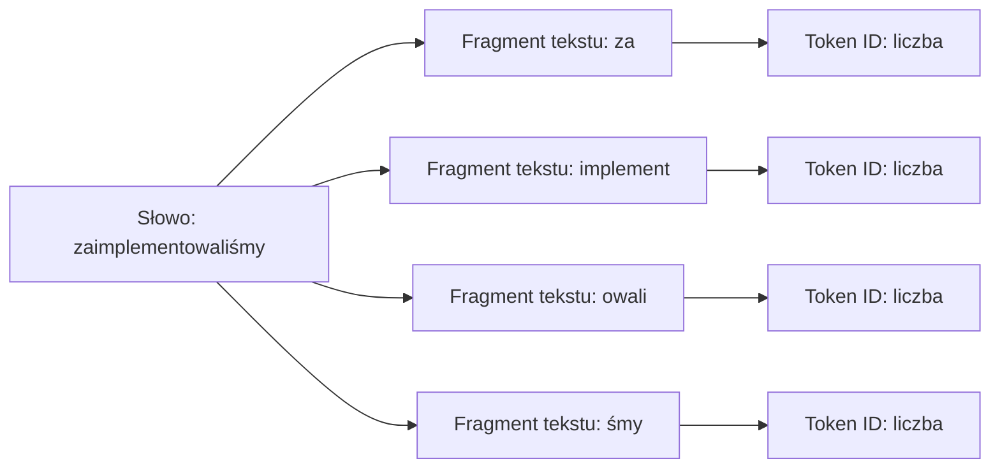

# Jakim językiem rozmawiać z agentem

W poprzedniej lekcji preworku nauczyłeś się, jak zarządzać cyklem życia wątku i jak kontekst zużywa się z każdą turą. Teraz czas na decyzję, która ustawia ten budżet już na starcie - w jakim języku pisać do agenta?

Otwierasz edytor, kopiujesz błąd z konsoli i już masz napisać: „Zrób z tego asynchroniczny job i zrób pusha". Ale chwila - skoro najnowsze modele świetnie rozumieją polski, to po co silić się na... łamaną techniczną angielszczyznę?

Odpowiedź w 2026 roku jest czysto inżynieryjna: budżet okna kontekstowego, koszt API i szum przy mapowaniu pojęć systemowych.

Nie chodzi o to, że polski jest "gorszy". Chodzi o to, że jako uczestnik 10xDevs będziesz pracować z agentami długo, w wielu turach i często na realnym codebase'ie, więc język staje się częścią ergonomii całego workflow.

W trakcie 10xDevs będziemy wracać do tego tematu przy projektowaniu reguł repozytorium, pracy w branchach, przeglądach PR i budowaniu własnych kontraktów z agentem. Na razie ustalmy praktyczną zasadę startową.

## Tokenizacja nie lubi polskiego

Każdy tekst, który wpisujesz do agenta - w terminalu Claude Code czy w oknie Cursora - przed dotarciem do warstw sieci neuronowej przechodzi przez tokenizator.

W praktyce spotkasz dziś różne tokenizatory, często oparte o podejścia z rodziny `BPE` albo `unigram`. Szczegóły różnią się między modelami, ale efekt dla programisty zwykle jest podobny: angielskie słownictwo techniczne bywa pakowane oszczędniej niż jego polskie odpowiedniki.

Z tej asymetrii wynika mierzalne zjawisko - *fertility ratio*, czyli liczba tokenów potrzebnych, by model „wchłonął" jedno zapisane słowo.

Dla angielskiego w tematach IT wiele pojęć mieści się w pojedynczych tokenach. Dla polskiego, przez odmianę, końcówki i mniej typowe zbitki znaków, ten koszt często rośnie.

Nie musisz zapamiętywać konkretnego współczynnika. Wystarczy praktyczna intuicja: to samo polecenie po polsku często zajmie więcej tokenów niż jego angielski odpowiednik.

Skoro współczesne modele mają okna od 200 tysięcy do 2 milionów tokenów, dlaczego ta różnica ma cię obchodzić? Sekret tkwi w *context rot*, o którym mówiliśmy w poprzedniej lekcji.

Im więcej tokenów ląduje w historii sesji - zwłaszcza gdy agent odpala długie pętle analityczne, wkleja logi i wykonuje testy z błędami - tym szybciej rozmywa się uwaga modelu.

Wymuszając polski do każdego polecenia operacyjnego, dobrowolnie zbliżasz się do momentu, w którym trzeba będzie zrobić `/compact` lub `/clear`. Niby nic strasznego, ale w środku refaktoringu potrafi to zaboleć.

Żeby zobaczyć ten narzut, zrób prosty test w [tokenizatorze](https://platform.openai.com/tokenizer) OpenAI. Dla `tiktoken o200k_base` ten przykład wygląda tak:

| Komenda operacyjna | Tekst wejściowy (Prompt) | Liczba tokenów |
|-------------------|----------------|----------------|
| Angielski (domyślny) | `Implement a retry mechanism with exponential backoff.` | 9 tokenów |
| Polski (wymuszony) | `Zaimplementuj mechanizm ponowień z wykładniczym opóźnieniem.` | 20 tokenów |

W tym konkretnym porównaniu dostajemy ponad 100% narzutu. W innym modelu liczby mogą być inne, ale kierunek często zostaje ten sam.

Możesz sprawdzić też własne pary:

- `Find all failing tests and propose the smallest fix.` / `Znajdź wszystkie testy, które nie przechodzą, i zaproponuj najmniejszą poprawkę.`
- `Refactor this service without changing the public API.` / `Zrefaktoryzuj ten serwis bez zmiany publicznego API.`
- `Explain why this migration is unsafe.` / `Wyjaśnij, dlaczego ta migracja jest niebezpieczna.`

Nie chodzi o akademickie liczenie tokenów przy każdym prompcie. Chodzi o wyczucie, które potem pomaga przy długich sesjach z agentem.

Skutki widać w trzech miejscach naraz: 
1) większa historia rozmowy
2) szybsze zużycie okna
3) wyższy rachunek w modelu `pay-per-token`.

Odłóżmy na chwilę kwestie ekonomiczne i zadajmy inne pytanie - a co z jakością odpowiedzi w zależności od języka?

## Rozumowanie jest ponadjęzykowe

Długo utrzymywał się mit, że aby model logicznie przemyślał trudny problem architektoniczny, trzeba napisać mu porządny anglojęzyczny esej z precyzyjnie dobranymi czasownikami.

W praktyce najnowsze modele radzą sobie z wieloma językami dużo lepiej, niż sugerowałyby stare intuicje z czasów prostych chatbotów. Dobra wiadomość dla wszystkich, którzy nie myślą po angielsku pod prysznicem.

W benchmarku *OneRuler* badacze sprawdzali, jak modele radzą sobie z pozyskiwaniem informacji z długiego kontekstu w wielu językach. To nie jest test "czy model napisze lepszy kod po polsku", ale dobrze pokazuje coś innego: język wejściowy nie musi automatycznie niszczyć jakości rozumowania.

W wybranych konfiguracjach polski wypadał tam bardzo mocno, również w zadaniach na długim kontekście. To zaskakujący wynik, ale uwaga - warto czytać go razem z metodologią, a nie jako hasło „polski zawsze wygrywa" jak w social mediach.

Można więc stwierdzić, że model nie zgubi zdolności programistycznych tylko dlatego, że dostał po polsku wyczerpujący log o błędzie rzutowania.

Co więcej, próby wymuszenia angielskich struktur przez zmęczonego inżyniera potrafią wygenerować więcej niejasności niż sprawnie napisany opis problemu w języku ojczystym. Sprowadza się to do prostego wniosku: przy polskim prompcie zwykle nie martwimy się samą logiką modelu, tylko kosztem, długością kontekstu i szumem pojęciowym.

No dobrze - to kiedy używać angielskiego, a kiedy polski jest po prostu lepszym narzędziem?

## Angielski jako domyślny tryb pracy

Stos technologiczny nie lubi tłumaczeń. Zdecydowana większość nazw domenowych, metod bibliotek, wyjątków i dyskusji na StackOverflow jest po angielsku.

Tłumacząc w głowie „exponential backoff retry" na „wykładnicze opóźnienie ponowień", dokładasz dodatkową warstwę mapowania. System indeksowania, po który narzędzia w Cursorze sięgają przy odpytywaniu codebase'u, działa najczytelniej, gdy tokeny z promptu pasują do nazw z projektu.

Angielski w poleceniach operacyjnych traktuj tak samo jak nazwy branchy, commity w Gicie czy komentarze w klasach. To język, który stabilizuje proces i minimalizuje nieporozumienia z agentem.

Plik `CLAUDE.md`, `AGENTS.md` lub Cursor Rules - twój nadrzędny kontrakt z agentem - zwykle powinien być precyzyjnym dokumentem po angielsku. Dzięki temu zapewnia stabilne instrukcje.

Nie znaczy to, że polski nie ma racji bytu w pracy z agentem. Jako uczestnik 10xDevs szybko zauważysz, że polski działa świetnie jako „debug mode" - narzędzie do łamania własnych barier poznawczych.

Gdy pracujesz w Plan Mode nad uciążliwym kawałkiem refaktoringu, nie trać czasu na wygładzanie gramatyki angielskiej. Myśl głośno po polsku tak, jak tłumaczysz problem koledze z zespołu.

To świadomy trade-off: płacisz za te tury nieco wyższym kosztem tokenów w zamian za jasność własnego myślenia. W trakcie głównego programu będziemy ćwiczyć ten podział przy planowaniu, implementacji i review pracy agenta.

Gdy plan zostanie zaakceptowany i przychodzi czas na masowe edycje plików oraz pętlę narzędzi - wróć do sterylnego języka inżynierii. Oszczędzasz tokeny na każdym potwierdzeniu, każdym diffie i każdym kolejnym kroku.

## Prosta polityka językowa

Najwygodniej myśleć o języku pracy z AI jak o konfiguracji projektu. Nie wybierasz jednego języka „na zawsze", tylko przypisujesz język do typu zadania.

| Sytuacja | Zalecany język | Dlaczego |
|---|---|---|
| Reguły projektu (`AGENTS.md`, `CLAUDE.md`, Cursor Rules) | Angielski | Stabilny kontrakt dla agenta i dobre mapowanie na narzędzia, biblioteki oraz wzorce z dokumentacji. |
| Nazwy zmiennych, funkcji, commitów, branchy | Angielski | Spójność ze stosem technologicznym i mniejszy szum w wyszukiwaniu po repozytorium. |
| Polecenia operacyjne do agenta | Preferuj angielski | Krótszy zapis, lepsze dopasowanie do kodu i dokumentacji. |
| UI, komunikaty, maile, treści dla użytkownika | Język produktu | Jeśli aplikacja mówi do użytkownika po polsku, agent też powinien generować copy po polsku. |
| Reguły biznesowe, wymagania od interesariuszy, kontekst domenowy | Język najjaśniejszego opisu | Czasem polski opis księgowości, edukacji albo supportu jest bardziej precyzyjny niż wymuszony angielski. |
| Planowanie, debugowanie, opis dziwnego błędu | Polski jest OK | Jeśli po polsku szybciej dojdziesz do sedna, użyj polskiego i dopiero potem przełącz wykonanie na angielski. |

Ta tabela nie jest dogmatem. To domyślny profil, który możesz nadpisać, gdy konkretny projekt albo zespół ma inne zasady.

Jest jeszcze jeden detal. Zamiast pisać do nowoczesnego modelu „Think step-by-step", częściej proś o coś, co faktycznie możesz ocenić: krótki plan, założenia, ryzyka, listę plików do zmiany albo podsumowanie rozumowania.

Ukrytego procesu rozumowania i tak nie kontrolujesz bezpośrednio. Kontrolujesz natomiast artefakty, które agent pokazuje przed edycją kodu - i właśnie na nich warto opierać współpracę.

## Co warto wiedzieć

- **Reguła decyzyjna:** domyślnie steruj agentem po angielsku, ale generuj rezultaty w języku produktu. Kod, commity, instrukcje projektowe i polecenia operacyjne trzymaj po angielsku; UI copy, komunikaty i materiały użytkowe pisz po polsku, jeśli tego wymaga produkt.
- **Kontrola bezpieczeństwa:** gdy pracujesz po polsku, sprawdzaj, czy agent nie przetłumaczył pojęć technicznych w sposób, który rozjeżdża się z kodem. Szczególnie pilnuj nazw bibliotek, wyjątków, endpointów, flag i terminów domenowych.
- **Akcja na dziś:** weź trzy najczęstsze polecenia, których używasz wobec agenta, i przygotuj ich angielskie wersje. Potem porównaj tokeny w tokenizerze i zapisz najlepszą formę w swoich regułach projektu.

## Materiały dodatkowe

- *One ruler to measure them all: Benchmarking multilingual long-context language models* / Kim et al. / COLM 2025 — https://arxiv.org/abs/2503.01996
- *Advancing Polish Language Modeling through Tokenizer Optimization in the Bielik v3 7B and 11B Series* / SpeakLeash / 2026 — https://arxiv.org/abs/2604.10799
- *Language Model Tokenizers Introduce Unfairness Between Languages* / Petrov et al. / 2023 — https://arxiv.org/abs/2305.15425
- Multilingual support / Anthropic Claude API Docs — https://platform.claude.com/docs/en/build-with-claude/multilingual-support
- Reasoning best practices / OpenAI API Docs — https://platform.openai.com/docs/guides/reasoning-best-practices
