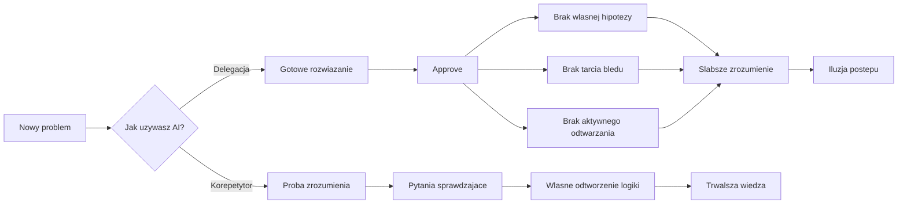
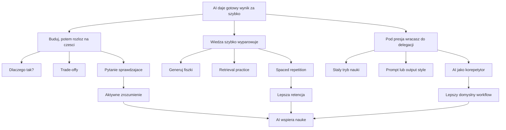

# Propozycje wizualne dla `[1.3] Jak uczyć się i rozwijać z AI`

## Diagram 1 — Gdzie AI psuje naukę



Cel:
- szybko pokazuje mechanizm szkody, nie tylko wynik
- dobrze siada po sekcji o badaniach

## Diagram 2 — Jak trzy praktyki odwracają problem



Cel:
- spina problem i rozwiazania w jednym obrazie
- nadaje sie blizej sekcji `Trzy praktyki, które coś zmieniają`

## Ilustracja 1 — approve bez obrony

Wariant zgodny z formatem `scripts/ebook-illustrations/spec.json`:

```json
{
  "id": "prework-03-approve-bez-obrony",
  "anchorHeading": "Jak uczyć się i rozwijać z AI",
  "anchorLine": 13,
  "assetType": "illustration",
  "stylePreset": "dark-cosmic-10xdevs",
  "paletteHex": ["#F68F09", "#CD84FF", "#1F36E4"],
  "promptPl": "Styl referencyjny dark cosmic 10xDevs inspirowany paczka referencyjna: ciemne granatowo-fioletowe tlo kosmiczne, mocne krawedziowe swiatlo, neonowe poswiaty w kolorach #F68F09, #CD84FF i #1F36E4, filmowa glebia, warstwowa kompozycja, subtelna siatka lub panele sci-fi UI, neutralny edukacyjny ton, wysoki kontrast, premium web illustration, bez brandingu. Koncepcyjna ilustracja failure mode'u 'approve bez obrony'. Pokaz programiste patrzacego na gotowy, swiecacy diff lub panel z zaakceptowana zmiana, podczas gdy za nim pojawia sie druga warstwa sceny: review, pytania o trade-offy i luki w zrozumieniu. Obraz ma jasno komunikowac rozdzwiek miedzy dowiezionym wynikiem a brakiem mentalnego modelu. Bez nazw narzedzi, bez logotypow, bez konkretnych liczb, bez realistycznych twarzy znanych osob.",
  "negativePromptPl": "zadnych nowych faktow poza materialem, zadnych nazw modeli lub firm, zadnych logotypow, watermarkow, stock photo, clipartu, przeladowanych dashboardow, falszywych fragmentow kodu, losowego tekstu po angielsku, memow",
  "modelPrimary": "google/gemini-3.1-flash-image-preview",
  "modelFallback": "openai/gpt-5-image",
  "mustHave": false,
  "outputFilename": "prework-03-approve-bez-obrony.webp",
  "altTextPl": "Ilustracja pokazujaca rozdzwiek miedzy zaakceptowanym wynikiem AI a brakiem zdolnosci obrony decyzji technicznych",
  "styleReferenceIds": [
    "6993040a9d74c9dcd05be204_proces-image-v2-x2-webp.webp",
    "6993041f2f30d8bcc5abeb5c_system-image-v2-webp.webp",
    "69930442ade6530f1db4282c_mvp-image-v2-webp.webp"
  ]
}
```

Cel:
- najmocniejszy wizualnie motyw tej lekcji
- dobrze dziala jako ilustracja otwierajaca sekcje problemu

## Ilustracja 2 — AI jako generator vs korepetytor

```json
{
  "id": "prework-03-generator-vs-korepetytor",
  "anchorHeading": "Te same narzędzia, dwa różne wyniki",
  "anchorLine": 46,
  "assetType": "illustration",
  "stylePreset": "dark-cosmic-10xdevs",
  "paletteHex": ["#F68F09", "#CD84FF", "#1F36E4"],
  "promptPl": "Styl referencyjny dark cosmic 10xDevs inspirowany paczka referencyjna: ciemne granatowo-fioletowe tlo kosmiczne, mocne krawedziowe swiatlo, neonowe poswiaty w kolorach #F68F09, #CD84FF i #1F36E4, filmowa glebia, warstwowa kompozycja, subtelna siatka lub panele sci-fi UI, neutralny edukacyjny ton, wysoki kontrast, premium web illustration, bez brandingu. Koncepcyjna ilustracja pokazujaca dwa tryby pracy z tym samym AI. Po lewej szybki generator: gotowy wynik, zamknieta sciezka, minimalne zaangazowanie czlowieka. Po prawej AI jako korepetytor: dialog, pytania sprawdzajace, rozkladanie problemu na etapy i widoczny wzrost zrozumienia. To ma byc kontrast dwoch workflowow, nie ranking narzedzi. Bez logotypow, bez nazw vendorow, bez konkretnych metryk i bez dodatkowych faktow.",
  "negativePromptPl": "zadnych nowych faktow poza materialem, zadnych nazw narzedzi, logotypow, falszywych benchmarkow, przeladowanych paneli z mikrotekstem, stock photo, clipartu, memow",
  "modelPrimary": "google/gemini-3.1-flash-image-preview",
  "modelFallback": "openai/gpt-5-image",
  "mustHave": false,
  "outputFilename": "prework-03-generator-vs-korepetytor.webp",
  "altTextPl": "Ilustracja pokazujaca kontrast miedzy AI jako generatorem gotowych odpowiedzi a AI jako korepetytorem prowadzacym do zrozumienia",
  "styleReferenceIds": [
    "6993040a9d74c9dcd05be204_proces-image-v2-x2-webp.webp",
    "6993045f4289b5784c42764e_legacy-image-v2-webp.webp",
    "6993049b959c28628759a2af_tempo-image-v2-webp.webp"
  ]
}
```

Cel:
- najlepiej ilustruje glowna teze lekcji
- latwo reuse'owalna do ebooka, webinaru i sociala

## Rekomendacja

Jesli chcesz:

- najmocniejszy diagram merytoryczny: wybierz `Diagram 1`
- najlepszy diagram spinajacy cale rozwiazanie: wybierz `Diagram 2`
- najmocniejsza ilustracja do samej lekcji: wybierz `prework-03-generator-vs-korepetytor`
- najmocniejsza ilustracja do otwarcia sekcji problemu: wybierz `prework-03-approve-bez-obrony`

## Wybrany wariant wdrozony

- Diagram wklejony do lekcji: `Diagram 1`
- Draft assetu dodany do `scripts/ebook-illustrations/spec.json`: `prework-03-generator-vs-korepetytor`

## Gotowe polecenia

Walidacja speca:

```bash
npx tsx scripts/generate-ebook-illustrations.ts --validate-only
```

Wygenerowanie tylko wybranego assetu:

```bash
npx tsx scripts/generate-ebook-illustrations.ts --asset prework-03-generator-vs-korepetytor --attempts 2
```

Wymuszona regeneracja tego assetu:

```bash
npx tsx scripts/generate-ebook-illustrations.ts --asset prework-03-generator-vs-korepetytor --attempts 2 --force
```
