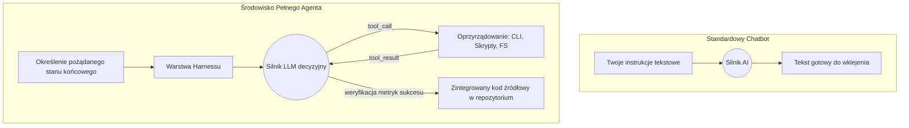

# Chatbot, agent, model i harness – o co tu chodzi?

W pierwszej lekcji naszego preworku przedstawiliśmy ci przykładowy workflow z AI na miarę 2026r.

Wykorzystywane przez nas narzędzie było w stanie komunikować się z GitHubem i interpretować szczegóły jednego z wątków przy pomocy GitHub CLI. Wykonaliśmy też research aby rozpoznać terytorium, stworzyliśmy prostą mapę katalogów w projekcie, następnie na podstawie opisu problemu przygotowaliśmy plan i uporaliśmy się z problemem. AI poruszało się po zasobach w sieci, ale też po naszym systemie plików. Wczytywało fragmenty projektu, modyfikowało je, no i korzystało z mnóstwa narzędzi pomocniczych.

Naprawde sporo pracy jak na jeden ticket! 

No właśnie - ale jak nad tym wszystkim zapanować? Czym tak naprawdę było to "AI" i gdzie powinniśmy się przygotować na asystowanie Agentowi, gdzie o sukcesie decydował model a gdzie prowadził nas wbudowany harness tworzony przez producentów całego rozwiązania?

Aby w 2026 roku skutecznie pracować z narzędziami takimi jak Cursor, Codex czy Claude Code, musimy przestać traktować słowo "AI" jako marketingowy synonim inteligentniejszego chatbota. Żeby wyciągnąć maksimum wartości z inżynierii wspomaganej przez AI, potrzebujesz rozróżnić trzy warstwy nowoczesnego ekosystemu: **model** (silnik predykcji tokenów), **agenta** (wyuczone autonomiczne zachowanie ukierunkowane na cel) oraz **harness** (infrastrukturę uruchomieniową dostarczającą narzędzia i ograniczenia).

Wszystkie te zagadnienia poznasz dokładnie na przekroju całego 10xDevs, ale w formie lekkiego wprowadzenia przeanalizujemy to już teraz.

## Agent to coś więcej niż ChatGPT

Najpopularniejszym błędem przy przejściu na zaawansowane środowiska programistyczne jest ciągła próba rozmowy z nimi jak z klasycznym interfejsem ChataGPT.

Chatbot działa w jednorazowej, statycznej pętli: dostarcza kolejną wiadomość tekstową na podstawie jednego wejściowego promptu lub serii promptów (input → LLM → output). 

Odbierasz odpowiedź i cykl życia chatbota się kończy. Cały ciężar egzekucji poleceń, ewaluacji wyników i fizycznej integracji kodu z projektem spada z powrotem na ciebie. Oczywiście możesz kontynuować ten sam wątek, ale model, zamiast pracować dla Ciebie, pracuje... raczej tobą - opisując kolejne kroki czy zmiany do wdrożenia.

Agent to coś znacznie bardziej sprawczego i autonomicznego - to system sterowany przez LLM, która posiada własny mechanizm decyzyjny i bezpośredni wpływ na twoje środowisko pracy poprzez narzędzia (tool use).

W świecie inżynierii oprogramowania, agent rzadko odpowiada na twoje instrukcje tekstem do skopiowania – najczęściej zwraca wniosek o możliwość wywołania konkretnej funkcji narzędziowej (tool call). Działając w architekturze autonomicznej, realizuje iteracyjną pętlę OODA (Observe, Orient, Decide, Act). Silnik, jakim jest LLM, pod spodem wciąż przewiduje statystycznie następny token, ale ten token nie dotyczy już tylko tekstu, ale narzędzi czy akcji, które ten LLM chciałby zrealizować aby "zamknąć" dane zadanie.

Zobacz, jak wygląda wygenerowana przez model deklaracja intencji użycia narzędzia – typowa struktura JSON zwracana poprzez Messages API:

```json
{
  "role": "assistant",
  "content": [
    {
      "type": "text",
      "text": "Wygląda na to, że testy w auth.spec.ts nie przechodzą. Uruchamiam skrypt walidacyjny, żeby przeanalizować stack trace."
    },
    {
      "type": "tool_use",
      "id": "toolu_01A09q90qw90lq917835lq9",
      "name": "execute_bash",
      "input": { "command": "npm run test:unit src/auth.spec.ts" }
    }
  ]
}
```

Otrzymując taką paczkę, aplikacja agentowa automatycznie uruchamia wskazany ciąg poleceń w twoim terminalu CLI (Command Line Interface). Kiedy komenda zakończy się sukcesem lub rzutem błędu w konsoli, narzędzie wstrzykuje ten wynik z powrotem do kontekstu modelu. Model orientuje się w nowej sytuacji, na bieżąco modyfikuje plan działania i podejmuje kolejną iterację w kierunku danego celu. Pamiętaj, że sam model jest tutaj zleceniodawcą użycia narzędzia i czeka na jego wynik - cała operacja odbywa się natomiast poza LLMem (na twoim komputerze).

Należy też zdawać sobie sprawę, że ta autonomia wiąże się ze zwiększonymi kosztami ekonomicznymi i wydajnościowymi. 

Koszt zapytania do klasycznego chatbota sprowadza się zwykle do ilości wygenerowanych tokenów odpowiedzi (+ ew. 'thinking tokens'). 
Aktywacja agenta do rozwiązania trudnego problemu – poprzez pętlę wielokrotnego wykonania komend, weryfikowania kodu i analizowania danych z różnych źródeł – potrafi skonsumować znacznie więcej zasobów z twojego budżetu.

W trakcie 10xDevs nauczysz się również jak dbać o ten budżet i jak przepala się go w nieświadomy sposób.

## Harness: ukryta warstwa kontroli

Zdolność do autonomicznych modyfikacji plików nigdy nie zaistniałaby bez kontrolnej obudowy chroniącej agenta przed zapętleniami i błędnymi metodami używania narzędzi.

Tym brakującym, enigmatycznym pojęciem jest harness – kompletna warstwa uruchomieniowa, integracyjna oraz konfiguracyjna dla każdego asystenta AI. To ona decyduje o jakości i przewadze narzędzi takich jak Claude Code czy Codex względem tworzonych własnymi siłami alternatyw.

Typowy harness udostępnia agentowi trzy kluczowe mechanizmy:
- **Sprawdzone narzędzia (tools)** – bezpieczne metody, dzięki którym agent eksploruje codebase, modyfikuje go lub pobiera dane z sieci.
- **Uprawnienia i ramy (guardrails)** – krytyczne bariery wytyczające granicę autonomii (np. reguła powstrzymująca operacje `rm -rf` lub odrzucenie pushowania zmodyfikowanych plików bez twojej wiedzy na mastera).
- **Zarządzanie kontekstem** – system dba o to, by twoja komunikacja z LLMem nie uległa zjawisku *context rot* (postępującej degradacji jakości generowanych odpowiedzi pod wpływem nagromadzonego szumu, błędnych logów i nieudanych prób korzystania z narzędzi). Zły harness szybko gubi jakość w toku konwersacji, dobry potrafi ukrywać i czyścić to co nieistotne (*compacting*)

Architektoniczną różnicę między klasycznym chatbotem a modelem działającym wewnątrz profesjonalnego harnessu dobrze widać na poniższym schemacie:



## Od dyskusji do realizacji celu: nowe wzorce współpracy

Gdy uświadomisz sobie prawdziwy potencjał systemów agentowych, opartych o topowe modele i narzędzia, radykalnie przełamie się stary model mentalny. Agent osadzony w CLI posiada dokładnie taki sam i równie potężny zestaw zintegrowanych narzędzi, z jakiego ty od lat korzystasz w systemie operacyjnym. Idziesz do przodu poprzez delegowanie zadań, a nie powtarzanie tego, o co poprosi cię np. ChatGPT.

Pewnym antywzorcem staje się też nawyk żmudnego mikrozarządzania algorytmem dojścia do sukcesu. Aby tego uniknąć, nie podajesz już agentowi poszczególnych komend do przepisania – narzucasz językiem naturalnym precyzyjny cel, który AI próbuje osiągnąć samodzielnie.

Taka perspektywa uruchamia zupełnie nowe wzorce współpracy o potężnej wydajności:

- **Masowe operacje na plikach (bulk file ops):** Przesuwasz nużącą odpowiedzialność ze swoich barków, żądając: *"Przejrzyj w repozytorium wszystkie pliki `.svg` w folderze `/assets`, zoptymalizuj każdy używając SVGO, zamień ich nazwy systemowe na kebab-case, a na koniec wygeneruj mi plik `index.ts` sprawnie eksportujący je jako dostępne komponenty Reacta"*.
- **Integracje multimedialne i praca z natywnym oprogramowaniem:** Zamiast czytać manuale czy odpowiedzi na Stack Overflow dla nieintuicyjnych flag z CLI, polecasz systemowi wprost: *"Skompresuj ten wejściowy plik video.mp4 do wymuszonej wagi poniżej 5MB, używając poleceń ffmpeg, zachowaj czytelny tekst renderowany na ekranie"*. Agent poprzez wywołanie `execute_bash` wielokrotnie uruchomi natywny FFmpeg, przeanalizuje jego wynik, zmierzy jakość w kilobajtach, upewni się, że spełnił wymogi wagi wyjściowej i ponowi parametry kompresji aż do skutku.
- **Złożone optymalizacje infra i testów:** Rezygnujesz z powolnego klikania w narzędziach wersjonujących. Rozkazujesz: *"Zaktualizuj wszystkie dostępne zależności zaczynające się od prefiksu 'aws-'. Następnie odpal globalny linter oraz testy jednostkowe. Dla wszystkich pakietów, których update odciął wsteczną kompatybilność, zaproponuj bezpieczną migrację"*.

Twój komunikat staje się w 100% deklaratywny (opisujesz docelowy stan pożądany), a całą brudną robotę imperatywną zostawiasz systemowi działającemu sprawnie z wiersza poleceń.

To coś, do czego trzeba się przyzwyczajać stopniowo.

## Nowa epoka programowania z AI

Zestawienie w spójny workflow trzech filarów pracy z AI (świadome generowanie kodu w oparciu o model, autokorekty poprzez tzw. pętlę feedbacku oraz sprawne posługiwanie sie harnessem) sprawia, że przestajesz być typowym użytkownikiem ChataGPT, a stajesz programistą nowej generacji.

Zmianę tę trafnie podsumowano w raporcie *Unrolling the Codex agent loop* (OpenAI, 2026): *"Humans steer. Agents execute"*. Do zadań sprawnego programisty korzystającego z Codexa czy Claude Code należy odtąd projektowanie środowisk dla Agenta i zatwierdzanie koncepcji wyższego poziomu. 

Fizyczną modyfikację skryptów w odległych zakątkach systemu plików delegujesz maszynie skupiając się na tym, co naprawdę istotne.

## Na dobry początek

Praktyczny zestaw zasad dla skutecznego operatora AI uciekającego od dawnych przyzwyczajeń i pracy z chatbotami:

- **Przestań skupiać się na mikrozarządzaniu krokami Agenta** - zamiast tego narzucaj cel, kierunek lub metryki sukcesu. Buduj pętlę feedbacku, która podniesie poziom autonomii agenta bez kompromisów jakościowych.
- **Wykorzystuj Plan Mode jako najważniejszą metodę kontroli (steering)** — zanim zgodzisz się w ciemno na modyfikację całego projektu i nieostrożne wywołanie basha, żądaj jawnego podglądu planu działania. Dzięki temu za promil tokenów skorygujesz błędny sposób rozwiązania danego zadania bez wybuchu błędów i powstania szumu informacyjnego.
- **Pamiętaj, że Agent operuje na tym samym terminalu, co operator** — Aby móc prosić agenta językiem naturalnym o zaawansowane pętle z wykorzystaniem oprogramowania zewnętrznego, najpierw faktycznie musisz dysponować odpowiednimi bibliotekami w swoim systemie. Skonfiguruj poprawnie własny runtime, np. `node`, lintery, formattery czy testy, a całość przekaż Agentowi poprzez dokumenty onboardingowe. 

W pierwszym module 10xDevs przejdziemy przez każdy z tych elementów rozpracowując je na czynniki pierwsze.

## Materiały dodatkowe

- Building effective agents / Anthropic / 2024 — https://www.anthropic.com/engineering/building-effective-agents
- Harness engineering: leveraging Codex in an agent-first world / Ryan Lopopolo / 2026 — https://openai.com/index/harness-engineering/
- Unrolling the Codex agent loop / Michael Bolin / 2026 — https://openai.com/index/unrolling-the-codex-agent-loop/
- Claude Code overview / Anthropic Docs / 2026 — https://code.claude.com/docs
