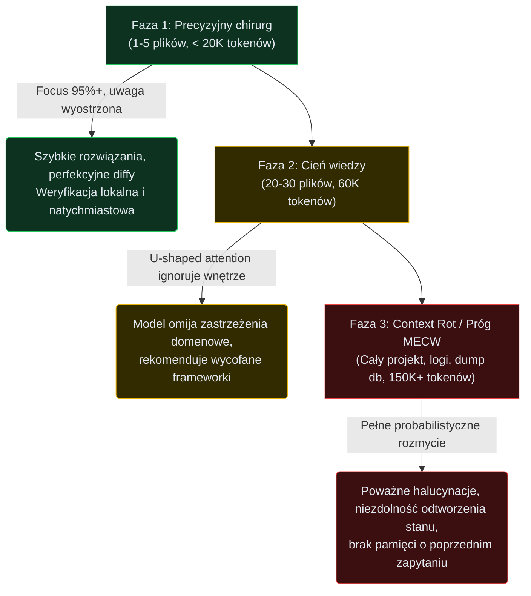

# LLMy i ich wpływ na codzienną pracę programisty

Początki pracy z Agentami zawsze wyglądają tak samo - wklejasz potężny zrzut logów z błędem z produkcji i prosisz o naprawę pisząc prompta "zajmij się tym".

Po kilkunastu sekundach, pewny siebie, otrzymujesz świetnie sformatowany diff, który po błyskawicznym wdrożeniu... wywala resztę aplikacji.

Frustracja w takich momentach najczęściej wynika z błędnego założenia o wszechpotężnym AI, które domyśli się naszych intencji, wybierze jeden właściwy sposób działania i dodatkowo, w razie problemów, opiszę swoją pracę krok po kroku.

Niestety - choć potencjał AI rośnie z miesiąca na miesiąc, to nadal nie jest magiczna różdżka.

Aby przestać walczyć z AI, musimy odczarować to narzędzie. Musimy spojrzeć na nie na chłodno, jak na bezlitosny system probabilistyczny o twardych, mierzalnych ograniczeniach, w którym zasób wejściowy ma swoją ścisłą cenę i w którym halucynacja to nie wypadek przy pracy, ale rdzeń całego procesu.

## Przewidywanie tokenów w praktyce

Są dwa główne grzechy w codziennej integracji AI w cykl rozwoju oprogramowania - ignorowanie możliwości Agentów oraz przecenianie ich (jako uczestnik 10xDevs na pewno nie jesteś w pierwszej grupie, ale możesz być podatny na tę drugą skrajność - to równie niebezpieczne).

Zamiast AI-voo-doo, chcemy na te rozwiązania patrzeć okiem inżyniera. Czym one są, na jakiej architekturze bazują, co umożliwiają out-of-the-box, a gdzie nasza ingerencja jest nadal niezbędna.

Na start nie zaszkodzi kilka słów o fundamentach.

Kiedy **modele wiodące** (frontier models) takie jak GPT-5.4 czy Claude Opus 4.7 generują kod w twoim IDE, wykonują one ciągłą, masywną operację **next-token prediction** (przewidywania kolejnego tokena).

Baza wag sieci neuronowej (serca modelu) to gargantuiczna, złożona maszyna korelacyjna, która decyduje, jaki fragment tekstu i składni statystycznie najlepiej pasuje jako bezpośrednia kontynuacja wrzuconego przez ciebie promptu (wejścia). 

Model w swojej pierwotnej warstwie pre-treningu nie posiada wbudowanego mentalnego obrazu twojego oprogramowania, nie wie czym jest dobrze zrealizowana transakcyjność bazy danych i nie odczuwa dysonansu poznawczego, gdy generuje kod, który narusza reguły SOLID. Jego wyłącznym matematycznym zadaniem jest zminimalizowanie błędu predykcji na ogromnym korpusie, na którym był szkolony. 

Z praktycznego punktu widzenia oznacza to, że wszelkie obserwowane po drodze "niedokładności" są nieodłączną właściwością systemu opartego na rozkładzie prawdopodobieństwa.

Zespół OpenAI wprost podkreśla w swoich analizach z jesieni 2025: model jest tak skalibrowany, aby zawsze wyprodukować najbezpieczniejszy dalszy ciąg tekstu lub kodu, ale niekoniecznie w 100% dopasowany do twoich unikalnych preferencji.

Niestety, nawet płynny i wysoce poprawny składniowo język wypowiedzi AI nie dowodzi z automatu spójności kodu. Zmyślony fragment logiki może idealnie odwzorowywać konwencje nazewnicze, nowy endpoint może na pierwszy rzut oka wyglądać tak jak pozostałe, a nowy model danych może być "w sam raz", a na końcu i tak coś pójdzie nie tak.

Niestety, samo podobieństwo kodu do tego, co w projekcie już istnieje, a nawet zgodność wykorzystywanych technologii czy poprawność importów nie usuwa szansy na wpadki.

Czy można temu zapobiec? Tak, po części zdobywanym doświadczeniem i wyczuciem zachowania AI, a po części twardymi bramkami bezpieczeństwa i kontrolą kontekstu, czyli technikach, o których nauczysz sie w 10xDevs.

## Kontekst to nie śmietnik (anatomia Context Rot)

Mając świadomość potężnej korelacji, z jaką model układa kod z podanych elementów, programiści dochodzą do intuicyjnego wniosku: skoro wyjście modelu zawsze dopasowane jest do instrukcji wejściowych, wrzućmy do pamięci modelu (okna kontekstowego) maksymalnie dużo informacji - cały codebase, dokumentację, tickety, zmiany historyczne, post-mortem z produkcji - więcej, da radę!

Ładujemy więc do pojedynczego okna kilkaset plików źródłowych, pliki migracyjne bazy danych i 30 stron logów z nadzieją, że model "zrozumie cały pełny obraz". Niestety, mechanizm percepcji LLMa brutalnie penalizuje taką strategię.

Prawda o przetwarzaniu ogromnego wejścia jest inna: wkładanie zanieczyszczonego bagażu niszczy zdolności dedukcyjne sieci. 

Zjawisko to w lipcu 2025 roku precyzyjnie zmapowali Kelly Hong i Anton Troynikov z TryChroma, nazywając je **Context Rot** (degradacja kontekstu). Po przeanalizowaniu wydajności czołowych modeli odkryli oni barierę nazywaną **MECW** (Maximum Effective Context Window). Przekroczenie granicy MECW sprawia, że zdolność modelu do dokładnego wyłuskania ważnej "igły ze stogu siana" (ang. *NIAH*, needle-in-a-haystack) w trakcie pozyskiwania (retrieval) drastycznie się załamuje – w niektórych pomiarach niemal natychmiastowo o 50-70%. 

To, że nowoczesny model informuje o dostępnych 2 milionach tokenów okna nie oznacza absolutnie faktu, iż poprawnie i logicznie uwzględni wskazówki zakopane gdzieś na jego setnej stronie.

Degradacja kontekstu wynika ze sprzętowych optymalizacji takich jak zjawisko **U-shaped attention** (atencja w kształcie litery U) uwikłane w kompresję **KV cache** (key-value cache) – model posiada największe skupienie uwagi na samych początkach podanych wskazówek oraz na ostatnich linijkach czatu, systematycznie gubiąc i rozmywając najcięższą logikę umiejscowioną w środku ogromnego bloku wejścia.

Zobrazujmy zjawisko Context Rot, patrząc na mechanikę pozyskiwania właściwej wiedzy ze zbioru danych podawanego modelowi:



Ten wykres definiuje jedyną słuszną formę pracy – długość kontekstu to twoja najcenniejsza waluta budżetowa, wydawaj ją precyzyjnie z zegarmistrzowską dokładnością. Prawdziwa ergonomia pracy agentowej zmusza do podawania stricte tego i tylko tego pliku, na którym chcemy dokonać operacji w ciągu najbliższych kilku sekund. Im węższy stan załączysz agentowi, tym głębsza jakość zostanie dostarczona i tym niższe prawdopodobieństwo zmierzenia się z cichym, wdrożeniowym błędem po drugiej stronie korelacji okna Context Rot.

## Budżetowanie i koszt ukrytego myślenia

Zderzając mechanikę halucynacji z twardymi obostrzeniami MECW, na ratunek inżynierii wezwano całkowicie inną, cięższą architekturę wnioskowania zwaną **modelami rozumującymi** (reasoning models), takimi jak OpenAI o1/o3 oraz Anthropic z włączonym **extended thinking** (rozszerzonym myśleniem). Mechanizm takich modeli wymusił przesunięcie kolosalnych obciążeń obliczeniowych z ogólnego zaplecza przedtreningowego prosto pod ciężar zapytań użytkownika na żywo – jest to nowa szkoła zwana **inference-time compute** (obliczenia na etapie wnioskowania). 

Mechanizm rozumowania zakłada powstrzymanie instynktu do natychmiastowej statystycznej odpowiedzi. W to miejsce model konstruuje skomplikowany logarytm założeń budując **CoT** (chain-of-thought, łańcuch myśli). Posiada on możliwość samokorekty i cofnięcia się w obrębie zadania operując tysiącami **hidden tokens** (ukrytych tokenów), dokonując wewnętrznej walidacji czy jego propozycja modyfikacji architektury bazy jest w pełni bezpieczna zanim w ogóle przystąpi do generowania widocznego dla użytkownika słowa. Daje to kolosalną zdolność rozwiązywania zagadek programistycznych z poziomu staff-developera, zmuszając agenta do odtwarzania warunków ślepych zaułków, na których poległy klasyczne iteracje modeli.

Ta gigantyczna władza pociąga za sobą równie gigantyczny kompromis operacyjny i czysto finansowy: każdy z wirtualnych "oddechów myślenia" jest bezwzględnie wliczany do rachunku zużycia i taryfikowany w tokenach generacji jak realnie zwrócony znak.

Aby lepiej to pokazać w realnych warunkach, uruchom w swojej konsoli skrypt dla wymuszenia myślenia przez API do rozwiązania bardzo złożonego wielowątkowego wyścigu dostępu (ang. *race condition*):

```python
import anthropic

client = anthropic.Anthropic()

# Tworzymy zapytanie wysokiego poziomu niepewności
response = client.messages.create(
    model="claude-3-7-sonnet-20250219",
    max_tokens=20000,
    thinking={
        "type": "enabled",
        # Narzucasz surowy budżet: przydziel 12 tysięcy z 20 na ukryte tokeny walidacyjne 'myślenia'
        "budget_tokens": 12000 
    },
    messages=[
        {"role": "user", "content": "Odrestauruj spójność danych po awarii klastra bazy z ubiegłej nocy na podstawie pięciu załączonych stack-trace'ów..."}
    ]
)
# Wynik zapięcia 12K ukrytych tokenów może podnieść poprawność o kilkadziesiąt procent,
# jednak zapłacisz za rachunek inferencji potrójną stawkę bazową
```

Wykorzystanie i zrozumienie tak zaawansowanych możliwości musi odbywać się przez matrycę opłacalności. Modele "myślicieli" (reasoning) są znakomitymi planerami, twardymi detektywami do obłędnych regresji czy architektami przy decyzjach o wymianie frameworka – świetnie działają w warunkach zerowej informacji początkowej. Tymczasem do typowej redakcji klas, powielania schematu komponentu w React, doklejania stylów CSS czy mapowania generyków w TypeScript, klasyczne modele natychmiastowe zachowują prym rynkowy z racji taniości, szybkości oraz wystarczającej do weryfikacji powtarzalności. Inżynier, który powierza modele "workhorses" do ciężkiej analizy napotka w ścianę atencji Context Rot, a angażujący "thinkera" do refaktoryzacji formatowania pętli – drastycznie zutylizuje miesięczny rachunek cloud computing za niepotrzebne tokeny CoT.

## Co warto wiedzieć

- **Traktuj pojemność okna kontekstowego jako limitowany budżet w czystej gotówce, nie garaż na graty.** Dodawaj pliki do rozmowy z agentem pęsetą chirurgiczną, zawężając dyskusję tylko do logiki obsługiwanej w tym konkretnym ułamku minuty. Jeśli dostarczasz agentowi nieczytany od lat kod legacy, narażasz cały przebieg sesji na uderzenie gwałtownego fenomenu degradacji i drastyczne wdrożeniowe ryzyko pomyłki.
- **Ufaj intencji agenta wyłącznie do granic edytora kodu, asertywnie weryfikując architekturę po przeciwnej stronie.** Odpowiedzi probabilistyczne bez gwarancji logiki matematycznej oznaczają, że dostarczony przez sieć diff staje się udowodnioną regułą inżynierską dopiero po przelaniu przez zaporę asercji, rygorystyczne unit testy i audyt na gałęzi. Jeśli brakuje twardych weryfikowalnych dowodów na pomyślny wsad – załóż obecność halucynacji pod pokrywką optymalnie brzmiącej wymowy.
- **Dopasuj siłę i wagę silnika wnioskującego do poziomu głębi zadania.** Jeżeli wznosisz całkowicie nowy paradygmat operacyjny swojego serwisu lub redefiniujesz mapowania mikroserwisów o dużej niepewności – wymuś pełne rezerwy extended thinking dla głębokiej izolacji CoT. Kiedy jednak musisz ułożyć rutynowy szkielet nowej klasy domenowej – deleguj to w sekundę tanim workhorse'om bez płacenia haraczu za gigantycznie ukryte tokeny myślowe.

## Źródła

- Dlaczego modele sztucznej inteligencji bywają w błędzie i powody halucynacji (Why language models hallucinate) / OpenAI / 2025-09-05 — https://openai.com/index/why-language-models-hallucinate/
- Wnioskowanie i zasady operacyjne w oparciu o modele rozszerzone (Reasoning best practices) / OpenAI API Docs / 2026 — https://developers.openai.com/api/docs/guides/reasoning-best-practices
- Okno kontekstowe w modelach Claude (Context windows) / Anthropic Docs / 2026 — https://docs.anthropic.com/en/docs/build-with-claude/context-windows
- Zarządzanie ukrytym myśleniem (Building with extended thinking) / Anthropic Docs / 2025 — https://docs.anthropic.com/en/docs/build-with-claude/extended-thinking
- Degradacja wiedzy w długim oknie: badanie na modelach wiodących (Context Rot: How Increasing Input Tokens Impacts LLM Performance) / Kelly Hong, Anton Troynikov, Jeff Huber / 2025-07-14 — https://www.trychroma.com/research/context-rot
