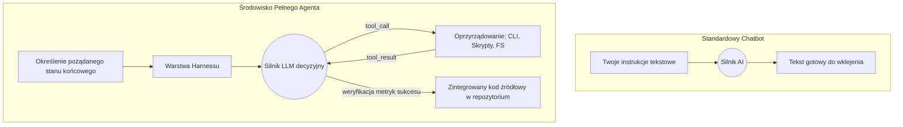

# Chatbot, agent, model i harness – o co tu chodzi?

Otwierasz edytor, żeby szybko poprawić błąd w parsowaniu. Wrzucasz hasło "napraw ten test" do webowego interfejsu (na przykład claude.ai) i dostajesz wygenerowany blok kodu z uprzejmą prośbą o samodzielne wklejenie go w odpowiednie miejsce. Następnie wrzucasz dokładnie to samo polecenie do terminalowego Claude Code wewnątrz twojego repozytorium (worktree). Narzędzie odczytuje strukturę katalogów, znajduje pliki testowe, odpala skrypt testowy, identyfikuje przyczynę błędu, poprawia logikę biznesową, uruchamia testy ponownie i samo proponuje commit na czystym drzewie. W obu scenariuszach pod spodem działa dokładnie ten sam model wiodący (Claude 3.5 Sonnet). Różnica w rezultatach wynika bezpośrednio z tego, w jakiej obudowie i środowisku ten model został osadzony.

Aby w 2026 roku skutecznie pracować z narzędziami takimi jak Cursor, Codex czy Claude Code, musimy przestać traktować słowo "agent" jako marketingowy synonim inteligentniejszego chatbota. Żeby wyciągnąć maksimum wartości z inżynierii wspomaganej przez AI, potrzebujesz rozróżnić trzy warstwy nowoczesnego ekosystemu: **model** (silnik predykcji tokenów), **agenta** (wyuczone autonomiczne zachowanie ukierunkowane na cel) oraz **harness** (infrastrukturę uruchomieniową dostarczającą narzędzia i ograniczenia).

## Agent to nie wielki model – to autonomiczna pętla

Najpopularniejszym błędem przy przejściu na zaawansowane środowiska programistyczne jest ciągła próba rozmowy z nimi jak z klasycznym interfejsem ChatGPT. Chatbot działa w jednorazowej, statycznej pętli: dostarcza odpowiedź tekstową na podstawie jednego wejściowego promptu (input → LLM (Large Language Model) → output). Odbierasz odpowiedź i cykl życia chatbota się kończy. Cały ciężar egzekucji poleceń, ewaluacji wyników i fizycznej integracji kodu z projektem spada z powrotem na ciebie.

Agent to aplikacja realizująca zachowanie sterowane przez LLM, która posiada własny mechanizm decyzyjny i własną sprawczość w twoim środowisku pracy. Jak piszą inżynierowie w tekście *Building effective agents* (Anthropic, 2024), największym nieporozumieniem jest definiowanie agentów poprzez modele, z którymi pracują, a nie poprzez środowiska, w których operują. W świecie inżynierii programowania agent rzadko odpowiada na twoje instrukcje tekstem do skopiowania – najczęściej zwraca wniosek o możliwość wywołania konkretnej funkcji narzędziowej (tool call). Działając w architekturze autonomicznej, realizuje iteracyjną pętlę OODA (Observe, Orient, Decide, Act).

Innymi słowy: silnik pod spodem wciąż przewiduje statystycznie następny token, ale system operacyjny agenta analizuje stan repozytorium, buduje plan, wybiera narzędzie (np. `read_file`), a po jego wykonaniu obserwuje rezultat. Zobacz, jak wygląda wygenerowana przez model deklaracja intencji użycia narzędzia – typowa struktura JSON (JavaScript Object Notation) zwracana poprzez Messages API (Application Programming Interface):

```json
{
  "role": "assistant",
  "content": [
    {
      "type": "text",
      "text": "Wygląda na to, że testy w auth.spec.ts nie przechodzą. Uruchamiam skrypt walidacyjny, żeby przeanalizować stack trace."
    },
    {
      "type": "tool_use",
      "id": "toolu_01A09q90qw90lq917835lq9",
      "name": "execute_bash",
      "input": { "command": "npm run test:unit src/auth.spec.ts" }
    }
  ]
}
```

Otrzymując taką paczkę, aplikacja agentowa automatycznie uruchamia wskazany ciąg poleceń w twoim terminalu CLI (Command Line Interface). Jeśli komenda zakończy się rzutem błędem w konsoli, narzędzie wstrzykuje ten wynik z powrotem do kontekstu. Agent orientuje się w nowej sytuacji, na bieżąco modyfikuje plan działania i podejmuje kolejną iterację z nowym kodem źródłowym.

Ten zapętlony proces stanowi fundament *inference-time compute* (obliczeń z wydłużonym czasem wnioskowania). Płacisz tutaj systemowi nie za pierwszą odpowiedź, lecz za czas zużyty na samodzielne testowanie rozwiązań metodą prób i błędów w bezpiecznym otoczeniu piaskownicy. Należy jednak zdawać sobie sprawę, że ta autonomia wiąże się ze znacznymi kosztami ekonomicznymi i wydajnościowymi. Zapytanie do klasycznego chatbota kosztuje kilkaset tokenów wejściowych. Aktywacja agenta do rozwiązania trudnego problemu – poprzez pętlę wielokrotnego wykonania komend, kompilowania kodu i analizowania zrzutów błędów – potrafi skonsumować ponad 200 tysięcy limitu w ułamku minuty.

## Harness: ukryta stacyjka rozrządowa modelu

Zdolność do autonomicznych modyfikacji plików nigdy nie zaistniałaby w próżni, bez kontrolnej obudowy chroniącej agenta przed zapętleniami i niszczycielskim chaosem. Tym brakującym, enigmatycznym pojęciem jest harness – kompletna warstwa uruchomieniowa, integracyjna oraz policyjna dla każdego asystenta programistycznego. Kiedy używasz bezpośrednich kluczy do API, korzystasz z samego modelu. Kiedy instalujesz narzędzie takie jak Claude Code w konsoli, dajesz silnikowi gotowy do pracy harness.

Typowy harness udostępnia agentowi trzy kluczowe mechanizmy:
- **Konkretne narzędzia (tools)** – bezpieczne interfejsy operacyjne, dzięki którym agent eksploruje codebase i wprowadza zmiany (manipulacja FS (File System), głębokie wyszukiwanie pełnotekstowe w repozytorium czy automatyczna ewaluacja AST (Abstract Syntax Tree)).
- **Uprawnienia i ramy powstrzymujące (guardrails)** – krytyczne bariery wytyczające granicę autonomii (np. restrykcja powstrzymująca operacje `rm -rf` lub odrzucenie pushowania zmodyfikowanych modułów bez twojej wiedzy na produkcję).
- **Ekonomia cyrkulacji kontekstu** – system dba o to, by wieluset tysięczne context window nie uległo zjawisku *context rot* (postępującej degradacji jakości predykcji pod wpływem nagromadzonego szumu, błędnych logów i nieudanych prób kompilacji). Zły harness gubi jakość w toku konwersacji, dobry potrafi ukrywać i czyścić (*compacting*) nieistotne wtrącenia.

Architektoniczną różnicę między klasycznym chatbotem a modelem działającym wewnątrz profesjonalnego harnessu dobrze widać na poniższym schemacie:



## Od algorytmu do celu: nowe wzorce współpracy

Gdy uświadomisz sobie, że pracujesz z niezależną pętlą zagnieżdżoną w terminalowym harnessie, absolutnie radykalnie przełamuje się stary model mentalny. Agent osadzony w CLI posiada dokładnie taki sam i równie potężny zestaw zintegrowanych narzędzi, z jakiego ty od lat korzystasz w systemie operacyjnym.

Ponieważ harness oddaje mu pełnię praw uruchomieniowych, odpada konieczność żmudnego mikrozarządzania algorytmem dojścia do sukcesu. Nie podajesz już agentowi poszczególnych komend do przepisania – narzucasz językiem naturalnym precyzyjny cel, który ten musi osiągnąć samodzielnie. Taka perspektywa uruchamia zupełnie nowe wzorce współpracy o potężnej wydajności:

- **Masowe operacje na plikach (bulk file ops):** Przesuwasz nużącą odpowiedzialność ze swoich barków, żądając: *"Przejrzyj w repozytorium wszystkie pliki `.svg` w folderze `/assets`, zoptymalizuj każdy używając SVGO, zamień ich nazwy systemowe na kebab-case, a na koniec wygeneruj mi plik `index.ts` sprawnie eksportujący je jako dostępne komponenty Reacta"*.
- **Integracje multimedialne i praca z natywnym oprogramowaniem:** Zamiast czytać manuale czy odpowiedzi na Stack Overflow dla nieintuicyjnych flag z CLI, polecasz systemowi wprost: *"Skompresuj ten wejściowy plik video.mp4 do wymuszonej wagi poniżej 5MB, używając poleceń ffmpeg, zachowaj czytelny tekst renderowany na ekranie"*. Agent poprzez wywołanie `execute_bash` wielokrotnie uruchomi natywny FFmpeg, przeanalizuje jego wynik, zmierzy jakość w kilobajtach, upewni się, że spełnił wymogi wagi wyjściowej i ponowi parametry kompresji aż do skutku.
- **Złożone optymalizacje infra i testów:** Rezygnujesz z powolnego klikania w narzędziach wersjonujących. Rozkazujesz: *"Zaktualizuj w package.json wszystkie dostępne zależności zaczynające się od prefiksu 'aws-'. Następnie odpal globalny linter kodu oraz testy jednostkowe. Dla wszystkich pakietów, których update odciął wsteczną kompatybilność, odwróć akcję do wersji początkowej"*.

Twój komunikat staje się w 100% deklaratywny (opisujesz docelowy stan pożądany), a całą brudną robotę imperatywną zostawiasz systemowi działającemu sprawnie z wiersza poleceń.

## Operator Agenta: nowa definicja programisty

Opanowanie nowej metody narzucania celu przy jednoczesnym zignorowaniu algorytmu ostatecznie wymusza redefinicję twojego zawodu. Zestawienie w spójną architekturę trzech filarów (predykcja w oparciu o model, domknięcie w pętli przez agenta, środowisko zdefiniowane przez harness) sprawia, że przestajesz być typowym użytkownikiem terminala, a przyjmujesz kluczową posadę, określaną dzisiaj jako **operator agenta**.

Zmianę tę trafnie podsumowano w raporcie *Unrolling the Codex agent loop* (OpenAI, 2026): *"Humans steer. Agents execute"*. Do zadań operatora należy odtąd projektowanie sprawnych środowisk lokalnych i zatwierdzanie koncepcji wyższego poziomu. Fizyczną modyfikację skryptów w odległych zakątkach systemów plików delegujesz ostatecznie maszynie operującej w zapętleniu.

Dla bezpieczeństwa środowiska IDE czy terminale udostępniają operatorowi specjalistyczny tryb kontrolny, czyli Plan Mode. Agent nie nadpisuje absolutnie niczego bez jasnej zapowiedzi i zawsze w odpowiedzi dostarcza manifest zamiarów: *"Zgodnie z poleceniem aktualizacji AWS, zmieniam 12 plików i odpalam yarn install. Zgadzasz się na ruch?"*. Skupiasz się na błyskawicznym architektonicznym code review, zanim narzędzie wykona pierwszy niszczący ruch w systemie. Kod na dysku staje się tylko udanym i zapisanym rezultatem solidnie skonfigurowanego środowiska.

## Co warto wiedzieć

Praktyczny zestaw zasad dla skutecznego operatora uciekającego od dawnych przyzwyczajeń prosto w nową erę inżynierii:

- **Przestań skupiać się na algorytmie, narzucaj tylko metryki sukcesu** — Zapomnij o samodzielnym układaniu potoków dla ffmpeg lub żmudnym iterowaniu po systemie plików XML (eXtensible Markup Language). Zleć pożądany stan końcowy w języku naturalnym i pozwól zapętlonemu narzędziu samodzielnie dojść do jego osiągnięcia za sprawą mechanizmu *inference-time compute*.
- **Precyzyjnie definiuj reguły bezpieczeństwa w harnessie lokalnym** — Właścicielem reguł integracyjnych (guardrails) jesteś ty. Konfiguruj własne zakazy i instrukcje dla agenta w powszechnie stosowanym pliku `.cursorrules` lub `CLAUDE.md`. Obostrzenie typu "Zawsze sprawdzaj typy używając `tsc --noEmit` przed jakimkolwiek commitem" z urzędu eliminuje większość regresji wynikających z pomyłek asystenta.
- **Wykorzystuj Plan Mode jako najważniejszą zaporę decyzyjną (steering)** — Zanim zgodzisz się w ciemno na modyfikację całego projektu i nieostrożne wywołanie basha, żądaj jawnego podglądu planu działania. Dzięki temu za promil tokenów skorygujesz błędny wektor rozwiązania przed wybuchem błędów testowych i powstaniem dramatycznego szumu informacyjnego.
- **Pamiętaj, że agent operuje na tym samym terminalu, co operator** — Aby móc prosić agenta językiem naturalnym o zaawansowane pętle z wykorzystaniem oprogramowania zewnętrznego, najpierw faktycznie musisz dysponować odpowiednimi bibliotekami w swoim systemie. Skonfiguruj poprawnie własny proces `node`, instalacje języka Python i pakiety systemowe, gdyż to twój terminal stanowi jedyne okno na świat dla asystenta.

## Źródła

- Building effective agents / Anthropic / 2024 — https://www.anthropic.com/engineering/building-effective-agents
- Harness engineering: leveraging Codex in an agent-first world / Ryan Lopopolo / 2026 — https://openai.com/index/harness-engineering/
- Unrolling the Codex agent loop / Michael Bolin / 2026 — https://openai.com/index/unrolling-the-codex-agent-loop/
- Claude Code overview / Anthropic Docs / 2026 — https://code.claude.com/docs