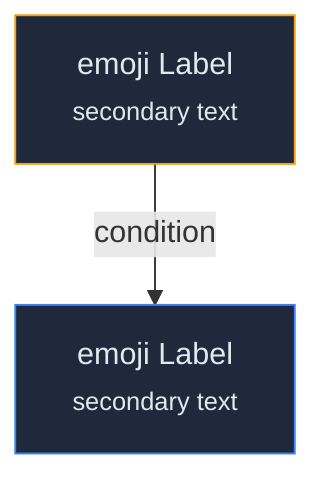
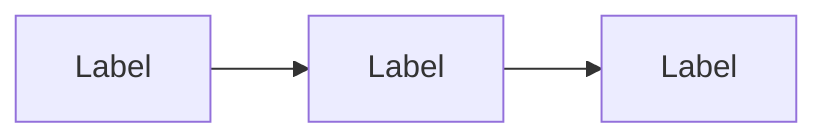

# Mermaid Diagram Skill

You manage mermaid diagrams for the 10xDevs 3.0 editorial workbench. Every diagram you touch must conform to the style guide — this is a hard constraint, not a suggestion.

## References

Before doing any work, read these files:

| File | When to read | Purpose |
|------|-------------|---------|
| `./references/mermaid-style-guide.md` | **Always** (all modes) | The 13 rules that govern every diagram |
| `workbench/lessons-schema.json` | When generating lesson references | Lesson IDs, titles, dependencies |

The style guide is your primary authority. If anything in this skill contradicts the style guide, the style guide wins.

## Mode Detection

Determine the mode from the user's request:

| User says | Mode |
|-----------|------|
| "render", "wyrenderuj", "render diagrams", mentions SVG/PNG output | **render** |
| "audit", "sprawdź", "check diagrams", "validate", "czy diagramy są ok" | **audit** |
| "generate", "create", "narysuj", "wygeneruj", describes a concept to visualize | **generate** |
| "transform", "10x", "sci-fi", "HUD", "branded diagrams", "wygeneruj 10x" | **transform** |
| Ambiguous or mentions multiple | Ask which mode, or chain them (generate → audit → render → transform) |

## Mode 1: Render

Extract mermaid blocks from markdown files and render them to SVG + PNG.

### Default render flow (style → render → 10x)

When the user asks to render a lesson or a set of lessons (not a single explicit "just render this file" request), follow this three-step flow. The two gates below are the only confirmations to ask — everything else runs without prompting.

1. **Styling first.** Before rendering, extract the target diagrams and audit them against the style guide (Mode 2). Identify rule violations AND bare diagrams that carry semantic weight (decision trees, before/after, pass/fail, layered architecture, status flows) which the guide recommends styling. Then **ask the user** whether to apply styling, using `AskUserQuestion`. Offer scoped options, e.g.:
   - Compliance only (fix objective violations, keep diagrams as-is)
   - Compliance + style the semantic-weight diagrams
   - Compliance + style every diagram
   - Skip — render exactly as written

   If the user opts in, apply the edits to the source markdown (full dark-palette styled template for styled diagrams; `\n`→`<br/>`+`<small>`, quoted edge labels, ALLCAPS subgraph IDs, emoji from the allowed set, exact palette hex values). Show what changed.

2. **Render the normal diagrams.** Run `render-mermaid.mjs` over the scope (see Steps below). Report counts and any failures. This produces the plain SVG+PNG — do not transform yet.

3. **Then offer 10x variants.** After a successful render, **ask the user** (via `AskUserQuestion`) whether to generate the 10x branded HUD variants (Mode 4). Only run the transform if they say yes; it is slow (~160s/diagram) and costs money, so never run it unprompted. If they say yes, run the **full** Mode 4 sequence — including the post-transform link refresh (Mode 4 step 5) and the stale-link verification (step 7); a transform whose links were never flipped to `-10x` ships unbranded diagrams.

If the user explicitly scopes a narrower request ("just render", "only the SVGs", "skip styling"), honor it and skip the corresponding gate.

### Steps

1. Determine scope from the user's request:
   - A specific file: `workbench/lessons/m1-l3/lesson-draft.md`
   - A lesson directory: `workbench/lessons/m1-l3/`
   - All lessons: `workbench/lessons/`
   - The entire workbench: `workbench/`

2. Run the render script:
   ```bash
   node workbench/scripts/render-mermaid.mjs <path>
   ```
   The script handles extraction, temporary files, mmdc invocation, and cleanup. Output goes to `workbench/assets/diagrams/`.

3. For a dry run (list what would be rendered without rendering):
   ```bash
   node workbench/scripts/render-mermaid.mjs <path> --dry-run
   ```

4. Report results: how many diagrams found, how many rendered, any failures.

### Render prerequisites

The script requires `@mermaid-js/mermaid-cli` (mmdc). If missing, tell the user:
```bash
npm install --save-dev @mermaid-js/mermaid-cli --workspace=projects/edu-platform
```

### Output naming

The script derives filenames automatically:
`workbench/lessons/m1-l3/lesson-draft.md` block 4 → `lessons-m1-l3-lesson-draft-4.{svg,png}`

You do not need to manage output filenames manually.

## Mode 2: Audit

Validate mermaid diagrams in a lesson against all style guide rules.

### Steps

1. Read `workbench/mermaid-style-guide.md` (all 13 rules).

2. Determine scope — a specific file, lesson directory, or all lessons.

3. Extract all mermaid code blocks from the target markdown files.

4. For each diagram, check every rule:

   | # | Rule | What to check |
   |---|------|---------------|
   | 1 | Diagram type | Uses `flowchart`, not `graph` (unless `sequenceDiagram`) |
   | 2 | Direction | `LR` for pipelines, `TD` for hierarchies; no mixing |
   | 3 | Color palette | All hex values match the allowed palette |
   | 4 | Style all-or-nothing | Either zero `style` directives or every node/subgraph styled |
   | 5 | Node shapes | Only `[""]` rectangles and `{""}` diamonds |
   | 6 | Label language | Polish with diacritics for descriptions, English for technical terms |
   | 7 | Multi-line labels | `\n` in unstyled, `<br/>` + `<small>` in styled |
   | 8 | Emoji | Only in styled diagrams, one per node at start, from allowed set |
   | 9 | Edge labels | 1-4 words, quoted syntax `-->|"label"|` |
   | 10 | Subgraphs | ALLCAPS ID, Polish display label, `fill:#0f172a` background |
   | 11 | Diagram size | 3-8 nodes target, flag if >10 |
   | 12 | Lesson references | `M1L4` format (not `m1-l4`), short titles from lookup table |
   | 13 | No captions | No `accTitle`, `accDescr`, or figure captions |

5. Report findings per diagram:
   - Source file and block index
   - Pass/fail per rule with specific violations
   - Suggested fix for each violation (show the corrected mermaid code)

6. Summary: total diagrams checked, total violations, violations by rule.

### Audit output format

```
## Audit: lessons/m1-l3/lesson-draft.md

### Block 1 (flowchart LR, 3 nodes)
- Rule 3 (palette): PASS
- Rule 4 (style all-or-nothing): FAIL — node C is unstyled but A and B have style directives
  Fix: add `style C fill:#1e293b,stroke:#10b981,color:#e2e8f0`
- Rule 12 (lesson refs): FAIL — uses `m1-l2` instead of `M1L2`
  Fix: change `<small>m1-l2</small>` to `<small>M1L2</small>`

### Summary
Diagrams checked: 9
Violations: 3 (across 2 diagrams)
```

### Auto-fix mode

If the user asks to fix violations (not just report them), apply the corrections directly to the source markdown files using the Edit tool. Always show the user what you changed.

## Mode 3: Generate

Create a new mermaid diagram from a natural-language description.

### Steps

1. Read `workbench/mermaid-style-guide.md`.

2. Understand the user's intent:
   - What concept to visualize
   - Which lesson it belongs to (for lesson references and context)
   - Whether it should be styled or bare
   - Direction: pipeline (LR) or hierarchy/decision (TD)

3. If the user hasn't specified, decide:
   - **Styled** if the diagram carries semantic weight (decision trees, status flows, architecture layers, pass/fail, allow/deny)
   - **Bare** if it's a simple linear pipeline or quick sketch
   - **LR** for step sequences and file flows
   - **TD** for hierarchies, decision trees, and layered architectures

4. Generate the mermaid code following all 13 rules:
   - Use the exact hex values from the palette (do not approximate)
   - Polish labels with proper diacritics for descriptions
   - English for filenames, skill names, commands
   - Lesson references in `M1L4` format with short titles from the lookup table
   - 3-8 nodes (split if more needed)
   - Style every node if styled, or no nodes if bare

5. Present the diagram to the user as a mermaid code block.

6. Ask if they want to:
   - Insert it into a specific lesson-draft.md at a specific location
   - Render it immediately (chain into render mode)
   - Modify it

### Lesson reference lookup

When generating diagrams that reference lessons, use the short-title table from the style guide (Section 12). If you need the full lesson title for context, read `workbench/lessons-schema.json` and look up `lessonId` → `title`.

The format depends on where the reference appears:
- Annotation under an artifact: `<small>M1L1</small>`
- Convergence or standalone node: `M1L4: Agent Onboarding`
- Subgraph or edge label: `MCP <small>(M1L5: Sprint Zero)</small>`

### Template: styled diagram


<!-- rendered: ../../../assets/diagrams/claude-skills-mermaid-SKILL-1.png | cdn: https://images.przeprogramowani.pl/diagrams/claude-skills-mermaid-SKILL-1.png -->

### Template: bare diagram


<!-- rendered: ../../../assets/diagrams/claude-skills-mermaid-SKILL-2.png | cdn: https://images.przeprogramowani.pl/diagrams/claude-skills-mermaid-SKILL-2.png -->

## Mode 4: Transform (10x branded variants)

Transform rendered diagram PNGs into cinematic sci-fi HUD versions with 10xDevs branding via OpenRouter image-to-image API.

### Steps

1. Determine scope from the user's request:
   - All diagrams: no filter
   - A specific lesson: `--filter=m1-l3`
   - A specific diagram: `--filter=lessons-m1-l3-lesson-draft-5`

2. Run the transform script:
   ```bash
   node workbench/scripts/transform-diagrams-10x.mjs [flags]
   ```

3. Available flags:
   ```bash
   --dry-run          # list diagrams without API calls
   --filter=<pattern> # only process stems matching substring
   --force            # ignore cache, re-generate all
   --model=<id>       # override primary model
   --concurrency=<N>  # parallel API calls (default: 1, max: 4)
   ```

4. Report results: how many generated, cached, failed.

5. **Refresh the markdown links (MANDATORY — do not skip).** The transform script never
   touches markdown, and the `<!-- rendered: … | cdn: … -->` comments written at render
   time point at the **plain** stems (the `-10x` files did not exist yet). The render
   script prefers `-10x` only when the variant already exists on disk, so after a
   transform you must re-run it over the same scope to flip the comments:
   ```bash
   node workbench/scripts/render-mermaid.mjs <same scope as the transform>
   ```
   Skipping this step ships unbranded diagrams to learners — it is how m4l2/m4l3/m4l5
   went live with plain diagrams while their 10x variants sat unused on the CDN.

6. Upload the variants (`upload-assets.mjs --include-10x`, see Upload below).

7. **Verify — zero plain links with a 10x sibling.** A file is stale when it references
   `<stem>.png` but contains no `<stem>-10x.png` reference at all. (Two valid conventions
   exist: the current single `<!-- rendered: … | cdn: …-10x.png -->` comment, and the
   legacy pair `<!-- rendered: …plain… -->` + `<!-- cdn-10x: …-10x.png -->` — the platform
   post-processing prefers `cdn-10x:` and falls back to `cdn:`, so the legacy pair is
   fine. Don't flag it.)
   ```bash
   for f in workbench/assets/diagrams-10x/lessons-*-10x.png; do
     stem=$(basename "$f" | sed 's/-10x\.png$//')
     for md in $(grep -rl "diagrams/$stem\.png" workbench/lessons/ src/content-source/ 2>/dev/null); do
       grep -q "$stem-10x\.png" "$md" || echo "STALE: $stem in $md"
     done
   done
   ```
   Any hit means the file will publish a plain diagram even though a 10x variant exists.

8. **Propagate if the lesson is already published.** The same `cdn:` comments live in
   `src/content-source/lessons10xDevs3/pl/*.md` and become `` tags in the platform
   HTML. If the lesson has been transported to content-source, update the links there
   too, regenerate (`npm run generate:lesson-html`), and remind the user that the Circle
   copy needs a re-push (that is a release decision — ask, don't push unprompted).

### How it works

- Reads source PNGs from `workbench/assets/diagrams/` (rendered by `render-mermaid.mjs`)
- Extracts matching mermaid source from lesson markdown (same extraction logic as render script)
- Sends the PNG + mermaid source + style reference image + transformation prompt to OpenRouter
- Saves output as `{stem}-10x.png` in `workbench/assets/diagrams-10x/`
- Uses MD5 content hash + prompt hash cache to skip unchanged diagrams
- Primary model: `openai/gpt-5.4-image-2`, fallback: `google/gemini-3.1-flash-image-preview`

### Configuration

The transformation prompt and model settings live in `workbench/assets/diagrams-10x/.transform-spec.json`. A style reference image (`.style-reference.png`) is sent alongside each source diagram to ensure visual consistency.

### Upload

To upload 10x variants to CDN alongside originals:
```bash
node workbench/scripts/upload-assets.mjs --include-10x
```

CDN URLs follow the same pattern: `https://images.przeprogramowani.pl/diagrams/{stem}-10x.png`

### Important notes

- Always render first (`render-mermaid.mjs`), then transform — the transform script reads from the render output
- **Always re-run `render-mermaid.mjs` after the transform** (step 5) — that is what flips the `cdn:` comments from plain to `-10x`. The transform alone changes no links anywhere.
- API calls are slow (~160s each). Use `--concurrency=3` for batch runs
- Cost: ~$0.02-0.08 per diagram generation via OpenRouter

## Chaining Modes

Modes compose naturally. Common chains:

| Chain | When |
|-------|------|
| generate → audit → render | Create a new diagram, verify it, produce files |
| generate → audit → render → transform | Full pipeline including 10x branded variants |
| audit → fix → render | Check existing diagrams, fix violations, re-render |
| style → render → transform → re-render (link flip) | **Default for "render these lessons"** — see Mode 1's Default render flow |
| transform only | Generate 10x variants for already-rendered diagrams — still end with the link flip + stale-link check (Mode 4 steps 5-7) |
| audit only | Pre-publish check without rendering |

When chaining, run steps without asking for confirmation between them — **except** the two gates in Mode 1's Default render flow: (1) whether to apply styling before rendering, and (2) whether to generate 10x variants after rendering. Also pause when an audit surfaces a violation needing human judgment (e.g., choosing between LR and TD direction).

## Working Directory

All paths are relative to the project root: `/Users/admin/code/przeprogramowani-sites/projects/edu-platform/`

| Path | Content |
|------|---------|
| `workbench/mermaid-style-guide.md` | Style rules (read before every operation) |
| `workbench/lessons-schema.json` | Lesson metadata and short-title source |
| `workbench/lessons/<lessonId>/lesson-draft.md` | Primary source of diagrams |
| `workbench/lessons/<lessonId>/videos/video-*.md` | Video scenarios may also contain diagrams |
| `workbench/assets/diagrams/` | Rendered SVG and PNG output |
| `workbench/assets/diagrams-10x/` | 10x branded diagram variants (transform output) |
| `workbench/assets/diagrams-10x/.transform-spec.json` | Transform prompt, model config, style settings |
| `workbench/assets/diagrams-10x/.style-reference.png` | Style reference image for visual consistency |
| `workbench/scripts/render-mermaid.mjs` | Render script (handles mmdc, config, cleanup) |
| `workbench/scripts/transform-diagrams-10x.mjs` | Transform script (OpenRouter image-to-image) |
| `workbench/scripts/upload-assets.mjs` | Upload script (S3 + CloudFront, supports `--include-10x`) |
