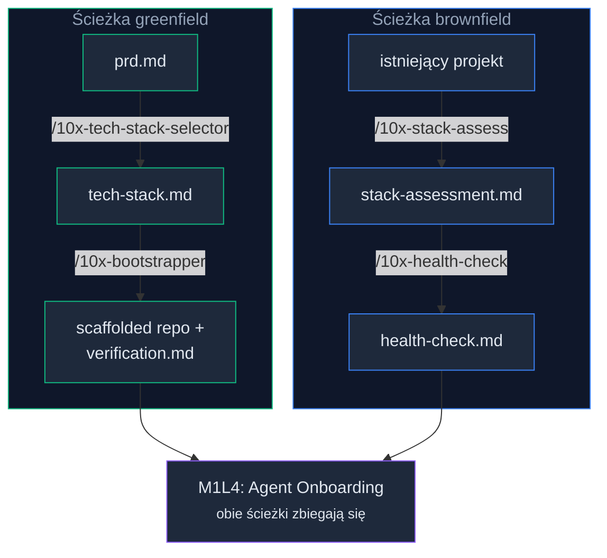

# Video Scenario: m1-l2 — /10x-stack-assess na brownfield

## Cel wideo

Pokazać kursantowi brownfield, że te same 4 bramki jakości (typed, convention-based, popular in training data, well-documented), których `/10x-tech-stack-selector` używa do *wyboru* stacku, tu służą jako *narzędzie diagnostyczne* istniejącego projektu. Widz ma zobaczyć: detekcję komponentów stacku, scoring per komponent, zidentyfikowane luki i plan kompensacji w postaci wpisów do `CLAUDE.md`/`AGENTS.md`. Wideo kończy się mostem do m1-l3: "Ten plik jest wejściem dla `/10x-health-check`."

## Założenia

- Kursant widział już `video-skill-vs-prompt` — zna anatomię SKILL.md i rozumie, co to kontrakt wejścia/wyjścia.
- Kursant może mieć istniejący projekt brownfield, ale wideo demonstruje na przygotowanym przykładzie z widocznymi lukami w quality gates.
- Wideo NIE tłumaczy od nowa, czym jest skill — odnosi się do poprzedniego wideo.
- Wideo NIE wchodzi w `/10x-health-check` (m1-l3) — tylko buduje bridge.
- Wideo NIE wchodzi w pisanie CLAUDE.md/AGENTS.md (m1-l4) — pokazuje, że plan kompensacji je sugeruje.
- Narzędzie główne: Claude Code.

## Materiały i setup nagrania

- Repo/projekt: przygotowany fixture brownfield z celowymi lukami w quality gates. Sugerowana konfiguracja:
  - Express.js bez TypeScripta (gate "typed" — fail).
  - Brak konwencji katalogowych — płaska struktura z handlerami w root (gate "convention-based" — fail).
  - Brak test runnera (brak `vitest`, `jest`, `mocha` w `devDependencies`).
  - Popularne narzędzia (Node.js, npm) — gate "popular in training data" — pass.
  - Dokumentacja minimalna — brak README z architekturą (gate "well-documented" — partial).
  - Alternatywa: użycie prawdziwego legacy projektu z realnymi lukami, jeśli prowadzący ma taki pod ręką.
- Narzędzie główne: Claude Code w terminalu + VS Code do przejrzenia wygenerowanego `stack-assessment.md`.
- Pliki startowe: brownfield repo z `package.json`, kilkoma handlerami, brakiem typów i testów.
- Pliki tworzone/edytowane: `context/foundation/stack-assessment.md` (tworzony przez skill).
- Stan fallback: przygotowany `stack-assessment.md` wygenerowany wcześniej na tym samym fixture. Jeśli agent nie wygeneruje pliku live, prowadzący podmienia na fallback.
- Ryzyka live demo:
  - `/10x-stack-assess` może ocenić stack łagodniej niż oczekiwano (np. "ready-with-compensation" zamiast "significant-friction") — prowadzący komentuje wynik "as is" i skupia się na lukach, nie na verdict.
  - Detekcja komponentów stacku może być niedokładna — prowadzący ma przygotowany fallback.
  - Czas uruchomienia jest niedeterministyczny — prowadzący przerywa po ~4 minutach.

## Segment 1 — Framing: nie każdy startuje z czystą kartą

**Format:** `live-demo`

**Cel:** Ustawić kontekst brownfield: kursant ma istniejący projekt, nie wybiera stacku — ocenia swój. Połączyć z poprzednim wideo: te same bramki, inne zastosowanie.

**Na ekranie:**

- VS Code z drzewem plików fixture brownfield — widoczna płaska struktura, pliki `.js` (nie `.ts`), brak katalogu `tests/`.
- Terminal gotowy do uruchomienia skilla.

**Przebieg:**

1. Prowadzący otwiera fixture brownfield w VS Code.
2. Pokazuje drzewo plików: "Mamy tu Express.js bez TypeScripta, płaską strukturę katalogów, brak testów. Typowy projekt, który działa, ale agent będzie miał z nim tarcia."
3. Mówi: "W poprzednim wideo widzieliście, jak `/10x-tech-stack-selector` używa czterech bramek jakości do *wyboru* stacku. Te same bramki można użyć jako *narzędzie diagnostyczne* — i do tego służy `/10x-stack-assess`."
4. Nie wchodzi w definicje bramek (są w tekście lekcji) — wymienia je jednym zdaniem: "Typed, convention-based, popular in training data, well-documented."

**Rezultat:** Widz wie, dlaczego uruchamiamy `/10x-stack-assess` i czego się spodziewać.

**Most do tekstu:** Odpowiada początkowi sekcji "Ocena istniejącego stacku" w drafcie: "Nie każdy startuje z czystą kartą."

## Segment 2 — Uruchomienie `/10x-stack-assess`

**Format:** `live-demo`

**Cel:** Pokazać pełny przebieg skilla: detekcja komponentów stacku, scoring, generowanie pliku.

**Na ekranie:**

- Claude Code w terminalu — w katalogu fixture brownfield.

**Przebieg:**

1. Prowadzący wpisuje: `/10x-stack-assess` (bez argumentów — skill sam wykrywa stack z cwd).
2. Komentuje to, co widzi na ekranie:
   - "Skill wykrywa komponenty stacku z `package.json`, struktury katalogów i plików konfiguracyjnych."
   - "Widzę detekcję: Node.js, Express, npm, brak TypeScripta, brak test runnera."
   - "Teraz scoring — każdy komponent przez cztery bramki."
3. Jeśli skill zadaje pytania (np. o docelowe zastosowanie projektu), prowadzący odpowiada krótko.
4. Gdy skill kończy pracę, prowadzący:
   - Pokazuje `ls context/foundation/` — `stack-assessment.md` jest na dysku.
   - Krótki komentarz: "Plik jest. Zobaczmy, co w środku."
5. Jeśli skill trwa za długo (> 4 minuty) — prowadzący przerywa i podmienia na fallback.

**Rezultat:** Na dysku jest `stack-assessment.md`. Widz widział proces detekcji i scoringu.

**Most do tekstu:** Odpowiada sekcji "Ocena istniejącego stacku" — opis procesu stack-assess.

## Segment 3 — Przegląd `stack-assessment.md`

**Format:** `conversation-review`

**Cel:** Otworzyć wygenerowany plik i przejść po kluczowych sekcjach: scoring per komponent, zidentyfikowane luki, plan kompensacji. Widz ma zobaczyć, że wynik jest actionable — nie "twój stack jest zły", tylko "tu są luki i oto co z nimi zrobić".

**Na ekranie:**

- VS Code z otwartym `stack-assessment.md`.

**Przebieg:**

1. Prowadzący otwiera `stack-assessment.md` w VS Code.
2. Przechodzi po kluczowych sekcjach:
   - **Wykryte komponenty** — lista z wersjami. Komentuje: "Skill wykrył Express 4.x, Node 20, npm, brak TypeScripta, brak test runnera."
   - **Scoring per komponent** — tabela albo lista z ocenami per bramka. Komentuje konkretne wyniki:
     - "Express.js — gate 'typed': fail. Brak systemu typów, agent będzie zgadywał kształty danych."
     - "Express.js — gate 'convention-based': fail. Express nie narzuca struktury katalogów — agent nie wie, gdzie szukać handlerów, middleware, modeli."
     - "Node.js — gate 'popular': pass. Agent ma dużo wiedzy o Node."
   - **Verdict** — np. `ready-with-compensation` lub `significant-friction`. Komentuje: "Verdict mówi, czy agent może pracować z tym stackiem — z kompensacją lub bez."
   - **Plan kompensacji** — konkretne wpisy do `CLAUDE.md`/`AGENTS.md`. Komentuje: "Tu są sugerowane wpisy: konwencje nazewnicze, struktura katalogów, wzorce middleware. Bez tych wpisów agent będzie generował kod, który działa, ale nie pasuje do reszty projektu."
3. Prowadzący NIE wchodzi w pisanie CLAUDE.md — mówi: "Jak te wpisy zamienić w działające instrukcje — to temat m1-l4."

**Rezultat:** Widz rozumie, że `stack-assessment.md` to diagnoza z planem naprawczym, nie wyrok. Wie, co każda bramka oznacza w praktyce.

**Most do tekstu:** Odpowiada paragrafom z draftu o scoring, werdyktach (ready / ready-with-compensation / significant-friction) i planie kompensacji.

## Segment 4 — Bridge do m1-l3: stack-assessment jako wejście dla health-check

**Format:** `presentation`

**Cel:** Zamknąć wideo mostem do następnej lekcji. Kursant brownfield wie, że jego `stack-assessment.md` jest wejściem dla `/10x-health-check` w m1-l3, tak jak `tech-stack.md` jest wejściem dla `/10x-bootstrapper` w ścieżce greenfield.

**Na ekranie:**

- VS Code z otwartym `stack-assessment.md`.
- Diagram podwójnej ścieżki (mermaid wyrenderowany do PNG lub slajd):

<!-- rendered: ../../../assets/diagrams-10x/lessons-m1-l2-videos-video-stack-assess-1-10x.png | cdn: https://images.przeprogramowani.pl/diagrams/lessons-m1-l2-videos-video-stack-assess-1-10x.png -->
<!-- cdn-10x: https://images.przeprogramowani.pl/diagrams/lessons-m1-l2-videos-video-stack-assess-1-10x.png -->

**Przebieg:**

1. Prowadzący pokazuje diagram lub rysuje na ekranie dwie ścieżki:
   - "Greenfield: `tech-stack.md` idzie do bootstrappera — następna lekcja."
   - "Brownfield: `stack-assessment.md` idzie do `/10x-health-check` — też następna lekcja."
   - "Obie ścieżki zbiegają się w m1-l4, gdzie konfigurujecie agenta pod wasz projekt."
2. Mówi: "Jeśli macie istniejący projekt — uruchomcie `/10x-stack-assess` jako zadanie domowe. Przejrzyjcie wynik. Które bramki wasz stack spełnia, gdzie są luki, co skill proponuje jako kompensację. Ten plik będziecie potrzebować w m1-l3."
3. Domyka: "Nie musicie zmieniać stacku. Musicie wiedzieć, gdzie agent będzie miał tarcia — i dać mu plan kompensacji."

**Rezultat:** Widz brownfield wie, co go czeka dalej. Widz greenfield wie, że brownfield ma równoległą ścieżkę.

**Most do tekstu:** Odpowiada sekcji "Zadanie" z draftu — podwójne CTA (greenfield + brownfield) i diagramowi podwójnej ścieżki.

## Pre-production TODO

### For `live-demo` segments (1, 2):

- [ ] Fixture brownfield repo przygotowany: Express.js bez TS, płaska struktura, brak testów, `package.json` z express + kilka handlerów.
- [ ] `npm install` wykonany — brak instalacji na ekranie.
- [ ] `/10x-stack-assess` skill zainstalowany i przetestowany w dry run na tym fixture — potwierdzić, że generuje `stack-assessment.md` z oczekiwanymi lukami.
- [ ] Fallback `stack-assessment.md` wygenerowany wcześniej i zapisany w osobnym katalogu.
- [ ] Folder `context/foundation/` istnieje w fixture (lub skill go tworzy — potwierdzić w dry run).
- [ ] Terminal font size >= 16pt, VS Code font size >= 14pt.
- [ ] Git clean state — łatwy reset: `git stash` lub `git checkout`.
- [ ] Klucze API ustawione.
- [ ] Timing: jeśli skill nie kończy się w ~4 minuty, przejście na fallback.

### For `conversation-review` segments (3):

- [ ] Wygenerowany (lub fallback) `stack-assessment.md` otwarty w VS Code — prowadzący wie, gdzie są kluczowe sekcje.
- [ ] Talking points przygotowane: wykryte komponenty, scoring per bramka (z konkretnymi przykładami fail/pass), verdict, plan kompensacji.
- [ ] Prowadzący wie, które bramki fixture-a failują — nie jest zaskoczony wynikiem.

### For `presentation` segments (4):

- [ ] Diagram podwójnej ścieżki (greenfield/brownfield) wyrenderowany z mermaid w tym scenariuszu do PNG (dark palette, `render:mermaid`).
- [ ] Kolejność: greenfield -> brownfield -> zbieżność w m1-l4.
- [ ] Tranzycja do CTA (zadanie domowe) zaplanowana.

### General:

- [ ] Cały scenariusz przetestowany w dry run.
- [ ] Zaplanowane okno edycji: 8-12 min raw -> 6-8 min edited.
- [ ] Prowadzący nie wchodzi w CLAUDE.md — jasny frame: "To temat m1-l4."

## Video/text mismatches

- Draft opisuje trzy możliwe werdykty (ready / ready-with-compensation / significant-friction) — wideo pokaże tylko jeden (ten, który skill wygeneruje na fixture). Brak konfliktu: prowadzący może wymienić pozostałe słownie.
- Draft cytuje przykład "Express.js bez TypeScripta" — fixture brownfield powinien być spójny z tym przykładem. Jeśli fixture używa innego stacku, prowadzący powinien dostosować komentarz.
- Draft nie pokazuje pełnego `stack-assessment.md` — wideo pokaże więcej szczegółów. Brak konfliktu, ale prowadzący nie powinien komentować sekcji, które są specyficzne dla implementacji skilla i mogą się zmienić.

## Claims introduced only in video

(none) — wszystkie twierdzenia są w drafcie. Wideo operacjonalizuje koncepcję "quality gates jako lens diagnostyczny" na konkretnym przykładzie.

## Needs human decision

- Jaki dokładnie fixture brownfield użyć? Opcje:
  - (A) Minimalistyczny Express.js (3-4 pliki, brak TS, brak testów) — szybki do przygotowania, czytelny na ekranie.
  - (B) Realny legacy projekt prowadzącego z prawdziwymi lukami — bardziej wiarygodny, ale trudniejszy do kontrolowania.
  - Rekomendacja: opcja A dla przewidywalności nagrania. Opcja B jako alternatywa jeśli prowadzący ma odpowiedni projekt.
- Czy diagram podwójnej ścieżki (segment 4) powinien być slajdem, plikiem markdown w edytorze, czy diagramem mermaid? Rekomendacja: mermaid renderowany w VS Code lub gotowy PNG — mniejszy koszt produkcji.
- Czy prowadzący powinien pokazać `references/agent-friendly-criteria.md` ze skilla `/10x-stack-assess`, żeby pokazać, że bramki są jawnie zdefiniowane? Rekomendacja: tak, ale krótko — jedno spojrzenie na plik, nie tour.
