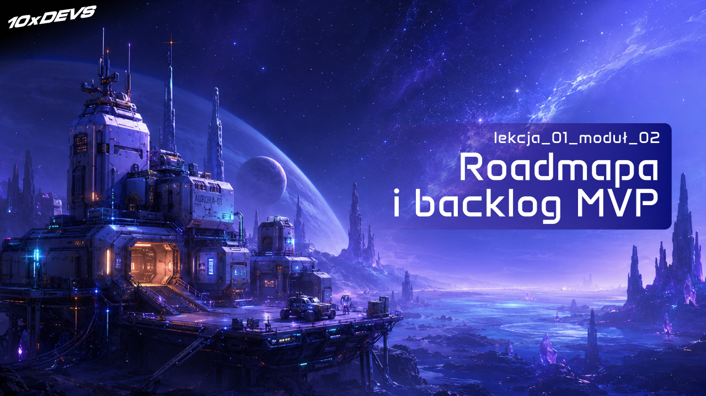
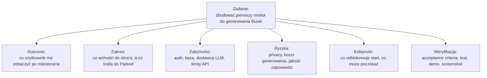
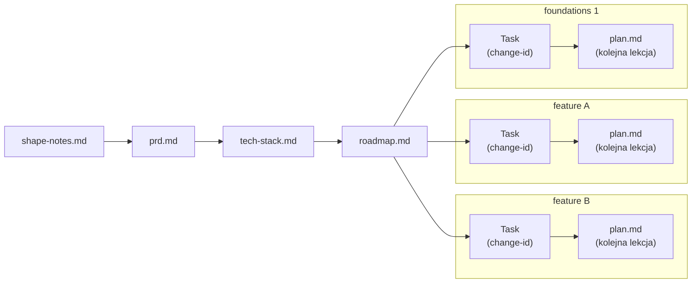
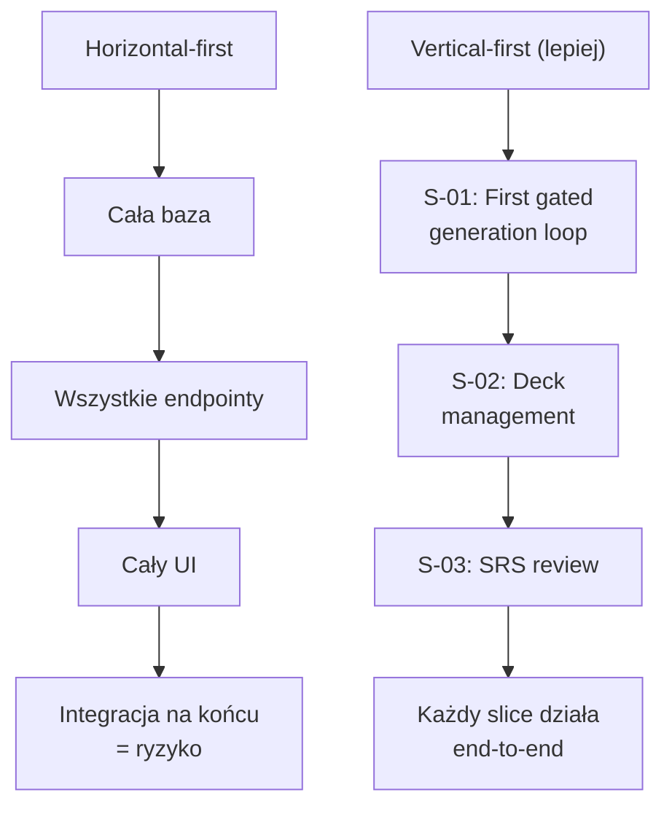
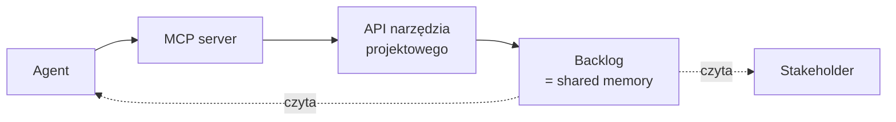

# Roadmapa MVP: milestony i backlog dla całego zespołu


<!-- cdn: https://images.przeprogramowani.pl/lessons/m2-l1/assets/cover.jpg -->

Sprint zero za nami - gratulacje! Pomysł przegryziony przez `/10x-shape` i `/10x-prd`, stack wybrany, repo przygotowane, reguły dla agenta na swoim miejscu, aplikacja na produkcji.

Naturalna pokusa? Skopiować `prd.md` do okna agenta i napisać "zbuduj mi z tego MVP". Tydzień na pracę po godzinach, prezentacja na piątek, lecimy.

A potem... no cóż. Agent zabiera się do pracy. Napędzany wybranym LLMem i wszystkimi cechami niedeterministycznych modeli, raz rozpocznie od endpointów, a innym razem od UI. Raz będzie pamiętał o dodaniu migracji do bazy, a raz o braku tabel dowiesz się w runtime. W niektórych przypadkach progress będzie postępował horyzontalnie (warstwa po warstwie), a w niektórych bardziej full-stackowo.

Efekt? Coś tam wyprodukowaliśmy, tokeny spalone, a powtarzalnych efektów brak.

To nie jest błąd agenta - to wręcz bezpośredni rezultat architektury silnika, który go napędza. Agent dostał za szeroki cel, bez oczekiwanych kierunków pracy, bez priorytetów i bez wskazania, gdzie jest największe ryzyko. **Agent pracuje tobą.**

W module 2 zmieniamy ten układ. W tej lekcji wchodzisz w buty Technical Project Managera: zamiast pytać "co teraz zakodować?", wspólnie z agentem planujesz sekwencję milestone'ów, dbasz o możliwą do wykonania kolejność zadań i przekładasz to na backlog, do którego dostęp ma zarówno człowiek, jak i agent.

Plan przed kodem.

### Programista jako Technical Project Manager

Zanim wrócimy do rozwijanego wcześniej projektu, na początku zauważmy jakiego rodzaju oczekiwania względem programisty może generować rozpędzająca się rewolucja AI.

W tradycyjnych organizacjach, jeszcze przed boomem na agentów, programiści zwykle realizowali zadania, które były częścią większego planu, ale na ten plan nie zawsze mieli wpływ. Firmowe programy, portfolia lub tzw. "streamy pracy" układali leaderzy techniczni, architekci i managerowie projektów. Dzisiaj wydaje się, że nabycie choćby cząstki umiejętności tych ról z naszego otoczenia to priorytet do skutecznej pracy z agentami i również konkretny sposób na osobisty upskill. Stąd, drugi moduł rozpoczynamy od krótkiego omówienia roli TPMa - Technical Project Managera.

Technical Project Manager to osoba, która łączy cel produktowy z technicznym wykonaniem. Decyduje, w jakiej kolejności idzie praca, gdzie czai się największe ryzyko, co blokuje start, kto ma czas na co i co świadomie wypada poza zakres. Wszystko po to, żeby na etapie właściwej realizacji "rzeczy się działy" jak najbardziej płynnie.

W tradycyjnym układzie zespołu to zadanie należało do kogoś innego. Programista dostawał ticket "zaimplementuj endpoint X", a potrzeba, priorytety i trade-offy były już rozstrzygnięte gdzieś wyżej.

Praca z agentem zmienia ten układ. Agent przyspiesza pisanie kodu, ale jednocześnie pozwala dużo szybciej wyprodukować pozorny postęp - jeżeli sekwencja pracy jest zła, dostajesz rosnącą aplikację, w której nie widać, czy najważniejszy scenariusz dla odbiorcy tego projektu w ogóle działa.


<!-- rendered: ../../assets/diagrams-10x/lessons-m2-l1-lesson-draft-1-10x.png | cdn: https://images.przeprogramowani.pl/diagrams/lessons-m2-l1-lesson-draft-1-10x.png -->

Tutaj mogą pomóc kompetencje TPMa, bo realnie wpływają one na efektywną obsługę agentów. I w żadnym wypadku nie chodzi nam o organizowanie spotkań czy statusów.

Od teraz zaczynamy więc zwracać większą uwagę na projekt jako system naczyń połączonych, a każde zadanie jako mały wycinek tego systemu. Chcemy poznać:

- **Cel** - co konkretnie chcemy mieć po pierwszym milestone'ie i dlaczego.
- **Sekwencja** - co idzie pierwsze, co drugie, co trafia na parking.
- **Ryzyko** - gdzie projekt może się wywalić i co najpierw redukuje to ryzyko.
- **Capacity i ownership** - kto (albo który agent) co robi, gdzie potrzebne są punkty synchronizacji, co da się robić równolegle.

Z tymi decyzjami delegowanie agentów staje się bardziej przewidywalnym kontraktem. Agent dostaje nie tylko prompt "co zrobić", ale też "to jest milestone numer jeden z listy pięciu i tu są jego zależności".

<div style="padding:56.25% 0 0 0;position:relative;"><iframe src="https://player.vimeo.com/video/1193145324?badge=0&amp;autopause=0&amp;player_id=0&amp;app_id=58479" frameborder="0" allow="autoplay; fullscreen; picture-in-picture; clipboard-write; encrypted-media; web-share" referrerpolicy="strict-origin-when-cross-origin" style="position:absolute;top:0;left:0;width:100%;height:100%;" title="M2 L1 Whiteboard"></iframe></div><script src="https://player.vimeo.com/api/player.js"></script>

### Łańcuch artefaktów

Będąc świadomym tego, jak ważne jest szersze spojrzenie na realizowane zadania, przejdźmy teraz do ćwiczenia z roadmappingu - utwórzmy schemat zadań, które wspólnie, krok po kroku zrealizujemy z agentem.

Punktem wyjścia będą znane ci artefakty. Zakończymy na roadmapie jako mapie kolejnych zadań do zrealizowania w tym tygodniu.


<!-- rendered: ../../assets/diagrams-10x/lessons-m2-l1-lesson-draft-2-10x.png | cdn: https://images.przeprogramowani.pl/diagrams/lessons-m2-l1-lesson-draft-2-10x.png -->

Co który plik opisuje:

- **`shape-notes.md`** - surowa sesja sokratejska. Decyzje, otwarte pytania, decyzje świadomie odłożone.
- **`prd.md`** - produktowy kontrakt. User stories, FR-y z priorytetami, success criteria, Non-Goals.
- **`tech-stack.md`** - techniczny hand-off. Wybrany framework, bazy, hosting, integracje, decyzje o auth i o docelowym środowisku deploymentu.
- **`roadmap.md`** - sekwencja zadań'ów. Przygotowania, slice'y e2e, zależności, blokery, niewiadome.
- **Task (change-id)** - operacyjna jednostka pracy. Status, owner, acceptance criteria, link do roadmapy.
- **`context/changes/<change-id>/plan.md`** - per-change implementation plan. Architektura jednego slice'a, kroki, pliki.

Każdy z tych artefaktów jest osobnym zoom-levelem na ten sam projekt. PRD opisuje co robimy i dla kogo. Tech-stack opisuje czym to robimy. Roadmapa opisuje w jakiej kolejności. Backlog opisuje co teraz. Plan opisuje jak konkretnie.

Pomieszanie tych poziomów jest jedną z głównych przyczyn, dla których w projektach pojawia się chaos. AI tylko ten chaos wzmacnia. Pomieszanie potrzeb biznesowych z technicznymi powoduje, że wszystko chcemy budować w ten sam sposób, ulubionym frameworkiem. Brak przeanalizowania potrzeb klienta powoduje, że tracimy kontakt z odbiorcą pracy. Zignorowanie ćwiczenia z roadmapy powoduje, że ryzyka wyjdą pięć minut przed wydaniem ważnej funkcjonalności. Agent - jeden lub kilku - tylko to wszystko skomplikuje. A przecież właśnie tego chcemy uniknąć.

W tej lekcji budujemy `roadmap.md` i coś w rodzaju wstępnego backlogu. Wszystko po to, aby uniknąć chaosu.

### Vertical-first jako domyślna strategia

Roadmapa, którą zaraz wygenerujemy, oparta jest o tzw. **vertical slices**. Każdy slice to jeden konkretny przepływ użytkownika, który przechodzi przez wszystkie warstwy aplikacji - UI, dane, logikę, integracje - i kończy się czymś, co użytkownik realnie widzi i może zweryfikować.

Alternatywą jest **horizontal slicing** - planowanie pracy warstwami. Najpierw cała baza, potem całe API, potem cały UI. Tak naturalnie myślą zespoły podzielone funkcyjnie (frontend, backend, data) i tak naturalnie układają się "fundamenty" w głowach programistów z większym doświadczeniem inżynierskim.

Z agentem AI domyślnie chcemy iść inaczej. Dlaczego?

- **Weryfikowalność.** Pionowy slice kończy się czymś, co da się kliknąć. Możesz odpalić test end-to-end, zrobić screenshot, sprawdzić manualnie, że "użytkownik wkleja tekst i widzi zapisane karty". Pozioma warstwa kończy się... istnieniem warstwy. Z perspektywy agenta to słaby sygnał, czy zrobił dobrą robotę.
- **Integracja.** Pionowy slice wymusza integrację warstw już przy pierwszym milestone'ie. Konflikty interfejsów ujawniają się od razu, a nie po dwóch tygodniach zszywania.
- **Pozorny postęp.** Horizontal slicing pięknie wygląda na ekranie - katalogi pełne plików, schematy bazy, dziesiątki endpointów. Tyle że żaden użytkownik nie zobaczył jeszcze tego, dla czego produkt powstaje.

Dla 10xCards (PRD z preworku [4.2]) zła i dobra dekompozycja wyglądają tak:


<!-- rendered: ../../assets/diagrams-10x/lessons-m2-l1-lesson-draft-3-10x.png | cdn: https://images.przeprogramowani.pl/diagrams/lessons-m2-l1-lesson-draft-3-10x.png -->

Podejście `vertical-first` zaczyna od `north star slice'a` - najmniejszego działającego przepływu, który udowadnia tezę produktu. W 10xCards może to być np. S-01 "First gated generation loop": wklejasz tekst, dostajesz wygenerowane karty, akceptujesz lub odrzucasz każdą z osobna, zaakceptowane lądują w decku. Produkt realnie zaczyna obsługiwać fiszki.

Jeśli ten przepływ działa, projekt ma sens. Jeśli nie - reszta planu jest gimnastyką wokół czegoś, co i tak nie zadziałało.

#### Co z fundamentami?

"Ale czekaj, najpierw przecież potrzebuję bazy i auth, żeby cokolwiek działało" - tak, masz rację. Dlatego w roadmapie istnieje też sekcja `## Foundations`.

Foundation (oznaczany `F-NN`) to krótka, kontrolowana praca wstępna, która nie ma własnego user-visible outcome, ale **odblokowuje konkretny vertical milestone**. Każde `F-NN` musi mieć wypełnione pole `Unlocks: S-NN` - inaczej jest po prostu warstwą bez celu i trafia na parking.

Przykłady uzasadnionych foundations:

- `F-01 minimal-persistence-and-auth` - minimalny model danych plus pojęcie sesji użytkownika, **odblokowuje S-01** (bez sesji nie pokażemy "moich" kart).
- `F-02 openrouter-privacy-spike` - krótki spike weryfikujący opcje kontroli prywatności u dostawcy LLM, **odblokowuje S-01** (bez tego nie wiemy, czy wrzucanie tekstu użytkownika do LLM mieści się w wymaganiach PRD).
- `F-03 srs-library-spike` - sprawdzenie kontraktu wybranej biblioteki SRS, **odblokowuje S-03 review session** (PRD świadomie zostawia szczegóły SRS na potem).

Przykład źle zakwalifikowanego foundation:

- "F-XX kompletny model danych dla wszystkich encji w aplikacji" - bez konkretnego downstream slice'a. To horizontal drift przebrany za fundament.

Zasada brzmi prosto - żaden fundament nie istnieje bez wskazania zadania docelowego. Jeśli nie potrafisz wskazać pojedynczego, konkretnego vertical milestone, który ten fundament odblokowuje, to ta praca nie ma jeszcze miejsca w roadmapie.

> **Krótka notka dla weteranów 10xDevs.** Wcześniejsze edycje częściej planowały pracę warstwami: najpierw fundamenty, potem klejenie. Miało to sens w trybie, w którym człowiek ręcznie zszywał warstwy. W 2026 r. agenci typu Claude Code i Codex znacznie lepiej radzą sobie z małymi, weryfikowalnymi zadaniami end-to-end ([Best practices for Claude Code](https://code.claude.com/docs/en/best-practices), [Introducing Codex](https://openai.com/index/introducing-codex/)). Dlatego w 10xDevs 3.0 świadomie przesuwamy się w stronę vertical-first - z dopuszczonymi, ograniczonymi enablerami w sekcji `## Foundations`.

### Skill /10x-roadmap w praktyce

Ok, teoria starczy. Czas wygenerować `roadmap.md`.

Zacznijmy tak samo jak poprzednio - od pobrania paczki skilli dla tej lekcji:

```bash
npx @przeprogramowani/10x-cli@latest get m2l1
```

W paczce dostajesz nowość - `/10x-roadmap` - to skill, który czyta `context/foundation/prd.md`, audytuje repozytorium pod kątem tego, co już zostało zbootstrapowane (frontend, backend/API, data, auth, deploy, observability) i sekwencjonuje pracę jako serię pionowych milestone'ów z fundamentami.

<div style="padding:56.25% 0 0 0;position:relative;"><iframe src="https://player.vimeo.com/video/1193146130?badge=0&amp;autopause=0&amp;player_id=0&amp;app_id=58479" frameborder="0" allow="autoplay; fullscreen; picture-in-picture; clipboard-write; encrypted-media; web-share" referrerpolicy="strict-origin-when-cross-origin" style="position:absolute;top:0;left:0;width:100%;height:100%;" title="M2 L1 Roadmap-skill"></iframe></div><script src="https://player.vimeo.com/api/player.js"></script>

Skill nie wybiera frameworków (od tego jest `tech-stack.md`), nie projektuje schematów bazy (od tego jest `/10x-plan`, którego wprowadzimy w kolejnej lekcji), nie pisze planu implementacji jednego slice'a (od tego jest `/10x-plan <change-id>`). Decyduje tylko, **co najpierw, w jakiej kolejności i co odblokowuje co**. Na tym etapie chcemy mieć wstępne wyobrażenie tego, jak zadanie po zadaniu rozłożyć pracę nad projektem.

Zacznijmy od inicjalizacji procesu:

```text
/10x-roadmap
```

Skill robi cztery rzeczy po kolei:

**1. Sprawdza, czy PRD jest gotowy do roadmapowania.** Zaczynamy od prostej oceny w skali 0-4: czy sekcja Vision jest wypełniona, czy są user stories z Given/When/Then, czy istnieje co najmniej jeden must-have FR, czy Business Logic ma sensowną treść (nie `# TODO: domain rule`). Wynik < 3 zatrzymuje proces na twojej decyzji: skill rekomenduje domknięcie PRD, ale pozwala świadomie kontynuować i wynieść braki jako blokujące niewiadome.

To świadome zabezpieczenie. Roadmapa wygenerowana z dziurawego PRD odziedziczy dziury jako "blocked slices" - i będzie głównie listą rzeczy, których jeszcze nie wiesz. Czasem taki wynik jest przydatny, ale nie udawajmy wtedy, że mamy gotowy plan egzekucji.

**2. Audytuje kod projektu.** Skill puszcza równoległych subagentów na sześć warstw - frontend, backend/API, data, auth, deploy, observability - i każdy zwraca jednoliniowy werdykt: present, partial albo absent, z odnośnikiem do pliku-dowodu. To zastępuje pytanie "co już masz w projekcie?" - sam kod jest najpewniejszym źródłem. Jeśli pracujesz w stacku innym niż `web`, ten fragment możesz dopasować do swoich potrzeb.

**3. Prowadzi minimalny wywiad.** Skill nie chce odgrywać pełnego interview produktowego. Zadaje tylko te pytania, których PRD i baseline same nie domknęły:

- **Cel sekwencjonowania** (`main_goal`) - czas / feedback z rynku / jakość / dostępność / nauka. Każda opcja prowadzi do innej kolejności, kiedy dwa slice'y są równoważne.
- **Kierunek przewodni** (`north_star`) - nadrzędny kierunek i najmniejszy działający przepływ, który udowadnia tezę produktu. Zwykle wskazuje na user story o najwyższym priorytecie.
- **Główne ryzyko** (`top_blocker`) - decyzje / czas / dostępność / czynniki zewnętrzne / wiedza / motywacje / brak. Wpływa na to, co skill agresywniej parkuje.

To jest celowy kompromis. Nie chcemy wracać do modelu, w którym cała praca planistyczna spada na programistę: czytasz PRD, ręcznie rozpisujesz zależności, sam szukasz braków w repozytorium i jeszcze pilnujesz, żeby backlog nie odpłynął w stronę pracy warstwami. Po to mamy agenta, żeby wykorzystać jego zdolność do szybkiego czytania artefaktów, porównywania opcji i proponowania sensownej sekwencji.

Ale nie chcemy też trybu "AI-autopilota", w którym agent po cichu decyduje, co jest najważniejszym przepływem produktu i jakie ryzyko należy zaatakować jako pierwsze. Te trzy pytania są punktem kontroli człowieka. Agent przychodzi z rekomendacją, uzasadnieniem i 1-2 alternatywami, a ty zatwierdzasz albo korygujesz decyzje, które realnie ustawiają roadmapę.

Każde pytanie ma jedną opcję polecaną, wraz z konkretnym uzasadnieniem ("Vision mówi 'launch before X' plus `timeline_budget: 1 week` -> recommend `speed`"), 1-2 alternatywy oraz opcję "coś innego - wyjaśnię". Wywiad nie jest dłuższy niż trzy pytania (z drobnym wyjątkiem dla projektów o nietypowym kształcie MVP).

**4. Generuje artefaktu `context/foundation/roadmap.md`.** Z PRD budujemy pionowe slice'y, z wstępnego rozpoznania projektu wyciągamy warstwy oznaczone jako `absent` albo `partial` (kandydatów na foundations), ustawiamy kolejność (foundations najpierw, north star tak wcześnie, jak pozwalają wymagania wstępne), domykamy `backlog handoff` i parkujemy to, co świadomie odrzucasz.

Skill skonstruowany jest tak, że roadmapy generowane między kolejnymi sesjami powinny mieć stałą strukturę. Jedyny wyjątek to `## Streams` - ta sekcja pojawia się tylko wtedy, gdy graf zależności zadań jest na tyle rozgałęziony, że dodatkowa mapa "większych strumieni" naprawdę pomaga.

```text
## Vision recap
## North star
## At a glance
## Streams (opcjonalnie)
## Baseline
## Foundations
## Slices
## Backlog Handoff
## Open Roadmap Questions
## Parked
## Done
```

Powyższa lista to punkt wyjścia, nie sztywny standard. Po kilku iteracjach zobaczysz pewnie, że twojemu projektowi przydałoby się dodatkowe pole w slice'ie, inna sekcja na początku albo bardziej zwięzłe statusy. Wystarczy, że otworzysz plik `SKILL.md` w paczce i dopasujesz format do siebie - skill to artefakt, który może ewoluować razem z twoim workflow.

Jeśli pracujesz w zespole, dochodzi jeszcze jeden wymiar - naturalny rytm pracy całej grupy. Roadmapa układana co tydzień, rozliczana per sprint albo per release wygląda inaczej. Warto, żeby agent generujący `roadmap.md` znał wasze konwencje: nazwy strumieni pracy, oznaczenia priorytetów, sposób grupowania prerekwizytów, częstotliwość przeglądów. Im bliżej waszego dotychczasowego procesu zostanie ułożony output, tym łatwiej resztę zespołu przekonać do realnej pracy z tą roadmapą zamiast z równoległymi źródłami prawdy.

#### Anatomia jednego slice'a

Każdy slice w `## Slices` ma ten sam zestaw pól. Wypełnione dla 10xCards S-01 wyglądają mniej więcej tak:

```markdown
### S-01: First gated generation loop

- **Outcome:** User can paste source text, request a card batch, accept/reject each
  candidate, and finalize accepted cards into the deck.
- **Change ID:** first-gated-generation
- **PRD refs:** US-01, FR-006, FR-007, FR-008, FR-009, FR-010, FR-011, FR-012
- **Prerequisites:** F-01 (minimal-persistence-and-auth), F-02 (openrouter-privacy-spike)
- **Parallel with:** —
- **Blockers:** —
- **Unknowns:**
  - Czy OpenRouter privacy mode pokrywa wymaganie z PRD? — Owner: ty. Block: yes.
- **Risk:** This slice is the product wedge — if it doesn't work,
  nothing downstream matters. Sequenced first because everything else is
  read/edit on top of cards this loop produces.
- **Status:** blocked
```

Status `blocked` zapala się automatycznie, kiedy choć jeden Unknown ma `Block: yes`. Dopóki nie rozstrzygniesz pytania o OpenRouter privacy, slice nie jest gotowy do implementacji. To dobra wiadomość - skill mówi ci wprost, czego nie wiesz, *zanim* wpadniesz w to w trakcie kodowania.

Pole **Outcome** zawsze zaczyna się od czasownika: "user can ...". To kontrola jakości - jeśli nie potrafisz napisać tego zdania, slice prawdopodobnie nie jest pionowy, a twoje skupienie pozostaje na niezależnych warstwach.

Pole **PRD refs** musi zawierać konkretne identyfikatory z PRD. Skill po wygenerowaniu robi `self-review` i upewnia się, że każda sekcja must-have z PRD znajduje się w co najmniej jednym slice'ie - bo inaczej jakiś wymóg "zginie w roadmapie".

Pole **Risk** to jedno zdanie odpowiadające na pytanie "dlaczego tę decyzję podejmujemy *tu* w sekwencji". Czytelnik za pół roku przejrzy roadmapę i zrozumie, czemu wybór był sensowny.

#### Czego skill świadomie nie robi

`/10x-roadmap` nie estymuje czasu pracy - w dobie Agentów AI to naprawdę utrudnione. Nie ma "Day 1", "Week 2", t-shirt sizes ani story pointów. To świadoma decyzja, przystająca do realiów pracy z wirtualnymi współpracownikami.

Dodatkowo, realizacja zadań z agentem jest nieliniowa - jeden slice może iść do przodu w godzinę albo w dwa wieczory, w zależności od tego, ile poprawek wymaga w pętli plan-implement-review. Zmyślone estymaty dawałyby fałszywe poczucie kontroli. Kolejność egzekucji wynika z `Prerequisites`, tempo z `Blockers` i `Unknowns`.

Skill nie wybiera też frameworków, nie tworzy schematów bazy, nie definiuje endpointów API. To wszystko jest zadaniem właściwego planowania i implementacji, czym zajmiemy się w kolejnych lekcjach.

### Roadmapa 10xCards: jeden konkret

Aktualna roadmapa 10xCards zaczyna się od dwóch zadań typu `foundations` i pięciu slice'ów funkcjonalnych. Patrząc na nią z lotu ptaka, prezentuje się to następująco:

| ID   | Change ID                       | Outcome                                      | Prereq | Status   |
| ---- | ------------------------------- | -------------------------------------------- | ------ | -------- |
| F-01 | gate-product-routes             | Produktowe ścieżki są chronione logowaniem   | —      | ready    |
| F-02 | first-prod-deploy               | Pierwszy deployment produkcyjny jest gotowy  | —      | ready    |
| S-01 | first-gated-generation          | Wklejony tekst tworzy zapisane drafty kart   | F-01   | proposed |
| S-02 | atomic-save-to-deck             | Kandydaci są oceniani i atomowo zapisani     | S-01   | proposed |
| S-03 | deck-edit-delete                | Deck pozwala przeglądać, edytować i usuwać   | S-02   | proposed |
| S-04 | srs-review-session              | Pierwsza powtórka zapisuje ocenę karty       | S-02   | blocked  |
| S-05 | account-deletion-with-retention | Usunięcie konta ma 30-dniową retencję        | F-01   | proposed |

Najważniejsza rzecz: north star nie jest tu samym wygenerowaniem kart. W tej roadmapie north star to S-04, czyli pierwsza ocena karty w sesji powtórki. Dopiero wtedy wiemy, że cały pomysł produktu zadziałał od początku do końca: użytkownik wkleił własny materiał, dostał propozycje od AI, zaakceptował wybrane karty, zapisał je do decka i użył ich w mechanizmie spaced repetition.

To dobrze pokazuje, że north star nie zawsze jest pierwszym slice'em w kolejce. S-01 i S-02 są konieczne, bo bez nich nie ma kart do powtarzania. S-04 jest jednak milestone'em walidacyjnym - pierwszym momentem, w którym teza produktu naprawdę się domyka. Dlatego roadmapa przesuwa go tak wcześnie, jak pozwalają zależności, ale nie udaje, że da się zacząć od review, jeśli nie istnieje jeszcze zapisany deck.

F-01 jest małym fundamentem, a nie osobnym "projektem auth". Szkielet logowania już istnieje w baseline, więc foundation ogranicza się do objęcia produktowych ścieżek ochroną i dopracowania landing page'a. F-02 idzie równolegle: produkcyjny deployment nie buduje funkcji widocznej dla użytkownika, ale pozwala sprawdzić prywatność i responsywność w realnych warunkach.

Blokada na S-04 też jest konkretna. Roadmapa nie mówi "zbudujmy kiedyś SRS". Mówi: zanim zaplanujesz sesję powtórki, wybierz bibliotekę SRS, bo ona narzuci strukturę `ReviewState`, skalę ocen i politykę "co dzieje się po edycji karty". To jest dokładnie typ niewiadomej, który powinien wypłynąć na roadmapie, a nie dopiero w środku implementacji.

Roadmapa nie ma osobnego pola `Acceptance criteria`, ale daje materiał, z którego wyciągniesz je przy tworzeniu backlog itemu: `Outcome`, `PRD refs`, `Risk`, `Unknowns` i status. Dla S-02 takie kryteria można zapisać tak:

- Każdy kandydat wymaga jawnej akceptacji albo odrzucenia.
- `Save` działa atomowo: wszystkie zaakceptowane drafty trafiają do decka albo nie trafia żaden.
- Drafty `pending` i `rejected` nie wpadają do decka.
- Po zapisie użytkownik widzi podstawową listę zapisanych kart.
- Logika stanu `FlashcardDraft` jest testowana, bo to tutaj domyka się biznesowa reguła: karta zaczyna jako propozycja AI, ale trafia do decka dopiero po decyzji człowieka.

To są zdania, które warto wpisać do backlog itemu jako acceptance criteria i podać dalej jako kontekst dla agenta w `/10x-plan atomic-save-to-deck`.

> **Mała uwaga.** `main_goal` w tej roadmapie to `speed`, a `top_blocker` to `time`. Dlatego obserwowalność, preview environment per PR, własny algorytm SRS, import PDF/DOCX i ręczne tworzenie kart trafiają do `Parked`. Roadmapa nie jest pełną listą marzeń - jest decyzją, co dowozimy najpierw, żeby jak najszybciej sprawdzić produktowy zakład.

### Backlog jako pamięć projektu

Roadmapa pomaga ci podjąć decyzję, co budować i w jakiej kolejności, ale pamiętaj - projekt nie żyje tylko w twojej głowie i w jednym pliku markdown. Właśnie dlatego, dla dopełnienia tej lekcji chcemy zadbać o pełną transparencję, a przy okazji poznać kolejne istotne rozszerzenia współpracy z agentem.

Do tej pory nasza roadmapa, jako backlog zadań, odpowiadała na proste pytania: co teraz robimy, kto to prowadzi, co jest zablokowane, co czeka na review, co można wziąć jako następne. Bez tego status projektu rozlewa się po Slacku, DM-ach, komentarzach w PR-ach i pamięci kilku osób. Idziesz na urlop, chorujesz, bierzesz wolne - jest zator. Niby wszystko wiadomo, dopóki jedna osoba nie zniknie na dwa dni.

Teraz chcemy jeszcze zadbać o komunikację na zewnątrz. Szef, klient, PM albo stakeholder może wejść w Jirę, Linear, GitHub Projects czy publiczną tablicę roadmapy i zobaczyć projekt z lotu ptaka. Co jest w toku. Co jest zablokowane. Co czeka na dodatkowe zasoby. Co wypadło poza zakres pracy. Nie musi cię pingować co trzy godziny z pytaniem "i jak tam?".

Ta proaktywna komunikacja "na zewnątrz" to naprawdę dobry lek na micromanagement. Nie dlatego, że narzędzie magicznie naprawia kulturę pracy. Po prostu widoczny stan projektu zmniejsza potrzebę ciągłego dopytywania. Jeśli backlog jest aktualny, rozmowa może dotyczyć decyzji i ryzyk, a nie ręcznego odpytywania o status.

`roadmap.md` realizuje tylko połowę tych założeń - działa na poziomie projektu, ale nie zapewnia przejrzystości dla osób spoza teamu.

Stąd backlog zewnętrzny, w bardziej klasycznej formie z UI - Jira, Linear, GitHub Projects, plus jeden z dziesiątek innych narzędzi - jako **operacyjna pamięć projektu i niższy próg wejścia dla każdego w firmie**.

Backlog robi rzeczy, których plik markdown nie zrobi out-of-the-box:

- **Status** - backlog/ready/in-progress/blocked/in-review/done, widoczny od razu.
- **Ownership** - kto pilnuje issue, kto ma na nim aktualny kontekst.
- **Dependencies** - link między issues, automatyczne odblokowywanie po zamknięciu prerekwizytu.
- **Acceptance criteria** - widoczne dla każdego, kto otwiera ticket, nie trzeba szukać w roadmapie.
- **Audit trail** - kto przesunął ticket, kiedy, dlaczego (komentarze).

Pytanie, które dopiero teraz zaczyna mieć sens: jak wpiąć w to agenta?

### MCP i CLI: agent dostaje dostęp do systemu zadań

Poprzedni moduł zakończyliśmy uzyskując dostęp do infrastruktury z terminala - z CLI takim jak `wrangler`. Tutaj dokładamy kolejny wariant dostępu agenta do zewnętrznego systemu: tym razem dotyczącego issue trackerów.

Dzięki temu agent może dostać kontrolowany, narzędziowy dostęp do backlogu: czytać issues, tworzyć nowe pozycje, aktualizować statusy albo dopisywać komentarze. Czyli robić to, co normalnie robisz przez UI - tylko przez jawnie opisane narzędzia. Wszystko w twoim imieniu - na jasną prośbę, jako side-effect hooka, innego skila albo w automatyzacji. W przypadku kiedy te zewnętrzne zasoby aktualizowane są przez reszte zespołu, agent z powodzeniem może ci przygotować np. poranny raport czekających na ciebie zadań, albo podsumować dzień listując wszystkie bieżące osiągnięcia.

W zależności od wsparcia serwisu, do wyboru będą CLI (np. Github) lub MCP (np. Linear).

Cały schemat pracy może się opierać na trzech rodzajach akcji i zapytań:

- **Read** - "pokaż mi otwarte zadania w projekcie 10xCards z labelem `ready`", "pokaż mi acceptance criteria dla TEN-14".
- **Create** - "stwórz issue 'First gated generation loop' z kryteriami akceptacji, zależnościami i labelem `north-star`".
- **Update** - "zmień status TEN-14 na `in-progress`", "dołóż komentarz z linkiem do PR-a".


<!-- rendered: ../../assets/diagrams-10x/lessons-m2-l1-lesson-draft-4-10x.png | cdn: https://images.przeprogramowani.pl/diagrams/lessons-m2-l1-lesson-draft-4-10x.png -->

W naszej lekcji zobaczymy jak łatwo wykorzystać potencjał wspominanego już Github CLI oraz premierowe MCP Lineara:

- **Linear MCP** - https://linear.app/docs/mcp - oficjalny serwer MCP usługi Linear, z uwierzytelnianiem OAuth, kompatybilny z każdym popularnym agentem (Claude Code, Cursor, Zed i inne).

Linear MCP działa jako zdalny serwer MCP pod adresem `https://mcp.linear.app/mcp`. Dzisiaj w łatwy sposób wepniesz go w swoje agentowe narzędzie w zależności od opcji:

#### Claude Code

```
claude mcp add --transport http linear-server https://mcp.linear.app/mcp
```

#### Codex

```
codex mcp add linear --url https://mcp.linear.app/mcp
```

#### Cursor

Oficjalny marketplace MCP zawiera connector Lineara - [Cursor Marketplace](https://cursor.com/marketplace).

---

Po podłączeniu i przejściu autoryzacji, agent ma do dyspozycji narzędzia systemu Linear. 

Pierwsza interakcja może polegać na bezpośrednim przetłumaczeniu roadmapy na system pracy właśnie w tym narzędziu - to przełoży się na labelki, zadania, projekty czy schematy zależności między zadaniami.

<div style="padding:56.25% 0 0 0;position:relative;"><iframe src="https://player.vimeo.com/video/1193148810?badge=0&amp;autopause=0&amp;player_id=0&amp;app_id=58479" frameborder="0" allow="autoplay; fullscreen; picture-in-picture; clipboard-write; encrypted-media; web-share" referrerpolicy="strict-origin-when-cross-origin" style="position:absolute;top:0;left:0;width:100%;height:100%;" title="M2 L1 Task-systems"></iframe></div><script src="https://player.vimeo.com/api/player.js"></script>

#### Dla ambitnych: agent jako opiekun backlogu

Jeśli ten kierunek pracy ci się spodoba, jest tu sporo miejsca do eksperymentów. Agent z dostępem do issue trackera to jeden z najbardziej przystępnych sposobów na wprowadzenie automatyzacji AI do workflow zespołu. Nie musi od pierwszego dnia ruszać kodu produkcyjnego, a i tak realnie podnosi jakość pracy.

Co konkretnie taki agent może robić w roli opiekuna backlogu? Kilka pomysłów z różnych poziomów ambicji:

- **Codzienne sprzątanie.** Identyfikacja ticketów, które nie ruszyły się od kilku tygodni, zamykanie duplikatów, oznaczanie zadań bez właściciela albo bez kryteriów akceptacji.
- **Aktualizacja kontekstu.** Dopisywanie do issues linków do PR-ów, łączenie zadań z pasującymi slice'ami z roadmapy, dodawanie komentarzy ze świeżymi decyzjami zespołu.
- **Triage przychodzących zgłoszeń.** Tagowanie nowych ticketów, proponowanie priorytetu na bazie definicji projektu, sugerowanie właściciela na podstawie historii pracy w danym obszarze.
- **Raporty na żądanie.** Poranne podsumowanie, co jest zablokowane, co czeka na review, co spadło z radaru, plus krótka rekomendacja "na czym najpierw się skupić".

Wartość tego podejścia? Nawet jeśli agent się pomyli, koszt naprawy jest niski. Zmienisz status, cofniesz komentarz, dopiszesz brakujące pole. Żadna pomyłka nie wywraca produkcji ani nie wprowadza buga do kodu. A jednocześnie korzyść narasta szybko, bo backlog, którym ktoś realnie się opiekuje, jest dużo użyteczniejszy niż lista nieaktualnych zadań, do której nikt nie zagląda.

To dobry punkt startowy do szerszej refleksji, gdzie jeszcze w twojej pracy AI może wnieść wartość bez bezpośredniego dotykania kodu produkcyjnego.

#### Granice dostępu agenta do backlogu

Tutaj wraca to samo pytanie, które warto zadawać przy każdym dostępie agenta do zewnętrznego systemu: **czy ten dostęp jest absolutnie konieczny, żeby agent zrobił to, co ma zrobić?**

Backlog jest na ogół bezpieczniejszy niż produkcja. Pomylenie statusu nie wywala bazy. Ale wciąż - rotowanie statusów, kasowanie issues, dodawanie komentarzy "od ciebie" do tysiąca ticketów - to są działania widoczne dla zespołu i pozostawiają ślad w logach.

Praktyczne zasady poza skalą MVP:

- **Token z ograniczonymi uprawnieniami.** Nie wystawiaj agentowi admin-tokenu, kiedy potrzebujesz tylko czytania i tworzenia issues w jednym projekcie.
- **Akcje "destrukcyjne" tylko z poziomu UI.** Kasowanie projektu, zmiana ról, masowa zmiana statusów - kliknięcie w panelu kosztuje 30 sekund, sprzątanie po automatycznej pomyłce kilka godzin.
- **Audit log.** Linear, Jira i alternatywy enterprise mają wbudowane logi aktywności. Sprawdź je raz po pierwszej sesji z agentem, żeby zobaczyć, co agent realnie zrobił.

W zespole dochodzi kolejna warstwa: czy agent może zmieniać statusy issues *innych* osób, czy tylko swoich? Czy może komentować w cudzych ticketach? To są decyzje, które warto ustalić w zespole zanim agent dostanie szeroki dostęp.

## 🧑🏻‍💻 Zadania praktyczne

- **Wygeneruj `roadmap.md` dla swojego projektu.** Pobierz paczkę `m2l1` i uruchom `/10x-roadmap` w repo z gotowym `context/foundation/prd.md`. Przejdź wywiad świadomie - sam zdecyduj o `main_goal`, `north_star` i `top_blocker` zamiast klikać domyślne rekomendacje. Cel: roadmapa z przynajmniej jednym slice'em w statusie `ready`, jasno wskazanym north star i bez osieroconych fundamentów. Jeśli wszystkie slice'y są `blocked`, potraktuj to jako sygnał, że PRD wymaga domknięcia lub doprecyzowania.
- **(Opcjonalne) Przenieś roadmapę do zewnętrznego backlogu przez agenta.** Zakładając darmowe konto w usłudze, wykorzystaj Linear MCP lub GitHub CLI do utworzenia namacalnej, publicznej roadmapy projektu. Poproś agenta o utworzenie issues z sekcji `## Slices` - tytuł z `Outcome`, opis zawierający `PRD refs`, `Prerequisites` i `Risk`, labelki `slice` / `foundation` / `north-star`. Cel: backlog widoczny dla osoby spoza zespołu programistycznego, z odwzorowanymi zależnościami między ticketami i bez ręcznego klepania w UI. Pochwal się efektem na 10xDevs Arena.

## Deep Dive

### Dlaczego rekomendacja zmieniła się od 10xDevs 2.0

Część z was może pamiętać, że we wcześniejszych edycjach 10xDevs praca z agentami była bardziej horyzontalna.

To miało sens przy ograniczonym potencjale i zdolnościach modeli, gdzie człowiek częściej ręcznie sklejał warstwy i "naprawiał po AI". Pisanie ręcznie schematu, potem ręcznie endpointów, potem ręcznie komponentów - to była naturalna sekwencja, bo każdy z tych kroków wymagał tej samej pary rąk.

W 2026 r. agenci typu Claude Code i Codex (a niedługo pewnie dziesiątki kolejnych) realnie zmieniają ten układ. Z dokumentacji Anthropic ([Best practices for Claude Code](https://code.claude.com/docs/en/best-practices)) i z opisu działania Codexa ([Introducing Codex](https://openai.com/index/introducing-codex/)) pochodzi jedna istotna zmiana workflow: **agent działa najlepiej, kiedy dostaje zawężony task z weryfikowalnym wynikiem**.

Vertical slice realizuje własnie to założenie. Pozioma warstwa "stwórz schemat bazy" nie ma weryfikowalnego wyniku poza "istnieje plik z migracjami" - to słaby sygnał, czy schemat jest dobry. Pionowy slice "użytkownik wkleja tekst i zapisuje pierwszą kartę" ma jasne kryteria sukcesu i da się je przetestować end-to-end (nawet manualnie, a w wersji docelowej - z testami).

Ci bardziej spostrzegawczy uznają zapewne, że mocno bazujemy na dekadach doświadczenia branży. Agile Alliance od lat opisuje, jak [dzielić user stories](https://agilealliance.org/glossary/story-splitting/) z zachowaniem mierzalnej wartości biznesowej. [Story mapping](https://agilealliance.org/glossary/story-mapping/) jeszcze mocniej kładzie nacisk na "walking skeleton" - minimalną, ale realnie działającą wersję produktu jako pierwszy milestone. Vertical-first w pracy z agentem to praktyczne zastosowanie tych zasad w nowym układzie ról: agent egzekwuje, ty sterujesz. I wdrażamy to w praktyce.

Co to znaczy dla ciebie? Jeśli kiedyś planowałeś projekty warstwami, twoja intuicja inżynierska nie jest zła. Zadania czysto techniczne i bardziej warstwowe nadal istnieją w sekcji `## Foundations` w roadmapie, tylko nie mogą już być osierocone - każdy fundament musi wskazywać konkretny user-visible slice, który odblokowuje.

### Co zrobić, jeśli twój projekt naprawdę potrzebuje horizontal-first

Są projekty, w których pierwszy ruch jest faktycznie poziomy. Trzy typowe sytuacje to np.:

- **Integracja z legacy.** Bez warstwy adaptacji do istniejącej bazy lub API nie da się zacząć pionowego slice'a. Wtedy F-01 to spike integracyjny z konkretnym `Unlocks: S-01`.
- **Wymóg compliance/security.** Wymaganie regulacyjne (np. GDPR plus szczegóły retencji) wymaga decyzji o modelu danych, zanim można cokolwiek pokazać użytkownikowi. Wtedy F-01 to praca nad modelem danych z `Unlocks` wskazującym slice, który mógłby naruszyć compliance.
- **Performance-critical core.** Niektóre projekty (real-time, embedded, systemy niskopoziomowe) wymagają wczesnej decyzji architektonicznej, której zła wersja zablokuje cały projekt. Wtedy F-01 to architektoniczny spike z `Unlocks` wskazującym pierwszy demonstracyjny przepływ.

W każdej z tych sytuacji praca pozioma jest **konkretna, ograniczona i przypięta do konkretnego pionowego slice'a**. Nigdy nie jest "najpierw cała baza, potem całe API". Skill `/10x-roadmap` odpowiada na to wzbogaceniem sekcji `## Foundations` i nadaniem statusu `blocked` slice'om, które są zablokowane przez te fundamenty.

Jeśli czytasz wygenerowany `roadmap.md` i widzisz, że masz pięć F-NN, a żaden pionowy slice nie ma statusu `ready`, to sygnał, że albo PRD jest zbyt obciążony technicznymi wymaganiami, albo `/10x-roadmap` źle zinterpretował baseline. Wszystkie mniej typowe scenariusze możesz skonsultować na platformie kursowej.

Powodzenia!

## Materiały Dodatkowe

- **Best practices for Claude Code** / Anthropic / https://code.claude.com/docs/en/best-practices - dlaczego zawężone, weryfikowalne zadania sprawdzają się w pracy z agentem lepiej niż szerokie polecenia.
- **Story Splitting** / Agile Alliance / https://agilealliance.org/glossary/story-splitting/ - klasyczne reguły dzielenia user stories z zachowaniem wartości biznesowej.
- **Story Mapping** / Agile Alliance / https://agilealliance.org/glossary/story-mapping/ - "walking skeleton" jako pierwszy milestone i koncepcyjne zaplecze dla vertical-first roadmapowania.
- **A Tale of Slicing and Imagination** / Agile Alliance experience report / https://agilealliance.org/resources/experience-reports/a-tale-of-slicing-and-imagination/ - praktyczny opis, dlaczego horizontal slicing wygląda kusząco w zespołach o silnych specjalizacjach i dlaczego z punktu widzenia produktu jest słabszą strategią.
- **What is a Project Roadmap** / Atlassian / https://www.atlassian.com/agile/project-management/create-project-roadmap - osadza roadmapę w klasycznym pojęciu project managementu (cele, milestones, dependencies); pomija estymaty czasowe, które `/10x-roadmap` świadomie odrzuca.
- **Project Manager Roles and Responsibilities** / Atlassian / https://www.atlassian.com/en/work-management/project-management/project-manager - obowiązki PM-a jako rola łącząca cel z egzekucją; tłumaczy, dlaczego "TPM" jest dobrym mentalnym modelem dla programisty z agentem.
- **Model Context Protocol - Server Concepts** / MCP / https://modelcontextprotocol.io/docs/learn/server-concepts - minimalny mental model: tools, resources, prompts, zgoda użytkownika.
- **Linear MCP Server** / Linear / https://linear.app/docs/mcp - dokumentacja oficjalnego remote MCP servera Linear (OAuth, kompatybilność z głównymi klientami).
