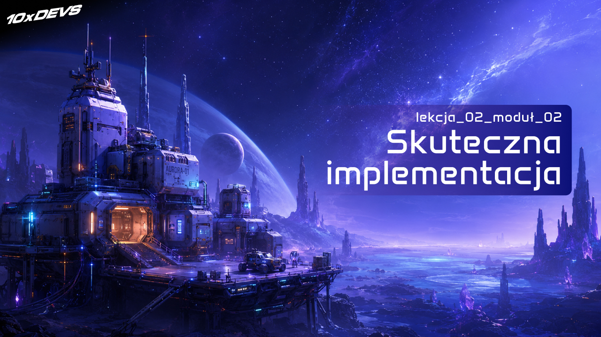
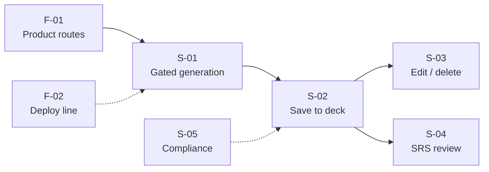
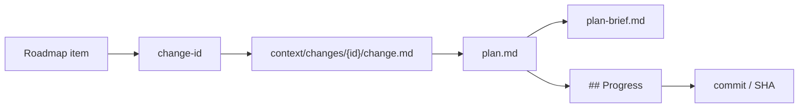
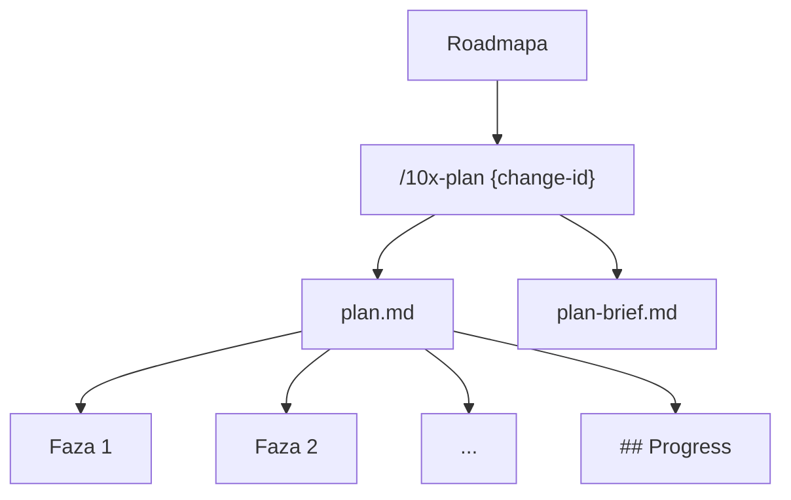
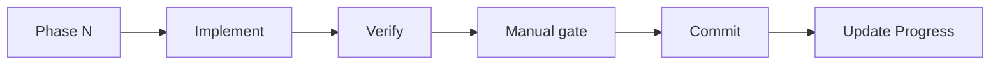

# Implementacja z Agentami: od roadmapy do pierwszego działającego streamu


<!-- cdn: https://images.przeprogramowani.pl/lessons/m2-l2/assets/cover.jpg -->

W poprzedniej lekcji zbudowaliśmy roadmapę MVP - mapę pracy dla człowieka i agenta. Pozwala zrozumieć, co jest fundamentem projektu, co jest pionowym slice'em funkcjonalnym, co jest zablokowane, co można robić równolegle i co świadomie trafia na parking.

To jest dobry moment, żeby popełnić bardzo ludzki błąd.

Masz roadmapę, widzisz kilka pozycji w sekcji `ready`, więc odpalasz agenta i piszesz: "zrób teraz cały Stream A". Agent rusza. Czyta pliki. Buduje sobie plan w głowie. Modyfikuje kilkanaście miejsc naraz.

Po chwili coś działa, coś wygląda na prawie gotowe, coś jest tylko obietnicą w komentarzu, a ty próbujesz zrekonstruować, co właściwie było celem tej sesji.

Czyli wracamy do starego problemu, tylko na wyższym poziomie. Zamiast prompta "zbuduj MVP", mamy prompt "zbuduj stream". Brzmi profesjonalniej, ale nadal jest za szerokie.

W tej lekcji robimy następny krok: bierzemy roadmapę i zamieniamy ją w pierwszy kontrolowany cykl pracy:

```
roadmap item -> change-id -> plan.md -> plan review -> implementacja fazy -> Progress
```

Najważniejsza teza jest prosta: **plan to mechanizm kontroli nad przyszłą pracą agenta**.

Nie chodzi o biurokrację ani o rytuał przed każdym zadaniem. Chodzi o to, żeby przed większą edycją kodu mieć miejsce, w którym agent zapisuje swoje założenia, fazy, modyfikacje kontraktu i warunki zakończenia pracy. Wtedy możesz powiedzieć: "tak, to ma sens" albo "nie, zatrzymajmy się tutaj".

Najpierw plan. Potem kod.

<div style="padding:56.25% 0 0 0;position:relative;"><iframe src="https://player.vimeo.com/video/1193150555?badge=0&amp;autopause=0&amp;player_id=0&amp;app_id=58479" frameborder="0" allow="autoplay; fullscreen; picture-in-picture; clipboard-write; encrypted-media; web-share" referrerpolicy="strict-origin-when-cross-origin" style="position:absolute;top:0;left:0;width:100%;height:100%;" title="M2 L2 Opening"></iframe></div><script src="https://player.vimeo.com/api/player.js"></script>

### Roadmapa jako mapa streamów

Najpierw pobierz paczkę artefaktów dla tej lekcji:

```bash
npx @przeprogramowani/10x-cli@latest get m2l2
```

Ta paczka dostarcza workflow potrzebny w tej lekcji: `/10x-new`, `/10x-plan`, `/10x-plan-review` i `/10x-implement`.

Punktem startowym jest `context/foundation/roadmap.md`, który utworzyliśmy w poprzedniej lekcji. Ten plik nie jest listą zakupów, którą odhaczasz od góry do dołu. To mapa zależności i strumieni pracy, nad którą warto się na chwilę pochylić.

Dla naszego przykładowego projektu 10xCards najważniejszy jest teraz Stream A, czyli ścieżka od minimalnych zarysów produktu do pierwszego działającego przepływu generowania i zapisywania fiszek.

W uproszczeniu wygląda to tak:


<!-- rendered: ../../assets/diagrams-10x/lessons-m2-l2-lesson-draft-1-10x.png | cdn: https://images.przeprogramowani.pl/diagrams/lessons-m2-l2-lesson-draft-1-10x.png -->

W tej lekcji interesuje nas główny tor generowania i zapisywania kart:

- `F-01` jako podstawa techniczna, która porządkuje dostęp do produktu.
- `S-01` jako pierwszy zabezpieczony cykl generowania kart.
- `S-02` jako zapis zaakceptowanych kart do decku.
- opcjonalnie `S-03` jako kontynuacja, jeśli demo i czas na to pozwolą.

`S-04`, czyli sesja powtórek w stylu spaced repetition, czeka na swoją kolej. To nie jest przypadek. SRS wygląda jak "kolejny ekran", ale technicznie blokuje go wybór biblioteki, model `ReviewState`, skala ocen i polityka edycji kart. To osobny poziom złożoności.

`S-05` z obszaru compliance też świadomie pomijamy w głównym torze. Nie dlatego, że compliance jest nieważne, ale dlatego, że w tej lekcji uczymy przepływu od roadmapy do pierwszego działającego streamu, a nie wszystkich równoległych linii produktu.

Brzmi jak ograniczenie? Tak. I o to chodzi.

### Zakres tej lekcji

W tej lekcji chcemy zrobić jedną rzecz dobrze: przepuścić fragment roadmapy przez pierwszą praktyczną pętlę od planu do implementacji, z podziałem na fazy i weryfikacją wyniku.

Nie budujemy całych fiszek w jednej lekcji. Nie wybieramy biblioteki SRS. Nie wchodzimy jeszcze w pełne review wygenerowanego kodu.

Na tym etapie szukamy zadań, które możemy podjąć niskim kosztem i co do których mamy pewność, że dobrze rozumiemy, o co chodzi. To właśnie one będą przedmiotem workflow `plan -> implement`.

| Roadmap item | Rola w lekcji | Co z nim robimy |
|---|---|---|
| `F-01` | podstawa techniczna | szybki plan i do dzieła |
| `S-01` | slice funkcjonalny 1 | planujemy i implementujemy |
| `S-02` | slice funkcjonalny 2 | planujemy i implementujemy |
| `S-03` | slice funkcjonalny 3 | planujemy i implementujemy |
| `S-04` | system SRS | w lekcji o researchu |
| `S-05` | po etapie MVP | zadanie domowe dla chętnych |

Rozbicie projektu marzeń na etapy ma zagwarantować, że krok po kroku zobaczymy mierzalny postęp. Pamiętajmy, żeby unikać dwóch skrajności.

Pierwsza to vibe coding: "zróbmy wszystko, co jest w roadmapie". Zwykle kończy się to dużym diffem, w którym trudno oddzielić dobry postęp od przypadkowych decyzji agenta.

Druga: "przed każdym krokiem zróbmy dokładnie ten sam obrządek - pięć kroków przygotowania, osiem researchu, dwanaście plików markdown, a potem dopiero kodujemy". Brzmi to dojrzale, ale szybko zamienia workflow w sztukę dla sztuki. Przestajesz wtedy pytać, po co właściwie wykonujesz dany krok.

W tej lekcji uczymy się podejścia pośredniego: wybieramy te slice'y, które w miarę dobrze rozumiemy, planujemy ich implementację, w razie potrzeby korygujemy plan i ruszamy do pracy.

### Change-id jako intencja pracy

Żeby precyzyjnie rozmawiać o wprowadzanej zmianie, agent potrzebuje operacyjnego identyfikatora - jednej nazwy, pod którą ta zmiana żyje.

Tym identyfikatorem jest `change-id`, który określa "intencję" tego, co zamierzasz zrobić.

Przykłady:

```text
gate-product-routes
first-gated-generation
atomic-save-to-deck
```

`change-id` to nasza konwencja, która spina kilka rzeczy, które inaczej rozjechałyby się po rozmowie:

- pozycję z roadmapy,
- folder `context/changes/<change-id>/`,
- opis zmiany w `change.md`,
- plan implementacji w `plan.md`,
- skrót planu w `plan-brief.md`,
- późniejszą komendę `/10x-implement <change-id> phase 1`,
- sekcję `## Progress`, w której zapisujemy faktyczny stan pracy.

`change-id` ma odpowiedzieć na pytanie: "o której konkretnej zmianie rozmawiamy i gdzie jest jej pamięć?".


<!-- rendered: ../../assets/diagrams-10x/lessons-m2-l2-lesson-draft-2-10x.png | cdn: https://images.przeprogramowani.pl/diagrams/lessons-m2-l2-lesson-draft-2-10x.png -->

To jest strategia `Write` z preworku o context engineeringu, tylko w wersji produkcyjnej. Wiedza nie żyje wyłącznie w rozmowie z agentem. Żyje w repozytorium.

### Skąd się wziął ten workflow

Zanim wpiszesz pierwszą komendę, warto wiedzieć, co właściwie dostajesz w paczce.

Workflow `research -> plan -> implement`, który przedstawiamy w tym module, nie wziął się z jednej książki ani z dokumentacji jednego narzędzia. To efekt wielu godzin obserwacji, jak agent zachowuje się w realnym kodzie, testowania różnych konfiguracji narzędzi i wymiany uwag o tym, co nam nie pasuje albo czego brakuje.

W skrócie wygląda to mniej więcej tak.

Dziś niemal każdy, kto pracuje z agentami, wie jedno: wskakiwanie do kodowania bez planu to zła decyzja. No dobra, bierzemy więc wbudowany Plan Mode. Działa - ale działa po swojemu. Plan ginie razem z sesją, trudno wrócić do niego za tydzień, nie da się go łatwo przekazać innej osobie, a kontrolę nad tym, co dokładnie ma się w nim znaleźć, mamy umiarkowaną.

Tu pojawia się okazja na własną wersję. Robimy `/10x-plan`: plan ma trafiać do repo, ma mieć stałą strukturę i ma być czytelny zarówno dla człowieka, jak i dla `/10x-implement`.

Mamy plan. Obserwujemy implementację. Agent biegnie za szybko, robi za dużo naraz i trudno go ocenić w trakcie. Chcemy to robić krokowo i stanowo. No dobra - robimy `/10x-implement`. Dodajemy etap testów automatycznych i manualnych, commit po każdej fazie i aktualizację `## Progress` jako trwały ślad pracy.

I tak, kawałek po kawałku, powstaje to, co teraz dostajesz w paczce.

Najważniejsze: pokazujemy ci efekt końcowy, ale tło to praca, którą - podobnie jak my - powinieneś wykonać u siebie. Twoje narzędzia, twój zespół i twój projekt mają swoje specyficzne kanty. Coś w naszym workflow może ci nie pasować, czegoś może brakować. Traktuj `/10x-plan`, `/10x-plan-review` i `/10x-implement` jak punkt wyjścia, a nie ostateczną konfigurację.

My doszliśmy do tej wersji przez iterację. Ty pewnie też dojdziesz do swojej.

Zobaczmy teraz cały proces w akcji.

### F-01 jako fundament techniczny

W naszym projekcie roadmapa zaczyna się od `F-01 gate-product-routes`.

To dobry przykład zadania, które nie wymaga osobnego researchu ani framingu. Zakres jest jasny: produktowe ścieżki mają być dostępne dopiero za bramką uwierzytelniania, a agent powinien ustalić, które pliki dotknąć i jak zweryfikować zmianę.

Cykl pracy z takim zadaniem składa się z trzech głównych skilli:

- **10x-new** do wygenerowania nowej zmiany (change-id),
- **10x-plan** do utworzenia `plan.md` oraz `plan-brief.md`,
- **10x-implement** do rozpoczęcia krokowej realizacji zadania.

```text
/10x-new gate-product-routes F-01 z @roadmap.md
/10x-plan gate-product-routes
/10x-implement gate-product-routes phase 1
```

To podstawowy workflow dla zadań o niskiej i średniej złożoności, w których mamy duże przekonanie, że agent poradzi sobie bez większego wsparcia.

### S-01 i S-02 jako pierwsze slice'y funkcjonalne

Po rozgrzewce przechodzimy do właściwego slice'a: `S-01 first-gated-generation`, a dalej `S-02 atomic-save-to-deck`.

Zobaczmy, jak przygotować się do niego przez **10x-plan** (pełen przebieg zobaczysz poniżej na filmie).

Wywołanie skilla:

```text
/10x-plan atomic-save-to-deck
```

Plan powinien rozbić pracę na fazy, które da się wykonać i zweryfikować osobno. Nie chcemy jednej fazy pod tytułem "implement everything". Chcemy sekwencji, w której każdy krok ma sensowny kontrakt. To jedna z kluczowych różnic między 10xDevs workflow a tym, jak działają standardowe, wbudowane w agentów funkcje `Plan Mode`.

Skill tworzy nie jeden, a dwa artefakty. To jedna z ewolucyjnych zmian, które wprowadziliśmy, gdy zobaczyliśmy, jak trudne do interpretacji dla człowieka bywają długie plany.

Pierwszy artefakt to `plan.md`, który powinien zawierać przynajmniej:

- **end state** - co ma być prawdą po zmianie,
- **phases** - logiczne kroki wykonania,
- **Intent + Contract per file** - po co dotykamy danego pliku i jakiego kontraktu nie wolno złamać,
- **Success Criteria** - jak poznamy, że działa,
- **Risks / Open Questions** - co nadal może zablokować pracę,
- **`## Progress`** - jedno miejsce, w którym implementacja zapisuje status faz.

Drugi artefakt, dodany przez nas już po pierwszych iteracjach, to `plan-brief.md`. To lekki dokument przekazania - szybka ocena zmiany, możliwość potwierdzenia lub korekty kierunku działania, a także kontekst dla osób, które będą robić review.

Całość procesu planowania działa w ten sposób:


<!-- rendered: ../../assets/diagrams-10x/lessons-m2-l2-lesson-draft-3-10x.png | cdn: https://images.przeprogramowani.pl/diagrams/lessons-m2-l2-lesson-draft-3-10x.png -->

Zobaczmy to w akcji:

<div style="padding:56.25% 0 0 0;position:relative;"><iframe src="https://player.vimeo.com/video/1193153481?badge=0&amp;autopause=0&amp;player_id=0&amp;app_id=58479" frameborder="0" allow="autoplay; fullscreen; picture-in-picture; clipboard-write; encrypted-media; web-share" referrerpolicy="strict-origin-when-cross-origin" style="position:absolute;top:0;left:0;width:100%;height:100%;" title="M2 L2 Plan - mode"></iframe></div><script src="https://player.vimeo.com/api/player.js"></script>

### Plan review przed kodem

Jeśli chcesz oddelegować agentowi więcej pracy na etapie przygotowań, mamy do tego jeszcze jeden skill.

```text
/10x-plan-review atomic-save-to-deck
```

`/10x-plan-review` traktujemy jako kontrolę gotowości planu. Chodzi o kilka pytań przed implementacją:

- Czy plan naprawdę odpowiada na zadanie z roadmapy?
- Czy end state jest konkretny?
- Czy fazy są wykonalne i nie przeskakują ważnych decyzji?
- Czy powierzchnie kontraktu są nazwane?
- Czy `## Progress` ma format, który `/10x-implement` będzie potrafił aktualizować?
- Czy success criteria sprawdzają zachowanie, a nie tylko istnienie plików?

Jeżeli review zgłasza istotne uwagi, nie traktuj tego jak porażki. To najtańszy moment na poprawkę. Plan kosztuje kilka minut i trochę tokenów. Zły diff przez kilkanaście plików kosztuje dużo więcej energii.

Właśnie dlatego planowanie stało się widocznym wzorcem w nowoczesnych agentach kodujących. Człowiek chce mieć moment kontroli, zanim agent zacznie modyfikować repozytorium.

### Implementacja jednej fazy

Po zaakceptowaniu planu możesz uruchomić implementację:

```text
/10x-implement atomic-save-to-deck phase 1
```

Na tym etapie agent nie powinien wymyślać od nowa, co robić. Ma wziąć `plan.md`, wykonać konkretną fazę, zweryfikować wynik, poprosić o manualną decyzję tam, gdzie jest potrzebna, zrobić commit i zaktualizować `## Progress`.

Minimalny loop wygląda tak:


<!-- rendered: ../../assets/diagrams-10x/lessons-m2-l2-lesson-draft-4-10x.png | cdn: https://images.przeprogramowani.pl/diagrams/lessons-m2-l2-lesson-draft-4-10x.png -->

Na razie wystarczy, że zobaczysz mechanikę:

- agent trzyma się jednej fazy,
- raportuje dotknięte pliki,
- uruchamia ustalone komendy weryfikacji,
- zatrzymuje się na manual gate, jeśli plan tego wymaga,
- zapisuje commit SHA albo status w `## Progress`.

Pełniejszą dyscyplinę implementacji, ocenę kontekstu i radzenie sobie z halucynacjami rozwiniemy z researchem na trudniejszym streamie SRS. Tutaj zależy nam na pierwszym kontakcie z fazowym wykonaniem planu.

Innymi słowy: uczysz się prowadzić agenta po torze, zanim ten tor zacznie mieć zakręty.

<div style="padding:56.25% 0 0 0;position:relative;"><iframe src="https://player.vimeo.com/video/1193154861?badge=0&amp;autopause=0&amp;player_id=0&amp;app_id=58479" frameborder="0" allow="autoplay; fullscreen; picture-in-picture; clipboard-write; encrypted-media; web-share" referrerpolicy="strict-origin-when-cross-origin" style="position:absolute;top:0;left:0;width:100%;height:100%;" title="M2 L2 Implement"></iframe></div><script src="https://player.vimeo.com/api/player.js"></script>

### Checkpoint progressu

Sukces tej lekcji nie oznacza, że całe 10xCards jest gotowe.

Sukces oznacza, że masz:

- wybrany stream z roadmapy,
- change folder dla konkretnej zmiany,
- `plan.md` i `plan-brief.md`,
- plan po szybkim review,
- przynajmniej jedną fazę zaimplementowaną albo gotowy checkpoint pokazujący, jak faza wygląda po wykonaniu,
- zaktualizowane `## Progress`.


## 🧑🏻‍💻 Zadania praktyczne

- **Zaplanuj jeden slice z roadmapy.** Wybierz z `context/foundation/roadmap.md` foundation lub mały slice na rozgrzewkę. Uruchom `/10x-plan <change-id>` i zaplanuj implementację danej funkcjonalności. Cel: plan implementacji danej zmiany z rozbiciem na fazy.
- **Zaimplementuj wybrany slice.** Odpal `/10x-implement <change-id>`. W trakcie pracy obserwuj, jak agent trzyma się danej fazy, czy raportuje modyfikowane pliki, uruchamia komendy weryfikacji i zatrzymuje się na testach ręcznych. Cel: jeden slice roadmapy domknięty zgodnie z planem.

Jeśli z powodzeniem przetestujesz cykl `plan -> implement`, dodaj do niego kolejne elementy z lekcji modułu drugiego i spróbuj w tym tygodniu domknąć kluczowe obszary swojego MVP. Pamiętaj o North Star, czyli jednym kluczowym aspekcie, który decyduje o wartości projektu. Reszta powinna poczekać na swoją kolej. Nie pędź na oślep - jeśli potrzebujesz więcej czasu na ocenę planu i review kodu, pracuj swoim tempem.

## Deep Dive

### Dlaczego plan nie jest biurokracją

Planowanie ma złą reputację, bo wielu z nas kojarzy je z dokumentem, który powstaje przed pracą, a potem nikt do niego nie wraca.

W pracy z agentem plan pełni inną funkcję. To nie jest prognoza. To punkt synchronizacji, zanim agent zacznie modyfikować pliki.

Agent potrafi szybko przeczytać repo, zaproponować kolejność, wskazać pliki i zbudować mentalny model zmiany. Problem w tym, że jeśli zrobi to tylko "w głowie" w ramach sesji, ty widzisz efekt dopiero po diffie. A diff po kilku minutach autonomicznej pracy może być już zbyt szeroki, żeby wygodnie ocenić, gdzie zaczęło się odchylenie (tzw. drift).

`plan.md` przesuwa kontrolę wcześniej (shift-left).

Zamiast pytać po fakcie ("dlaczego zmieniłeś te pliki?"), pytasz wcześniej ("czy te pliki naprawdę są w scope tasku?"). Zamiast odkrywać po implementacji, że agent zinterpretował `S-02` jako przebudowę całego modelu kart, łapiesz to na etapie planowania.

To bardzo praktyczna różnica.

Cursor opisuje Plan Mode jako tryb, w którym agent najpierw bada kod, zadaje pytania i tworzy plan do review przed implementacją. Claude Code dokumentuje podobny workflow "plan before editing" i jednocześnie ostrzega, że planowanie ma swój koszt. OpenAI w materiałach o Codexie i planach wykonawczych również podkreśla wartość samowystarczalnych planów przy dłuższych zadaniach.

Nie wyciągamy z tego wniosku "zawsze rób plan". Wyciągamy lepszy: **im większe ryzyko i im więcej plików, tym ważniejszy czytelny plan przed kodem**.

### Plan Mode a `/10x-plan`

Wbudowany Plan Mode w narzędziu i `/10x-plan` rozwiązują podobny problem, ale na innych poziomach trwałości.

| Cecha | Wbudowany Plan Mode | `/10x-plan` w 10xWorkflow |
|---|---|---|
| Gdzie żyje plan | w UI narzędzia albo w rozmowie | w `context/changes/<change-id>/plan.md` |
| Jak długo żyje | zależnie od sesji | tak długo jak repo |
| Do czego służy | kontrola przed edycją | kontrola, hand-off, implementacja, review |
| Jak wznowić pracę | przez historię narzędzia | przez pliki: `change.md`, `plan.md`, `plan-brief.md`, `## Progress` |
| Jak łączy się z roadmapą | ręcznie, przez prompt | przez change-id i folder zmiany |

Nie musisz wybierać jednego albo drugiego. Jeśli twoje narzędzie ma świetny Plan Mode, możesz go używać jako interfejsu pracy. W 10xWorkflow zależy nam jednak na tym, żeby finalny kontrakt trafiał do repozytorium.

Historia rozmowy jest krucha. Plik w repo jest trwały.

### Architekt i koder

Coraz częściej narzędzia agentowe rozdzielają role modelu: mocniejszy model do planowania, tańszy albo szybszy do egzekucji. Claude Code ma nawet konfiguracje (`opusplan`) - [link](https://code.claude.com/docs/en/model-config), które pokazują taki podział jako wzorzec - planowanie wymaga mocniejszego rozumowania, a wykonanie części zmian może być bardziej rutynowe.

Nie traktuj tego jak obowiązkowej konfiguracji. Nazwy modeli, ceny i domyślne ustawienia zmieniają się zbyt szybko, żeby budować na nich metodę kursu.

Traktuj to jako model mentalny:

- **architekt** ustala zakres, ryzyka, kontrakty i fazy,
- **koder** wykonuje fazę zgodnie z planem,
- **człowiek** zatwierdza kierunek i pilnuje, czy plan nadal odpowiada produktowi.

W prostych zadaniach te role mogą zmieścić się w jednej sesji i jednym modelu. W trudniejszych możesz świadomie rozdzielić planowanie i implementację: osobny wątek, mocniejszy model, subagent do researchu albo ręczne review planu.

Najważniejszy nie jest branding modelu. Najważniejsza jest granica artefaktu: zanim zacznie się kod, mamy plan, który da się przeczytać.

### Co robić z `Unknowns`

Roadmapa często zawiera `Unknowns`, `Blockers` i `Risk`. Naturalny odruch to spróbować zamknąć je wszystkie przed planowaniem.

Nie rób tego automatycznie.

Część niewiadomych jest dokładnie tym, co `/10x-plan` ma rozstrzygnąć po przeczytaniu kodu. Jeśli roadmapa mówi "nie wiadomo, czy istnieje już komponent formularza", to plan może sprawdzić repo i zdecydować. Jeśli roadmapa mówi "nie wiadomo, czy biblioteka SRS wspiera wymagany rating scale", to prawdopodobnie potrzebujesz osobnego researchu, bo to nie jest lokalne pytanie o kod.

Praktyczna reguła:

- **lokalne unknowns** - pozwól `/10x-plan` je rozstrzygnąć,
- **zewnętrzne unknowns** - sięgnij po research, jeśli wpływają na decyzję techniczną,
- **podejrzane założenia** - użyj framingu, jeśli nie masz pewności, czy problem jest dobrze postawiony,
- **unknowns bez wpływu na obecny slice** - zostaw w `Open Questions` albo `Parked`.

To chroni cię przed "researchowaniem na zapas". Research jest świetny, gdy blokuje decyzję. Jest stratą czasu, gdy tylko poprawia samopoczucie.

### Kiedy zatrzymać implementację

Ta lekcja nie jest jeszcze pełnym wykładem o drifcie, ale jeden sygnał musisz znać od razu.

Jeśli w trakcie fazy agent odkryje fakt, który zmienia kontrakt planu, zatrzymaj implementację.

Przykłady:

- plan zakładał istniejący model `Deck`, ale w repo nie ma nic podobnego,
- plan zakładał jedną ścieżkę auth, a projekt ma dwie niespójne ścieżki,
- plan zakładał prosty zapis kart, ale walidacja domenowa wymaga decyzji produktowej,
- plan zakładał dotknięcie trzech plików, a agent chce przebudować dziesięć modułów.

Mały mismatch można zaadaptować w miejscu. Literówka w nazwie pliku, inny eksport, drobna różnica w strukturze komponentu - to normalne.

Ale jeśli zmienia się end state albo powierzchnia kontraktu, nie "dokręcaj" kodu kolejnym promptem. Wróć do planu, popraw go i dopiero kontynuuj.

W lekcji czwartej pogłębimy to na SRS, gdzie drift może wynikać z braku świeżej dokumentacji biblioteki. Tutaj wystarczy zapamiętać: plan nie jest więzieniem, ale każda jego zmiana powinna być jawna.

## Materiały Dodatkowe

- **Introducing Plan Mode** / Cursor / https://cursor.com/blog/plan-mode - przykład productowego Plan Mode: research kodu, pytania doprecyzowujące i plan przed implementacją.
- **Best practices for Claude Code** / Anthropic / https://code.claude.com/docs/en/best-practices - dobre źródło dla zasady, że planowanie pomaga przy niepewnych i wieloplikowych zmianach, ale ma overhead.
- **Common workflows** / Anthropic / https://code.claude.com/docs/en/common-workflows - opis workflowu planowania przed edycją i oddzielania researchu od implementacji.
- **Model configuration** / Anthropic / https://code.claude.com/docs/en/model-config - kontekst dla wzorca architekt/koder; traktuj jako przykład roli modelu, nie stałą rekomendację konkretnej konfiguracji.
- **Exec Plans for Complex Coding Tasks** / OpenAI Cookbook / https://developers.openai.com/cookbook/articles/codex_exec_plans - szersze uzasadnienie dla samowystarczalnych planów jako artefaktów pracy przy dłuższych zadaniach.
- **How OpenAI uses Codex** / OpenAI / https://cdn.openai.com/pdf/6a2631dc-783e-479b-b1a4-af0cfbd38630/how-openai-uses-codex.pdf - praktyczne wskazówki o pracy ze strukturą, kontekstem, zadaniami podobnymi do issue i planem przed większą implementacją.

