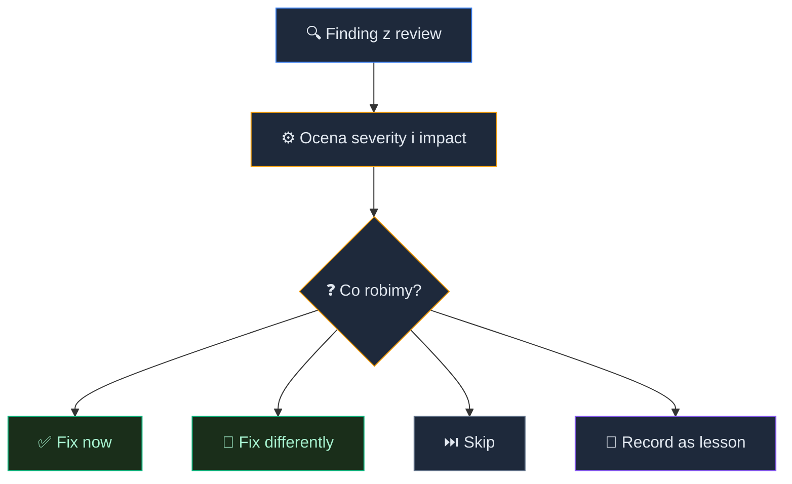

# Solo Code Review: weryfikuj kod AI szybko i skutecznie


<!-- cdn: https://images.przeprogramowani.pl/lessons/m2-l3/assets/cover.jpg -->

W poprzedniej lekcji doprowadziłeś pierwszy stream do końca: plan zatwierdzony, fazy zamknięte, commity gotowe, `## Progress` wygląda czysto.

I teraz przychodzi bardzo kuszący moment: "skoro działa, to merge".

No właśnie. Kod może działać lokalnie, testy mogą przechodzić (je dodamy w module 3), a zmiana nadal może nie być gotowa do merge.

Agent mógł rozwiązać właściwy problem w zły sposób, rozszerzyć zakres po cichu, ominąć konwencję projektu albo dopisać test, który sprawdza dokładnie to samo błędne założenie, które przed chwilą wygenerował.

Brzmi znajomo? W preworku mówiliśmy o trybie "approve bez obrony": AI dowozi wynik, ty klikasz akceptację, ale w twojej głowie nie powstaje pewność, że rozumiesz konsekwencje zmiany.

Nie będziemy tu uczyć klasycznego code review zespołowego ani planowania testów — to przyjdzie później. Tutaj uczysz się solo review kodu wygenerowanego przez agenta: szybkiego, systematycznego i wystarczająco ostrego, żeby nie przepuścić ryzykownej zmiany tylko dlatego, że wygląda schludnie.

### Kod działa, ale czy jest gotowy?

Po poprzedniej lekcji masz trzy rzeczy, które są dobrym punktem wyjścia do review:

- zaimplementowany slice,
- `plan.md` jako referencję intencji,
- `## Progress` z ukończonymi fazami i commitami.

Review kodu AI bez planu bardzo szybko zamienia się w czytanie diffu "na wyczucie". Patrzysz na zmianę, widzisz sporo poprawnego TypeScriptu, kilka sensownych nazw, jakiś test i myślisz: okej, chyba jest dobrze.

Tyle że AI potrafi pisać kod, który wygląda rozsądnie nawet wtedy, gdy rozwiązuje niewłaściwy problem.

Właściwe pytanie podczas review brzmi: **czy ta zmiana dowozi plan zgodnie z wymaganiami?**

Do tego służy `/10x-impl-review` — uporządkowany przegląd implementacji względem planu, zakresu, reguł projektu i kryteriów sukcesu. Pozwala wychwycić wiele problemów zanim trafią na produkcję, ale ostateczna decyzja o merge nadal należy do ciebie.

<div style="padding:56.25% 0 0 0;position:relative;"><iframe src="https://player.vimeo.com/video/1193277758?badge=0&amp;autopause=0&amp;player_id=0&amp;app_id=58479" frameborder="0" allow="autoplay; fullscreen; picture-in-picture; clipboard-write; encrypted-media; web-share" referrerpolicy="strict-origin-when-cross-origin" style="position:absolute;top:0;left:0;width:100%;height:100%;" title="M2 L3 Review"></iframe></div><script src="https://player.vimeo.com/api/player.js"></script>

### Scorecard zamiast intuicji

`/10x-impl-review` porządkuje review przez sześć wymiarów:

| Wymiar | Pytanie, które zadajesz |
|---|---|
| Plan Adherence | Czy implementacja realizuje zatwierdzony plan? |
| Scope Discipline | Czy agent nie dorzucił zmian spoza zakresu? |
| Safety & Quality | Czy zmiana nie otwiera ryzyk bezpieczeństwa, danych albo stabilności? |
| Architecture | Czy rozwiązanie pasuje do architektury projektu? |
| Pattern Consistency | Czy kod używa lokalnych wzorców zamiast wymyślać własne? |
| Success Criteria | Czy kryteria sukcesu są naprawdę spełnione? |

Scorecard chroni cię przed typowym błędem w review kodu agenta. Skupiasz się na tym, co łatwo zobaczyć, zamiast na tym, co naprawdę może zaboleć.

Łatwo zauważyć nazwę zmiennej.

Trudniej zauważyć, że agent dodał nowy format odpowiedzi API, który nie pasuje do reszty aplikacji.

Łatwo zauważyć brakujący komentarz.

Trudniej zauważyć, że test przechodzi, bo sprawdza implementację, a nie wymagane zachowanie.

Łatwo zauważyć plik, który agent zmienił.

Trudniej zauważyć plik, którego agent powinien był nie dotykać.

Dlatego scorecard działa jak filtr uwagi. Najpierw patrzysz na odchylenia od planu, zakres, bezpieczeństwo, architekturę i wzorce. Dopiero potem na drobiazgi.

### Wyniki to nie lista "napraw wszystko"

Po review dostaniesz findings uporządkowane według ważności. I tu pojawia się pułapka: chęć naprawienia wszystkiego.

Agent zgłasza pięć uwag, więc odruchowo prosisz: "napraw wszystko". Brzmi odpowiedzialnie, ale w praktyce często oznacza niepotrzebną pracę nad rzeczami, które nie wpływają znacząco na jakość zmiany.

Dlatego findings analizujemy przez dwie osie:

- **severity** — jak poważny jest problem,
- **impact** — jak daleko sięga zmiana i ile decyzji wymaga poprawka.

Severity mówi ci, czy problem ma charakter krytyczny, ostrzegawczy lub obserwacyjny.

Impact z kolei mówi, czy poprawka jest mała i lokalna, czy zahacza o architekturę, produkt, dane, kontrakt albo dalszy plan.

To są różne rzeczy.

Finding może mieć wysoką severity i niski impact: na przykład brakująca walidacja w jednym handlerze, którą da się poprawić lokalnie. Taki problem zwykle naprawiasz od razu.

Finding może mieć niższe severity, ale wysoki impact: na przykład sugestia zmiany nazwy statusu zapisywanego w bazie. Wygląda jak porządek w enumie, ale dotyka frontendu, backendu, danych historycznych i dokumentacji.

Tu nie klikasz "fix" z rozpędu.

Macierz severity × impact to heurystyka, nie sztywna reguła:

| Severity / Impact | Low | Medium  | High  |
|---|---|---|---|
| Critical | Napraw teraz | Napraw ostrożnie | Zatrzymaj się i zawęź fix |
| Warning | Fix albo skip | Decyzja zależna od kontekstu | Często wymaga planowania |
| Observation | Zwykle skip | Zostaw notatkę albo regułę (/10x-lesson) | Zbadaj, czy problem nie dotyka wielu miejsc |

Najważniejsza zmiana w twoim zachowaniu jest prosta: **nie każdy finding musi zostać poprawiony podczas review**.

Czasem najlepsza decyzja to fix now. Czasem fix differently, bo masz lepszy pomysł niż agent. Czasem skip. A czasem record as lesson — żeby agent nie powtórzył tego samego wzorca.

Po uruchomieniu `/10x-impl-review` masz dwa sposoby pracy z wynikami. Możesz przejść od razu do analizy, albo najpierw zapisać raport, przejrzeć go we własnym tempie, a dopiero potem wrócić do recenzji przez wywołanie `/10x-impl-review @ścieżka-do-raportu`.

Polecamy to drugie podejście, szczególnie przy większych zmianach. Czytasz raport bez presji, budujesz obraz całości, a dopiero potem wchodzisz w triage.

### Triage: finding po findingu

Review kończy się dopiero wtedy, gdy przejdziesz przez findings i podejmiesz decyzję dla każdego z nich.


<!-- rendered: ../../assets/diagrams-10x/lessons-m2-l3-lesson-draft-1-10x.png | cdn: https://images.przeprogramowani.pl/diagrams/lessons-m2-l3-lesson-draft-1-10x.png -->

Mamy zasadniczo cztery typy reakcji. To prostsze niż wygląda na początku.

**1. Napraw teraz.**

Klasyczny fix. Finding jest prawdziwy, istotny, a poprawka mieści się w zakresie zmiany. Agent naprawia problem w miejscu, a ty po poprawce robisz krótkie re-review.

Przykład z 10xCards: review wykrywa, że endpoint zapisujący zaakceptowaną fiszkę omija istniejący mechanizm autoryzacji. To nie jest temat na później. Należy poprawić zanim klikniesz merge.

**2. Napraw inaczej.**

Agent zaproponował poprawkę, ale ty widzisz lepsze rozwiązanie. Może fix jest poprawny technicznie, ale łamie lokalny wzorzec. Może istnieje prostszy sposób.

`Fix differently` otwiera dyskusję: opisujesz swoje podejście, agent je realizuje, a ty weryfikujesz wynik.

**3. Nie naprawiaj teraz.**

`Skip` pasuje do obserwacji o niskim wpływie: nazwa mogłaby być lepsza, ale nie narusza konwencji, nie zwiększa ryzyka i nie blokuje merge.

Jeśli problem jest poważniejszy, ale świadomie go odkładasz, opisz uzasadnienie przez opcję „Other" — to odpowiednik accept risk. Jeśli finding jest po prostu błędny, wpisz dismiss. Oba przypadki zostawiają ślad w raporcie.

**4. Buduj pamięć projektu.**

Niektóre findings nie są jednorazowym błędem, tylko sygnałem, że agent nie zna jeszcze lokalnej reguły projektu.

W lekcji o regułach projektu (M1L4) poznałeś mechanizm zapisywania powtarzalnych wzorców do `lessons.md`. Review to naturalny moment, w którym te wzorce się ujawniają.

Dobre review kończy się czasem nowym wpisem w `lessons.md`. Nie po to, żeby produkować dokumentację dla dokumentacji, ale po to, żeby kolejne uruchomienie `/10x-plan` albo `/10x-implement` zaczynało z lepszym kontekstem. Im więcej wzorców zapiszesz, tym mniej tych samych findings wraca w kolejnych review.

Jeśli review wykrywa powtarzalny wzorzec, używasz `Record as lesson`. Reguła trafia do `context/foundation/lessons.md`, a kolejne uruchomienia workflow mogą ją wczytać jako wcześniejszą lekcję projektu.

Przykład: "nowe server actions muszą używać istniejącego auth guard pattern, zamiast sprawdzać userId ręcznie w każdym handlerze".

To nie jest jednorazowa poprawka. To reguła, która zmieniłaby kilka poprzednich decyzji i będzie wracać w kolejnych slice'ach.

Po zapisaniu reguły agent zapyta, czy chcesz od razu zastosować poprawkę w kodzie. Możesz powiedzieć tak, wtedy finding zostaje naprawiony i zapisany jako reguła. Albo nie, reguła trafia do lessons.md, ale kod zostaje bez zmian. Zależy od tego, czy poprawka mieści się w zakresie bieżącego slice'a i jak wiele zmian wprowadzasz już w tym PRze.

<div style="padding:56.25% 0 0 0;position:relative;"><iframe src="https://player.vimeo.com/video/1195154843?badge=0&amp;autopause=0&amp;player_id=0&amp;app_id=58479" frameborder="0" allow="autoplay; fullscreen; picture-in-picture; clipboard-write; encrypted-media; web-share" referrerpolicy="strict-origin-when-cross-origin" style="position:absolute;top:0;left:0;width:100%;height:100%;" title="M2 L3 Triage"></iframe></div><script src="https://player.vimeo.com/api/player.js"></script>

### Jak czytać diff agenta

Review kodu wygenerowanego przez agenta różni się od review kodu pisanego ręcznie. Agent potrafi bardzo szybko wygenerować spójnie wyglądający diff, którego intencja rozjechała się z planem.

Dlatego czytaj diff w tej kolejności.

**1. Zakres.**

Najpierw sprawdź, czy agent zmienił tylko to, co wynikało z planu. Jeśli slice dotyczył zapisu zaakceptowanych fiszek, a diff dotyka routingu, layoutu i konfiguracji deploya, zatrzymaj się.

Sprawdź, czy implementacja rozwiązuje dokładnie ten slice, który planowałeś. AI lubi rozwiązać problem obok: trochę większy, trochę bardziej ogólny, trochę bardziej "ładny".

Może jest powód. Ale to powód, który trzeba zrozumieć.

**2. Granice ryzyka.**

Potem patrzysz na miejsca, które najczęściej bolą po merge: autoryzacja, zapis danych, migracje, zewnętrzne API, konfiguracja środowiska.

Tu nie wystarczy "wygląda dobrze". Tu musisz wiedzieć, że kod działa, jest bezpieczny i zachowuje zasady projektu.

**3. Lokalne wzorce.**

Patrz, czy kod używa istniejących helperów, nazw, formatów błędów, struktur folderów i zasad testowania. Agent często wymyśla poprawne technicznie rozwiązanie, które nie pasuje do projektu.

To właśnie Pattern Consistency z scorecarda.

**4. Testy.**

Na końcu sprawdź testy, ale nie w trybie "czy są". Sprawdź, czy test faktycznie złapałby błąd, którego chcesz uniknąć w przyszłości.

Test napisany przez agenta też jest kodem. Zielony wynik jest informacją, ale nie jest dowodem, że zmiana ma sens i spełnia założenia z planu.

Na testach skupimy się w kolejnym module, ale warto o nich pamiętać na etapie review.

### Werdykt przed merge

Na końcu review potrzebujesz finalnej decyzji.

W praktyce możesz myśleć o trzech wariantach:

- **Approve** - findings są naprawione, odrzucone albo świadomie zaakceptowane,
- **Request changes** - zmiana jest blisko, ale wymaga poprawek przed merge,
- **Block** - problem jest tak poważny, że trzeba wrócić do planu i/lub wyjściowych założeń.

`/10x-impl-review` pomaga przygotować raport i uporządkować findings, ale werdykt należy do ciebie.

To ty decydujesz, czy zmiana jest zgodna z planem, projektem i standardami, które mają przetrwać dłużej niż jeden slice.

Ten podstawowy cykl - plan, implementacja, review, triage — zamyka pojedynczą zmianę. W kolejnej lekcji ten sam workflow spotka trudniejszy przypadek: slice, w którym wybór biblioteki wpływa na model danych, UI i logikę biznesową jednocześnie. Poznasz nowe skille, które pozwolą sobie z tym poradzić.

## 🧑🏻‍💻 Zadania praktyczne

Zainstaluj paczkę lekcyjną za pomocą komendy:
```
npx @przeprogramowani/10x-cli get m2l3
```

- **Uruchom review implementacji.** Wróć do kodu, który zaimplementowałeś w poprzedniej lekcji. Uruchom `/10x-impl-review` na swoim slice'u i przejdź przez pełny scorecard. Przeczytaj findings i zadecyduj jak sobie z nimi poradzić zgodnie z poznanymi heurystykami.
- **Przeprowadź triage finding po findingu.** Dla każdego findingu podejmij jedną z decyzji: fix now, fix differently, skip lub record as lesson (→ `/10x-lesson`). Jeśli chcesz świadomie zaakceptować ryzyko albo odrzucić finding, użyj opcji „Other". Zapisz uzasadnienie dla co najmniej jednego skipa lub dismiss — to buduje nawyk dokumentowania decyzji i brania za nie odpowiedzialności.

## Odbierz swoją odznakę

Po ukończeniu tej lekcji odbierz odznakę w sekcji [10xDevs Mission Log](https://platforma.przeprogramowani.pl/10xdevs-3/mission-log) a następnie pochwal się swoim osiągnięciem!

## 📚 Materiały dodatkowe

- [Google Engineering Practices: What to look for in a code review](https://google.github.io/eng-practices/review/reviewer/looking-for.html) — stabilne przypomnienie, że review obejmuje design, funkcjonalność, złożoność, testy, nazwy, komentarze, styl i dokumentację.
- [Expectations, Outcomes, and Challenges of Modern Code Review](https://www.microsoft.com/en-us/research/publication/expectations-outcomes-and-challenges-of-modern-code-review/) — Bird, Bacchelli (Microsoft Research / IEEE ICSE 2013). Starsze, ale nadal przydatne badanie pokazujące, że review to także zrozumienie zmiany i transfer wiedzy, nie tylko łapanie defektów.
- [Do Users Write More Insecure Code with AI Assistants?](https://arxiv.org/abs/2211.03622) — Perry, Srivastava, Kumar, Boneh (CCS 2023). Badanie bezpieczeństwa kodu tworzonego z pomocą AI. Dobre jako ostrzeżenie przed fałszywą pewnością, nie jako uniwersalny benchmark wszystkich agentów.
- [Asleep at the Keyboard? Assessing the Security of GitHub Copilot's Code Contributions](https://arxiv.org/abs/2108.09293) — Pearce et al. (IEEE S&P 2022). Historyczny sygnał, że pozornie poprawne sugestie AI wymagają review z perspektywy bezpieczeństwa.
- [Claude Code Review documentation](https://code.claude.com/docs/en/code-review) — analiza systemu code review w Claude Code, warto zobaczyć co jest podobne a co działa inaczej względem /10x-impl-review.
- [SWE-PRBench: Benchmarking AI Code Review Quality Against Pull Request Feedback](https://arxiv.org/abs/2603.26130) — Kumar (2026). Benchmark pokazujący, że AI review nadal ustępuje ekspertowi, a strategia kontekstu ma większe znaczenie niż jego ilość.
