# Research wewnętrzny i zewnętrzny - przygotowanie przed kodowaniem

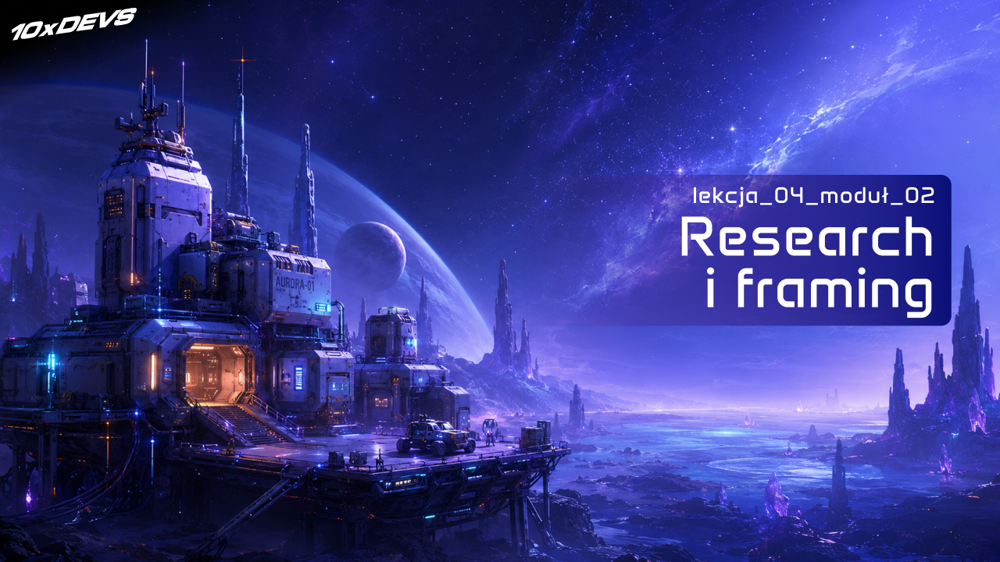
<!-- cdn: https://images.przeprogramowani.pl/lessons/m2-l4/assets/cover.jpg -->

W poprzednich lekcjach przeszliśmy pełny cykl jednej zmiany: roadmapa, plan, fazowa implementacja i review wygenerowanego kodu. Generowanie kart działa, zapis do decku działa, edycja też. CRUD jak się patrzy.

I nagle pojawia się slice, który na pierwszy rzut oka wygląda jak kolejny endpoint, a wcale nim nie jest.

`S-04 srs-review-session`, czyli sesja powtórek. Na pierwszy rzut oka to po prostu "pokaż kartę, zbierz ocenę, zaktualizuj stan, pokaż następną". Klasyczny CRUD z odrobiną logiki. Otwierasz Cursora albo Claude Code, wpisujesz to samo polecenie co poprzednio - `/10x-plan srs-review-session`. Po chwili agent zaczyna zadawać pytania, których być może się nie spodziewałeś: jakie ratingi przyjmujemy, czy karta ma jedną politykę powtórek czy konfigurowalną, jak liczymy `due date`, co dzieje się z kartą po edycji. I z której biblioteki korzystamy. Skąd masz to wiedzieć?

Workflow nie jest popsuty. To logika biznesowa zaczyna robić się bardziej unikalna, a twój projekt przestaje być zbiorem endpointów.

Potrzebujemy więc nowych narzędzi na trudniejsze przypadki. Po pierwsze, taki slice wymaga **szerszego przygotowania przed planem**: w CRUD wystarczał `/10x-plan`, ale przy mniej oczywistych funkcjach warto najpierw zebrać dodatkowy kontekst - z codebase'u i ze źródeł zewnętrznych. Po drugie, dorzucamy konkretny toolkit do external researchu dla agentów: AI-native search, live docs i dyscyplinę szukania źródeł zaprojektowanych pod LLM.

Workflow zostaje ten sam. Tylko przygotowanie rośnie razem z ryzykiem.

### Po CRUD mamy karty, ale brakuje powtórek

Nasz checkpoint wygląda teraz następująco: użytkownik wygenerował propozycje fiszek, zaakceptował część i zapisał je jako `Flashcard` w decku. Karta istnieje. Ma front, back, deck i datę utworzenia. I dokładnie tu kończy się to, co Stream A oferuje produktowi.

Bo z perspektywy nauki deck pełen kart bez sesji powtórek to po prostu lepsza wersja notatnika.

Brakuje nam systemu powtórek:

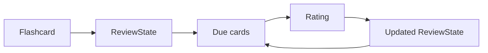
<!-- rendered: ../../assets/diagrams-10x/lessons-m2-l4-lesson-draft-1-10x.png | cdn: https://images.przeprogramowani.pl/diagrams/lessons-m2-l4-lesson-draft-1-10x.png -->

`S-04` to właśnie ta pętla. Karta zyskuje `ReviewState`. Z `ReviewState` wynika, które karty dziś trzeba pokazać. Pokazujemy je, użytkownik ocenia ("Again / Hard / Good / Easy" albo "1-5", w zależności od algorytmu), na podstawie oceny aktualizujemy stan i wyznaczamy kolejny termin powtórki.

Brzmi prosto. I właśnie ta prostota jest pułapką, w którą łatwo wpaść.

### SRS to decyzja kontraktowa

Naturalny odruch w pracy z agentem to potraktować `S-04` jak każdy inny slice z roadmapy: change-id, `/10x-plan`, fazy, implementacja. Spróbuj zacząć tak w głowie i zatrzymaj się na pierwszej decyzji, którą agent będzie musiał podjąć.

Jakiego kształtu ma być `ReviewState`?

Tu nie ma "zdroworozsądkowej" odpowiedzi. Jeśli oprzesz się o klasyczny algorytm SuperMemo (SM-2), używany w starszej wersji [Anki](https://apps.ankiweb.net/), `ReviewState` to z grubsza `easeFactor`, `interval`, `repetitions` plus data ostatniej powtórki. Skala ocen ma sześć stopni, polityka edycji jest dość liberalna. Jeśli przyjmiesz FSRS (nowszy algorytm, opcjonalny w Anki od wersji 23.10 z listopada 2023), `ReviewState` to trójka `Difficulty / Stability / Retrievability` plus parametry modelu, skala ocen ma cztery stopnie (`Again / Hard / Good / Easy`), a edycja karty wpływa na stan w sposób, który trzeba świadomie obsłużyć.

Każda taka decyzja to kontrakt, który propaguje się dalej:

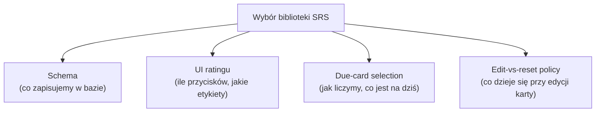
<!-- rendered: ../../assets/diagrams-10x/lessons-m2-l4-lesson-draft-2-10x.png | cdn: https://images.przeprogramowani.pl/diagrams/lessons-m2-l4-lesson-draft-2-10x.png -->

Innymi słowy: w `S-04` nie blokuje cię brak kodu do napisania. Blokuje cię **brak osadzenia kodu w konkretnych decyzjach domenowych**, bez których agent nie wie, w którą stronę pisać. Plan zbudowany przed tą decyzją będzie mocno ograniczony - agent wybierze coś sam, w połowie implementacji okaże się, że schemat nie pasuje do API biblioteki i wrócisz do tego samego miejsca, tylko ze śmietnikiem w repo.

Ten sam wzorzec zobaczysz w wielu innych aplikacjach:

- W typowym SaaS-ie "zmiana schematu subskrypcji" brzmi jak formularz i webhook. W praktyce blokują cię zasady przedpłat, okresy rozliczeniowe, ponowienia płatności, faktury korygujące, podatki i API dostawcy płatności.
- W aplikacji logistycznej "zaproponuj trasę kurierowi" brzmi jak widok mapy. W praktyce musisz wybrać model optymalizacji: okna czasowe, pojemność auta, priorytety paczek, korki, punkty odbioru.
- W serwisie typu marketplace "dopasuj klienta do wykonawcy" brzmi jak wyszukiwarka. W praktyce research może dotyczyć metod rankingu, dostępności, odległości, stawek, anulowań, reputacji i tego, czy wynik ma być deterministyczny, czy uczący się z zachowań użytkowników.
- W produkcie edukacyjnym "poleć następną lekcję" brzmi jak lista rekomendacji. W praktyce trzeba ustalić, czy rekomendujesz po ukończonych lekcjach, wynikach quizów, lukach kompetencyjnych, czasie do celu, czy po podobieństwie treści.

W każdym z tych przypadków agent może napisać kod. Problem w tym, że bez researchu napisze go pod przypadkowy model świata.

To jest właśnie sygnał, że nasz slice z SRS potrzebuje szerszego przygotowania. 

Żeby zmieścić wszystkie nowe informacje w oknie kontekstowym modelu, podzielimy je na dwa ruchy: najpierw zewnętrzny rekonesans (co jest sensownym gotowcem na rynku?), potem analiza projektu (co już mamy w kodzie?). Zacznijmy od kilku pomysłów na SRS z zewnątrz.

### External research dla agentów

Na start implementacji SRS poszukamy inspiracji w sieci - czym właściwie jest ten system, ile jest dostępnych algorytmów i jakie są trade-offy. I tu pojawia się odruch z czasów ChataGPT, który warto rozbroić od razu:

> "Wkleję pytanie do darmowego ChataGPT, wezmę pierwszą odpowiedź i wrzucę do planu."

Po pierwsze, typowy chatbot odpowie z pamięci treningowej - uderzy w datę odcięcia danych, a w konsekwencji w halucynacje i nieaktualne nazwy paczek. Po drugie, nawet jeśli odpowiedź będzie sensowna, nie wiemy, czy jest oparta na czymś, co da się sprawdzić. Nie zrobiliśmy tzw. `groundingu`, czyli osadzenia wyników AI w realnych danych.

Wracamy tu do różnicy z preworku: chatbot głównie odpowiada, agent działa w harnessie i korzysta z narzędzi. Jednym z tych narzędzi jest pobieranie zasobów z sieci, np. `WebFetch`, które pozwala wyjść poza ograniczenia pamięci modelu i wczytać aktualną dokumentację, issue, README albo artykuł techniczny.

Tylko że `WebFetch` to dopiero pierwszy element układanki. Jeśli masz konkretny URL, agent go pobierze. Jeśli dopiero szukasz źródeł, potrzebujesz jeszcze narzędzia typu `WebSearch` albo zewnętrznego MCP. Tu zaczyna się nierówność między agentami: nie każdy ma wbudowaną wyszukiwarkę, nie każdy pozwala ją konfigurować i nie każdy korzysta z tego samego backendu.

Na dziś wygląda to mniej więcej tak:

- **Cursor** - używa usługi Exa.ai do wyszukiwania aktualnych informacji i dodawania ich do kontekstu.
- **Codex** i **ChatGPT** - integracja z wyszukiwarką Bing od Microsoftu - [support page](https://help.openai.com/en/articles/9237897-chatgpt-search).
- **Claude Code** - wbudowane narzędzie `WebSearch` nie ma opisanych providerów, ale użytkownicy Reddita wskazują, że wyniki często pokrywają się z rezultatami [Brave Search](https://search.brave.com/), co widzi też [Simon Willison](https://simonwillison.net/2025/Mar/21/anthropic-use-brave/).

Inne narzędzia mogą do wyszukiwania podchodzić inaczej, albo nie wspierać tej funkcjonalności w ogóle. Na szczęście dzięki MCP i zewnętrznym dostawcom wyszukiwania AI-native możemy tę lukę zaadresować.

#### Agentic search

Zanim wybierzemy konkretnego dostawcę, zatrzymajmy się chwilę na koncepcji integracji wyszukiwarek z agentami. **Agentic search** to osobna warstwa zaprojektowana pod pracę z agentem: zapytania mogą wykorzystywać bardziej naturalne zwroty i terminy, wyniki przychodzą w formacie gotowym do dalszej obróbki (najczęściej czysty markdown z metadanymi), a API są pomyślane pod łańcuch wywołań - szybkie odpowiedzi, oczyszczona treść strony zamiast surowego HTML-a, endpointy typu `answer`, które od razu zwracają wynik z cytowanymi źródłami.

Na rynku jest dziś kilku poważnych graczy, którzy walczą o twoją uwagę: **Brave Search**, **Firecrawl**, **Exa**, **Tavily**, **Perplexity**, **Parallel Search**, **SerpAPI**.

W maju 2026 zespół AIMultiple [opublikował benchmark](https://aimultiple.com/agentic-search) całej ósemki na 100 realnych pytaniach z branży programowania. W roli sędziego (LLM-as-a-Judge) pracował GPT-5.2, a 10% wyników zostało dodatkowo zweryfikowane przez ludzi. Główny wniosek - nie ma jednego lidera, który gniecie konkurencję: **czwórka liderów (Brave, Firecrawl, Exa, Parallel Pro) jest statystycznie nie do odróżnienia** w ogólnym rankingu

Najciekawsze są jednak wyniki w podziale na typ zapytania. Benchmark dzieli pytania na sześć kategorii: *Research*, *Factual Verification*, **Technical Documentation**, *Real-time Events*, *Comparative* i *Tool Discovery*.

To, co mamy do zrobienia w `S-04` - znaleźć kandydata na bibliotekę SRS w TypeScript, przeczytać dokumentację, zweryfikować kształt API - to podręcznikowy przykład *Technical Documentation*. I w tej właśnie kategorii przedstawiana za chwilę **Exa.ai zdobyła najwyższą ocenę jakości** spośród całej ósemki.

Do tego dochodzi sygnał z rynku, który już znamy: Cursor pod `@web` korzysta właśnie z Exy, a Notion AI używa jej do wyszukiwania aktualności. Wybór praktyków i niezależny benchmark wskazują w tę samą stronę. Dlatego w dalszej części lekcji wpinamy Exę - jako jednego z przedstawicieli kategorii, dobranego pod nasz konkretny przypadek.

> Uwaga - jeśli korzystasz z Cursora, poniższa integracja z Exa.ai nie jest dla ciebie niezbędna, bo Cursor obsługuje ją natywnie. Jeśli twój agent działa już z innym dostawcą z czołówki (Brave, Firecrawl, Tavily), nie zmieniaj go odruchowo - najpierw zobacz, jak radzi sobie na zadaniu zbliżonym do twojego, a dopiero potem decyduj o migracji.

#### Exa.ai jako AI-native search

Exa.ai opisuje się jako "the best search API for AI" i "industry-leading web index built for agents". Marketing marketingiem, ale za hasłem stoją trzy rzeczy, które realnie liczą się w pracy z agentem i które potwierdza opisany wyżej benchmark: trafność na zapytaniach technicznych, krótkie czasy odpowiedzi i wyniki w formacie gotowym do dalszej obróbki. Do tego dostajemy MCP, dzięki któremu agent bez gimnastyki włącza tę wyszukiwarkę do swojego zestawu narzędzi.

W darmowym planie wykonamy 1000 zapytań, a kolejne 1000 kosztuje tylko 7$ (dla porównania, `WebSearch` w aplikacjach opartych o Claude SDK to 10$ za 1000 zapytań). Na potrzeby kodowania z agentami i okazjonalnego researchu w sieci free tier będzie wystarczający.

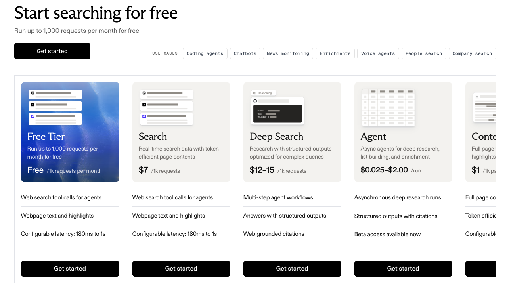
<!-- cdn: https://images.przeprogramowani.pl/lessons/m2-l4/assets/exa-pricing.png -->

Żeby zacząć, zakładamy darmowe konto i wybieramy wariant środowiska. Nie korzystamy z Exa.ai w formie biblioteki, bo nie budujemy aplikacji z AI search (tę opcję też możesz rozważyć!), tylko potrzebujemy MCP:

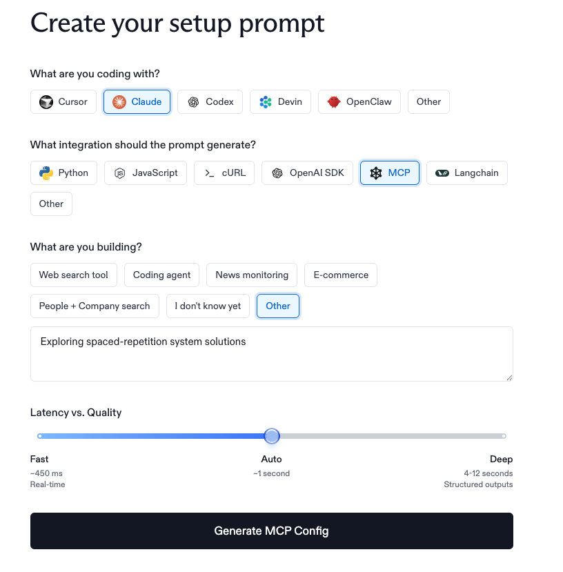
<!-- cdn: https://images.przeprogramowani.pl/lessons/m2-l4/assets/exa-config.png -->

W odpowiedzi dostajemy prompt, który możemy przerobić np. na custom command (`.claude/commands/exa-init.md` lub podobny - ważne, żeby móc się do niego odwołać w swoim agencie):

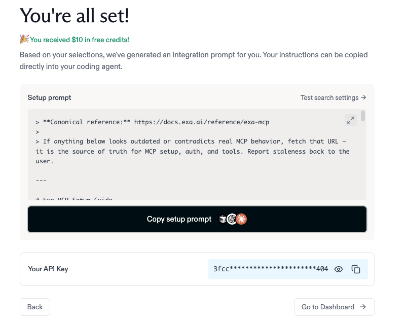
<!-- cdn: https://images.przeprogramowani.pl/lessons/m2-l4/assets/exa-prompt.png -->

Do czego wykorzystamy to narzędzie? Przeszukamy internet pod kątem algorytmów SRS i kandydatów na biblioteki obsługujące core tej funkcjonalności. Przykład video za chwilę.

#### Context7 jako live library docs

Powiedzmy, że Exa potwierdziła, że najmocniejszym kandydatem w TypeScript jest `ts-fsrs` (implementacja FSRS od community Open Spaced Repetition). Wiesz już, *którą* bibliotekę chcesz w planie. Teraz potrzebujesz wiedzieć, *jak* ta biblioteka wygląda od strony API: jakie typy eksportuje, jakie ma kontrakty, jak wygląda inicjalizacja, jak wygląda typowe wywołanie.

Tu zaczyna się druga klasa błędów: pytasz agenta o API biblioteki, on odpowiada z pamięci treningowej i podaje pięknie sformatowany kod z funkcjami, które nie istnieją albo zostały zmienione trzy wersje temu. Klasyczna halucynacja warstwy technicznej.

`Context7` to jedna z opcji, która rozwiązuje ten problem przez wstrzyknięcie aktualnej dokumentacji do kontekstu agenta. Wspiera MCP, [CLI](https://context7.com/docs/clients/cli) i dedykowane [skille](https://context7.com/docs/skills) - możesz skonfigurować to według własnych preferencji. Darmowy plan dopuszcza 1000 wywołań, a za 10$/mc wchodzimy na "unlimited API calls".

Instalacja - [zakładka Install](https://context7.com/install).

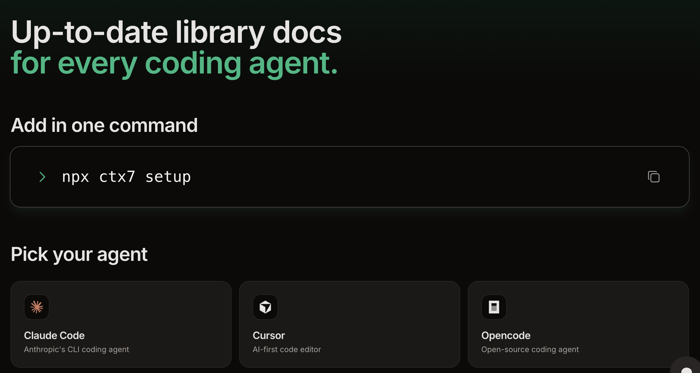
<!-- cdn: https://images.przeprogramowani.pl/lessons/m2-l4/assets/context-7.png -->

Kopiujemy wskazane polecenie, uruchamiamy je **poza agentem**, żeby zaktualizował się nasz setup MCP, otwieramy nową sesję i MCP powinno być już gotowe do uwierzytelnienia naszym kontem.

A jak to działa? Kiedy prosisz agenta o pobranie wybranej dokumentacji, w praktyce korzysta on z dwóch narzędzi:

```text
1. resolve-library-id: "ts-fsrs"
   → /open-spaced-repetition/ts-fsrs

2. query-docs: "/open-spaced-repetition/ts-fsrs"
   → strukturyzowany markdown z aktualnymi docsami, docięty pod budżet tokenów
```

Te dwa narzędzia możesz wywoływać osobno, ale możesz też zadać ogólne zapytanie:

`Pobierz dokumentację <library_name>, która pozwoli zaimplementować S-04 z roadmapy. Użyj Context7 mcp`

W codziennej rozmowie z agentem rozbijanie tego na dwa kroki nie jest niezbędne. Jeśli twoje narzędzie ma wpięty Context7 i potrafi się nim posługiwać, mów do niego naturalnie; jeśli widzisz problemy, rozbij to na dwa etapy - "najpierw zidentyfikuj bibliotekę po ID, potem pobierz konkretne fragmenty dokumentacji".

Efekt jest taki, że `/10x-plan` dla `S-04` dostaje na wejście fragment docsów `ts-fsrs` zamiast halucynowanego API. Plan może uczciwie powiedzieć "używamy `createEmptyCard` i `fsrs().next(card, rating)`" zamiast wymyślać funkcje.

Trzymając się tych dwóch narzędzi, mamy też ukryty bonus dla jakości źródeł. Exa i Context7 zwracają content zaprojektowany pod LLM - czysty markdown bez chrome, paywalla i popupów. Tę kategorię "agent-friendly docs" (Cloudflare `markdown-for-agents`, `llms.txt`, `/md` endpointy) rozwijam w sekcji Deep Dive - tam pokazuję, dlaczego źródło w czystym markdown bije HTML z nawigacją i dlaczego warto rozpoznawać te ślady.

### Internal research na projektowym kodzie

Czas na ostatni element układanki - skill do analizy stanu projektu z uwzględnieniem efektywnego wykorzystania okna kontekstowego.

`/10x-research` to nowy dodatek do naszego toolkitu. Uruchamia on kilka subagentów równolegle i wraca ze skondensowanym raportem. Subagenty czytają, grepują, oglądają strukturę. Ty dostajesz na koniec syntezę.

Od strony zawartości:

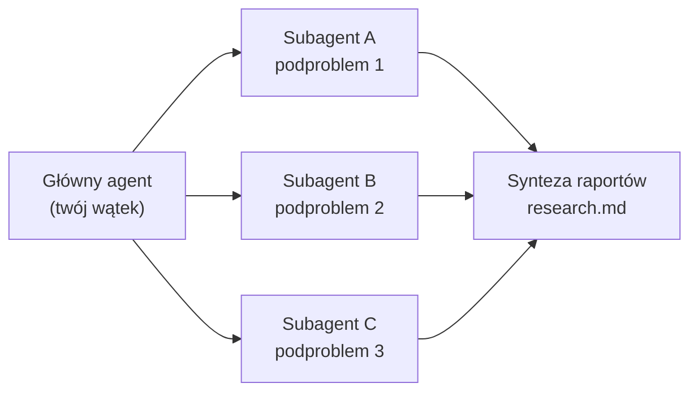
<!-- rendered: ../../assets/diagrams-10x/lessons-m2-l4-lesson-draft-3-10x.png | cdn: https://images.przeprogramowani.pl/diagrams/lessons-m2-l4-lesson-draft-3-10x.png -->

- **Grupa subagentów uruchamiana równolegle.** Skill korzysta z agenta `Explore` (szybki search po plikach i wzorcach) oraz `general-purpose` (głębsza wielo-plikowa analiza z reasoningiem). Główny agent dzieli pytanie na 2-4 obszary i odpala je w jednej wiadomości, a potem zbiera wyniki w jeden raport. Twoje główne okno kontekstowe nie wczytuje całego repo - robią to subagenty u siebie, a do rozmowy wraca już synteza z `file:line`.
- **Scope check przed researchem.** Jeśli pytanie jest niejednoznaczne, skill zatrzymuje się i pyta przez `AskUserQuestion` o zakres, głębokość i obszar (np. "architecture & patterns" vs "integration points"). Krótki dialog wymusza decyzję, zanim agent zacznie palić tokeny.
- **Output ląduje na dysku jako `context/changes/<change-id>/research.md`.** Strukturyzowany dokument z sekcjami *Summary*, *Detailed Findings* (każde z referencją `file.ext:line`), *Code References*, *Architecture Insights* i *Open Questions*.
- **`context/foundation/lessons.md` jako wstępniak.** Reguły zaakceptowane wcześniej w projekcie (np. "trzymamy SQLite w prototypie", "logger przez `pino`, nie `console.log`") są wczytywane jako znany kontekst i zawężają to, co w ogóle warto badać.

Przykładowe wywołanie:

```text
/10x-research <change-id> <query>
```

W naszym 10xCards dobrze sformułowany internal research odpowiada na pytania typu:

- Jak wygląda główny przepływ informacji w obszarze zarządzania kartami?
- Jaki jest cykl życia sesji użytkownika?
- Czy najnowsza wersja biblioteki `ts-fsrs` jest kompatybilna z naszym kodem?

W odpowiedzi dostajemy nazwy plików, krótkie wycinki kodu, listę konwencji i miejsc związanych z pytaniem.

Pamiętaj - czego internal research **nie** zrobi:

- **Nie powie ci, którą bibliotekę SRS wybrać.** Nawet jeśli zapytasz wprost. Agent zobaczy, że w `package.json` nic takiego nie ma i co najwyżej zaproponuje napisanie własnego harmonogramowania, a to przy SRS jest bardzo szybkim wzorcem na piasku - dobrze działający algorytm spaced repetition to nie jest "kilka linii z `setTimeout`".
- **Nie modyfikuje kodu projektu.** Jedyny plik, który skill ma prawo zapisać, to `research.md` w folderze change'a. To celowy bezpiecznik - research nie jest furtką do "agent przy okazji posprzątał".
- **Nie wychodzi poza ustalony zakres.** Jeśli zgodziłeś się na "quick overview", subagenty nie zaczną nagle czytać `node_modules` ani historii gita.
- **Nie zgaduje, gdy może sprawdzić.** Każde znalezisko musi przyjść z referencją do pliku i linii. Brak referencji = brak claimu, nie szacunek.

W całym workflow `research.md` nie jest raportem do szuflady. Stałe miejsce na dysku oznacza, że `/10x-plan` zaciąga go przez `@research.md`, `/10x-plan-review` ma do czego porównywać założenia, a `/10x-implement` wraca do tego samego dokumentu, gdy któraś faza wchodzi w obszar, którego agent nie dotykał wcześniej.

Łącząc wszystkie składowe w całość, mamy następujący schemat przygotowania kontekstu pod nowe zadanie:

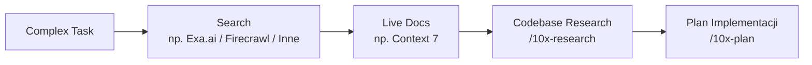
<!-- rendered: ../../assets/diagrams-10x/lessons-m2-l4-lesson-draft-4-10x.png | cdn: https://images.przeprogramowani.pl/diagrams/lessons-m2-l4-lesson-draft-4-10x.png -->

Zobaczmy jak to działa w praktyce:

<div style="padding:56.25% 0 0 0;position:relative;"><iframe src="https://player.vimeo.com/video/1194309204?badge=0&amp;autopause=0&amp;player_id=0&amp;app_id=58479" frameborder="0" allow="autoplay; fullscreen; picture-in-picture; clipboard-write; encrypted-media; web-share" referrerpolicy="strict-origin-when-cross-origin" style="position:absolute;top:0;left:0;width:100%;height:100%;" title="m2-l4-research"></iframe></div><script src="https://player.vimeo.com/api/player.js"></script>

### Plan oparty o zebrany research

Mamy teraz wszystkie elementy układanki w jednym miejscu. External research z Exa.ai i Context7 powiedział, że sensownym wyborem jest `ts-fsrs`. Znamy API biblioteki i jej alternatywy. Internal research z nowym skillem przeanalizował tę opcję pod kątem obecnego stanu projektu.

Cały przygotowany kontekst jest znakomitym wsadem do nowego planu:

```text
/10x-plan srs-review-session Build S-04 implementation plan based on @research.md and @ts-fsrs.md
```

Wcześniej `/10x-plan` szedł do przodu z lokalnym kontekstem zebranym ad hoc. Tutaj wchodzi z kontekstem przyciętym na miarę:

- rezultatami Exa, które uzasadniają wybór `ts-fsrs` zamiast SM-2 albo własnej implementacji,
- dokumentacją z Context7 z aktualnym API `ts-fsrs`,
- raportem `/10x-research` z opisem konwencji 10xCards i mapą plików.

Co to zmienia w samym `plan.md`? Pytania robią się **zorientowane na rozwiązanie**, a nie czysto diagnostyczne ani eksploracyjne.

Zamiast "jaki rating scale przyjmujemy?" agent wpisuje wprost: "rating scale: `Rating.Again | Hard | Good | Easy` z `ts-fsrs`, UI ma cztery przyciski, zapisujemy ostatni rating". Zamiast "jak wygląda `ReviewState`?" - "trzymamy strukturę `card` z `ts-fsrs` (zwracaną przez `createEmptyCard`) jako jeden obiekt w kolumnie `review_state` w tabeli `flashcard`; aktualizujemy ją przez `scheduler.next(card, new Date(), rating)`; pełna struktura w `plan-brief`".

`plan-brief.md` przestaje być streszczeniem planu i staje się prawdziwym kontraktem decyzji. Jedno miejsce, w którym widać, dlaczego biblioteka taka, a nie inna; dlaczego cztery przyciski, a nie pięć; dlaczego edycja karty resetuje stan, a nie modyfikuje go w miejscu.

Wszystko osadzone w starannie zebranym researchu.

### Plan review i implementacja do udanego domknięcia

Zanim wjedziemy z kodem, opcjonalnie do zastosowania jeszcze jedna bramka, dla tych szczególnie podejrzliwych co do jakości pracy agenta. Skill `/10x-plan-review` z poprzedniej lekcji nie znika tylko dlatego, że plan jest oparty o research. Wręcz przeciwnie - gdy plan zaczyna nieść kontraktowe decyzje (rating scale, kształt `ReviewState`, edit-vs-reset policy), `/10x-plan-review` jest najtańszym miejscem, żeby wyłapać blind spoty i niespójności zanim agent zacznie modyfikować pliki.

Po takim review możemy odpalić implementację. Mechanikę `/10x-implement` poznałeś już wcześniej: agent bierze plan, wykonuje konkretną fazę, weryfikuje, zatrzymuje się na ręcznych metodach weryfikacji, commituje, aktualizuje `## Progress` i pozwala wrócić do realizacji zadania po czasie.

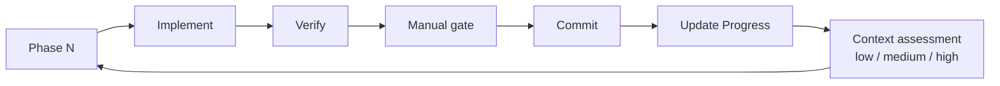
<!-- rendered: ../../assets/diagrams-10x/lessons-m2-l4-lesson-draft-5-10x.png | cdn: https://images.przeprogramowani.pl/diagrams/lessons-m2-l4-lesson-draft-5-10x.png -->

Osadzenie planu w starannie zebranych źródłach jeszcze bardziej podnosi skuteczność działania agenta. Trudne i nieoczywiste problemy rozbijamy na mniejsze, "do zjedzenia" podzadania.

W taki sposób powinieneś pracować z wyzwaniami, które są dla ciebie (i agenta) trudne. Najpierw zebrany kontekst, research (wewnętrzny i zewnętrzny), potem plan i dopiero implementacja.

### Context drift, czyli kiedy agent kaskaduje błędy

Workflow `research -> plan -> implement` ogranicza najczęstszą pułapkę pracy z agentem, której do tej pory nie nazwaliśmy wprost. Nazywa się **context drift**.

Drift to kaskada drobnych, błędnych decyzji agenta, które po kilku krokach prowadzą pracę w niewłaściwą stronę. Pojedyncza decyzja wygląda rozsądnie. Druga buduje na pierwszej. Trzecia traktuje dwie poprzednie jak fakty. Po piątym kroku masz wewnętrznie spójny kod, który rozwiązuje problem, którego nie miałeś.

Drift potrafi przyjść z dwóch różnych kierunków.

**Z braku przygotowania.** Agent wchodzi w zadanie bez ugruntowanego kontekstu - bez planu, bez researchu, bez znajomości konwencji projektu - więc zaczyna zgadywać. Pierwsze zgadnięcie wygląda dobrze. Każde kolejne staje się fundamentem dla następnego. To dokładnie ten przypadek, który adresujemy przez `/10x-research`, Exa i Context7: zamiast pamięci modelu, opieramy decyzje na źródłach, które da się sprawdzić.

**Z przeciągania rozmowy.** Tu sprawa jest mniej intuicyjna. Modele językowe tracą jakość wraz ze wzrostem długości kontekstu - i to nie dopiero wtedy, gdy okno się "skończy". Zjawisko opisuje [badanie Chromy "Context Rot"](https://research.trychroma.com/context-rot) z 2025 roku, przeprowadzone na 18 czołowych modelach (m.in. GPT-4.1, Claude Opus 4, Gemini 2.5). Wszystkie pokazują ten sam wzorzec: im więcej tokenów na wejściu, tym niższa precyzja - nawet gdy okno nie jest jeszcze zapełnione.

Wynika to z architektury transformerów. Środek kontekstu dostaje statystycznie mniej uwagi niż początek i koniec ("lost in the middle"), a semantycznie podobne, ale nietrafione fragmenty mylą model jak dystraktory. Anthropic w [Effective context engineering for AI agents](https://www.anthropic.com/engineering/effective-context-engineering-for-ai-agents) ujmuje to wprost: zwiększanie okna nie rozwiązuje problemu, bo to własność architektury, a nie luka w treningu.

Praktycznie drift z długiej sesji wygląda tak:

- pierwsza wiadomość: agent ma zaimplementować jedną fazę,
- po kilkunastu wymianach: rozmowa zawiera fragmenty trzech slice'ów, dwa porzucone podejścia i pół poprzedniego planu,
- po godzinie: agent miesza nazwy z różnych etapów, "pamięta" decyzje, których nie podjęliście, i pisze kod pod model danych z dwóch tematów wcześniej.

Ten sam agent, ten sam model. Inny stan kontekstu.

Dlatego cały workflow z tej lekcji to nie biurokracja, tylko konkretne odpowiedzi na drift:

- **research osadza decyzje w źródłach** zamiast w pamięci modelu - kolejne kroki nie budują się na zgadywaniu,
- **plan w pliku** jest stałym punktem odniesienia, którego agent nie traci po resecie sesji,
- **fazy z commitami** rozdzielają pracę na krótkie konteksty, które kończą się jasnym stanem na dysku,
- **`## Progress`** pozwala wrócić do pracy w świeżej sesji bez "opowiadania od początku".

Sygnał, że drift się zaczyna, to zwykle nie jeden konkretny błąd, tylko zestaw drobnych objawów: agent powtarza te same poprawki w kółko, przekręca nazwy plików, traci ślad poprzedniej decyzji, miesza fazy. Wtedy nie "popraw to jeszcze raz". Otwórz świeżą sesję, wczytaj `plan.md` i ostatni stan `## Progress`, i zacznij fazę od czystego kontekstu.

Drift to nie jest "agent miał gorszy dzień". To przewidywalna własność systemu, którą można konkretnie ograniczyć.

### SRS domknięty, ale co, gdy plan się nie układa?

Mała pauza, zanim domkniemy główną część lekcji.

To, że workflow dowiózł SRS, nie oznacza, że dowiezie wszystko. W pracy z agentem są sytuacje, w których nawet dobrze zebrane poszlaki nie wystarczą. Plan nie układa się w jasną decyzję. Albo plan się układa, ale w trakcie wdrażania kolejne kroki uderzają w ścianę, a próby kontynuacji nic nie dają. Albo - co najbardziej mylące - implementacja zaczyna odbiegać od planu w sposób, który po dwóch korektach wraca dokładnie tak samo, jakbyś próbował naprawić nie tę rzecz, co trzeba.

To trzy różne objawy tego samego problemu. Nie brak przygotowania, ale **błędny framing** - problem rozwiązywany od niewłaściwej strony.

Błędny framing oznacza, że już sama nazwa problemu jest myląca i sklejona z proponowanym rozwiązaniem. Research produkuje wtedy coraz więcej szczegółowych odpowiedzi na pytanie, które od początku jest zadane źle.

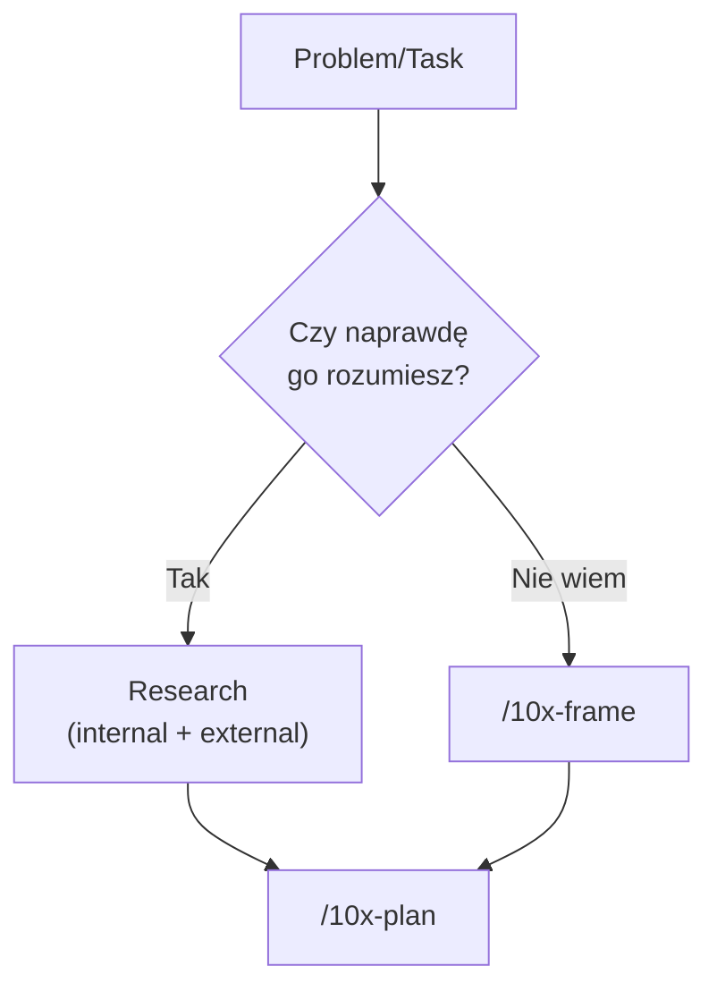
<!-- rendered: ../../assets/diagrams-10x/lessons-m2-l4-lesson-draft-6-10x.png | cdn: https://images.przeprogramowani.pl/diagrams/lessons-m2-l4-lesson-draft-6-10x.png -->

W naszym przypadku pytanie "jak wygląda docelowa sesja powtórek?" było jasne. Wykonaliśmy research, na tej podstawie powstał plan, z tego wyszła udana implementacja. Ale nie zawsze tak jest.

Poznasz teraz skill, który pomoże ci rozwiązywać problemy, co do których nie wiesz, czy właściwie istnieje dobre rozwiązanie. Albo te, w których agent uporczywie odmawia posłuszeństwa.

Żeby pokazać, jak to wygląda, wychodzimy na chwilę poza 10xCards.

### `/10x-frame` jako koło ratunkowe

Nowy skill wykorzystasz wszędzie tam, gdzie:

a) brakuje ci ekspertyzy w obszarze, w którym pracujesz,
b) nie jesteś pewien, czy kierunek pracy jest właściwy,
c) poprzednie próby z agentem nie przyniosły oczekiwanego rezultatu.

Jeden z przykładów, na którym go uruchomiliśmy, dotyczył gry Space Explorers. Brakowało nam ekspertyzy w gamedevie i tajnikach gier 2D, ale widzieliśmy problem - nachodzące na siebie postacie. Rozwiązanie? Nie wiadomo... ale skoro jest system kolizji, to pewnie on jest winowajcą.

Planujemy, robimy, palimy tokeny - zero efektów.

Postacie nadal nakładały się wizualnie. Każda kolejna próba naprawy szła głębiej w warstwę, w której nie było żadnego problemu.

Co poszło nie tak? Brak doświadczenia i skupienie na niewłaściwym obszarze aplikacji. Braliśmy do ręki niewłaściwe narzędzie.

Skąd ten rozjazd? Zlepiły się trzy różne rzeczy:

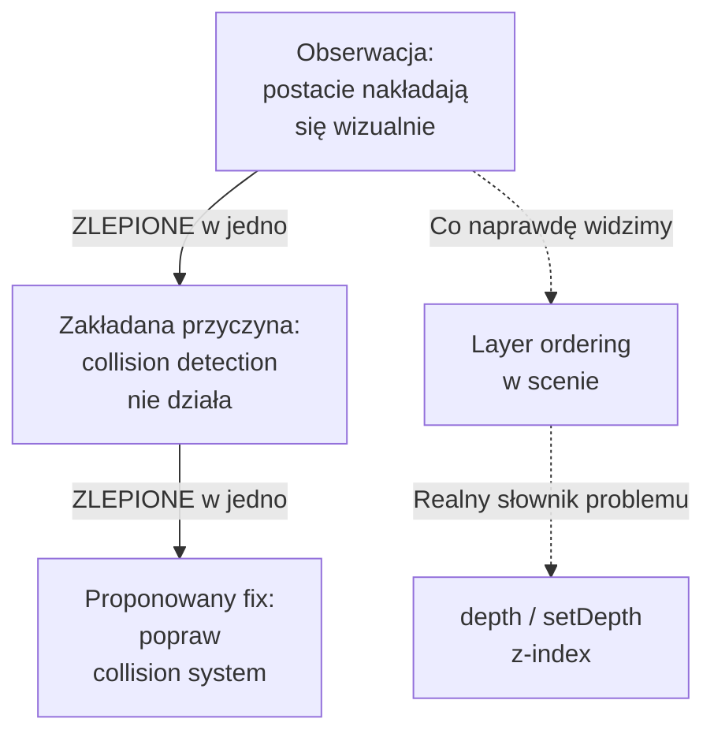
<!-- rendered: ../../assets/diagrams-10x/lessons-m2-l4-lesson-draft-7-10x.png | cdn: https://images.przeprogramowani.pl/diagrams/lessons-m2-l4-lesson-draft-7-10x.png -->

`/10x-frame` to skill, który wymusza rozdzielenie tych trzech warstw, **zanim** w ogóle przejdziesz do planu. Prowadzi cię przez Frame Brief: rozpisz osobno obserwację, osobno zakładaną przyczynę, osobno proponowany fix.

Zapytaj, czy obserwacja faktycznie wymaga tej konkretnej przyczyny. Zapytaj, czy proponowany fix nie został odziedziczony z poprzedniej rozmowy albo zgłoszenia, w którym nie miałeś jeszcze wszystkich danych.

Zobaczmy to na kolejnym fragmencie:

<div style="padding:56.25% 0 0 0;position:relative;"><iframe src="https://player.vimeo.com/video/1193158119?badge=0&amp;autopause=0&amp;player_id=0&amp;app_id=58479" frameborder="0" allow="autoplay; fullscreen; picture-in-picture; clipboard-write; encrypted-media; web-share" referrerpolicy="strict-origin-when-cross-origin" style="position:absolute;top:0;left:0;width:100%;height:100%;" title="M2 L3 Frame"></iframe></div><script src="https://player.vimeo.com/api/player.js"></script>

Trzy rzeczy do zapamiętania o `/10x-frame`:

- **Nie jest częścią głównego workflow 10xDevs - to koło ratunkowe.** Przy MVP, do którego przygotowywałeś się w poprzednim tygodniu, najpewniej go nie odpalisz, a praca pójdzie ścieżką `research -> plan -> implement`. W projektach poza kursem, legacy albo brownfield (gdzie brakuje ci wiedzy) zdecydowanie może się przydać.
- **Nie zastępuje researchu.** Research adresuje brak danych i dowodów. Frame adresuje błędne nazwanie problemu i podejście do zadania od złej strony. Czasem potrzebujesz najpierw frame, potem researchu, potem planu - kolejność zależy od tego, co naprawdę blokuje pracę.
- **Nie każdy problem to "misframing".** Mały rozjazd w działaniu agenta zaadaptujesz w bieżącej sesji. Frame przychodzi do gry, gdy mimo prób kontynuacji rozmowy twoje działania nie przynoszą efektu - więcej niż jedna sesja, więcej niż jedna wpadka albo zupełny brak pomysłu, co robić.

## 🧑🏻‍💻 Zadania praktyczne

👉 Uwaga - etapy researchu i framingu są opcjonalne. Wykonaj poniższe ćwiczenia tylko wtedy, kiedy w twoim projekcie znajdziesz zadania o szczególnej złożoności, lub po prostu kiedy chcesz przetestować działanie serwisów takich jak Exa. Nie komplikuj procesu planowania jeśli nie ma takiej potrzeby.

- **Podłącz Exa.ai i Context7, a potem zrób external research dla jednego slice'a.** Wybierz z roadmapy slice, w którym nie jesteś pewny biblioteki, algorytmu lub modelu domenowego (twój odpowiednik `S-04`). Skonfiguruj Exa MCP oraz Context7 MCP w swoim agencie i otwórz świeżą sesję. Poproś agenta o dwa kroki: najpierw przez Exa wyszukaj 2-3 kandydatów na bibliotekę lub podejście, potem przez Context7 pobierz aktualne API zwycięzcy (`resolve-library-id` → `query-docs`). Cel: jedno uzasadnione zdanie "wybieramy X, bo ..." z konkretnym wycinkiem aktualnej dokumentacji - zamiast halucynowanej propozycji z pamięci treningowej. Jeśli Exa zwraca głównie SEO-spam, przeformułuj zapytanie pod *Technical Documentation*, a nie pod "best library 2026".
- **Przejdź pełną pętlę `research → plan` dla nieoczywistego change'a.** Dla tego samego change-id uruchom `/10x-research <change-id> <query>` z konkretnym pytaniem o stan projektu (mapa plików, konwencje, miejsca styku z nową funkcjonalnością). Po wygenerowaniu `context/changes/<change-id>/research.md` odpal `/10x-plan <change-id>` z referencjami `@research.md` i pobranymi docsami. Porównaj nowy `plan-brief.md` z planem zrobionym wcześniej "z głowy" na podobnym slice'ie. Cel: plan, w którym decyzje kontraktowe (kształt danych, kontrakty API, polityki edge case'ów) wskazują konkretne źródło zamiast agenckiego "let's assume". Jeśli plan dalej zawiera otwarte pytania - zostaw je jako jawne `Open Questions`, nie pozwól agentowi ich zgadnąć.

## 🔎 Deep Dive

Ta sekcja zawiera pogłębienie wiedzy na temat wybranych zagadnień związanych z lekcją. W tym Deep Dive znajdziesz:

- **Agent-friendly docs** — dlaczego markdown bije HTML w workflow z agentem i jak rozpoznawać świadomych "dostawców treści dla internetu agentów".
- **Widoczność usługi w internecie agentów** — kto realnie wybiera dziś bibliotekę: ty, czy agent, który ją zna i potrafi w nią wejść w jednym kroku.

Ta sekcja lekcji nie jest obowiązkowa, ale warto się z nią zapoznać jeżeli chcesz zostać ekspertem.

### Agent-friendly docs

Na tym etapie szkolenia 10xDevs widzisz już, że agent AI staje się realnym współpracownikiem programisty - pracuje w pętli, otrzymuje zadania, korzysta z narzędzi, koryguje swoje akcje.

Aby cała ta machina działała poprawnie, agent zawsze potrzebuje kontekstu, gdzie jakość i ilość informacji są dobrane optymalnie. Optymalny musi być również format kontekstu, a konkretnie format dokumentacji technicznej.

> No to świetnie, wystarczy, że agent dostanie link do dokumentacji!

Wskazanie agentowi linku do dowolnej dokumentacji może nie wystarczyć. Wiele stron przesłania najważniejsze treści JavaScriptem, reklamami, cookie-bannerami i innymi ozdobnikami, które utrudniają nawigację po stronie.

Właśnie dlatego od pewnego czasu obserwujemy trend budowania dokumentacji w formacie przyjaznym agentom. Format to najczęściej markdown - taka dokumentacja ładuje się szybko, jest konkretna i zawiera tylko niezbędne elementy.

Kilka podejść do tej praktyki to m.in.:

**`llms.txt`.** Konwencja zaproponowana w 2024 przez Jeremy'ego Howarda (Answer.AI). Plik `llms.txt` w roocie domeny (`https://przeprogramowani.pl/llms.txt`) zawiera markdown z linkami do najważniejszych zasobów i krótkimi opisami tego, co znajduje się na stronie. To nie jest `robots.txt` (nie reguluje crawlowania) ani sitemap (nie indeksuje wszystkiego). To celowo krótki indeks "zacznij stąd, jeśli jesteś agentem". Adopcja jest nierówna - Anthropic, Stripe, Cursor, Cloudflare, Vercel, Mintlify, Supabase mają, większość projektów globalnie niestety nie. Brak `llms.txt` to norma. Jego obecność to sygnał, że projekt świadomie pracuje z agentami. Dokumentacja [pod tym linkiem](https://llmstxt.org/).

**Dynamiczna zmiana formatu tresci.** Cloudflare w lutym uruchomiło mechanizm, w którym ich docsy (i zasoby hostowanych stron - być może i twoja) serwują się jako markdown na żądanie. Wystarczy nagłówek `Accept: text/markdown` w zapytaniu do wybranej strony i dostajesz wersję bez nawigacji, footera, skryptów i CSS. Odpowiedź zawiera dodatkowo nagłówek `x-markdown-tokens`, dzięki któremu agent może budżetować kontekst, zanim w ogóle wczyta payload. To zmiana formatu w locie, przez którą dostawca strony nie musi wykonywać dodatkowych akcji aby stać się "widzialnym" przez agentów. Na dzisiaj tylko w planach Pro, Business i Enterprise, ale podobną zmianę możesz rozważyć w firmowych middleware'ach i proxy.

**Dodatkowe opcje renderowania treści** Coraz częściej na stronach popularnych bibliotek i frameworków pojawia się nowy format renderowania treści - surowy markdown. Niektóre usługi, jak Cloudflare, realizują to poprzez dedykowany link do formatu przyjaznego agentom, a niektóre, jak Vercel, pozwalają na dopisanie ".md" do URLa aby trafić na jego lekką wersję.

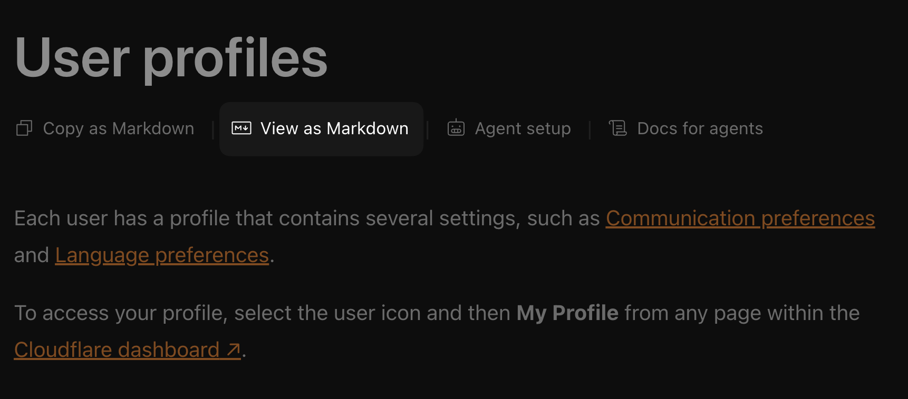
<!-- cdn: https://images.przeprogramowani.pl/lessons/m2-l4/assets/markdown.png -->

```
https://vercel.com/docs/deployments
=>
https://vercel.com/docs/deployments.md
```

Tego typu zmiany to nie tylko chwilowy trend ale dowód na to, jak ważna będzie wkrótce kompatybilność dostarczanych usług z agentami AI. Agent karmiony HTML-em z paywallem, navigation barem, popupami i skryptami spędza tokeny na parsowaniu szumu, a najważniejsza informacja często przed nim uciekają. Dzisiaj nie można sobie na to pozwolić.

### Widoczność usługi w internecie agentów

Dokumentacja to jedna warstwa, ale szersza zmiana zachodzi po stronie samych produktów. Lavanya Shukla zebrała tę obserwację w [trafnym wątku na X](https://x.com/lavanyaai/status/2037589114170789951): w 2026 produkty coraz częściej wybiera nie programista, ale agent, który ma je zaproponować, zainstalować i puścić w ruch jednym strzałem.

Z jej wątku warto wynieść trzy konkretne sygnały:

- **Resend.** Z zera do około 500 tys. deweloperów w rok. Kiedy Claude Code dostaje ogólnego prompta "dodaj obsługę wysyłki maili", w 63% przypadków proponuje właśnie Resend. SendGrid dostaje 7%. Nie dlatego, że Resend nokautuje konkurencję technologicznie. Dlatego, że integracja to *jedno polecenie, jedna zmienna środowiskowa i jedna strona docsów*, którą agent czyta od góry do dołu bez zgadywania.
- **Supabase.** Z 1 mln do 4,5 mln deweloperów w 12 miesięcy. Wzrost ciągnie głównie pojedynczy SDK, jasne typy i markdownowe docsy, z których agent działa, zanim ty zdążysz przeczytać pierwszy akapit.
- **First Successful Execution.** Lavanya nazywa tak pierwsze wywołanie, które agent dowiózł od początku do końca bez interwencji człowieka. To zdarzenie waży najwięcej, bo zostaje w pamięci sesji, w skopiowanych snippetach community i w kolejnych treningach modeli. Pętla wzmacnia się sama.

Cytat, który najmocniej wybrzmiewa: *"your product is no longer your UI. It's your API."* Andrej Karpathy w tym samym duchu rzuca: *"It's 2026. Build. For. Agents."*

Praktyczny wniosek dla researchu z poprzedniej sekcji: Exa i Context7 nie są tylko "wyszukiwarką i docsami". Są też filtrem, który pokazuje, które projekty *chcą* być znalezione przez agenta. A to dzisiaj często pokrywa się z tym, które zadziałają, gdy agent się za nie weźmie.

## 📚 Materiały dodatkowe

- [Context Rot: How Increasing Input Tokens Impacts LLM Performance](https://research.trychroma.com/context-rot) — Chroma Research, 2025; badanie na 18 czołowych modelach (GPT-4.1, Claude Opus 4, Gemini 2.5 i innych) pokazujące, że jakość odpowiedzi spada wraz z długością wejścia - nawet zanim okno się zapełni. Podstawa do nazwania mechanizmu context drift.
- [Effective context engineering for AI agents](https://www.anthropic.com/engineering/effective-context-engineering-for-ai-agents) — Anthropic, 2025; praktyczny przewodnik po zarządzaniu kontekstem (write/select/compress/isolate) jako odpowiedź na context rot. Bezpośrednie tło dla naszego workflow `research -> plan -> implement` z plikami na dysku zamiast długich rozmów.
- [Retrieval-Augmented Generation for Knowledge-Intensive NLP Tasks](https://arxiv.org/abs/2005.11401) — Lewis et al., NeurIPS 2020; background dla mentalnego modelu "pamięć modelu vs retrieval", który leży pod Exa i Context7.
- [Cognitive Biases in Software Engineering: A Systematic Mapping Study](https://arxiv.org/abs/1707.03869) — Mohanani et al.; przegląd bias w SE i uzasadnienie scaffoldingu w workflow z agentem.
- [No Silver Bullet: Essence and Accidents of Software Engineering](https://www.cin.ufpe.br/~phmb/ip/MaterialDeEnsino/BrooksNoSilverBullet.html) — Frederick P. Brooks Jr.; kanoniczny tekst o tym, że nie ma jednego rozwiązania całości.
- [ts-fsrs](https://github.com/open-spaced-repetition/ts-fsrs) — Open Spaced Repetition; TypeScript implementacja FSRS użyta jako kandydat biblioteki w demo ([docs](https://open-spaced-repetition.github.io/ts-fsrs/)).
- [Anki FAQ: spaced repetition algorithm](https://faqs.ankiweb.net/what-spaced-repetition-algorithm) — Anki; tło algorytmiczne FSRS vs SM-2, opcjonalne pogłębienie.
- [Lavanya Shukla on the agent flywheel](https://x.com/lavanyaai/status/2037589114170789951) — wątek X z 2026 o produktach wybieranych przez agentów (Resend, Supabase, "First Successful Execution"); silny sygnał praktyczny, nie twardy dowód.
- Prework [3.3] *Cykl życia wątku i zarządzanie kontekstem* — context engineering Write/Select/Compress/Isolate; tło dla context assessment między fazami.
- Prework [3.2] *Wzorce i antywzorce promptowania* — prompt/plan jako kontrakt; tło dla `plan-brief.md` jako kontraktu decyzji.
- Prework [1.2] *Chatbot vs Agent vs Harness - definicje* — tło dla rozumienia `/10x-research` i Context7 jako tool use w harnessie.
- Prework [4.2] *Dobry i zły projekt kursowy* — MVP z realną logiką biznesową; tło dla traktowania SRS jako logiki biznesowej, nie kolejnego CRUD.
