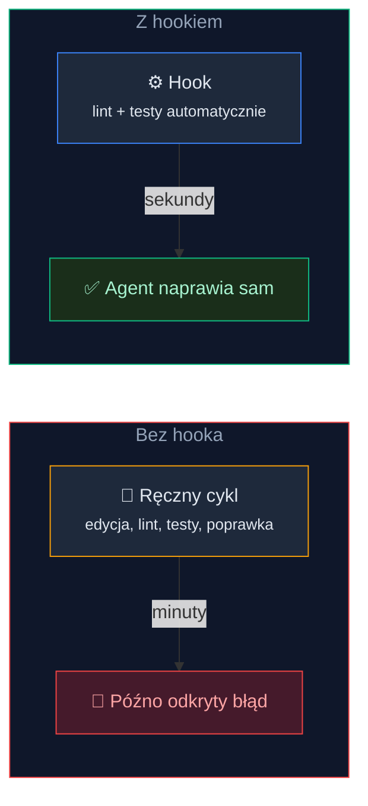
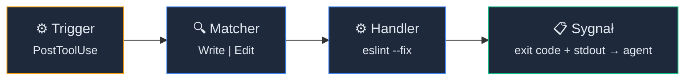
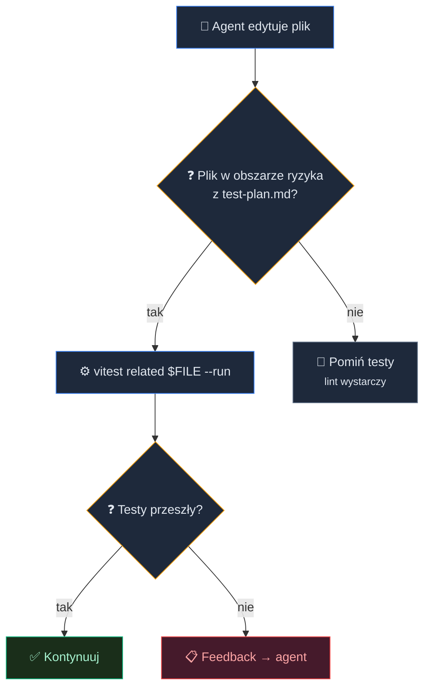
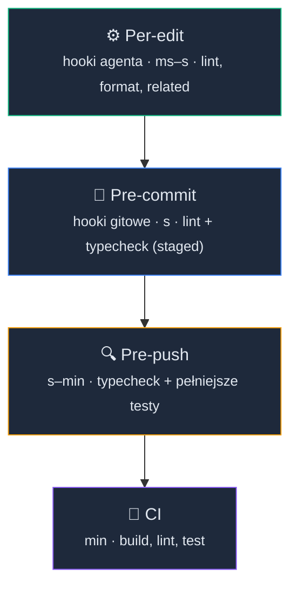

# Hooki i triggery: Agent, który sam reaguje na błędy


<!-- cdn: https://images.przeprogramowani.pl/lessons/m3-l3/assets/cover.jpg -->

W poprzedniej lekcji pisałeś testy z agentem. Pod koniec uruchamiałeś je ręcznie: odpalasz test runnera przez skrypt, czekasz na wynik, poprawiasz i odpalasz jeszcze raz.

Działa? Tak. Ale pomyśl, ile razy w trakcie sesji z agentem sprawdzałeś lint, typy i testy ręcznie. Ile razy agent edytował plik, a ty po kilku minutach odkrywałeś, że coś nie działa.

Przy pracy nad jednym taskiem w małym projekcie to nic wielkiego. Ale z czasem kumuluje się w godziny stracone na powtarzanie tego samego cyklu: edycja, manualna weryfikacja, poprawka, znowu manualna weryfikacja.

A gdyby narzędzie mogło zrobić to za ciebie? Nie przy okazji w ramach pipeline'u CI/CD co jest kosztowne czasowo. Ale we właściwym momencie, lokalnie, po zakończeniu pracy przez agenta.

Harnessy udostępniają nam hooki, które pozwolą poradzić sobie z tym problemem.


<!-- rendered: ../../assets/diagrams-10x/lessons-m3-l3-lesson-draft-1-10x.png | cdn: https://images.przeprogramowani.pl/diagrams/lessons-m3-l3-lesson-draft-1-10x.png -->

### Cykl życia hooka

Zanim skonfigurujesz pierwszy hook, warto zobaczyć wzorzec, który znajdziesz w każdym narzędziu do programowania z AI, które obsługuje hooki.

Każdy hook składa się z czterech części:

1. **Trigger** — zdarzenie w narzędziu. Na przykład agent właśnie zapisał plik.
2. **Matcher** — filtr, który decyduje, czy ten konkretny hook powinien się uruchomić. Może reagować na konkretne narzędzia (`Write`, `Edit`), typy plików albo wzorce nazw.
3. **Handler** — komenda, skrypt albo inna akcja, która się wykonuje. Najczęściej to komenda shell.
4. **Sygnał** — wynik hooka wraca do narzędzia. Exit code mówi, czy wszystko jest OK, a stdout może trafić do kontekstu agenta jako feedback.


<!-- rendered: ../../assets/diagrams-10x/lessons-m3-l3-lesson-draft-2-10x.png | cdn: https://images.przeprogramowani.pl/diagrams/lessons-m3-l3-lesson-draft-2-10x.png -->

Wzorzec jest uniwersalny: Claude Code, Cursor, Codex, Windsurf, Copilot - wszędzie spotkasz te same cztery kroki. Różnią się nazwy zdarzeń i głębokość konfiguracji, ale architektura jest ta sama.

### Pierwszy hook w praktyce

Masz wzorzec. Czas podłączyć go do czegoś konkretnego.

Zanim skonfigurujesz pierwszy hook, pobierz paczkę artefaktów dla tej lekcji:

```bash
npx @przeprogramowani/10x-cli@latest get m3l3
```

Ta paczka dostarcza regułę `CLAUDE-m3l3` (dopisaną do twojego `CLAUDE.md`). Reguła streszcza model hooków z tej lekcji — cykl życia hooka, trzy warstwy lokalnej jakości i wzorzec przenośny między narzędziami — żeby agent miał te zasady pod ręką, kiedy pomaga ci konfigurować hooki.

Najczęstszy pierwszy hook to automatyczny lint po każdej edycji pliku. Konfiguracja w Claude Code wygląda tak:

```json
{
  "hooks": {
    "PostToolUse": [
      {
        "matcher": "Write|Edit",
        "hooks": [
          {
            "type": "command",
            "command": "npx eslint --fix . --quiet",
            "timeout": 10000
          }
        ]
      }
    ]
  }
}
```

Hooki konfigurujemy w ustawieniach harnessu, dla Claude Code to `settings.json`, który może żyć w trzech miejscach:

- `~/.claude/settings.json` — ustawienia globalne użytkownika,
- `.claude/settings.json` — ustawienia projektu (commituj do repo),
- `.claude/settings.local.json` — lokalne nadpisania (dodaj do `.gitignore`).

Jak to działa? Agent edytuje plik narzędziem Write albo Edit. Hook `PostToolUse` odpala się po tej akcji.

Matcher `Write|Edit` sprawdza, czy narzędzie pasuje. Jeśli tak, ESLint z `--fix` poprawia to, co potrafi naprawić automatycznie. Exit code 0 oznacza sukces.

Zwróć uwagę, że ta komenda uruchamia ESLint na całym projekcie. W małych projektach to wystarczające i prostsze niż parsowanie ścieżki pliku. Bardziej precyzyjne dopasowanie per-file zobaczysz w sekcji o hookach do testów.

### Typecheck i pytanie o szybkość

Skoro lint działa, naturalny następny krok to typecheck. Do listy hooków `PostToolUse` dodajesz kolejny:

```json
{
  "type": "command",
  "command": "npx tsc --noEmit",
  "timeout": 30000
}
```

I tu pojawia się pytanie, które wraca przy każdym nowym hooku: jak szybko to musi działać, żeby się opłacało?

Hooki mają swoją cenę: blokują pętlę agenta. Dopóki hook się nie zakończy, agent czeka. To nie wada, to mechanizm: agent dostaje feedback przed kolejną iteracją.

Ale jeśli hook zajmuje 30 sekund, te 30 sekund czekasz na każdą edycję. Mnożysz to przez kilkadziesiąt edycji w sesji i robi się poważnie.

Praktyczna heurystyka: jeśli check trwa dłużej niż kilka sekund, rozważ przeniesienie go na moment commita albo pusha.

Lint i format z wykrywaniem ścieżki? Idealne per-edit, szybkie. Typecheck? W małych projektach działa per-edit. W większych lepiej sprawdza się jako bramka commitowa. Pełny zestaw testów? Zdecydowanie moment commita albo pusha.

Nie ma sztywnych progów. Obserwuj, jak hook wpływa na tempo pracy agenta, i dostosuj. Jeśli zaczyna cię irytować, to sygnał, że sprawdzenie powinno zmienić warstwę lub ulepszyć o uruchomienie na ograniczonym zestawie plików.

### Testy tylko tam, gdzie trzeba

Lint i typecheck pilnują składni. Ale prawdziwe błędy łapią testy.

Najcenniejszy hook to taki, który uruchamia testy powiązane z edytowanym plikiem. Nie cały zestaw. Tylko te, które importują zmieniony moduł.

Większość narzędzi do uruchamiania testów obsługuje ten scenariusz. W Vitest wygląda to tak:

```bash
vitest related src/server/auth.ts --run
```

Uwaga na składnię: `related` to subkomenda, nie flaga `--related`. Vitest sprawdza statyczny graf importów i uruchamia tylko testy, które bezpośrednio lub pośrednio zależą od wskazanego pliku.

Flaga `--run` zapobiega trybowi watch. Bez niej hook nie zakończy się i nie zwróci exit code.

PostToolUse hooks dostają kontekst zdarzenia jako JSON na stdin. Żeby wyciągnąć ścieżkę edytowanego pliku, parsujesz `tool_input.file_path`. Ten przykład korzysta z `jq` — upewnij się, że masz go zainstalowanego (`brew install jq` na macOS, `apt install jq` na Ubuntu/Debian, `winget install jqlang.jq` lub `choco install jq` na Windows):

```json
{
  "type": "command",
  "command": "bash -c 'FILE=$(jq -r .tool_input.file_path) && npx vitest related \"$FILE\" --run'",
  "timeout": 30000
}
```

Ale nie każda edycja wymaga uruchomienia testów. Utility helper, plik konfiguracyjny, komponent prezentacyjny — to nie muszą być pliki, dla których sensownie jest odpalać testy po każdej edycji.

Tutaj wraca `context/foundation/test-plan.md` z M3L1. Opisane tam obszary ryzyka mówią ci, które fragmenty kodu są warte automatycznego sprawdzenia po edycji.


<!-- rendered: ../../assets/diagrams-10x/lessons-m3-l3-lesson-draft-3-10x.png | cdn: https://images.przeprogramowani.pl/diagrams/lessons-m3-l3-lesson-draft-3-10x.png -->

Jedno ograniczenie warto znać od razu: PostToolUse odpala się raz na jedno użycie narzędzia. Jeśli agent edytuje trzy pliki w jednej turze, hook odpali się trzy razy niezależnie. Jeżeli Twoje testy wykonują się szybko (a powinny), to nie będzie to problematyczne. W innym przypadku musisz dodać bardziej restrykcyjny Matcher, co już w dużym stopniu zależy od stacku technologicznego i architektury projektu - warto nad tym poiterować wspólnie z agentem.

Jeśli używasz Vitest 4.1+, ustaw w środowisku hooka `AI_AGENT=1`. Vitest przełączy się na kompaktowy format wyjścia, który wypisuje tylko awarie. Mniej szumu w kontekście agenta, mniej zużytych tokenów:

```
"command": "AI_AGENT=1 bash -c 'FILE=$(jq -r .tool_input.file_path) && npx vitest related \"$FILE\" --run'",
```

### Agent widzi i reaguje

Tu zaczyna się różnica między hookiem agentowym a klasycznym hookiem gitowym.

Kiedy PostToolUse hook zwraca exit code 2, narzędzie traktuje to jako błąd blokujący. Agent widzi wynik hooka w swoim kontekście przy następnym zapytaniu do modelu.

Trzy exit codes, które warto zapamiętać:

- **0** — sukces, hook przeszedł, kontynuuj.
- **2** — błąd blokujący, agent widzi feedback i powinien zareagować.
- **inny** — błąd nieblokujący, logowany, ale nie przerywa pracy.

Co to oznacza w praktyce? Jeśli lint albo typecheck zwróci błąd, agent nie tylko wie, że coś poszło nie tak. Widzi konkretny komunikat: brakujący typ, niezaimportowany moduł, źle sformatowana linia.

I może to naprawić sam, w następnej iteracji, bez twojej interwencji.

Jest jednak granica. Trywialne korekty (poprawienie formatowania, dodanie brakującego importu, naprawienie typu) agent ogarnie sam.

Ale jeśli test pada z powodu złej logiki biznesowej? Hook to pokaże, ale agent niekoniecznie zdiagnozuje prawdziwą przyczynę. Mówi "coś jest nie tak" i próbuje naprawić "na chłopski rozum" (co może zakończyć się jedynie pozornym sukcesem).

Przy bardziej złożonych problemach, gdy agent przyznaje się do porażki lub nie jesteś zadowolony z jego fixa, warto utworzyć dedykowane change z pełnym workflow: /10x-new → /10x-research (opcjonalnie) → /10x-plan → /10x-implement


### Trzy warstwy lokalnej jakości

Do tej pory mówiliśmy o hookach per-edit. To dopiero pierwsza warstwa.

Pełny model lokalnej jakości składa się z trzech warstw plus CI jako czwartej:


<!-- rendered: ../../assets/diagrams-10x/lessons-m3-l3-lesson-draft-4-10x.png | cdn: https://images.przeprogramowani.pl/diagrams/lessons-m3-l3-lesson-draft-4-10x.png -->

Każda warstwa łapie co innego i działa w innym momencie.

**Per-edit (hooki agentowe)** działają najszybciej. Łapią formatowanie, proste błędy typów i padające testy jednostkowe.

Feedback wraca do agenta w sekundach. To jedyna warstwa, która może podać agentowi feedback w trakcie jego pracy.

**Pre-commit (hooki gitowe)** łapią to, co prześlizgnęło się przez per-edit: ręczne edycje bez agenta, pliki zmienione poza hookiem albo sprawdzenia zbyt wolne na per-edit. Operują na staged files, więc sprawdzają dokładnie to, co trafi do commita.

**Pre-push** uruchamia cięższe sprawdzenia przed wysłaniem kodu do remote'a. Dobre miejsce na pełny typecheck albo szerszy zestaw testów.

**CI** to ostatnia siatka bezpieczeństwa. Łapie problemy integracyjne, zależności między modułami i sprawdzenia wymagające infrastruktury niedostępnej lokalnie.

Trzy warstwy lokalne nie zastępują CI. CI nadal jest kluczową weryfikacją dla współdzielonego stanu repozytorium i środowisk, których nie kontrolujesz. Ale każda warstwa lokalna, która łapie błąd, to jeden cykl mniej czekania na odpowiedź z CI.

Brzmi jak dużo warstw? W praktyce każda to kilka linii konfiguracji.

### Bramka na poziomie commita

Hooki agentowe działają, kiedy agent pracuje. Ale nie każda zmiana przechodzi przez agenta. Czasem edytujesz plik ręcznie, czasem kolega pushuje commit z laptopa bez hooków.

Warstwa pre-commit wymaga narzędzia do zarządzania hookami gitowymi — i tu wybór zależy od twojego stacku. Zasada jest jedna i uniwersalna: uruchom sprawdzenia na staged files przed commitem. Samo narzędzie to detal implementacyjny, więc sięgnij po standard swojego ekosystemu:

- **Node/TypeScript** — Husky z lint-staged. Jeśli masz je z 10x-astro-start, to masz tę warstwę gotową i nie musisz nic zmieniać.
- **Python** — framework `pre-commit` (pre-commit.com) to de facto standard, z gotowym katalogiem hooków dla `ruff`, `black`, `mypy` i setek innych narzędzi.
- **Dowolny język** — Lefthook jest agnostyczny stackowo: jedna konfiguracja YAML, równoległe uruchamianie komend, brak zależności od Node.js. Wpinasz w niego dowolne komendy — `gofmt` i `golangci-lint` w Go, `cargo fmt` i `cargo clippy` w Rust, `rubocop` w Ruby.

Mechanika jest wszędzie taka sama, więc pokażę ją na Lefthook, bo działa niezależnie od języka. Minimalny `lefthook.yml` — tutaj z komendami dla projektu TypeScript, ale podmień je na narzędzia swojego stacku:

```yaml
pre-commit:
  parallel: true
  commands:
    lint:
      glob: "*.{ts,tsx,js,jsx}"
      run: npx eslint --fix {staged_files} && git add {staged_files}
    typecheck:
      run: npx tsc --noEmit
    test:
      glob: "*.{ts,tsx}"
      run: npx vitest related {staged_files} --run
```

`{staged_files}` wstawia listę plików dodanych do staging area. Lint i testy operują na dokładnie tych zmianach, które zamierzasz commitować. `pre-commit` i lint-staged mają własne odpowiedniki tego mechanizmu.

`parallel: true` uruchamia komendy równolegle.

Instalacja:

```bash
brew install lefthook   # albo: npm install lefthook
lefthook install        # tworzy hooki gitowe w .git/hooks
```

Po `lefthook install` hooki gitowe uruchamiają się automatycznie przy `git commit`. Nie musisz o tym pamiętać, i o to właśnie chodzi. Automatyczna bramka, której nie ominiesz przez nieuwagę.

### Ten sam wzorzec w każdym narzędziu

Pokazaliśmy szczegóły w Claude Code, ale wzorzec trigger → match → check → signal przenosi się na każde narzędzie. Różnice dotyczą głębokości, nie architektury.

| Narzędzie | Zdarzenia | Handlery | Context injection | Konfiguracja |
|---|---|---|---|---|
| Claude Code | ~30 | command, http, mcp_tool, prompt, agent | tak | `.claude/settings.json` |
| Cursor | ~18 | command, prompt | tak | `.cursor/hooks.json` |
| Codex | 10 | command | tak | `~/.codex/config.toml` lub `.codex/hooks.json` |
| Windsurf | 12 | command | **nie** | `.windsurf/hooks.json` |
| Copilot | ~13 | command, http, prompt | tak (VS Code) | `.github/hooks/*.json` |

Najważniejsza różnica: context injection. Claude Code, Cursor, Codex i Copilot (w VS Code) mogą podać wynik hooka agentowi. Windsurf nie ma tej możliwości. Linki do dokumentacji hooków każdego narzędzia znajdziesz w sekcji Materiały dodatkowe.

Hooki Windsurfa mogą zablokować akcję (exit code 2), ale nie potrafią przekazać agentowi, co poszło nie tak. Agent wie, że coś się nie udało. Nie wie co. Dla automatycznej korekty to poważne ograniczenie.

Druga różnica, na której łatwo się potknąć: Codex ma model zaufania oparty na hashach. Hooki zdefiniowane w repozytorium (`.codex/hooks.json` albo sekcja `[hooks]` w projektowym `config.toml`) nie odpalą się, dopóki nie przejrzysz ich i nie zatwierdzisz komendą `/hooks` — każda zmiana hooka wymaga ponownego zatwierdzenia. Hooki user-level w `~/.codex/config.toml` nie przechodzą przez bramkę zaufania projektu, dlatego u wielu osób "działa config.toml, a nie hooks.json". To nie błąd konfiguracji, tylko świadoma bariera bezpieczeństwa: hook z repo to kod, który ktoś mógł podrzucić w pull requeście.

Kompatybilność Copilota z formatem Claude też ma granice. VS Code czyta `.claude/settings.json`, ale ignoruje matchery (hook odpala się przy każdym zdarzeniu danego typu), używa innych nazw narzędzi (`create_file` zamiast `Write`) i innych nazw pól w payloadzie (camelCase: `tool_input.filePath` zamiast `tool_input.file_path`). Hook skopiowany 1:1 z Claude Code zwykle wymaga adaptacji, zanim zadziała.

1Password opublikował repozytorium `agent-hooks`, które jednym skryptem instaluje te same hooki do `.cursor/hooks.json`, `.claude/settings.json` i `.windsurf/hooks.json`. Jedno źródło hooków, wiele narzędzi: to pokazuje duże podobieństwo na poziomie architektury. Może doczekamy się oficjalnego standardu, jak w przypadku Agent Skills.

### Hooki a test-plan.md

Wróćmy do punktu wyjścia. W m3-l1 stworzyłeś `context/foundation/test-plan.md` ze strategią i bramkami jakości, w m3-l2 pisałeś testy na podstawie obszarów ryzyka.

Hooki zamykają tę pętlę. Zamieniają bramki z deklaracji w automatyczną weryfikację.

Pytanie, które warto sobie zadać przy każdej bramce z planu: czy to sprawdzenie jest wystarczająco szybkie na per-edit? Czy powinno czekać na commit? A może potrzebuje pełnego środowiska i należy do pre-push albo CI?

Weźmy konkretny przykład. W projekcie 10xcards sekcja Quality Gates w `test-plan.md` definiuje bramki z oznaczeniem, kiedy stają się wymagane:

- **lint + typecheck** — wymagane od początku. Szybkie, więc mogą działać per-edit albo jako bramka commitowa. Projekt wybrał pre-commit przez Husky.
- **unit + integration** — wymagane po pierwszej fazie rollout'u. Testy na staged files w pre-commit.
- **e2e na krytycznych flow'ach** — wymagane po szóstej fazie. Cięższe, więc pre-push (ręcznie, dopóki nie stanie CI).
- **CI gating** — jawnie odroczone, nie w v1.
- **post-edit hooki / visual diff** — jawnie odroczone, nie w v1.

Zwróć uwagę: sam plan testów zdecydował, że hooki per-edit jeszcze się nie opłacają w tej fazie projektu. I to jest uprawniony wybór. Trzy warstwy to menu, nie nakaz. Zacznij tam, gdzie stosunek kosztu do sygnału jest najlepszy dla twojego projektu.

Nie musisz konfigurować tego perfekcyjnie za pierwszym razem. Zacznij od jednego hooka per-edit (lint) i jednej bramki commitowej. Dodawaj kolejne warstwy, gdy zobaczysz, jakie problemy Ci uciekają.

Hooki łapią błędy na poziomie kodu: format, typy, unit testy. Nie łapią tego, co widzi użytkownik: przesuwający się layout, zepsuta nawigacja, niedostępny formularz. Do tego potrzebujesz przeglądarki, Playwrighta i scenariuszy E2E, które postawimy w następnej lekcji.

## 🧑🏻‍💻 Zadania praktyczne

### Skonfiguruj hook lint + typecheck

W swoim projekcie kursowym skonfiguruj hook per-edit, który uruchamia linter po każdej edycji pliku przez agenta. Dodaj drugi hook z typecheckiem.

W zależności od narzędzia:

- **Claude Code**: `PostToolUse` z matcherem `Write|Edit` w `.claude/settings.json` ([dokumentacja](https://docs.anthropic.com/en/docs/claude-code/hooks))
- **Cursor**: `afterFileEdit` w `.cursor/hooks.json` ([dokumentacja](https://docs.cursor.com/configuration/hooks))
- **Codex**: `PostToolUse` w `~/.codex/config.toml` (sekcja `[hooks]`) lub `.codex/hooks.json`; pamiętaj, że hooki z repozytorium musisz najpierw zatwierdzić komendą `/hooks` ([dokumentacja](https://developers.openai.com/codex/hooks))
- **Copilot**: hooki w `.github/hooks/*.json`; w VS Code Copilot czyta też format `.claude/settings.json`, ale kompatybilność jest częściowa — matchery są ignorowane, nazwy narzędzi i pól payloadu są inne (`create_file` zamiast `Write`, `tool_input.filePath` zamiast `tool_input.file_path`), więc hook z Claude Code wymaga adaptacji ([dokumentacja](https://code.visualstudio.com/docs/copilot/customization/hooks))

Wybierz swoje narzędzie, skonfiguruj oba hooki i przetestuj: poproś agenta o edycję pliku i sprawdź, czy hooki się odpalają.

Jeśli hook odpala się, ale agent nie widzi feedbacku, sprawdź exit code. Pamiętaj: exit code 2 to sygnał blokujący, który trafia do kontekstu. Inne kody niż 0 i 2 są logowane, ale nie blokują pracy.

Jeśli typecheck spowalnia agenta przy większym projekcie, przenieś go do pre-commit.

### (Opcjonalne) Dodaj scoped test trigger

Wybierz najwyższy obszar ryzyka z `context/foundation/test-plan.md` i skonfiguruj hook, który uruchamia tylko testy powiązane z edytowanym plikiem. Większość test runnerów ma taką opcję — w Vitest to `vitest related $FILE --run`, w Jest `jest --findRelatedTests $FILE`.

- Sparsuj ścieżkę edytowanego pliku ze stdin hooka (np. przez `jq -r .tool_input.file_path`)
- Jeśli używasz Vitest 4.1+, ustaw `AI_AGENT=1` w środowisku hooka dla kompaktowego wyjścia
- Przetestuj: poproś agenta o edycję pliku w obszarze ryzyka i sprawdź, czy testy się uruchamiają
- Porównaj: edytuj plik poza obszarem ryzyka i upewnij się, że testy się nie odpalają (lub odpalają się szybko, bez fałszywych alarmów)

Twój test runner prawdopodobnie ma podobną opcję — sprawdź dokumentację.

### (Opcjonalne) Dodaj bramkę pre-commitową

Dodaj do projektu hook gitowy `pre-commit`, który uruchamia lint i testy na staged files przed commitem. Nie narzucamy narzędzia, sięgnij po standard swojego stacku - jeżeli nie masz tutaj doświadczenia/opinii, zrób research z agentem.

Jeśli chcesz zrozumieć, na czym te narzędzia bazują, zajrzyj do [dokumentacji git hooks](https://git-scm.com/docs/githooks) — opisuje hook `pre-commit` i pozostałe punkty zaczepienia gita, które te narzędzia tylko opakowują.

### (Opcjonalne) Przetłumacz hook na drugie narzędzie

Weź jeden z hooków, które właśnie skonfigurowałeś, i zapisz jego odpowiednik dla drugiego narzędzia (Cursor, Codex lub Copilot). Nie musisz go wdrażać. Chodzi o przećwiczenie przenoszenia wzorca: trigger → match → check → signal działa tak samo, zmienia się format konfiguracji.

## Odbierz swoją odznakę

Po ukończeniu tej lekcji odbierz odznakę w sekcji [10xDevs Mission Log](https://platforma.przeprogramowani.pl/10xdevs-3/mission-log) a następnie pochwal się swoim osiągnięciem!

## 🔎 Deep Dive

Ta sekcja zawiera dodatkowe pogłębienie wiedzy na temat wybranych zagadnień związanych z lekcją. W tym Deep Dive znajdziesz:

- **Performance hooków** — jak pogodzić dokładność sprawdzeń z szybkością pętli agenta i kiedy przenosić cięższe sprawdzenia na wyższe warstwy.
- **Inne typy handlerów** — co jeszcze potrafią hooki poza komendami shell: HTTP, MCP i eksperymentalny handler agentowy.
- **Niezawodność hooków** — kiedy hook może się nie odpalić i jak to zdiagnozować.

Ta sekcja lekcji nie jest obowiązkowa, ale warto się z nią zapoznać jeżeli chcesz zostać ekspertem.

### Performance hooków

W głównej części lekcji mówiliśmy o ogólnej heurystyce: jeśli sprawdzenie trwa dłużej niż kilka sekund, przenieś go wyżej. Tutaj trochę więcej szczegółów.

**Per-edit (PostToolUse):** formatter na jednym pliku to ułamek sekundy. Typecheck w małym projekcie to kilka sekund.

Powiązane testy zależą od rozmiaru grafu importów. Kilka prostych testów jednostkowych to sekundy, rozbudowany zestaw to znacznie więcej.

**Pre-commit (Lefthook / lint-staged):** lint + format na staged files działają szybko. Typecheck sprawdza się dobrze jako bramka commitowa, nawet w większych projektach.

`vitest --changed` uruchamia testy powiązane z plikami zmodyfikowanymi w git, co ogranicza zakres do tego, co faktycznie się zmieniło.

Claude Code wspiera `async: true` na hookach, które nie muszą blokować. Taki hook uruchamia się w tle i nie wstrzymuje agenta. Przydatne dla weryfikacji informacyjnych, na przykład logowania statystyk albo wysyłania notyfikacji.

### Inne typy handlerów

Poza standardowym `command` Claude Code wspiera dodatkowe typy handlerów:

- **`http`** — wysyła żądanie do zewnętrznego endpointu. Przydatny w zespołach, które centralizują logikę sprawdzeń na serwerze.
- **`mcp_tool`** — wywołuje narzędzie MCP. Hook korzysta z tego samego ekosystemu narzędzi co agent.
- **`prompt`** — instrukcja dla modelu oceniająca wynik hooka. Domyślny timeout 30 sekund.
- **`agent`** — eksperymentalny handler, który uruchamia mini-agenta jako reakcję na zdarzenie. Domyślny timeout 60 sekund. Na ten moment traktuj jako ciekawostkę do obserwowania, nie jako produkcyjny mechanizm.

Cursor i Copilot wspierają `command` i `prompt`. Codex parsuje inne typy, ale faktycznie wykonuje tylko `command`. Windsurf obsługuje wyłącznie komendy shell.

PreToolUse hooki w Claude Code potrafią też modyfikować dane wejściowe narzędzia (przez `updatedInput`) i podejmować decyzje o uprawnieniach (`allow`, `deny`, `ask`). Otwiera to ciekawą możliwość: hook, który automatycznie dodaje kontekst do operacji agenta albo blokuje niebezpieczne akcje, zanim się wykonają.

### Niezawodność hooków

Hooki to mechanizm deterministyczny: konfigurujesz, środowisko odpala. Tyle że środowisko musi ten hook faktycznie wyzwolić. A to nie zawsze jest oczywiste.

Znane ograniczenia w połowie 2026:

- Stop hooki w Claude Code mają zgłoszone problemy w kontekście Skills i Plugins. PostToolUse hooki, na których opiera się ta lekcja, nie są dotknięte tymi problemami.
- Codex ma niekompletne przechwytywanie PreToolUse dla niektórych typów narzędzi.
- Codex pomija hooki projektowe (z `.codex/` w repo), dopóki ich nie zatwierdzisz komendą `/hooks` — i robi to po cichu. Jeśli hook z repo się nie odpala, a ten z `~/.codex/config.toml` działa, to niemal na pewno brakujące zatwierdzenie, nie zła składnia.
- Copilot w VS Code parsuje matchery z formatu Claude, ale ich nie egzekwuje — hook odpala się przy każdym zdarzeniu danego typu. Do tego payload używa camelCase, więc skrypt czytający `tool_input.file_path` dostanie pustą wartość.
- Copilot Cloud Agent (wersja chmurowa) ma najwęższy zestaw możliwości: krótkotrwały sandbox, `ask` traktowany jako `deny`. Organizacja może też całkowicie wyłączyć hooki politykami.

Praktyczna zasada: przetestuj swoje hooki po konfiguracji. Jeśli hook nie odpala się zgodnie z oczekiwaniami, sprawdź GitHub Issues swojego narzędzia. Hooki PostToolUse z handlerem `command` to najbardziej niezawodna kombinacja we wszystkich narzędziach.

To warto podkreślić: hooki to warstwa deterministyczna. Przetrwają kompresję kontekstu, zmianę instrukcji systemowych, "zapomnienie" przez model.

Instrukcja w `CLAUDE.md` może zostać skompresowana albo zignorowana w długim kontekście. Hook odpali się zawsze, bo działa poza modelem.

## 📚 Materiały dodatkowe

- [Claude Code Hooks](https://docs.anthropic.com/en/docs/claude-code/hooks) — oficjalna dokumentacja: zdarzenia, handlery, matchery, exit codes, konfiguracja na trzech poziomach
- [Cursor Hooks](https://docs.cursor.com/configuration/hooks) — dokumentacja hooków: zdarzenia, `afterFileEdit`, opcja `failClosed`
- [Codex Hooks](https://developers.openai.com/codex/hooks) — dokumentacja hooków: zdarzenia, lokalizacje konfiguracji (`config.toml` i `hooks.json`), hash-based trust model, ograniczenia
- [Windsurf Cascade Hooks](https://docs.windsurf.com/windsurf/cascade/hooks) — dokumentacja hooków: zdarzenia, brak context injection
- [Copilot Coding Agent Hooks](https://docs.github.com/en/copilot/customizing-copilot/extending-copilot-coding-agent/configuring-coding-agent-hooks) — dokumentacja hooków: runtime'y (cloud, VS Code, CLI), kompatybilność z `.claude/settings.json`
- [VS Code Copilot Hooks](https://code.visualstudio.com/docs/copilot/customization/hooks) — dokumentacja hooków w VS Code: lokalizacje konfiguracji (`chat.hookFilesLocations`), różnice względem Claude Code (ignorowane matchery, camelCase, inne nazwy narzędzi)
- [Vitest CLI](https://vitest.dev/guide/cli.html) — dokumentacja CLI z subkomendą `related` i flagą `--changed` do uruchamiania testów powiązanych z plikiem
- [Vitest 4.1](https://vitest.dev/blog/vitest-4-1.html) — agent reporter, kompaktowe wyjście dla agentów AI, `AI_AGENT=1`
- [Lefthook](https://github.com/evilmartians/lefthook) — git hook manager z jednym plikiem YAML, interpolacją `{staged_files}`, równoległym uruchamianiem i brakiem zależności od Node.js
- [pre-commit](https://pre-commit.com/) — wielojęzykowy framework do hooków gitowych, de facto standard w ekosystemie Pythona, z gotowym katalogiem hooków dla wielu narzędzi
- [Git Hooks](https://git-scm.com/docs/githooks) — oficjalna dokumentacja gita: hook `pre-commit` i pozostałe punkty zaczepienia, na których bazują Husky, Lefthook i pre-commit
- [1Password agent-hooks](https://github.com/1Password/agent-hooks) — skrypt instalujący te same hooki do wielu narzędzi naraz, praktyczny dowód konwergencji architektury hooków
- [Git Hooks with Lefthook](https://stevekinney.com/courses/self-testing-ai-agents/git-hooks-with-lefthook) — Steve Kinney, praktyczny setup Lefthook w kontekście AI agent workflows
- [AI agent hooks](https://www.speakeasy.com/resources/ai-agent-hooks) — Speakeasy, analiza hooków jako interfejsu kontroli agentów AI
- [Commit Hooks with AI Agents](https://egghead.io/commit-hooks-are-critical-with-ai-agents-in-cursor~jhoer) — Egghead.io, dlaczego pre-commit hooki są kluczowe przy pracy z agentami
- Prework [2.4] *Agent-Native IDE* — dyscyplina bezpieczeństwa (czysty repo, testy, review, diffy), którą hooki automatyzują
- Prework [1.3] *Jak uczyć się i rozwijać z AI* — tryb korepetytora, tutaj zastosowany do hooka, który uczy agenta reagować na błędy
- Prework [2.2] *Cursor — Podstawy operacyjne* i [2.3] *Claude Code — Podstawy operacyjne* — podstawy konfiguracji narzędzi, na których opiera się konfiguracja hooków
