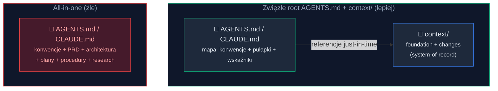
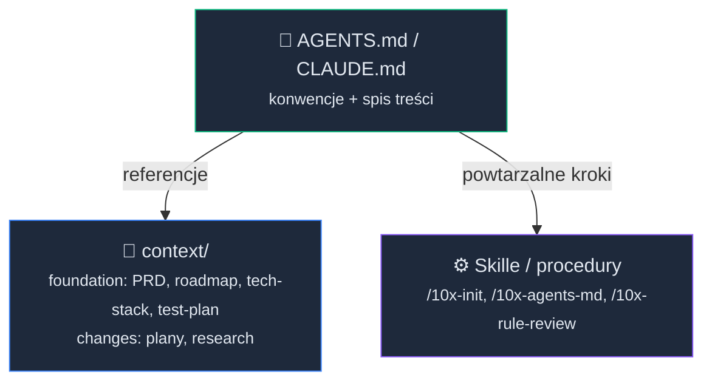
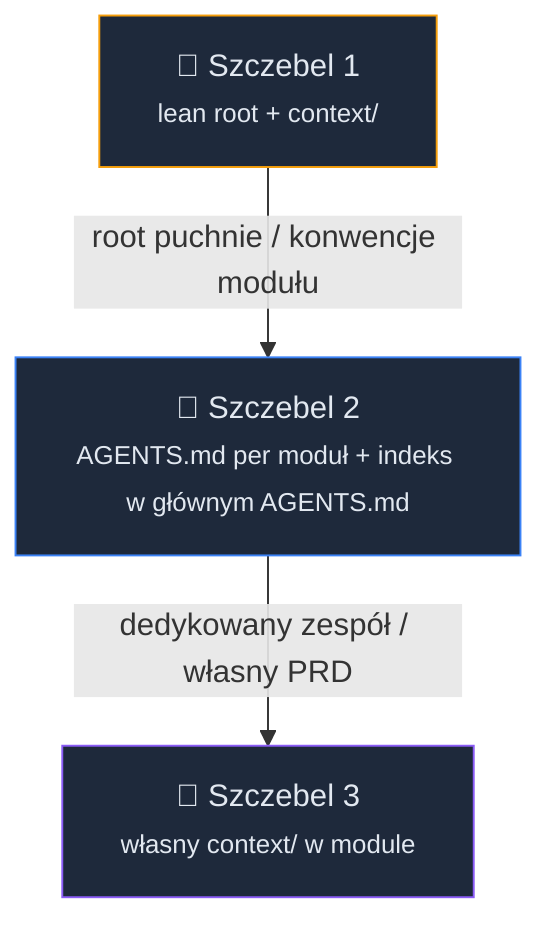
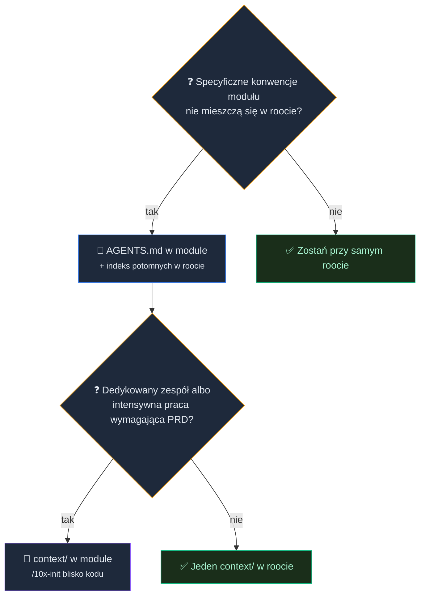
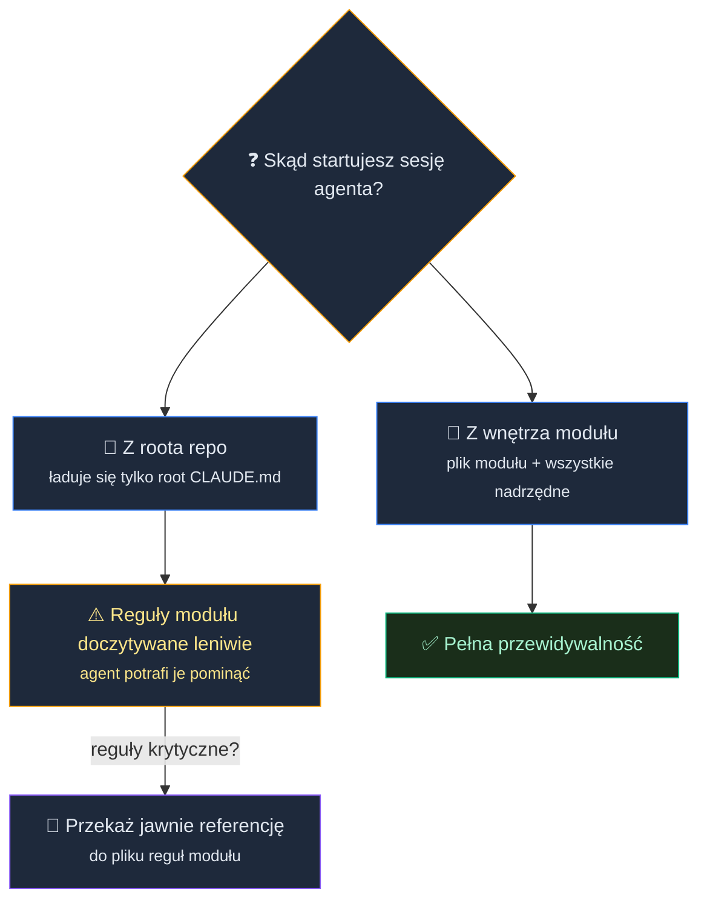
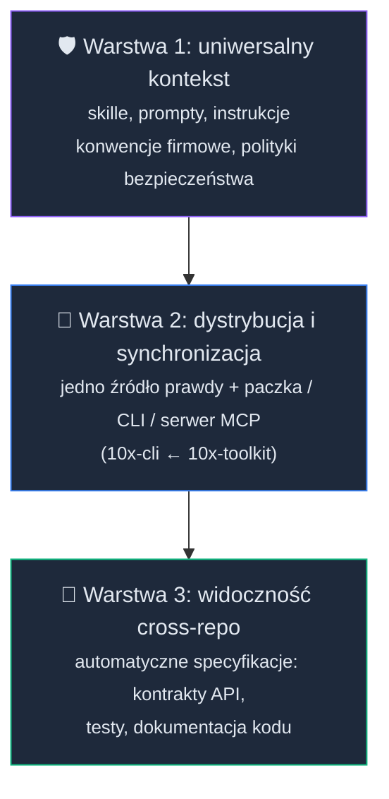

# Skalowanie kontekstu dla AI w dużych projektach


<!-- cdn: https://images.przeprogramowani.pl/lessons/m4-l1/assets/cover.png -->

W lekcji Agent Onboarding (M1L4) wdrożyliśmy agenta do **jednego** projektu: powstał zwięzły `AGENTS.md` na 50-100 linijek. Działało, bo projekt nie urósł jeszcze do skali, w której jeden plik przestaje mieścić wszystkie konwencje i procedury całego systemu.

Witaj w module czwartym. Tu pracujemy z projektami **dużymi i legacy**, czyli takimi, które mają kilka modułów, własne podsystemy i historię, której nikt już w całości nie pamięta.

I tutaj pierwszy odruch zawodzi. "Skoro `AGENTS.md` działa, to po prostu będę do niego dopisywał kolejne instrukcje" brzmi rozsądnie, ale tylko do czasu. W pewnym momencie plik staje się tak duży (300+ linijek), że agent zaczyna gubić w nim najważniejsze reguły.

Drugi odruch jest odwrotny i równie kosztowny: na wszelki wypadek tworzysz pliki instrukcji w każdym folderze i bierzesz na siebie ciężar zarządzania tą rozproszoną architekturą kontekstu, zanim projekt naprawdę tego potrzebuje. Płacisz wtedy za utrzymanie struktury, z której niewiele wynika.

Cały ten moduł zaczynamy więc nie od zadań, tylko od fundamentu. Najpierw omówimy **architekturę kontekstu, która skaluje się razem z projektem**, a dopiero potem bierzemy się za wyzwania: mapowanie kodu, analizę feature'ów, refaktoryzację i modernizację legacy.

To zresztą stały rytm tego modułu. Każda lekcja zaczyna się od konkretnego bólu, który czujesz na dużym albo legacy kodzie, a dopiero potem wchodzi technika, która ten ból adresuje. Lekcje wyzwaniowe, od drugiej wzwyż, działają według tego samego schematu: **soczewka** (na co patrzymy), **narzędzia i dane** (które pozwalają na ekstrakcję i transformację informacji z repozytorium) oraz **element raportu** (co z tej pracy zostaje). Ta lekcja jest fundamentem pod cały moduł: jej soczewką jest architektura kontekstu, ale pierwszy element raportu powstanie dopiero w lekcji drugiej.

Pytanie w tej lekcji nie brzmi "co agent powinien wiedzieć?". Brzmi: co agent powinien wiedzieć **właśnie teraz**?

### Ekonomia kontekstu przy dużej skali

Zacznijmy od mechanizmu, bo bez niego reszta lekcji byłaby tylko zbiorem reguł do zapamiętania.

W preworku [3.1] pojawiło się pojęcie *Maximum Effective Context Window*: okno kontekstowe jest skończonym zasobem, a jego użyteczność spada, im więcej do niego wrzucisz. Model ma do dyspozycji ograniczony **budżet uwagi**, a nie nieograniczony magazyn.

Mimo rosnącej popularności modeli z oficjalnym oknem miliona tokenów, ta górna granica jest mocno zawyżona względem okna efektywnego. Orientacyjnie: najmocniejsze modele trzymają jakość do około 250 tysięcy tokenów, a większość tańszych alternatyw wyraźnie traci już w okolicach 100 tysięcy. Traktuj te liczby kierunkowo, bo degradacja zależy od modelu i typu zadania.

W lekcji o onboardingu (M1L4) patrzyliśmy na to z poziomu pojedynczego pliku. Teraz przenosimy tę samą zasadę wyżej, na poziom **architektury plików i katalogów** w dużym projekcie. Im więcej kontekstu trzymasz "na stałe", tym mniej uwagi zostaje na bieżące zadanie, a jakość pracy agenta stopniowo spada.

Ta sama zasada zaraz odbije się echem przy kodzie: skoro uwaga jest skończona, to agent (i ty) nie przeczyta całego repo na raz. To **progresywne ujawnianie skali**: wątek, który będzie wracał przez cały moduł, gdy zaczniemy świadomie czytać coraz węższe fragmenty kodu. Ale do tego wrócimy w kolejnych lekcjach.

Co konkretnie psuje się, gdy jeden plik instrukcji rośnie bez końca? Zespół OpenAI w tekście o [harness engineering](https://openai.com/index/harness-engineering/) nazywa cztery tryby awarii monolitycznego kontekstu:

- **Wypycha zadanie** - im więcej stałych instrukcji, tym mniej miejsca i uwagi zostaje na to, co robisz tu i teraz.
- **Rozcieńcza wskazówki** - kiedy wszystko jest ważne, nic nie jest ważne, a kluczowa reguła ginie wśród dziesiątek pobocznych.
- **Gnije** - reguły dezaktualizują się szybciej, niż ktokolwiek je przegląda, i plik zamienia się w zbiór nieaktualnych zasad.
- **Utrudnia weryfikację** - im dłuższy plik, tym trudniej sprawdzić, czy agent w ogóle się go trzyma.

To nie jest teoria oderwana od praktyki. Anthropic również ostrzega, że **przepełniony `CLAUDE.md` sprawia, że Claude ignoruje twoje realne instrukcje**. Nie dlatego, że je odrzuca, tylko dlatego, że gubią się w szumie.

Opisują to także dwa badania, które znajdziesz na końcu lekcji w sekcji Deep Dive. Na teraz potrzebujesz z nich jednego wniosku: nadmiarowy, zbędny kontekst potrafi nie tylko nie pomóc, ale i podnieść koszt oraz pogorszyć wynik. To akurat zmierzono na agencie OpenAI Codex, dla małych PR-ów, więc traktuj te pomiary kierunkowo, a nie jak uniwersalną gwarancję dla każdego narzędzia.

Zanim cokolwiek przebudujesz, zacznij od higieny tego, co już masz: wytnij reguły, które nie są niezbędne, żeby zrobić miejsce na te, które faktycznie chronią agenta przed powtarzaniem tych samych błędów.

Gdy sama higiena przestaje wystarczać, czas przenieść część treści tam, gdzie agent sięgnie po nią dopiero wtedy, kiedy naprawdę jej potrzebuje.

### Architektura: lean root + context/

Skoro nie możemy w nieskończoność utrzymywać jednego wielkiego pliku, to jak ma wyglądać dobra struktura?

Zacznijmy od podziału na trzy rodzaje kontekstu, z których korzystamy w pracy z agentami:

- **konwencje** (jak pracujemy w tym projekcie, a nie wynika to wprost z kodu) → `AGENTS.md` / `CLAUDE.md` plus pliki z regułami dopasowanymi do technologii w folderze `rules/`,
- **referencje** (PRD, plany, research, decyzje) → `context/`,
- **procedury** (powtarzalne kroki) → skille, prompty.

Po modułach 1-3 wiesz już, że każdy z tych elementów odgrywa ważną rolę w programowaniu z agentami. W tym module będziesz generował mapy kodu, analizy feature'ów i plany refaktoryzacji - wszystkie te artefakty trafią do `context/`.

Punktem wyjścia jest jedna zmiana myślenia: **root `AGENTS.md` to spis treści, a nie encyklopedia.** Trzyma to, co dotyczy całego projektu i jest stale potrzebne (konwencje, najważniejsze komendy, wskaźniki do reszty), a nie całą wiedzę o projekcie.


<!-- rendered: ../../assets/diagrams-10x/lessons-m4-l1-lesson-draft-1-10x.png | cdn: https://images.przeprogramowani.pl/diagrams/lessons-m4-l1-lesson-draft-1-10x.png -->

Reszta, czyli PRD, plany, research i decyzje, ląduje w osobnej warstwie: katalogu `context/`, który pełni rolę **systemu zapisu** (system-of-record).

Agent sięga tam *just-in-time*: czasem sam, gdy wymaga tego zadanie, a częściej dlatego, że to my przekazujemy mu referencję do konkretnego pliku, wiedząc, że będzie potrzebny w bieżącej pracy.

Taki jest podział ról: agent wykonuje, a my odpowiadamy za to, żeby dostał kontekst potrzebny do bieżącego zadania. Mechanizmy pomocnicze, jak automatyczne aktywowanie skilli czy doczytywanie plików, tylko częściowo nas w tym wyręczają.


<!-- rendered: ../../assets/diagrams-10x/lessons-m4-l1-lesson-draft-2-10x.png | cdn: https://images.przeprogramowani.pl/diagrams/lessons-m4-l1-lesson-draft-2-10x.png -->

### Od czego zacząć?

Kiedy zaczynamy pracę z AI nad dowolnym projektem, nie musimy od razu tworzyć rozbudowanej struktury kontekstu. Wystarczy jeden plik `CLAUDE.md` / `AGENTS.md` w roli mapy projektu oraz folder `context/` na całą pogłębioną dokumentację.

Tak to wygląda w 10xCards, czyli naszej kursowej aplikacji na etapie MVP. Jej `CLAUDE.md` ma **82 linie**, a sekcje mówią same za siebie: `Project`, `Commands`, `Architecture`, `Conventions`, `Reference`. Żadnego PRD, żadnych planów, tylko to, co potrzebne stale i globalnie.

Cała pogłębiona wiedza jest przechowywana w `context/`:

- `context/foundation/` - trwałe fundamenty: `prd.md`, `roadmap.md`, `tech-stack.md`, `test-plan.md`,
- `context/changes/<id>/` - pojedyncze zmiany razem z ich planami i researchem,
- `context/archive/` - tam trafiają ukończone zmiany, żeby nie zaśmiecały bieżącej pracy.

Procedury pracy z AI w projekcie są przechowywane w folderach ze skillami i promptami.

Jak to powstaje w praktyce? W skrócie, bo samą mechanikę skilli znasz już z modułu pierwszego:

- `/10x-init` tworzy szkielet `context/`,
- `/10x-agents-md` generuje lean root, który *odsyła* do `context/`, zamiast wciągać go w siebie,
- `/10x-rule-review` ocenia, czy root nie spuchł i czy reguły zasługują na swoje miejsce.

To jest pierwszy, a dla większości projektów jedyny potrzebny, etap ewolucji: jeden root `AGENTS.md` + jeden zcentralizowany folder `context/`.

Zaczynamy właśnie od centralizacji, bo dopóki projekt na to pozwala, trzymanie całego kontekstu w jednym miejscu po prostu ułatwia pracę.

Dokładanie struktury bliżej kodu, czyli osobny `AGENTS.md`, a z czasem nawet osobny `context/` per moduł, to dopiero kolejne etapy. Sięgasz po nie wtedy, gdy projekt naprawdę tego wymaga, a nie na zapas. Wrócimy do tego niżej, więc na razie się nie spiesz.

### Drabina dojrzałości i sygnały eskalacji

Skoro zaczynamy od zcentralizowanego zarządzania kontekstem, to pojawia się pytanie: kiedy w ogóle dokładać strukturę? Tu wchodzi **drabina dojrzałości**.

Od razu zaznaczmy najważniejsze: to drabina, po której wchodzisz *na żądanie*, a nie lista kroków do odhaczenia po kolei.

Szczeble wyglądają mniej więcej tak:

1. **root `AGENTS.md` + folder `context/`** - punkt startowy każdego projektu,
2. **`AGENTS.md` per moduł + indeks tych plików w głównym `AGENTS.md`** - gdy któryś moduł jest złożony i ma własne, specyficzne wzorce i konwencje: kluczowe dla agenta pracującego w jego obszarze, a nieistotne dla pozostałych modułów. Drugi powód to moduł utrzymywany przez dedykowany zespół, niezależny od reszty monorepozytorium,
3. **własny `context/` w module** - gdy moduł wymaga dedykowanego PRD, roadmapy i innych artefaktów, bo prowadzi go osobny zespół albo praca nad nim jest na tyle intensywna, że główny `context/` przestaje wystarczać.


<!-- rendered: ../../assets/diagrams-10x/lessons-m4-l1-lesson-draft-3-10x.png | cdn: https://images.przeprogramowani.pl/diagrams/lessons-m4-l1-lesson-draft-3-10x.png -->

Najważniejsze nie są jednak szczeble, tylko **sygnały**, które uzasadniają wejście wyżej:

- główny `AGENTS.md` puchnie i robi się nieczytelny (Anthropic podaje orientacyjny cel poniżej około 200 linii na plik, my rekomendujemy podział powyżej 300 linii),
- agent **wielokrotnie gubi kontekst** konkretnego modułu i popełnia błędy, mimo twoich poprawek i instrukcji w głównym `AGENTS.md`,
- przy każdej pracy w module przekazujesz agentowi coraz więcej referencji do jego dokumentacji albo brakuje ci w nim dedykowanego PRD czy roadmapy, bo prowadzisz tam dużo złożonej pracy,
- moduł zyskuje **własny deploy albo właściciela**, czyli realną granicę odpowiedzialności.

Zauważ, co jest tu prawdziwą regułą decyzyjną. Nie liczba folderów ani poczucie, że "moja aplikacja jest duża".

Strukturę dokładasz tam, gdzie wymaga tego sytuacja: wiesz o tym po porażkach agenta w konkretnych zadaniach albo po realnej linii odpowiedzialności między zespołami.

### Kalibracja: twoje MVP vs większe repo

Skoro struktura ma rosnąć na bazie sygnałów, to gdzie jest twój punkt stopu? Dobrym punktem odniesienia są repozytoria projektów rozwijanych z wykorzystaniem AI.

Zacznijmy od projektów zaliczeniowych 10xDevs, w tym twojego projektu rozwijanego od modułu pierwszego. **Projekty na etapie MVP mają zaledwie kilka modułów o ograniczonej złożoności i współzależności.** Dla tej skali odpowiedź jest prosta i trochę wbrew inżynierskiemu odruchowi: **zostań na pierwszym szczeblu, jak najdłużej się da.** Jedno `AGENTS.md` + scentralizowany `context/` w zupełności wystarczą, a budowanie per-folderowych plików byłoby płaceniem za strukturę, z której nic nie wynika.

Wielu z was pracuje jednak także w większych projektach firmowych, dlatego przeanalizowaliśmy kilka znanych repozytoriów, żeby zobaczyć, jak podchodzą do skalowania kontekstu.

Jak wygląda "dobrze" przy większej skali?

- [**cloudflare/workers-sdk**](https://github.com/cloudflare/workers-sdk) to wzorzec do podpatrzenia: główne, zwięzłe AGENTS.md, jawny indeks potomnych AGENTS.md i potomne pliki AGENTS.md, które tylko dopowiadają lokalny kontekst i odsyłają do roota (AGENTS.md w module mówi: *"Wrangler-specific context only. See root AGENTS.md for monorepo conventions."*).
- [**open-mercato**](https://github.com/open-mercato/open-mercato) pokazuje, jak wygląda wariant *ciężki*: ponad 400-liniowy root, rozbudowany router instrukcji i duża ilość `AGENTS.md` per moduł.
- [**openai/codex**](https://github.com/openai/codex) to z kolei minimalne zagnieżdżenie: 286-liniowy root i tylko jedno potomne AGENTS.md, mimo że repo ma dziesiątki modułów. Skalowanie kontekstu *nie* jest tam konwencją. I smaczek na koniec: to ten sam OpenAI, który we wspomnianym tekście o *harness engineering* zachwala lean, około 100-liniowy root jako spis treści, a w swoim publicznym repo i tak trzyma rozbudowany, 286-liniowy plik.

I najważniejsza przestroga kalibracyjna: **te liczby są pochodną przyjętej strategii, a nie celem.** Nie istnieje "właściwa" liczba plików instrukcji, do której masz dążyć. Wszystko zależy od tego jak pracujesz z AI i z jakimi wyzwaniami się mierzysz.

Jedno zastrzeżenie, żebyś nie wyciągnął złych wniosków: oglądamy tu *układ* tych repozytoriów, a nie to, czy faktycznie poprawia on wyniki agenta, bo skuteczności nikt nie zmierzył. Pewnie z czasem doczekamy się kompleksowych badań o tym, jak zdecentralizowana architektura kontekstu wpływa na efektywność agentów w dużych repozytoriach, ale obecnie bazujemy jedynie na case studies z firm i dowodach anegdotycznych.

Nie przenoś więc wzorców z cloudflare/workers-sdk ani open-mercato wprost do swojego MVP czy projektu z pracy. Trzymaj się scentralizowanego kontekstu, dopóki nie widzisz wynikających z niego problemów. Po zagnieżdżone pliki kontekstowe sięgniesz dopiero wtedy, gdy agent wyśle sygnały znane ci z drabiny.

### Jak wydzielić kontekst dla złożonych modułów

Regułę "simple by default" masz już przyswojoną. Twój projekt zostaje na pierwszym szczeblu i to jest dobra decyzja.

Ale co, jeżeli masz repozytorium z kilkoma złożonymi, starymi modułami, których nikt nie rozumie w całości, a każdy ma swoje specyficzne konwencje, i czujesz, że jeden root przestaje wystarczać?

Drabina powiedziała ci *kiedy* wejść wyżej. Teraz pokażemy *jak*, nie komplikując przedwcześnie architektury kontekstu.

**Kiedy moduł dostaje własny `AGENTS.md`?** To drugi szczebel drabiny. Tylko wtedy, gdy ma konwencje na tyle specyficzne i szczegółowe, że nie zmieszczą się w roocie, który i tak jest już duży (orientacyjnie powyżej ~300 linii, ale to wyczucie, nie próg).

Jeżeli ten warunek jest spełniony, tworzysz w module plik `AGENTS.md` i przenosisz do niego konwencje danego modułu. W pliku zaznaczasz, że reszta ogólnych zasad mieszka w root `AGENTS.md`, a w roocie dopisujesz indeks z listą potomnych `AGENTS.md`.

Najlepiej widać to na żywym przykładzie z `cloudflare/workers-sdk`. Root trzyma konwencje całego monorepo i **kończy się jawnym spisem dzieci**:

```text
# AGENTS.md (root) — ~245 linii, konwencje całego monorepo
...
## Packages with their own AGENTS.md for deeper context
- packages/wrangler/AGENTS.md  — CLI architecture, command structure, test patterns
- packages/miniflare/AGENTS.md — Worker simulation
```

A potomne `AGENTS.md` w module **otwiera się linią dziedziczenia** i dokłada wyłącznie to, czego z roota nie da się wywnioskować:

```text
# packages/wrangler/AGENTS.md — ~31–91 linii
Wrangler-specific context only. See root AGENTS.md for monorepo conventions.

## Gotchas
- Entry point is `src/cli.ts`, NOT `src/index.ts`
- No `console.*` — use the `logger`
- No global `fetch` — use undici

## Anti-Patterns
- ...
```

Zwróć uwagę na podział pracy. Root mówi „oto jak pracujemy w całym repo i gdzie szukać szczegółów", a plik potomny mówi „jestem tylko od Wranglera, resztę dziedziczę z roota". Potomne `AGENTS.md` nie powiela konwencji monorepo, a wyłącznie dopowiada swoje specyficzne niuanse - zakłada obecność kontekstu z roota i niczego z niego nie kopiuje.

Oba pliki możesz podejrzeć w repozytorium: [root `AGENTS.md`](https://github.com/cloudflare/workers-sdk/blob/main/AGENTS.md) i [`packages/wrangler/AGENTS.md`](https://github.com/cloudflare/workers-sdk/blob/main/packages/wrangler/AGENTS.md).

**Kiedy moduł dostaje własny `context/`?** To trzeci szczebel drabiny. Wtedy, gdy wymaga dedykowanego PRD, roadmapy i innych artefaktów, których nie da się już sensownie utrzymywać w głównym `context/`.

Ma to sens w dwóch sytuacjach:

1. Moduł jest utrzymywany i rozwijany przez dedykowany zespół, który pracuje w monorepozytorium obok innych zespołów.
2. Moduł jest na tyle złożony, a praca nad nim na tyle intensywna, że osobny `context/` ułatwia organizację pracy i przyspiesza jej tempo.

Dopiero wtedy warto zainicjalizować `context/` przez `/10x-init` wewnątrz danego modułu. W `AGENTS.md` modułu trzymasz się wtedy tej samej zasady co w roocie: zostaw informację, że dedykowana dokumentacja mieszka w `context/` modułu, z krótkim opisem struktury, ale bez powielania jej zawartości.

Reguła, która trzyma to w ryzach, jest jedna: **jeden `context/` w roocie jest zawsze, a własny `context/` w module dokładasz dopiero wtedy, gdy jego brak zaczyna ci realnie przeszkadzać.**

Nie zakładaj `context/` w każdym module „na wszelki wypadek". To ta sama przedwczesna struktura, przed którą ostrzegaliśmy w przypadku `AGENTS.md`.

Reguła decyzyjna jest ta sama: **dziel według granicy własności, z uwzględnieniem złożoności i realnych potrzeb, a nie na podstawie liczby folderów.**


<!-- rendered: ../../assets/diagrams-10x/lessons-m4-l1-lesson-draft-4-10x.png | cdn: https://images.przeprogramowani.pl/diagrams/lessons-m4-l1-lesson-draft-4-10x.png -->

### Żeby reguły modułu naprawdę zadziałały

Wydzielenie kontekstu to dopiero połowa sukcesu. Są dwa miejsca, w których łatwo stracić korzyści z tej operacji.

Pierwsze to **miejsce, z którego odpalasz agenta**, i to może być sprzeczne z intuicją. Katalog, z którego uruchomisz sesję, decyduje o tym, które pliki instrukcji wejdą automatycznie do kontekstu.

W Claude Code, gdy startujesz z roota repo, na początek ładuje się tylko root `CLAUDE.md`. Plik modułu doczyta się *leniwie*, dopiero gdy agent zacznie pracować w danym module. Co istotne, to dynamiczne ładowanie działa z różnym poziomem niezawodności: agent potrafi pominąć reguły modułu, jeżeli wprost nie przekażemy mu referencji.

Gdy startujesz agenta z wnętrza modułu, zawsze ładuje się jego plik z regułami *plus* wszystkie pliki nadrzędne, i to w pełni przewidywalnie. (Są jednak różnice pomiędzy narzędziami; pełną mechanikę rozkładamy w Deep Dive.)

Wniosek jest prosty. Jeśli reguły modułu są krytyczne i muszą zadziałać, masz dwie możliwości: odpal agenta z wnętrza modułu albo przekaż jawnie referencję do pliku, jeżeli pracujesz z roota.


<!-- rendered: ../../assets/diagrams-10x/lessons-m4-l1-lesson-draft-5-10x.png | cdn: https://images.przeprogramowani.pl/diagrams/lessons-m4-l1-lesson-draft-5-10x.png -->

Drugie miejsce to **utrzymanie**. Gdy moduł dostaje własne pliki, bierzesz na siebie ich pielęgnację, bo inaczej za pół roku zaczną szkodzić nieaktualnymi instrukcjami.

Dwie techniki realnie spowalniają degradację reguł w repozytorium:

- **Nie wkładaj do pliku rzeczy, które szybko się zmieniają** - wolno zmieniający się plik nie powinien trzymać szybko zmieniających się faktów. Dlatego nie warto zakładać per-modułowych plików na wczesnym etapie życia modułu, kiedy zmiany zachodzą często i sięgają głęboko.
- **Rób okresowy przegląd kontekstu** - przykładowo raz na miesiąc lub kwartał, łącząc `/10x-rule-review` z własną krytyczną analizą poszczególnych instrukcji.

Pamiętaj, aby rozbudowywać architekturę kontekstu świadomie: jeden moduł naraz, w odpowiedzi na sygnał, a nie dlatego, że „w pracy wypada mieć strukturę".

Rozumiesz już architekturę kontekstu i wiesz, jak skalować ją w monorepo. Jak poradzić sobie z multirepo, czyli skalowaniem kontekstu przy pracy na wielu repozytoriach, omawiamy w Deep Dive.

Ten sam budżet uwagi, który decyduje o zarządzaniu kontekstem, decyduje też o tym, jak realizujemy zadania i nawigujemy po kodzie w dużych projektach. Tak jak nie wczytamy całej dokumentacji, tak tym bardziej nie wczytamy do okna kontekstowego całego kodu repozytorium.

Możemy za to punktowo wyciągać agentem kluczowe informacje: zrozumieć całość projektu na wysokim poziomie albo dokładnie zbadać działanie wybranego modułu. Na tej podstawie przeprowadzimy refaktoryzację i modernizację poszczególnych modułów, nawet jeżeli repozytorium liczy setki tysięcy linii kodu w tysiącach plików.

## 🧑🏻‍💻 Zadania praktyczne

Tutaj zaczyna się ścieżka do odznaki Architekta i warto zobaczyć całość od razu.

Na start warto rozdzielić dwie rzeczy:

- **Certyfikat Builder** (aplikacja MVP) - bazuje na modułach 1-3 i wymaga zgłoszenia aplikacji spełniającej minimalne wymagania: komplet funkcji **CRUD** dla co najmniej jednego zasobu, jedna funkcja z **logiką biznesową** oraz **jeden zestaw testów adresujący jedno ryzyko** z twojego test planu (obowiązkowe zadania praktyczne z modułów 1-3).
- **Odznaki Architect & Champion** - osobne ścieżki dla chętnych. Odznakę Architekta otrzymasz za zrealizowanie zadań z modułu 4, a odznakę Champion za zadania z modułu 5. Zgłoszenia przyjmujemy przez dedykowany formularz, który pojawi się w ostatnim tygodniu kursu, po premierze modułu 5.

Warto pamiętać: **moduły 4 i 5 nie są wymagane do zdobycia bazowego certyfikatu z odznaką Builder.**

W przypadku odznaki **10xArchitect**, której poświęcony jest moduł 4, sytuacja wygląda tak:

1. W tej lekcji poznałeś **fundamenty zarządzania i skalowania kontekstu**.
2. W następnych lekcjach (L2–L5) poznasz techniki analizy i refaktoryzacji, a każda kończy się **obowiązkowym zadaniem ścieżki Architekta**, które produkuje jeden artefakt.
3. Z czterech artefaktów składasz **raport architektoniczny**, który dołączasz do formularza odznaki **10xArchitect**.

Zanim wejdziemy w szczegóły, popatrzmy na cały moduł z lotu ptaka. Każda lekcja to jeden krok tej samej, narastającej analizy: od najszerszego oglądu repozytorium, przez zawężenie do jednego przepływu, aż po decyzje o refaktorze i język domeny. To, co zbierzesz w jednej lekcji, jest wsadem do następnej.

- **L2 — Mapa projektu.** Uczysz się czytać nieznane repo historią gita, grafem zależności i kontekstem kontrybutorów. **Artefakt: `repo-map.md`** — krótka, decyzyjna mapa repozytorium z dowodami i strefami ryzyka.
- **L3 — Analiza feature.** Z mapy wybierasz jeden przepływ i schodzisz głębiej: trace end-to-end, luki testowe, blast radius, weryfikacja twierdzeń ast-grepem. **Artefakt: `research.md`** (sekcje *Feature overview* i *Technical debt*) — research wybranego ficzera oparty na dowodach.
- **L4 — Refaktoryzacja.** Z researchu robisz ranking kandydatów do refaktoru, a potem przez bramkę decyzyjną w planerze domykasz **plan jednej bezpiecznej zmiany**. **Artefakt: `plan.md`** — plan refaktoryzacji z fazami, charakteryzacją i kryteriami weryfikacji.
- **L5 — Legacy z DDD.** Patrzysz na kod oczami domeny: ubiquitous language, niezmienniki, agregaty, Anti-Corruption Layer. **Artefakt: notatki o domenie** (`context/domain/`) — analiza inspirowana Domain-Driven Design.

**Nie musisz trzymać się jednego projektu przez cały moduł.** Każda lekcja jest samodzielnym ćwiczeniem i możesz wykonać ją na innym repozytorium (np. duży open source w L2–L3, a własny projekt w L4–L5). Ważne jest, żebyś na koniec modułu miał komplet czterech artefaktów, które razem tworzą raport architektoniczny:

- a) **mapa repozytorium** (`repo-map.md`, z L2),
- b) **research wybranego ficzera** (`research.md`, z L3),
- c) **plan refaktoryzacji** (`plan.md`, z L4),
- d) **notatki o domenie inspirowane DDD** (`context/domain/`, z L5).

Naturalnie najwięcej wyciągniesz, pracując na jednym repo od początku do końca — wtedy artefakty łańcuchują się jeden w drugi. Ale jeśli wolisz ćwiczyć każdą technikę na innym kodzie, certyfikat 10xArchitect wymaga tylko tego, żeby cała czwórka istniała i była *twoja* — taka, którą potrafisz obronić.

```mermaid
flowchart LR
    M2["📂 M4L2: Mapa projektu<br/><small>mapa repozytorium</small>"]
    M3["🔍 M4L3: Analiza modułu<br/><small>moduł + zapalne miejsca</small>"]
    M4["⚙️ M4L4: Refaktoryzacja<br/><small>kandydaci do refaktoru</small>"]
    M5["📋 M4L5: Legacy z DDD<br/><small>analiza domeny</small>"]
    R["📄 Raport architektoniczny<br/><small>formularz odznaki Architekta</small>"]

    M2 --> M3 --> M4 --> M5 --> R

    style M2 fill:#1e293b,stroke:#3b82f6,color:#e2e8f0
    style M3 fill:#1e293b,stroke:#3b82f6,color:#e2e8f0
    style M4 fill:#1e293b,stroke:#3b82f6,color:#e2e8f0
    style M5 fill:#1e293b,stroke:#3b82f6,color:#e2e8f0
    style R fill:#1e293b,stroke:#8b5cf6,color:#e2e8f0
```


<!-- rendered: ../../assets/diagrams-10x/lessons-m4-l1-lesson-draft-6-10x.png | cdn: https://images.przeprogramowani.pl/diagrams/lessons-m4-l1-lesson-draft-6-10x.png -->

W całym tym module AI jest twoim analitykiem, nie decydentem. Skille i agent przyspieszą zbieranie kontekstu, narysują mapę i podsuną kandydatów do refaktoru, ale decyzje architektoniczne i tak należą do ciebie. Raport, który złożysz na odznakę Architekta, ma być *twój*, czyli taki, który potrafisz obronić, a nie taki, który wygenerowałeś jednym promptem i przyjąłeś na wiarę.

## Odbierz swoją odznakę

Po ukończeniu tej lekcji odbierz odznakę w sekcji [10xDevs Mission Log](https://platforma.przeprogramowani.pl/10xdevs-3/mission-log) a następnie pochwal się swoim osiągnięciem!

## 🔎 Deep Dive

Ta sekcja zawiera dodatkowe pogłębienie wiedzy na temat wybranych zagadnień związanych z lekcją. W tym Deep Dive znajdziesz:

- **Jak narzędzia naprawdę ładują pliki** — mechanika ładowania i scalania plików instrukcji w Claude Code, Codeksie, Cursorze i Copilocie, czyli dlaczego „bliższy plik" nie zastępuje roota.
- **Multi-repo: wyzwania** — jak poradzić sobie ze współdzieleniem kontekstu, gdy pracujemy na wielu repozytoriach?
- **Co mówią badania o AGENTS.md** — dwa badania, które stoją za wnioskiem z sekcji o ekonomii kontekstu, wraz z ich realnym zakresem.

Ta sekcja lekcji nie jest obowiązkowa, ale warto się z nią zapoznać jeżeli chcesz zostać ekspertem.

### Jak narzędzia naprawdę ładują pliki

Zacznijmy od jednego modelu mentalnego, bo to on chroni cię przed całą serią pomyłek: narzędzia ładują pliki instrukcji poprzez **rozszerzanie**, a nie przez podmianę. Plik bliższy zadaniu *dokłada się* do roota, a nie kasuje go. Jeśli zakładasz, że "najbliższy plik wygrywa i zastępuje resztę" — tak to nie działa.

Teraz konkrety, bo diabeł siedzi w szczegółach każdego narzędzia.

**Claude Code** idzie od korzenia systemu plików w dół do twojego katalogu roboczego i *skleja* napotkane pliki (bliższy czytany jest na końcu, więc dopowiada, a nie nadpisuje). Pliki w podkatalogach ładują się **leniwie**, dopiero gdy agent sięgnie do tego fragmentu drzewa. Importy `@ścieżka` rozwijają się przy starcie sesji i, co ważne, **nie oszczędzają tokenów** - po prostu wklejają treść.

Łatwo to sprawdzić u siebie. Odpal sesję w podkatalogu monorepo, a przy starcie wczyta się cały łańcuch plików od korzenia aż do twojego katalogu. Odpal ją z samego roota, a pliki z podkatalogów doczytają się dopiero przy pierwszym dotknięciu danego modułu.

**Codex** robi to inaczej i to jest najlepszy przykład "moje narzędzie nie ładuje tego tak, jak myślę". Najpierw wykrywa korzeń repo, idąc w górę do katalogu gita, a potem **ładuje pliki w dół, od roota do twojego katalogu**, sklejając je w jeden dokument zbudowany raz przy starcie. Nie ma leniwego doczytywania, a plik nie jest czytany ponownie w trakcie sesji.

Jest też haczyk, o którym łatwo zapomnieć: **łączny rozmiar tych plików ma limit** (`project_doc_max_bytes`), a po jego przekroczeniu treść jest po cichu obcinana. Limit to wartość rzędu kilkudziesięciu kilobajtów i bywa różny między wersjami (spotkasz 32 KiB oraz 64 KiB), więc nie przywiązuj się do konkretnej liczby, tylko sprawdź ją dla swojej wersji. I jeszcze ważne: ten limit jest **wspólny dla wszystkich sklejonych plików**, a nie liczony osobno na każdy plik.

**Cursor** rozkłada to na cztery typy reguł: zawsze aktywne, dobierane inteligentnie po opisie zadania, przypięte do plików przez globy oraz wołane ręcznie. To pozwala wiązać reguły z *tematem*, niekoniecznie z katalogiem.

**Copilot** z kolei **scala, a nie wybiera**: reguła dopasowana przez `applyTo` i reguła ogólna repo działają jednocześnie. To znów ta sama zasada addytywności.

Na koniec subtelność, która zaskakuje przy przesiadkach między narzędziami. Wspólna nazwa pliku nie gwarantuje wspólnego zachowania. Specyfikacja `agents.md` długo mówiła tylko, że "najbliższy plik ma pierwszeństwo", co było dwuznaczne (scalać czy zastępować?). Dopiero **proponowana** wersja 1.1 doprecyzowuje, że lokalny `AGENTS.md` *rozszerza* pliki nadrzędne, zamiast je zastępować. To wciąż propozycja, a nie zatwierdzony standard. I jeszcze jedno: spośród popularnych narzędzi to **Claude Code jako jedyne nie czyta `AGENTS.md`** (używa `CLAUDE.md`).

### Multi-repo: wyzwania

Wszystko, co dotąd opisaliśmy, działa **wewnątrz jednego repozytorium**. Zagnieżdżanie plików blisko kodu, sklejanie ich od roota do katalogu roboczego, cały `context/`: to wszystko kończy się dokładnie na granicy repo. Agent pracujący w repo A domyślnie *nie widzi* kodu ani konwencji repo B.

Monorepo zamyka złożoność *w drzewie plików*, gdzie narzędzia ci pomagają, bo widzą cały kod i kontekst w jednym miejscu.

Multirepo (znane również jako polyrepo) przerzuca ją *na dystrybucję i scalanie kontekstu* pomiędzy wieloma repozytoriami. Aby to zrobić, potrzebujesz własnej infrastruktury: pakietu, CLI albo serwera MCP.

Musimy się więc liczyć z większym kosztem wdrożenia i utrzymania. To dokładnie ten sam rodzaj tarcia, który znasz ze współdzielenia kodu między serwisami: tam dokładasz infrastrukturę do synchronizacji, komunikacji i odzyskiwania po awariach, a tu, analogicznie, do dystrybucji, synchronizacji i utrzymania współdzielonego kontekstu.

Tu pojawia się naturalny odruch, który pewnie czujesz: zbudować jeden centralny „meta-kontekst" albo osobne *agentic repo*, które agreguje wiedzę o wszystkich serwisach i zależnościach między nimi. Niestety, taki centralny meta-kontekst szybko się dezaktualizuje, bo próbuje opisać wiele niezależnie zmieniających się serwisów naraz.

Gdy chcemy współdzielić kontekst pomiędzy kilkoma repozytoriami, problem rozkłada się na trzy warstwy:

**Warstwa 1: uniwersalny kontekst dla wszystkich repo.** To, co ma obowiązywać wszędzie: współdzielone skille, prompty oraz uniwersalne instrukcje dla AI (konwencje firmowe, polityki bezpieczeństwa). Chcemy, aby każdy agent, niezależnie od tego, w którym repozytorium pracuje, miał dostęp do tego samego, spójnego zestawu narzędzi i reguł.

**Warstwa 2: dystrybucja wspólnego kontekstu do każdego repo.** Nie chcemy duplikować uniwersalnego kontekstu z warstwy 1 przez kopiuj-wklej. Problem nie leży w samej duplikacji, tylko w utrzymaniu aktualności kopii rozsianych po repozytoriach.

Jeżeli nasze podejście nie zapewnia automatycznej aktualizacji i synchronizacji, prędzej czy później kontekst w poszczególnych repozytoriach zacznie się rozjeżdżać, a ręczne wyrównywanie różnic zrobi się kosztowne.

Rozwiązaniem jest **jedno źródło prawdy w dedykowanym repozytorium typu `company/ai-toolkit` połączone z mechanizmem dystrybucji i aktualizacji**.

W dedykowanym repozytorium zapisujemy wszelkie współdzielone reguły, skille, prompty i pliki konfiguracyjne.

Następnie musimy zapewnić mechanizm dystrybucji i synchronizacji tego kontekstu do repozytoriów, które będą z niego korzystać.

W praktyce spotkasz trzy popularne mechanizmy:
1. pakiet w firmowym rejestrze - np. paczka npm `@przeprogramowani/ai-toolkit`,
2. CLI - np. `10x-cli`, które pobiera kontekst przez API z repozytorium źródła prawdy (`przeprogramowani/10x-toolkit`),
3. serwer MCP - udostępniający ten sam kontekst przez API z repozytorium źródła prawdy.

Kolejność nie jest przypadkowa: lista idzie od najmniejszej do największej złożoności implementacji.

Pamiętaj tylko, że każde repo i tak będzie potrzebowało własnych, zacommitowanych plików kontekstowych zgodnie z zasadami, które opisaliśmy w głównej części lekcji.

Powyższe rozwiązania zapewniają nam jedynie dystrybucję uniwersalnego kontekstu (reguły, instrukcje, skille, prompty) i jego aktualizację.

**Warstwa 3: widoczność cross-repo w runtime.** Uniwersalne reguły i rozdystrybuowane pliki wciąż nie pozwalają agentowi w repo A zrozumieć działania repo B, z którym wchodzi w interakcję. Tutaj potrzebujemy sposobu na uzyskanie aktualnej specyfikacji pozostałych elementów systemu.

Można taką specyfikację generować przez LLM, ale to kolejna dedykowana infrastruktura, która niesie ze sobą dodatkową złożoność, koszty i ryzyko.

Stąd warto sięgać po sprawdzone metody automatycznego udostępniania specyfikacji, które stosowaliśmy jeszcze przed czasami AI. Trzy przykłady:
1. Automatycznie generowane kontrakty API (np. OpenAPI/Swagger dla REST, GraphQL SDL, definicje Protobuf dla gRPC, AsyncAPI dla architektur zdarzeniowych)
2. Automatycznie udostępniane specyfikacje testów dla UI i API (np. w formie pakietu)
3. Automatycznie generowana dokumentacja kodu (np. TypeDoc)

Wszystkie te metody, gdy są zautomatyzowane w CI/CD w sposób gwarantujący aktualność, niosą do innych serwisów wiarygodną informację o tym, jak dany moduł działa, i robią to taniej oraz pewniej niż artefakty generowane przez LLM.

Narzędzia typu [Repomix](https://github.com/yamadashy/repomix), które pakują całe repozytorium w jeden plik dla AI, traktuj jako doraźny snapshot (gdy agent musi jednorazowo zajrzeć do repo B), a nie stałą infrastrukturę kontraktową: zamiast wąskiej, jawnej specyfikacji wrzucasz do kontekstu cały kod i płacisz za to wysokim kosztem tokenowym (zarówno w momencie generowania snapshota, jak i jego odczytu).

Te trzy warstwy układają się jedna na drugiej: każda rozwiązuje inny problem i żadna nie zastępuje pozostałych.


<!-- rendered: ../../assets/diagrams-10x/lessons-m4-l1-lesson-draft-7-10x.png | cdn: https://images.przeprogramowani.pl/diagrams/lessons-m4-l1-lesson-draft-7-10x.png -->

Ze względu na ten dodatkowy narzut złożoności i infrastruktury zachęcamy do unikania przedwczesnego rozbijania monolitów na mikroserwisy. Ta rada była powtarzana jeszcze przed czasami AI, a praca z agentami daje nam kolejne powody, żeby podchodzić do tej decyzji z dużą ostrożnością.

I tu stawiamy granicę tej lekcji. Znasz już *kształt* rozwiązania, ale praktyczną **budowę** tej współdzielonej infrastruktury do pracy w multirepo (Shared AI Registry: skille, komendy i reguły dla zespołu) rozkładamy na części w osobnej lekcji (M5L3). To realny problem tylko dla firm pracujących na wielu repozytoriach.

### Co mówią badania o AGENTS.md

Wróćmy na chwilę do wniosku z sekcji o ekonomii kontekstu. Stoją za nim dwa osobne badania, oba na agencie OpenAI Codex i dla małych PR-ów, więc ich liczby traktuj kierunkowo.

W [pierwszym](https://arxiv.org/abs/2601.20404) dobrze użyty, zwięzły `AGENTS.md` wiązał się z **niższym medianowym czasem wykonania zadania (około 28%) i mniejszą liczbą wygenerowanych tokenów (około 17%)**. To argument o *efektywności*, a nie obietnica poprawy poprawności dla każdego agenta.

[Drugie](https://arxiv.org/abs/2602.11988) patrzy z odwrotnej strony: **nadmiarowy, zbędny kontekst potrafił pogorszyć wynik — skuteczność zadań spadała o ponad 20%, a koszt przy tym rósł.** Kluczowy winowajca to redundancja i niepotrzebne wymagania, a nie sama długość pliku. Stąd dyscyplina: plik instrukcji ma opisywać minimum tego, co konieczne.

## 📚 Materiały dodatkowe

- [Effective context engineering for AI agents](https://www.anthropic.com/engineering/effective-context-engineering-for-ai-agents) — Anthropic o skończonym budżecie uwagi i kontekście just-in-time.
- [Harness engineering](https://openai.com/index/harness-engineering/) — OpenAI o root jako spisie treści i czterech trybach awarii monolitu.
- [Manage large codebases](https://code.claude.com/docs/en/large-codebases) — Anthropic o tym, dlaczego pojedynczy root przestaje skalować się w dużym repo.
- [Claude Code — pamięć](https://code.claude.com/docs/en/memory) — jak Claude Code ładuje i scala pliki, leniwe doczytywanie i importy `@`.
- [Agent Skills](https://www.anthropic.com/engineering/equipping-agents-for-the-real-world-with-agent-skills) — trójpoziomowe progresywne ujawnianie skilli.
- [Codex — AGENTS.md guide](https://developers.openai.com/codex/guides/agents-md) — addytywne scalanie root→cwd, wspólny limit rozmiaru i brak leniwego ładowania.
- [agents.md](https://agents.md/) — wspólny format pliku instrukcji i propozycja wersji 1.1.
- [Cursor — Rules](https://cursor.com/docs/rules) — cztery typy reguł i wiązanie ich z tematem zamiast z katalogiem.
- [GitHub Copilot — custom instructions](https://docs.github.com/copilot/customizing-copilot/adding-custom-instructions-for-github-copilot) — scalanie reguł i globy `applyTo`.
- [Nx — configure AI agents](https://nx.dev/blog/nx-ai-agent-skills) — generowanie plików dla wielu narzędzi z jednego źródła.
- [Ruler](https://github.com/intellectronica/ruler) — pojedyncze źródło reguł rozsyłane do natywnych plików wielu narzędzi.
- [On the Impact of AGENTS.md Files on the Efficiency of AI Coding Agents](https://arxiv.org/abs/2601.20404) — badanie efektywności (czas, tokeny); zakres: Codex, małe PR-y.
- [Evaluating AGENTS.md](https://arxiv.org/abs/2602.11988) — badanie kosztu nadmiarowego kontekstu; zakres: Codex, małe PR-y.
- Prework [3.1] *LLMy i ich wpływ na codzienną pracę programisty* — MECW i degradacja kontekstu, które tu rozszerzamy na architekturę plików.
- Prework [3.2] *Wzorce i antywzorce promptowania* — hierarchia instrukcji i antywzorzec przeładowania kontekstu.
- Prework [3.3] *Cykl życia wątku i zarządzanie kontekstem* — Write/Select/Compress/Isolate i pamięć zewnętrzna, czyli teoria, którą tu operacjonalizujemy.
