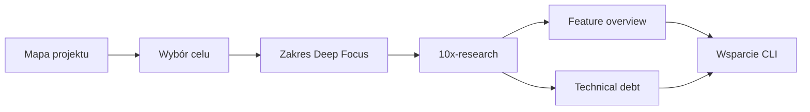
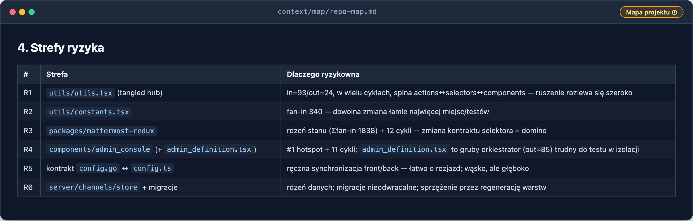
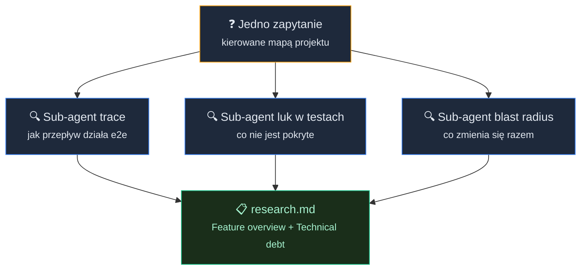
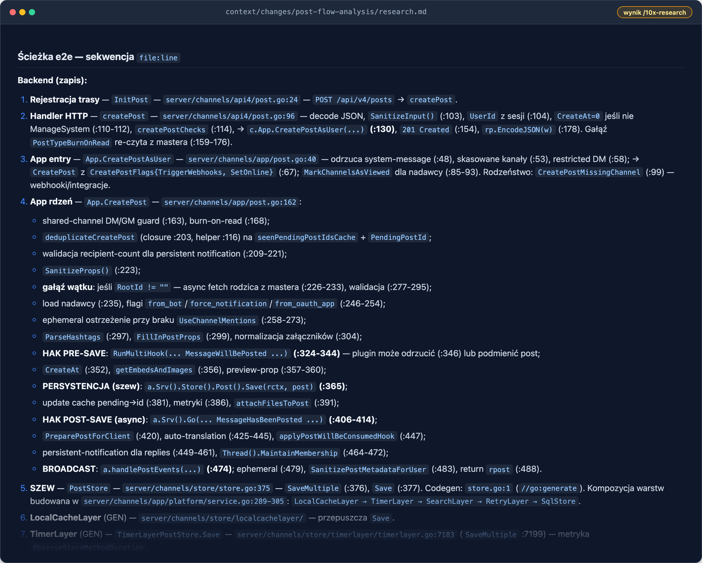
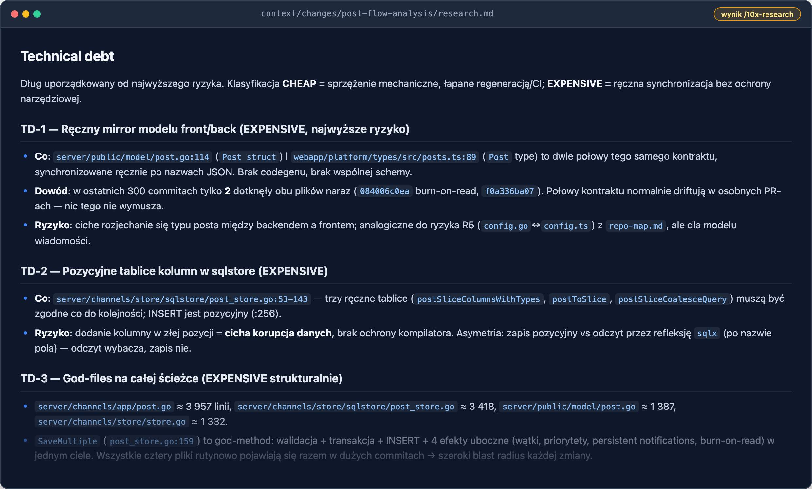
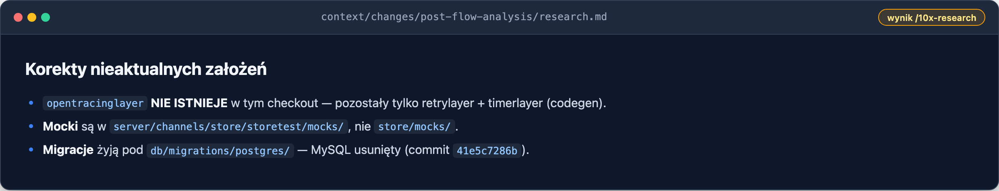
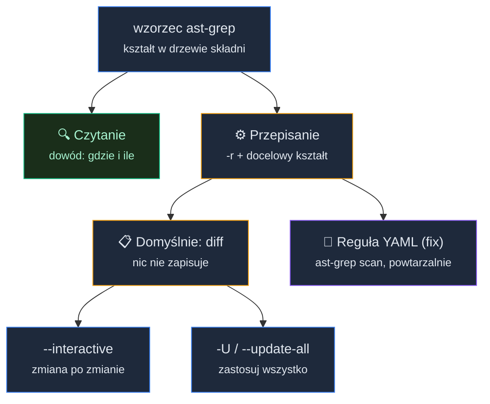

# Analiza feature z AI: co działa, co kuleje, co zmodernizować


<!-- cdn: https://images.przeprogramowani.pl/lessons/m4-l3/assets/cover.png -->

W poprzedniej lekcji zbudowaliśmy Mapę projektu.

Nie po to, żeby mieć ładny diagram w `context/map/repo-map.md`. Mapa miała dać ci decyzję: gdzie warto wejść głębiej, gdzie nie przepalać kontekstu i które obszary wyglądają na ważne, aktywne albo ryzykowne.

No właśnie. Masz mapę. Czasem będzie miała krótką listę podejrzanych. Częściej będzie miała coś bardziej chaotycznego: strefy ryzyka, korytarze zmian, moduły, na których wszystko wisi, kontrakty i listę `unknowns`.

To jest normalne.

W realnym repo mapa nie zawsze mówi: "zrób Deep Focus tutaj". Częściej mówi: "tu trzeba uważać".

Co teraz?

Najgorsza odpowiedź brzmi: "agent, przeanalizuj ten moduł".

To jest tylko trochę lepsze od "przeczytaj całe repo". Agent otworzy kilka plików, pójdzie po importach, zrobi streszczenie i bardzo szybko zacznie sugerować refaktor. Brzmi produktywnie, ale wciąż nie wiesz, czy zrozumiał realny przepływ danych, czy tylko opisał pliki, które akurat zobaczył.

W tej lekcji przechodzimy z **Wide Scan** do **Deep Focus**.

Wide Scan z poprzedniej lekcji (M4L2) odpowiedział na pytanie: "gdzie warto patrzeć?". Deep Focus odpowiada na trudniejsze pytanie: "jak wybrany fragment naprawdę działa i gdzie boli?".

Efektem są dwa kolejne elementy raportu — po ① Mapie projektu z poprzedniej lekcji dokładasz:

- **② Feature overview** — przepływ danych przez jeden wybrany feature albo moduł,
- **③ Technical debt** — miejsca ryzyka: hotspoty, ukryte sprzężenia, blast radius, luki testowe i unknowns.

Nie robimy jeszcze refaktoru. Nie wybieramy docelowej architektury. Nie projektujemy nowego modułu.

Najpierw zbieramy dowody.

I jeszcze jedno, zanim ruszymy. Do tej analizy użyjesz skilla, który już znasz — `10x-research`. Tylko w nowym trybie.

Wcześniej uruchamiałeś go na świeżym, własnym projekcie (greenfield), żeby zapytać "jak działa X" o kodzie, który sam budujesz. Tutaj dasz mu na wejście **twoją mapę** jako punkt odniesienia i **kontrakt zakresu**, żeby na wielkim legacy nie rozlał analizy na pół repo.

Ta lekcja jest w dużej mierze o tym, jak okiełznać znany research skill, żeby pracował wąsko i z dowodami.

### Mapa jako kontrakt wejściowy

Mapa projektu z poprzedniej lekcji nie jest notatką "do przeczytania". To jest kontrakt wejściowy dla agenta.

Jeśli dobrze wykonałeś poprzednią lekcję, masz w `context/map/repo-map.md` dokument o stałej strukturze — bo powstał ze stałego promptu syntezy. Niezależnie od tego, jakie repo mapowałeś, twoja mapa powinna mieć te same sekcje:

- `TL;DR` — czym jest repo i gdzie skupia się praca,
- `Teren` — obszary o dużej odpowiedzialności vs peryferia, moduły głębokie i płytkie, aktywność w czasie,
- `Realne powiązania` — co naprawdę zmienia się razem: couplingi, warstwy, cykle,
- `Strefy ryzyka` — kilka obszarów wysokiego ryzyka z jednolinijkowym „dlaczego",
- `Kogo zapytać` — kandydaci na kontekst per strefa,
- `Pierwszy dzień` — lista 5–8 plików wejściowych,
- `Ograniczenia` — okno czasowe, metoda i czego mapa NIE mówi.

To są dokładnie te informacje, których agent potrzebuje, żeby nie czytać losowo. W tej lekcji najważniejsze będą trzy z nich: `Strefy ryzyka` (stąd wybierzesz cel), `Pierwszy dzień` (stąd weźmiesz entry pointy) i `Ograniczenia` (stąd wezmą się pierwsze `unknowns`).


<!-- rendered: ../../assets/diagrams/lessons-m4-l3-lesson-draft-1-10x.png | cdn: https://images.przeprogramowani.pl/diagrams/lessons-m4-l3-lesson-draft-1-10x.png -->

Zwróć uwagę na kolejność. Najpierw mapa, potem wybór celu, potem zakres, potem semantyczna analiza, a na końcu strukturalne potwierdzenie. W dużym legacy to jest różnica między pracą z agentem a oglądaniem, jak agent pracuje po swojemu.

### Z mapy do jednego przepływu

Mapa nie jest celem sama w sobie — jest narzędziem, które pozwala przejść od „poznaliśmy repo" do konkretnych zadań na backlogu. A takich zadań w prawdziwym projekcie zawsze jest kilka: ktoś zgłasza wolny endpoint, ktoś chce dołożyć pole do modelu, ktoś planuje większy refaktor i pyta, czego się bać.

Weźmy jedno z nich — takie, które „wisi" na naszym symulowanym issue trackerze. Zadanie dotyczy krytycznego obszaru aplikacji: **zapisu wiadomości** (`PostStore.Save`). To core biznesowy Mattermost — każda wysłana wiadomość przechodzi tędy — i pojawił się pomysł, żeby ten przepływ zoptymalizować, może przygotować pod spłatę długu. Problem w tym, że nikt z zespołu nie umie z głowy powiedzieć, jak on dokładnie działa i co pęknie, jeśli go ruszymy.

Mapa już podpowiada, że to czuły rejon: warstwa storage z najtwardszym couplingiem w całym repo. Ale „czuły rejon" to za mało, żeby cokolwiek dotykać. Zanim w kolejnej lekcji o refaktoryzacji (M4L4) zaczniemy myśleć o zmianie, w tej lekcji musimy ten jeden przepływ naprawdę zrozumieć — i to jego wezmę jako cel Deep Focus do samego końca.


<!-- cdn: https://images.przeprogramowani.pl/lessons/m4-l3/assets/map-risk-zones.png -->

I tu jest sedno tego, co daje mapa. Bez niej analiza dużego repo zaczyna się zawsze tak samo: agent czyta losowo, otwiera pliki, które akurat pasują do nazwy, i przepala kontekst na obszarach, które nas nie obchodzą. Mając mapę, odwracamy tę dynamikę — to my mówimy agentowi, gdzie palić tokeny, gdzie intensyfikować research, a gdzie nawet nie zaglądać.

Mapa zamienia szerokie „przeanalizuj storage" w kierowaną pracę:

- wiemy, gdzie zagęścić research — w strefie ryzyka, nie w peryferiach,
- wiemy, od którego pliku zacząć czytanie — z sekcji `Pierwszy dzień`,
- wiemy, czego spodziewać się po couplingu — z `Realnych powiązań`,
- wiemy, jakie pytania zostały otwarte — z `Ograniczeń`.

Zamiast prosić agenta „zrozum ten moduł", dajemy mu zawężony cel poparty dowodami z mapy — i dopiero wtedy puszczamy go głębiej.

A u mnie `Pierwszy dzień` wskazał na warstwę store trzy powiązane pliki:

```text
server/channels/store/store.go            (interfejs warstwy storage)
server/channels/store/sqlstore/...         (konkretna implementacja)
server/channels/store/.../storetest        (kontrakt testowy)
```

W twoim projekcie taki obszar to może być rejestracja konta, płatność i webhook, generowanie fiszek, synchronizacja z integracją, usuwanie konta, import pliku albo wysyłka powiadomienia.

Ważne jest jedno: im dalej, tym więcej konkretów. Wąsko, ale głęboko.

### Czego mapa nie powie — i dlaczego sięgamy po agenta

Zatrzymajmy się na chwilę i rozliczmy, co naprawdę mamy w ręku po poprzedniej lekcji.

Mamy mapę. I to dużo: wiemy, gdzie skupia się praca, które obszary mają istotną wagę w całym kontekście projektu, gdzie są strefy ryzyka, jakie są realne powiązania i od których plików zacząć czytanie. To zamienia „przeanalizuj repo" w kierowaną pracę — nieoceniona przewaga na starcie.

Ale mapa ma trzy wbudowane ograniczenia. Nie dlatego, że zrobiliśmy ją źle — dlatego, że **takie jest jej zadanie**.

- **Pokazuje szerokość, nie głębokość.** Mapa odpowiada na „gdzie patrzeć?", nie na „jak to działa?". Wie, że dany przepływ jest czuły. Nie wie, którędy realnie płyną dane, co je waliduje i co pęka po drodze.
- **Opisuje strukturę, nie zachowanie.** To statyczny obraz: zależności, warstwy, entry pointy. To, co dzieje się dopiero przy wykonaniu (kolejność kroków, side-effecty, ścieżki błędów), leży poza nią.
- **Jest migawką w czasie.** Powstała z okna historii i opisuje aktywność, nie aktualny stan kontraktów. Część jej szczegółów zdążyła się zdezaktualizować, a jej graf z założenia nie pokrywa całego repo, więc zostają białe plamy oznaczone jako `unknowns`.

Innymi słowy: mapę zbudowaliśmy **szeroko i tanio**, głównie z CLI, skanując całość. To była właściwa metoda na Wide Scan. Ale na Deep Focus pytania się zmieniają — z „które obszary?" na „jak ten jeden przepływ naprawdę działa i gdzie boli?". Na takie pytania nie odpowie się tanim skanem. Trzeba świeżo wejść w kod, odtworzyć przepływ krok po kroku, odtworzyć historię zmian i twardo oddzielić to, co udowodnione, od tego, co zgadujemy.

To jest dokładnie ten moment, w którym przestaje wystarczać sama mapa, a do pracy zapraszamy agenta. Nie po to, żeby zaczynał od zera — po to, żeby wziął mapę jako **prior** i pogłębił dokładnie to, czego jej brakuje: realny trace, zachowanie w czasie wykonania i aktualny stan kodu, z rygorem `evidence` / `inference` / `unknown`, żeby nieaktualny prior nie przepisał się po cichu jako fakt.

Mapa mówi „kop tutaj, nie tam". Teraz bierzemy łopatę.

### Research bez wymyślania koła na nowo

Wybrany cel i sekcje mapy to idealny wsad dla `/10x-research` i konkretnego, kierowanego zapytania badawczego.

Skill, który znasz, opiera się na **równoległych sub-agentach**: bierze jedno pytanie badawcze, dekomponuje je na kilka obszarów i odpala 2–4 agenty naraz. Każdy czyta inny wymiar problemu, a potem syntetyzuje wyniki w jeden artefakt. Na świeżym projekcie ta dekompozycja bywa luźna. W legacy chcemy ją **kontrolować**.

Sztuczka polega na tym, żeby sformułować jedno zapytanie tak, żeby rozbiło się dokładnie na trzy sub-agenty, których potrzebujesz pod raport:

- **sub-agent trace** → jak przepływ działa end-to-end,
- **sub-agent luk w testach** → które ścieżki i gałęzie nie są pokryte,
- **sub-agent blast radius** → co zmienia się razem z tym przepływem, gdy go ruszysz.


<!-- rendered: ../../assets/diagrams/lessons-m4-l3-lesson-draft-2-10x.png | cdn: https://images.przeprogramowani.pl/diagrams/lessons-m4-l3-lesson-draft-2-10x.png -->

To nie przypadek, że to akurat te trzy. Jeśli myślisz o pracy w legacy, potrzebujesz wiedzieć jak to działa, czy jest siatka bezpieczeństwa i jak daleko sięga zmiana. Reszta to szczegóły.

Aby przygotować miejsce pod nasz research, przenieś do projektu skille ze szkolenia, a następnie wykorzystaj:

```text
/10x-init
/10x-new post-flow-analysis Analiza przepływu danych w obszarze wiadomości.
```

> Scenariusz możesz zmodyfikować wg potrzeb projektu, w którym pracujesz.

Prompt do skilla — z pakietem wejściowym w postaci mapy:

```text
/10x-research post-flow-analysis Przeanalizuj proces zapisu postów, zwracając szczególną uwagę na powiązane z nim obszary zdefiniowane w context/map/repo-map.md

Wykorzystaj trzech równoległych sub-agentów:

1. Trace e2e: odtwórz ścieżkę od entry pointu, przez warstwy, do zapisu/odczytu i z powrotem. Daj sekwencję kroków z file:line oraz diagram Mermaid.
2. Luki w testach: które metody i gałęzie na tej ścieżce mają pokrycie, a które nie.
3. Blast radius: co musi zmienić się razem przy zmianie tego przepływu — szew interfejsu, warstwy generowane, model, migracje, testy. Połącz graf statyczny z co-change z historii gita.

Skup się wyłącznie na analizie i opisie stanu obecnego repozytorium.

Twój raport musi zawierać dwie jawne i krytyczne sekcje:

1. Feature overview
2. Technical debt

Zapisz wnioski z badania do context/changes/post-flow-analysis/research.md
```

Wygenerowane? No to analizujemy.

### Feature overview

Pierwsze, co rzuca się w oczy po lekturze raportu: **struktura folderów kłamała**. Z układu katalogów wyglądało, że zapis wiadomości przechodzi przez gruby stos warstw, z których każda coś robi. Trace pokazał co innego — większość warstw to przezroczyste opakowania, a realna praca dzieje się w jednym, gęstym miejscu. Tego nie dało się zgadnąć ani z mapy, ani z drzewa plików; trzeba było odtworzyć przepływ krok po kroku.

Druga rzecz to kształt samego zapisu. To, co z zewnątrz wygląda jak „zapisz jedną wiadomość", pod spodem jest operacją wsadową — pojedynczy zapis to tylko fasada nad mechanizmem zbiorczym. A dane po zapisie nie są ponownie czytane z bazy; wracają te same obiekty z pamięci, jedynie uzupełnione. Drobny szczegół, który zmienia sposób myślenia o całej ścieżce.

I trzecia: autor widzi swoją wiadomość, zanim serwer ją potwierdzi, a potem wersja optymistyczna i ta z serwera spotykają się w jednym punkcie i godzą. Bez prześledzenia obu stron naraz wyglądałoby to na dwa niezależne mechanizmy.

Wniosek jest prosty: dostaliśmy **przepływ, a nie spis plików**. Wiemy, skąd przychodzą dane, kto je waliduje, gdzie naprawdę zmienia się stan i co wraca — a do tego, które kroki są potwierdzone w kodzie, a które agent tylko założył.


<!-- cdn: https://images.przeprogramowani.pl/lessons/m4-l3/assets/artifact-research-trace.png -->

### Technical debt

Tu raport zrobił rzecz, której mapa nie potrafiła: zamienił ogólne „to czuły rejon" w **konkretny rodzaj ryzyka**.

Najważniejsze odkrycie nie dotyczyło największego, najbrzydszego pliku — choć taki istnieje. Najgroźniejszy dług okazał się cichy. Model danych ma dwie połowy, backendową i frontendową, których nic nie trzyma razem narzędziowo — historia zmian pokazała, że prawie nigdy nie zmieniają się w jednym commicie, więc spokojnie mogą się rozjechać i nikt tego od razu nie zauważy. Podobnie zapis do bazy opiera się na kolejności, której żaden kompilator nie pilnuje: jeden nieuważny ruch i dane po cichu trafiają w złe miejsce. Do tego dochodzą ścieżki błędów, których nikt nie testuje — a to właśnie one decydują, czy refaktor jest bezpieczny.

Druga wartość tej sekcji to rozróżnienie, które oszczędza sporo paniki: część sprzężeń jest **tania**. Wygląda groźnie — zmiana w jednym miejscu pociąga kilka innych — ale jest mechaniczna, generowana automatem i łapana przez CI. Mylenie tego z prawdziwym długiem to klasyczny błąd; raport rozdzielił jedno od drugiego.

Wniosek: nie mamy listy „brzydkich plików". Mamy **mapę kruchości** — gdzie zmiana może cicho zepsuć dane albo kontrakt, gdzie brakuje siatki bezpieczeństwa, a gdzie ryzyko jest tylko pozorne. To dokładnie ten materiał, na którym w następnej lekcji oprzemy decyzję, co i jak warto ruszyć.


<!-- cdn: https://images.przeprogramowani.pl/lessons/m4-l3/assets/artifact-research-debt.png -->

Zwróć też uwagę na końcówkę raportu: trzy założenia, które po drodze okazały się nieaktualne, agent jawnie skorygował, zamiast po cichu przepisać je jako fakty. To rygor `evidence` / `inference` / `unknown` w praktyce — dokładnie po to braliśmy mapę jako prior, a nie jako prawdę objawioną:


<!-- cdn: https://images.przeprogramowani.pl/lessons/m4-l3/assets/artifact-research-corrections.png -->

### Pogłębianie raportu z narzędziem ast-grep

Przed analizą i refaktoryzacją legacy precyzja w raporcie ma znaczenie wprost proporcjonalne do ryzyka zmiany. A cały ten proces opieramy na modelach, które z miesiąca na miesiąc działają coraz pewniej (zwłaszcza przy wsparciu CLI), ale wciąż potrafią przeoczyć ten jeden fragment, który decyduje o powodzeniu całej zmiany.

Jeśli zdarzyło ci się aktualizować kod po przeglądzie modelu, znasz to z własnej skóry. Ten plik pominięty, ta metoda zignorowana, ten parametr nie wzięty pod uwagę.

Dlaczego? Bo liczby i twierdzenia strukturalne ("tylko tutaj", "zawsze przez X", "dokładnie cztery wywołania") agent analizuje najsłabiej, a czytelnik raportu często bierze je na wiarę. To ta sama klasa błędu, przez którą model potrafi się pomylić, licząc litery w słowie.

Stąd nieoczywista reguła: **im pewniej wygląda dana liczba w raporcie, tym bardziej warto ją sprawdzić**. Posłuży nam do tego narzędzie, które naprawdę rozumie strukturę kodu, a nie tylko nazwy zmiennych i klas.

**Raz jeszcze CLI.** W poprzedniej lekcji sięgaliśmy po `git` (co zmienia się razem) i analizę zależności (co importuje co). Oba odpowiadały na pytania o **relacje i agregaty**, czyli historię i graf. Teraz potrzebujemy czegoś z innej półki: narzędzia, które na poziomie składni powie *dokładnie*, gdzie w kodzie występuje konkretny kształt, bez zgadywania, bez próbkowania, w pełni powtarzalnie. To ta sama filozofia, co wcześniej — tani, deterministyczny CLI jako kontrapunkt dla drogiego, probabilistycznego agenta — tyle że wymierzona w inną oś.

Agent jest świetny od *znaczenia i zachowania* (jak ten przepływ działa, co waliduje, gdzie boli). CLI jest świetny od *liczby i pozycji* (ile dokładnie, których linii, czy na pewno tylko tu). Potwierdzanie liczb to nie brak zaufania do agenta, tylko podział pracy.

**Czym jest AST i ast-grep.** Kiedy agent patrzy na kod, widzi **tekst**, czyli ciąg znaków. Dlatego wyszukiwanie w stylu `grep "Save("` złapie też komentarz, string i `SaveMultiple(` — dla tekstowego dopasowania to wszystko ten sam ciąg znaków. Kompilator widzi co innego: **drzewo składniowe** (AST, czyli *abstract syntax tree*), w którym "to jest wywołanie metody", "to jego receiver", "to lista argumentów". Każdy element to osobny, nazwany węzeł z własnymi metadanymi. To w gruncie rzeczy ten sam model, który agent buduje sobie w głowie, czytając kod, tyle że AST jest jawny, odpytywalny i deterministyczny.

`ast-grep` to narzędzie, które pozwala przeszukiwać drzewo składni kodu w powtarzalny sposób.

Korzystasz z niego, pisząc wzorce (ty lub agent) w **składni badanego języka**, z miejscami do uzupełnienia tam, gdzie konkretny fragment ma się dopiero okazać na etapie eksploracji.

<div style="padding:56.25% 0 0 0;position:relative;"><iframe src="https://player.vimeo.com/video/1199008036?badge=0&amp;autopause=0&amp;player_id=0&amp;app_id=58479" frameborder="0" allow="autoplay; fullscreen; picture-in-picture; clipboard-write; encrypted-media; web-share" referrerpolicy="strict-origin-when-cross-origin" style="position:absolute;top:0;left:0;width:100%;height:100%;" title="M4 L3 ast grep"></iframe></div><script src="https://player.vimeo.com/api/player.js"></script>

Przykłady posługiwania się tym narzędziem (bez obaw - rozwiąże to dla nas agent):

```bash
ast-grep -p '$X.Post().Save($$$A)' -l go
```

Taki wzorzec dopasuje **tylko** realne wywołania `Save` — pominie komentarze, stringi i, co kluczowe, odróżni `Save` od `SaveMultiple`. To jest różnica między „czterema call-site'ami na oko" a „dwoma `Save` i trzema `SaveMultiple`, plik po pliku".

**Instalacja i cross-platform.** `ast-grep` to pojedynczy binarny plik napisany w Rust, z prekompilowanymi wydaniami na macOS, Linux i Windows — działa wszędzie tam, gdzie pracujesz.

Wybierz dowolny kanał:

```bash
npm i -g @ast-grep/cli      # najprościej, jeśli masz już Node
brew install ast-grep       # macOS / Linux (Homebrew)
cargo install ast-grep --locked   # jeśli masz Rusta
pip install ast-grep-cli    # przez Pythona
# Windows: scoop install ast-grep  /  winget install ast-grep
```

Polecenie nazywa się `ast-grep` (bywa też krótszy alias `sg`, ale na Linuksie koliduje z systemowym poleceniem `sg` od przełączania grup, więc używaj pełnej nazwy). Sprawdź instalację: `ast-grep --version`.

**Prompt do wzmocnienia researchu.** Uwaga na intencję: nie prosimy agenta o zmianę kodu ani o refaktor. Prosimy o **śledztwo** — żeby wziął własny raport i każde twierdzenie strukturalne potwierdził albo obalił liczbą z `ast-grep`. To czysta weryfikacja, zero modyfikacji.

```text
Ulepszamy raport context/changes/post-flow-analysis/research.md.

Najpierw wypisz z niego wszystkie twierdzenia STRUKTURALNE (liczby call-site'ów, "tylko tutaj", "zawsze przez X", liczność metod, powtarzające się kształty wywołań).

Dla każdego zbuduj wzorzec narzędzia ast-grep, następnie wywołaj je i przeanalizuj wyniki - powinny potwierdzać lub obalać początkowe twierdzenie z raportu.

Wynik podaj jako: twierdzenie -> potwierdzone / doprecyzowane / obalone, z dokładnymi plikami i liniami.

Na koniec zaktualizuj i skoryguj raport wynikami z ast-grep.
```

Efekt z naszej sesji to **doprecyzowanie kierunku analizy** i domknięcie tych luk, które wprost wynikają ze słabości modeli. Agent widzi kod jako tokeny i grupy znaków, a nie jako nazwane węzły drzewa składni, więc liczenie i twierdzenia "tylko tutaj" zostawiamy narzędziu, które tę strukturę naprawdę rozumie.

### ast-grep vs klasyczny grep — i czemu chcesz obu

Łatwo pomyśleć, że ast-grep zastępuje grepa. Nie zastępuje — uzupełnia, bo ich słabości są lustrzane. `grep` jest tępy, ale **uczciwy**: szuka tekstu, więc znajdzie wystąpienie wszędzie, łącznie z komentarzem i nazwą-bliźniakiem. `ast-grep` jest precyzyjny, ale **wybredny**: jeśli twój wzorzec nie pasuje do faktycznego kształtu w kodzie, dostaniesz **zero** — i łatwo je odczytać jako „nie ma takich wywołań", podczas gdy znaczy ono „mój wzorzec był zły".

Stąd reguła, którą warto zapamiętać na całą tę fazę analizy: **używaj ast-grep dla precyzji, ale każde zero potwierdzaj grepem**. Zero ze strukturalnego matchera jest podejrzane, dopóki tani tekstowy grep nie potwierdzi, że to naprawdę brak wystąpień, a nie literówka we wzorcu. Dwa tanie, deterministyczne narzędzia pilnujące i agenta, i siebie nawzajem — to jest cała sztuczka tej lekcji.

### ast-grep potrafi nie tylko czytać, ale i przepisywać kod

Chociaż w tej lekcji nie zajmiemy się jeszcze wprowadzaniem zmian, to krótko zaznaczymy drugą stronę opisywanego narzędzia. Mianowicie - `ast-grep` to nie tylko skaner, ale też operator precyzyjnych zmian w kodzie.

Ten sam wzorzec, który *znajduje* kształt w drzewie składni, potrafi go też **przepisać**.

Wystarczy dołożyć `-r` (rewrite) i podać docelowy kształt — z tymi samymi metazmiennymi co we wzorcu:

```bash
ast-grep -p 'var $A = $B' -r 'let $A = $B' -l js src/
```

Metazmienne złapane po lewej (`$A`, `$B`) zostają **reużyte** po prawej. To nie jest wyszukaj-i-zamień po tekście — to przepisanie na poziomie AST, więc zachowuje strukturę i działa tylko tam, gdzie kształt naprawdę pasuje. Dlatego `ast-grep` odróżni `Save` od `SaveMultiple` także przy przepisywaniu, czego `sed` nigdy nie zrobi.

Domyślnie `-r` tylko **pokazuje** diff — nic nie zapisuje. Żeby przejrzeć i zatwierdzić zmiany po kolei, dodaj `--interactive`; żeby zastosować wszystkie naraz, `-U`/`--update-all`:

```bash
ast-grep -p 'var $A = $B' -r 'let $A = $B' -l js --interactive src/   # przegląd zmiana po zmianie
ast-grep -p 'var $A = $B' -r 'let $A = $B' -l js -U src/              # zastosuj wszystkie
```

A jeśli dany rewrite ma być **powtarzalny** — częścią procesu, nie jednorazowym poleceniem — zapisujesz go jako regułę YAML z polem `fix` i odpalasz przez `ast-grep scan`:

```yaml
id: no-var
language: JavaScript
severity: warning
message: "Użyj `let` lub `const` zamiast `var`. Znaleziono: $NAME"
rule:
  pattern: var $NAME = $VAL
fix: let $NAME = $VAL
```

```bash
ast-grep scan --interactive
```

To jest druga połowa narzędzia: te same deterministyczne wzorce, których użyliśmy do **dowodu**, stają się narzędziem **zmiany** — strukturalnej, powtarzalnej, łapiącej dokładnie ten kształt i żaden inny.


<!-- rendered: ../../assets/diagrams/lessons-m4-l3-lesson-draft-3-10x.png | cdn: https://images.przeprogramowani.pl/diagrams/lessons-m4-l3-lesson-draft-3-10x.png -->

**Ważne — w tej lekcji z tej połowy jeszcze nie korzystamy.** Wciąż jesteśmy na etapie zbierania dowodów: analiza, nie modyfikacja. Pokazuję ci rewrite teraz, żeby było jasne, że taka możliwość istnieje. Sięgniesz po nią, gdy któraś z twoich przyszłych zmian okaże się mechaniczną, zachowującą kształt transformacją.

Na razie ast-grep zostaje w roli, którą właśnie poznałeś: weryfikatora twierdzeń strukturalnych. Ten sam wzorzec, którym dziś potwierdzasz raport, w następnej lekcji o refaktoryzacji poniesie już samą zmianę.

## 🧑🏻‍💻 Zadania praktyczne

Na start pobierz paczkę promptów dla tej lekcji:

```bash
npx @przeprogramowani/10x-cli@latest get m4l3
```

W tej lekcji pracujesz na artefakcie z poprzedniej lekcji (M4L2).

Jeśli nie masz jeszcze `context/map/repo-map.md`, wróć do poprzedniej lekcji i zbuduj Mapę projektu. Deep Focus bez mapy bardzo szybko zamienia się w losowe czytanie plików.

Zostań w tym samym repo, które mapowałeś w poprzedniej lekcji (Mattermost, tldraw, React albo dowolny inny projekt w stacku, który rozumiesz). Twoim zadaniem jest przejść od **Mapy projektu ①** do dwóch kolejnych sekcji raportu: **② Feature overview** i **③ Technical debt** — wąsko, na jednym wybranym przepływie, zbierając dowody, a nie projektując jeszcze refaktoru.

Pracujemy w nowym folderze. Mapa zostaje w `context/map/`, a wynik Deep Focus zapisujesz osobno:

```text
context/changes/{change-id}/research.md
```

`{change-id}` to identyfikator zmiany: krótka nazwa wybranego przepływu (np. `post-flow-analysis`). Pod tą nazwą `/10x-new` założy folder zmiany w `context/changes/` i tą samą wartością podmieniasz placeholder `{change-id}` w promptach z paczki.

### Krok 0: Wybierz cel z mapy

Otwórz `context/map/repo-map.md` i wybierz **jeden** przepływ albo moduł do pogłębienia. Nie bierz całego podsystemu — bierz jeden feature.

Decyzję oprzyj na trzech sekcjach mapy (tak jak w lekcji):

- `Strefy ryzyka` — stąd wybierasz cel: obszar oznaczony jako czuły, nośny dla reszty systemu albo o najtwardszym couplingu,
- `Pierwszy dzień` — stąd bierzesz entry pointy: 2–3 pliki, od których zaczniesz czytanie,
- `Ograniczenia` — stąd biorą się pierwsze `unknowns`, które agent ma potwierdzić lub obalić.

Zapisz na górze `research.md` jednolinijkowy zapis celu: co badasz, od którego pliku, i dlaczego mapa wskazała ten obszar.

### Krok 1: Przygotuj skille researchowe

Przenieś do projektu skille ze szkolenia i przygotuj miejsce pod research (scenariusz dopasuj do swojego projektu):

```text
/10x-init
/10x-new {change-id} Analiza przepływu danych w wybranym obszarze.
```

### Krok 2: Odpal `/10x-research` z trzema sub-agentami

Sformułuj jedno zapytanie tak, żeby rozbiło się dokładnie na trzy sub-agenty pod raport — `trace`, `luki w testach`, `blast radius` — i nakarm je mapą jako priorem:

```text
/10x-research {change-id} Przeanalizuj wybrany przepływ, zwracając szczególną uwagę na powiązane z nim obszary zdefiniowane w context/map/repo-map.md

Wykorzystaj trzech równoległych sub-agentów:

1. Trace e2e: odtwórz ścieżkę od entry pointu, przez warstwy, do zapisu/odczytu i z powrotem. Daj sekwencję kroków z file:line oraz diagram Mermaid.
2. Luki w testach: które metody i gałęzie na tej ścieżce mają pokrycie, a które nie.
3. Blast radius: co musi zmienić się razem przy zmianie tego przepływu — szew interfejsu, warstwy generowane, model, migracje, testy. Połącz graf statyczny z co-change z historii gita.

Skup się wyłącznie na analizie i opisie stanu obecnego repozytorium.

Twój raport musi zawierać dwie jawne sekcje:
1. Feature overview
2. Technical debt

Oddziel dowody (evidence) od interpretacji (inference) i białych plam (unknown).

Zapisz wnioski do context/changes/{change-id}/research.md
```

Po wygenerowaniu przeczytaj raport pod kątem dwóch rzeczy: czy **② Feature overview** daje przepływ, a nie spis plików (skąd wchodzą dane, kto je waliduje, gdzie zmienia się stan, co wraca), oraz czy **③ Technical debt** zamienia ogólne „to czuły rejon" w konkretny rodzaj ryzyka — kruche sprzężenia, luki testowe, blast radius — i odróżnia dług prawdziwy od taniego, łapanego przez CI.

### Krok 3: Potwierdź twierdzenia strukturalne narzędziem ast-grep

Zainstaluj `ast-grep` (jeśli go nie masz) i poproś agenta o **śledztwo, nie refaktor**: niech wyciągnie z raportu wszystkie twierdzenia strukturalne (liczby call-site'ów, „tylko tutaj", „zawsze przez X") i potwierdzi albo obali każde liczbą:

```text
Ulepszamy raport context/changes/{change-id}/research.md.

Najpierw wypisz z niego wszystkie twierdzenia STRUKTURALNE (liczby call-site'ów, "tylko tutaj", "zawsze przez X", liczność metod, powtarzające się kształty wywołań).

Dla każdego zbuduj wzorzec narzędzia ast-grep, wywołaj je i przeanalizuj wyniki.

Wynik podaj jako: twierdzenie -> potwierdzone / doprecyzowane / obalone, z dokładnymi plikami i liniami. Każde zero z ast-grep potwierdź klasycznym grepem, żeby odróżnić realny brak wystąpień od złego wzorca.

Na koniec zaktualizuj i skoryguj raport wynikami z ast-grep.
```

Pamiętaj o regule z lekcji: **licz ast-grepem dla precyzji, ale każde zero potwierdzaj grepem**.

### Krok 4: Zatrzymaj się przed refaktorem

Twój wynik ćwiczenia to jeden plik `context/changes/{change-id}/research.md` z dwiema sekcjami — ② Feature overview i ③ Technical debt — zweryfikowany ast-grepem i gotowy jako wejście do następnej lekcji.

## Odbierz swoją odznakę

Po ukończeniu tej lekcji odbierz odznakę w sekcji [10xDevs Mission Log](https://platforma.przeprogramowani.pl/10xdevs-3/mission-log) a następnie pochwal się swoim osiągnięciem!

## 🔎 Deep Dive

Ta sekcja zawiera dodatkowe pogłębienie wiedzy na temat wybranych zagadnień związanych z lekcją. W tym Deep Dive znajdziesz:

- **Hotspot to złożoność × częstość zmian** — dlaczego ani sama złożoność, ani sama aktywność nie wystarczą, i czemu dokładny wybór metryki jest mniej ważny niż skrzyżowanie.
- **Connascence — słownik kruchości zamiast „tightly coupled"** — jak nazwać rodzaj sprzężenia precyzyjnie, żeby raport mówił, *co* pęknie, a nie tylko, że „jest ciasno".
- **Sprzężenie logiczne: para vs hub** — czemu „A i B zmieniają się razem" to inne ryzyko niż „X zmienia się z dziesięcioma innymi", i jak nie przeczytać współzmian zbyt dosłownie.

Ta sekcja lekcji nie jest obowiązkowa, ale warto się z nią zapoznać jeżeli chcesz zostać ekspertem.

### Hotspot to złożoność × częstość zmian

W sekcji `③ Technical debt` szukasz miejsc ryzykownych, a nie po prostu brzydkich. Różnicę robi jedna obserwacja: **ryzyko siedzi na skrzyżowaniu dwóch osi — złożoności i częstości zmian.**

Każda z nich osobno wprowadza w błąd. Plik gęsty, ale zamrożony od dwóch lat, jest tylko stary — nikt go nie rusza, więc nie zaszkodzi. Plik trywialny, ale dotykany w co drugim commicie, to zwykle config albo barometr, nie dług. Dopiero **iloczyn** — kod skomplikowany *i* ciągle zmieniany — wskazuje miejsce, w którym każda kolejna zmiana jest droga i ryzykowna, bo trzeba ją wprowadzać często i za każdym razem w trudnym terenie.

I tu nieoczywista część: **który dokładnie proxy złożoności wybierzesz, jest mniej ważne niż samo skrzyżowanie.** Liczba linii, głębokość wcięć, złożoność kognitywna — to różne przybliżenia tego samego „jak ciężko to zrozumieć", a praktycy analizy historii kodu celowo sięgają po te tanie, żeby liczyć je powtarzalnie na całym repo. Nie kotwicz raportu na jednej metryce złożoności jak na wyroku; traktuj ją jako jedną oś, którą mnożysz przez drugą.

To domyka pętlę z poprzedniej lekcji. Mapę projektu zbudowałeś m.in. z historii gita — masz więc już *częstość zmian* w `Terenie`. Deep Focus dokłada brakującą oś: na wybranym przepływie pytasz agenta o złożoność konkretnych plików, a hotspot to te z nich, które wpadają w oba wiadra naraz.

### Connascence — słownik kruchości zamiast „tightly coupled"

„Tightly coupled" to werdykt, nie opis. Mówi, że coś jest ciasne, ale nie mówi *czym* — a refaktor zaczynasz od wiedzy, który dokładnie rodzaj sprzężenia masz rozplątać. Connascence to praktyczny słownik, który nadaje sprzężeniom nazwy zamiast jednego worka.

Kilka etykiet, które najczęściej przydają się w raporcie:

- **Sprzężenie pozycji / kolejności** — dwa miejsca muszą uzgadniać porządek argumentów albo kroków. W naszym przepływie to zapis do bazy, który opiera się na kolejności, a żaden kompilator jej nie pilnuje.
- **Sprzężenie znaczenia / konwencji** — dwa miejsca muszą zgadzać się co do interpretacji tej samej wartości. U nas: dwie połowy modelu, backend i front, których nic nie trzyma razem narzędziowo.
- **Sprzężenie nazwy / typu** — wspólna nazwa albo typ używany w wielu miejscach, na przykład publiczny kontrakt warstwy store.

Kluczowe rozróżnienie: connascence **statyczna** jest widoczna w jednym miejscu w kodzie (kompilator albo `ast-grep` ją złapie), **dynamiczna** ujawnia się dopiero w runtime — i to ta druga jest cichym długiem, bo nic jej nie pilnuje. Dodatkowo siła sprzężenia rośnie z **dystansem**: uzgodnienie kolejności argumentów w jednej funkcji jest tanie, a uzgodnienie znaczenia pola między backendem a frontendem, których historia gita prawie nigdy nie ruszała w jednym commicie — to dokładnie ten rodzaj kruchości, który raport ma nazwać po imieniu.

Traktuj to jako zestaw etykiet roboczych, nie akademicką taksonomię do wyrecytowania. Wartość jest praktyczna: zamiast „ten moduł jest tightly coupled" piszesz „backend i front łączy connascence znaczenia na dużym dystansie, bez bariery narzędziowej" — i od razu wiadomo, gdzie boli i czego szukać.

### Sprzężenie logiczne: para vs hub

Sub-agent `blast radius` łączy graf statyczny z **współzmianami** z historii gita — plikami, które zmieniają się razem mimo braku oczywistego importu. To potężny sygnał, ale łatwo go przeczytać zbyt dosłownie. Pomaga rozbić go na dwa różne pytania.

Pierwsze: **która para jest ciasno związana?** Jeśli `A` i `B` prawie zawsze pojawiają się w tym samym commicie, istnieje między nimi ukryty kontrakt — często niewidoczny w kodzie, bo żaden import go nie wyraża. To kandydat na connascence znaczenia opisaną wyżej.

Drugie: **który plik jest hubem?** Plik sprzężony z dziesięcioma innymi to inne ryzyko niż ciasna para — to węzeł o szerokim blast radius, gdzie jedna zmiana promieniuje na wiele obszarów. Sumowanie sprzężeń per plik (zamiast patrzenia tylko na pary) wyciąga właśnie takie huby. Mylenie jednego z drugim to klasyczny błąd: ranking „z czym najwięcej rzeczy się zmienia" odpowiada na inne pytanie niż „która dwójka jest najmocniej spięta".

I dwa zastrzeżenia, bez których współzmiany kłamią. Po pierwsze, są dowodem **w oknie czasowym** — pokazują, co zmieniało się razem, nigdy co *powinno* być zsynchronizowane, a w historii nie jest (to zostaje jako `unknown`). Po drugie, wysoka współzmiana bywa niewinna: masowy refaktor, przeformatowanie albo jeden commit „posprzątaj wszystko" potrafi spiąć pliki, które nic realnie nie łączy. Dlatego raport rankuje ryzyko z **dwóch źródeł naraz** — graf statyczny i co-change — a sprzeczności między nimi zostawia jako pytania do weryfikacji, nie jako fakty.

## 📚 Materiały dodatkowe

- [Your Code as a Crime Scene, 2nd Edition](https://pragprog.com/titles/atcrime2/your-code-as-a-crime-scene-second-edition/) — Adam Tornhill o analizie kodu przez historię zmian, hotspotach i podejściu "data over opinion".
- [Software Design X-Rays](https://www.oreilly.com/library/view/software-design-x-rays/9781680505795/f_0086.xhtml) — rozwinięcie metody hotspotów i change coupling w analizie legacy.
- [code-maat](https://github.com/adamtornhill/code-maat) — otwartoźródłowe CLI do analizy historii wersji, logicznego sprzężenia i sum-of-coupling; traktuj jako narzędzie do eksploracji metody, nie obowiązkowy element kursu.
- [Detection of Logical Coupling Based on Product Release History](https://plg.uwaterloo.ca/~migod/846/papers/gall-coupling.pdf) — klasyczny paper o logical coupling, czyli sprzężeniu wykrywanym na podstawie współzmian w historii projektu.
- [Cognitive Complexity](https://www.sonarsource.com/resources/cognitive-complexity/) — materiał SonarSource o mierzeniu złożoności pod kątem zrozumiałości dla człowieka.
- [Connascence](https://connascence.io/) — praktyczny opis rodzajów sprzężeń, przydatny jako słownik do sekcji `Technical debt`.
- [ast-grep](https://github.com/ast-grep/ast-grep) — strukturalne wyszukiwanie i przepisywanie kodu oparte na tree-sitter, dobre do zwracania agentowi kompaktowych wyników z wybranego przepływu zamiast całych plików.
