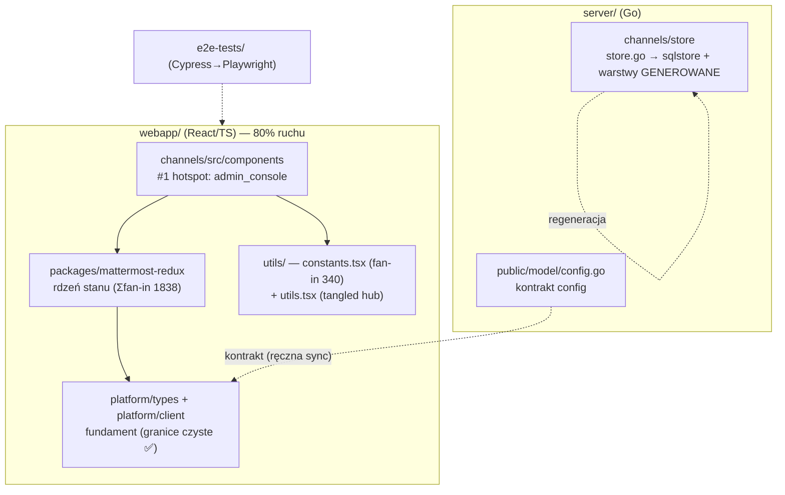

# Mapa projektu — Mattermost

> Dokument onboardingowy dla nowego developera w dużym legacy. Synteza trzech artefaktów Wide Scan:
> [`artifact-1-territory.md`](./artifact-1-territory.md) (git, gdzie żyje) · [`artifact-2-structure.md`](./artifact-2-structure.md) (graf zależności, jak powiązane) · [`artifact-3-contributors.md`](./artifact-3-contributors.md) (kto wie).
> Okno analizy: **12 miesięcy (2025-06-04 → 2026-06-04)**. To mapa **aktywności i struktury**, nie ocena jakości.
> Cel: po 15 min czytania wiesz, gdzie rzeczy żyją, co jest niebezpieczne i od czego zacząć.

## 1. TL;DR

Mattermost to monorepo platformy do komunikacji: **`server/` (Go)** + **`webapp/` (React/TS)** + **`e2e-tests/` (Cypress + Playwright)**, ponad milion linii kodu. **Środek ciężkości pracy leży po stronie frontendu** — `webapp/channels/src/components` dominuje historię zmian o rząd wielkości, a w nim `admin_console` to absolutny hotspot #1. Logicznym rdzeniem frontendu jest `packages/mattermost-redux` (stan/selektory), od którego zależy prawie wszystko; po stronie backendu stałym rdzeniem jest warstwa `store`. Boli w dwóch miejscach: **108 cykli importów** w aktywnych obszarach frontendu (skupione w `mattermost-redux`, `admin_console` i pajęczynie `actions↔selectors↔utils`) oraz **wąski, szeroko sięgający kontrakt config** (`config.go` ↔ `config.ts`). Dobra wiadomość: **międzywarstwowe granice platform są respektowane** (0 naruszeń) — ryzyko jest *wewnątrz* frontendu, nie w jego fundamencie.

<!-- rendered: ../../../../assets/diagrams/lessons-m4-l4-context-map-repo-map-1.png | cdn: https://images.przeprogramowani.pl/diagrams/lessons-m4-l4-context-map-repo-map-1.png -->

## 2. Teren — gdzie żyje praca

| Warstwa | Rola | Profil zmian (z gita) | Głębia |
|---------|------|------------------------|--------|
| `webapp/channels/src/components` | produktowy UI | **stałe centrum** (dominuje każdy kwartał) | deep |
| `…/components/admin_console` | panel admina | **#1 hotspot** (856), stały | deep |
| `webapp/.../packages/mattermost-redux` | stan/logika frontu | stały, load-bearing | deep |
| `webapp/.../utils` | cross-cutting helpers | stały, wysoki fan-in | mieszane |
| `server/channels/store` | dostęp do danych | **stały rdzeń**, równomierny | deep |
| `server/channels/db/migrations` | migracje DB | **kampania Q1** (spike) | n/d |
| `e2e-tests/cypress` | testy integracyjne | **kampania Q4** (spike) | n/d |
| `server/cmd/mmctl` | CLI admin | aktywne Q1–Q2, **wygasa** | shallow→deep |
| `e2e-tests/playwright` | nowe testy e2e | **rosnący trend** | n/d |

Peryferia / tło: stary stack Cypress (możliwa migracja do Playwright — `unknown`), `mmctl` (cichnie).
Pułapka: wysoka aktywność `db/migrations` i Cypress to **kampanie**, nie stała wrażliwość.

## 3. Realne powiązania — co naprawdę zmienia się razem

| Powiązanie | Źródło dowodu | Typ | Waga przy zmianie |
|------------|---------------|-----|-------------------|
| `components` ↔ `utils` ↔ `packages` ↔ `platform/types` | git co-change (92/79/78) + graf | ręczny, realny | frontowy trójkąt — szeroki blast radius |
| `utils/constants.tsx` ← 340 modułów | **graf importów** | ręczny | **najszerszy blast radius w repo** |
| `mattermost-redux` selektory ← 70–136 ea. | **graf importów** | kontrakt | zmiana selektora = efekt domina |
| pajęczyna `actions↔selectors↔utils.tsx` | **graf (cykle)** | splątany | 108 cykli — trudna izolacja/testy |
| `store.go` → `sqlstore` + `retrylayer` + `timerlayer` | git co-change + `make` | **REGENERACJA** (`DO NOT EDIT`) | **tańsze** — zmiana interfejsu + `make store-layers` |
| `config.go` ↔ `config.ts` ↔ `default_config.ts` | git co-change | kontrakt, **ręczna sync** | wąska nić, wiele warstw |
| `i18n/en.json` (front+back) ← prawie każdy feature | git co-change | **change-by-addition** | mechaniczny, tani — nie realne sprzężenie logiki |

Granice warstw **platform** (`types` → `client` → `channels`): **0 naruszeń** (graf importów). Fundament trzyma się zasad.

## 4. Strefy ryzyka

| # | Strefa | Dlaczego ryzykowna |
|---|--------|---------------------|
| R1 | `utils/utils.tsx` (tangled hub) | in=93/out=24, w wielu cyklach, spina actions↔selectors↔components — ruszenie rozlewa się szeroko |
| R2 | `utils/constants.tsx` | fan-in 340 — dowolna zmiana łamie najwięcej miejsc/testów |
| R3 | `packages/mattermost-redux` | rdzeń stanu (Σfan-in 1838) + 12 cykli — zmiana kontraktu selektora = domino |
| R4 | `components/admin_console` (+ `admin_definition.tsx`) | #1 hotspot + 11 cykli; `admin_definition.tsx` to gruby orkiestrator (out=85) trudny do testu w izolacji |
| R5 | kontrakt `config.go` ↔ `config.ts` | ręczna synchronizacja front/back — łatwo o rozjazd; wąsko, ale głęboko |
| R6 | `server/channels/store` + migracje | rdzeń danych; migracje nieodwracalne; sprzężenie przez regenerację warstw |

## 5. Kogo zapytać (per strefa)

| Strefa | Kontakt (1–2) | Temat |
|--------|---------------|-------|
| R3 mattermost-redux | wiedza **rozproszona** → czytaj PR-y; ogólnie Harrison Healey / Jesse Hallam (pomost front↔back) | stan/selektory |
| R4 admin_console / permissions | **Pablo Vélez**, **Ibrahim Serdar Acikgoz** | ABAC / Access Control / policy versions |
| R5 config | **Ben Cooke** (nowe pola: autotranslations, OAuth/jobs); **Ben Schumacher** (kontrakt config↔store) | config / jobs |
| R6 store / migracje | **Jesse Hallam** (schemat, migracje, FIPS); **Ben Schumacher** (search, request.CTX) | data layer |
| R1/R2 utils | Harrison Healey (utils core); **Devin Binnie** (popouty/focus-blur) | cross-cutting front |

## 6. Pierwszy dzień — co przeczytać (w tej kolejności)

1. **`webapp/channels/src/utils/constants.tsx`** — fan-in 340; zrozum „słownik" całego frontendu.
2. **`webapp/channels/src/packages/mattermost-redux/src/selectors/entities/`** (`users.ts`, `general.ts`, `channels.ts`) — kontrakt stanu, od którego zależy reszta.
3. **`webapp/channels/src/utils/utils.tsx`** — tangled hub; zobacz, dlaczego trudno go ruszyć (R1).
4. **`webapp/channels/src/components/admin_console/admin_definition.tsx`** + `schema_admin_settings.tsx` — para rejestr+silnik napędzająca hotspot #1.
5. **`server/channels/store/store.go`** — interfejs store; z niego generują się `retrylayer`/`timerlayer` (`make store-layers`).
6. **`server/public/model/config.go`** + `webapp/platform/types/src/config.ts` — dwie strony kontraktu config (R5).
7. **`webapp/channels/src/actions/websocket_actions.ts`** — dispatcher runtime (out=69), brama zdarzeń live.
8. **`server/channels/app/post.go`** — logika domenowa postów (gorąca ścieżka produktu).

## 7. Ograniczenia — czego mapa NIE mówi

- **Okno 12 miesięcy**: pokazuje, gdzie *dotykano*, nie *dlaczego* ani *czy słusznie*. Kampanie (migracje Q1, Cypress Q4) ≠ stała wrażliwość.
- **Graf zależności = tylko frontend JS/TS.** Cały **backend Go** (`api4`, `app`, `store`) jest poza grafem — to `unknown`, nie „brak powiązań". Couplingi store znamy z gita + `make`, nie z analizy importów.
- **Runtime coupling niewidoczny statycznie**: plugin API (`module_registry.ts`), feature flagi, WebSocket events, DI, dynamic import, codegen — zapisane jako `unknown`.
- **108 cykli** to sygnał, nie wyrok — część może być wzorcem redux; ocenę zostaw na Deep Focus.
- **Kontrybutorzy**: `git log` mówi „kto dotykał", nie „kto jest ownerem / nadal w firmie / miał rację". `CODEOWNERS` nie był sprawdzony.
- **Kontrakt `config.go` ↔ `config.ts`**: czy synchronizowany ręcznie czy codegenem — historia tego nie rozstrzyga (`unknown`).
- Sprzężenie store przez **regenerację** (`make store-layers`) waży taniej niż ręczna edycja — nie myl go z realnym długiem.
