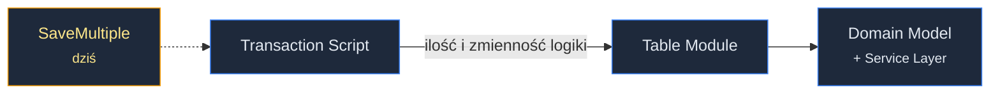
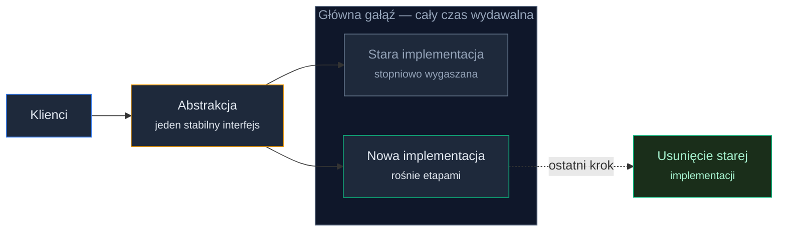
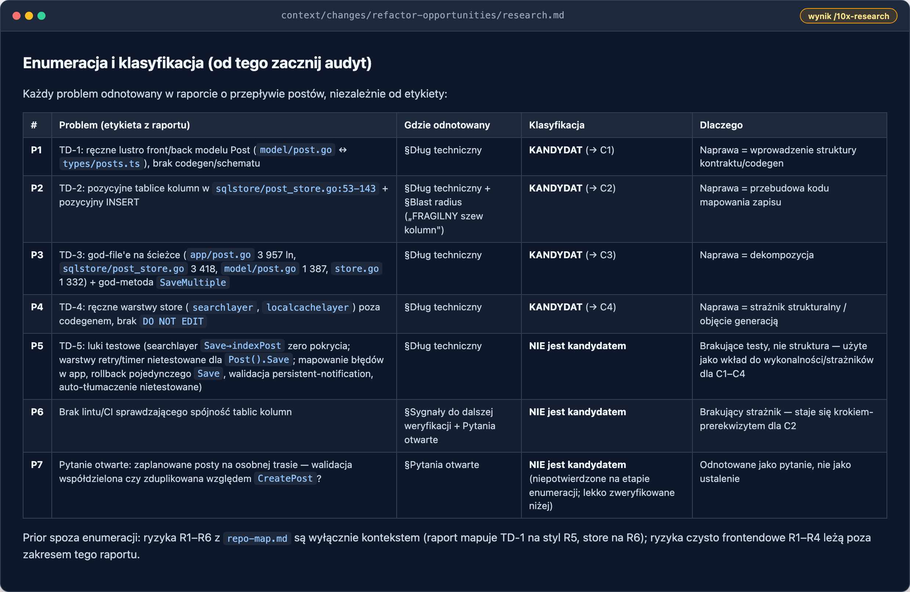
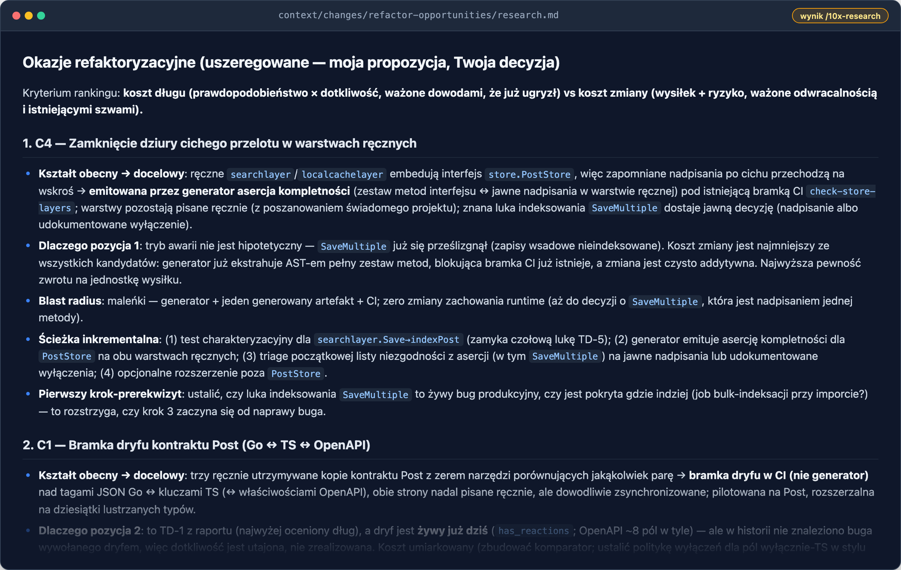
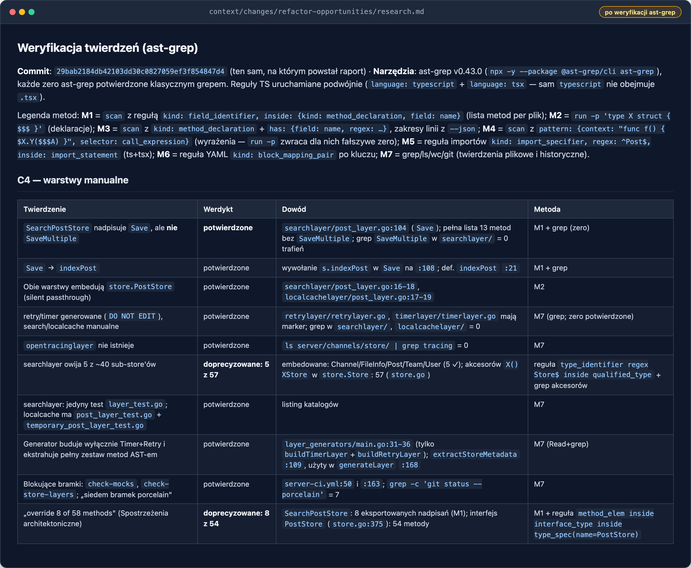
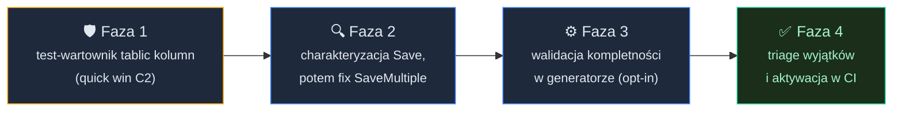
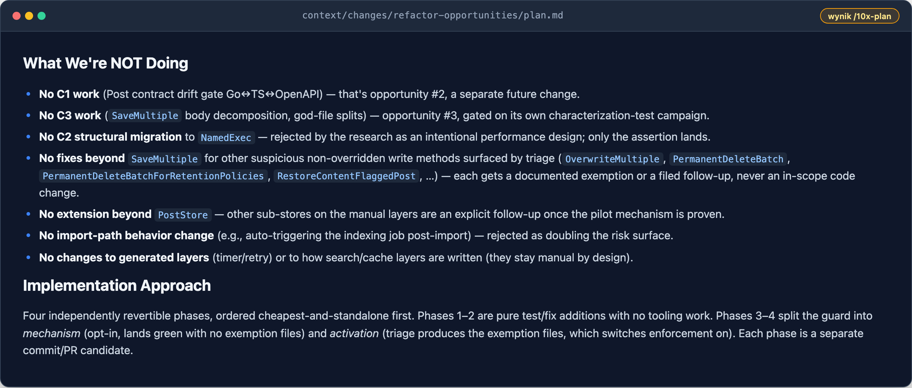

# Refaktoryzacja z Agentem: testy, zmiany, weryfikacja


<!-- cdn: https://images.przeprogramowani.pl/lessons/m4-l4/assets/cover.png -->

W poprzedniej lekcji celowo zatrzymaliśmy się przed refaktoryzacją.

Masz raport z Deep Focus: przepływ zapisu wiadomości odtworzony krok po kroku (②) i mapę kruchości z konkretnymi rodzajami ryzyka (③). Wiesz, gdzie zmiana może cicho zepsuć dane, gdzie brakuje siatki bezpieczeństwa, a gdzie ryzyko jest tylko pozorne.

No właśnie, i co teraz? Można entuzjastycznie spróbować z promptem: "AI: zrefaktoruj ten moduł". Często jednak naszą reakcją jest paraliż. Zrefaktoryzować... ale właściwie co i jak?

W tej lekcji dokładasz do raportu element **④ Refactor opportunities**: ranking opcji refaktoryzacji ugruntowanych w kodzie i historii, z których każdą umiesz obronić przed zespołem. A potem przechodzisz przez moment, w którym z opcji robi się decyzja, a z decyzji plan. Taki, który chroni cię testami, zanim cokolwiek dotkniesz.

Hotspoty z raportu ③ (Technical debt) to problemy, nie zadania. Refaktor zaczyna się dopiero wtedy, gdy nadasz problemowi docelowy kształt, ugruntujesz go w historii i zaplanujesz odwracalną ścieżkę.

Zacznijmy od rozpracowania tego, czego robić nie warto.

## Antywzorzec: refaktor bez kształtu

"Zrefaktoruj ten moduł" to prompt, który może zwrócić imponujący wynik. Agent chętnie przepisze pół warstwy, diff będzie miał czterdzieści plików, nazwy będą ładniejsze, funkcje krótsze. Wygląda jak postęp.

Problem w tym, że temu diffowi brakuje trzech rzeczy.

Nie ma **celu**: nikt nie powiedział, jaki kształt ma być na końcu, więc agent wybrał kształt, który "zwykle pasuje". Nie ma **historii**: ani ty, ani agent nie wiecie, które dziwactwa tego kodu są przypadkowe, a które są świadomymi decyzjami, na których opiera się cały system. I nie ma **drogi odwrotu**: czterdziestu plików naraz nie zweryfikujesz po kawałku ani nie wycofasz bez bólu.

Drugi biegun jest równie kosztowny. Wiesz, że moduł "powinien być lepszy", więc sięgasz po katalog wzorców i modernizujesz wszystko, co nie ucieka. Warstwy rosną, abstrakcje się mnożą, a wartość... no właśnie, gdzie jest wartość?

Wniosek z obu skrajności jest ten sam: agentowi nie zleca się od razu refaktoru. Agentowi zleca się **przedstawienie opcji**, a refaktor zaczyna się od decyzji, którą podejmujesz ty. Do tej decyzji potrzebujesz trzech perspektyw: docelowego kształtu, historii i odwracalnej ścieżki. Bierzemy je po kolei.

## Docelowe kształty modułu

### Spektrum archetypów

Pytanie "do czego modernizować?" ma zaskakująco starą, praktyczną odpowiedź: katalog archetypów organizacji logiki biznesowej, którym branża posługuje się od ponad dwóch dekad (więcej informacji znajdziesz w Deep Dive).

- **Transaction Script** — logika zorganizowana w procedury; każda procedura obsługuje jedno żądanie od początku do końca.
- **Table Module** — jedna instancja obsługuje logikę dla wszystkich wierszy tabeli albo widoku.
- **Domain Model** — obiektowy model domeny, w którym dane i zachowanie żyją razem; operacje aplikacji porządkuje wtedy **Service Layer**, cienka warstwa definiująca dostępne operacje i koordynująca odpowiedź na każdą z nich.

To jest spektrum, nie ranking. Żaden z tych kształtów nie jest "lepszy" - każdy ma próg opłacalności zależny od ilości i zmienności logiki.


<!-- rendered: ../../assets/diagrams-10x/lessons-m4-l4-lesson-draft-1-10x.png | cdn: https://images.przeprogramowani.pl/diagrams/lessons-m4-l4-lesson-draft-1-10x.png -->

Po co ci to spektrum? Bo zamienia "ten kod jest brzydki" w tezę, którą da się obronić albo obalić.

Spójrz na nasz materiał z Mattermosta. `SaveMultiple` w warstwie store to 180 linii: pętla walidacji, akumulacja liczników, transakcja ze wsadowym INSERT-em i poprawki po commicie, wszystko inline - a obok cztery odpowiedzialności już wydzielone do nazwanych helperów. Plik `app/post.go` ma 3957 linii i 60 eksportowanych metod z kilku różnych domen.

Teza, którą możesz postawić: *przerośnięty Transaction Script, którego logika potrzebuje modelu domeny za warstwą usług*. To zdanie innej klasy niż "przepiszmy to". Wskazuje kierunek, pozwala się z nim nie zgodzić i nie przesądza jeszcze, czy w ogóle warto.

Bo spektrum działa też w drugą stronę: mały moduł domenowy z odrobiną logiki ma pełne prawo zostać Transaction Scriptem. Do tego wrócimy za chwilę.

### Historia jako test intencji

Zanim zaproponujesz zmianę kształtu, musisz odpowiedzieć na pytanie, które odróżnia refaktor od psucia cudzej roboty: czy to, co wygląda na śmieć, nie jest przypadkiem świadomą decyzją?

Pomaga tu rozróżnienie dwóch rodzajów złożoności.

**Istotna** wynika z natury problemu - nie usuniesz jej żadnym refaktorem, możesz ją tylko lepiej poukładać. **Przypadkowa** wynika z tego, jak problem kiedyś zapisano - i to ją refaktor faktycznie usuwa. Sęk w tym, że z samego kodu często nie widać, która jest która.

Odpowiedź siedzi w historii decyzji. Najpierw sprawdzasz **ADR-y** (architecture decision records): krótkie notatki "co zdecydowaliśmy, w jakim kontekście i z jakimi konsekwencjami". Jeśli zespół je prowadzi, czytasz je, zanim cokolwiek "naprawisz".

Mattermost ADR-ów nie prowadzi. I to jest najczęstszy przypadek, więc dobrze, że trafił się w demo: zostaje archeologia gita. `git log -L` po funkcji, blame, uzasadnienia w opisach commitów i PR-ów.

Weźmy kandydata, który w raporcie ③ (Technical debt) wyglądał na podręcznikową złożoność przypadkową: pozycyjne tablice kolumn przy zapisie posta. Osiemnaście kolumn, których kolejność musi się zgadzać w dwóch funkcjach naraz, zapis pozycyjny, odczyt po nazwach, zero osłon. Aż się prosi o "kto to napisał?!"... prawda?

Archeologia git mówi co innego. Commit `27d536b212` z marca 2020 wprowadził ten kształt celowo: zastąpił refleksyjny zapis pojedynczych wierszy pozycyjnym, wsadowym INSERT-em, żeby masowy import wiadomości przestał być wąskim gardłem. A w historii pliku nie ma ani jednego commita naprawiającego błąd kolejności kolumn. Sześć lat, zero wpadek.

Werdykt się odwraca: to nie przypadkowa złożoność, tylko **świadome ograniczenie**. Decyzja nośna, na której stoi wydajność importu.

### Guard, nie przebudowa

No dobrze, ale ryzyko przecież nie zniknęło. Nic nie pilnuje zgodności tych tablic, a zamiana dwóch sąsiednich kolumn tego samego typu przeszłaby cicho przez cały zestaw testów.

I tu wchodzi reguła, którą warto zapamiętać na całą pracę z legacy: **guard, nie przebudowa**. Świadomemu ograniczeniu nie zmienia się kształtu. Dokłada mu się tanią, deterministyczną osłonę, która zamienia "łatwo o tym zapomnieć" w "nie da się tego popsuć". W naszym przypadku: test jednostkowy sprawdzający zgodność obu tablic. Czysty dodatek, odwracalny jednym revertem, a wydajnościowa decyzja z 2020 roku zostaje nietknięta.

To jest dobranie skali refaktoryzacji do problemu (right-sizing). Ten filtr domyka pierwszą perspektywę:

- mały moduł z prostą logiką **zostaje** Transaction Scriptem,
- świadome ograniczenie dostaje **guard**,
- przebudowę rezerwujesz dla złożoności przypadkowej, której koszt realnie rośnie.

Pominiesz ten filtr - fundujesz sobie sztukę dla sztuki: wzorce wszędzie, wartość nigdzie.

## Odwracalna droga do celu

Załóżmy, że jakiś kandydat przechodzi przez obie ścieżki analizy: historia sprawdzona, rodzaj złożoności zidentyfikowany i werdykt brzmi "przypadkowe, warto ruszyć". Jak dojść do docelowego kształtu bez awarii systemu?

Dwie strategie pokrywają większość przypadków:

**Strangler Fig**: nowy kod rośnie na brzegach starego. Małe fragmenty zachowania przenoszą się do nowej struktury, stary system jest stopniowo wygaszany, aż można go usunąć. Najważniejszy powód, żeby wybrać tę drogę zamiast przepisania od zera, to mniejsze ryzyko: w każdym momencie masz działającą całość.

**Branch by Abstraction**: duża zmiana bez długotrwałego, zablokowanego brancha. Wstawiasz abstrakcję nad miejscem interakcji ze starym kodem i dalej idziesz etapami, a główna gałąź przez cały czas trwania zmiany nadaje się do wydania:


<!-- rendered: ../../assets/diagrams-10x/lessons-m4-l4-lesson-draft-2-10x.png | cdn: https://images.przeprogramowani.pl/diagrams/lessons-m4-l4-lesson-draft-2-10x.png -->

Została kwestia porządku kroków. Przy dużej zmianie wszystko zależy od wszystkiego - od czego zacząć? Praktyczna mechanika wygląda tak: spróbuj docelowej zmiany, zobacz, co przestaje działać, zapisz to, a potem **cofnij** zmianę i rozwiązuj problemy od najdalszego liścia do korzenia zmiany. Z "wielkiej zmiany" robi się graf małych kroków, z których każdy jest weryfikowalny i osobno odwracalny. W literaturze ta metoda ma nazwę i własny graf - znajdziesz je w Deep Dive.

I ostatni element układanki, siatka bezpieczeństwa w wersji dla cudzego kodu. **Test charakteryzujący** przybija *obecne* zachowanie - niekoniecznie poprawne! - żeby zmiana strukturalna nie zmieniła go po cichu. Warto dodać go w miejscu, gdzie da się obserwować zachowanie bez edytowania kodu, który właśnie chronisz. Reguła brzmi: dodaj test, zanim dotkniesz. Tutaj wraca ostrzeżenie o problemie wyroczni z lekcji o planie testów (M3L1) - test charakteryzujący utrwala stan zastany, więc świadomie decydujesz, że *ten* fragment zachowania jest wart utrwalenia.

Mamy komplet perspektyw na potencjalną refaktoryzację: kształt, historię i drogę. Czas oddać te trzy soczewki agentowi. Na naszych warunkach.

## Element ④ (Refactor opportunities): eksploracja i ranking opcji

Wszystko powyżej dałoby się zrobić ręcznie... tylko kto ma na to czas w cudzym repo o dużej skali? To jest dokładnie ta praca, którą AI może wykonać za nas: przeczytać każdy zapisany problem, prześwietlić jego obecny kształt i historię, ocenić wykonalność migracji - i oddać ci ranking opcji.

Wracamy do znanego cyklu: `/10x-new` otwiera zmianę, `/10x-research` eksploruje. Nowość polega na kontrakcie, którym karmisz research, i na jednej zasadzie, która spina całą lekcję: **eksploracja kończy się raportem, nie decyzją**.

Najpierw zmiana z jawnie zapisaną intencją:

```text
/10x-new refactor-opportunities

Intencja: mamy analizę modułu, która dokumentuje dług techniczny
i ryzyka strukturalne: context/changes/post-flow-analysis/research.md. Ta zmiana odpowiada na pytanie, które tamta analiza celowo zostawiła otwarte:
KTÓRE z tych problemów warto naprawić, w jakim docelowym kształcie i w jakiej kolejności. Eksplorujemy każdy zapisany problem w kodzie i historii, a potem porządkujemy jako refactor opportunities.
Zmiana przebiega etapami: eksploracja → decyzja i plan → implementacja. Na etapie eksploracji nie dzieje się żaden refaktor i nie zapada żadna decyzja.
Wynik eksploracji: research.md tej zmiany, zakończony rankingiem opcji z trade-offami. Najpierw przeczytam raport; decyzja, co realizujemy, zapada na etapie planowania, a refaktor rusza dopiero według przyjętego planu.
```

Zwróć uwagę na końcówkę: "na etapie eksploracji nie dzieje się żaden refaktor", "decyzja zapada na etapie planowania". To nie ozdobnik. Intencja żyje w `change.md`, więc każda następna sesja i każdy skill, który po nią sięgnie, odziedziczy te granice - a refaktor ma prawo ruszyć w tej zmianie dopiero według przyjętego planu.

Może cię kusić, żeby nie otwierać nowej zmiany i dopisać ten research do `post-flow-analysis` - wszystko w jednym miejscu. Nie rób tego. Zmiana research-only to nie sierota: jej produktem jest raport, który następna zmiana czyta jako prior. Dokładnie tak, jak w tym przypadku, gdy bazujemy na analizie z poprzedniej lekcji. Wspólną pamięcią projektu jest `context/`, a zmiany to jej wpisy: każda z własną intencją - czasem jest nią sam research, czasem plan i implementacja.

Teraz kontrakt eksploracji. Ma jeden placeholder (ścieżkę do twojej analizy z poprzedniej lekcji), reszta jest uniwersalna. Agent zbuduje raport szans na refaktoryzację, bo na tym etapie ty jeszcze *nie wiesz*, na czym się skupić. Wyprodukowanie tej wiedzy to właśnie zadanie researchu:

```text
/10x-research refactor-opportunities Przeczytaj analizę: context/changes/post-flow-analysis/research.md - zapis długu technicznego i ryzyk strukturalnych tego repozytorium. Traktuj jej ustalenia jako zebrane dowody: nie wyprowadzaj ich na nowo, buduj na nich. Jeśli odwołuje się do innych artefaktów (mapa repo, wcześniejszy research), przeczytaj je również jako priory.

Wypisz każdy problem, który raport odnotowuje, niezależnie od etykiety (dług, ryzyko, hotspot, znalezisko).
Sklasyfikuj każdy: KANDYDAT to problem, którego naprawa zmieniłaby strukturę kodu; wszystko inne (np. brakujący test, luka w dokumentacji) nie jest kandydatem - zachowaj to jako wejście do oceny wykonalności i kosztu. Wypisz listę i klasyfikację kandydatów na początku wyniku, żebym mógł ją zaudytować.

Następnie zbadaj każdego kandydata trzema sub-agentami; wszystkie pracują w trybie eksploracji, bez wprowadzania zmian:

1. Obecny kształt - potwierdź w kodzie, jaki kształt kandydat ma dziś: gdzie żyje logika, jak mieszają się odpowiedzialności, jakie abstrakcje lub powiązania już istnieją. Cytuj plik:linia. Oznacz każde twierdzenie jako evidence / inference / unknown.

2. Historia i intencjonalność - ustal, DLACZEGO kod ma taki kształt:
ADR-y i dokumenty projektowe, jeśli istnieją; w przeciwnym razie archeologia gita (git log -L, blame, uzasadnienia w commitach i PR-ach). Werdykt per kandydat: świadome ograniczenie (decyzja nośna) vs przypadkowa złożoność - albo uczciwie oznacz jako unknown, jeżeli ciężko to określić.

3. Wykonalność migracji - czego wymagałaby inkrementalna, odwracalna ścieżka (istniejąca abstrakcja vs nowa abstrakcja), co wynika z danych o blast radius z raportu, jakie osłony i testy już istnieją wokół (sprawdź konfigurację CI) i jaki byłby pierwszy krok-prerekwizyt.

Twarde granice:
- Żadnych zmian w kodzie. Żadnego refaktoru. Dowody przed interpretacją.
- Nie projektuj docelowej architektury poza nazwaniem adekwatnego docelowego kształtu per kandydat. Jeśli prawdziwa naprawa kandydata to przeprojektowanie pojęć biznesowych, a nie struktury kodu - powiedz to i zatrzymaj się: to przedmiot do innej, późniejszej analizy.
- Gdzie brakuje danych, napisz unknown - nie wypełniaj luk wiarygodnymi domysłami.

Synteza (po raportach wszystkich trzech subagentów): zapisz research.md w folderze tej zmiany.
Per kandydat: obecny kształt (z dowodami), werdykt intencjonalności, notatki o wykonalności. Zamknij sekcją "Refactor opportunities" z 2-3 najmocniejszymi kandydatami w rankingu - dla każdego: obecny → docelowy kształt, czemu zasługuje na to miejsce (koszt długu vs koszt zmiany), blast radius, szkic inkrementalnej ścieżki, pierwszy krok-prerekwizyt. Wypisz też kandydatów rozważonych i odrzuconych, z krótkim podsumowaniem dlaczego. Oceniaj na podstawie dowodów. NIE proś mnie o wybór, potwierdzenie ani zgodę - zakończ zapisaniem gotowego raportu. Ranking to propozycja dla osobnej sesji planowania, która odbędzie się po mojej lekturze.
```

Rozpoznajesz strukturę tego researchu? Obszar działania subagentów to dokładnie trzy perspektywy z tej lekcji: kształt, historia z intencjonalnością, wykonalność z odwracalnością. Granica pojęć biznesowych pilnuje, żeby analiza nie weszła na teren, który należy do następnej lekcji. A zakończenie zakazuje agentowi wymuszania przedwczesnych decyzji: potrzebujemy raportu do przeczytania, decyzjami zajmiemy się później.

Co wróciło z wykonania researchu na Mattermoście? Kilka rzeczy, których nie było w żadnym z naszych dotychczasowych dokumentów.

**Analiza znalazła więcej, niż raport ③ (Technical debt) etykietował.** Siedem problemów P1–P7, z czego dwa były zapisane w ③ tylko między wierszami. Cztery z nich to kandydatury: **C1** (lustrzane odwzorowanie modelu Post), **C2** (pozycyjne tablice), **C3** (god-method `SaveMultiple`) i **C4** (ręczne warstwy store); reszta - braki testów i osłon - została jako wejście do oceny wykonalności. Brak jakiegokolwiek guardu dla tablic awansował z podejrzenia na fakt. A na zdublowanej walidacji zaplanowanych postów zadziałała granica z kontraktu: "przeprojektowanie zachowania biznesowego - inna, późniejsza analiza".


<!-- cdn: https://images.przeprogramowani.pl/lessons/m4-l4/assets/artifact-research-enumeration.png -->

**Raport ③ (Technical debt) dostał trzy korekty.** Sprzężone tablice są dwie, nie trzy; kontrakt modelu Post dryfuje trójstronnie (Go ↔ TS ↔ OpenAPI), nie dwustronnie; a przetestowana warstwa cache pokazała, że dziura w pokryciu siedzi konkretnie w searchlayer. Wniosek praktyczny: ustalenia z Deep Focus to wejście, które dalej można ulepszać. Kolejny etap pipeline'u ma prawo je doprecyzować i właśnie po to czyta je na nowo.

**I najważniejsze: ranking odwrócił faworyta.** Naszym typem były pozycyjne tablice (C2) - najefektowniejsza kruchość raportu ③. Research odrzucił je jako refaktor: świadoma decyzja wydajnościowa, zero błędów w sześcioletniej historii, adekwatna odpowiedź to guard. Znasz już to rozumowanie z sekcji wyżej... i potwierdziła to również analiza agenta. Przy okazji domknął się wątek z issue, od którego wyszliśmy w poprzedniej lekcji: pomysł "zoptymalizujmy ten przepływ". Okazuje się, że przepływ zapisu już jest zoptymalizowany - to właśnie ta decyzja z 2020 roku. Jedyne czego tam brakuje to odpowiedniego guarda.

Na szczyt wszedł za to kandydat, o którym myśleliśmy najmniej: ręczne warstwy store (C4). Powód jest konkretny. Obie ręczne warstwy osadzają interfejs `PostStore` (54 metody) i nadpisują po kilka z nich; każda nieprzewidziana metoda **po cichu przelatuje** niżej bez błędu kompilacji.

Strukturalnie to nie jest hipoteza: searchlayer nadpisuje `Save`, ale nie `SaveMultiple`, więc zapisy wsadowe na tej trasie omijają indeksowanie wyszukiwarki. Czy ta dziura boli już dziś w działającym systemie? Tego research nie domknął: odpowiedź wisi na pytaniu, czy import ma osobny reindex. Sama luka w mechanizmie jest jednak faktem, nie podejrzeniem - scenariusz awarii "łatwo zapomnieć" ma już swoją instancję w kodzie.

Ranking końcowy: **C4** (domknięcie dziury ręcznych warstw poprzez guarda kompletności) → **C1** (bramka dryfu kontraktu Post) → **C3** (zawężona dekompozycja `SaveMultiple`), a **C2** odrzucone jako refaktoryzacja, z rekomendacją taniego testu. Każda pozycja niesie: obecny → docelowy kształt, blast radius, szkic inkrementalnej ścieżki i pierwszy prerekwizyt. Na końcu lista odrzuconych z powodami.


<!-- cdn: https://images.przeprogramowani.pl/lessons/m4-l4/assets/artifact-research-ranking.png -->

To jest element ④ twojego raportu - sekcja "Refactor opportunities" w `research.md` tej zmiany.

Czy historia naprawdę zmienia decyzje? Właśnie to zobaczyłeś. Bez perspektywy intencjonalności C2 byłoby na szczycie, C4 w ogonie - i spędzilibyśmy wiele godzin na przebudowie czegoś, co od sześciu lat działa, zamiast domknąć dziurę, która już dziś przepuszcza zapisy obok indeksowania.

## Przeczytaj, zanim zdecydujesz

Eksploracja się skończyła, raport leży w folderze zmiany... i to jest moment, w którym łatwo zepsuć całą robotę jednym kliknięciem.

Ranking wygląda na gotową decyzję. Nie jest nią. Jest propozycją - i nieprzypadkowo kontrakt zabronił agentowi kończyć pytaniem "czy zatwierdzasz?". Pytanie zadane przy świeżym wyniku wymusza odpowiedź pod presją, bez lektury. Znasz ten mechanizm z preworku [1.3]: wygeneruj, a potem **zrozum**. Szybko zamknięte zadanie to nie to samo co decyzja, którą umiesz obronić.

Dlatego przeczytaj `research.md` na spokojnie. Zwróć uwagę na trzy rzeczy:

- lista kandydatów - czy wszystkie problemy z poprzedniego raportu Deep Focus są ujęte i ich klasyfikacja kandydat/nie-kandydat się broni,
- werdykty intencjonalności - czy każdy ma dowód (konkretny commit, ADR, PR), a nie przeczucie,
- ranking - czy zgadzasz się z proponowaną kolejnością i argumentami.

Jest jeszcze czwarty ruch - znasz go z poprzedniej lekcji (M4L3). Ranking stoi na twierdzeniach strukturalnych: liczbie metod w interfejsie, "nadpisuje X, ale nie Y", liczności call-site'ów. To dokładnie ta kategoria, w której pewnie wyglądające liczby najczęściej okazują się przybliżeniem - a od tych liczb za chwilę zależy twoja decyzja. Zanim przejdziesz do planowania, potwierdź je tym samym śledztwem ast-grep, którym weryfikowałeś raport ② (Feature overview) i ③ (Technical debt):

```text
Zweryfikuj raport context/changes/refactor-opportunities/research.md.

Wypisz z niego twierdzenia STRUKTURALNE, na których stoi ranking (liczby metod, "nadpisuje X, ale nie Y", liczność call-site'ów, pary lustrzanych typów).

Dla każdego zbuduj wzorzec ast-grep, wywołaj go i podaj wynik jako: twierdzenie -> potwierdzone / doprecyzowane / obalone, z plikami i liniami. Każde zero z ast-grep potwierdź klasycznym grepem.

Po weryfikacji zaktualizuj analizowany raport:
- błędne liczby i numery linii popraw w miejscu, w formacie "150 (raport: 145)" — tak, żeby ślad korekty został w tekście;
- dodaj sekcję "## Weryfikacja twierdzeń (ast-grep)" z tabelą: twierdzenie → werdykt → dowód (plik:linia) → metoda (wzorzec/reguła);
- zaktualizuj frontmatter: last_updated, dopisz tag "verified" i commit weryfikacji;
- sekcji "Refactor opportunities (ranked)" oraz werdyktów intencjonalności NIE zmieniaj.

Jeśli wynik podważa pozycję kandydata, opisz to wyłącznie w sekcji weryfikacji, z adnotacją "do decyzji na etapie planowania".
```

U nas to sito przeczesało raport liczba po liczbie. Żaden werdykt nie obalił pozycji w rankingu, ale liczby zostały doszlifowane: searchlayer owija 5 z 57 sub-store'ów (raport mówił „z ~40"), typ `Post` jest importowany w 150 plikach webappu, nie 145, plików lustrzanych typów jest w repo 58, a produkcyjnych call-site'ów `Save`/`SaveMultiple` jest 5, nie 4. Jedna z wcześniejszych „korekt" raportu sama okazała się błędna: struct `Post` zaczyna się na linii 114, dokładnie tak, jak twierdziła pierwotna analiza - poprawka na 113 została obalona. Inne liczby przeszły co do sztuki: dokładnie 60 eksportowanych metod w `app/post.go`, dokładnie 430 commitów historii, 18↔18 pozycji w sprzężonych tablicach.

Najciekawsze znalezisko wzmocniło faworyta. Kluczowy dowód rankingu - „nadpisuje `Save`, ale nie `SaveMultiple`" - przeszedł próbę wprost: pełna lista metod warstwy bez `SaveMultiple`, zero z ast-grep potwierdzone grepem. A do tego weryfikacja dołożyła nowy argument: wszystkie trzy produkcyjne wywołania `SaveMultiple` to ścieżki bulk importu, czyli dokładnie ta trasa, której searchlayer nie indeksuje. Pytanie otwarte „czy import ma osobny reindex?" zrobiło się pilniejsze, nie mniej.


<!-- cdn: https://images.przeprogramowani.pl/lessons/m4-l4/assets/artifact-research-verification.png -->

Zwróć uwagę, co tu się stało: weryfikacja niczego nie wywróciła, a mimo to podniosła wartość raportu. Liczby „około" stały się dokładne, twierdzenia dostały plik i linię, a jedna cicha korekta została cofnięta. Z takim materiałem wchodzisz w planowanie bez kredytu zaufania.

I masz pełne prawo się nie zgodzić. Przykład z naszego raportu: C1 stoi na miejscu drugim, ale jego mechanizm skaluje się na 58 plików lustrzanych typów w repo i 150 plików importujących sam typ `Post` - obie liczby potwierdzone w weryfikacji. Jeśli ważysz wartość skumulowaną wyżej niż pojedynczy naprawiony bug, możesz przesunąć C1 na szczyt. To jest dokładnie ta rozmowa, którą za chwilę odbędziesz podczas planowania - z tą różnicą, że po lekturze raportu możesz poprowadzić tę sesję świadomie i wziąć odpowiedzialność za decyzje.

<div style="padding:56.25% 0 0 0;position:relative;"><iframe src="https://player.vimeo.com/video/1199157713?title=0&amp;byline=0&amp;portrait=0&amp;badge=0&amp;autopause=0&amp;player_id=0&amp;app_id=58479" frameborder="0" allow="autoplay; fullscreen; picture-in-picture; clipboard-write; encrypted-media; web-share" referrerpolicy="strict-origin-when-cross-origin" style="position:absolute;top:0;left:0;width:100%;height:100%;" title="m4l4"></iframe></div><script src="https://player.vimeo.com/api/player.js"></script>

## Bramka decyzyjna w /10x-plan

Ostateczna decyzja, nad czym się skupimy, zapada w `/10x-plan`. Mechanikę planera znasz już z modułu 2. Tym razem wykorzystamy go do podjęcia decyzji o refaktoryzacji.

```text
/10x-plan refactor-opportunities
```

Planer czyta `research.md` z folderu zmiany automatycznie, dzięki czemu nie musimy odpowiadać na pytania diagnostyczne - cały budżet pytań idzie w decyzje projektowe. W naszym przebiegu padło ich siedem, w tym jedno, którego planer nie miał w scenariuszu - do tego wrócimy za chwilę. Pierwsze brzmiało dokładnie tak, jak powinno: **którą opcję realizujemy?** Zadziałało zastrzeżenie z kontraktu: ranking to propozycja, a decyzja zapada na etapie planowania. Dzięki niemu akceptacja rankingu stała się jawnym pytaniem, a nie cichym założeniem.

Przykładowy wybór: C4 plus test-guard z C2 (ten tani, szybki zysk "niezależnie od rankingu"). Kolejne pytania krążyły wokół kompromisów: jak egzekwować kompletność (walidacja w generatorze warstw, pod istniejącą blokującą bramką CI, zamiast nowej infrastruktury), jak zapisywać wyjątki (jawna lista z obowiązkowym powodem per metoda), jaki zasięg pilota, jaki rollout.

A potem wydarzyło się coś, co warto zapamiętać jako wzorzec weryfikacji. Planer w swojej fazie researchu sprawdził otwarte pytanie z rankingu: czy luka `SaveMultiple` to żywy bug? I wrócił z twardym dowodem: jedynymi wywołującymi są trzy miejsca importu wsadowego, po imporcie nic automatycznie nie reindeksuje, a wewnętrzna delegacja `Save→SaveMultiple` siedzi *pod* searchlayer, więc nadpisanie niczego nie podwoi. Zaimportowane posty są nieprzeszukiwalne, dopóki admin ręcznie nie odpali reindeksacji. I ten nowy dowód nie został po cichu wchłonięty do planu. To tutaj padło zapowiedziane pytanie spoza scenariusza - siódme, wymuszone świeżym dowodem: czy chcemy się tym zająć?

Po drodze, już trzeci raz w tym procesie, doprecyzował się projekt testu dla sprzężonych tablic. Ten wątek warto wyciągnąć przed nawias, bo ciągnie się przez wszystkie etapy pracy:

1. Test "okrężny" (zapisz → odczytaj → porównaj) brzmi naturalnie, ale jest bezwartościowy: odczyt idzie po nazwach i wybacza, zapis jest pozycyjny i nie wybacza. Taki test zostaje zielony przy zamienionych kolumnach.
2. Szkic z researchu (porównanie typów per indeks) też jest kruchy: cztery z osiemnastu kolumn nie przechodzą naiwnego porównania typów (trzy serializują się do JSON-a, jedna jest wskaźnikiem), a zamiana sąsiednich kolumn tego samego typu przechodzi bez śladu.
3. Finalny projekt z planowania: **wartości-wartownicy** - charakterystyczna wartość w każdym polu i asercja tożsamości per nazwa kolumny.

Każdy etap złapał to, co przepuścił poprzedni. Im bliżej implementacji, tym ostrzejsze oko - pod warunkiem, że możemy bazować na solidnej analizie z poprzednich etapów.

Efektem sesji jest `plan.md` w czterech fazach, ułożonych w porządku guard-first:


<!-- rendered: ../../assets/diagrams-10x/lessons-m4-l4-lesson-draft-3-10x.png | cdn: https://images.przeprogramowani.pl/diagrams/lessons-m4-l4-lesson-draft-3-10x.png -->

Warto się skupić na dwóch własnościach planu, bo to one niosą całą filozofię lekcji:

- **Dodaj test, zanim dotkniesz.** Faza 2 zaczyna się od testu charakteryzującego istniejące zachowanie `Save→indexPost` (ta ścieżka nie ma dziś żadnego pokrycia) i dopiero potem dodaje nadpisanie `SaveMultiple`. Test najpierw, edycja potem. Nie "obok".
- **Mechanizm ląduje na zielono, egzekwowanie włącza się osobno.** Walidacja kompletności z fazy 3 jest domyślnie wyłączona i włącza się per warstwa: aktywuje ją dopiero plik wyjątków z fazy 4, czyli przegląd ~93 nienadpisanych metod `PostStore` z obu ręcznych warstw (po ~45-48 na warstwę), każda z obowiązkowym uzasadnieniem. Duża zmiana rozłożona na kroki, z których każdy jest osobnym, odwracalnym commitem... brzmi znajomo? To porządek "od liści do korzenia" w wersji operacyjnej.

Do tego jawna sekcja "czego NIE robimy" (w planie: *What We're NOT Doing*): bez C1, bez C3, bez migracji zapisu na nazwy, a wszystko, co podejrzanego wypłynie w przeglądzie, dostaje wyjątek z uzasadnieniem albo osobny follow-up - bez robienia wszystkiego naraz. Wąski zakres to nie brak ambicji, tylko kontrola pola rażenia.


<!-- cdn: https://images.przeprogramowani.pl/lessons/m4-l4/assets/artifact-plan-scope.png -->

W planie nie znajdziesz też Stranglera ani Branch by Abstraction - i to również jest dopasowanie akcji do problemu. Wybrany kandydat to guard i domknięcie dziury, nie migracja struktury, więc obie strategie czekają na kandydatów pokroju C3. Swoją robotę i tak wykonały: to one były perspektywą, przez którą research oceniał wykonalność każdej opcji.

## Realizacja planu: wpinamy się w znany cykl

Sesja planowania kończy się tak, jak zwykle. Otrzymujemy plan podzielony na fazy, który warto przeczytać i zweryfikować za pomocą `/10x-plan-review` w nowej sesji. Kiedy wszystko jest potwierdzone, możemy ruszyć z implementacją:

```text
/10x-implement refactor-opportunities phase 1
```

I tu lekcja świadomie się zatrzymuje. Implementowanie planów już znasz.

W poprzedniej lekcji (M4L3) zajrzeliśmy na chwilę w drugą połowę ast-grep - rewrite. W tej lekcji narzędzie pracowało w roli, którą znasz: weryfikatora twierdzeń strukturalnych, tym razem tych, na których stał ranking kandydatów do refaktoryzacji. Nasz plan rewrite'u akurat nie potrzebuje - fazy to testy i walidacja w generatorze - ale gdy któraś faza twojego planu okaże się mechaniczną, zachowującą kształt transformacją (podmiana wywołań, zmiana sygnatury w wielu miejscach), warto pamiętać o tym narzędziu.

To, co nowe, już się wydarzyło i jest zapisane w samym planie. Spójrz na niego raz jeszcze, tym razem jako na artefakt "testy, zmiany, weryfikacja": każda faza ma jawne kryteria weryfikacji (automatyczne i ręczne) i jest odwracalna przez dedykowany commit. Bezpieczeństwo tej refaktoryzacji nie jest obietnicą, a zaprojektowaną własnością planu - i dokładnie dlatego to plan jest produktem tej lekcji.

Element ④ dołącza do raportu. Mapa ①, przepływ ②, dług ③, ranking refaktoryzacji z decyzją ④. Została jedna luka.

Zwróć uwagę, gdzie nasza eksploracja refaktoryzacji się zatrzymała: przy zdublowanej walidacji zaplanowanych postów. Tam problemem nie była struktura kodu, tylko pytania, na które kod nie zna odpowiedzi: czym właściwie jest zaplanowana wiadomość w języku domeny? Które reguły obowiązują w momencie planowania, a które w momencie publikacji? Najgłębsze szanse modernizacji nie są strukturalne, tylko domenowe. W następnej lekcji o modernizacji legacy z DDD (M4L5) wyciągniesz z kodu domenę, której nikt nigdy nie nazwał - i domkniesz raport elementem ⑤ (DDD opportunities): rankingiem szans modernizacji domenowej.

## 🧑🏻‍💻 Zadania praktyczne

Na start pobierz paczkę promptów dla tej lekcji:

```bash
npx @przeprogramowani/10x-cli@latest get m4l4
```

Pracujesz na artefakcie z poprzedniej lekcji: `context/changes/{change-id}/research.md` z sekcjami ② (Feature overview) i ③ (Technical debt). `{change-id}` to identyfikator zmiany, pod którym w M4L3 zapisałeś analizę przepływu (np. `post-flow-analysis`) - tą wartością podmieniasz placeholder w promptach z paczki. Jeśli raportu nie masz, wróć do lekcji o analizie feature z AI (M4L3) - eksploracja opcji bez raportu z dowodami to zgadywanie z lepszym UX.

Cel ćwiczenia: element ④ (Refactor opportunities) plus plan jednej bezpiecznej zmiany. Kończysz na planie i przekazaniu go do implementacji; realizację faz dokładasz później, znanym cyklem z M2 i M3, jeśli chcesz domknąć zmianę w swoim repo.

### Krok 0: Otwórz zmianę z jawną intencją

```text
/10x-new refactor-opportunities

Intencja: mamy analizę tego repozytorium, która dokumentuje dług techniczny
i ryzyka strukturalne: context/changes/{change-id}/research.md. Ta zmiana odpowiada na pytanie, które tamta analiza celowo zostawiła otwarte:
KTÓRE z tych problemów warto naprawić, w jakim docelowym kształcie i w jakiej kolejności. Eksplorujemy każdy zapisany problem w kodzie i historii, a potem porządkujemy je jako refactor opportunities.
Zmiana przebiega etapami: eksploracja → decyzja i plan → implementacja. Na etapie eksploracji nie dzieje się żaden refaktor i nie zapada żadna decyzja.
Wynik eksploracji: research.md tej zmiany, zakończony rankingiem opcji z trade-offami. Najpierw przeczytam raport; decyzja, co realizujemy, zapada na etapie planowania, a refaktor rusza dopiero według przyjętego planu.
```

### Krok 1: Odpal eksplorację z kontraktem

Użyj kontraktu z lekcji (sekcja "Element ④ (Refactor opportunities)"), podmieniając tylko ścieżkę do swojej analizy. Nie skracaj twardych granic - to one trzymają jakość wyniku.

Po zakończeniu nie odpowiadaj agentowi na nic. Eksploracja ma się skończyć raportem.

### Krok 2: Przeczytaj raport

Poza sesją agenta, z notatnikiem:

- audyt listy kandydatów: czy wszystkie problemy z ③ (Technical debt) są ujęte i sensownie sklasyfikowane (kandydat vs wejście do wykonalności)?
- werdykty intencjonalności: czy każdy ma dowód - konkretny commit, ADR, PR - a nie przeczucie?
- ranking: czy kupujesz kolejność? Zanotuj, co byś przesunął i dlaczego.
- twierdzenia strukturalne za czołowymi kandydatami: zweryfikuj je promptem `m4l4-3` z paczki (ten sam, który widziałeś w sekcji "Przeczytaj, zanim zdecydujesz") - poprawi liczby w raporcie i dopisze sekcję weryfikacji; każde zero z ast-grep jest w nim potwierdzane grepem.

Jeśli któryś werdykt wisi na "unknown", to też jest wynik - zdecydujesz o nim świadomie w planie, zamiast odkryć w połowie implementacji.

### Krok 3: Podejmij decyzję w wywiadzie planera

```text
/10x-plan refactor-opportunities
```

Czego pilnujesz w wywiadzie:

- pierwsze pytanie powinno dotyczyć wyboru opcji - to twoja decyzja, nie potwierdzenie rankingu,
- przetestuj przynajmniej jedną ⭐ rekomendację kontrpytaniem, nawet jeśli wygląda dobrze,
- trzymaj wąski wycinek: jedna opcja (plus ewentualny tani, szybki zysk) i jawne "czego NIE robimy".

### Krok 4: Odbierz plan i sprawdź jego własności

Zanim uznasz plan za gotowy, sprawdź cztery rzeczy:

- charakteryzacja przed dotknięciem: tam, gdzie plan edytuje niepokryty kod, najpierw przybija obecne zachowanie testem,
- fazy są osobno odwracalnymi commitami, ułożonymi od najtańszej i najbardziej samodzielnej,
- każda faza ma kryteria weryfikacji - automatyczne i ręczne,
- mechanizmy lądują na zielono, a egzekwowanie włącza się jawnie, osobnym krokiem.

Po własnym przeglądzie zweryfikuj plan przez `/10x-plan-review` w nowej sesji, tak jak w sekcji "Przekazanie planu" - świeży kontekst wyłapie to, co umknęło i tobie, i planerowi.

Wynik ćwiczenia: sekcja "Refactor opportunities" w `research.md` (element ④), `plan.md` z powyższymi własnościami i polecenie `/10x-implement refactor-opportunities phase 1` w schowku.

## Odbierz swoją odznakę

Po ukończeniu tej lekcji odbierz odznakę w sekcji [10xDevs Mission Log](https://platforma.przeprogramowani.pl/10xdevs-3/mission-log) a następnie pochwal się swoim osiągnięciem!

## 🔎 Deep Dive

Ta sekcja zawiera dodatkowe pogłębienie wiedzy na temat wybranych zagadnień związanych z lekcją. W tym Deep Dive znajdziesz:

- **Od jednego kroku do kampanii** — co zrobić, gdy element ④ (Refactor opportunities) zostawia więcej niż jedną opcję wartą realizacji: `/10x-test-plan` jako orkiestrator rozłożonej w czasie kampanii.
- **Skąd pochodzą techniki stosowane w lekcji?** — autorzy, źródła i daty stojące za archetypami, złożonością istotną i przypadkową, Stranglerem, Branch by Abstraction, metodą Mikado, testami charakteryzującymi i ADR-ami.
- **Szersza perspektywa na refaktoryzację** — kwadrant długu technicznego i klasyczna przestroga przed wielkim przepisaniem.

Ta sekcja lekcji nie jest obowiązkowa, ale warto się z nią zapoznać jeżeli chcesz zostać ekspertem.

### Od jednego kroku do kampanii

Plan z tej lekcji domyka kilka wybranych kandydatów refaktoryzacji. Ale został nam szerszy backlog: bramka dryfu kontraktu (C1), pokrycie ścieżek błędów, rozszerzenie sprawdzonych guardów na kolejne sub-store'y. Jeśli widzisz przed sobą tygodnie takiej pracy, a nie jeden krok, to warto wykorzystać `/10x-test-plan`, który znasz z lekcji o planie testów (M3L1).

W naszym użyciu na Mattermoście, nakarmiony decyzją (plan + oba researche), zrobił dwie rzeczy warte odnotowania.

Po pierwsze, nie zdublował pracy. Rozpoznał, że istniejący plan już dostarcza cel pierwszej fazy rolloutu, i **przyjął** go jako fazę 1, zamiast otwierać równoległy folder zmiany. Dwa skille złożyły się w jeden proces, bo oba czytały te same artefakty z `context/`.

Po drugie, zagospodarował resztę backlogu. Runner-upy z rankingu ułożyły się w kolejne fazy rolloutu: bramka dryfu kontraktu Post jako faza 2, pokrycie ścieżek błędów jako faza 3, rozszerzenie sprawdzonych guardów na kolejne sub-store'y jako faza 4 - każda z własnym folderem zmiany i znanym cyklem research → plan → implementacja.

Kiedy warto korzystać z `/10x-test-plan` przy refaktoryzacji? Gdy backlog ma kilka kandydatur wartych realizacji, złożoność pracy oceniamy wysoko, a czas realizacji liczymy w tygodniach. Kiedy nie: jeden wąski wycinek, jak w tej lekcji - wtedy plan niesie już wystarczający pas bezpieczeństwa.

### Skąd pochodzą techniki stosowane w lekcji?

- **Archetypy logiki biznesowej** — Martin Fowler, *Patterns of Enterprise Application Architecture* (2002). Transaction Script, Table Module, Domain Model i Service Layer pochodzą wprost z katalogu wzorców, razem z tabelą trade-offów, na której stoi nasz right-sizing.
- **Złożoność istotna i przypadkowa** — Frederick Brooks, "No Silver Bullet" (1986). Oryginalne terminy to *essence* i *accidents*; "złożoność istotna/przypadkowa" to przyjęte w branży, spopularyzowane sformułowanie.
- **Strangler Fig** — Martin Fowler, 2004 (pierwotnie jako "Strangler Application", przemianowane w 2019). Najmocniejszy zweryfikowany argument: mniejsze ryzyko względem przepisania typu cut-over.
- **Branch by Abstraction** — termin Paula Hammanta (2007), spopularyzowany przez Fowlera. Hammant zastrzega, że nie wymyślił praktyki, a samą nazwę zawdzięcza Stacy Curl.
- **Metoda Mikado** — Ola Ellnestam i Daniel Brolund, *The Mikado Method* (Manning, 2014). Graf prerekwizytów (Mikado Graph) to dokładnie ten "szkic prerekwizytów", którego wymaga element ④ (Refactor opportunities); pętla "spróbuj, cofnij, rozwiązuj od liści" to mechanika, z której korzystaliśmy przy układaniu porządku kroków.
- **Szwy i testy charakteryzujące** — Michael Feathers, *Working Effectively with Legacy Code* (2004). Stamtąd pochodzi też technika dokładania nowego zachowania w świeżych, przetestowanych jednostkach zamiast edycji niepokrytego kodu.
- **ADR-y** — Michael Nygard, "Documenting Architecture Decisions" (2011). Format: Tytuł, Kontekst, Decyzja, Status, Konsekwencje. Czytanie ADR-ów pod kątem "non-goals" to nasza praktyka interpretacji sekcji kontekstu i konsekwencji.

### Szersza perspektywa na refaktoryzację

Przy wybieraniu kandydatów do refaktoryzacji warto rozważyć jeszcze dwie perspektywy:

1. **Kwadrant długu technicznego** (Fowler; sama metafora długu pochodzi od Warda Cunninghama) klasyfikuje dług na osiach świadomy/nieświadomy × rozważny/lekkomyślny, a metafora kapitału i odsetek podpowiada kolejność spłaty: najpierw dług o najwyższych odsetkach, czyli ten, który najbardziej spowalnia bieżące zmiany. Nasz ranking robił to niejawnie (koszt długu vs koszt zmiany); kwadrant daje temu dedykowane pojęcia.

2. **Klasyczny esej Joela Spolsky'ego ["Things You Should Never Do" (2000)](https://www.joelonsoftware.com/2000/04/06/things-you-should-never-do-part-i/)** o tym, dlaczego przepisywanie systemu od zera to strategiczny błąd. Tekst powstał na długo przed AI i właśnie dlatego warto go dziś odświeżyć: im tańsze staje się *generowanie* nowego kodu, tym tańszy wydaje się rewrite - a koszty, o których pisze Spolsky (utrata wiedzy zaszytej w poprawkach), nie zmalały ani trochę.

## 📚 Materiały dodatkowe

- [Patterns of Enterprise Application Architecture — katalog wzorców](https://martinfowler.com/eaaCatalog/) — Martin Fowler; kanoniczne definicje Transaction Script, Table Module, Domain Model i Service Layer wraz z trade-offami.
- [No Silver Bullet — Essence and Accident in Software Engineering](https://worrydream.com/refs/Brooks_1986_-_No_Silver_Bullet.pdf) — Frederick P. Brooks; źródło rozróżnienia złożoności istotnej i przypadkowej.
- [Strangler Fig Application](https://martinfowler.com/bliki/StranglerFigApplication.html) — Martin Fowler; inkrementalna, mniej ryzykowna alternatywa dla big-bang rewrite.
- [Branch By Abstraction](https://martinfowler.com/bliki/BranchByAbstraction.html) — Martin Fowler / Paul Hammant; duża zmiana za stabilną abstrakcją przy stale wydawalnym trunku.
- [The Mikado Method](https://www.manning.com/books/the-mikado-method) — Ola Ellnestam i Daniel Brolund; metoda i graf prerekwizytów dużej refaktoryzacji.
- [Working Effectively with Legacy Code — rozdział przykładowy](https://ptgmedia.pearsoncmg.com/images/9780131177055/samplepages/0131177052.pdf) — Michael Feathers; szwy, testy charakteryzujące i bezpieczna praca z niepokrytym kodem.
- [Documenting Architecture Decisions](https://www.cognitect.com/blog/2011/11/15/documenting-architecture-decisions) — Michael Nygard; format ADR i jego rola w gruntowaniu decyzji.
- [Technical Debt Quadrant](https://martinfowler.com/bliki/TechnicalDebtQuadrant.html) — Martin Fowler; soczewka priorytetyzacji długu technicznego.
- [Exploring Generative AI](https://martinfowler.com/articles/exploring-gen-ai.html) — Martin Fowler / Thoughtworks; seria o GenAI w dostarczaniu oprogramowania, w tym o granicach delegowania decyzji.
