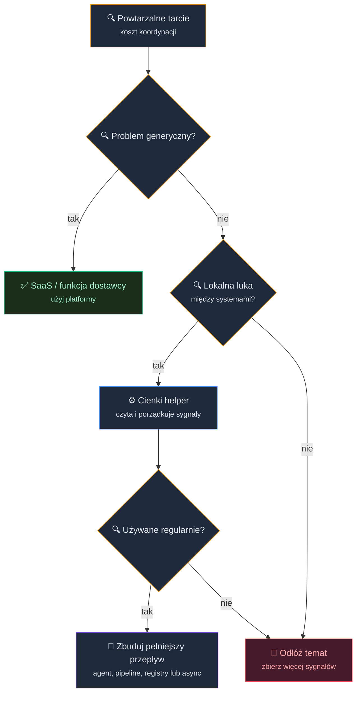
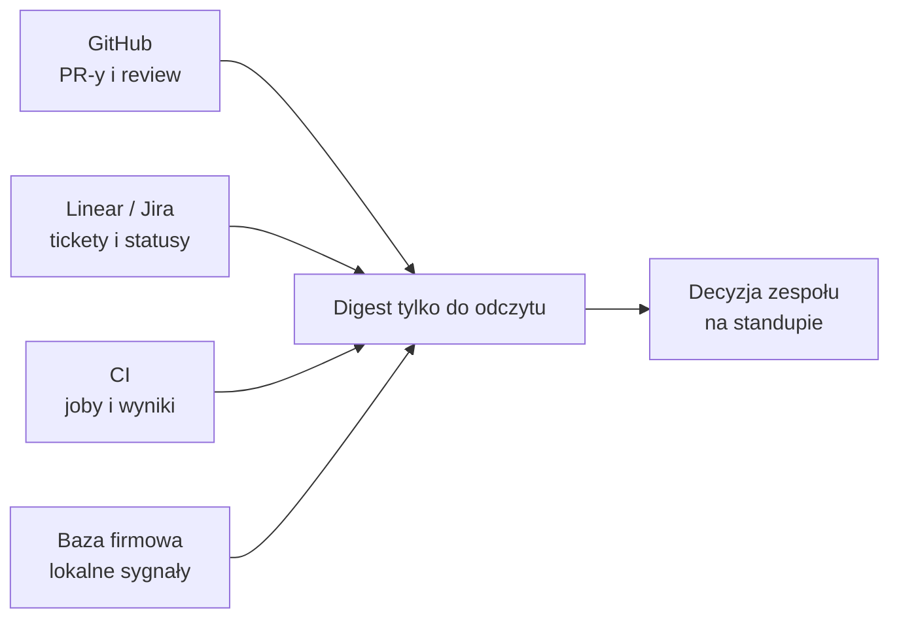

# AI Internal Builders: wewnętrzne narzędzia, serwisy i automatyzacje


<!-- cdn: https://images.przeprogramowani.pl/lessons/m5-l1/assets/cover.jpg -->

W module czwartym patrzyliśmy na projekt od środka: jak ogarnąć legacy, jak wydobyć domenę, jak znaleźć sensowny kierunek modernizacji i jak nie kazać agentowi refaktoryzować wszystkiego naraz.

W module piątym zmieniamy perspektywę.

Nie pytamy już tylko: "jak poprawić mój projekt?". Pytamy: "co w pracy zespołu regularnie traci czas, uwagę i energię?". Bo kiedy kod zaczyna powstawać szybciej dzięki AI, bardzo szybko okazuje się, że wąskim gardłem nie jest samo pisanie kodu.

Czasem jest nim review. Czasem status projektu. Czasem trzy miejsca, w których trzeba sprawdzić, czy funkcja naprawdę nadaje się do release'u. Czasem pytanie "kto w ogóle ma kontekst do tego PR-a?", które wraca przy każdym większym tasku.

I tu pojawia się pokusa: skoro AI umie szybko pisać kod, to zbudujmy własne narzędzie. Własny dashboard. Własny system triage'u. Własną wersję tego, czego brakuje w istniejącym SaaS-ie.

Kusząco. I właśnie dlatego trzeba uważać.

Potrzebujesz prostego filtra: kiedy sięgnąć po gotową funkcję, kiedy uzupełnić istniejące narzędzie cienkim helperem, a kiedy pomysł powinien poczekać na moment, w którym stanie się częścią pełniejszego przepływu pracy zespołu.

Zanim zbudujemy pierwsze rozwiązanie dla zespołu czy firmy, musimy wiedzieć, po co je budujemy.

## Tarcie zespołu jako sygnał

Przez większość kursu pracowałeś z AI głównie na poziomie własnego workflow: PRD, roadmapa, plan, implementacja, testy, review, refaktor, debugowanie. To nadal perspektywa jednej osoby prowadzącej agenta przez projekt.

W zespole wyzwania zwykle wyglądają inaczej. Zazwyczaj są rozrzucone między narzędziami, ludźmi i rytuałami.

Tarcie zespołu to powtarzalny koszt koordynacji: coś, co zespół musi ustalać, sprawdzać, przepisywać albo synchronizować tak często, że zaczyna tracić tempo lub chęć do pracy.

W praktyce wygląda to znajomo. Nikt nie wie, co zmieniło się od wczoraj, dopóki nie otworzy sześciu narzędzi. Review stoi, bo właściciel domeny nie zauważył PR-a. Status w Linearze mówi jedno, CI pokazuje drugie, a notatka release'owa trzecie. Obsługa klienta ma ważny sygnał, ale nie trafia on do backlogu w formie, z którą zespół techniczny może pracować.

To jeszcze nie są pomysły na produkt, tylko sygnały. Powtarzalny koszt nie oznacza automatycznie "budujmy narzędzie", a jedynie "tu dzieje się coś powtarzalnego, co może być warte analizy".

Częścią tej analizy jest pytanie, czy to tarcie w ogóle warto usuwać. W module czwartym rozróżnialiśmy złożoność przypadkową od istotnej (F. Brooks): część tarcia jest przypadkowa i faktycznie da się ją skrócić narzędziem, ale część bywa istotna i wynika z realnego ograniczenia, procesu albo decyzji, której z bliska nie widać. Zanim uznasz coś za "do naprawienia", upewnij się, że nie patrzysz na tarcie, które ma swój powód.

W preworku mówiliśmy o agentach, harnessach i promptach jako warstwach indywidualnej pracy. Teraz dokładamy warstwę zespołową: istniejące systemy, procesy i odpowiedzialności. AI może pomóc je połączyć, ale nie zwalnia cię z decyzji, czy to połączenie ma sens.

## SaaS to nie tylko funkcje

Najczęstszy błąd przy budowaniu narzędzi wewnętrznych wygląda tak:

> "W Linearze, Jirze albo GitHubie brakuje nam jednej funkcji. A tak w ogóle ten system jest do niczego. Przecież z AI zbudujemy własną, lepszą wersję systemu w weekend."

Problem w tym, że SaaS to znacznie więcej niż lista widocznych funkcji.

SaaS to aplikacja, którą ktoś utrzymuje jako platformę: z infrastrukturą, bezpieczeństwem, uprawnieniami, audytami, niezawodnością, onboardingiem, wsparciem, rozliczeniami, dostępnością i ryzykiem dostawcy.

Kiedy porównujesz "brakuje nam jednego widoku" z "napiszmy własne narzędzie", bardzo łatwo zestawić widoczną funkcję z niewidoczną odpowiedzialnością. I tędy wiedzie droga na manowce.

Jeżeli budujesz pełny zamiennik narzędzia, przejmujesz nie tylko ekran, którego ci brakuje. Przejmujesz też pytania o dostęp do danych, konfigurację, logi, błędy API, utrzymanie integracji po zmianach po stronie dostawcy, onboarding nowych osób i to, czy dane klienta nie zostały pokazane zbyt szeroko.

I nagle "mały helper" zaczyna pachnieć pełnym produktem wewnętrznym. To już zupełnie inna rozmowa.

Dlatego w tej lekcji nie zaczynamy od pytania "czy umiemy to zbudować?". AI sprawia, że odpowiedź coraz częściej brzmi "tak". Zaczynamy od pytania "czy powinniśmy przejąć tę odpowiedzialność?".

## Kup, uzupełnij albo zbuduj

Klasyczną decyzję "kup albo zbuduj" (build vs buy) rozbijamy tu na trzy kategorie, bo w erze AI dochodzi trzecia, najczęściej najlepsza opcja: **uzupełnij** (complement).

**Kup albo użyj domyślnej funkcji** wtedy, gdy problem jest generyczny. Podsumowanie pojedynczego ticketa, sugestia etykiety, widok zaległych issue, podstawowy raport statusu, dashboard CI. To są rzeczy, które dostawcy coraz częściej rozwiązują w samym produkcie.

**Uzupełnij** wtedy, gdy problem wynika z lokalnego połączenia kilku systemów. GitHub ma część prawdy, Linear albo Jira ma część prawdy, CI ma część prawdy, wewnętrzna baza firmy ma część prawdy, a zespół codziennie skleja to ręcznie w głowie. Wtedy cienki helper może mieć sens.

**Zbuduj pełniejszy przepływ pracy** dopiero wtedy, gdy helper przetrwa kontakt z rzeczywistością: ktoś go używa, oszczędza realny czas, ma właściciela, ma jasny zakres i przestaje być jednorazowym raportem.

Ta środkowa kategoria, **uzupełnianie** istniejących systemów, jest najważniejsza w module piątym.

Uzupełnienie świadomie nie udaje systemu źródłowego: nie zastępuje GitHuba, Lineara, Jiry ani CI, tylko czyta z nich sygnały, porządkuje je i odsyła ludzi do miejsc, gdzie decyzja naprawdę powinna zostać podjęta.


<!-- rendered: ../../assets/diagrams-10x/lessons-m5-l1-lesson-draft-1-10x.png | cdn: https://images.przeprogramowani.pl/diagrams/lessons-m5-l1-lesson-draft-1-10x.png -->

Zwróć uwagę na ostatni krok. Cienki helper nie musi od razu stać się aplikacją, agentem w SDK, pipeline'em albo rejestrem artefaktów. Najpierw ma odpowiedzieć na pytanie: czy ten problem w ogóle zasługuje na stałą obsługę?

## Mapa okazji dla internal buildera

Internal builder w tej lekcji nie jest nowym tytułem zawodowym. To programista, który potrafi zauważyć lokalne tarcie zespołu i zbudować najmniejsze narzędzie usuwające ten ból, bez przebudowywania całej firmy.

Żeby nie zgadywać, użyjemy prostego artefaktu: **mapy okazji**.

Mapa okazji to krótka klasyfikacja jednego sygnału tarcia, robocza notatka, a nie backlog produktu ani analiza rynku. Ma cię uchronić przed dwiema skrajnościami: "nic z tym nie zrobimy, bo tak już jest" oraz "zbudujmy własny system do wszystkiego".

Wypełniasz ją w czterech polach:

| Pole | Pytanie |
|---|---|
| Sygnał tarcia | Co powtarza się na tyle często, że kosztuje zespół czas albo uwagę? |
| SaaS / domyślna odpowiedź | Czy istniejące narzędzia już rozwiązują ten problem wystarczająco dobrze? |
| Cienki helper | Jaka najmniejsza warstwa mogłaby połączyć lokalne sygnały? |
| Pierwsza użyteczna wersja | Jak sprawdzimy wartość bez zamiany helpera w produkt, logowania i wdrożenia? |

Zobacz trzy przykładowe klasyfikacje.

**Poranny status projektu**

- **Sygnał tarcia:** nikt nie wie, co zmieniło się od wczoraj bez otwierania kilku narzędzi.
- **SaaS / domyślna odpowiedź:** powiadomienia GitHuba, widoki w Linear/Jira, dashboard CI i strony release'ów.
- **Cienki helper:** digest tylko do odczytu, który łączy zaległe issue, ryzykowne PR-y, nieudane joby CI, brak właściciela i status release'u.
- **Pierwsza użyteczna wersja:** statyczny HTML z eksportów JSON/CSV lub danych z API.


**Review bez jasnych kryteriów**

- **Sygnał tarcia:** review blokuje merge, bo kryteria jakości są niejawne.
- **SaaS / domyślna odpowiedź:** code owners, review requests, status checks i istniejące reguły repo.
- **Cienki helper:** pomocnicza klasyfikacja ryzyka PR-a i sugestia recenzentów.
- **Pierwsza użyteczna wersja:** komentarz od agenta pod PR-em na kilku przykładowych PRach.

**Artefakty AI kopiowane ręcznie**

- **Sygnał tarcia:** zespół kopiuje te same prompty, reguły i skille między repozytoriami.
- **SaaS / domyślna odpowiedź:** dokumentacja wewnętrzna, wiki albo ręczne kopiowanie, jeśli skala jest mała.
- **Cienki helper:** jedno źródło prawdy dla artefaktów AI.
- **Pierwsza użyteczna wersja:** repozytorium z paczką testową i ręczną instalacją w jednym projekcie.

We wszystkich trzech przykładach wzorzec jest ten sam: nie zaczynamy od implementacji, tylko od kwalifikacji problemu. Zanim agent napisze kod, ustalamy, czy ten problem w ogóle powinien dostać kod.

Działa tu istotne ograniczenie: możesz zbudować dowolną rzecz, ale nie możesz zbudować wszystkiego.

Potencjał agentów łatwo pomylić z nieograniczoną przepustowością. Skoro prototyp powstaje szybciej, kusi, żeby zrobić dziesięć małych narzędzi naraz. Tylko że nadal masz ograniczony czas, energię, budżet na tokeny oraz uwagę potrzebną do utrzymania tego, co zbudujesz. Każdy helper, który zacznie działać w zespole, będzie potrzebował poprawek, wyjaśniania, reakcji na błędy i decyzji, czy nadal rozwiązuje prawdziwy problem.

Dlatego lepiej zbudować 2-3 przemyślane helpery, które naprawdę redukują tarcie zespołu, niż 10 prototypów, których nikt nie utrzyma. Przy ograniczonym czasie i uwadze nie liczy się to, ile rzeczy odpalisz, tylko czy trafnie wybierasz, który problem w ogóle dostaje kod.

Po mapie okazji wybierasz dalszy tryb pracy — i znasz już oba z wcześniejszych modułów. Przy większym, niejasnym temacie (gdy nie rozumiesz jeszcze interesariuszy, danych, ryzyk i kosztów utrzymania) wróć do pełniejszego flow `/10x-shape` -> `/10x-prd` -> `/10x-roadmap`. Przy wąskim sygnale z jasną pierwszą wersją idź prosto w implementację: `/10x-new` -> `/10x-research` -> `/10x-plan` -> `/10x-implement`, a kolejne taski rozpisuj dopiero wtedy, gdy pierwsza wersja pokaże realną wartość.

Zanim jednak ruszysz z budową, zrób najtańszy możliwy krok: skonsultuj pomysł z menedżerem i najlepiej także z zespołem. Często to ci sami ludzie, dla których budujesz narzędzie, bo przecież adresujesz tarcie zespołowe, ale mają szerszy kontekst niż ty i mogą wiedzieć, dlaczego dane tarcie w ogóle istnieje. Często okaże się, że twój obraz problemu jest niepełny albo że adresujesz złożoność istotną, a nie przypadkową. Ta rozmowa kosztuje kilka minut, a potrafi oszczędzić tydzień budowania narzędzia, którego nikt nie potrzebował.

Dopiero gdy framing przejdzie tę wstępną rozmowę, warto walidować go głębiej. Mapa okazji klasyfikuje problem na papierze. Zanim zamienisz tę klasyfikację w kod, sprawdź ją na ludziach, dla których budujesz, według zasad *The Mom Test*, czyli podejścia do rozmów z użytkownikami opisanego w książce Roba Fitzpatricka. Jego sednem jest proste przesunięcie: zamiast pytać o opinie o twoim pomyśle, pytasz o fakty z przeszłości rozmówcy, bo opinie potrafią skłamać, a konkretne sytuacje znacznie rzadziej.

Kiedy masz już pomysł, mapę okazji, a przy większym temacie także `shape-notes.md` oraz `prd.md`, nie pytaj więc ludzi, czy "używaliby takiego narzędzia" albo czy "podoba im się pomysł". Takie pytania głównie badają grzeczność, aspiracje i chęć wspierania twojego entuzjazmu przez rozmówców. Pytaj o ostatnie konkretne sytuacje, obecne obejścia, realny koszt tarcia i narzędzia, których już próbowali.

W paczce tej lekcji dostajesz do tego skill `/10x-mom-test`. Jego zadaniem nie jest sprzedać twój pomysł rozmówcy, tylko skrytykować założenia, przygotować pytania do rozmów 1:1 i ułożyć krótką ankietę, która sprawdzi, czy idziesz we właściwym kierunku.

## Przykład: digest tarcia zespołowego

Wyobraź sobie zwykłą firmę produktową. Zespół używa GitHuba, Linear albo Jiry, CI, notatek release'owych i wewnętrznej bazy z informacjami o klientach, planach, flagach albo kontach.

Każde z tych narzędzi działa. Żadne nie jest "zepsute". A mimo to codzienny status wymaga ręcznego skakania po kontekstach.

GitHub pokazuje PR-y, ale nie mówi, które dotyczą klienta enterprise. Linear albo Jira pokazują tickety, ale nie mówią, czy powiązany PR ma czerwone CI. CI pokazuje nieudane joby, ale nie mówi, czy blokują ważny release. Wewnętrzna baza ma informacje domenowe, których SaaS zwykle nie widzi.

To idealny kandydat na uzupełnienie, a nie zamiennik.

Taki helper mógłby wygenerować poranny digest:

```text
Poranny digest zespołu

Ryzykowne PR-y:
PR #1842 dotyka billing, ma czerwone CI i ticket z klientem enterprise.
PR #1839 czeka 3 dni bez review; właściciel domeny: Marta.

Zablokowane tickety:
PAY-412 ma status "In Review", ale nie ma otwartego PR-a.
AUTH-91 ma zmergowany PR, ale ticket nadal jest "In Progress".

Release:
Release 2026.06.11 ma 2 nieudane joby i 1 ticket z flagą klienta.

Decyzje na dziś:
Dopytać właściciela PAY-412, sprawdzić nieudany job w pipeline'ie wydania i przypisać recenzenta do PR #1839.
```

To nie pełny system zarządzania projektem, tylko mały widok: łączy rozproszone sygnały i podpowiada, gdzie zespół powinien spojrzeć najpierw.


<!-- rendered: ../../assets/diagrams-10x/lessons-m5-l1-lesson-draft-2-10x.png | cdn: https://images.przeprogramowani.pl/diagrams/lessons-m5-l1-lesson-draft-2-10x.png -->

AI pomaga tu głównie w dwóch miejscach. Potrafi streścić chaotyczny tekst z issue, PR-ów i komentarzy oraz nazwać wzorce: "to wygląda jak brak właściciela", "to wygląda jak rozjazd statusu", "to wygląda jak ryzyko release'u".

Największa wartość nie bierze się jednak z samego streszczenia, bo takie funkcje dodają też dostawcy. Bierze się z lokalnego połączenia sygnałów, których pojedynczy SaaS z definicji nie widzi.

GitHub nie zna twojej wewnętrznej logiki klientów. Jira nie zna pełnej historii nieudanych jobów. CI nie zna kontekstu rozmowy w tickecie. Helper łączy te sygnały tylko wtedy, gdy pozostaje skromny: czyta, streszcza, linkuje do źródeł i pomaga ludziom podjąć decyzję.

## Pierwsza użyteczna wersja

Najlepszy pierwszy helper jest trochę nudny.

Nie ma panelu administracyjnego, logowania, wdrożenia, backlogu funkcji ani własnej bazy danych, jeśli wystarczy plik albo statyczny raport.

Pierwsza użyteczna wersja to najprostsza forma, która pozwala sprawdzić, czy ten przepływ pracy pomaga zespołowi.

Może zacząć się od mockowanego raportu Markdown na podstawie kilku przygotowanych przykładów. Potem może przejść w lokalny skrypt czytający eksporty JSON/CSV, statyczny HTML wrzucany ręcznie do wewnętrznego kanału albo prosty digest uruchamiany przez jedną osobę. Agent, aplikacja, pipeline albo harmonogram pojawiają się dopiero wtedy, gdy wcześniejsza wersja faktycznie pomaga.

Ta kolejność jest ważna, bo AI obniża koszt pierwszego prototypu, ale nie zeruje kosztu utrzymania. Mały skrypt, który raz pomógł na standupie, nie potrzebuje procesu produktowego. Ten sam skrypt używany codziennie przez zespół zaczyna potrzebować właściciela, reakcji na błędy, jasnego zachowania przy braku danych i decyzji, kto może zobaczyć wynik.

Jest też zastrzeżenie o danych. Jeżeli pracujesz na mockach, lokalnych eksportach, sygnałach tylko do odczytu albo danych bez wrażliwego kontekstu, możesz zacząć lekko.

Jeżeli dotykasz prawdziwych danych firmowych, klienckich albo produkcyjnych, myślenie o dostępie, uprawnieniach i audytowalności przesuwa się wcześniej.

To nie straszenie zgodnością i audytami, tylko zwykła higiena inżynierska.

## Dźwignia małych usprawnień

Warto się tym zajmować z prostego powodu: w zespołach technicznych reputacja często buduje się wokół widocznych usprawnień, a nie prezentacji o produktywności. Wokół sytuacji, w której ktoś mówi: "to już nie boli".

Jeżeli usuniesz tarcie, które wszyscy widzą, rośnie zaufanie do twoich decyzji technicznych. Ludzie zaczynają wierzyć, że rozumiesz nie tylko kod, ale też przepływ pracy zespołu.

Nie jest to obietnica awansu i nie ma tu magicznej ścieżki "zbuduj dashboard, odbierz podwyżkę". Jest za to praktyczna dźwignia: widzisz lokalny problem, klasyfikujesz go odpowiedzialnie, budujesz małą warstwę tam, gdzie ma sens, i nie udajesz, że zastąpiłeś platformę. Wielu przełożonych to doceni.

## 🧑🏻‍💻 Zadania praktyczne

Zacznijmy od przygotowania mapy okazji dla jednego problemu zespołowego.

Jeżeli pracujesz z paczką artefaktów tej lekcji, możesz przejść przez ten proces ze skillem `/10x-opportunity-map`. Skill dopyta o ryzyko danych, sklasyfikuje sygnały po kolei, a na końcu podpowie następny ruch: walidację `/10x-mom-test`, pełniejszy framing `/10x-shape` albo wejście wprost w budowę. Jeśli wolisz zrobić to ręcznie, użyj kroków poniżej jako szablonu.

### Krok 1: wypisz sygnały tarcia

Wybierz 3-5 powtarzalnych problemów z własnego projektu, zespołu albo małego PoC. Jeżeli nie możesz użyć kontekstu firmowego, użyj projektu kursowego albo wymyśl neutralny scenariusz na mockowanych danych.

Dobre sygnały brzmią konkretnie: "codziennie sprawdzamy ręcznie, które PR-y blokują release", "nie wiemy, które tickety mają zmiany w kodzie, a które tylko status w narzędziu", "skille i reguły AI są kopiowane między repo ręcznie", "review wraca z tymi samymi uwagami, ale nie mamy ich jako twardej bramki".

Słabe sygnały brzmią jak życzenia: "zróbmy dashboard", "przydałby się agent", "automatyzacja wszystkiego". To jeszcze nie są problemy do zbudowania, tylko hasła, które trzeba dopiero rozpakować.

### Krok 2: wypełnij mapę okazji

Dla każdego sygnału uzupełnij cztery pola:

| Pole | Twoja odpowiedź |
|---|---|
| Sygnał tarcia | ... |
| SaaS / domyślna odpowiedź | ... |
| Cienki helper | ... |
| Pierwsza użyteczna wersja | ... |

W polu "SaaS / domyślna odpowiedź" bądź uczciwy. Jeśli Linear, Jira, GitHub, Slack, Notion albo wasze obecne narzędzia już rozwiązują problem wystarczająco dobrze, nie buduj helpera tylko dlatego, że możesz.

### Krok 3: wybierz jeden helper

Wybierz jeden sygnał, który powtarza się regularnie, łączy co najmniej dwa źródła informacji albo dwie role w zespole i da się sprawdzić w pierwszej użytecznej wersji bez pełnego produktu.

Opisz pierwszą wersję w 5-8 zdaniach. Użyj formatu:

```text
Helper:
[nazwa robocza]

Czyta:
[źródła, np. GitHub export, Jira CSV, CI logs, mock data]

Zwraca:
[krótki opis raportu / widoku / digestu]

Nie robi:
[czego świadomie nie budujesz teraz]

Ryzyko danych:
[mock / tylko do odczytu / dane niewrażliwe albo realne dane firmowe lub klienckie; przy realnych danych opisz, jak wcześniej ograniczysz dostęp]
```

Jeżeli chcesz dodatkowo sprawdzić założenia przed budową, użyj `/10x-mom-test` na swojej mapie okazji.

### Krok 4: czego się spodziewać po ścieżce 10xChampion

Moduł piąty jest opcjonalny względem bazowego certyfikatu Builder, który opiera się na modułach 1-3. Jeżeli jednak chcesz pójść ścieżką zespołową, możesz celować w odznakę **10xChampion**.

Tu niczego jeszcze nie zbierasz. To raczej mapa tego, jaki ślad zostawia dobra ścieżka: dzięki niej już teraz wiesz, na co patrzeć, gdy w kolejnych lekcjach zbudujesz konkretny przepływ.

10xChampion nie wymaga publikowania firmowego repozytorium. Dowodem są zrzuty ekranu pokazujące, że przepływ pracy istnieje i działa w twoim kontekście albo w samodzielnym PoC — a nie publiczne linki do firmowego kodu.

Wystarczy zbudować jeden z dwóch projektów modułu piątego, a dowody powstaną przy okazji zadań praktycznych do tych lekcji:

Pipeline CI/CD do review kodu — budowany w *Twój pierwszy Agent zespołowy* (M5L2) i *Code Review w erze AI* (M5L3):

- widok pipeline'u i co najmniej jeden widoczny job,
- logi z pipeline'u albo joba,
- screenshot z działania pipeline'u na PR (komentarz od LLM z review).

Rejestr artefaktów zespołowych — budowany w *Shared AI Registry* (M5L4):

- repozytorium albo rejestr, w którym ten przepływ istnieje,
- definicja paczki albo równoważna definicja artefaktu,
- lista wydanych wersji.

Część tych pozycji nabierze pełnego sensu dopiero, gdy przerobisz daną lekcję — i o to chodzi. Na teraz wystarczy, że wiesz, czego się spodziewać.

## Odbierz odznakę za tę lekcję

Po ukończeniu tej lekcji odbierz odznakę za lekcję w sekcji [10xDevs Mission Log](https://platforma.przeprogramowani.pl/10xdevs-3/mission-log) a następnie pochwal się swoim osiągnięciem!

## 🔎 Deep Dive

Ta sekcja zawiera dodatkowe pogłębienie wiedzy na temat wybranych zagadnień związanych z lekcją. W tym Deep Dive znajdziesz:

- **Kup, uzupełnij albo zbuduj bez popadania w skrajności** — jak myśleć o decyzji między gotowym narzędziem, lokalnym helperem i pełniejszym przepływem pracy.
- **Niewidzialna praca SaaS-u** — dlaczego brak jednej funkcji nie oznacza, że warto przejąć odpowiedzialność za całą platformę.
- **Kiedy helper staje się produktem** — po czym poznać, że jednorazowy raport zaczyna wymagać właściciela, jakości i utrzymania.

Ta sekcja lekcji nie jest obowiązkowa, ale warto się z nią zapoznać jeżeli chcesz zostać ekspertem.

### Kup, uzupełnij albo zbuduj bez popadania w skrajności

Klasyczna decyzja "kup albo zbuduj" (build vs buy) jest trochę zbyt płaska dla narzędzi wewnętrznych w erze AI. Kiedy koszt prototypu spada, "zbuduj" zaczyna wyglądać zbyt atrakcyjnie.

Jeśli agent może w godzinę wygenerować działający szkic, łatwo pomyśleć, że ekonomia decyzji całkowicie się zmieniła. Zmieniła się, ale tylko częściowo: AI obniża koszt pierwszej wersji, iteracji i klejenia danych, ale nie usuwa kosztu utrzymania, odpowiedzialności za dane, obsługi błędów, zmian w API dostawcy i wyjaśniania zespołowi, dlaczego raport czasem milczy.

Dlatego do pary "kup albo zbuduj" dokładamy trzecią kategorię: **uzupełnij** (complement). Zamiast kupować nowe narzędzie albo budować zamiennik, zostawiasz systemy źródłowe tam, gdzie są, a obok nich tworzysz cienką warstwę dopasowaną do lokalnego problemu.

### Niewidzialna praca SaaS-u

SaaS ma irytującą właściwość: widzisz głównie ekran i funkcje, a nie cały wysiłek utrzymania platformy.

W dobrze działającym narzędziu nie myślisz codziennie o izolacji klientów lub organizacji (tenantów), audytach, backupach, modelu uprawnień, onboardingu użytkowników, wersjonowaniu API, wsparciu i niezawodności. I bardzo dobrze, bo między innymi za to płacisz.

Problem pojawia się wtedy, gdy porównujesz swój mały prototyp do jednego widoku w produkcie SaaS. Prototyp może wyglądać lepiej w wąskim przypadku, bo nie niesie całego ciężaru platformy. To nie znaczy, że wygrał jako system.

Wewnętrzny helper powinien więc możliwie długo pozostawać zależny od systemów źródłowych. Linkuje do PR-a, ticketa, joba i rekordu, ale nie udaje nowego miejsca prawdy.

### Kiedy helper staje się produktem

Jednorazowy raport może być luźny. Codzienny raport używany przez zespół już nie.

Sygnały dojrzewania widać dość szybko. Zespół zaczyna planować dzień na podstawie wyniku helpera. Błędny albo brakujący raport wywołuje realne zamieszanie. Pojawiają się prośby o nowe źródła danych, kontrolę dostępu albo działanie bez ręcznego uruchamiania.

W takim momencie nie chodzi o to, żeby natychmiast wszystko przepisać. Chodzi o świadomą zmianę statusu: od eksperymentu do utrzymywanego przepływu pracy.

Dlatego cały moduł piąty jest zbudowany jako sekwencja. Najpierw kwalifikujesz problem. Potem możesz zbudować agenta, wpiąć go w pipeline, rozprowadzić artefakty po zespole albo uruchomić pracę asynchronicznie.

## 📚 Materiały dodatkowe

- [Utility Vs Strategic Dichotomy](https://martinfowler.com/bliki/UtilityVsStrategicDichotomy.html) — Martin Fowler o różnicy między oprogramowaniem użytkowym a strategicznym; dobre tło do decyzji "kup czy buduj".
- [NIST CSRC Glossary: Software as a Service](https://csrc.nist.gov/glossary/term/software_as_a_service) — krótka definicja SaaS jako aplikacji dostarczanej przez dostawcę, przydatna do rozróżnienia funkcji od odpowiedzialności platformy.
- [AWS Well-Architected SaaS Lens](https://docs.aws.amazon.com/wellarchitected/latest/saas-lens/saas-lens.html) — praktyczne kategorie odpowiedzialności SaaS: operacje, bezpieczeństwo, niezawodność, tożsamość, tenanty i utrzymanie.
- [Building effective agents](https://www.anthropic.com/engineering/building-effective-agents) — Anthropic o zaczynaniu od prostych przepływów pracy i dokładaniu agentowej złożoności dopiero wtedy, gdy jest potrzebna.
- [Writing effective tools for AI agents](https://www.anthropic.com/engineering/writing-tools-for-agents) — Anthropic o obserwowaniu powtarzalnych użyć narzędzi, błędów i kosztów jako sygnałów do usprawniania przepływów pracy.
- [The State of the Art in End-User Software Engineering](https://faculty.washington.edu/ajko/papers/Ko2011EndUserSoftwareEngineering.pdf) — przegląd ryzyk w małych narzędziach tworzonych "przy okazji" głównej pracy: ukryte wymagania, testowanie, debugowanie i utrzymanie.
- [Identification of Coordination Requirements](https://herbsleb.org/web-pubs/pdfs/cataldo-identification-2006.pdf) — badanie pokazujące, że potrzeby koordynacyjne można wyczytywać z istniejących śladów pracy zespołu.
- [Building AI-powered GitHub issue triage with the Copilot SDK](https://github.blog/ai-and-ml/github-copilot/building-ai-powered-github-issue-triage-with-the-copilot-sdk/) — przykład AI-assisted triage w ekosystemie GitHuba; traktuj jako inspirację, nie instrukcję do tej lekcji.
- [Linear Docs: Triage Intelligence](https://linear.app/docs/triage-intelligence) — przykład AI wbudowanego przez dostawcę w narzędzie SaaS, dobry kontrapunkt dla budowania własnych generycznych funkcji.
- [The Mom Test](https://www.momtestbook.com/) — Rob Fitzpatrick o tym, jak pytać o fakty, zachowania i przeszłe sytuacje zamiast zbierać grzeczne opinie o własnym pomyśle.
- Prework [1.2] *Chatbot vs Agent vs Harness - definicje* — przypomnienie warstw model, agent i harness, które w module piątym przenosimy na poziom zespołu.
- Prework [4.2] *Dobry i zły projekt kursowy* — wcześniejsza intuicja "mały użyteczny przepływ przed dużym produktem", tutaj zastosowana do narzędzi wewnętrznych.
