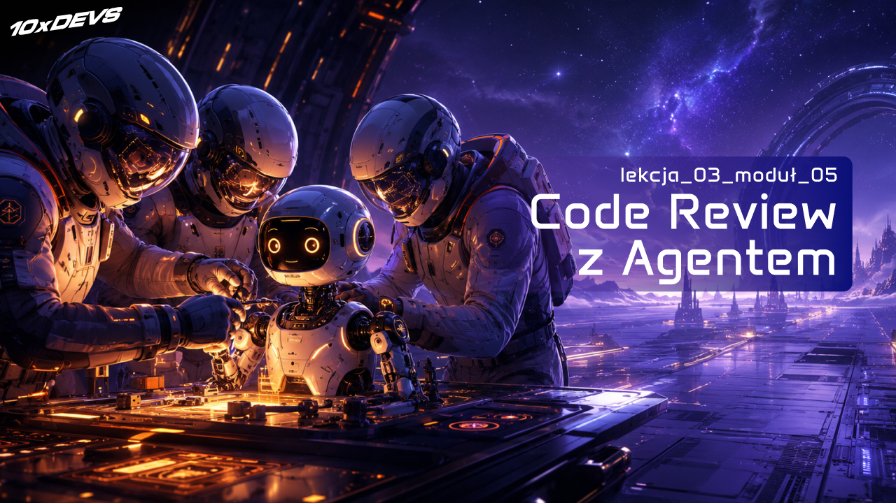
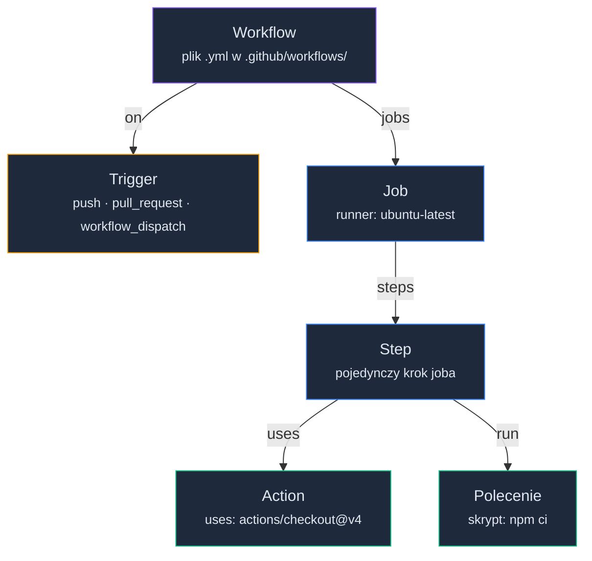
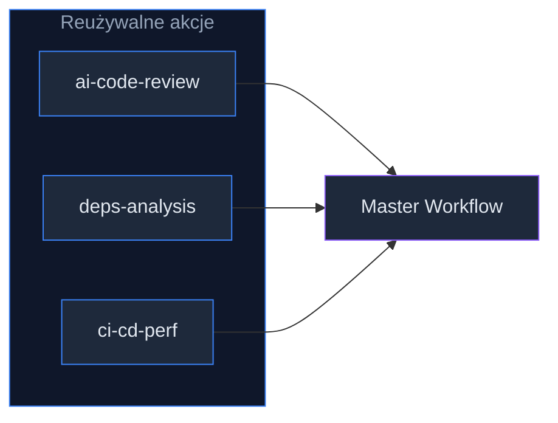
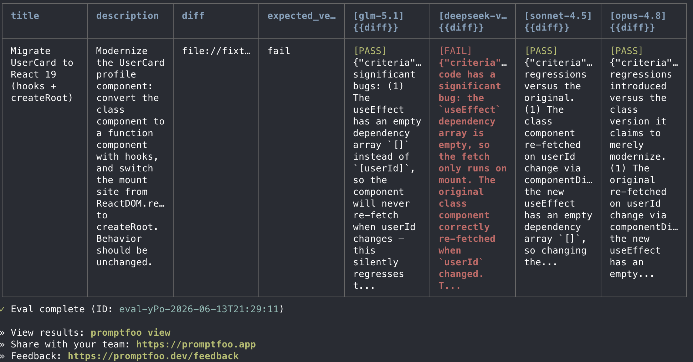
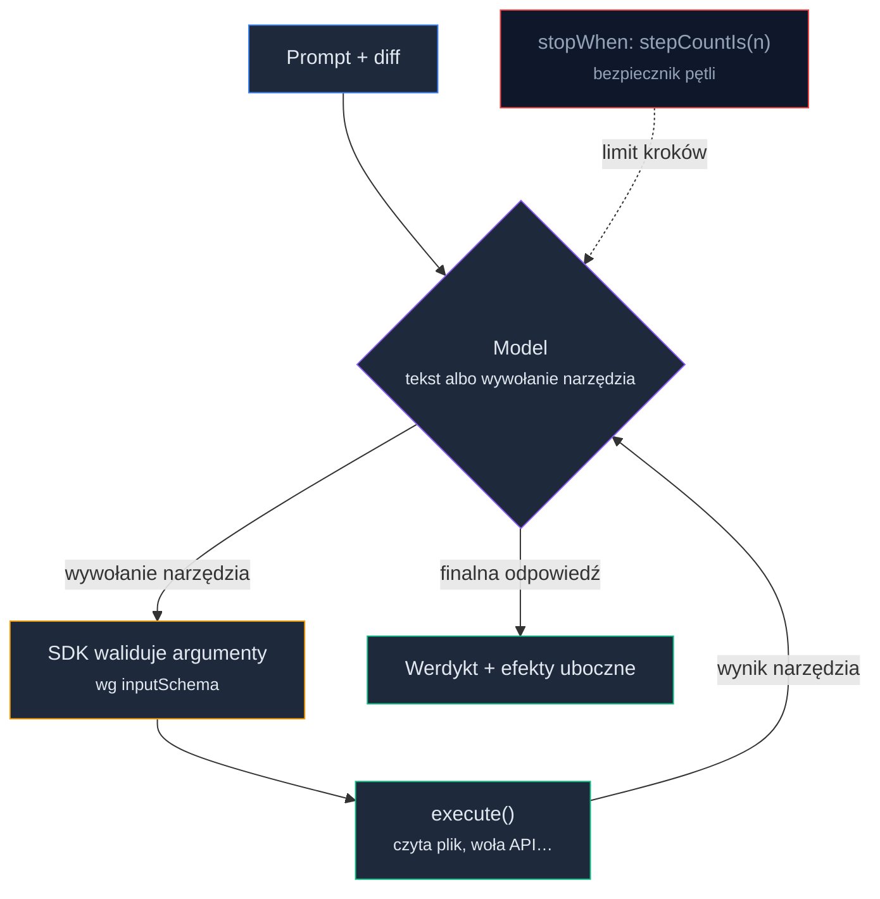

# Code Review w erze AI: standardy, kryteria i Agent w pipeline


<!-- cdn: https://images.przeprogramowani.pl/lessons/m5-l3/assets/cover.jpg -->

W poprzedniej lekcji utworzyliśmy pierwszą wersję agenta opartego na poznanym wcześniej SDK. Takie rozwiązanie wymaga nieco więcej pracy niż terminalowy lub edytorowy "gotowiec", ale daje ci też najwięcej elastyczności.

Teraz czas na kolejny krok. Nasz agent z generycznego opakowania LLM-a ma się stać pełnoprawnym asystentem CI/CD. Chcemy go przy tym odkleić od localhosta i przenieść tam, gdzie przecinają się wszystkie zmiany lecące na produkcję.

W tej lekcji, na przykładzie GitHub Actions, poznasz najważniejsze elementy agenta zintegrowanego z procesami CI/CD. Zaczniemy od podstaw infrastruktury, potem przygotujemy samego agenta, nauczymy się go testować, a na koniec sięgniemy po gotowy skill do code review (to już w sekcji Deep Dive).

Zaczynamy!

### GitHub Actions: minimum, żeby ruszyć

Żeby agent miał więcej autonomii i sprawczości, musimy go rozłączyć od jednej konkretnej maszyny i wprowadzić na "autostradę na produkcję". Wykorzystamy w tym celu GitHub Actions (GHA) - to usługa do automatyzacji wszystkiego, co związane z oprogramowaniem. Pozwala budować, testować i wdrażać aplikacje w sposób ciągły, a dzięki ścisłej integracji z repozytorium nie wymaga konfiguracji dedykowanych serwerów. Jeśli twoje repozytorium jest już na GitHubie, od utworzenia prostego scenariusza (`workflow`) dzieli cię jeden plik.

> Jeśli korzystasz z innego providera CI/CD, wykorzystaj najważniejsze koncepcyjne wskazówki z tej lekcji i dostosuj składnię GHA do wybranej infrastruktury.

A ile potrzebujemy wiedzy o samym GHA? Dokładnie tyle, żeby agent zaczął pracować bardziej samodzielnie. Zacznijmy od kilku pojęć, które będą wracać przez całą lekcję:

- **Workflow** (zamiennie: scenariusz) - automatyczny proces złożony z jednego lub wielu zadań, opisany plikiem YAML w folderze `.github/workflows/` na poziomie repozytorium.
- **Trigger** (event) - zdarzenie uruchamiające workflow, np. `push`, `pull_request` albo ręczne `workflow_dispatch`. Jeden workflow może mieć więcej niż jeden trigger.
- **Job** - zadanie uruchamiane na konkretnej maszynie wirtualnej, złożone z jednego lub wielu kroków. W ramach jednego workflow joby mogą działać równolegle lub szeregowo.
- **Step** - pojedynczy krok w ramach joba (np. instalacja zależności albo uruchomienie agenta).
- **Action** (akcja) - opakowany, reużywalny zestaw kroków. Akcja przypomina plugin do edytora lub bibliotekę z npm - publikujesz ją na wewnętrzne lub zewnętrzne potrzeby i wykorzystujesz w wielu scenariuszach.
- **Runner** - maszyna wirtualna, na której uruchamiamy joby. Najczęściej dostarcza ją GitHub, ale możesz wystawić własną (tzw. self-hosted runner).

Te pojęcia nie są płaską listą - układają się w hierarchię kompozycji, od całego scenariusza aż po pojedynczą akcję:


<!-- rendered: ../../assets/diagrams-10x/lessons-m5-l3-lesson-draft-1-10x.png | cdn: https://images.przeprogramowani.pl/diagrams/lessons-m5-l3-lesson-draft-1-10x.png -->

Domyślnie GitHub udostępnia trzy rodzaje maszyn: środowisko Linuxowe (`ubuntu-latest`), macOS (`macos-latest`) i Windows (`windows-latest`). Dla scenariuszy CI/CD w stacku Node.js naturalnym wyborem jest `ubuntu-latest` - jest szybkie, tanie i kompatybilne z większością komend, które uruchamiasz lokalnie. Co do kosztów: dla repozytoriów publicznych na standardowych runnerach GitHuba korzystasz z usługi za darmo, a dla prywatnych dostajesz domyślnie pulę darmowych minut i miejsca na dysku, po przekroczeniu której wchodzisz w cennik.

GitHub rozpoznaje scenariusze automatycznie - wystarczy umieścić plik `.yml` w folderze `.github/workflows/`. Zbuduj pierwszy, minimalny workflow, który uruchomi się na każdym pull requeście do `master` (oraz na żądanie, dzięki czemu przetestujesz go ręcznie bez czekania na PR):

```yaml
# .github/workflows/review.yml
name: AI Code Review

on:
  pull_request:
    branches: [master]
  workflow_dispatch:

jobs:
  review:
    runs-on: ubuntu-latest
    steps:
      - name: Checkout repository
        uses: actions/checkout@v4

      - name: Configure node
        uses: actions/setup-node@v4
        with:
          node-version-file: '.nvmrc'

      - name: Install dependencies
        run: npm ci

      - name: Run agent
        run: npm run review
        env:
          LLM_PROVIDER_API_KEY: ${{ secrets.LLM_PROVIDER_API_KEY }}
```

Ten plik zawiera wszystkie poznane przed chwilą pojęcia. Mamy workflow (cały plik), jeden trigger (`pull_request` plus ręczny `workflow_dispatch`), jeden job (`review`), runnera (`ubuntu-latest`) oraz zestaw kroków - dwa z nich realizujemy gotowymi akcjami dostarczanymi z katalogu GHA (`checkout` i `setup-node`), a pozostałe uruchamiamy sami (`npm ci`, `npm run review`). Krok z agentem dostaje klucz API nie jako tekst wklejony do pliku, lecz przez `secrets` - to wartość zdefiniowana w ustawieniach repozytorium, której nikt nie zobaczy w logach ani w historii commitów.

To jest to minimum, po którym agent przestaje być narzędziem na twoim laptopie, a staje się krokiem w procesie zespołowym. Każdy PR do `master` odpala scenariusz, scenariusz uruchamia agenta, a wynik trafia tam, gdzie zespół już patrzy - do pull requesta. W kolejnych krokach zamienisz tę "ocenę" na twardą Definition of Done i dołożysz bramkę, która zatrzyma merge, gdy kryteria nie zostaną spełnione.

### Composite Action: agent jako reużywalny plugin

Workflow z poprzedniej sekcji ma jedną wadę: żyje tylko w tym jednym repozytorium. Jeśli chcesz, żeby ten sam agent pilnował dziesięciu repozytoriów twojego zespołu, kopiowanie pliku `review.yml` do każdego z nich kończy się dziesięcioma rozjeżdżającymi się kopiami. Właśnie ten problem rozwiązują **Composite Actions** - i to z nich korzystamy w produkcyjnej wersji agenta.

Composite Action to sposób na to, aby zestaw kroków scenariusza wyciągnąć do osobnej, parametryzowanej jednostki i wstrzykiwać go na żądanie w wielu miejscach - trochę jak plugin do twojego pipeline'u. Co najważniejsze, taka akcja może być rozwijana w niezależnym repozytorium (np. `github.com/twoj-zespol/ai-reviewer`), a całą integrację z repozytorium konsumenta załatwia za ciebie GitHub Actions. To jeden z dwóch sposobów na modularne scenariusze - drugim są reusable workflows, służące do składania całych, niezależnych procesów, podczas gdy Composite Action pakuje pojedynczy, reużywalny krok.

Dzięki temu kilka niezależnych, reużywalnych akcji wpinasz w jeden nadrzędny scenariusz:


<!-- rendered: ../../assets/diagrams-10x/lessons-m5-l3-lesson-draft-2-10x.png | cdn: https://images.przeprogramowani.pl/diagrams/lessons-m5-l3-lesson-draft-2-10x.png -->

Reużywalną akcję hostujesz na dwa sposoby:

1. **W osobnym repozytorium** - optymalne, gdy chcesz używać akcji w wielu projektach lub opublikować ją w GitHub Actions Marketplace. Konsument odwołuje się do niej przez `uses: twoj-zespol/ai-reviewer@<sha>`.
2. **Lokalnie, w podfolderze** `.github/actions/<nazwa>/` tego samego repo - prostsze na start, ale utrudnia użycie akcji w innych projektach. Konsument odwołuje się przez ścieżkę względną: `uses: ./.github/actions/ai-reviewer`.

> Na start rekomendujemy opcję 2) - potem łatwo wydzielić taką akcję do scenariusza 1), a nie zaczynamy od pracy na kilku repo.

Sercem reużywalnych akcji jest plik `action.yml` na głównym poziomie jej repozytorium (lub podfolderu), oznaczony jako `composite`. Tak wygląda akcja, która opakowuje uruchomienie agenta:

```yaml
# action.yml
name: AI Reviewer
description: Run the team's code review agent

# GitHub Marketplace - branding (opcjonalne)
branding:
  icon: terminal
  color: purple

# Parametry wejściowe
inputs:
  api-key:
    description: API key
    required: true

# Wartości zwracane do scenariusza konsumenta
outputs:
  verdict:
    description: Pass/fail verdict from the agent
    value: ${{ steps.agent.outputs.verdict }}

# Kroki akcji - wstrzykiwane do scenariusza konsumenta
runs:
  using: composite
  steps:
    - name: Run agent
      id: agent
      run: node ${{ github.action_path }}/dist/review.js
      shell: bash
      env:
        LLM_PROVIDER_API_KEY: ${{ inputs.api-key }}
```

Zwróć uwagę na kilka elementów:

- Klauzula `using: composite` oznacza, że akcja zostanie "wklejona" do scenariusza nadrzędnego. Akcja **nie definiuje triggera ani systemu operacyjnego** - o tym decyduje konsument w swoim workflow.
- Każdy krok z `run` musi mieć jawnie wskazany `shell` (np. `bash`). To wymóg specyficzny dla akcji kompozytowych - w zwykłym workflow shell jest domyślny.
- Z poziomu akcji uruchomisz dowolny skrypt z jej repozytorium przez zmienną `${{ github.action_path }}`, która wskazuje na katalog z akcją. Dzięki temu możesz zintegrować GHA z dowolnym AI SDK i technologią - nie tylko z JS.
- Wejścia (`inputs`) parametryzują akcję - typowo tryb działania albo klucz do API. 🚨 Pamiętaj o zasadzie ograniczonego zaufania: konsumenci akcji mogą wstrzykiwać tu potencjalnie niebezpieczne wartości, więc traktuj je jak każdy nieufny input.
- Wyjścia (`outputs`) pozwalają oddać wynik z powrotem do scenariusza - tutaj werdykt agenta, na którym za chwilę zbudujemy bramkę merge'a.

Po stronie konsumenta workflow z pierwszej sekcji kurczy się do jednego kroku - całą logikę przenieśliśmy do akcji:

```yaml
# .github/workflows/review.yml
name: AI Code Review

on:
  pull_request:
    branches: [master]

jobs:
  review:
    runs-on: ubuntu-latest
    steps:
      - uses: actions/checkout@v4
      - id: review
        uses: twoj-zespol/ai-reviewer@<sha>
        with:
          api-key: ${{ secrets.LLM_PROVIDER_API_KEY }}
```

Jedna uwaga bezpieczeństwa, ważna w 2026 roku bardziej niż kiedykolwiek: akcje przypinaj do konkretnego commita (`@<sha>`), a nie do ruchomego tagu w stylu `@v1`. Tag może zostać przesunięty na inny kod bez twojej wiedzy, a akcja działa wewnątrz twojego pipeline'u z dostępem do sekretów - przypięcie do SHA zamraża dokładnie ten kod, który zweryfikowałeś. To ta sama zasada ograniczonego zaufania, tyle że zwrócona w stronę cudzego kodu, który wpuszczasz do swojego procesu.

W tym momencie agent jest spakowany raz, a wpinasz go w dowolne repozytorium jedną linijką.

### Integracja GitHub Actions z Agentem do Code Review

> Jeśli chcesz obejrzeć wdrożenie i sesję pracy z agentem, możesz pominąć fragment tekstowy i przejść bezpośrednio do filmu.

Tak jak w poprzednich modułach, integrację agenta z CI/CD realizujemy naszym sprawdzonym 10x-workflow: najpierw research, potem plan, a dopiero na końcu implementacja.

```text
/10x-new ci-cd-code-review introducing first ci/cd workflow for pr code reviews
```

Kontekst startowy jest jednak nieco inny. Czasami, zamiast obszernego framingu, shape'ingu, czy pobierania danych z sieci, wystarczy notatka z brainstormingu, która wstępnie określa wymagania względem tego, co chcemy zrealizować. Ten plik roboczo nazywamy `requirements.md` i umieszczamy w folderze z nową zmianą.

U mnie prezentuje się następująco:

```text
## Overall concept

- GHA workflow run for every new pull request to master
- composite action for the review itself so that main workflow is easy to reason about

## Input parameters

- pull request title
- pull request description (?? cost tradeoff)
- git diff

## Code Review Criteria

Each criterion is scored on a 1–10 scale, where 1 is the worst outcome and 10 is the best.

{{CR_CRITERIA}}

## Parked for later

- business alignment (require broader context)
- architectural fit (require broader context)

## Expected side-effects

- PR comment with summary
- labels: `ai-cr:failed` (red) OR `ai-cr:passed` (green)

## Expected behavior

- on-demand retry when label `ai-cr:review` is added
```

Fragment `{{CR_CRITERIA}}` to lista subiektywnych oczekiwań względem pull requestów i diffów. Każdy zespół i programista zdefiniuje ją nieco inaczej. Powszechne oczekiwania względem każdej zmiany dotyczą zwykle czytelności, złożoności, obecności testów czy udokumentowania zmian. Samo AI pomoże ci odkryć najważniejsze praktyki, konwencje i wzorce szeroko stosowane w twoim stacku. Ale kluczowy wkład jest twój - konwencje i wymagania wewnętrzne, istniejące na długo przed integracją agenta.

Mając taki dokument możemy przejść do poznanych wcześniej kroków rozpoznania codebase i planowania nadchodzących zmian.

```text
# Research
/10x-research ci-cd-code-review based on requirements from '@context/changes/ci-cd-code-review/requirements.md'

# Plan
/10x-plan ci-cd-code-review Plan the implementation of ci/cd workflow based on provided research and @context/changes/ci-cd-code-review/requirements.md
```

Zwróć uwagę, że to ten sam wzorzec, którego używasz do "normalnego" kodu aplikacji - scenariusz CI/CD traktujemy jak każdą inną funkcjonalność do zaimplementowania, a nie jak magiczną konfigurację do skopiowania ze Stack Overflow.

Zwracamy uwagę na to, _co_ znalazło się w pierwszej wersji wymagań. To celowo wąski zakres - odpowiednik MVP, tyle że dla pipeline'u, a nie dla aplikacji. Tak jak twoja aplikacja startuje od minimalnej wersji i dopiero potem rośnie, tak samo cały proces CI/CD może zacząć od najprostszego sensownego kroku i być rozwijany do dużej skali.

Oto z czego składał się ten pierwszy szkic:

- **Koncepcja** - workflow uruchamiany dla każdego pull requesta do `master`, a samo review wydzielone do composite action, żeby główny scenariusz był łatwy do ogarnięcia (dokładnie te dwie decyzje, które omówiliśmy wyżej).
- **Wejście dla agenta** - tytuł PR-a, jego opis (z dopiskiem, że to świadomy kompromis kosztowy) oraz `git diff`. Tyle, ile agent realnie potrzebuje, żeby ocenić zmianę.
- **Kryteria oceny** - sześć wymiarów punktowanych w skali 1-10 - u nas to poprawność implementacji, idiomatyczność, złożoność, pokrycie testami/ryzykiem, dokumentacja oraz bezpieczeństwo. Każde kryterium ma opisany stan na "1" i stan na "10", żeby ocena agenta nie była uznaniowa.
- **Co na później** - dopasowanie biznesowe i architektoniczne. Oba wymagają szerszego kontekstu niż sam diff, więc nie wchodzą do MVP, ale są zapisane jako kierunek rozwoju.
- **Efekty uboczne** - komentarz z podsumowaniem w PR oraz etykiety `ai-cr:passed` (zielona) lub `ai-cr:failed` (czerwona). To one zamieniają "ocenę" w widoczny sygnał dla zespołu.
- **Zachowanie** - ponowne uruchomienie review na żądanie, przez dodanie etykiety `ai-cr:review`.

Nie próbujemy od razu zbudować "idealnego" recenzenta, który rozumie całą architekturę i strategię produktu. Zaczynamy od wąskiej, ale kompletnej pętli - diff wchodzi, werdykt i etykieta wychodzą - a kolejne wymiary (kontekst architektoniczny, dopasowanie biznesowe, bogatsze wejście) dokładamy iteracyjnie, dokładnie tak, jak rozwijasz każdą inną część systemu.

No i czas na jedno kluczowe pytanie - jak te trzy wejścia z `requirements.md`, czyli tytuł PR-a, opis i `git diff` - fizycznie trafiają z GitHuba do agenta? Tytuł i opis bierzemy wprost z payloadu triggera `pull_request` (`github.event.pull_request.*`), a diff liczymy na runnerze względem brancha bazowego i oddajemy go akcji przez `with:` - tym samym kanałem `inputs`, którym wcześniej podaliśmy `api-key`:

```yaml
# .github/workflows/review.yml - fragment konsumenta
- uses: actions/checkout@v4
  with:
    fetch-depth: 0   # pełna historia - inaczej nie policzysz diffu względem bazy

- id: diff
  run: echo "value=$(git diff origin/${{ github.base_ref }}...HEAD)" >> "$GITHUB_OUTPUT"

- uses: twoj-zespol/ai-reviewer@<sha>
  with:
    api-key:  ${{ secrets.LLM_PROVIDER_API_KEY }}
    pr-title: ${{ github.event.pull_request.title }}
    pr-body:  ${{ github.event.pull_request.body }}
    diff:     ${{ steps.diff.outputs.value }}
```

Po stronie akcji to oznacza, że kontrakt `inputs` z `action.yml` rozszerzasz o `pr-title`, `pr-body` i `diff` - dokładnie tym samym ruchem, którym dodaliśmy tam `api-key`. Jedna pułapka warta zapamiętania: domyślny `checkout` jest płytki (shallow), więc bez `fetch-depth: 0` polecenie `git diff` nie ma względem czego policzyć zmian i zwróci pustkę.

Cały proces tworzenia workflow zobaczysz na poniższym filmie:

<div style="padding:56.25% 0 0 0;position:relative;"><iframe src="https://player.vimeo.com/video/1200973339?badge=0&amp;autopause=0&amp;player_id=0&amp;app_id=58479" frameborder="0" allow="autoplay; fullscreen; picture-in-picture; clipboard-write; encrypted-media; web-share" referrerpolicy="strict-origin-when-cross-origin" style="position:absolute;top:0;left:0;width:100%;height:100%;" title="M5 L3 review"></iframe></div><script src="https://player.vimeo.com/api/player.js"></script>

### Claude w GHA - Claude Action

Do tej pory składaliśmy wszystko ręcznie: własny agent na SDK, composite action jako opakowanie, krok `npm run review`, przekazywanie sekretów. To daje maksymalną kontrolę - sami jesteśmy właścicielami promptu, schematu odpowiedzi i bramki. Ale dla sporej klasy przypadków taka robota od zera to przerost formy nad treścią. Anthropic dostarcza bowiem gotowca prosto z GitHub Marketplace: **Claude Code Action** (`anthropics/claude-code-action@v1`).

W skrócie: to ten sam Claude Code, którego znasz z terminala, tyle że uruchomiony na runnerze GHA. Zamiast pisać agenta, dostajesz cały harness - z dostępem do repozytorium, narzędziami do czytania plików, komentowania PR-ów i wystawiania review - a sterujesz nim jednym polem `prompt`. Action sam wykrywa tryb pracy na podstawie kontekstu (tzw. _intelligent mode detection_): inaczej zachowa się wywołany wzmianką `@claude` w komentarzu, a inaczej odpalony automatycznie na zdarzeniu `pull_request`.

**Przykład 1: tryb interaktywny (`@claude` w komentarzu).** Najprostsze wejście. Po skonfigurowaniu tego scenariusza każdy w zespole może wywołać Claude'a wprost z dyskusji pod PR-em czy issue - "@claude wyjaśnij, co robi ten moduł" albo "@claude zaproponuj poprawkę tego buga" - a odpowiedź wróci jako komentarz:

```yaml
# .github/workflows/claude.yml
name: Claude - tryb interaktywny

on:
  issue_comment:
    types: [created]
  pull_request_review_comment:
    types: [created]

jobs:
  claude:
    runs-on: ubuntu-latest
    steps:
      - uses: anthropics/claude-code-action@v1
        with:
          anthropic_api_key: ${{ secrets.ANTHROPIC_API_KEY }}
          github_token: ${{ secrets.GITHUB_TOKEN }}
```

**Przykład 2: automatyczne review każdego PR-a.** Ten sam action, inny trigger i jawny `prompt` - i z asystenta na żądanie robi się recenzent, który odzywa się sam przy każdym pull requeście. To bezpośredni odpowiednik tego, co budowaliśmy ręcznie, tyle że bez pisania agenta:

```yaml
# .github/workflows/claude-review.yml
name: Claude - automatyczne review

on:
  pull_request:
    types: [opened, synchronize]

jobs:
  claude:
    runs-on: ubuntu-latest
    steps:
      - uses: anthropics/claude-code-action@v1
        with:
          prompt: |
            Zrób review tego PR-a pod kątem poprawności, bezpieczeństwa i czytelności.
            Dla każdego zmienionego pliku podaj konkretne sugestie.
          anthropic_api_key: ${{ secrets.ANTHROPIC_API_KEY }}
          github_token: ${{ secrets.GITHUB_TOKEN }}
```

**Przykład 3: review według twoich kryteriów.** `prompt` to dowolny tekst, więc nic nie stoi na przeszkodzie, żeby wkleić tam tę samą listę kryteriów, którą wypracowaliśmy dla własnego agenta - albo wprost wskazać skill z repozytorium. Tak właśnie wpinamy w CI kursowy skill `10x-impl-review-ci`, co pokazujemy w sekcji Deep Dive. Dzięki temu Claude ocenia PR-a nie ogólnikowo, lecz wedle waszej Definition of Done, a wynik zwraca m.in. jako ustrukturyzowany output (JSON) do dalszych kroków scenariusza (np. bramki na merge).

Co realnie zyskujesz względem ręcznego składania? Przede wszystkim czas: pierwsze review masz w kilka minut, bez pisania agenta, integracji z GitHub API i obsługi komentarzy czy etykiet. Dostajesz to z pudełka, razem z czytaniem repozytorium i dziedziczeniem skilli z `.claude/skills` (do tego wrócimy w Deep Dive). Co więcej, całość biegnie na twoim runnerze, a model podłączysz nie tylko przez Anthropic API, ale też przez AWS Bedrock czy Google Vertex AI.

Kiedy więc warto składać agenta ręcznie, jak w poprzednich sekcjach? Wtedy, gdy potrzebujesz pełnej kontroli nad pętlą: własnego, wymuszonego schematu werdyktu (`Output.object`), twardej bramki na konkretnym polu `score`, niestandardowych narzędzi czy taniego modelu spoza Anthropic do masowych przebiegów. To dokładnie te dwie ścieżki, które rozwijamy w Deep Dive: gotowy agent (Claude Action) reużywający cały skill kontra agent z SDK, w którym sam jesteś właścicielem pętli. Zasada jest prosta - zacznij od gotowca i schodź do ręcznej roboty dopiero tam, gdzie gotowiec realnie cię ogranicza.

> Tak jak przy composite action: action przypinaj docelowo do konkretnego commita (`@<sha>`), a nie do ruchomego `@v1` - to ten sam cudzy kod z dostępem do twoich sekretów, o którym pisaliśmy wyżej.

### Testowanie zmian w Agentach z promptfoo

Agent działa już na pull requestach i wreszcie zwraca pierwsze werdykty. I tu zaczyna się ciekawa pułapka.

Po pierwszym udanym przebiegu w głowie odpala się karuzela optymalizacji. A może podmienić model na tańszy, żeby zbić koszt? A może na droższy, żeby łapał więcej? Skrócić prompt z kryteriami czy go rozbudować? Dać agentowi więcej czasu na "myślenie" czy mniej? Każda z tych zmian brzmi rozsądnie, a po każdej zerkasz na jeden, może dwa diffy i mruczysz pod nosem "chyba lepiej".

I to "chyba" jest właśnie problemem. Zmieniasz jeden parametr, sprawdzasz na losowym PR-ze i wyciągasz wniosek z próbki o wielkości jeden. To nie jest testowanie, to wróżenie z fusów.

Z pomocą przychodzi **promptfoo** - narzędzie do testowania i ewaluacji promptów oraz całych agentów. W skrócie: zamiast oceniać zmianę na oko, opisujesz raz zestaw przypadków i oczekiwań, a promptfoo odpowiada, czy po twojej modyfikacji jest lepiej, czy gorzej. Pytanie "model A czy B" przestaje być kwestią przeczucia.

Cała idea promptfoo sprowadza się do trzech rzeczy zebranych w jednym pliku `promptfooconfig.yaml`:

- **prompts** - prompt (lub prompty) agenta, który chcesz przetestować.
- **providers** - modele lub całe konfiguracje, które chcesz ze sobą porównać. To tutaj wpisujesz obok siebie dwóch (albo pięciu) kandydatów.
- **tests** - zestaw wejść wraz z asercjami (`assert`), czyli warunkami, które wynik musi spełnić.

promptfoo bierze każdy test i przepuszcza go przez każdego providera, budując z tego macierz wyników. Dla agenta do code review pojedynczy test to jeden przygotowany wcześniej diff, a asercje opisują, co dobry werdykt musi zawierać.

W sekcji `providers` świetnie sprawdza się **OpenRouter** - jeden klucz API daje ci dostęp do modeli różnych dostawców, więc całą karuzelę "a może tańszy, a może od innego vendora" rozstrzygasz bez żonglowania kilkoma kontami. Modele wskazujesz prefiksem `openrouter:` i nazwą w formacie `vendor/model`:

```yaml
# promptfooconfig.yaml
providers:
  # tańszy kandydat
  - id: openrouter:anthropic/claude-haiku-4.5
  # droższy, mocniejszy kandydat
  - id: openrouter:anthropic/claude-sonnet-4.6
  # model spoza Anthropic, ten sam klucz
  - id: openrouter:openai/gpt-5-mini

prompts:
  - file://prompts/review.txt

tests:
  - vars:
      diff: file://fixtures/sql-injection.diff
    assert:
      # 1. wynik jest poprawnym JSON-em (na nim stoi bramka)
      - type: is-json
      # 2. drugi model ocenia treść komentarza wg kryterium
      - type: llm-rubric
        value: Werdykt odrzuca zmianę i wskazuje podatność SQL injection
      # 3. twardy warunek na polu score z naszego Definition of Done
      - type: javascript
        value: JSON.parse(output).score <= 3
```

Klucz podajesz raz, jako zmienną środowiskową `OPENROUTER_API_KEY`, a potem uruchamiasz ewaluację jednym poleceniem:

```bash
npx promptfoo eval
```

Najważniejsze typy asercji dla naszego przypadku widać już w configu powyżej:

- `is-json` - wynik jest poprawnym JSON-em (i opcjonalnie zgadza się ze schematem twojego Definition of Done). To pilnuje, że agent w ogóle oddaje strukturę, na której opiera się bramka.
- `llm-rubric` - drugi model ocenia treść komentarza według opisanego kryterium, np. "uzasadnienie wskazuje konkretną linię, a nie ogólnik".
- `javascript` / `python` - własny kod sprawdzający twarde warunki, np. że `score` mieści się w skali 1-10 albo że znana, podłożona luka dostała ocenę poniżej progu.

Wynik to czytelna tabela: każdy wiersz to test, każda kolumna to jeden z modeli, a w komórkach widzisz pass/fail razem z kosztem i czasem odpowiedzi.


<!-- cdn: https://images.przeprogramowani.pl/lessons/m5-l3/assets/promptfoo-matrix.png -->

Jest jeszcze drugi, subtelniejszy powód, dla którego warto mieć taki zestaw testów. Edytujesz prompt, żeby agent lepiej łapał jeden typ błędu, i nie zauważasz, że przy okazji przestał wykrywać inny. Taka cicha regresja jakości nie rzuca się w oczy na pojedynczym PR-ze, ale wyłapie ją zestaw przypadków uruchamiany za każdym razem.

Domyślny próg jest bezwzględny: wystarczy jeden nieprzechodzący przypadek, by cała ewaluacja (a wraz z nią krok w CI) zaświeciła się na czerwono. Jeśli twój zestaw bywa "szumiący", próg poluzujesz zmienną `PROMPTFOO_PASS_RATE_THRESHOLD` (np. `95`), ale na start zostaw maksymalny rygor - lepiej, żeby agent musiał zasłużyć na zielone światło.

Tak jak samego agenta i scenariusz CI/CD, integrację promptfoo z projektem prowadzimy naszym sprawdzonym 10x-workflow - najpierw research, potem plan. Research nie pyta od razu "jak wpiąć promptfoo", tylko sprawdza, czy nasz kod w ogóle nadaje się pod ewaluację: czy prompt i agent z `@packages/code-reviewer` da się reużyć i zaimportować do testów.

```text
# Research
/10x-research code-review-evals Analyze the current state of '@packages/code-reviewer' in the context of potential eval introduction - reusability of prompts, importability of agent, etc. My first pick for eval toolkit is promptfoo. If my tech stack is aligned with this tool, go in that direction. Otherwise, you can analyze other oss tools allowing me to eval my prompts and agents. Use Web Search or context7 to get the most up to date docs.

# Plan
/10x-plan code-review-evals Plan how to introduce promptfoo within '@packages/code-reviewer'. My goal is to create first configuration, allowing me to test the same code review prompt on three different models (z-ai/glm-5.1 and deepseek/deepseek-v4-flash). For test cases, there should be one, rather complex diff migrating React 16 component into React 19+ with three impactful flaws in it. LLM-as-a-judge should verify whether code review results correctly identify what is broken. You can also add static test verifying if code review actually fail.
```

Zwróć uwagę na dwie rzeczy. Po pierwsze, research zostawia AI furtkę: jeśli promptfoo nie pasuje do naszego stacku, agent ma poszukać innego narzędzia open source - wybór toolingu oddajemy pod weryfikację, zamiast z góry zakładać, że pierwsza intuicja jest słuszna. Po drugie, plan zamienia ten research w konkretną konfigurację, którą omawialiśmy wyżej: ten sam prompt do review puszczony na trzech modelach obok siebie, jeden złożony diff (migracja komponentu z Reacta 16 do 19+ z trzema realnymi błędami) jako przypadek testowy oraz dwie warstwy asercji - LLM-as-a-judge sprawdzający, czy review wyłapało zepsute miejsca, i twardy test statyczny pilnujący, że taka zmiana faktycznie nie przechodzi.

<div style="padding:75% 0 0 0;position:relative;"><iframe src="https://player.vimeo.com/video/1201128709?badge=0&amp;autopause=0&amp;player_id=0&amp;app_id=58479" frameborder="0" allow="autoplay; fullscreen; picture-in-picture; clipboard-write; encrypted-media; web-share" referrerpolicy="strict-origin-when-cross-origin" style="position:absolute;top:0;left:0;width:100%;height:100%;" title="promptfoo"></iframe></div><script src="https://player.vimeo.com/api/player.js"></script>

### Więcej możliwości dla agenta

Mimo że przez cały moduł budujemy "agenta", to w dotychczasowym użyciu SDK różnica między nim a zwykłym chatbotem jest minimalna. Składamy prompt wejściowy, doklejamy `git diff`, wołamy model raz i czekamy na jedno ustrukturyzowane wyjście. Nawet sięgając po `ToolLoopAgent` z Vercel AI SDK, używamy go w najprostszym z możliwych wariantów - jako opakowanie pojedynczego wywołania LLM-a z `Output.object`:

```ts
// Reviewer jako "scorer" - jedno wejście, jedno wyjście, zero narzędzi.
const agent = new ToolLoopAgent({
  model: provider(modelId),
  instructions: REVIEW_INSTRUCTIONS,
  output: Output.object({ schema: ReviewResult }),
});

const { output } = await agent.generate({ prompt: buildReviewPrompt(input) });
```

W tej formie cała klasa `ToolLoopAgent` wygląda na zbędną ceremonię - równie dobrze moglibyśmy wywołać `generateText` i byłoby po sprawie. I to jest w porządku. Wąska, jednokrokowa pętla "diff wchodzi, werdykt wychodzi" to świadoma decyzja z naszego MVP, a nie niedoróbka.

Co więc zyskujemy, trzymając się tej konstrukcji? Odpowiedź jest ukryta w nazwie - _Tool**Loop**Agent_. W momencie, w którym uznasz, że agent powinien mieć więcej sprawczości, nie przepisujesz niczego od zera. Ten sam model, te same instrukcje, ta sama klasa - dokładasz pole `tools` i agent z jednorazowego "oceniacza" zamienia się w coś, co potrafi czytać, decydować i działać w pętli.

**Jak działa pierwsze narzędzie.** Narzędzie (`tool`) w AI SDK to trzy rzeczy zebrane razem:

- **`description`** - opis w języku naturalnym, na podstawie którego model decyduje, _czy i kiedy_ sięgnąć po narzędzie.
- **`inputSchema`** - schemat (Zod) opisujący argumenty. SDK używa go dwukierunkowo: podaje modelowi kształt wejścia i waliduje to, co model faktycznie wygeneruje.
- **`execute`** - asynchroniczna funkcja, która robi właściwą robotę i zwraca wynik z powrotem do modelu.

Dołóżmy agentowi pierwsze, czysto czytające narzędzie - odczyt planu implementacji z lokalnego folderu `./context`, żeby agent mógł ocenić diff względem planu, który ten diff rzekomo realizuje:

```ts
import { tool } from 'ai';
import { z } from 'zod';

const readPlan = tool({
  // The model reads this description to decide whether to call the tool.
  description:
    'Read an implementation plan from context/changes/<change-id>/plan.md. ' +
    'Returns the plan contents, or { found: false } when none exists.',
  inputSchema: z.object({
    target: z.string().describe("A change-id (e.g. 'oauth-login') or a plan.md path."),
  }),
  execute: async ({ target }) => {
    const contents = await readPlanFromContext(target); // read from ./context
    return contents ?? { found: false };
  },
});
```

Rejestracja narzędzia to dosłownie jedno pole - `tools` - dołożone do tej samej klasy, której użyliśmy wcześniej:

```ts
const agent = new ToolLoopAgent({
  model: provider(modelId),
  instructions: REVIEW_RUNNER_INSTRUCTIONS,
  tools: { readPlan }, // <- cała różnica względem wersji "scorera"
});
```

> Budujemy tu agenta od zera, więc narzędzie do czytania plików piszemy sami. Jeśli zamiast tego sięgasz po gotowego agenta - Codex SDK albo Claude Agent SDK - czytanie repozytorium masz już w pakiecie. Zamiast dokładać narzędzie wystarczy rozszerzyć prompt (powiedzieć agentowi, że plan leży w `./context`) i ewentualnie skorygować uprawnienia do plików - resztę, czyli odnalezienie właściwego pliku, agent załatwi sam.

Od tej chwili wywołanie agenta przestaje być pojedynczym strzałem - zaczyna się **pętla narzędziowa**:


<!-- rendered: ../../assets/diagrams-10x/lessons-m5-l3-lesson-draft-3-10x.png | cdn: https://images.przeprogramowani.pl/diagrams/lessons-m5-l3-lesson-draft-3-10x.png -->

W każdym kroku model albo generuje finalną odpowiedź (i pętla się kończy), albo prosi o wywołanie narzędzia. Jeśli prosi o narzędzie, SDK waliduje argumenty względem `inputSchema`, uruchamia `execute`, dokleja wynik do kontekstu i oddaje modelowi kolejną turę. Model widzi rezultat i decyduje, co dalej - sięgnąć po kolejne narzędzie czy zamknąć review. To właśnie ta pętla zamienia opakowanie LLM-a w agenta.

**Sprawczość pod kontrolą kosztów.** Każdy obrót pętli to kolejne wywołanie modelu - czyli kolejne tokeny, koszt i czas. Dlatego "więcej sprawczości" idzie w parze z bramką na długość sesji. AI SDK domyślnie zatrzymuje agenta po 20 krokach (`stopWhen: stepCountIs(20)`) - to celowy bezpiecznik przeciw rozbieganej pętli. Próg zmieniasz świadomie, gdy zadanie tego wymaga:

```ts
import { stepCountIs } from 'ai';

const agent = new ToolLoopAgent({
  model: provider(modelId),
  tools: { readPlan /* , ... */ },
  stopWhen: stepCountIs(8), // krótka, przewidywalna sesja review
});
```

🚨 Istnieje też `isLoopFinished()`, które całkowicie zdejmuje limit kroków i pozwala agentowi działać, aż sam przestanie wołać narzędzia. Brzmi wygodnie, ale bez górnego limitu jeden rozbiegany przebieg potrafi spalić budżet - a na CI/CD, gdzie scenariusz odpala się przy każdym PR, koszt mnoży się przez liczbę pull requestów. Trzymaj twardy limit kroków. Dodatkowo callback `onStepFinish` daje wgląd w zużycie tokenów krok po kroku, więc koszt sesji możesz mierzyć, a nie zgadywać.

**Drabina sprawczości: od czytania do działania.** Pierwsze narzędzie było czytające i lokalne. Ale skoro mechanizm jest zawsze ten sam - opis, schemat, `execute` - kolejne narzędzia dokładasz tym samym ruchem, wspinając się po drabinie sprawczości:

- **Czytanie lokalnego kontekstu** (read) - odczyt folderu `./context`, planów implementacji, konwencji zespołu czy Definition of Done. Agent ocenia diff nie w próżni, lecz względem dokumentów, które już masz w repozytorium.
- **Pisanie do GitHuba** (write) - zamiast zwracać werdykt jako tekst, agent sam **komentuje PR-a** przez `gh`/GitHub API i **nadaje etykiety** `ai-cr:passed` lub `ai-cr:failed`. Efekty uboczne z naszych wymagań przestają być czymś, co dokładamy wokół agenta - stają się jego narzędziami.
- **Praca na całym GitHubie** - skoro agent ma dostęp do API, jego polem działania jest całe repozytorium, a nie pojedynczy diff: powiązane issues, status checks, wcześniejsze PR-y, historia zmian w plikach.
- **Wyjście poza GitHuba** (read/write) - nic nie stoi na przeszkodzie, żeby narzędzie sięgnęło do innego serwisu: zaktualizowało ticket w Linear czy Jira, wysłało powiadomienie na Slacka albo dociągnęło kontekst z wewnętrznej bazy wiedzy.

Zwróć uwagę na przesunięcie. Agent przestaje być funkcją "tekst na wejściu, werdykt na wyjściu", a staje się aktorem w twoim procesie - czyta, podejmuje decyzje i wykonuje akcje tam, gdzie zespół faktycznie pracuje. I cała ta droga, od scorera do aktora, nie wymaga zmiany architektury. Wymaga dokładania kolejnych narzędzi do tej samej pętli, krok po kroku, dokładnie tak, jak rozwijasz każdą inną część systemu. Jedno z takich rozszerzeń - plan zmian jako pełnoprawne wejście do review - rozwijamy w sekcji Deep Dive.

## 🧑🏻‍💻 Zadania praktyczne

Zanim wejdziesz w zadania, jedna uwaga organizacyjna o odznace **10xChampion**: zaliczasz ją **jednym** projektem praktycznym — albo pipeline'em do review kodu (zadania z M5L2 i M5L3), albo rejestrem artefaktów AI (M5L4). Wybierz ścieżkę bliższą twojej codziennej pracy. Gdy pipeline ruszy na PR, zrób zrzuty będące dowodem na 10xChampion: widok pipeline'u z co najmniej jednym jobem, logi joba oraz komentarz od LLM na PR (te same kategorie, które zapowiadał M5L1, Krok 4).

Poniższe zadania przeprowadzą cię przez cały kontrakt review na twoim własnym repozytorium - od ustalenia kryteriów, przez wymuszenie kształtu werdyktu, aż po porównanie modeli. Trzy pierwsze budują na sobie, czwarte jest opcjonalnym rozszerzeniem.

1. **Zdefiniuj kryteria dobrego review.** W osobnej, świeżej sesji przeprowadź z agentem rozmowę o tym, jak wygląda dobre code review w twoim stacku i jakie są twoje kryteria akceptacji pull requestów. Celem jest wyjść z niej z pięcioma konkretnymi kryteriami, które chcesz przekazać agentowi działającemu na CI/CD. AI pomoże ci odkryć praktyki i konwencje typowe dla twojego ekosystemu, ale to twoje wewnętrzne wymagania - istniejące na długo przed agentem - są tu kluczowym wkładem.

2. **Wepnij kryteria w agenta z wymuszonym kształtem odpowiedzi.** Przekaż te pięć kryteriów agentowi - albo jako element system prompta, albo razem z diffem w prompcie. Najważniejsze: zadbaj o structured output i schemat, który wymusi określony kształt odpowiedzi (na przykład ocena per kryterium plus ogólny werdykt). To właśnie ten schemat zamienia rozmytą "ocenę" w coś, na czym pipeline może oprzeć bramkę i mechanicznie przepuścić albo zatrzymać zmianę.

3. **Porównaj modele evalami.** Złóż krótki zestaw w promptfoo na tych samych diffach i przepuść przez niego 2-3 różne modele obok siebie. Chodzi o to, żeby pytanie "tańszy czy droższy model" rozstrzygnąć twardą macierzą wyników (pass/fail plus koszt i czas), a nie przeczuciem z jednego PR-a. Przy okazji zostaw ten zestaw jako bramkę regresji przed kolejnymi zmianami promptu.

4. **(Opcjonalne) Dodaj agentowi sprawczości.** Spróbuj dać agentowi 1-2 dodatkowe narzędzia i rozszerz prompt bazowy. Przemyśl, jakie dodatkowe akcje realnie zmieniają jakość lub użyteczność review - czy to na poziomie projektu (odczyt planu, konwencji, Definition of Done), czy usług zewnętrznych (komentarz w PR, etykieta, ticket w Linear czy Jira). Zacznij od trybu `read`, a dopiero potem rozważ takie narzędzia, które modyfikują stan systemu.

## Odbierz odznakę za tę lekcję

Po ukończeniu tej lekcji odbierz odznakę za lekcję w sekcji [10xDevs Mission Log](https://platforma.przeprogramowani.pl/10xdevs-3/mission-log) a następnie pochwal się swoim osiągnięciem!

## 🔎 Deep Dive

Ta sekcja zawiera dodatkowe pogłębienie wiedzy na temat wybranych zagadnień związanych z lekcją. W tym Deep Dive znajdziesz:

- **Review implementacji na CI/CD - `10x-impl-review-ci`** — jak produkcyjny skill do code review oddziela mechanikę uruchomienia od samych kryteriów oceny i jak ten podział pozwala reużyć skill w obu ścieżkach z poprzedniej lekcji: w gotowym agencie i w agencie składanym z AI SDK.
- **Pod maską skilla** — jak wykorzystujemy `10x-impl-review-ci` na runnerze GHA i jak agent pobiera dla niego niezbędny kontekst.
- **Eksperymentalne wsparcie dla skilli po stronie Vercela** — jak Vercel zaczyna domykać lukę "AI SDK nie zna skilla" przez eksperymentalne `experimental_createSkillTool` w paczce `bash-tool` i czym ta droga różni się od wyciągania samych kryteriów.
- **Code review w skali zespołu** — co przestaje wynikać z samego kodu, gdy agent ocenia PR-y przez wiele miesięcy: triage, koszt jako metryka i pętla uczenia się.

Ta sekcja lekcji nie jest obowiązkowa, ale warto się z nią zapoznać jeżeli chcesz zostać ekspertem.

### Review implementacji na CI/CD - `10x-impl-review-ci`

W poprzedniej lekcji zostawiliśmy otwarte pytanie: skoro przez cztery moduły obkładałeś repo regułami, skillami i konwencjami dla agenta, to **czy agent, którego składasz pod CI, w ogóle z tego skorzysta?** Odpowiedź zależała od kategorii SDK. Gotowy agent (Claude Agent SDK) dziedziczy te pliki sam, bo to ten sam harness, którego używasz w terminalu. Agent składany z AI SDK nie dziedziczy niczego - to, co ma znać, wczytujesz mu własnym kodem.

Teraz ta sama oś wraca w kontekście pipeline'u, na konkretnym przykładzie. W toolkicie kursu masz gotowca: skill `10x-impl-review-ci`, który pobierasz przez kursowe CLI i wywołujesz jako `/10x-impl-review-ci`. To modyfikacja znanego już skilla pod CI/CD bez trybu interaktywnego i pytań do ciebie - porównuje implementację z pull requesta z planem, który ten PR rzekomo realizuje, ocenia zmianę w siedmiu wymiarach i wystawia werdykt `APPROVED`, `NEEDS ATTENTION` albo `REJECTED`.

> Skill 10x-impl-review-ci może być przechowywany w ramach publicznych repozytorium. To dozwolony wyjątek względem reszty skilli z 10x-Workflow, ułatwiający szybki start z publicznymi agentami działającymi na CI/CD.

Co najważniejsze, ten sam skill da się reużyć w obu ścieżkach z poprzedniej lekcji. Więcej autonomii agenta, ale również nieprzerwane działanie na CI/CD. Zawiera on dwa kluczowe elementy:

- **`SKILL.md` - mechanika uruchomienia.** Tu mieszka cała "hydraulika" pod konkretny runtime: jak znaleźć plan w repozytorium, jak policzyć diff względem brancha bazowego, jak rozdzielić analizę na podagentów, jak zapisać raport, podbić go commitem z `[skip ci]` i wystawić status check, który zablokuje merge. Ta warstwa jest mocno spięta z Claude Code - korzysta z podagentów, z tasków i z narzędzia MCP do komentarzy inline.
- **`skills/10x-impl-review-ci/references/impl-review-instructions.md` - same kryteria oceny.** Tu jest wiedza o tym, _co_ właściwie porównujemy i jak to oceniamy: plan jako źródło prawdy, trzy niezależne analizy (dryf względem planu, bezpieczeństwo i jakość kodu, pokrycie testami), siedem ocenianych wymiarów oraz gramatyka findingów - severity, impact i propozycje poprawek. Ten plik zakłada, że plan i diff już masz w ręku, i celowo nie mówi ani słowa o tym, skąd je wziąć ani gdzie wysłać wynik.

`SKILL.md` nie przepisuje kryteriów u siebie - odsyła do pliku z instrukcjami na każdym kroku oceny (progresywne ujawnianie). To dokładnie ten sam ruch, który robisz w normalnym kodzie, gdy oddzielasz logikę domenową (kryteria) od warstwy integracyjnej (mechanika). I to ten podział decyduje o tym, jak wpinasz skill w każdej z dwóch ścieżek.

**Ścieżka 1: gotowy agent - reużywasz cały skill.** Jeśli twój agent w CI to Claude Code Action (czyli ten sam Claude Code, tyle że uruchomiony na runnerze GHA), to masz pod ręką runtime, który w terminalu sam odkrywa skille w `.claude/skills`. Wystarczy więc udostępnić mu skill i go zawołać - dokładnie tak, jak zrobiłbyś to ręcznie, tyle że w dedykowanym kroku workflow. W produkcyjnym scenariuszu sprowadza się to do dwóch kroków:

```yaml
# .github/workflows/review.yml - fragment
- name: Udostępnij skill agentowi
  run: |
    mkdir -p "$HOME/.claude/skills"
    cp -r .github/skills/10x-impl-review-ci "$HOME/.claude/skills/"

- name: Uruchom review w CI
  uses: anthropics/claude-code-action@v1
  with:
    anthropic_api_key: ${{ secrets.ANTHROPIC_API_KEY }}
    prompt: |
      /10x-impl-review-ci
      Działasz w CI na pull requeście. Wykonaj skill: porównaj PR
      z jego planem, zapisz raport i opublikuj komentarz w PR.
```

**Ścieżka 2: agent składany - reużywasz same kryteria.** Vercel AI SDK nie ma pojęcia skilla ani folderu `.claude/skills` - nikt nie wczyta `SKILL.md` za ciebie, a nawet gdyby, jego mechanika zakłada runtime Claude'a, którego tu nie ma. Ale warstwa kryteriów jest _agent-agnostic_: to czysta wiedza o tym, jak oceniać diff, niezależna od tego, kto ją wykonuje. Właśnie ją wyciągasz i wstrzykujesz agentowi jako dodatkowy kontekst - przez narzędzie, które czyta ten sam plik z instrukcjami i oddaje jego treść modelowi:

```ts
import { tool } from 'ai';
import { z } from 'zod';

// Te same kryteria co w skillu - wczytane z pliku i podane agentowi.
const readReviewCriteria = tool({
  description:
    'Read the implementation-review criteria: the rubric for judging whether ' +
    'a diff faithfully implements its plan. Call this after a plan is found.',
  inputSchema: z.object({}),
  // loadImplReviewCriteria() czyta references/impl-review-instructions.md
  execute: async () => ({ criteria: await loadImplReviewCriteria() }),
});
```

Dzięki takiej konstrukcji, narzędzie czyta rubrykę oceny. Agent woła je, gdy znajdzie plan, dostaje kryteria w odpowiedzi i ocenia diff względem nich. Mechanikę (skąd plan, gdzie wynik) piszesz po swojemu, ale _kryteriów_ nie wymyślasz od nowa - reużywasz tej samej prozy, która napędza gotowy skill.

Po to właśnie jest ten podział. Kryteria oceny to trwały zasób: przenosisz je między harnessem, własnym agentem na AI SDK, a w skrajnym przypadku drukujesz jako zwykłą checklistę dla człowieka - bez ciągnięcia za sobą całej hydrauliki Claude'a. Mechanika jest za to wymienna: zmieniasz providera CI, runtime albo sposób komentowania PR-a i podmieniasz tylko `SKILL.md`, a kryteria zostają nietknięte.

Jest tu też druga strona kontrastu, który pojawił się przy naszym agencie. My wymuszaliśmy strukturę odpowiedzi schematem (`Output.object` ze schematem `ReviewResult`), bo sami jesteśmy właścicielami pętli. Skill trzyma kryteria jako zwykłą prozę w Markdownie, bo w ścieżce 1 harness sam ładuje plik i pozwala modelowi ustrukturyzować raport po swojemu. Ten sam cel, inna strategia - a podział na dwie warstwy sprawia, że proza z kryteriami zostaje przenośna niezależnie od tego, w czym ją odpalisz (łącznie z twoim agentem ze ścieżki 2, który dokłada do niej własny schemat).

### Pod maską skilla

Aby skill `10x-impl-review-ci` wykonywać np. w AI SDK, potrzebujemy sposobu na dostarczenie agentowi dodatkowego kontekstu (samego skilla oraz planu, względem którego wykonuje się kolejne review). W tym celu rozbudowujemy `ToolLoopAgent` o nowe narzędzia:

- **`readPlan`** - czyta plan z `context/changes/<id>/plan.md`:

  ```ts
  // description — to po niej model decyduje, kiedy sięgnąć po narzędzie
  description:
    "Read an implementation plan from context/changes/<change-id>/plan.md. " +
    "Accepts either a change-id (e.g. 'oauth-login') or a path to a plan.md " +
    "under context/changes/. Returns the plan contents when found, or " +
    "{ found: false } when no such plan exists so you can proceed without it.",
  ```

- **`readImplReviewCriteria`** - oddaje samą rubrykę oceny (te same kryteria, które w skillu żyją w `references/impl-review-instructions.md`):

  ```ts
  description:
    "Read the implementation-review criteria: the rubric for judging whether a diff faithfully " +
    "implements the plan it references (plan adherence and scope discipline). This is NOT a review " +
    "of the plan's own quality — it grades the implementation against the plan. Call this after " +
    "readPlan returns found: true, then review the diff against the plan using the returned criteria.",
  ```

- **`postPrComment`** - publikuje komentarz w PR (wprowadzając tę funkcję do agenta, powinniśmy ją usunąć z samego workflow `.yml`)

#### Jak te trzy narzędzia składają się w pętlę

Nowe narzędzia opakowujemy w prompt, który na poziomie ogólnych wymagań dzieli się na dwie części:

1. **STEP 1 - zawsze.** Oceń diff wg sześciu kryteriów i zawołaj `postPrComment({ kind: "code" })`. Bezwarunkowo, na każdym przebiegu, dla każdego werdyktu - nawet czysty `pass` bez findingów dostaje komentarz.
2. **STEP 2 - warunkowo.** Implementation review uruchamia się _wyłącznie_, gdy PR jawnie wskazuje konkretny plan (ścieżka `context/changes/<id>/plan.md`, marker `Plan: <id>`, jednoznaczny change-id).

Ten warunek sprawia, że na etapie działania agent sam decyduje, którą ścieżką iść:

1) Wyłącznie Code Review
2) Code Review + Plan review

Należy pamiętać, że decydując się na agentowe "review + plan review", podnosimy koszty całego procesu a także wprowadzamy nowy niedeterministyczny element całej integracji. Stąd, zanim zdecydujesz się na tę ścieżkę, rozważ dodatkowe kryteria, m.in.:

- Jakiego rodzaju PRy w ogóle trafiają do agenta?
- Jakiego rodzaju fragmenty `diffa` są usuwane zanim agent je wczyta (lockfiles, configs, etc.)?
- Czy Plan Review wykonujemy zawsze, czy tylko dla PRów, gdzie Code Review przeszło na zielono?
- Czy cały proces powinien realizować jeden model rozumujący, czy Code Review i Plan Review to praca dwóch modeli (droższy i tańszy)?

Tutaj nie ma gotowych odpowiedzi. Skala i objętość code review, a także ciągłe testy to najlepszy wyznacznik kierunku, jakim powinieneś iść.

### Eksperymentalne wsparcie dla skilli po stronie Vercela

Przed chwilą powiedzieliśmy, że Vercel AI SDK nie ma pojęcia skilla - i na poziomie samej biblioteki `ai` to nadal prawda. Ale ta granica zaczyna się zacierać. Vercel wypuścił eksperymentalne wsparcie dla skilli, tyle że nie w rdzeniu SDK, a w osobnej paczce `bash-tool` - tej samej, która daje agentowi sandbox z filesystemem i powłoką. Warto wiedzieć, że to istnieje, żeby świadomie zdecydować, czy w ogóle tego potrzebujesz.

Mechanizm sprowadza się do jednej funkcji - `experimental_createSkillTool`. Wskazujesz jej katalog ze skillami (folderami, z których każdy ma swój `SKILL.md`), a ona zwraca trzy rzeczy: narzędzie `skill`, którym agent wybiera konkretny skill, pliki tego skilla do wrzucenia do sandboxa oraz instrukcje do promptu. Te trzy elementy spinasz z `createBashTool` i podajesz agentowi:

```ts
import {
  experimental_createSkillTool as createSkillTool,
  createBashTool,
} from 'bash-tool';
import { ToolLoopAgent } from 'ai';

// Folder ze skillami → narzędzie + pliki do sandboxa + instrukcje
const { skill, files, instructions } = await createSkillTool({
  skillsDirectory: './skills',
});

const { tools } = await createBashTool({ files, extraInstructions: instructions });

const agent = new ToolLoopAgent({
  model,
  tools: { skill, ...tools },
});
```

Zwróć uwagę na różnicę względem ścieżki 2 z głównej części lekcji. Tam wyciągaliśmy ze skilla _same kryteria_ - czystą prozę z jednego pliku - i wstrzykiwaliśmy je przez własne narzędzie. Tu ładujesz _cały skill jako folder_: model dostaje jego pliki w sandboxie i sięga po nie powłoką, dokładnie tak, jak robi to harness Claude'a, z progresywnym ujawnianiem - najpierw widzi metadane skilla, a po treść sięga dopiero, gdy go wybierze. To bliższe odwzorowanie oryginalnej mechaniki skilli, ale za cenę dorzucenia do agenta sandboxa z bashem.

Trzy zastrzeżenia, zanim sięgniesz po to w produkcji. Po pierwsze, prefiks `experimental_` nie jest ozdobą - API jest niestabilne i może zmienić kształt między wersjami. Po drugie, to wsparcie żyje w `bash-tool`, nie w samym SDK, więc bierzesz na pokład cały sandbox tylko po to, żeby uruchomić skilla. Po trzecie, skill mocno związany z konkretnym SDK trudniej potem reużyć - narzędzie do jego załadowania istnieje, ale sama zawartość skilla może się nie przenieść czysto między różnymi runtime'ami.

Dla naszego review w CI ścieżka 2 - wyciągnięcie samych kryteriów - jest prostsza i w zupełności wystarcza. Ale dobrze wiedzieć, że granica "AI SDK nie zna skilli" jest dziś bardziej miękka, niż była jeszcze kilka miesięcy temu.

### Code review w skali zespołu: czego nie załatwia sam kod

Agent przechodzi przez pierwsze PR-y, bramka działa, etykiety się zapalają. Wygląda na zamkniętą robotę - ale to dopiero punkt startu. Kiedy ten sam agent ocenia pull requesty całego zespołu przez kolejne miesiące, wychodzą sprawy, których nie znajdziesz w żadnym `review.ts` ani `action.yml`. To już nie jest problem kodu, tylko procesu wokół niego.

Dobre założenie na start: AI w review to przepustowość, a nie zastępstwo. Agentów piszących kod jest coraz więcej, więc wąskim gardłem przestaje być _pisanie_ zmian, a staje się ich _przeglądanie_. Poniższe cztery wątki sprowadzają się do jednego: jak zwiększyć tę przepustowość, nie zdejmując człowieka z miejsc, w których naprawdę jest potrzebny.

**Triage: nie każdy PR zasługuje na to samo.** Poprawka literówki w dokumentacji i refaktor modułu płatności przechodzą teraz przez identyczną bramkę. To marnotrawstwo z jednej strony i ryzyko z drugiej. Warto z przodu dołożyć tani krok triage'u, który po kilku sygnałach - liczba i ścieżki zmienionych plików, rozmiar diffa, etykiety - przypisuje PR-owi poziom ważności i złożoności. Ten poziom decyduje, _kiedy_ i _jak mocno_ uruchamiamy AI: trywialne zmiany idą szybką ścieżką, a te z wrażliwych obszarów dostają głębszy, droższy przebieg.

**Wynik triage'u decyduje, kto ma ostatnie słowo.** Skoro znasz już poziom ryzyka PR-a, możesz na jego podstawie rozdzielać uwagę. Zmiany niskiego ryzyka z zielonym werdyktem agent może domykać sam, w twoim imieniu. Te z krytycznych ścieżek zawsze trafiają do człowieka, a agent dokłada do nich jedynie wstępną opinię. To nie jest "zwolnijmy recenzentów", tylko kierowanie ludzkiej uwagi tam, gdzie coś realnie wnosi, i zdejmowanie jej z PR-ów, które i tak byś tylko przeklikał.

**Koszt i czas jako metryka, nie niespodzianka.** Każdy przebieg to tokeny, pieniądze i czas. Na jednym PR-ze to grosze, ale przy każdym pull requeście przez cały zespół rachunek zaczyna żyć własnym życiem. Surowe dane masz już pod ręką - poznany wcześniej callback `onStepFinish` raportuje zużycie tokenów krok po kroku. Brakującym elementem jest wypchnięcie tych liczb do zewnętrznego narzędzia, na przykład dashboardu w Grafanie albo prostej tabeli, i patrzenie na koszt per PR oraz per poziom triage'u w czasie. Zarządzasz tym, co mierzysz - bez tego koszt agenta zauważysz dopiero na fakturze.

**Pętla uczenia się: kiedy człowiek naprawdę musi patrzeć.** Najważniejszy sygnał długoterminowy jest taki: gdzie wołaliśmy człowieka po agencie, choć nie było to potrzebne (AI miało rację, recenzent tylko przyklepał), a gdzie odwrotnie - bug wylądował na PR-ze, który agent przepuścił na zielono? Pierwsze to zmarnowana ludzka uwaga, drugie to luka w kryteriach. Jedno i drugie zbierasz i zawracasz do systemu: dokładasz przypadek do zestawu w promptfoo, domykasz kryterium w Definition of Done, korygujesz progi triage'u. Z czasem przestajesz zgadywać, kiedy programista musi spojrzeć na PR, a zaczynasz to wiedzieć z danych.

Zwróć uwagę, że to wszystko domyka pętle, które otworzyliśmy w lekcji. Definition of Done i zestaw eval z promptfoo nie są jednorazową konfiguracją - to miejsca, do których wraca wiedza z produkcji. Sam agent w CI daje ci bramkę. Zamiana jej w trwałą praktykę zespołową to triage, obserwowalność i pętla zwrotna, a żadnej z tych rzeczy nie znajdziesz w kodzie samego agenta.

## 📚 Materiały dodatkowe

- [GitHub Actions - dokumentacja](https://docs.github.com/en/actions) — punkt wyjścia do całej składni scenariuszy: triggery, joby, kroki i akcje.
- [Creating a composite action](https://docs.github.com/en/actions/sharing-automations/creating-actions/creating-a-composite-action) — jak spakować zestaw kroków w reużywalną akcję, którą wpinasz w wiele repozytoriów.
- [Using secrets in GitHub Actions](https://docs.github.com/en/actions/security-for-github-actions/security-guides/using-secrets-in-github-actions) — bezpieczne przekazywanie klucza API z ustawień repozytorium do agenta na runnerze.
- [Claude Code Action (GitHub Marketplace)](https://github.com/marketplace/actions/claude-code-action-official) — oficjalny action Anthropic: gotowy Claude Code na runnerze GHA, tryb interaktywny (`@claude`) i automatyczne review PR-ów bez pisania agenta od zera.
- [promptfoo - dokumentacja](https://www.promptfoo.dev/docs/intro/) — pełny opis konfiguracji, asercji i ewaluacji promptów oraz agentów, których użyliśmy jako bramki regresji.
- [Vercel AI SDK - Tools](https://ai-sdk.dev/docs/foundations/tools) — jak działa tool calling, czyli `description` plus `inputSchema` plus `execute`, na którym oparliśmy pętlę narzędziową agenta.
- [OpenRouter - Quickstart](https://openrouter.ai/docs/quickstart) — jeden klucz API do modeli wielu dostawców, przydatny przy porównywaniu kandydatów w promptfoo.
