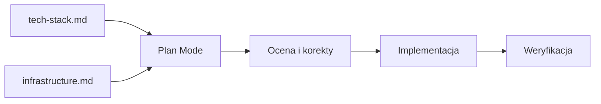
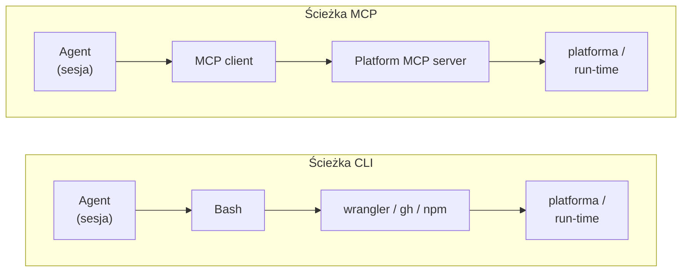

# Od localhosta na produkcję

## Wstęp

Na tym etapie szkolenia projekt działa już lokalnie, a agent zaczyna go coraz lepiej rozumieć. Moglibyśmy w tym stanie pozostać jeszcze długo, dodając kolejne funkcje, pliki i moduły - całość rosłaby w oczach a ty miałbyś złudne poczucie progressu.

Tylko że... lokalna aplikacja to dla twoich przyszłych użytkowników aplikacja, która nie istnieje.

Zamiast rozdmuchiwać aplikację "wszerz", zadbajmy więc o domknięcie pierwszego tygodnia w stylu end-to-end - od pomysłu (lekcja 1) do pierwszego deploymentu produkcyjnego (lekcja 5 - tu jesteśmy).

Drogę na produkcję przejdziemy myśląc nie tylko o projekcie, ale również o agencie AI, który powinien w tym procesie czuć się tak samo komfortowo, jak opiekun projektu. No dobra - to w którą stronę idziemy?

Klasyczny scenariusz wygląda tak: szukasz w Google "free hosting [twój framework]", trafiasz na pierwszy poradnik na Medium albo blog producenta platformy, klikasz "Deploy", aplikacja idzie na produkcję. Działa...

...do pierwszego problemu. Inny runtime, powolny build, problem z zależnościami, trudności z dodaniem usług wspierających główny projekt (baza, cache, analityka, etc.) - miało być inaczej.

Wybór platformy nie jest więc kosmetycznym, ostatnim krokiem przed udostępnieniem aplikacji. To decyzja, która zostaje z tobą na cały czas trwania projektu a my, zajmując się nią już teraz, wykonamy klasyczny de-risking dostarczenia rozwiązania klientowi. Widząc, że całość działa na produkcji, wrócimy do pracy nad ficzerami.

Tym domykamy moduł 1: zamiast deployować "na oko" lub "tak piszą w necie", chcemy podjąć świadomą decyzję o platformie i środowisku produkcyjnym. Dopasowaną do stacku i potencjału agentów AI.

Czas wyjść z localhosta.

Pobierz paczkę lekcyjną:

```bash
npx @przeprogramowani/10x-cli@latest get m1l5
```

Albo powiedz agentowi: *"pobierz paczkę z lekcji m1l5"* — skill `10x-cli-guide` zna komendy za ciebie.

## Core

### Łańcuch artefaktów modułu 1

Do tej pory każda lekcja modułu 1 zostawiała w repo konkretny plik albo stan. PRD opisuje co i dla kogo budujesz, tech-stack opisuje z czego, scaffoldowane repo daje punkt startu, a AGENTS.md uczy agenta lokalnych konwencji. Brakuje ostatniego ogniwa - **gdzie i jak to wszystko działa**.


To miejsce zapełnimy nowym artefaktem - `infrastructure.md`. Ale zanim do niego dojdziemy, warto zatrzymać się przy pytaniu, na które ten plik ma odpowiedzieć.

### Wybór platformy jako świadoma decyzja

W preworku [4.1] Cloudflare jest wymieniany jako rekomendowana ścieżka dla projektu szkoleniowego, który chcesz odtwarzać 1:1 z naszych lekcji - przystępny pricing, dobrze udokumentowane SDK, sensowne wsparcie dla agentów. 

Mógłbyś więc zatrzymać się na tym i ruszyć z `wrangler deploy` dla prezentowanego przez nas 10xCards, ale ważniejsze pytanie nie brzmi "co mentorzy rekomendują pod 10xDevs?", tylko "skąd wiesz, że to dobry wybór dla *tego* projektu, *tego* zespołu i *tej* aplikacji?".

Trzy pytania, na które warto mieć odpowiedź zanim klikniesz deploy:

- Czy platforma pasuje do twojego runtime'u i sposobu budowania aplikacji (SSR vs static, edge vs Node, długie procesy vs krótkie żądania)?
- Czy ma sensowny tryb pracy z agentem - udokumentowany i aktualny CLI, opcjonalny serwer MCP, logi dostępne przez API?
- Czy umiesz odpowiedzieć "jak wycofuję zmiany, jak skaluję serwery, ile zapłacę przy 10x ruchu" bez googlowania w panice?

Jeśli odpowiedzi nie masz, nie wybrałeś platformy - została wybrana za ciebie. Zróbmy to jeszcze raz - lepiej i bardziej uniwersalnie. Nie tylko pod Astro i 10xCards, ale pod projekt, który chcesz po prostu wdrożyć na produkcję.

### 10x-infra-research: research z agentem AI

W paczce skilli dla tej lekcji znajdziesz `10x-infra-research`. Skill ma trzy zadania - wyciągnąć z ciebie kontekst projektu, zebrać dane z sieci o platformach wchodzących w grę i porównać je w spójnej tabeli.

Wsadem będzie `context/foundation/tech-stack.md` (jeśli tego pliku nie masz, możesz go odtworzyć ręcznie albo zmodyfikować skill podając listę technologii wprost). Ważne, żeby agent rozumiał runtime, framework, bazę i planowane integracje.

Uruchomienie:

```text
/10x-infra-research
```

Założenia:


Co dzieje się w trakcie:

1. **Wywiad z tobą.** Skill dopyta o kilka rzeczy, których nie da się wyczytać z `tech-stack.md`: czy planujesz długo działające procesy, czy zależy ci na regionie EU, czy projekt ma być open source na potrzeby portfolio, czy budżet jest twardo ograniczony do free tier. Odpowiadasz `tak`/`nie`/`nie wiem` - ostatnia opcja jest tu legalna i ważna.

2. **Web research.** Agent czyta oficjalne dokumentacje platform pasujących do twojego stacku, sprawdza aktualny status feature'ów (preview/GA/beta), porównuje pricing, szuka znanych ograniczeń.

3. **Scored comparison.** Każda platforma dostaje Pass/Partial/Fail po pięciu kryteriach agent-friendly: jakość CLI (czy agent zrobi z terminala wszystko, bez klikania w panelu), stopień managed/serverless (mniej infrastruktury do utrzymania = mniej rzeczy do zepsucia), dokumentacja w formacie czytelnym dla agenta (MDX, `llms.txt`), stabilne i skryptowalne deployment API, oraz obecność serwera MCP albo innej first-class integracji. Wynik to tabela z notatkami, nie esej.

Pełną listę kryteriów i ich wagi znajdziesz w `SKILL.md` skilla - nie ma sensu kopiować ich tutaj, bo ewoluują razem z platformami. Zwróć uwagę na jedno: skill nie odpowiada za ciebie, "która platforma jest najlepsza". Zostawia ci tabelę i kontekst do podjęcia decyzji.

Warto dopowiedzieć, jaką dokładnie rolę gra tu skill - `10x-infra-research` jest procedurą - mówi agentowi *co po kolei zrobić*, żeby dojść do uzasadnionej rekomendacji. *Czym* to robi - dostępnymi narzędziami agenta, np. `WebFetch` do pobrania dokumentacji, `AskUserQuestion` pod interaktywny wywiad, itd. Skill bez narzędzi się nie obejdzie, narzędzia bez skilla zostawią cię z surowym Bashem i nadzieją, że agent sam coś z tego ułoży.

### Anti-Bias prompting - jak unikać "sugestii dopasowanych do ciebie"

Każdy research prowadzony z agentem ma jedną wbudowaną wadę. Modele językowe domyślnie dostosowują się do tego, co już od ciebie usłyszały - to zjawisko ma własną nazwę, [sycophancy](https://openai.com/index/sycophancy-in-gpt-4o/), i było kiedyś powodem mocnego bólu głowy w OpenAI. W praktyce oznacza to tyle, że jeśli półświadomie ciągnęło cię w stronę konkretnej platformy, scoring zostanie tak skonstruowany, żeby ta platforma wygrała. Twój research potwierdzi twoje przekonania, zamiast je przetestować.

Recepta jest prosta. Zamiast pytać agenta `czy platforma X nadaje się pod stack Y?`, pytasz `dlaczego platforma X to zły wybór pod stack Y?`.

Anti-bias to seria pytań ułożonych tak, żeby model nie miał drogi ucieczki. Zanim zatwierdzisz wynik, agent przepuszcza go przez trzy testy anti-biasu. To poszerza pulę dostępnych opcji i zwiększa twoją świadomość w wybranym obszarze.

**Devil's advocate - co najgorszego można powiedzieć o tym wyborze?**

Agent wciela się w sceptycznego architekta, którego jedynym zadaniem jest znaleźć wady, ukryte koszty i ryzyka technologii, która wygląda na zwycięską. Gdzie ta platforma zacznie cię uwierać? Jakie limity, których teraz nie widzisz, uderzą cię najpierw? Co na pierwszy rzut oka jest świetne, ale w drugim kwartale okaże się problemem? Cel nie jest udowodnić, że wybór jest zły - cel jest dostać brutalną listę słabości na piśmie.

**Pre-mortem - wyobraź sobie, że jest 3 miesiące później i żałujesz wyboru.**

Klasyczna technika research projektowych. Zamiast pytać "co może pójść nie tak?" - na co model ucieknie w ogólniki - zakładasz, że *już poszło nie tak*, i razem z agentem odtwarzasz scenariusz porażki. Jakie błędne założenia doprowadziły do tej decyzji? Której pułapki nie widziałeś z perspektywy dnia 1, ale po 90 dniach była oczywista? Pre-mortem zmienia perspektywę z prognozy na narrację, a narracje są o wiele bogatsze w konkrety niż abstrakcyjne listy ryzyk.

**Unknown unknowns - co nie trafiło do scoringu, bo nie pomyślałeś o tym pytaniu?**

Najtrudniejszy test, bo dotyczy rzeczy, o których nie wiedziałeś, że nie wiesz. Tu zadaniem agenta nie jest wymyślić nic sensacyjnego, tylko wymienić klasy ryzyk, które standardowy scoring uchwycił słabo lub w ogóle - compliance, backupy, ścieżki wyjścia z platformy, status produkcyjny konkretnego feature'a (GA czy beta?), zależności od decyzji innych zespołów. Te pytania powstają tylko wtedy, gdy ktoś o nie poprosi.

Każdy taki test kończy się jedną z trzech decyzji:

- **akceptuję ryzyko** - znam je, godzę się z nim, idę dalej.
- **dopisuję do `infrastructure.md` jako znane ograniczenie** - decyzja zostaje, ale ryzyko jest świadomie zapisane.
- **muszę zmienić wybór** - test pokazał coś, czego scoring nie wyłapał.

Trzecia opcja zdarza się rzadko, ale to właśnie dla niej robisz cały ten cross-check. Bez niej research zamienia się w ćwiczenie z racjonalizacji decyzji, którą i tak miałeś już podjętą.

Techniki unikania efektu potwierdzenia to znakomity sposób na to, aby dowolna konwersacja z AI przyniosła bardziej obiektywne, biorące pod uwagę różne scenariusze rezultaty. Trzy testy powyżej są wbudowane w skill, ale to nie wszystko, co warto mieć w głowie. Dwie dodatkowe techniki nie wymagają skilla - możesz je odpalić z poziomu zwykłego prompta, kiedy poczujesz, że agent zaczyna ci przytakiwać.

**Porównanie alternatyw - zmuś model do pokazania konkurencji.**

Zamiast prosić o ocenę jednego rozwiązania (na co model odpowie pochwałą), poproś o trzy alternatywne podejścia w tabeli porównawczej. Tabela wymusza spójną strukturę i utrudnia modelowi wybór "tego samego, ale w innych słowach". Działa wszędzie - od wyboru biblioteki, przez architekturę modułu, po decyzje organizacyjne typu "czy wprowadzać code review przez para-programming".

```text
Rozważam {{decyzję X}}.

Zamiast oceniać mój wybór, przedstaw mi trzy realne alternatywy. Dla każdej zrób
wiersz w tabeli Markdown z kolumnami: koszt wdrożenia, długoterminowy koszt
utrzymania, krzywa uczenia, kluczowe ograniczenie.
```

**Zmiana ról i perspektyw - ten sam pomysł oczami różnych ludzi.**

Każda decyzja wygląda inaczej z perspektywy osoby, która będzie z nią żyła. Twoja decyzja o platformie ucieszy backendowca, ale może wkurzyć osobę odpowiedzialną za bezpieczeństwo, która nie chce nowego dostawcy w audycie. Polecenie modelowi, żeby wcielił się po kolei w kilka konkretnych ról, ujawnia ciężary, których z pojedynczej perspektywy nie widzisz.

```text
Rozważam {{decyzję X}}.

Wciel się po kolei w trzy role z mojego zespołu - frontend developera, osoby
odpowiedzialnej za bezpieczeństwo i osoby odpowiedzialnej za koszty. Dla każdej
napisz, jak ta decyzja wpłynie na ich codzienną pracę i priorytety. Jeśli choć
jedna z tych osób zareaguje negatywnie, zaproponuj realną alternatywę.
```

Te dwie techniki dobrze uzupełniają trójkę ze skilla. Devil's advocate, pre-mortem i unknown unknowns testują *ten sam* wybór z różnych stron. Porównanie alternatyw i zmiana ról testują *przestrzeń* wokół wyboru - co jeszcze mogłeś wybrać i kto z tym wyborem będzie żył.

### infrastructure.md - nowy kontrakt

Wynik researchu i procesu anti-bias powinien trafić do pliku, który zostaje w repo na kolejne etapy pracy:

```text
context/foundation/infrastructure.md
```

To trzeci kontrakt w łańcuchu, który budujemy od początku modułu:


Plik jest krótki, ale ustrukturyzowany. Sensowny szkielet zawiera:

- **Wybór i uzasadnienie** - rekomendowana platforma + 2-3 zdania uzasadnienia.
- **Dopasowanie stacku** - jak runtime'y i build pasują do twojego frameworka (SSR vs static, edge vs Node, Workers vs Pages).
- **CLI / MCP / API fit** - co platforma daje agentowi do operability po deployment (jakie CLI, czy jest gotowy serwer MCP, czy logi są dostępne przez API).
- **Podgląd wdrożenia** - jak wyglądają preview deploymenty per PR, czy są chronione (np. Cloudflare Access dla prywatnych preview).
- **Sekrety** - gdzie trzymasz zmienne środowiskowe (panel platformy, GitHub Secrets, Cloudflare Workers Secrets), kto ma dostęp.
- **Rollback** - ile minut i ile kroków zajmuje cofnięcie wadliwego deploymentu; co konkretnie klikasz/wpisujesz.
- **Uprawnienia** - które akcje wymagają człowieka (publish do produkcji, rotate secret, drop bazy), które agent może robić sam.
- **Ryzyka** - lista znanych ograniczeń z anti-bias: limity, beta features, region restrictions, znane brzegowe przypadki.
- **Decyzje techniczne** - region, runtime, plan abonamentowy.
- **Sygnał zmiany decyzji** - co zmieni się w decyzji, gdy projekt wyjdzie z fazy MVP (pre-prod, dedykowana baza, wydzielony CDN).

Po co w ogóle ten plik?

Dwa powody. Pierwszy to zapowiedź nawyku `planowania przed implementacją`, który w praktyce będziemy realizować w drugim module i który ogólnie jest jedną z najszerzej stosowany praktyk w kontekście programowania z AI. Plik `infrastructure.md` jest wsadem do `Plan Mode` w następnej sekcji. Agent dostaje go razem z `tech-stack.md` i wie, co i gdzie wdraża.

Drugi - perspektywa średnio i długoterminowa. Kiedy projekt zacznie boleć ("dlaczego workery, jak teraz potrzebujemy CRONa?"), masz w repo zapis z datą, na podstawie czego podjęto decyzję. Możesz ją zrewidować świadomie, a nie przepisywać projekt w panice. To również pewien odpowiednik wzorca, który z powodzeniem stosuje wiele firm - tzw. Architectural Decision Record (ARD). Nie jest to główny wątek tej lekcji, ale o ADR dowiesz się więcej [pod tym linkiem](https://martinfowler.com/bliki/ArchitectureDecisionRecord.html).

Ważne - ostateczna treść `infrastructure.md` jest twoja. Dopisz biznesowy kontekst, zatwierdź ryzyka, dodaj rzeczy, które wiesz tylko ty.

Skill jest tu silnikiem, nie redaktorem.

### Deployment z Plan Mode

Wykonajmy teraz pierwsze wdrożenie aplikacji na wybraną platformę lub środowisko produkcyjne.

Wsadem tego procesu powinny być `infrastructure.md` i `tech-stack.md`. Agent wie, gdzie wdraża projekt i z czego jest on zbudowany. Czas na setup i realne wdrożenie.

Czego chcemy uniknąć? Klasycznego - "agent działa, ja patrzę". Jeśli coś pójdzie nie tak w połowie i będziesz musiał ratować sytuację, dobrze byłoby wiedzieć *co dokładnie miało się stać*, zamiast rekonstruować to z historii pracy Agenta.

Tu z pomocą przychodzi wbudowany w wiele narzędzi AI-Native tzw. **Plan Mode**.

To tryb, w którym agent działa *read-only*: czyta repo, ogląda zewnętrzne źródła, dopytuje cię o brakujące decyzje, ale nie modyfikuje plików ani nie wykonuje mutacji projektu. Końcowym efektem jest plan - tekstowy opis tego, co agent zamierza zrobić, krok po kroku. W sesji Claude Code przejdziesz do tego trybu skrótem `Shift+Tab` (cykl trybów: default → auto-accept → plan) - w IDE to zwykle dedykowany przycisk pod polem do wpisania wiadomości do agenta.

Jak posługiwać się planem? To proste:

1. **Zainicjalizuj Plan Mode.** Agent w trybie planowania czyta wsad (`infrastructure.md`, `tech-stack.md`), ewentualnie dopytuje o luki i zwraca plan procedurę wdrożenia.
2. **Ocena.** Czytasz plan. Jeśli czegoś brakuje albo coś jest źle - mówisz to wprost. Nie akceptujesz od razu.
3. **Zatwierdzenie.** Akceptujesz plan. Dopiero teraz agent wychodzi z trybu plan i przechodzi do wykonania zadania.
4. **Referencja.** Plan zostaje w projekcie. Kiedy coś pójdzie nie tak (a w pierwszym deployu zwykle idzie), masz konkretny dokument, do którego można zaglądnąć i odpowiedzieć na pytanie "co miało się stać?".

Przy tej okazji warto też wrócić do skilla `/10x-lesson` - jeśli zauważysz, że dany skill lub fragment pracy agenta nie odpowiada twoim preferencjom (np. w planie analizowany jest nieistotny zakres repozytorium), dodaj to info do reguł na przyszłość.

Efekt netto: agent działa bardziej przewidywalnie, a ty masz punkt odniesienia, który nie znika razem z kontekstem.



Wsad do Plan Mode może się różnić w zależności od zadania. Teraz to dwa pliki referencyjne i krótki cel: "Wykonajmy pierwsze wdrożenie w oparciu o `@infrastructure.md`, zgodnie ze stackiem z `@tech-stack.md`".

Plan, który wygeneruje agent, powinien zawierać:

- kroki automatyczne, które będą wykonane przez agenta
- listę kont i serwisów, które trzeba skonfigurować ręcznie (konto Cloudflare, ewentualnie zewnętrzna baza),
- listę sekretów do skonfigurowania (zmienne środowiskowe, klucze API),
- konkretne komendy wdrożeniowe w formie dokumentacji (`wrangler pages deploy` albo `wrangler deploy` w zależności od wyboru Pages vs Workers - to nie są te same komendy),

Po zatwierdzeniu planu agent wykonuje te kroki, gdzie sam przypisał się jako "owner". Twoja rola może dotyczyć uzupełniania luk, konfiguracji sekretów czy weryfikacji stanu końcowego. Obserwuj, czy agent nie próbuje czegoś, czego nie ma w planie.

Zatwierdzony plan zostaje w repo jako `context/deployment/deploy-plan.md`. To nie jest "dokument na półkę" - w kolejnej lekcji, kiedy będziemy planować milestony implementacji samego MVP, agent dostanie ten plik jako kontekst, żeby wiedzieć, co już jest postawione, jakie sekrety są skonfigurowane i z jakich gotowych ścieżek deploy korzysta projekt.

## Deep Dive

### CLI vs MCP - jak agent korzysta z żywej aplikacji

Aplikacja jest wdrożona, ale to nie koniec - cała przygoda z utrzymaniem produkcji tak naprawdę się rozpoczyna. Na skutek kolejnych rozszerzeń, zmian czy decyzji, twoja aplikacja zacznie tutaj żyć własnym życiem. Czasami wszystko będzie pod kontrolą, a czasami będzie to stan, z którego nie jesteś zadowolony. I tutaj również z pomocą przychodzi agent AI.

Na przykładzie komunikacji z produkcją rozpoczniemy tutaj wątek, który będzie się przewijał przez wiele kolejnych lekcji - integrację agenta z zewnętrznymi usługami poprzez CLI (narzędzia terminalowe) oraz [MCP](https://modelcontextprotocol.io/docs/getting-started/intro) (dedykowany protokół zewnętrzny).

To jedna z najbardziej istotnych różnic pomiędzy chatbotem żyjącym w przeglądarce, a agentem, który może realnie pracować dla nas. Oczywiście zrobi to tylko wtedy, kiedy poinformujemy go o konkretnych narzędziach i nowych możliwościach.

W preworku [2.1] mówiliśmy, że terminal (nie tylko agentowy, ale po prostu powłoka systemowa) to uniwersalne środowisko dla wielu narzędzi - wszystko, co da się wykonać w terminalu, agent też potrafi wykonać. To pierwsza ścieżka **agentic operability**: dajesz agentowi narzędzia takie jak `wrangler`, `gh`, `npm`, `psql`, agent woła je przez Bash, zbiera output, podejmuje kolejne decyzje.

Druga ścieżka to **MCP** (Model Context Protocol). Zamiast wywoływać dowolne komendy shellowe, agent rozmawia z dedykowanym serwerem, który eksponuje konkretny zestaw narzędzi - na przykład "lista deploymentów", "logi z ostatniej godziny", "zmienne środowiskowe projektu". Każde narzędzie ma jawnie zdefiniowany schemat wejścia i wyjścia, a serwer pilnuje uprawnień.



W praktyce nie jest to walka "CLI vs MCP". Anthropic w swoim [tekście o agentach produkcyjnych](https://claude.com/blog/building-agents-that-reach-production-systems-with-mcp) pisze wprost: API, CLI i MCP to trzy uzupełniające się drogi. Dojrzała platforma często udostępnia wszystkie trzy. Netlify w dokumentacji [zaleca instalację swojego CLI razem z serwerem MCP](https://docs.netlify.com/welcome/build-with-ai/netlify-mcp-server/), bo MCP używa pod spodem CLI tam, gdzie to ma sens.

Kiedy CLI jest wystarczające, a kiedy warto sięgnąć po MCP?

- **CLI** sprawdza się przy operacjach, które chcesz mieć **jawne i audytowalne**. Komenda zostaje w terminalu, output zostaje w terminalu, łatwo to wkleić do raportu albo failure-modes.md. Idealne dla MVP - mało setupu, zero dodatkowej infrastruktury.
- **MCP** zaczyna mieć sens, gdy agent ma działać w środowiskach, gdzie shell jest niepraktyczny (cloud agent, zdalna sesja bez dostępu do twojego terminala), albo gdy operacja wymaga **discovery** - agent ma sam znaleźć "która komenda służy do X", a nie czytać 30-stronicową dokumentację CLI.

Jest jeszcze jeden argument na korzyść CLI dla MVP - **bezpieczniejsze defaulty**. Netlify CLI dobrze to ilustruje: `netlify deploy` domyślnie robi *draft deploy* (ląduje pod tymczasowym URL-em do podglądu), a publikacja na produkcję wymaga jawnej flagi `--prod`. Komenda wprost wymaga, żeby ktoś świadomie powiedział "tak, na produkcję". Z MCP to ta sama operacja może być pojedynczym wywołaniem narzędzia, które nie ma analogicznej bramki - chyba że serwer MCP sam ją wymusi.

Jest też koszt. Każdy podłączony serwer MCP wnosi do okna kontekstowego wszystkie definicje swoich narzędzi. Przy kilku serwerach naraz potrafi to zjeść tysiące tokenów na... samym ich schemacie. Anthropic [opisuje praktyczne mitygacje](https://www.anthropic.com/engineering/code-execution-with-mcp), takie jak progressive disclosure i lazy loading, które poznałeś choćby przy okazji tematu Skilli (zaczynamy od metadanych, na skutek decyzji ładujemy definicję API, a na koniec instruujemy agenta do korzystania z aktywnego MCP).

Społeczność praktyków też ma na ten temat wyrobione zdanie. W [dyskusjach na HN](https://news.ycombinator.com/item?id=47392011) wokół CLI vs MCP najczęściej powtarza się jedna myśl: `CLI is great when you know what command to run. MCP is great when the agent decides what to run`. Dla nas to praktyczna wskazówka - dobierz interfejs do zadania, nie do mody.

### Demo: gotowy serwer MCP w sesji

Najszybsza droga, żeby zobaczyć to w działaniu, to podłączyć gotowy serwer MCP swojego hostingu. Skoro deployujemy na Cloudflare, sięgamy po Cloudflare MCP.

W Claude Code dodajesz serwer w pliku `.mcp.json` w repo (alternatywnie - przez `claude mcp add`):

```json
{
  "mcpServers": {
    "cloudflare": {
      "command": "npx",
      "args": ["mcp-remote", "<url-serwera-z-dokumentacji-platformy>"]
    }
  }
}
```

Po restarcie sesji agent ma do dyspozycji nowe narzędzia.


Możesz go zapytać "sprawdź status ostatniego deploymentu na Cloudflare Pages dla projektu 10xCards" - agent woła odpowiednie narzędzie MCP, dostaje strukturalną odpowiedź, prezentuje ci wynik.


#### Ta sama operacja przez wrangler CLI

Cloudflare ma też dojrzały CLI - `wrangler` - i większość rzeczy, które robi MCP, da się wykonać przez niego bez podłączania serwera. To dobry moment, żeby pokazać, czym te dwie ścieżki różnią się w praktyce.

**Przez MCP (po podłączeniu serwera):**

```text
Ty: "sprawdź status ostatniego deploymentu Pages projektu 10xcards"
Agent: woła narzędzie MCP `pages_deployments_list`
       → strukturalny JSON z metadanymi
       → formatuje odpowiedź dla ciebie
```

**Przez CLI (wrangler w Bash):**

```bash
wrangler pages deployment list --project-name 10xcards
```

Agent woła tę komendę przez Bash, parsuje tabelę z terminala i przygotowuje podsumowanie. Output jest tekstowy, nie strukturalny - agent musi go zinterpretować, ale za to każdy krok zostaje w historii terminala.

Co konkretnie się różni:

- **Setup.** MCP wymaga jednorazowej konfiguracji w `.mcp.json` i odpowiednich credentiali. CLI wymaga zalogowania poza sesją agenta (`wrangler login` raz) i jest gotowe do użycia.
- **Format.** MCP zwraca JSON ze schematem. CLI zwraca tekst (czasami z flagą `--json` da się wymusić strukturę). Dla agenta JSON jest tańszy w parsowaniu. CLI nie musi być tworzone konkretnie pod AI - MCP to standard niemal natywny.
- **Discovery.** Pytanie "co umiesz zrobić z Cloudflare Pages?" - MCP odpowie listą narzędzi z opisami. CLI to zwykle start od `--help` i czytania outputu, krok po kroku.
- **Audyt.** CLI zostawia historię w terminalu i może iść do logów shell. MCP rozmawia ze swoim serwerem - audyt zależy od tego, co serwer loguje po stronie platformy.
- **Koszt kontekstu.** Każdy podłączony serwer MCP wnosi do okna model definicje swoich narzędzi. CLI nic nie wnosi, dopóki go nie wywołasz - ale za to opisy w `--help` przy każdym wywołaniu lądują w kontekście jako tekst.

Uwaga - jeśli korzystasz z wewnętrznego CLI (lub nawet `10x-cli`), definicje narzędzi i sposób obsługi tak czy tak powinieneś umieścić gdzieś w kontekście modelu (skill, rules, inline prompt). Inaczej model nie poradzi sobie z obsługą i spali mnóstwo tokenów na metodzie prób i błędów (stąd u nas dedykowany skill do obsługi narzędzia).

W kontekście projektów MVP, CLI często wygrywa prostotą. MCP zaczyna opłacać się w momencie, gdy agent ma wykonywać dziesiątki kontekstowych zapytań ("pokaż mi logi z błędem 500 z ostatnich 24h", "porównaj rozmiar bundle'a między dwoma deploymentami") - tam discovery i strukturalna odpowiedź realnie redukują ilość kroków. 

Najlepszy punkt startu? Zacznij od CLI, dołóż MCP, gdy zauważysz powtarzający się wzorzec zapytań, których agent musi się dopytywać przez `--help`.

Konfiguracja innego gotowego serwera jest analogiczna - zmieniasz endpoint i ewentualnie sposób autoryzacji:

- **Vercel MCP** - https://vercel.com/docs/ai-resources/vercel-mcp
- **Netlify MCP** - https://docs.netlify.com/welcome/build-with-ai/netlify-mcp-server/
- **GitHub MCP** - https://github.com/github/github-mcp-server

Wzorzec jest ten sam, kod jest specyficzny dla platformy. Jeśli wybrałeś hosting bez gotowego MCP, CLI z odpowiednim narzędziem (`wrangler`, `flyctl`, `vercel`) załatwia sprawę bez kompromisu.

> Część serwerów MCP (m.in. Vercel MCP, AWS Deployment SOPs) jest ciągle w **beta** - sprawdź status feature'a i regiony przed użyciem produkcyjnym.

### Granica dostępu agenta do produkcji

⚠ Korzystając zarówno z CLI jak i MCP, agent może uzyskać bezpośredni dostęp do twojej infrastruktury. To jest moment, w którym warto się zatrzymać.

Pytanie podstawowe brzmi tak: **czy ten dostęp jest absolutnie konieczny, żeby agent zrobił to, co ma zrobić?**

Dla MVP na 10xCards odpowiedź zwykle brzmi "tak, do diagnostyki i logów". Nie brzmi "tak, do dropowania bazy" ani "tak, do rotowania wpisów w DNS". Wzorzec bezpieczeństwa jest prosty: **minimalne uprawnienia, ludzka autoryzacja na rzeczach nieodwracalnych**.

W praktyce na Cloudflare wygląda to tak:

- **Tworzysz token API w panelu Cloudflare**, nie używasz głównego klucza konta. Token ma zawężony scope - tylko do tej części platformy, którą agent realnie używa (Pages albo Workers dla *jednego* konkretnego projektu). Bez DNS, bez Workers Secrets dla nieobjętych projektów, bez billing.
- **Token wkładasz w zmienną środowiskową**, nie w `.mcp.json` zatwierdzony do repo. Agent dostaje go pośrednio przez serwer MCP lub env discovery wybranego CLI, nie wklejasz go w okno rozmowy.
- **Akcje destrukcyjne robisz sam.** Jeśli agent sugeruje "usuń projekt z panelu" albo "zrotuj główny secret", logujesz się do panelu i robisz to manualnie. Manualne kliknięcie kosztuje 30 sekund, sprzątanie po automatycznej pomyłce - kilka godzin.

Wzorzec działa identycznie na innych chmurach. Na AWS i GCP odpowiednikiem są role IAM ze scope'owanym dostępem i `console-only-user` i minimalny zakres uprawnień, jaki przydzielisz danemu użytkownikowi / tokenowi.

To jest setup na MVP. Kiedy projekt rośnie, naturalna ewolucja prowadzi w stronę odseparowanego pre-prod environment - agent dostaje pełny dostęp do staging, a do produkcji ma tylko read-only. To temat, który omówimy w kolejnych modułach.

## Materiały Dodatkowe

- **Plan Mode in Claude Code** / Anthropic / https://docs.claude.com/en/docs/claude-code/common-workflows#use-plan-mode-for-safe-code-analysis - oficjalna dokumentacja trybu plan, w tym jak go włączać i co działa w trybie *read-only*.
- **Building agents that reach production systems with MCP** / Anthropic / https://claude.com/blog/building-agents-that-reach-production-systems-with-mcp - dlaczego API, CLI i MCP są ścieżkami uzupełniającymi, nie wykluczającymi.
- **Code execution with MCP: Building more efficient agents** / Anthropic Engineering / https://www.anthropic.com/engineering/code-execution-with-mcp - praktyczne ograniczenia MCP w długich sesjach: progressive disclosure i tool search.
- **Skills explained: How Skills compares to prompts, Projects, MCP, and subagents** / Anthropic / https://www.claude.com/blog/skills-explained - skille jako warstwa procedur, MCP jako warstwa narzędzi.
- **Connect Claude Code to tools via MCP** / Anthropic / https://docs.anthropic.com/en/docs/claude-code/mcp - jak konfigurować serwery MCP w sesjach Claude Code.
- **Wrangler — Cloudflare Workers docs** / Cloudflare / https://developers.cloudflare.com/workers/wrangler/ - pełne CLI dla Cloudflare; uwaga na różnice między komendami Workers i Pages.
- **Cloudflare Pages Direct Upload** / Cloudflare / https://developers.cloudflare.com/pages/get-started/direct-upload/ - alternatywna ścieżka deploy bez integracji Git.
- **Cloudflare Pages Preview Deployments** / Cloudflare / https://developers.cloudflare.com/pages/configuration/preview-deployments/ - preview URL per PR z ochroną Cloudflare Access.
- **Netlify MCP Server** / Netlify / https://docs.netlify.com/welcome/build-with-ai/netlify-mcp-server/ - przykład dobrze zaprojektowanej kombinacji CLI + MCP od jednego dostawcy.
- **Netlify CLI: deploy command** / Netlify / https://cli.netlify.com/commands/deploy/ - draft deploy domyślnie, `--prod` dla produkcji - przykład bezpiecznego defaultu w CLI.
- **Vercel MCP** / Vercel / https://vercel.com/docs/ai-resources/vercel-mcp - alternatywny, OAuth-backed serwer MCP, na razie w wersji beta.
- **GitHub Actions: Deployments and environments** / GitHub Docs / https://docs.github.com/en/actions/reference/deployments-and-environments - approval gates i ochrona środowisk dla bardziej dojrzałych pipeline'ów.
- **gh run view manual** / GitHub CLI / https://cli.github.com/manual/gh_run_view - read-only diagnostyka pipeline'u z terminala (`--log-failed` zwraca tylko fragment z błędem).
- **HN: CLI. Always CLI. Never MCP - and replies** / community / https://news.ycombinator.com/item?id=47392011 - sygnał praktyków: prawdziwy problem to "too many tool definitions", nie sam wybór interfejsu.
